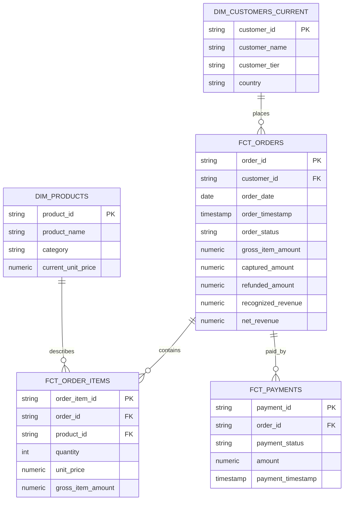
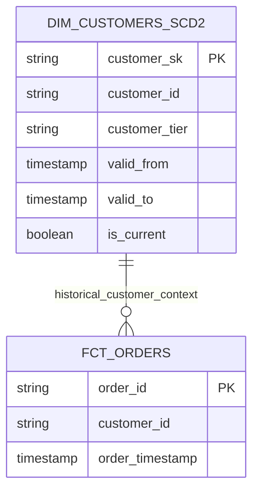
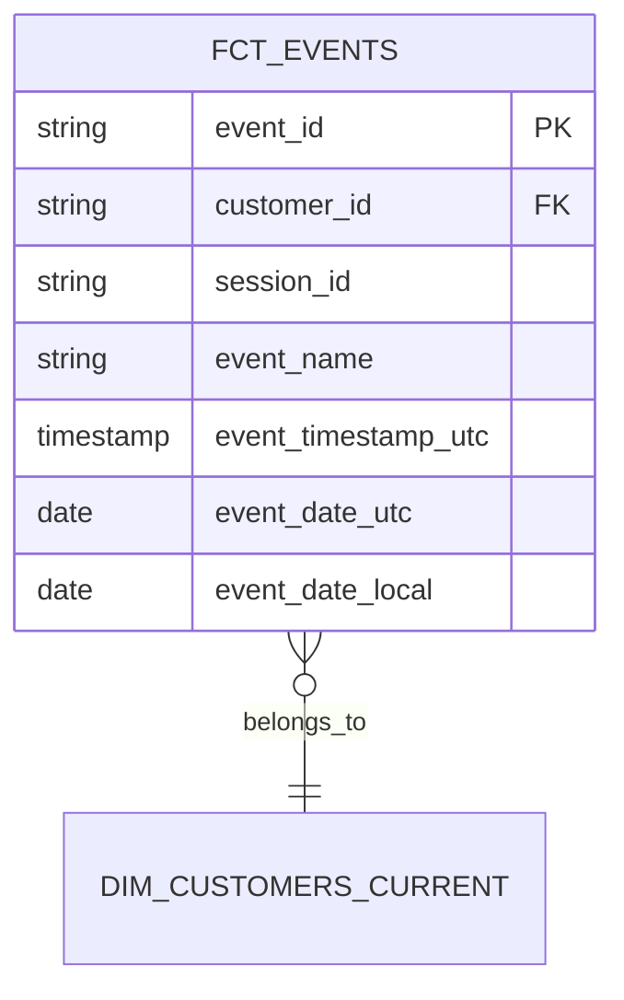

# ERD and Architecture

## Core Star Schema



## SCD2 Customer Dimension



Join requires:

```text
customer_id + order_timestamp between valid_from and valid_to
```

Joining only by `customer_id` is wrong and can duplicate rows.

## Event Modeling



## Mart Layer

```text
fct_orders -> mart_daily_revenue
fct_orders + dim_customers_current -> mart_customer_ltv
fct_order_items + dim_products -> mart_product_performance
fct_events -> mart_daily_active_users
```

Each mart has a business-facing grain and metric definition.

