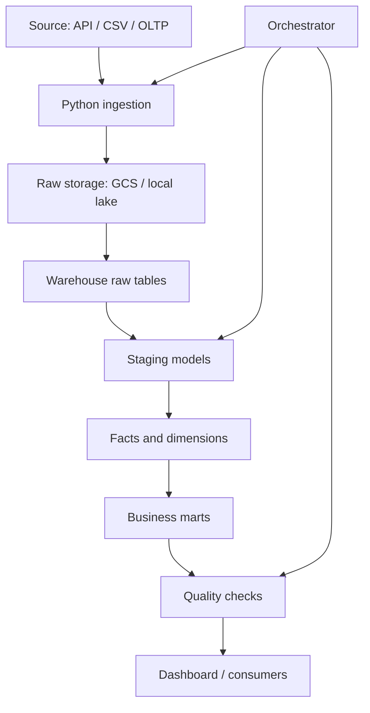

# Architecture Diagram Template

## Text Diagram

```text
Source system
  |
  | extract
  v
Ingestion layer
  |
  | write raw
  v
Raw storage
  |
  | load
  v
Warehouse raw tables
  |
  | transform
  v
Staging models
  |
  | model
  v
Facts and dimensions
  |
  | aggregate
  v
Marts
  |
  | validate/publish
  v
Dashboard / analytics consumers
```

## Mermaid Template



## Diagram Review Checklist

- Does the diagram show data source?
- Does it show raw storage?
- Does it show transformation layer?
- Does it show quality checks?
- Does it show orchestration?
- Does it show final consumers?
- Does each arrow represent a real movement or transformation?

## Bad Diagram Signs

- Only lists tools, not data flow.
- No raw layer.
- No quality checks.
- No failure boundary.
- No serving layer.
- Too many decorative boxes without meaning.

