# Architecture Diagrams

## Batch ELT

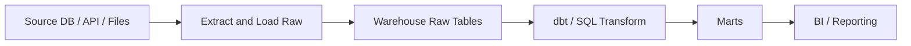

Failure focus:

- Source extraction delay.
- Bad incremental watermark.
- dbt test failure.
- Late arriving data.

## Batch ETL

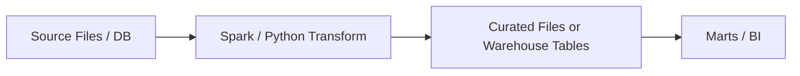

Failure focus:

- Transform logic hidden outside warehouse.
- Raw not preserved.
- Spark job failure.

## CDC to Warehouse

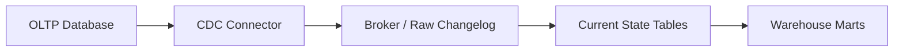

Failure focus:

- WAL/binlog retention.
- Deletes ignored.
- Out-of-order updates.
- Schema drift.

## Event Streaming

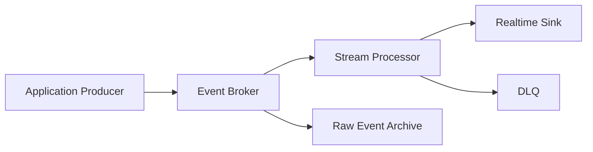

Failure focus:

- Duplicate events.
- Poison pill.
- Consumer lag.
- Idempotent sink.

## Micro-batch

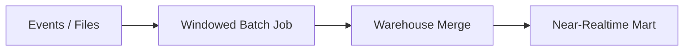

Failure focus:

- Window overlap duplicates.
- Late-arriving events.
- Frequent merge cost.

## Medallion

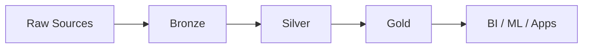

Failure focus:

- Bad data passing quality gate.
- Layer ownership unclear.
- Gold table wrong but raw replay possible.

## Lambda

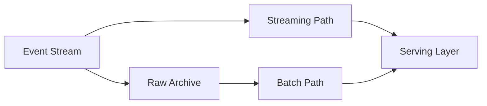

Failure focus:

- Batch and streaming logic drift.
- Serving layer reconciliation.

## Kappa

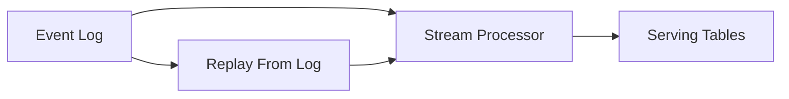

Failure focus:

- Replay cost.
- Log retention.
- Stream logic correctness.

## Outbox

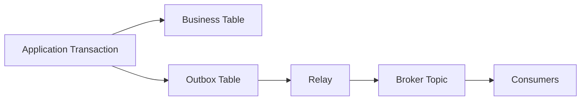

Failure focus:

- Relay lag.
- Duplicate publish.
- Consumer idempotency.

## DLQ / Quarantine

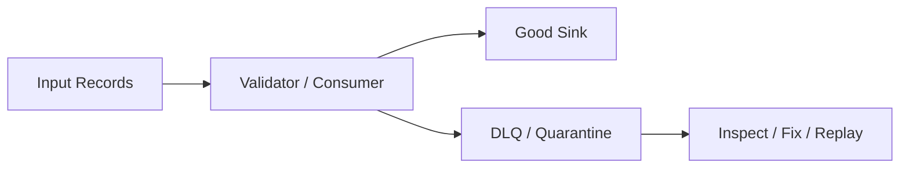

Failure focus:

- DLQ not monitored.
- No replay owner.
- Bad records silently accumulate.

## Fan-out

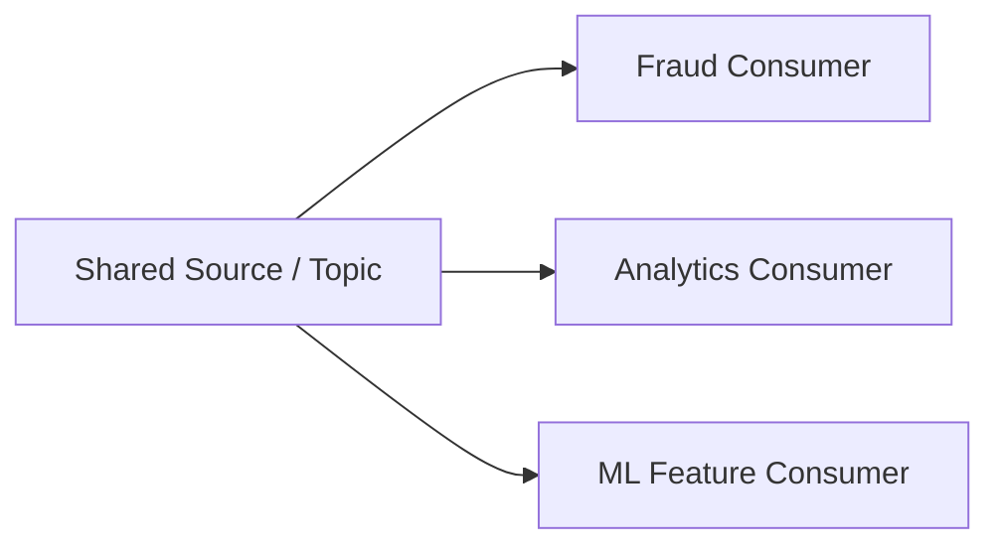

Failure focus:

- Schema change breaks many consumers.
- Ownership unclear.

## Fan-in

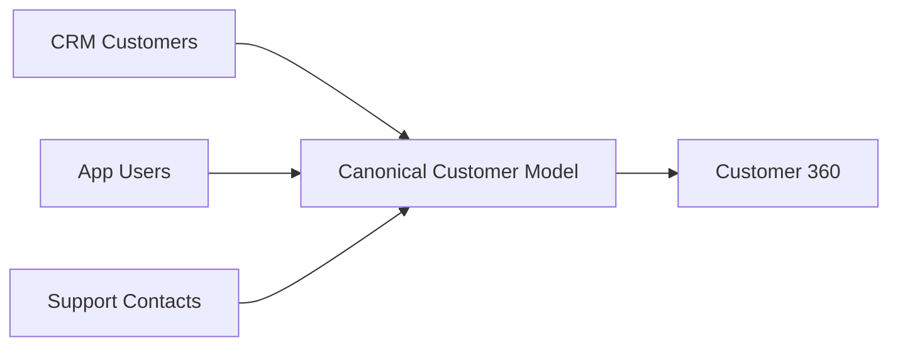

Failure focus:

- Identity resolution.
- Source precedence.
- Semantic mismatch.

