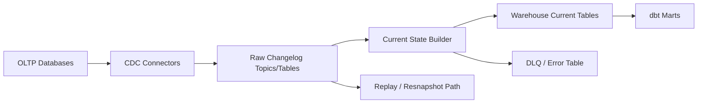

# Diagram - CDC Ingestion Platform

## Bottlenecks

- Source log retention.
- Connector lag.
- Sink merge cost.
- Schema changes.

## Reliability

- Changelog retention.
- Delete handling.
- Source log position tracking.
- Resnapshot plan.
- Current-state reconciliation.

