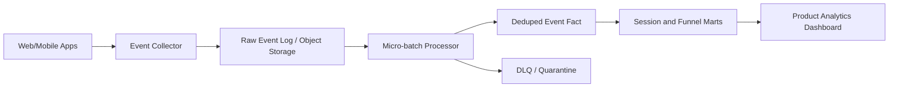

# Diagram - Clickstream Analytics

## Bottlenecks

- Event volume spikes.
- Late/out-of-order events.
- Sessionization state.
- Small files if micro-batch writes too often.

## Reliability

- Event ID deduplication.
- Raw archive for replay.
- DLQ for malformed events.
- Late event correction window.

