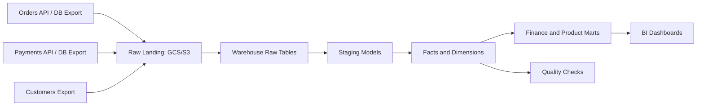

# Diagram - Ecommerce Warehouse

## Bottlenecks

- API rate limits.
- Late-arriving payments/refunds.
- Warehouse full scans.
- Incorrect joins causing duplicated revenue.

## Reliability

- Raw immutable files.
- Partition-level backfill.
- Reconciliation between payments and orders.
- Freshness checks before dashboard publish.

