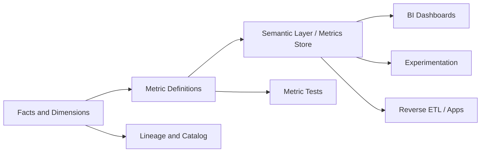

# Diagram - Metrics Platform

## Bottlenecks

- Conflicting metric definitions.
- Query performance for common metrics.
- Ownership and approval workflow.
- Backfill when metric logic changes.

## Reliability

- Metric contracts.
- Versioned definitions.
- Reconciliation checks.
- Downstream impact analysis.

