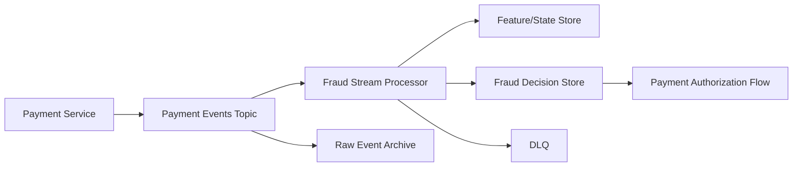

# Diagram - Realtime Fraud Detection

## Bottlenecks

- Broker partitions.
- Feature lookup latency.
- Stream processor state size.
- Downstream decision store write latency.

## Reliability

- Event ID.
- Idempotent decision writes.
- DLQ and replay.
- Lag monitoring.
- Timeout fallback policy.

