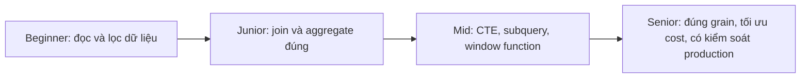
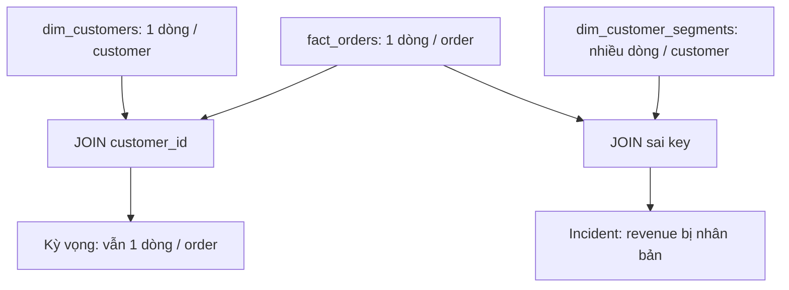
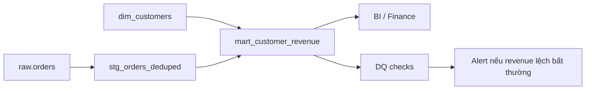

# 01 SQL Fundamentals

## 1. Introduction

SQL là nền móng bắt buộc của Data Engineer. Ở cấp fresher, bạn cần viết được `SELECT`, `JOIN`, `GROUP BY`. Ở cấp senior, bạn phải biết truy vấn của mình có đúng grain không, có làm nhân bản dữ liệu không, có tốn chi phí không, có dễ debug khi incident xảy ra không.

Mục tiêu của file này:

- Đi từ cơ bản đến tư duy production.
- Nắm chắc `SELECT`, `JOIN`, `GROUP BY`, `HAVING`, subquery, CTE, window functions, set operations.
- Có ví dụ PostgreSQL và Oracle.
- Biết lỗi phổ biến, anti-patterns, tối ưu performance, cost, monitoring.



## 2. Theory

### Thứ tự xử lý logic của SQL

SQL không chạy theo đúng thứ tự bạn viết. Thứ tự logic thường là:

1. `FROM`
2. `JOIN`
3. `WHERE`
4. `GROUP BY`
5. Aggregate functions
6. `HAVING`
7. Window functions
8. `SELECT`
9. `DISTINCT`
10. `ORDER BY`
11. `LIMIT` hoặc `FETCH`

Hiểu thứ tự này giúp bạn tránh lỗi như dùng alias trong `WHERE`, lọc aggregate sai chỗ, hoặc window function bị dùng sai tầng query.

### SELECT

`SELECT` chọn cột hoặc biểu thức. Trong production, tránh `SELECT *` vì:

- Schema thay đổi có thể làm downstream hỏng.
- Quét nhiều cột hơn, tốn tiền hơn trên warehouse tính phí theo bytes scanned.
- Có thể vô tình lộ dữ liệu nhạy cảm.
- Làm contract dữ liệu không rõ ràng.

### JOIN

`JOIN` là nơi nhiều bug production xuất hiện nhất. Trước khi join, luôn hỏi:

- Bảng trái grain là gì?
- Bảng phải grain là gì?
- Key join có unique không?
- Quan hệ là one-to-one, one-to-many hay many-to-many?
- Join có làm tăng số dòng ngoài dự kiến không?



### GROUP BY và HAVING

`GROUP BY` đổi grain dữ liệu. Nếu input là một dòng trên mỗi đơn hàng, `GROUP BY customer_id` biến output thành một dòng trên mỗi khách hàng.

`WHERE` lọc trước khi aggregate. `HAVING` lọc sau khi aggregate.

### Subquery và CTE

Subquery phù hợp cho logic nhỏ. CTE phù hợp khi cần chia truy vấn thành các bước dễ đọc, dễ review, dễ test.

Senior không chỉ viết query chạy được. Senior viết query mà người khác đọc được và debug được.

### Window Functions

Window function tính toán trên một nhóm dòng nhưng không làm giảm số dòng như `GROUP BY`.

Các hàm hay dùng:

- `ROW_NUMBER()` để dedup hoặc lấy top 1.
- `RANK()` và `DENSE_RANK()` để xếp hạng.
- `LAG()` và `LEAD()` để so sánh dòng trước/sau.
- `SUM() OVER` để tính running total.

### Set Operations

- `UNION ALL`: gộp dữ liệu, giữ duplicate, nhanh hơn.
- `UNION`: gộp và loại duplicate, tốn sort/hash.
- `INTERSECT`: lấy phần giao.
- `EXCEPT` trong PostgreSQL hoặc `MINUS` trong Oracle: lấy phần chênh lệch.

## 3. Real-world example

Bài toán production: xây bảng `mart_customer_revenue` từ đơn hàng.

Yêu cầu:

- Chỉ tính đơn hàng `PAID`.
- Dedup đơn hàng raw theo `order_id`, lấy bản ghi mới nhất.
- Join customer để lấy `country`.
- Output grain: một dòng trên mỗi `customer_id`.
- Có kiểm tra duplicate, null key, row count, và revenue drift.



Incident thực tế: một bảng dimension từ một dòng trên mỗi customer đổi thành nhiều dòng lịch sử trên mỗi customer. Query vẫn join bằng `customer_id`, làm doanh thu bị nhân 2-3 lần. Fix đúng là kiểm tra uniqueness hoặc join theo effective date nếu là SCD Type 2.

## 4. SQL example

### PostgreSQL: SELECT, JOIN, GROUP BY, HAVING

```sql
SELECT
    c.customer_id,
    c.country,
    COUNT(o.order_id) AS paid_order_count,
    SUM(o.amount) AS total_revenue
FROM fact_orders o
JOIN dim_customers c
  ON o.customer_id = c.customer_id
WHERE o.order_status = 'PAID'
  AND o.order_date >= DATE '2026-01-01'
GROUP BY
    c.customer_id,
    c.country
HAVING SUM(o.amount) >= 1000
ORDER BY total_revenue DESC
LIMIT 100;
```

### Oracle: SELECT, JOIN, GROUP BY, HAVING

```sql
SELECT
    c.customer_id,
    c.country,
    COUNT(o.order_id) AS paid_order_count,
    SUM(o.amount) AS total_revenue
FROM fact_orders o
JOIN dim_customers c
  ON o.customer_id = c.customer_id
WHERE o.order_status = 'PAID'
  AND o.order_date >= DATE '2026-01-01'
GROUP BY
    c.customer_id,
    c.country
HAVING SUM(o.amount) >= 1000
ORDER BY total_revenue DESC
FETCH FIRST 100 ROWS ONLY;
```

### PostgreSQL: CTE và dedup bằng window function

```sql
WITH ranked_orders AS (
    SELECT
        order_id,
        customer_id,
        order_status,
        amount,
        updated_at,
        ingestion_time,
        ROW_NUMBER() OVER (
            PARTITION BY order_id
            ORDER BY updated_at DESC, ingestion_time DESC
        ) AS rn
    FROM raw_orders
),
deduped_orders AS (
    SELECT *
    FROM ranked_orders
    WHERE rn = 1
)
SELECT
    customer_id,
    SUM(amount) AS paid_revenue
FROM deduped_orders
WHERE order_status = 'PAID'
GROUP BY customer_id;
```

### Oracle: CTE và dedup bằng window function

```sql
WITH ranked_orders AS (
    SELECT
        order_id,
        customer_id,
        order_status,
        amount,
        updated_at,
        ingestion_time,
        ROW_NUMBER() OVER (
            PARTITION BY order_id
            ORDER BY updated_at DESC, ingestion_time DESC
        ) AS rn
    FROM raw_orders
),
deduped_orders AS (
    SELECT *
    FROM ranked_orders
    WHERE rn = 1
)
SELECT
    customer_id,
    SUM(amount) AS paid_revenue
FROM deduped_orders
WHERE order_status = 'PAID'
GROUP BY customer_id;
```

### Set operations

PostgreSQL:

```sql
SELECT order_id FROM expected_orders
EXCEPT
SELECT order_id FROM loaded_orders;
```

Oracle:

```sql
SELECT order_id FROM expected_orders
MINUS
SELECT order_id FROM loaded_orders;
```

## 5. Python example

Python thường dùng để validate output SQL, chạy reconciliation, hoặc tạo monitoring metrics.

```python
import logging
import psycopg2

logger = logging.getLogger(__name__)


def check_duplicate_orders(connection) -> None:
    query = """
        SELECT COUNT(*) AS duplicate_keys
        FROM (
            SELECT order_id
            FROM fact_orders
            GROUP BY order_id
            HAVING COUNT(*) > 1
        ) x
    """
    with connection.cursor() as cursor:
        cursor.execute(query)
        duplicate_keys = cursor.fetchone()[0]

    if duplicate_keys > 0:
        raise RuntimeError(f"Duplicate order_id detected: {duplicate_keys}")

    logger.info("Duplicate order check passed")
```

Ví dụ tư duy senior: query thành công không đủ. Bạn cần tự động kiểm tra output có đúng contract hay không.

## 6. Optimization

### Performance optimization

- Chỉ chọn cột cần thiết, tránh `SELECT *`.
- Filter partition sớm bằng `WHERE order_date >= ...`.
- Join bằng key cùng data type.
- Aggregate trước khi join nếu có thể giảm dữ liệu.
- Kiểm tra duplicate ở dimension trước khi join.
- Dùng index trong PostgreSQL/Oracle cho cột filter và join quan trọng.
- Tránh function trên cột join/filter nếu làm mất khả năng dùng index.

Bad:

```sql
WHERE DATE(created_at) = DATE '2026-05-07'
```

Better:

```sql
WHERE created_at >= TIMESTAMP '2026-05-07 00:00:00'
  AND created_at < TIMESTAMP '2026-05-08 00:00:00'
```

### Cost optimization

- Trên cloud warehouse, giảm bytes scanned là ưu tiên.
- Materialize intermediate table nếu nhiều dashboard cùng dùng.
- Dùng `UNION ALL` thay vì `UNION` nếu không cần dedup.
- Không sort toàn bộ dữ liệu nếu không cần.
- Lưu bảng fact partition theo ngày sự kiện hoặc ngày ingest.

### Monitoring

Theo dõi:

- Row count theo ngày.
- Null rate của key.
- Duplicate rate.
- Join match rate.
- Runtime query.
- Bytes scanned hoặc logical reads.
- Revenue drift so với ngày trước.

PostgreSQL check:

```sql
SELECT
    CURRENT_DATE AS check_date,
    COUNT(*) AS row_count,
    COUNT(DISTINCT order_id) AS distinct_orders,
    SUM(CASE WHEN customer_id IS NULL THEN 1 ELSE 0 END) AS null_customer_ids
FROM fact_orders
WHERE order_date = CURRENT_DATE - INTERVAL '1 day';
```

Oracle check:

```sql
SELECT
    TRUNC(SYSDATE) AS check_date,
    COUNT(*) AS row_count,
    COUNT(DISTINCT order_id) AS distinct_orders,
    SUM(CASE WHEN customer_id IS NULL THEN 1 ELSE 0 END) AS null_customer_ids
FROM fact_orders
WHERE order_date = TRUNC(SYSDATE) - 1;
```

## 7. Common mistakes

### Mistakes

- Dùng `SELECT *` trong production.
- Không biết output grain.
- Join fact với dimension không unique.
- Lọc bảng phải của `LEFT JOIN` trong `WHERE`, biến nó thành `INNER JOIN`.
- Dùng `COUNT(*)` khi business cần `COUNT(DISTINCT user_id)`.
- Dedup bằng `ROW_NUMBER()` nhưng thiếu tie-breaker.
- Dùng `UNION` khi chỉ cần `UNION ALL`.

### Anti-patterns

- Một query 800 dòng không chia CTE rõ ràng.
- Business logic copy-paste ở nhiều dashboard.
- Không có data quality check cho bảng quan trọng.
- Query dashboard trực tiếp trên raw tables.
- Fix số liệu bằng hardcode thay vì sửa logic gốc.

### Debugging scenario

Revenue tăng 40% sau release:

1. Kiểm tra row count fact trước/sau release.
2. Kiểm tra duplicate key ở dimension.
3. Kiểm tra join có làm tăng số dòng không.
4. Kiểm tra status filter còn đúng không.
5. So sánh `SUM(amount)` trước và sau từng CTE.

### Best practices

- Viết grain của output trước khi viết query phức tạp.
- Tách logic thành CTE có tên theo business meaning.
- Validate row count trước và sau join.
- Luôn có reconciliation cho metric tài chính hoặc metric cấp executive.
- Review execution plan cho query chạy định kỳ trên bảng lớn.
- Đưa business logic dùng lại vào model/table chuẩn, không copy-paste trong dashboard.

## 8. Interview questions

### Junior

- `WHERE` khác `HAVING` như thế nào?
- `INNER JOIN` khác `LEFT JOIN` như thế nào?
- `COUNT(*)` khác `COUNT(column)` như thế nào?
- Làm sao tìm duplicate trong một bảng?

### Mid

- Khi nào dùng CTE thay vì subquery?
- Vì sao join có thể làm nhân bản dữ liệu?
- `ROW_NUMBER()`, `RANK()`, `DENSE_RANK()` khác nhau ra sao?
- `UNION` khác `UNION ALL` như thế nào?

### Senior

- Làm sao chứng minh một join không làm đổi grain của fact table?
- Bạn tối ưu query quét 20 TB mỗi ngày như thế nào?
- Làm sao thiết kế SQL chịu được late-arriving data?
- Bạn monitor semantic correctness của metric như thế nào?

## 9. Exercises

1. Viết query tính doanh thu theo tháng và quốc gia từ `orders` và `customers`.
2. Tìm customer có ít nhất 3 đơn hàng paid trong 90 ngày gần nhất.
3. Dedup `raw_orders` theo `order_id`, lấy bản ghi mới nhất.
4. Dùng `EXCEPT` PostgreSQL hoặc `MINUS` Oracle để tìm order bị thiếu sau load.
5. Tính running revenue theo từng customer.
6. Viết query kiểm tra dimension customer có duplicate natural key không.
7. Giải thích grain của output cho từng query bạn viết.

## 10. Checklist

- [ ] Output grain được mô tả rõ.
- [ ] Không dùng `SELECT *` trong production.
- [ ] Join key cùng data type.
- [ ] Dimension key đã được kiểm tra uniqueness.
- [ ] Null handling rõ ràng.
- [ ] Dedup có ordering deterministic.
- [ ] Query có filter partition nếu bảng lớn.
- [ ] Có monitoring row count, duplicate, null, freshness.
- [ ] Có reconciliation cho metric quan trọng.
- [ ] Có incident playbook khi số liệu tăng/giảm bất thường.
