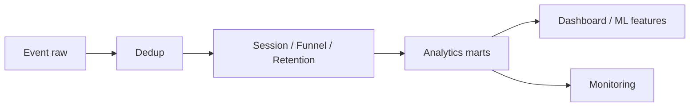
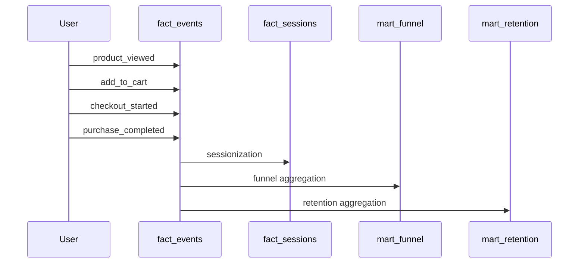

# 02 SQL Advanced Analytics

## 1. Introduction

Advanced analytics SQL là phần giúp bạn chuyển từ người viết query báo cáo sang Data Engineer có thể xây data product ổn định. Các pattern như ranking, running totals, cohort, funnel, retention, sessionization, deduplication, SCD logic và incremental query xuất hiện rất nhiều trong production.

Mục tiêu:

- Hiểu pattern analytics từ beginner đến senior.
- Có ví dụ PostgreSQL và Oracle.
- Biết cách tối ưu performance và cost.
- Nhìn được rủi ro production: late data, duplicate, timezone, metric drift.



## 2. Theory

### Window ranking

Các hàm ranking:

- `ROW_NUMBER()`: luôn tạo số thứ tự duy nhất trong partition.
- `RANK()`: cùng hạng thì bỏ qua thứ hạng tiếp theo.
- `DENSE_RANK()`: cùng hạng nhưng không bỏ qua thứ hạng tiếp theo.

Senior rule: ranking trong production phải có tie-breaker deterministic.

### Running totals

Running total tính lũy kế theo thứ tự thời gian. Luôn dùng ordering rõ ràng và window frame rõ ràng.

### Cohort

Cohort nhóm user/customer theo mốc bắt đầu như signup month, first purchase month, activation week. Cohort giúp trả lời: nhóm người dùng bắt đầu cùng thời điểm có hành vi về sau như thế nào?

### Funnel

Funnel đo tỷ lệ đi qua các bước. Senior phải định nghĩa:

- Có bắt buộc đúng thứ tự không?
- Conversion window là bao lâu?
- Mỗi user được tính một lần hay nhiều lần?
- Bot/test/internal users có bị loại không?

### Retention

Retention đo việc user quay lại sau mốc ban đầu. Có nhiều loại:

- Exact day retention: quay lại đúng ngày D7.
- Rolling retention: quay lại vào hoặc sau ngày D7.
- Calendar retention: hoạt động trong tuần/tháng tiếp theo.

### Sessionization

Sessionization gom event thành session dựa trên inactivity gap, ví dụ 30 phút. Đây là pattern tốn compute vì cần sort event theo user và time.

### Deduplication

Duplicate thường đến từ retry, CDC, streaming at-least-once, backfill overlap. Dedup cần key và rule chọn bản ghi thắng.

### SCD logic

SCD logic dùng để join fact với dimension theo thời điểm lịch sử, tránh dùng current state để giải thích quá khứ.

### Incremental query

Incremental query chỉ xử lý phần thay đổi thay vì full refresh. Senior phải xử lý late-arriving data, delete/update, idempotency và backfill.

## 3. Real-world example

Bài toán: xây analytics cho app thương mại điện tử:

- Dedup event theo `event_id`.
- Sessionize theo user với timeout 30 phút.
- Tính funnel: product view -> add to cart -> checkout -> purchase.
- Tính retention D1, D7, D30 theo signup date.
- Chạy incremental hằng ngày với lookback 3 ngày để bắt late events.



Incident thực tế: tracking SDK đổi tên event từ `checkout_started` sang `begin_checkout`. Pipeline vẫn chạy thành công nhưng funnel conversion giảm mạnh. Fix: accepted values test, event mapping versioned, alert khi funnel step count giảm bất thường.

## 4. SQL example

### PostgreSQL: ranking và dedup

```sql
WITH ranked_events AS (
    SELECT
        event_id,
        user_id,
        event_name,
        event_time,
        ingestion_time,
        ROW_NUMBER() OVER (
            PARTITION BY event_id
            ORDER BY ingestion_time DESC
        ) AS rn
    FROM raw_events
    WHERE ingestion_date >= CURRENT_DATE - INTERVAL '3 days'
)
SELECT *
FROM ranked_events
WHERE rn = 1;
```

### Oracle: ranking và dedup

```sql
WITH ranked_events AS (
    SELECT
        event_id,
        user_id,
        event_name,
        event_time,
        ingestion_time,
        ROW_NUMBER() OVER (
            PARTITION BY event_id
            ORDER BY ingestion_time DESC
        ) AS rn
    FROM raw_events
    WHERE ingestion_date >= TRUNC(SYSDATE) - 3
)
SELECT *
FROM ranked_events
WHERE rn = 1;
```

### PostgreSQL: running total

```sql
SELECT
    customer_id,
    order_id,
    order_time,
    amount,
    SUM(amount) OVER (
        PARTITION BY customer_id
        ORDER BY order_time, order_id
        ROWS BETWEEN UNBOUNDED PRECEDING AND CURRENT ROW
    ) AS running_revenue
FROM fact_orders
WHERE order_status = 'PAID';
```

### Oracle: running total

```sql
SELECT
    customer_id,
    order_id,
    order_time,
    amount,
    SUM(amount) OVER (
        PARTITION BY customer_id
        ORDER BY order_time, order_id
        ROWS BETWEEN UNBOUNDED PRECEDING AND CURRENT ROW
    ) AS running_revenue
FROM fact_orders
WHERE order_status = 'PAID';
```

### PostgreSQL: sessionization

```sql
WITH ordered AS (
    SELECT
        user_id,
        event_time,
        event_name,
        LAG(event_time) OVER (
            PARTITION BY user_id
            ORDER BY event_time
        ) AS previous_event_time
    FROM fact_events
),
flagged AS (
    SELECT
        *,
        CASE
            WHEN previous_event_time IS NULL THEN 1
            WHEN event_time > previous_event_time + INTERVAL '30 minutes' THEN 1
            ELSE 0
        END AS is_new_session
    FROM ordered
),
sessionized AS (
    SELECT
        *,
        SUM(is_new_session) OVER (
            PARTITION BY user_id
            ORDER BY event_time
            ROWS BETWEEN UNBOUNDED PRECEDING AND CURRENT ROW
        ) AS session_number
    FROM flagged
)
SELECT
    user_id,
    user_id || '-' || session_number AS session_id,
    MIN(event_time) AS session_start,
    MAX(event_time) AS session_end,
    COUNT(*) AS event_count
FROM sessionized
GROUP BY user_id, session_number;
```

### Oracle: sessionization

```sql
WITH ordered AS (
    SELECT
        user_id,
        event_time,
        event_name,
        LAG(event_time) OVER (
            PARTITION BY user_id
            ORDER BY event_time
        ) AS previous_event_time
    FROM fact_events
),
flagged AS (
    SELECT
        ordered.*,
        CASE
            WHEN previous_event_time IS NULL THEN 1
            WHEN event_time > previous_event_time + INTERVAL '30' MINUTE THEN 1
            ELSE 0
        END AS is_new_session
    FROM ordered
),
sessionized AS (
    SELECT
        flagged.*,
        SUM(is_new_session) OVER (
            PARTITION BY user_id
            ORDER BY event_time
            ROWS BETWEEN UNBOUNDED PRECEDING AND CURRENT ROW
        ) AS session_number
    FROM flagged
)
SELECT
    user_id,
    user_id || '-' || session_number AS session_id,
    MIN(event_time) AS session_start,
    MAX(event_time) AS session_end,
    COUNT(*) AS event_count
FROM sessionized
GROUP BY user_id, session_number;
```

### PostgreSQL: incremental lookback

```sql
SELECT *
FROM raw_events
WHERE updated_at >= (
    SELECT COALESCE(MAX(updated_at), TIMESTAMP '1970-01-01')
    FROM fact_events
) - INTERVAL '3 days';
```

### Oracle: incremental lookback

```sql
SELECT *
FROM raw_events
WHERE updated_at >= (
    SELECT COALESCE(MAX(updated_at), TIMESTAMP '1970-01-01 00:00:00')
    FROM fact_events
) - INTERVAL '3' DAY;
```

## 5. Python example

Python có thể dùng để chạy anomaly detection đơn giản cho funnel.

```python
def detect_drop(today_count: int, yesterday_count: int, threshold: float = 0.3) -> bool:
    if yesterday_count == 0:
        return today_count == 0
    drop_rate = (yesterday_count - today_count) / yesterday_count
    return drop_rate >= threshold


steps = {
    "product_viewed": (95000, 100000),
    "add_to_cart": (21000, 23000),
    "checkout_started": (3000, 18000),
    "purchase_completed": (2500, 4500),
}

for step, (today, yesterday) in steps.items():
    if detect_drop(today, yesterday):
        raise RuntimeError(f"Funnel step dropped abnormally: {step}")
```

## 6. Optimization

### Performance optimization

- Dedup theo partition gần nhất thay vì full history nếu có incremental design.
- Với sessionization, filter event date trước khi sort.
- Tạo index hoặc clustering theo `(user_id, event_time)` cho event table lớn.
- Materialize first activity table cho cohort/retention.
- Tránh `COUNT(DISTINCT)` lặp lại trên dashboard; pre-aggregate nếu metric dùng nhiều.
- Với Oracle, kiểm tra execution plan bằng `EXPLAIN PLAN`.
- Với PostgreSQL, dùng `EXPLAIN (ANALYZE, BUFFERS)` cẩn thận trên môi trường phù hợp.

### Cost optimization

- Cohort và retention full history rất tốn. Lưu `user_first_activity`.
- Sessionization toàn bộ lịch sử mỗi ngày là anti-pattern.
- Incremental model giảm compute nhưng cần test late data.
- Precompute funnel daily grain thay vì dashboard query raw events.

### Monitoring

Theo dõi:

- Event count theo `event_name`.
- Duplicate event rate.
- Late event rate.
- Funnel conversion rate.
- Retention cohort size.
- Session count per user distribution.
- Runtime và scanned bytes/logical reads.
- Insert/update count trong incremental merge.

## 7. Common mistakes

### Mistakes

- Ranking thiếu tie-breaker.
- Funnel không enforce đúng thứ tự event.
- Retention dùng ingestion date thay vì event date.
- Sessionization không xử lý event out-of-order.
- Incremental chỉ lấy `MAX(updated_at)` nhưng không có lookback.
- Dùng current dimension cho historical analytics.

### Anti-patterns

- Tính cohort trực tiếp từ raw events nhiều năm trên mỗi dashboard load.
- Sessionize full history mỗi giờ.
- Hardcode event names rải rác nhiều query.
- Không có event contract với product/app team.
- Treat job success như metric correctness.

### Incident scenario

Retention D7 giảm mạnh:

1. Kiểm tra event `app_opened` có còn được gửi không.
2. Kiểm tra timezone derivation của `event_date`.
3. Kiểm tra app version hoặc platform cụ thể.
4. Kiểm tra late event rate.
5. So sánh raw event count với clean event count.

### Best practices

- Version hóa metric definition cho funnel, retention và cohort.
- Lưu bảng first activity hoặc first purchase để giảm full-history scan.
- Dùng incremental model có lookback window rõ ràng.
- Theo dõi duplicate rate và late event rate như first-class metrics.
- Tách raw event, clean event, session, funnel, retention thành các layer riêng.
- Luôn có tie-breaker khi dùng window ranking trong production.

## 8. Interview questions

### Junior

- `ROW_NUMBER()` dùng để làm gì?
- Running total là gì?
- Cohort là gì?
- Duplicate event đến từ đâu?

### Mid

- Thiết kế funnel strict order như thế nào?
- Sessionization 30 phút viết ra sao?
- Late-arriving data ảnh hưởng incremental query thế nào?
- Exact retention khác rolling retention thế nào?

### Senior

- Làm sao thiết kế retention table backfillable và incremental?
- Làm sao giảm cost cho cohort query quét 5 năm event?
- Làm sao phát hiện tracking incident trước khi business báo?
- Khi nào dùng SCD point-in-time join trong analytics?

## 9. Exercises

1. Lấy top 3 order lớn nhất của mỗi customer.
2. Tính running revenue theo customer.
3. Xây monthly first-purchase cohort.
4. Xây funnel 4 bước có strict ordering.
5. Sessionize event với timeout 30 phút.
6. Dedup event theo `event_id`.
7. Viết incremental query có lookback 3 ngày.
8. Thiết kế alert khi funnel step giảm hơn 30%.

## 10. Checklist

- [ ] Metric definition được viết rõ.
- [ ] Entity và grain rõ ràng.
- [ ] Event timestamp và timezone rõ ràng.
- [ ] Ranking có tie-breaker deterministic.
- [ ] Dedup key đáng tin cậy.
- [ ] Funnel order và conversion window được định nghĩa.
- [ ] Retention type được định nghĩa.
- [ ] Incremental lookback xử lý late data.
- [ ] Có monitoring event count, duplicate, late data, conversion.
- [ ] Có backfill strategy.
- [ ] Cost của full-history query được kiểm soát.
