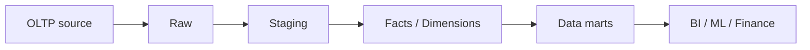
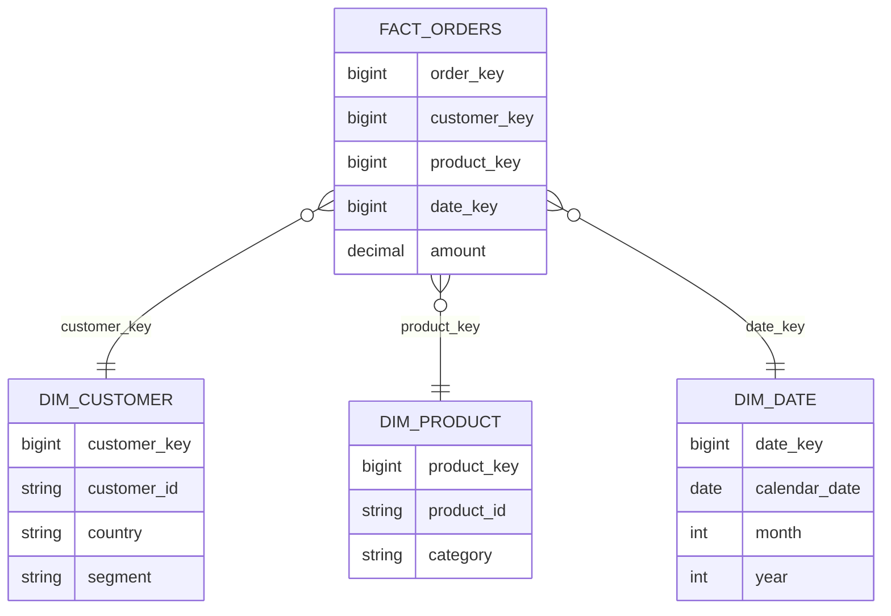
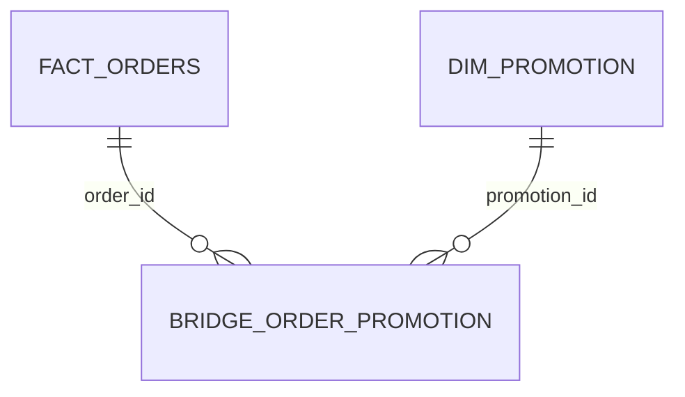

# 03 Data Modeling

## 1. Introduction

Data modeling là phần cực quan trọng để lên mid/senior Data Engineer. SQL giỏi nhưng model sai thì dashboard vẫn sai, finance vẫn lệch, ML feature vẫn bias, và incident vẫn xảy ra.

Mục tiêu:

- Hiểu OLTP vs OLAP.
- Thiết kế fact/dimension, star schema, snowflake schema.
- Nắm SCD Type 1/2/3, grain, surrogate key, bridge table.
- Biết trade-off performance, cost, monitoring và governance.



## 2. Theory

### OLTP vs OLAP

| Tiêu chí | OLTP | OLAP |
|---|---|---|
| Mục đích | Chạy application | Phân tích dữ liệu |
| Query | Nhỏ, nhiều transaction | Scan lớn, aggregate |
| Schema | Normalized | Dimensional / analytical |
| Người dùng | App service | Analyst, BI, ML, Finance |
| Ví dụ | Checkout DB | Revenue warehouse |

### Fact table

Fact lưu sự kiện hoặc measurement:

- `fact_orders`: một dòng trên mỗi order.
- `fact_order_items`: một dòng trên mỗi item trong order.
- `fact_payments`: một dòng trên mỗi payment attempt.
- `fact_events`: một dòng trên mỗi event.

### Dimension table

Dimension mô tả entity:

- `dim_customer`
- `dim_product`
- `dim_date`
- `dim_store`
- `dim_campaign`

### Grain

Grain là ý nghĩa của một dòng. Đây là câu hỏi senior luôn hỏi đầu tiên.

Ví dụ tốt:

> `fact_order_items` có một dòng trên mỗi sản phẩm trong mỗi đơn hàng.

Ví dụ xấu:

> Đây là bảng order.

### Star schema



### Snowflake schema

Snowflake tách dimension thành nhiều bảng normalized hơn. Nó giảm duplicate nhưng tăng join và độ khó cho analyst.

### Surrogate key

Surrogate key là key do warehouse tạo ra, không phụ thuộc source system. Nó hữu ích khi:

- Source key thay đổi.
- Nhiều source có ID trùng.
- SCD Type 2 cần nhiều version cho cùng natural key.

### SCD Type 1/2/3

SCD Type 1: overwrite, không lưu lịch sử.

SCD Type 2: tạo version mới, giữ lịch sử.

SCD Type 3: lưu một phần lịch sử trong cột như `previous_segment`.

### Bridge table

Bridge table xử lý many-to-many. Ví dụ order có nhiều promotion và promotion áp dụng cho nhiều order.



## 3. Real-world example

Bài toán: model data warehouse cho e-commerce.

Tables:

- `fact_order_items`: một dòng trên mỗi order item.
- `fact_payments`: một dòng trên mỗi payment attempt.
- `dim_customer_scd`: một dòng trên mỗi version customer.
- `dim_product_scd`: một dòng trên mỗi version product.
- `bridge_order_promotion`: một dòng trên mỗi order-promotion.

Incident thực tế: Finance report dùng `dim_customer` Type 1. Khi customer đổi region, revenue năm trước bị chuyển sang region mới. Fix: dùng SCD Type 2 và point-in-time join.

## 4. SQL example

### PostgreSQL: SCD Type 1 merge bằng upsert

```sql
INSERT INTO dim_customer (
    customer_id,
    email,
    country,
    updated_at
)
SELECT
    customer_id,
    email,
    country,
    updated_at
FROM stg_customer
ON CONFLICT (customer_id)
DO UPDATE SET
    email = EXCLUDED.email,
    country = EXCLUDED.country,
    updated_at = EXCLUDED.updated_at;
```

### Oracle: SCD Type 1 merge

```sql
MERGE INTO dim_customer d
USING stg_customer s
ON (d.customer_id = s.customer_id)
WHEN MATCHED THEN UPDATE SET
    d.email = s.email,
    d.country = s.country,
    d.updated_at = s.updated_at
WHEN NOT MATCHED THEN INSERT (
    customer_id, email, country, updated_at
) VALUES (
    s.customer_id, s.email, s.country, s.updated_at
);
```

### PostgreSQL: point-in-time join với SCD Type 2

```sql
SELECT
    o.order_id,
    o.order_time,
    c.customer_sk,
    c.segment,
    o.amount
FROM fact_orders o
JOIN dim_customer_scd c
  ON o.customer_id = c.customer_id
 AND o.order_time >= c.valid_from
 AND o.order_time < COALESCE(c.valid_to, TIMESTAMP '9999-12-31 00:00:00');
```

### Oracle: point-in-time join với SCD Type 2

```sql
SELECT
    o.order_id,
    o.order_time,
    c.customer_sk,
    c.segment,
    o.amount
FROM fact_orders o
JOIN dim_customer_scd c
  ON o.customer_id = c.customer_id
 AND o.order_time >= c.valid_from
 AND o.order_time < COALESCE(c.valid_to, TIMESTAMP '9999-12-31 00:00:00');
```

### Kiểm tra chỉ có một current row

```sql
SELECT
    customer_id,
    COUNT(*) AS current_rows
FROM dim_customer_scd
WHERE is_current = 1
GROUP BY customer_id
HAVING COUNT(*) > 1;
```

## 5. Python example

Python có thể dùng để validate model contract.

```python
def assert_unique_key(rows: list[dict], key: str) -> None:
    seen = set()
    duplicates = set()

    for row in rows:
        value = row[key]
        if value in seen:
            duplicates.add(value)
        seen.add(value)

    if duplicates:
        raise ValueError(f"Duplicate key detected for {key}: {sorted(duplicates)[:10]}")
```

Ví dụ khác: tạo hash cho SCD comparison.

```python
import hashlib


def record_hash(values: list[str | None]) -> str:
    normalized = [value or "" for value in values]
    raw = "|".join(normalized)
    return hashlib.md5(raw.encode("utf-8")).hexdigest()
```

## 6. Optimization

### Performance optimization

- Partition fact lớn theo ngày.
- Cluster/index theo foreign key thường join.
- Dimension nên vừa đủ rộng, không nhồi mọi thứ vào một bảng.
- Pre-aggregate metric dashboard phổ biến.
- Tránh snowflake quá mức nếu BI query trở nên phức tạp.
- Với SCD Type 2, index `(natural_key, valid_from, valid_to)`.

### Cost optimization

- Fact quá rộng làm tăng storage và scan cost.
- Type 2 cho mọi attribute có thể tạo row growth không cần thiết.
- Pre-aggregation tiết kiệm dashboard cost nhưng tăng storage và pipeline complexity.
- Model đúng grain giúp tránh `COUNT(DISTINCT)` đắt đỏ.

### Monitoring

Theo dõi:

- Row count fact theo partition.
- Số current row trong dimension.
- Số version trung bình trên mỗi natural key.
- Orphan fact keys.
- Unknown dimension key usage.
- Metric reconciliation với source.

## 7. Common mistakes

### Mistakes

- Không khai báo grain.
- Trộn nhiều grain vào một fact table.
- Dùng current dimension cho historical reporting.
- Join SCD Type 2 thiếu effective date.
- Không xử lý many-to-many bằng bridge table.
- Dùng natural key làm key chính ở mọi nơi.

### Anti-patterns

- `dim_everything`: một dimension chứa mọi attribute không liên quan.
- `fact_daily_metrics` có hàng trăm metric khác grain.
- Dashboard model thay cho enterprise model.
- Surrogate key sinh không deterministic trong backfill.
- Không có unknown member cho dimension đến muộn.

### Incident scenario

Historical revenue thay đổi:

1. Kiểm tra dimension là Type 1 hay Type 2.
2. Kiểm tra fact có được rebuild với logic mới không.
3. Kiểm tra point-in-time join.
4. Kiểm tra bridge table có làm nhân bản fact không.
5. Reconcile với closed finance report.

### Best practices

- Model theo business process, không model theo một dashboard cụ thể.
- Khai báo grain ở đầu mỗi fact/dimension document.
- Chọn SCD strategy theo từng attribute, không áp dụng máy móc cả bảng.
- Dùng bridge table cho many-to-many và kiểm soát allocation nếu cần.
- Có relationship tests giữa fact và dimension.
- Trước khi đổi semantic model, đánh giá impact downstream và có migration plan.

## 8. Interview questions

### Junior

- Fact khác dimension như thế nào?
- OLTP khác OLAP như thế nào?
- Grain là gì?
- Primary key và foreign key là gì?

### Mid

- Star schema khác snowflake schema như thế nào?
- SCD Type 1 khác Type 2 như thế nào?
- Vì sao cần surrogate key?
- Bridge table dùng khi nào?

### Senior

- Chọn SCD strategy cho customer dimension như thế nào?
- Làm sao ngăn historical metric thay đổi ngoài ý muốn?
- Model subscription với upgrade/downgrade/pause/renewal như thế nào?
- Khi nào nên denormalize, khi nào nên giữ dimensional model?

## 9. Exercises

1. Thiết kế star schema cho e-commerce.
2. Định nghĩa grain cho orders, order_items, payments, shipments.
3. Viết SCD Type 2 logic cho customer.
4. Thiết kế bridge table cho order-promotion.
5. Viết query kiểm tra orphan fact keys.
6. Viết query kiểm tra duplicate current row trong SCD dimension.
7. Giải thích cost trade-off giữa wide table và star schema.

## 10. Checklist

- [ ] Business process được xác định.
- [ ] Grain được viết rõ cho từng table.
- [ ] Fact và dimension không bị trộn trách nhiệm.
- [ ] Natural key và surrogate key rõ ràng.
- [ ] SCD strategy được chọn theo attribute.
- [ ] Historical reporting dùng point-in-time join.
- [ ] Many-to-many có bridge table.
- [ ] Có unknown member cho late/missing dimension.
- [ ] Có test uniqueness, nulls, relationships, freshness.
- [ ] Có monitoring row count, orphan keys, SCD current rows.
- [ ] Có backfill và migration strategy.
