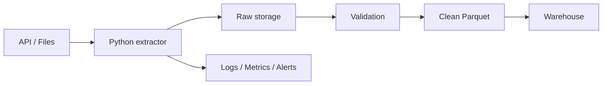

# 04 Python for Data Engineering

## 1. Introduction

Python trong Data Engineering không chỉ là viết script. Ở production, Python dùng để extract API, xử lý file, validate schema, orchestrate job, log metrics, handle retry, package code và debug incident.

Mục tiêu:

- Nắm Python basics, OOP, file handling.
- Làm việc với JSON, CSV, Parquet.
- Gọi API an toàn.
- Logging, exception handling, virtualenv, package management.
- Có mindset production: idempotency, observability, cost, scaling.



## 2. Theory

### Python basics

Bạn cần chắc:

- Data types: `str`, `int`, `float`, `bool`, `list`, `dict`, `tuple`, `set`.
- Control flow: `if`, `for`, `while`.
- Functions.
- Modules.
- Type hints.

### OOP

OOP hữu ích để đóng gói API client, extractor, writer, validator.

Không cần lạm dụng inheritance. Data Engineering thường hợp với composition và class nhỏ.

### File handling

Senior rule:

- Không ghi partial file vào final path.
- Dùng encoding rõ ràng.
- Dùng `pathlib`.
- Với file lớn, tránh load toàn bộ vào memory.

### JSON/CSV/Parquet

- JSON linh hoạt nhưng dễ schema drift.
- CSV phổ biến nhưng yếu về type, encoding, delimiter.
- Parquet phù hợp analytics vì columnar, compressed, giữ schema tốt hơn.

### API requests

Production API extraction cần:

- Timeout.
- Retry có giới hạn.
- Rate limit handling.
- Pagination.
- Watermark.
- Không log secret.

### Logging và exception

Logging phải giúp debug production. Exception phải fail rõ ràng khi correctness bị đe dọa.

### Virtualenv và package management

Mỗi project nên có environment riêng và dependency pinned.

## 3. Real-world example

Bài toán: ingest orders từ third-party API.

Yêu cầu:

- Fetch theo pagination.
- Dùng watermark `updated_since`.
- Lưu raw JSON.
- Validate required fields.
- Ghi clean Parquet.
- Log row count, reject count, runtime.
- Retry lỗi 429/5xx.

Incident thực tế: API job timeout giữa chừng sau khi đã ghi một nửa output. Retry append thêm toàn bộ data, tạo duplicate. Fix: ghi temp file, validate xong mới atomic replace, downstream merge theo business key.

## 4. SQL example

Python pipeline thường load vào warehouse rồi chạy SQL validation.

### PostgreSQL: kiểm tra dữ liệu sau load

```sql
SELECT
    COUNT(*) AS row_count,
    COUNT(DISTINCT order_id) AS distinct_orders,
    SUM(CASE WHEN order_id IS NULL THEN 1 ELSE 0 END) AS null_order_ids
FROM stg_api_orders
WHERE ingestion_date = CURRENT_DATE;
```

### Oracle: kiểm tra dữ liệu sau load

```sql
SELECT
    COUNT(*) AS row_count,
    COUNT(DISTINCT order_id) AS distinct_orders,
    SUM(CASE WHEN order_id IS NULL THEN 1 ELSE 0 END) AS null_order_ids
FROM stg_api_orders
WHERE ingestion_date = TRUNC(SYSDATE);
```

### PostgreSQL: merge/upsert kết quả clean

```sql
INSERT INTO fact_orders (
    order_id,
    customer_id,
    amount,
    order_status,
    updated_at
)
SELECT
    order_id,
    customer_id,
    amount,
    order_status,
    updated_at
FROM stg_api_orders_clean
ON CONFLICT (order_id)
DO UPDATE SET
    customer_id = EXCLUDED.customer_id,
    amount = EXCLUDED.amount,
    order_status = EXCLUDED.order_status,
    updated_at = EXCLUDED.updated_at;
```

### Oracle: merge kết quả clean

```sql
MERGE INTO fact_orders f
USING stg_api_orders_clean s
ON (f.order_id = s.order_id)
WHEN MATCHED THEN UPDATE SET
    f.customer_id = s.customer_id,
    f.amount = s.amount,
    f.order_status = s.order_status,
    f.updated_at = s.updated_at
WHEN NOT MATCHED THEN INSERT (
    order_id, customer_id, amount, order_status, updated_at
) VALUES (
    s.order_id, s.customer_id, s.amount, s.order_status, s.updated_at
);
```

## 5. Python example

### API client production-style

```python
from dataclasses import dataclass
import json
import logging
import time
from pathlib import Path
from typing import Iterator

import requests

logger = logging.getLogger(__name__)


@dataclass(frozen=True)
class ApiConfig:
    base_url: str
    token: str
    timeout_seconds: int = 30


class OrdersClient:
    def __init__(self, config: ApiConfig) -> None:
        self.config = config

    def fetch_orders(self, updated_since: str) -> Iterator[dict]:
        page = 1

        while True:
            response = requests.get(
                f"{self.config.base_url}/orders",
                headers={"Authorization": f"Bearer {self.config.token}"},
                params={"updated_since": updated_since, "page": page, "page_size": 500},
                timeout=self.config.timeout_seconds,
            )

            if response.status_code == 429:
                retry_after = int(response.headers.get("Retry-After", "60"))
                logger.warning("Rate limited. Sleeping seconds=%s", retry_after)
                time.sleep(retry_after)
                continue

            response.raise_for_status()
            payload = response.json()

            for order in payload.get("orders", []):
                yield order

            if not payload.get("has_next"):
                break

            page += 1
```

### File handling và validation

```python
REQUIRED_COLUMNS = {"order_id", "customer_id", "amount", "updated_at"}


def validate_order(record: dict) -> tuple[bool, str | None]:
    missing = [field for field in REQUIRED_COLUMNS if record.get(field) in (None, "")]
    if missing:
        return False, f"Missing fields: {missing}"
    return True, None


def write_json_atomic(path: Path, records: list[dict]) -> None:
    temp_path = path.with_suffix(path.suffix + ".tmp")
    temp_path.write_text(json.dumps(records), encoding="utf-8")
    temp_path.replace(path)
```

## 6. Optimization

### Performance optimization

- Stream large files thay vì load hết vào memory.
- Batch database writes, không insert từng dòng.
- Dùng Parquet cho dữ liệu lớn.
- Dùng pandas/polars cho data vừa, Spark/SQL engine cho data lớn.
- Tránh nested loops trên dataset lớn.
- Parse và validate một lần, lưu intermediate sạch nếu dùng lại.

### Cost optimization

- Dùng incremental extraction thay vì full pull API.
- Lưu raw response để replay không cần gọi lại API.
- Nén file output.
- Không dùng cluster lớn cho job nhỏ.
- Đẩy transformation lớn vào warehouse/Spark nếu rẻ hơn Python local.

### Monitoring

Log và metric cần có:

- Records fetched.
- Records written.
- Rejected records.
- API request count.
- Retry count.
- Watermark.
- Runtime.
- Output file size.

```python
logger.info(
    "orders_pipeline_metrics fetched=%s written=%s rejected=%s watermark=%s",
    fetched,
    written,
    rejected,
    watermark,
)
```

## 7. Common mistakes

### Mistakes

- API request không có timeout.
- Catch exception rồi bỏ qua lỗi.
- Hardcode secret trong code.
- Không pin dependency version.
- Ghi output trực tiếp vào final path.
- Không có watermark nên mỗi lần chạy full data.
- Không validate schema.

### Anti-patterns

- Một file Python vài nghìn dòng chứa mọi logic.
- Business logic trộn với I/O ở mọi nơi.
- `print()` thay logging.
- Retry vô hạn.
- Dùng local absolute path trong production.
- Không có unit test cho parser.

### Incident scenario

Job chạy thành công nhưng row count giảm 70%:

1. Kiểm tra API pagination có đổi không.
2. Kiểm tra schema response.
3. Kiểm tra số rejected records.
4. Kiểm tra watermark có nhảy quá xa không.
5. Kiểm tra log request count và status code.

### Best practices

- Tách pure transformation khỏi I/O để dễ test.
- Dùng config rõ ràng cho path, token, timeout, batch size.
- Ghi raw data trước khi transform để có thể replay.
- Ghi output idempotent bằng temp path rồi replace hoặc merge theo key.
- Log metrics đủ để debug mà không cần đọc toàn bộ data.
- Viết unit test cho parser, validator và watermark logic.

## 8. Interview questions

### Junior

- Đọc CSV bằng Python như thế nào?
- `dict` khác `list` như thế nào?
- Exception handling là gì?
- Virtualenv dùng để làm gì?

### Mid

- Xử lý API pagination và rate limit như thế nào?
- Vì sao Parquet tốt hơn CSV cho analytics?
- Pipeline nên log những gì?
- Idempotency trong Python data job là gì?

### Senior

- Thiết kế API ingestion chịu được retry và partial failure như thế nào?
- Xử lý schema drift từ third-party API ra sao?
- Khi nào nên chuyển transformation từ Python sang SQL/Spark?
- Thiết kế observability cho pipeline critical như thế nào?

## 9. Exercises

1. Đọc CSV và validate required columns.
2. Convert JSON records sang Parquet.
3. Viết API extractor có pagination, timeout, retry.
4. Thêm structured logging cho pipeline.
5. Implement watermark file.
6. Viết unit test cho hàm parse amount và timestamp.
7. Ghi output bằng temp file rồi atomic replace.

## 10. Checklist

- [ ] Có virtualenv riêng.
- [ ] Dependencies được pin version.
- [ ] Secret không nằm trong code.
- [ ] API call có timeout.
- [ ] Retry có giới hạn và backoff.
- [ ] Rate limit được xử lý.
- [ ] Raw data được lưu để replay.
- [ ] Output write idempotent.
- [ ] Schema validation tồn tại.
- [ ] Logging có row count, reject count, watermark.
- [ ] Exception không bị nuốt im lặng.
- [ ] Có monitoring và alert.
