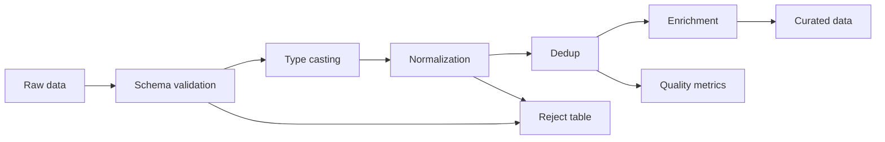

# 05 Data Cleaning and Transformation

## 1. Introduction

Data cleaning không phải việc làm đẹp dữ liệu. Đây là lớp bảo vệ correctness của toàn bộ hệ thống analytics. Nếu cleaning sai, mọi thứ phía sau như fact table, dashboard, ML feature, finance report đều sai nhưng job vẫn có thể báo success.

Mục tiêu:

- Xử lý null, duplicate, schema validation.
- Normalization, enrichment, parsing.
- Timezone và encoding issue.
- Biết production patterns, monitoring, incident handling.
- Có ví dụ PostgreSQL, Oracle và Python.



## 2. Theory

### Null handling

Null có thể nghĩa là:

- Unknown: không biết.
- Not applicable: không áp dụng.
- Not provided: source không gửi.
- Not happened yet: ví dụ `cancelled_at IS NULL`.

Không được tự động thay mọi null bằng 0.

### Dedup

Dedup cần:

- Business key hoặc technical key.
- Rule chọn bản ghi thắng.
- Tie-breaker deterministic.
- Metric duplicate rate.

### Schema validation

Validation cần kiểm tra:

- Cột bắt buộc tồn tại.
- Type hợp lệ.
- Key không null.
- Enum nằm trong allowed values.
- Numeric nằm trong range hợp lý.
- Timestamp parse được.

### Data normalization

Chuẩn hóa representation:

- Email lowercase và trim.
- Country code về ISO.
- Status về vocabulary chuẩn.
- Phone format chuẩn.
- Currency code chuẩn.

### Data enrichment

Enrichment thêm context từ nguồn khác như product category, FX rate, customer segment. Rủi ro lớn nhất là join không match hoặc join làm nhân bản dòng.

### Parsing

Parsing chuyển raw string thành type đúng. Không nên silently convert bad value thành null nếu field critical.

### Timezone

Best practice: lưu timestamp UTC, derive business date riêng theo timezone business.

### Encoding issue

CSV từ hệ thống khác nhau có thể dùng UTF-8, UTF-8 BOM, Windows-1258, ISO-8859-1. Encoding sai có thể làm hỏng tên, địa chỉ, hoặc parser fail.

## 3. Real-world example

Bài toán: clean raw orders từ nhiều source.

Yêu cầu:

- Validate `order_id`, `customer_id`, `amount`, `order_status`, `updated_at`.
- Normalize status về `PENDING`, `PAID`, `CANCELLED`, `REFUNDED`.
- Parse timestamp về UTC.
- Dedup theo `order_id`, lấy `updated_at` mới nhất.
- Enrich FX rate để tính `amount_usd`.
- Ghi reject table với reason.
- Monitor rejection rate và enrichment match rate.

Incident thực tế: Source đổi status từ `paid` sang `PAID`. Query filter chỉ nhận lowercase `paid`, làm revenue giảm 80%. Fix: normalize status, accepted-value test, alert khi paid order count lệch.

## 4. SQL example

### PostgreSQL: cleaning pipeline

```sql
WITH typed AS (
    SELECT
        CAST(order_id AS text) AS order_id,
        CAST(customer_id AS text) AS customer_id,
        CAST(amount AS numeric(18, 2)) AS amount,
        UPPER(TRIM(order_status)) AS order_status,
        CAST(updated_at AS timestamp) AS updated_at,
        ingestion_time
    FROM raw_orders
    WHERE ingestion_date >= CURRENT_DATE - INTERVAL '3 days'
),
valid AS (
    SELECT *
    FROM typed
    WHERE order_id IS NOT NULL
      AND customer_id IS NOT NULL
      AND order_status IN ('PENDING', 'PAID', 'CANCELLED', 'REFUNDED')
      AND amount >= 0
),
deduped AS (
    SELECT *
    FROM (
        SELECT
            valid.*,
            ROW_NUMBER() OVER (
                PARTITION BY order_id
                ORDER BY updated_at DESC, ingestion_time DESC
            ) AS rn
        FROM valid
    ) x
    WHERE rn = 1
)
SELECT
    order_id,
    customer_id,
    amount,
    order_status,
    updated_at
FROM deduped;
```

### Oracle: cleaning pipeline

```sql
WITH typed AS (
    SELECT
        CAST(order_id AS VARCHAR2(100)) AS order_id,
        CAST(customer_id AS VARCHAR2(100)) AS customer_id,
        CAST(amount AS NUMBER(18, 2)) AS amount,
        UPPER(TRIM(order_status)) AS order_status,
        CAST(updated_at AS TIMESTAMP) AS updated_at,
        ingestion_time
    FROM raw_orders
    WHERE ingestion_date >= TRUNC(SYSDATE) - 3
),
valid AS (
    SELECT *
    FROM typed
    WHERE order_id IS NOT NULL
      AND customer_id IS NOT NULL
      AND order_status IN ('PENDING', 'PAID', 'CANCELLED', 'REFUNDED')
      AND amount >= 0
),
deduped AS (
    SELECT *
    FROM (
        SELECT
            valid.*,
            ROW_NUMBER() OVER (
                PARTITION BY order_id
                ORDER BY updated_at DESC, ingestion_time DESC
            ) AS rn
        FROM valid
    )
    WHERE rn = 1
)
SELECT
    order_id,
    customer_id,
    amount,
    order_status,
    updated_at
FROM deduped;
```

### Reject records

```sql
SELECT
    order_id,
    customer_id,
    amount,
    order_status,
    updated_at,
    CASE
        WHEN order_id IS NULL THEN 'missing_order_id'
        WHEN customer_id IS NULL THEN 'missing_customer_id'
        WHEN UPPER(TRIM(order_status)) NOT IN ('PENDING', 'PAID', 'CANCELLED', 'REFUNDED') THEN 'invalid_status'
        WHEN amount < 0 THEN 'negative_amount'
        ELSE 'unknown'
    END AS reject_reason
FROM raw_orders
WHERE order_id IS NULL
   OR customer_id IS NULL
   OR UPPER(TRIM(order_status)) NOT IN ('PENDING', 'PAID', 'CANCELLED', 'REFUNDED')
   OR amount < 0;
```

## 5. Python example

### Validate và normalize record

```python
from datetime import datetime, timezone

VALID_STATUSES = {"PENDING", "PAID", "CANCELLED", "REFUNDED"}


def parse_timestamp_utc(value: str) -> datetime:
    parsed = datetime.fromisoformat(value.replace("Z", "+00:00"))
    return parsed.astimezone(timezone.utc)


def clean_order(record: dict) -> tuple[dict | None, str | None]:
    order_id = record.get("order_id")
    customer_id = record.get("customer_id")

    if not order_id:
        return None, "missing_order_id"
    if not customer_id:
        return None, "missing_customer_id"

    status = str(record.get("order_status", "")).strip().upper()
    if status not in VALID_STATUSES:
        return None, "invalid_status"

    try:
        amount = float(record["amount"])
    except (KeyError, TypeError, ValueError):
        return None, "invalid_amount"

    if amount < 0:
        return None, "negative_amount"

    try:
        updated_at = parse_timestamp_utc(record["updated_at"])
    except (KeyError, ValueError):
        return None, "invalid_updated_at"

    return {
        "order_id": str(order_id),
        "customer_id": str(customer_id),
        "amount": amount,
        "order_status": status,
        "updated_at": updated_at.isoformat(),
    }, None
```

## 6. Optimization

### Performance optimization

- Filter partition sớm.
- Dedup chỉ trên window cần thiết nếu incremental.
- Materialize staging sạch nếu nhiều model dùng lại.
- Tránh regex nếu `TRIM`, `UPPER`, `REPLACE` đủ dùng.
- Enrichment lookup cần unique key hoặc pre-aggregate.
- Với bảng lớn, tránh full table sort không cần thiết.

### Cost optimization

- Không re-parse raw JSON full history mỗi ngày.
- Lưu clean intermediate dạng columnar.
- Chạy data quality check full history theo lịch riêng, daily chỉ check partition mới.
- Reject table giúp debug không cần scan raw quá nhiều.

### Monitoring

Theo dõi:

- Input rows.
- Output rows.
- Reject rows.
- Duplicate rows.
- Null rate theo key.
- Invalid enum count.
- Parse failure count.
- Enrichment match rate.
- Freshness.
- Runtime và cost.

PostgreSQL:

```sql
SELECT
    CURRENT_DATE AS metric_date,
    COUNT(*) AS input_rows,
    SUM(CASE WHEN order_id IS NULL THEN 1 ELSE 0 END) AS missing_order_id,
    SUM(CASE WHEN UPPER(TRIM(order_status)) NOT IN ('PENDING', 'PAID', 'CANCELLED', 'REFUNDED') THEN 1 ELSE 0 END) AS invalid_status
FROM raw_orders
WHERE ingestion_date = CURRENT_DATE;
```

Oracle:

```sql
SELECT
    TRUNC(SYSDATE) AS metric_date,
    COUNT(*) AS input_rows,
    SUM(CASE WHEN order_id IS NULL THEN 1 ELSE 0 END) AS missing_order_id,
    SUM(CASE WHEN UPPER(TRIM(order_status)) NOT IN ('PENDING', 'PAID', 'CANCELLED', 'REFUNDED') THEN 1 ELSE 0 END) AS invalid_status
FROM raw_orders
WHERE ingestion_date = TRUNC(SYSDATE);
```

## 7. Common mistakes

### Mistakes

- Thay null bằng 0 không xét business meaning.
- Dedup thiếu ordering deterministic.
- Xóa bad records mà không lưu reject reason.
- Normalize status ở một nơi nhưng dashboard filter ở nơi khác.
- Parse timezone không rõ.
- Không monitor enrichment match rate.
- Backfill dùng logic khác daily run.

### Anti-patterns

- Cleaning trực tiếp trên raw rồi overwrite raw.
- Một model làm typing, cleaning, business logic và reporting cùng lúc.
- Hardcode mapping rải rác nhiều file.
- Silent failure: records biến mất không metric.
- Treat schema drift như null bình thường.

### Incident scenario

Null rate của `customer_id` tăng từ 1% lên 35%:

1. Kiểm tra source schema có đổi tên field không.
2. Kiểm tra parser có fail không.
3. Kiểm tra source mới có gửi empty string không.
4. Kiểm tra join enrichment có làm mất customer không.
5. Kiểm tra reject table và sample raw records.

### Best practices

- Giữ raw data bất biến để audit và replay.
- Làm sạch theo layer: raw, staging, intermediate, mart.
- Lưu reject records kèm lý do, không để dữ liệu biến mất im lặng.
- Centralize mapping cho status, country, currency.
- Theo dõi quality metrics theo thời gian, không chỉ kiểm tra tại một thời điểm.
- Thiết kế daily run và backfill dùng cùng logic.

## 8. Interview questions

### Junior

- Null khác zero như thế nào?
- Làm sao remove duplicate?
- Schema validation là gì?
- Vì sao encoding quan trọng khi đọc CSV?

### Mid

- Thiết kế reject table như thế nào?
- Normalize country/status values ra sao?
- Timezone bug thường gặp là gì?
- Monitor data quality gồm những metric nào?

### Senior

- Xử lý schema drift mà không phá downstream như thế nào?
- Khi nào reject, quarantine, hoặc default bad records?
- Thiết kế transformation idempotent và backfillable ra sao?
- Điều tra incident metric sai do cleaning logic như thế nào?

## 9. Exercises

1. Clean customer CSV có email rỗng, country lộn xộn, duplicate ID.
2. Validate orders dataset với required fields và accepted statuses.
3. Tạo reject table có `reject_reason`.
4. Normalize timestamp về UTC và derive business date.
5. Enrich order với FX rate và tính match rate.
6. Viết SQL check null, duplicate, invalid enum, row count drift.
7. Thiết kế alert khi rejection rate vượt 5%.

## 10. Checklist

- [ ] Raw data được giữ nguyên.
- [ ] Required columns được validate.
- [ ] Type casting rõ ràng.
- [ ] Null handling có business meaning.
- [ ] Dedup key và ordering được document.
- [ ] Bad records có reject/quarantine reason.
- [ ] Mapping normalization tập trung và versioned.
- [ ] Timezone assumption rõ ràng.
- [ ] Encoding expectation được document.
- [ ] Enrichment match rate được monitor.
- [ ] Quality metrics được lưu theo thời gian.
- [ ] Daily run và backfill dùng cùng logic.
- [ ] Alert cho row count, nulls, duplicates, rejects, freshness.
