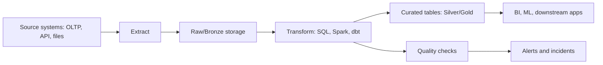
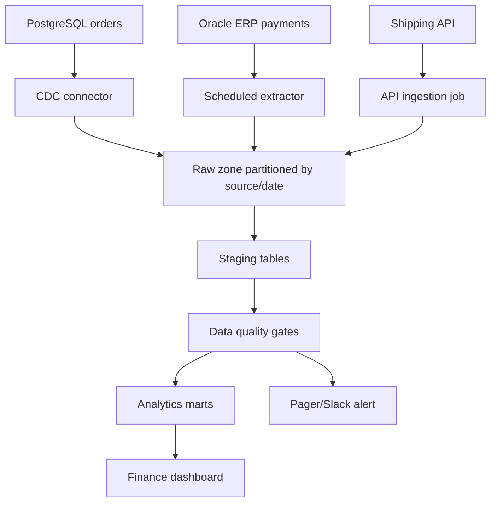

# 06_ETL_ELT_Architecture.md

## 1. Introduction

ETL/ELT là xương sống của hệ thống dữ liệu production. Junior thường nghĩ ETL chỉ là "lấy dữ liệu, transform, load". Mid bắt đầu quan tâm retry, incremental, dependency. Senior phải thiết kế pipeline có idempotency, backfill, SLA, observability, chi phí hợp lý và không làm hỏng dữ liệu khi upstream thay đổi.

Mục tiêu của module này:

- Hiểu ETL vs ELT, batch vs streaming, CDC, watermark, backfill.
- Thiết kế pipeline chạy lại an toàn.
- Biết khi nào dùng PostgreSQL, Oracle, object storage, warehouse, lakehouse.
- Tư duy production: dữ liệu đúng, chạy ổn, debug được, tối ưu được, kiểm soát cost.



## 2. Theory

### ETL vs ELT

ETL transform trước khi load vào warehouse. Phù hợp khi warehouse đắt, dữ liệu nhạy cảm cần masking trước, hoặc source cần chuẩn hóa mạnh trước khi lưu. ELT load raw trước, transform sau trong warehouse/lakehouse. Phù hợp với cloud warehouse, audit, replay, backfill, schema evolution.

Senior không chọn ETL/ELT theo trend. Họ chọn theo constraint:

- Data volume: vài GB/ngày có thể SQL batch; vài TB/ngày cần partition, distributed compute.
- Latency: dashboard ngày dùng batch; fraud detection cần streaming.
- Compliance: PII có thể cần tokenize trước khi landing.
- Cost: transform trong warehouse dễ nhưng có thể đốt compute nếu query kém.
- Reprocessing: raw layer giúp rebuild khi logic sai.

### Batch vs Streaming

Batch xử lý theo lô: hourly, daily, monthly. Ưu điểm là đơn giản, dễ backfill, dễ kiểm soát cost. Streaming xử lý event gần realtime. Ưu điểm latency thấp, nhưng phức tạp hơn vì ordering, late events, state, exactly-once, checkpoint.

### Incremental loading

Incremental chỉ xử lý dữ liệu mới hoặc thay đổi. Ba pattern phổ biến:

- High-watermark: `updated_at > last_successful_watermark`.
- CDC log-based: đọc WAL/binlog/redo log.
- Snapshot diff: so sánh snapshot hiện tại với lần trước.

### Idempotency

Idempotency nghĩa là chạy pipeline nhiều lần với cùng input vẫn cho cùng output. Đây là khác biệt lớn giữa script nghiệp dư và pipeline production. Một job fail giữa chừng phải rerun được mà không double count, không duplicate row, không phá downstream.

Pattern thường dùng:

- Write vào staging table trước.
- Validate row count, primary key, null rate.
- Atomic swap hoặc merge vào target.
- Ghi `run_id`, `batch_id`, `source_watermark`.

### Watermark

Watermark là mốc xác định dữ liệu đã xử lý đến đâu. Không nên chỉ dùng "thời điểm hiện tại" vì source có late-arriving data. Nên dùng low/high watermark:

- Low watermark: điểm bắt đầu batch.
- High watermark: điểm kết thúc batch đã chốt từ đầu run.
- Lookback window: đọc lùi 1-3 ngày để bắt late updates.

### Backfill

Backfill là chạy lại dữ liệu lịch sử. Senior thiết kế backfill ngay từ đầu:

- Có parameter ngày/tháng.
- Có isolated compute để không ảnh hưởng job hằng ngày.
- Có audit table để biết partition nào đã rebuild.
- Có kiểm tra chênh lệch trước khi publish.

## 3. Real-world example

Một công ty ecommerce cần pipeline đơn hàng:

- Source: PostgreSQL `orders`, Oracle ERP `payments`, API vận chuyển.
- Latency: dashboard doanh thu T+1, cảnh báo đơn lỗi mỗi 15 phút.
- Storage: raw files trên S3, warehouse dùng Redshift/Snowflake/BigQuery.
- Transform: dbt/Spark tạo fact order, fact payment, dimension customer.

Kiến trúc production:



Incident thực tế: finance báo revenue hôm qua tăng gấp đôi. Nguyên nhân: job payment retry sau timeout đã append lại cùng payment batch. Fix đúng không phải "delete duplicate thủ công", mà là thêm idempotent merge theo `payment_id`, audit run, unique constraint ở target, và alert duplicate rate.

## 4. SQL example

### PostgreSQL: incremental merge bằng staging

```sql
CREATE TABLE IF NOT EXISTS etl_watermark (
    pipeline_name text PRIMARY KEY,
    last_successful_watermark timestamptz NOT NULL,
    updated_at timestamptz NOT NULL DEFAULT now()
);

CREATE TEMP TABLE stg_orders AS
SELECT *
FROM public.orders
WHERE updated_at > (
    SELECT last_successful_watermark
    FROM etl_watermark
    WHERE pipeline_name = 'orders_incremental'
)
AND updated_at <= :high_watermark;

INSERT INTO mart.fact_orders AS tgt (
    order_id, customer_id, order_status, amount, updated_at
)
SELECT order_id, customer_id, status, amount, updated_at
FROM stg_orders
ON CONFLICT (order_id) DO UPDATE
SET customer_id = EXCLUDED.customer_id,
    order_status = EXCLUDED.order_status,
    amount = EXCLUDED.amount,
    updated_at = EXCLUDED.updated_at;

UPDATE etl_watermark
SET last_successful_watermark = :high_watermark,
    updated_at = now()
WHERE pipeline_name = 'orders_incremental';
```

### Oracle: incremental merge

```sql
MERGE INTO fact_orders tgt
USING (
    SELECT order_id, customer_id, status, amount, updated_at
    FROM orders
    WHERE updated_at > (
        SELECT last_successful_watermark
        FROM etl_watermark
        WHERE pipeline_name = 'ORDERS_INCREMENTAL'
    )
    AND updated_at <= TO_TIMESTAMP(:high_watermark, 'YYYY-MM-DD HH24:MI:SS')
) src
ON (tgt.order_id = src.order_id)
WHEN MATCHED THEN UPDATE SET
    tgt.customer_id = src.customer_id,
    tgt.order_status = src.status,
    tgt.amount = src.amount,
    tgt.updated_at = src.updated_at
WHEN NOT MATCHED THEN INSERT (
    order_id, customer_id, order_status, amount, updated_at
) VALUES (
    src.order_id, src.customer_id, src.status, src.amount, src.updated_at
);
```

## 5. Python example

```python
import logging
from datetime import datetime, timezone
import pandas as pd
import psycopg2

logging.basicConfig(level=logging.INFO, format="%(asctime)s %(levelname)s %(message)s")

def extract_orders(conn, low_watermark, high_watermark):
    query = """
        SELECT order_id, customer_id, status, amount, updated_at
        FROM orders
        WHERE updated_at > %(low)s AND updated_at <= %(high)s
    """
    return pd.read_sql(query, conn, params={"low": low_watermark, "high": high_watermark})

def validate_orders(df):
    if df["order_id"].isna().any():
        raise ValueError("order_id contains null")
    if df["order_id"].duplicated().any():
        raise ValueError("duplicate order_id in batch")
    if (df["amount"] < 0).any():
        raise ValueError("negative amount detected")

def run():
    high_watermark = datetime.now(timezone.utc)
    with psycopg2.connect("dbname=app user=etl password=secret host=localhost") as conn:
        low_watermark = pd.read_sql(
            "SELECT last_successful_watermark FROM etl_watermark WHERE pipeline_name='orders_incremental'",
            conn,
        ).iloc[0, 0]
        logging.info("Extracting orders from %s to %s", low_watermark, high_watermark)
        df = extract_orders(conn, low_watermark, high_watermark)
        validate_orders(df)
        logging.info("Validated %s rows", len(df))
        # Production code should load to staging, then merge in one transaction.

if __name__ == "__main__":
    run()
```

## 6. Optimization

Performance:

- Index source theo `updated_at`, nhưng nếu filter thêm tenant/status thì cân nhắc composite index.
- Partition target theo ngày sự kiện hoặc ngày load để backfill nhanh.
- Push down filter vào source thay vì extract full table.
- Dùng bulk load thay vì insert từng dòng.
- Với Oracle, kiểm tra execution plan của `MERGE`; thiếu index ở join key sẽ gây full scan.

Cost:

- Không chạy full refresh nếu incremental đủ đúng.
- Tách compute backfill khỏi compute daily.
- Giới hạn retention raw theo compliance và nhu cầu replay.
- Nén file raw bằng Parquet/Snappy thay vì CSV lớn.

Scaling:

- Chia pipeline theo partition thời gian hoặc tenant.
- Dùng queue/event để decouple ingestion và transform.
- Với CDC, monitor lag và storage của replication slot/redo log.

Monitoring:

- Row count input/output.
- Duplicate key count.
- Null rate ở cột bắt buộc.
- Watermark lag.
- Runtime theo step.
- Cost per run.
- Freshness của bảng mart.

## 7. Common mistakes

Best practices:

- Mọi pipeline quan trọng phải có `run_id`, audit log, watermark và data quality gate.
- Load raw immutable trước khi transform nếu được phép.
- Thiết kế rerun/backfill như first-class feature.
- Dùng transaction hoặc atomic publish cho bảng serving.

Anti-patterns:

- Dùng `SELECT *` cho contract production.
- Xóa target rồi insert lại khi job daily fail.
- Lấy `now()` ở nhiều step khác nhau làm watermark.
- Retry job append-only mà không dedup.
- Không phân biệt `created_at`, `updated_at`, `event_time`, `ingested_at`.

Debugging scenario:

- Triệu chứng: dashboard thiếu đơn trong 2 giờ.
- Kiểm tra: source row count theo `updated_at`, watermark table, log extract, staging count, quality failures, downstream refresh time.
- Nguyên nhân thường gặp: timezone lệch, source update trễ, job dùng `>` thay vì `>=` nhưng watermark lưu sai precision.

## 8. Interview questions

Junior:

- ETL khác ELT thế nào?
- Incremental load là gì?
- Vì sao cần staging table?

Mid:

- Thiết kế pipeline idempotent cho bảng order.
- Watermark xử lý late-arriving data như thế nào?
- Khi nào dùng CDC thay vì query theo `updated_at`?

Senior:

- Thiết kế pipeline ingest 500 triệu events/ngày, có backfill 2 năm và SLA 30 phút.
- Làm gì khi CDC lag 8 giờ nhưng downstream finance cần số liệu đúng?
- Làm sao cân bằng cost, freshness và correctness?

## 9. Exercises

1. Viết pipeline incremental cho bảng `orders` có late update trong 48 giờ.
2. Thiết kế audit table chứa `run_id`, `batch_start`, `batch_end`, `row_count`, `status`, `error_message`.
3. Viết SQL dedup staging theo `order_id`, lấy bản ghi `updated_at` mới nhất.
4. Mô phỏng incident duplicate payment và đề xuất fix idempotency.
5. Thiết kế mini project: ingest PostgreSQL orders + Oracle payments + API shipment vào warehouse theo kiến trúc Bronze/Silver/Gold.

## 10. Checklist

- [ ] Có định nghĩa rõ source, target, owner, SLA.
- [ ] Có raw/staging/curated layer.
- [ ] Có watermark và audit log.
- [ ] Pipeline rerun không tạo duplicate.
- [ ] Có data quality checks trước publish.
- [ ] Có alert khi freshness, row count, duplicate, null rate bất thường.
- [ ] Có chiến lược backfill và rollback.
- [ ] Có index/partition phù hợp cho incremental query.
- [ ] Có ước tính cost cho daily run và backfill.
- [ ] Có runbook xử lý failure, data corruption, SLA breach.
