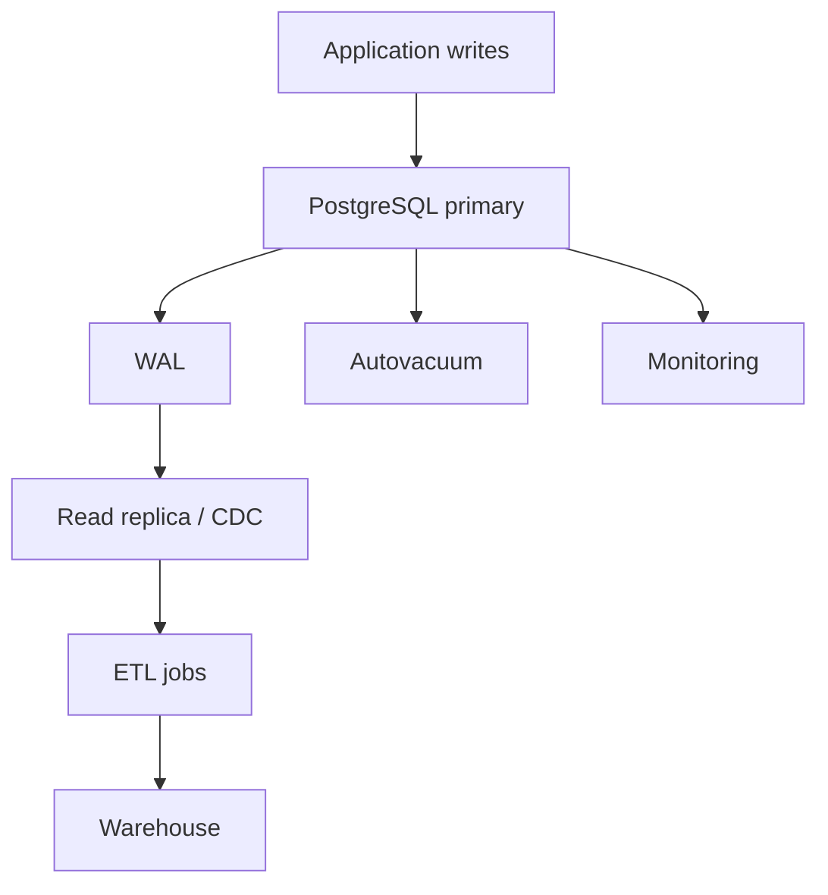

# 08_PostgreSQL_Advanced.md

## 1. Introduction

PostgreSQL không chỉ là database OLTP. Với data engineering, bạn sẽ dùng PostgreSQL làm source system, staging database, metadata store, hoặc warehouse nhỏ/vừa. Junior biết `SELECT`. Mid biết index và transaction. Senior hiểu planner, vacuum, WAL, replication, partitioning, locking, materialized view và cách extract dữ liệu mà không làm sập production.



## 2. Theory

### Indexing

Index giúp tìm dữ liệu nhanh nhưng làm write chậm hơn và tốn storage. Senior không tạo index theo cảm tính. Họ đọc query pattern, cardinality, selectivity và `EXPLAIN`.

Loại index hay gặp:

- B-tree: mặc định, tốt cho equality/range.
- GIN: array, JSONB, full-text.
- BRIN: bảng rất lớn có dữ liệu tương quan với physical order, ví dụ timestamp.
- Partial index: index một subset dữ liệu.
- Composite index: nhiều cột, thứ tự cột rất quan trọng.

### Query planner

Planner chọn sequential scan, index scan, hash join, nested loop, merge join dựa trên statistics. Stats cũ làm planner chọn sai. `ANALYZE` cập nhật stats.

### MVCC, vacuum, bloat

PostgreSQL dùng MVCC: update/delete không xóa ngay row cũ mà tạo version mới. Vacuum dọn dead tuples. Nếu vacuum không theo kịp, table bloat, query chậm, storage tăng.

### WAL và replication

WAL ghi lại thay đổi để crash recovery và replication. CDC thường đọc logical replication slot. Nếu consumer lag, WAL giữ lại nhiều, có thể đầy disk.

### Locking và transaction

Transaction dài giữ snapshot cũ, cản vacuum, gây bloat. DDL có thể lock table. ETL không được chạy query full scan nặng trên primary production nếu không kiểm soát.

## 3. Real-world example

Một job daily extract chạy:

```sql
SELECT * FROM orders WHERE updated_at >= CURRENT_DATE - INTERVAL '1 day';
```

Bảng `orders` có 800 triệu row, không có index `updated_at`. Job chạy trên primary lúc 9h sáng, CPU 100%, app checkout timeout. Fix production:

- Chạy extract từ read replica.
- Tạo index concurrently trên `updated_at`.
- Chỉ select cột cần thiết.
- Dùng incremental watermark.
- Throttle batch theo khoảng thời gian.
- Monitor replica lag và query runtime.

## 4. SQL example

### PostgreSQL: explain, index, partition, locking

```sql
EXPLAIN (ANALYZE, BUFFERS)
SELECT order_id, customer_id, amount
FROM orders
WHERE updated_at >= TIMESTAMPTZ '2026-05-01 00:00:00+00'
  AND updated_at <  TIMESTAMPTZ '2026-05-02 00:00:00+00';

CREATE INDEX CONCURRENTLY idx_orders_updated_at
ON orders (updated_at);

CREATE INDEX CONCURRENTLY idx_orders_open_recent
ON orders (updated_at, customer_id)
WHERE status IN ('OPEN', 'PAID');

SELECT pid, now() - query_start AS runtime, wait_event_type, wait_event, query
FROM pg_stat_activity
WHERE state <> 'idle'
ORDER BY runtime DESC;

SELECT relname, n_dead_tup, last_vacuum, last_autovacuum
FROM pg_stat_user_tables
ORDER BY n_dead_tup DESC;
```

### Oracle equivalent concepts: plan and lock inspection

```sql
EXPLAIN PLAN FOR
SELECT order_id, customer_id, amount
FROM orders
WHERE updated_at >= TIMESTAMP '2026-05-01 00:00:00'
  AND updated_at <  TIMESTAMP '2026-05-02 00:00:00';

SELECT * FROM TABLE(DBMS_XPLAN.DISPLAY);

CREATE INDEX idx_orders_updated_at
ON orders(updated_at);

SELECT s.sid, s.serial#, s.username, l.type, l.lmode, l.request, s.sql_id
FROM v$lock l
JOIN v$session s ON l.sid = s.sid
WHERE l.block = 1 OR l.request > 0;
```

## 5. Python example

```python
import logging
import time
import psycopg2
from psycopg2.extras import RealDictCursor

logging.basicConfig(level=logging.INFO)

def fetch_in_chunks(conn, low, high, chunk_size=10000):
    with conn.cursor(name="orders_cursor", cursor_factory=RealDictCursor) as cur:
        cur.itersize = chunk_size
        cur.execute("""
            SELECT order_id, customer_id, amount, updated_at
            FROM orders
            WHERE updated_at >= %s AND updated_at < %s
            ORDER BY updated_at
        """, (low, high))
        for row in cur:
            yield row

def run_extract():
    conn = psycopg2.connect("dbname=app user=etl password=secret host=replica")
    conn.set_session(readonly=True, autocommit=False)
    count = 0
    start = time.time()
    for row in fetch_in_chunks(conn, "2026-05-01", "2026-05-02"):
        count += 1
        # write to file/object storage in production
    logging.info("Extracted %s rows in %.2fs", count, time.time() - start)
    conn.close()

if __name__ == "__main__":
    run_extract()
```

## 6. Optimization

Performance:

- Luôn kiểm tra `EXPLAIN (ANALYZE, BUFFERS)` trước khi tối ưu.
- Dùng `CREATE INDEX CONCURRENTLY` để giảm lock khi thêm index production.
- Dùng keyset pagination thay vì `OFFSET` lớn.
- Dùng server-side cursor khi extract nhiều row.
- Tránh transaction đọc kéo dài hàng giờ.

Cost:

- Index quá nhiều làm tăng storage và write cost.
- Replica riêng cho analytics có thể rẻ hơn downtime primary.
- Archive dữ liệu lạnh sang object storage.
- Chỉ giữ materialized view cần thiết.

Monitoring:

- `pg_stat_activity`, long-running query.
- `pg_stat_statements`, top slow queries.
- Replica lag.
- Dead tuples, vacuum lag, table bloat.
- WAL disk usage.
- Lock waits.

## 7. Common mistakes

Best practices:

- ETL đọc từ replica khi có thể.
- Mọi query production phải có filter có index hoặc partition.
- Có statement timeout cho user/job analytics.
- Tách OLTP và analytics workload.

Anti-patterns:

- `SELECT *` từ primary production để dump dữ liệu.
- Tạo index thường trong giờ cao điểm thay vì `CONCURRENTLY`.
- Dùng `OFFSET 10000000` cho incremental extract.
- Logical replication slot không monitor lag.
- Transaction mở lâu trong notebook.

Incident scenario:

- Triệu chứng: disk primary đầy.
- Kiểm tra: WAL directory, replication slot lag, CDC consumer status.
- Nguyên nhân: Debezium stopped, slot giữ WAL 2 ngày.
- Fix: restart consumer, tăng disk tạm thời, drop slot nếu có approval và chấp nhận re-snapshot, thêm alert WAL retained bytes.

## 8. Interview questions

Junior:

- Index là gì?
- `EXPLAIN` dùng để làm gì?
- Transaction là gì?

Mid:

- Vì sao query có index vẫn dùng sequential scan?
- Autovacuum giải quyết vấn đề gì?
- Làm sao extract 100 triệu row an toàn?

Senior:

- CDC consumer lag làm đầy WAL, bạn xử lý incident thế nào?
- Thiết kế PostgreSQL source cho analytics mà không ảnh hưởng OLTP.
- Làm sao chọn giữa B-tree, BRIN, GIN và partial index?

## 9. Exercises

1. Tạo bảng `orders` 10 triệu row, so sánh query trước/sau index.
2. Dùng `EXPLAIN (ANALYZE, BUFFERS)` để phân tích join chậm.
3. Viết Python server-side cursor extract theo ngày.
4. Mô phỏng duplicate do retry và sửa bằng `ON CONFLICT`.
5. Mini project: PostgreSQL source + logical CDC + warehouse staging + monitoring dashboard.

## 10. Checklist

- [ ] Query ETL đọc từ replica hoặc window thấp tải.
- [ ] Có index/partition cho filter incremental.
- [ ] Có statement timeout và lock timeout.
- [ ] Có monitoring WAL, replication lag, vacuum, locks.
- [ ] Có runbook cho slow query và disk full.
- [ ] Không có long transaction từ job/notebook.
- [ ] Dùng bulk load/cursor thay vì row-by-row.
- [ ] Kiểm tra plan trước thay đổi lớn.
- [ ] Index mới được tạo concurrently khi production cần.
- [ ] CDC slot có alert lag và recovery plan.
