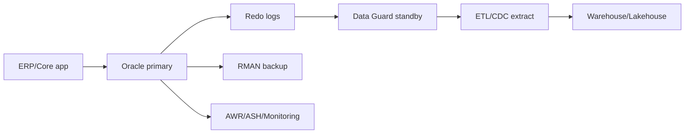

# 09_Oracle_SQL_Advanced.md

## 1. Introduction

Oracle xuất hiện nhiều trong ngân hàng, viễn thông, ERP và hệ thống enterprise. Data Engineer senior không cần là Oracle DBA, nhưng phải đọc được execution plan, hiểu partition, optimizer, RMAN/Flashback ở mức phối hợp vận hành, ASM/HA ở mức kiến trúc, và extract dữ liệu mà không phá workload giao dịch.



## 2. Theory

### Execution plan và optimizer

Oracle optimizer chọn cách chạy query dựa trên statistics, index, partition, histogram, join order. Plan tốt hay xấu quyết định query chạy 2 giây hay 2 giờ.

Các khái niệm cần nắm:

- Full table scan: không luôn xấu, có thể tốt với scan lớn.
- Index range scan: tốt khi selectivity cao.
- Hash join: thường tốt cho join lớn.
- Nested loop: tốt khi outer nhỏ, inner có index.
- Partition pruning: bỏ qua partition không cần đọc.
- Cardinality estimate: ước lượng sai kéo theo plan sai.

### Partition table

Oracle partition rất mạnh cho bảng lớn:

- Range partition theo ngày.
- List partition theo region/status.
- Hash partition để phân phối đều.
- Composite partition kết hợp range-hash/list.

Partition giúp load, purge, backfill và query nhanh hơn nếu query filter đúng partition key.

### RMAN, Flashback, ASM, HA

Data Engineer không vận hành RMAN hằng ngày nhưng phải hiểu:

- RMAN dùng backup/restore database.
- Flashback có thể quay lại table/database tới thời điểm trước lỗi.
- ASM quản lý storage cho Oracle.
- Data Guard cung cấp standby/DR.
- RAC cung cấp high availability/scale cho workload nhất định.

### Extract dữ liệu từ Oracle

Oracle enterprise thường có workload nhạy cảm. Không nên chạy full extract nặng trên primary vào giờ cao điểm. Pattern tốt:

- Extract từ standby/read replica nếu license/kiến trúc cho phép.
- Dùng partition-wise extract.
- Dùng SCN hoặc `last_update_date` làm watermark.
- Với CDC, dùng redo log based tools.

## 3. Real-world example

Một hệ thống ERP lưu invoice trên Oracle. ETL nightly chạy query join 12 bảng, không filter partition, tạo temp spill lớn, ảnh hưởng batch đóng sổ kế toán. Senior xử lý:

- Làm việc với DBA để lấy AWR/top SQL.
- Thêm filter partition `invoice_date`.
- Tách extract raw invoice header/line thay vì join phức tạp trên source.
- Transform join ở warehouse.
- Dùng materialized view hoặc standby cho reporting.
- Thêm SLA và lịch chạy không đụng batch kế toán.

## 4. SQL example

### Oracle: execution plan, partition, merge

```sql
EXPLAIN PLAN FOR
SELECT /*+ gather_plan_statistics */
       customer_id, SUM(amount) AS revenue
FROM fact_invoice
WHERE invoice_date >= DATE '2026-05-01'
  AND invoice_date <  DATE '2026-06-01'
GROUP BY customer_id;

SELECT * FROM TABLE(DBMS_XPLAN.DISPLAY);

CREATE TABLE fact_invoice (
    invoice_id NUMBER NOT NULL,
    customer_id NUMBER NOT NULL,
    invoice_date DATE NOT NULL,
    amount NUMBER(18, 2) NOT NULL,
    status VARCHAR2(30) NOT NULL
)
PARTITION BY RANGE (invoice_date) (
    PARTITION p202605 VALUES LESS THAN (DATE '2026-06-01'),
    PARTITION p202606 VALUES LESS THAN (DATE '2026-07-01')
);

MERGE INTO mart_customer_revenue tgt
USING (
    SELECT customer_id, TRUNC(invoice_date) AS revenue_date, SUM(amount) AS revenue
    FROM fact_invoice
    WHERE invoice_date >= DATE '2026-05-01'
      AND invoice_date <  DATE '2026-05-02'
    GROUP BY customer_id, TRUNC(invoice_date)
) src
ON (tgt.customer_id = src.customer_id AND tgt.revenue_date = src.revenue_date)
WHEN MATCHED THEN UPDATE SET tgt.revenue = src.revenue
WHEN NOT MATCHED THEN INSERT (customer_id, revenue_date, revenue)
VALUES (src.customer_id, src.revenue_date, src.revenue);
```

### PostgreSQL comparison: explain and upsert

```sql
EXPLAIN (ANALYZE, BUFFERS)
SELECT customer_id, SUM(amount) AS revenue
FROM fact_invoice
WHERE invoice_date >= DATE '2026-05-01'
  AND invoice_date <  DATE '2026-06-01'
GROUP BY customer_id;

INSERT INTO mart_customer_revenue (customer_id, revenue_date, revenue)
SELECT customer_id, invoice_date::date, SUM(amount)
FROM fact_invoice
WHERE invoice_date >= DATE '2026-05-01'
  AND invoice_date <  DATE '2026-05-02'
GROUP BY customer_id, invoice_date::date
ON CONFLICT (customer_id, revenue_date)
DO UPDATE SET revenue = EXCLUDED.revenue;
```

## 5. Python example

```python
import logging
import oracledb
import pandas as pd

logging.basicConfig(level=logging.INFO)

def extract_invoice_partition(dsn, user, password, start_date, end_date):
    sql = """
        SELECT invoice_id, customer_id, invoice_date, amount, status
        FROM fact_invoice
        WHERE invoice_date >= TO_DATE(:start_date, 'YYYY-MM-DD')
          AND invoice_date <  TO_DATE(:end_date, 'YYYY-MM-DD')
    """
    with oracledb.connect(user=user, password=password, dsn=dsn) as conn:
        chunks = pd.read_sql(sql, conn, params={"start_date": start_date, "end_date": end_date}, chunksize=50000)
        total = 0
        for chunk in chunks:
            total += len(chunk)
            # write chunk to Parquet/object storage in production
        logging.info("Extracted %s invoice rows", total)

if __name__ == "__main__":
    extract_invoice_partition("localhost/XEPDB1", "etl_user", "secret", "2026-05-01", "2026-05-02")
```

## 6. Optimization

Performance:

- Thu thập statistics đúng lịch bằng `DBMS_STATS`.
- Thiết kế local index cho partitioned table khi query theo partition.
- Dùng partition exchange load cho batch lớn.
- Tránh function trên partition key trong predicate, ví dụ `TRUNC(invoice_date)` làm mất pruning nếu không có function-based index.
- Dùng bind variables để giảm hard parse.

Cost:

- Oracle license đắt; tránh dùng primary Oracle làm analytics engine.
- Đẩy transform nặng sang warehouse/lakehouse khi có thể.
- Retention partition giúp purge nhanh thay vì delete lớn.
- Standby/reporting database có cost nhưng giảm rủi ro downtime core system.

Monitoring:

- AWR/ASH top SQL.
- Wait events.
- Temp tablespace usage.
- Undo usage.
- Blocking sessions.
- Data Guard lag.
- Failed jobs và runtime.

## 7. Common mistakes

Best practices:

- Luôn filter theo partition khi extract bảng lớn.
- Phối hợp DBA trước khi thêm index/partition hoặc chạy backfill lớn.
- Dùng SCN/watermark rõ ràng cho consistency.
- Tách extract và transform phức tạp.

Anti-patterns:

- Chạy query analytics nặng trên Oracle primary trong giờ nghiệp vụ.
- Dùng `TRUNC(date_col)` ở `WHERE` làm hỏng partition pruning.
- Thêm hint để ép plan mà không hiểu root cause.
- Delete hàng trăm triệu row thay vì drop/truncate partition.
- Không kiểm soát temp space khi sort/hash join lớn.

Incident scenario:

- Triệu chứng: batch kế toán chậm, Oracle temp tablespace đầy.
- Kiểm tra: top SQL, temp usage, ETL job window, execution plan.
- Nguyên nhân: ETL join invoice lines full table, sort spill lớn.
- Fix: dừng job, chạy lại theo partition nhỏ, thêm mart ở warehouse, alert temp usage, đổi lịch job.

## 8. Interview questions

Junior:

- `EXPLAIN PLAN` trong Oracle dùng để làm gì?
- Partition table giúp gì?
- `MERGE` khác `INSERT` thế nào?

Mid:

- Vì sao `TRUNC(invoice_date)` có thể làm query chậm?
- Local index vs global index là gì?
- Làm sao extract Oracle table 1 tỷ row an toàn?

Senior:

- Thiết kế pipeline từ Oracle ERP sang lakehouse với RPO/RTO và SLA rõ ràng.
- Khi Oracle optimizer chọn plan sai sau khi dữ liệu tăng mạnh, bạn xử lý thế nào?
- Temp tablespace đầy do ETL, bạn điều phối incident với DBA ra sao?

## 9. Exercises

1. Viết Oracle partitioned table theo tháng cho invoice.
2. So sánh plan khi dùng `invoice_date >= DATE` và `TRUNC(invoice_date) = DATE`.
3. Viết Python extract theo partition ngày với chunking.
4. Thiết kế incremental load dùng `last_update_date` và audit table.
5. Mini project: Oracle ERP invoice -> raw Parquet -> warehouse mart -> revenue dashboard.

## 10. Checklist

- [ ] Query lớn có execution plan được review.
- [ ] Extract dùng partition/watermark.
- [ ] Không chạy analytics nặng trên primary giờ cao điểm.
- [ ] Có phối hợp DBA cho index, stats, partition, backfill.
- [ ] Có monitoring temp, undo, wait events, blocking sessions.
- [ ] Có Data Guard/standby lag alert nếu extract từ standby.
- [ ] Có rollback/backfill plan khi dữ liệu sai.
- [ ] Có kiểm soát PII và audit access.
- [ ] Có cost review cho workload Oracle.
- [ ] Có runbook incident temp full, blocking, plan regression.
