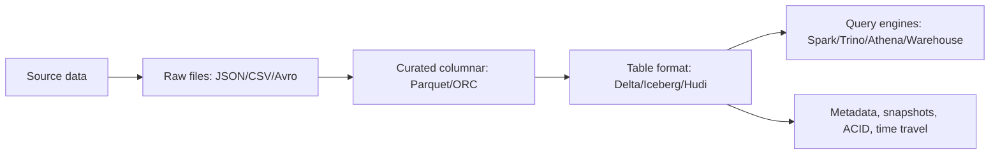

# 10_File_Formats_Data_Storage.md

## 1. Introduction

File format quyết định tốc độ, chi phí, khả năng schema evolution và độ tin cậy của data lake/lakehouse. Junior thường dùng CSV vì dễ nhìn. Mid biết Parquet nhanh hơn. Senior hiểu row vs columnar, compression, splittability, schema, metadata, ACID table format, compaction và trade-off giữa CSV, JSON, Avro, Parquet, ORC, Delta Lake, Iceberg, Hudi.



## 2. Theory

### CSV

CSV dễ tạo, dễ debug bằng mắt, nhưng yếu trong production:

- Không có schema chuẩn.
- Không lưu type.
- Dễ lỗi delimiter, quote, newline, encoding.
- Query phải đọc nhiều dữ liệu hơn.

CSV phù hợp landing nhỏ, trao đổi thủ công, hoặc export đơn giản. Không nên dùng làm storage chính cho analytics lớn.

### JSON

JSON tốt cho semi-structured event/API. Nhược điểm là verbose, khó enforce schema, nested field xử lý đắt. Với event streaming, JSON tiện nhưng Avro/Protobuf thường tốt hơn cho schema contract.

### Avro

Avro là row-based binary format, có schema, tốt cho streaming/CDC và message serialization. Avro hỗ trợ schema evolution tốt khi dùng schema registry.

### Parquet và ORC

Parquet/ORC là columnar format, tối ưu analytics:

- Đọc cột cần thiết.
- Compression tốt.
- Predicate pushdown qua statistics.
- Splittable cho distributed compute.

Senior phải hiểu "Parquet nhanh hơn CSV" không phải vì magic, mà vì giảm I/O và CPU khi query analytics.

### Delta Lake, Iceberg, Hudi

Đây là table format trên data lake, không chỉ file format:

- ACID transaction.
- Snapshot/time travel.
- Schema evolution.
- Partition evolution.
- Upsert/delete/merge.
- Metadata quản lý danh sách file.

Khác biệt thực dụng:

- Delta Lake mạnh trong Spark ecosystem.
- Iceberg trung lập engine, tốt cho Trino/Spark/Flink.
- Hudi mạnh với upsert/CDC ingestion.

## 3. Real-world example

Một team lưu clickstream 5 TB/ngày bằng JSON gzip. Athena query dashboard scan quá nhiều bytes, bill tăng mạnh, query chậm. Sau khi convert sang Parquet partition theo `event_date`, sort/cluster theo `user_id`, compact small files, cost giảm mạnh và query nhanh hơn.

Incident thực tế: streaming job ghi hàng triệu file Parquet nhỏ, mỗi file vài KB. Query engine mất nhiều thời gian đọc metadata và open file, dù tổng data không lớn. Fix: compaction job, target file size 128-512 MB, partition hợp lý, monitor small file count.

## 4. SQL example

### PostgreSQL: export CSV có kiểm soát

```sql
COPY (
    SELECT order_id, customer_id, amount, updated_at
    FROM orders
    WHERE updated_at >= TIMESTAMPTZ '2026-05-01 00:00:00+00'
      AND updated_at <  TIMESTAMPTZ '2026-05-02 00:00:00+00'
    ORDER BY updated_at
) TO STDOUT WITH (FORMAT CSV, HEADER TRUE, ENCODING 'UTF8');
```

### Oracle: external table đọc CSV

```sql
CREATE TABLE ext_orders_csv (
    order_id NUMBER,
    customer_id NUMBER,
    amount NUMBER(18, 2),
    updated_at VARCHAR2(30)
)
ORGANIZATION EXTERNAL (
    TYPE ORACLE_LOADER
    DEFAULT DIRECTORY data_dir
    ACCESS PARAMETERS (
        RECORDS DELIMITED BY NEWLINE
        FIELDS TERMINATED BY ','
        OPTIONALLY ENCLOSED BY '"'
        SKIP 1
    )
    LOCATION ('orders_20260501.csv')
)
REJECT LIMIT UNLIMITED;

SELECT COUNT(*) FROM ext_orders_csv;
```

### Lakehouse SQL concept: Iceberg/Delta-style merge

```sql
MERGE INTO lakehouse.fact_orders tgt
USING staging.orders_incremental src
ON tgt.order_id = src.order_id
WHEN MATCHED THEN UPDATE SET
    customer_id = src.customer_id,
    amount = src.amount,
    updated_at = src.updated_at
WHEN NOT MATCHED THEN INSERT *;
```

## 5. Python example

```python
import pandas as pd
import pyarrow as pa
import pyarrow.parquet as pq

def csv_to_partitioned_parquet(csv_path: str, output_dir: str):
    chunks = pd.read_csv(csv_path, chunksize=100_000, parse_dates=["updated_at"])
    for i, df in enumerate(chunks):
        df["event_date"] = df["updated_at"].dt.date.astype(str)
        table = pa.Table.from_pandas(df, preserve_index=False)
        pq.write_to_dataset(
            table,
            root_path=output_dir,
            partition_cols=["event_date"],
            compression="snappy",
            basename_template=f"part-{i}-{{i}}.parquet",
        )

def validate_schema(parquet_path: str):
    dataset = pq.ParquetDataset(parquet_path)
    print(dataset.schema)

if __name__ == "__main__":
    csv_to_partitioned_parquet("orders.csv", "lake/orders")
    validate_schema("lake/orders")
```

## 6. Optimization

Performance:

- Dùng Parquet/ORC cho analytics scan lớn.
- Chọn partition theo filter phổ biến, không partition theo high-cardinality như `user_id`.
- Target file size thường 128-512 MB cho lake analytics.
- Bật compression hợp lý: Snappy cho tốc độ, ZSTD cho tỷ lệ nén tốt hơn.
- Compact small files định kỳ.
- Dùng predicate pushdown bằng cách giữ type đúng, ví dụ date là date, không phải string.

Cost:

- CSV/JSON lớn làm tăng scan bytes và compute.
- Compression giảm storage nhưng có CPU trade-off.
- Table format metadata quá lớn cũng có cost; cần expire snapshot và remove orphan files.
- Partition quá mịn làm tăng request/listing cost trên object storage.

Monitoring:

- Number of files per partition.
- Average file size.
- Scan bytes per query.
- Compression ratio.
- Schema drift.
- Failed reads do corrupt files.
- Snapshot count và metadata size với Delta/Iceberg/Hudi.

## 7. Common mistakes

Best practices:

- Raw giữ nguyên đủ để replay, curated dùng columnar typed format.
- Dùng schema registry cho Avro/streaming event.
- Có data contract cho field bắt buộc và type.
- Compact và vacuum/expire snapshot theo lịch.

Anti-patterns:

- Dùng CSV làm data lake dài hạn cho bảng lớn.
- Partition theo `customer_id` tạo hàng triệu folder nhỏ.
- Ghi Parquet với cột date dạng string.
- Append file nhỏ liên tục không compaction.
- Cho nhiều job ghi cùng path không có transaction/table format.

Incident scenario:

- Triệu chứng: query lakehouse chậm gấp 20 lần.
- Kiểm tra: số file, average file size, partition count, metadata snapshots, scan bytes.
- Nguyên nhân: streaming job tạo small files và không compact 2 tuần.
- Fix: dừng writer lỗi, chạy compaction, expire snapshot cũ, thêm alert small file count.

## 8. Interview questions

Junior:

- CSV khác Parquet thế nào?
- Vì sao JSON dễ dùng nhưng tốn chi phí?
- Compression dùng để làm gì?

Mid:

- Khi nào dùng Avro thay vì Parquet?
- Partition quá nhiều gây vấn đề gì?
- Predicate pushdown là gì?

Senior:

- Thiết kế storage cho 10 TB clickstream/ngày, query bằng Spark và Trino.
- Chọn Delta, Iceberg hay Hudi cho CDC upsert lakehouse như thế nào?
- Xử lý incident small files trên production lake ra sao?

## 9. Exercises

1. Convert CSV orders sang Parquet partition theo `event_date`.
2. So sánh dung lượng CSV gzip và Parquet Snappy.
3. Tạo 10.000 small files, đo thời gian list/read, rồi compact.
4. Thiết kế schema evolution cho event `order_created`.
5. Mini project: raw JSON clickstream -> curated Parquet -> Iceberg/Delta table -> dashboard query.

## 10. Checklist

- [ ] Chọn format theo workload: exchange, streaming, analytics, CDC.
- [ ] Curated analytics dùng Parquet/ORC hoặc table format phù hợp.
- [ ] Schema được quản lý, versioned và validated.
- [ ] Partition key khớp query pattern.
- [ ] File size nằm trong target production.
- [ ] Có compaction và snapshot cleanup.
- [ ] Có monitor file count, scan bytes, schema drift, corrupt files.
- [ ] Có policy retention raw/curated.
- [ ] Có access control và encryption cho object storage.
- [ ] Có runbook cho small files, schema break, corrupt partition.
