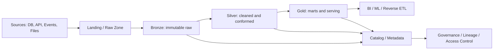
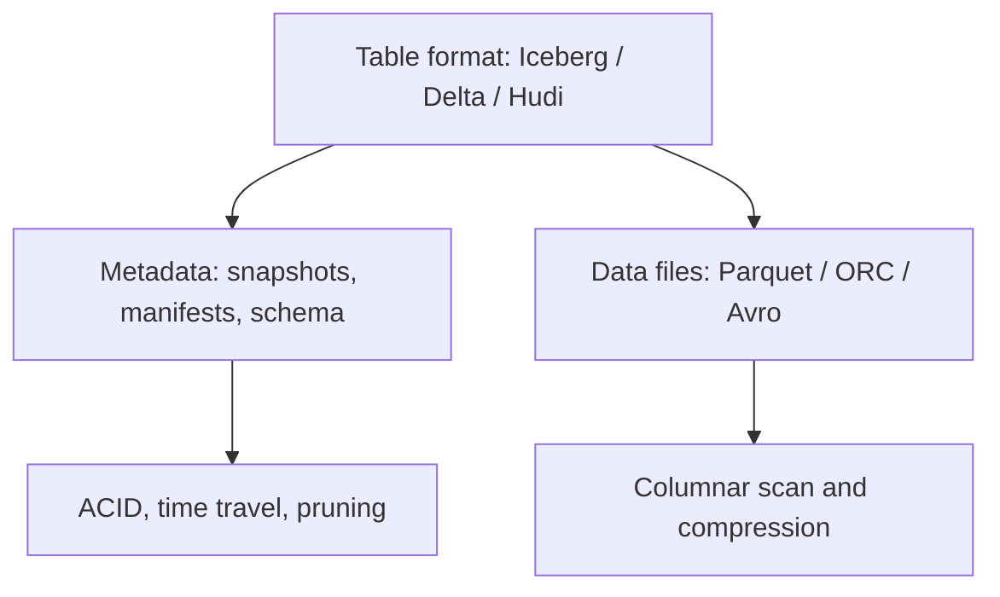
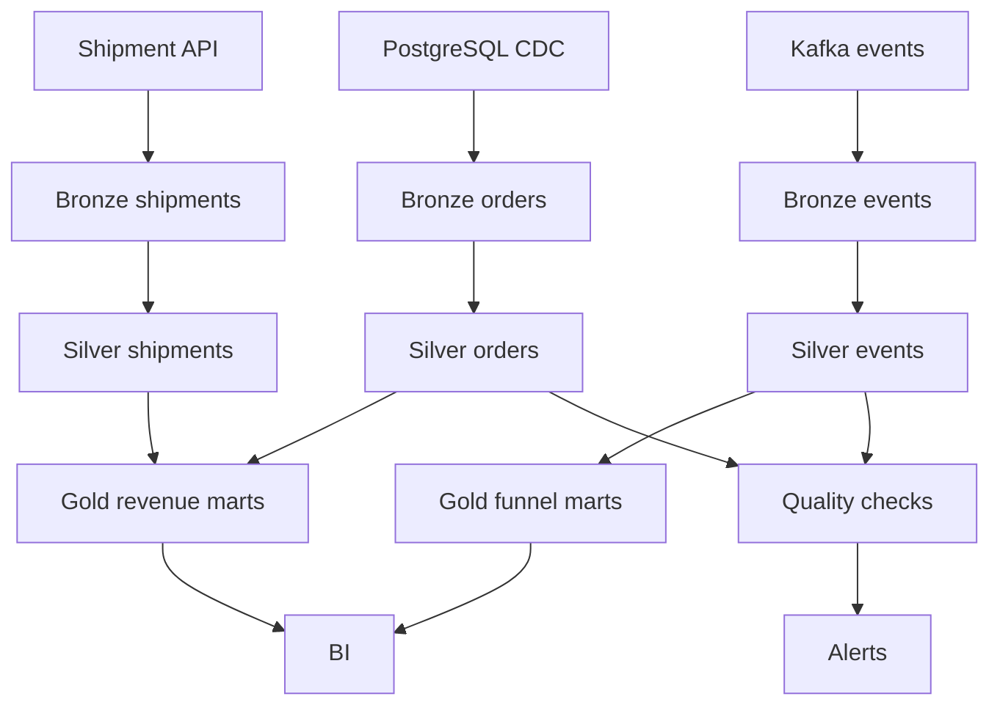

# 11 Data Lake and Lakehouse

## 1. Introduction

Data Lake là nơi lưu dữ liệu thô và dữ liệu bán cấu trúc/quy mô lớn trên object storage như S3, ADLS, GCS hoặc HDFS. Lakehouse là kiến trúc kết hợp ưu điểm của Data Lake và Data Warehouse: lưu trữ rẻ, mở rộng tốt, nhưng có thêm transaction, schema enforcement, time travel, metadata management và khả năng phục vụ BI/ML tin cậy hơn.

Mục tiêu học từ beginner đến senior:

- Beginner: hiểu data lake, zone, file format, partition.
- Junior: biết tổ chức raw/bronze/silver/gold, đọc ghi Parquet, kiểm tra schema.
- Mid: hiểu table format như Delta Lake, Apache Iceberg, Apache Hudi, compaction, schema evolution.
- Senior: thiết kế lakehouse production có governance, cost control, monitoring, incident handling, backfill, data contract và performance tuning.



Senior mindset: Data Lake không phải thư mục dump file. Nếu không có naming convention, partition strategy, metadata catalog, quality checks, retention policy và ownership, lake sẽ thành data swamp.

## 2. Theory

### Data Lake

Data Lake lưu dữ liệu ở dạng gần với source nhất. Nó phù hợp cho:

- Dữ liệu lớn.
- Dữ liệu semi-structured như JSON, logs, clickstream.
- ML feature exploration.
- Lưu raw data để replay/backfill.
- Tách storage khỏi compute.

Rủi ro:

- File nhỏ quá nhiều.
- Schema không ổn định.
- Thiếu catalog.
- Không có data quality.
- Người dùng không biết dataset nào đáng tin.

### Lakehouse

Lakehouse thêm lớp table management trên object storage. Các table format phổ biến:

- Delta Lake.
- Apache Iceberg.
- Apache Hudi.

Chúng giải quyết:

- ACID transaction.
- Snapshot isolation.
- Schema enforcement/evolution.
- Time travel.
- Upsert/delete/merge.
- Metadata pruning.
- Partition evolution.

### Data zones

| Zone | Mục đích | Quy tắc |
|---|---|---|
| Landing | File vừa nhận từ source | Gần như không transform |
| Bronze / Raw | Raw đã đăng ký metadata | Immutable, append-only nếu có thể |
| Silver | Cleaned, typed, deduped | Có schema validation |
| Gold | Business-ready marts | Có grain, SLA, owner |

### File formats

| Format | Khi dùng | Lưu ý |
|---|---|---|
| CSV | Exchange đơn giản | Không giữ type tốt, dễ lỗi encoding |
| JSON | Semi-structured API/event | Tốn scan, schema drift cao |
| Avro | Streaming/row-oriented | Tốt cho schema evolution |
| Parquet | Analytics/lakehouse | Columnar, compressed, predicate pushdown |
| ORC | Analytics, thường trong Hive ecosystem | Columnar, hiệu quả với Hadoop/Spark |

### Partitioning

Partition giúp query chỉ đọc phần dữ liệu cần thiết. Partition phổ biến:

- `event_date`
- `ingestion_date`
- `country`
- `source_system`

Không partition theo cột cardinality quá cao như `user_id`, vì sẽ tạo quá nhiều folder/file nhỏ.

### Metadata catalog

Catalog lưu thông tin:

- Database/table.
- Schema.
- Location.
- Partition.
- Owner.
- Classification.
- Lineage.
- Freshness/SLA.

Ví dụ: Hive Metastore, AWS Glue Data Catalog, Unity Catalog, Polaris, Nessie, hoặc catalog riêng của engine.

### Table format vs file format

Parquet là file format. Iceberg/Delta/Hudi là table format. Một bảng Iceberg có thể lưu dữ liệu bằng Parquet nhưng thêm metadata transaction ở tầng table.



## 3. Real-world example

Bài toán production: xây Lakehouse cho nền tảng e-commerce.

Sources:

- PostgreSQL OLTP: orders, customers, payments.
- API: shipment status.
- Kafka events: product views, add to cart, checkout.
- CSV từ finance: refund adjustments.

Architecture:

- Landing zone lưu file theo source và ingestion date.
- Bronze lưu raw immutable, thêm metadata như `ingestion_time`, `source_file`, `batch_id`.
- Silver chuẩn hóa type, timezone, dedup, validate schema.
- Gold tạo `fact_orders`, `fact_events`, `mart_revenue_daily`, `mart_funnel_daily`.
- Catalog quản lý owner, schema, freshness, access.
- Monitoring kiểm tra row count, duplicate, null key, file count, freshness, cost.



Incident thực tế: event table được partition theo `user_id` vì team nghĩ query user-level sẽ nhanh hơn. Sau vài tuần, object storage có hàng triệu small files, query planning chậm, listing cost tăng, Spark job mất nhiều thời gian chỉ để đọc metadata. Fix: repartition theo `event_date`, compact small files, dùng clustering/sorting theo `user_id` trong file thay vì partition folder.

## 4. SQL example

PostgreSQL và Oracle thường không phải lakehouse engine chính, nhưng vẫn rất quan trọng trong production:

- Là source OLTP cho CDC vào lake.
- Là nơi lưu metadata/control table.
- Là nơi chạy reconciliation với warehouse/lakehouse result.
- Oracle có external table để đọc file ngoài database trong một số kiến trúc.

### PostgreSQL: metadata table cho lake partitions

```sql
CREATE TABLE lake_partition_registry (
    dataset_name text NOT NULL,
    partition_date date NOT NULL,
    storage_path text NOT NULL,
    file_count integer NOT NULL,
    total_size_bytes bigint NOT NULL,
    row_count bigint,
    schema_version text NOT NULL,
    loaded_at timestamp NOT NULL DEFAULT CURRENT_TIMESTAMP,
    PRIMARY KEY (dataset_name, partition_date)
);
```

### PostgreSQL: kiểm tra partition thiếu

```sql
WITH expected_dates AS (
    SELECT generate_series(
        DATE '2026-05-01',
        DATE '2026-05-07',
        INTERVAL '1 day'
    )::date AS partition_date
)
SELECT e.partition_date
FROM expected_dates e
LEFT JOIN lake_partition_registry r
  ON r.dataset_name = 'silver_orders'
 AND r.partition_date = e.partition_date
WHERE r.partition_date IS NULL;
```

### PostgreSQL: reconciliation source vs lake

```sql
SELECT
    source.order_date,
    source.source_orders,
    lake.lake_orders,
    source.source_orders - lake.lake_orders AS diff_orders
FROM (
    SELECT order_date, COUNT(*) AS source_orders
    FROM orders
    WHERE order_date >= DATE '2026-05-01'
    GROUP BY order_date
) source
JOIN lake_order_daily_counts lake
  ON source.order_date = lake.order_date
WHERE source.source_orders <> lake.lake_orders;
```

### Oracle: external table pattern

```sql
CREATE TABLE ext_orders_csv (
    order_id       VARCHAR2(100),
    customer_id    VARCHAR2(100),
    amount         NUMBER(18, 2),
    order_status   VARCHAR2(30),
    updated_at     VARCHAR2(50)
)
ORGANIZATION EXTERNAL (
    TYPE ORACLE_LOADER
    DEFAULT DIRECTORY data_lake_dir
    ACCESS PARAMETERS (
        RECORDS DELIMITED BY NEWLINE
        FIELDS TERMINATED BY ','
        OPTIONALLY ENCLOSED BY '"'
        MISSING FIELD VALUES ARE NULL
    )
    LOCATION ('orders_2026_05_07.csv')
)
REJECT LIMIT UNLIMITED;
```

### Oracle: kiểm tra quality sau đọc external table

```sql
SELECT
    COUNT(*) AS row_count,
    COUNT(DISTINCT order_id) AS distinct_orders,
    SUM(CASE WHEN order_id IS NULL THEN 1 ELSE 0 END) AS null_order_ids,
    SUM(CASE WHEN UPPER(TRIM(order_status)) NOT IN ('PENDING', 'PAID', 'CANCELLED', 'REFUNDED') THEN 1 ELSE 0 END) AS invalid_status
FROM ext_orders_csv;
```

### Oracle: metadata registry cho lake partitions

```sql
CREATE TABLE lake_partition_registry (
    dataset_name       VARCHAR2(200) NOT NULL,
    partition_date     DATE NOT NULL,
    storage_path       VARCHAR2(1000) NOT NULL,
    file_count         NUMBER NOT NULL,
    total_size_bytes   NUMBER NOT NULL,
    row_count          NUMBER,
    schema_version     VARCHAR2(100) NOT NULL,
    loaded_at          TIMESTAMP DEFAULT SYSTIMESTAMP NOT NULL,
    CONSTRAINT pk_lake_partition_registry
        PRIMARY KEY (dataset_name, partition_date)
);
```

### Lakehouse SQL concept: merge/upsert

Trên lakehouse engine như Spark SQL, Databricks SQL, Trino với Iceberg, hoặc engine hỗ trợ table format, pattern thường là:

```sql
MERGE INTO silver.orders AS target
USING bronze.orders_incremental AS source
ON target.order_id = source.order_id
WHEN MATCHED AND source.updated_at > target.updated_at THEN UPDATE SET
    customer_id = source.customer_id,
    amount = source.amount,
    order_status = source.order_status,
    updated_at = source.updated_at
WHEN NOT MATCHED THEN INSERT (
    order_id, customer_id, amount, order_status, updated_at
) VALUES (
    source.order_id, source.customer_id, source.amount, source.order_status, source.updated_at
);
```

## 5. Python example

Ví dụ Python kiểm tra file layout, schema cơ bản và ghi partition registry. Trong production, bạn nên dùng thư viện phù hợp như PyArrow, Polars, Spark, DuckDB hoặc SDK cloud storage.

```python
from dataclasses import dataclass
from pathlib import Path
import logging

logger = logging.getLogger(__name__)


@dataclass(frozen=True)
class PartitionMetadata:
    dataset_name: str
    partition_date: str
    storage_path: str
    file_count: int
    total_size_bytes: int
    schema_version: str


def collect_partition_metadata(
    dataset_name: str,
    partition_date: str,
    partition_path: Path,
    schema_version: str,
) -> PartitionMetadata:
    files = [path for path in partition_path.glob("*.parquet") if path.is_file()]

    if not files:
        raise ValueError(f"No parquet files found in partition: {partition_path}")

    total_size = sum(path.stat().st_size for path in files)

    if len(files) > 1000:
        logger.warning(
            "Small-file risk dataset=%s partition=%s file_count=%s",
            dataset_name,
            partition_date,
            len(files),
        )

    return PartitionMetadata(
        dataset_name=dataset_name,
        partition_date=partition_date,
        storage_path=str(partition_path),
        file_count=len(files),
        total_size_bytes=total_size,
        schema_version=schema_version,
    )
```

Ví dụ kiểm tra schema drift đơn giản:

```python
EXPECTED_COLUMNS = {
    "order_id",
    "customer_id",
    "amount",
    "order_status",
    "updated_at",
}


def validate_columns(actual_columns: set[str]) -> None:
    missing = EXPECTED_COLUMNS - actual_columns
    unexpected = actual_columns - EXPECTED_COLUMNS

    if missing:
        raise ValueError(f"Missing required columns: {sorted(missing)}")

    if unexpected:
        logger.warning("Unexpected columns detected: %s", sorted(unexpected))
```

## 6. Optimization

### Performance optimization

- Dùng columnar format như Parquet/ORC cho analytics.
- Partition theo cột query lọc thường xuyên và cardinality hợp lý, thường là date.
- Tránh quá nhiều small files; chạy compaction định kỳ.
- Sort hoặc cluster trong file theo key query phổ biến như `customer_id`, `order_id`.
- Dùng predicate pushdown bằng cách tránh transform cột filter trong query.
- Dùng metadata pruning của Iceberg/Delta/Hudi.
- Tách job ingest nhỏ liên tục khỏi job optimize/compact nặng.
- Với query BI, tạo gold tables hoặc materialized aggregates thay vì query raw events.

### Cost optimization

- Object storage rẻ, nhưng compute scan và metadata listing không miễn phí.
- File nhỏ làm tăng chi phí planning và request/listing.
- Full refresh silver/gold mỗi ngày rất tốn; ưu tiên incremental.
- Retention policy cần rõ: raw giữ bao lâu, clean giữ bao lâu, snapshot expire khi nào.
- Nén Parquet bằng Snappy/ZSTD tùy workload.
- Chỉ chạy compaction theo partition nóng hoặc partition có small-file ratio cao.

### Monitoring

Theo dõi ở cấp lakehouse:

- Freshness theo dataset/partition.
- Row count theo partition.
- File count và average file size.
- Schema version.
- Duplicate key rate.
- Null key rate.
- Failed records/reject count.
- Query runtime và bytes scanned.
- Compaction success/failure.
- Snapshot count và metadata size.

Ví dụ quality metrics:

```sql
SELECT
    dataset_name,
    partition_date,
    file_count,
    total_size_bytes,
    row_count,
    total_size_bytes / NULLIF(file_count, 0) AS avg_file_size_bytes
FROM lake_partition_registry
WHERE partition_date >= CURRENT_DATE - INTERVAL '7 days';
```

### Best practices

- Raw/bronze nên immutable để replay và audit.
- Silver là nơi chuẩn hóa schema, type, timezone, dedup.
- Gold là nơi phục vụ business với grain và SLA rõ ràng.
- Mọi dataset production cần owner, description, schema, SLA, quality checks.
- Không cho analyst query trực tiếp vào landing zone.
- Dùng table format hỗ trợ transaction nếu cần upsert/delete hoặc concurrent writes.
- Thiết kế backfill như một first-class workflow, không phải script tạm.

## 7. Common mistakes

### Mistakes

- Coi data lake là nơi dump file không quản trị.
- Partition theo cột cardinality quá cao.
- Không compact small files.
- Không lưu raw data nên không replay được.
- Không có catalog nên không ai biết dataset nào đáng tin.
- Schema drift làm pipeline downstream hỏng.
- Không phân biệt event time và ingestion time.
- Không có retention policy, snapshot/file cũ tăng mãi.

### Anti-patterns

- Data swamp: mọi file đều nằm chung một chỗ, không owner, không schema, không SLA.
- One big gold table chứa mọi metric, mọi grain.
- Query dashboard trực tiếp trên raw JSON.
- Backfill ghi đè partition production mà không có validation.
- Xóa file object storage thủ công dưới table format mà không cập nhật metadata.
- Dùng `overwrite` toàn bảng cho incremental workload.
- Compaction chạy cùng lúc với ingest critical làm tranh tài nguyên.

### Incident scenarios

Incident 1: dashboard mất dữ liệu ngày hôm qua.

Nguyên nhân có thể:

- Partition chưa được load.
- Catalog chưa được repair/refresh.
- Job load ghi file nhưng không commit transaction.
- Timezone làm dữ liệu rơi vào partition khác.

Cách debug:

1. Kiểm tra source row count.
2. Kiểm tra file tồn tại trong storage path.
3. Kiểm tra catalog có partition/snapshot mới không.
4. Kiểm tra quality metrics và reject count.
5. Reconcile bronze -> silver -> gold.

Incident 2: query chậm đột ngột.

Nguyên nhân có thể:

- Small files tăng.
- Partition pruning không hoạt động.
- Query đọc raw JSON thay vì Parquet.
- Metadata snapshot quá nhiều.
- Data skew ở partition nóng.

## 8. Interview questions

### Junior

- Data Lake là gì?
- Parquet khác CSV như thế nào?
- Partition dùng để làm gì?
- Bronze, Silver, Gold khác nhau thế nào?

### Mid

- Lakehouse khác Data Lake truyền thống như thế nào?
- Delta/Iceberg/Hudi giải quyết vấn đề gì?
- Small files gây hại như thế nào?
- Schema evolution và schema enforcement khác nhau ra sao?
- Khi nào nên dùng event date, khi nào nên dùng ingestion date để partition?

### Senior

- Thiết kế lakehouse cho dữ liệu 10 TB/ngày như thế nào?
- Làm sao xử lý concurrent writes và incremental upserts trên object storage?
- Bạn thiết kế compaction strategy như thế nào để cân bằng cost và performance?
- Làm sao backfill 2 năm dữ liệu mà không phá dashboard production?
- Làm sao quản trị access control, PII, lineage và retention trong lakehouse?
- Khi table format metadata bị hỏng hoặc snapshot commit fail, bạn debug thế nào?

## 9. Exercises

1. Thiết kế folder layout cho raw/bronze/silver/gold của dataset `orders`.
2. Chọn partition strategy cho `fact_events` có 5 tỷ event/ngày và giải thích trade-off.
3. Viết SQL registry table cho partition metadata trong PostgreSQL hoặc Oracle.
4. Viết query kiểm tra partition thiếu trong 7 ngày gần nhất.
5. Viết Python function phát hiện partition có quá nhiều small files.
6. Thiết kế quality checks cho bronze -> silver -> gold.
7. Mô tả cách backfill lại `silver_orders` trong 90 ngày mà không làm sai gold marts.
8. Viết incident playbook khi file đã tồn tại trong object storage nhưng query không thấy dữ liệu.

## 10. Checklist

- [ ] Có naming convention cho bucket/container, database, table, partition.
- [ ] Có data zones rõ: landing, bronze, silver, gold.
- [ ] Raw/bronze giữ được dữ liệu để replay.
- [ ] File format phù hợp workload, ưu tiên Parquet/ORC cho analytics.
- [ ] Partition strategy có lý do rõ và không cardinality quá cao.
- [ ] Có table format hỗ trợ transaction nếu cần merge/update/delete.
- [ ] Có catalog và metadata owner/SLA/schema.
- [ ] Có schema validation và schema evolution policy.
- [ ] Có quality checks row count, nulls, duplicates, freshness.
- [ ] Có monitoring file count, average file size, bytes scanned, runtime.
- [ ] Có compaction strategy.
- [ ] Có cost policy cho storage retention, snapshot expiration, compute schedule.
- [ ] Có access control cho PII/sensitive data.
- [ ] Có backfill plan và rollback plan.
- [ ] Có incident playbook cho missing partition, schema drift, slow query, duplicate load.
