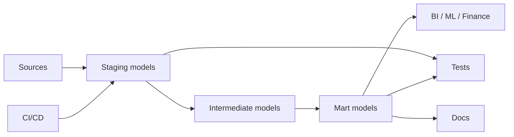

# 12 dbt Core

## 1. Introduction

dbt Core giúp Data Engineer biến SQL rời rạc thành project transformation có cấu trúc, test được, document được và chạy được trong CI/CD. Với fresher, dbt là cách tổ chức SQL. Với senior, dbt là contract giữa source, warehouse, business logic và production deployment.

| Cấp độ | Năng lực cần đạt |
|---|---|
| Beginner | Hiểu model, `ref`, source và chạy `dbt run`. |
| Junior | Viết staging/intermediate/mart models, thêm generic tests. |
| Mid | Dùng incremental, snapshots, macros, documentation. |
| Senior | Thiết kế dbt project có CI/CD, observability, cost control, semantic ownership và backfill strategy. |



## 2. Theory

### Models

Model là file SQL trong dbt, materialize thành view, table, incremental table hoặc ephemeral CTE. Model tốt phải có grain rõ ràng.

### Ref

`ref()` tạo dependency giữa models và giúp dbt build DAG. Không hardcode tên bảng nội bộ nếu có thể dùng `ref`.

```sql
select *
from {{ ref('stg_orders') }}
```

### Sources

`source()` khai báo raw tables từ hệ thống ngoài. Source giúp test freshness và document lineage từ điểm bắt đầu.

### Tests

dbt tests có hai nhóm:

- Generic tests: `not_null`, `unique`, `relationships`, `accepted_values`.
- Singular tests: SQL custom trả về dòng lỗi.

### Incremental

Incremental chỉ xử lý dữ liệu mới hoặc thay đổi. Senior phải thiết kế lookback window để xử lý late-arriving data.

### Snapshots

Snapshots theo dõi thay đổi dimension theo thời gian, thường dùng cho SCD Type 2.

### Macros

Macros dùng Jinja để tái sử dụng logic. Dùng tốt giúp chuẩn hóa. Dùng quá tay làm SQL khó đọc.

### Documentation

dbt docs không phải trang trí. Nó là data contract cho analyst, engineer và stakeholder.

### CI/CD

CI/CD cho dbt cần chạy compile, unit-like checks, tests trên changed models, lint SQL và deploy có kiểm soát.

## 3. Real-world example

Bài toán: xây mart doanh thu từ raw orders.

- Source: `raw.orders`, `raw.customers`.
- Staging: cast type, normalize status.
- Intermediate: dedup orders.
- Mart: `mart_customer_revenue`.
- Tests: unique order key, non-null customer key, accepted order status.
- CI: PR chạy `dbt build --select state:modified+`.

Incident thực tế: một model incremental chỉ lấy `updated_at > max(updated_at)` nên bỏ sót record late-arriving. Revenue thấp hơn source. Fix: thêm lookback 3 ngày, merge key rõ ràng và test reconciliation.

## 4. SQL example

### dbt model dùng PostgreSQL style

```sql
-- models/staging/stg_orders.sql
select
    cast(order_id as text) as order_id,
    cast(customer_id as text) as customer_id,
    cast(amount as numeric(18, 2)) as amount,
    upper(trim(order_status)) as order_status,
    cast(updated_at as timestamp) as updated_at
from {{ source('raw', 'orders') }}
where updated_at >= current_date - interval '3 days'
```

### dbt model dùng Oracle style

```sql
-- models/staging/stg_orders_oracle.sql
select
    cast(order_id as varchar2(100)) as order_id,
    cast(customer_id as varchar2(100)) as customer_id,
    cast(amount as number(18, 2)) as amount,
    upper(trim(order_status)) as order_status,
    cast(updated_at as timestamp) as updated_at
from {{ source('raw', 'orders') }}
where updated_at >= trunc(sysdate) - 3
```

### Incremental model

```sql
{{ config(
    materialized='incremental',
    unique_key='order_id'
) }}

select
    order_id,
    customer_id,
    amount,
    order_status,
    updated_at
from {{ ref('stg_orders') }}


where updated_at >= (
    select coalesce(max(updated_at), timestamp '1970-01-01 00:00:00')
    from {{ this }}
) - interval '3 days'

```

### Generic tests YAML

```yaml
version: 2

models:
  - name: stg_orders
    columns:
      - name: order_id
        tests:
          - not_null
          - unique
      - name: order_status
        tests:
          - accepted_values:
              values: ['PENDING', 'PAID', 'CANCELLED', 'REFUNDED']
```

## 5. Python example

Python thường dùng trong CI để chạy dbt command và fail pipeline rõ ràng.

```python
import subprocess


def run_command(command: list[str]) -> None:
    completed = subprocess.run(command, text=True)
    if completed.returncode != 0:
        raise RuntimeError(f"Command failed: {' '.join(command)}")


run_command(["dbt", "deps"])
run_command(["dbt", "compile"])
run_command(["dbt", "build", "--select", "state:modified+"])
```

## 6. Optimization

### Performance optimization

- Materialize staging nhẹ thành view, mart nặng thành table hoặc incremental.
- Dùng `incremental` cho fact lớn.
- Chọn `unique_key` đúng để merge an toàn.
- Tránh model quá nhiều CTE không cần thiết trên warehouse yếu optimizer.
- Dùng `ref` để dbt build đúng thứ tự.

### Cost optimization

- Không full-refresh fact lớn hằng ngày.
- Dùng state selection trong CI để không build toàn project.
- Tách daily job và backfill job.
- Materialize intermediate đắt nếu nhiều mart dùng lại.

### Monitoring

Theo dõi:

- dbt run duration.
- Test failure count.
- Source freshness.
- Row count theo model.
- Incremental insert/update count.
- Warehouse cost theo job.

## 7. Common mistakes

### Mistakes

- Hardcode table name thay vì dùng `ref`.
- Không khai báo source freshness.
- Incremental thiếu lookback cho late data.
- Test chỉ có `not_null`, không có relationship/reconciliation.
- Macro quá phức tạp làm SQL khó review.

### Anti-patterns

- Một model mart chứa toàn bộ business logic 1000 dòng.
- Full-refresh production khi không có kế hoạch.
- Copy-paste logic metric ở nhiều models.
- CI chỉ chạy compile, không chạy tests.

### Best practices

- Chia layer: source, staging, intermediate, marts.
- Mỗi model có grain rõ.
- Mỗi mart quan trọng có tests và owner.
- Snapshot dimension thay đổi chậm.
- CI chạy `dbt build` trên changed models.

### Incident scenario

Dashboard revenue giảm 20% sau deploy dbt:

1. Kiểm tra model nào thay đổi bằng state comparison.
2. So sánh row count từng layer.
3. Kiểm tra incremental predicate.
4. Chạy singular reconciliation test.
5. Rollback manifest hoặc revert model nếu cần.

## 8. Interview questions

### Junior

- `ref()` dùng để làm gì?
- Source khác model như thế nào?
- dbt test là gì?

### Mid

- Incremental model hoạt động như thế nào?
- Snapshot dùng cho use case nào?
- Macro nên dùng khi nào?

### Senior

- Thiết kế CI/CD cho dbt production như thế nào?
- Làm sao xử lý late-arriving data trong dbt incremental?
- Làm sao quản lý cost khi project có hàng trăm models?

## 9. Exercises

1. Tạo `stg_orders` từ raw orders.
2. Thêm tests `unique`, `not_null`, `accepted_values`.
3. Tạo incremental `fact_orders`.
4. Tạo snapshot cho customer segment.
5. Viết singular test kiểm tra revenue reconciliation.
6. Thiết kế CI command cho PR chỉ build changed models.

## 10. Checklist

- [ ] Project chia layer rõ ràng.
- [ ] Models dùng `ref` và `source`.
- [ ] Source freshness được bật cho nguồn quan trọng.
- [ ] Tests phủ key, enum, relationship, reconciliation.
- [ ] Incremental có lookback và unique key.
- [ ] Snapshots dùng cho dimension cần lịch sử.
- [ ] Docs có owner, grain, mô tả cột.
- [ ] CI/CD có compile, build, test.
- [ ] Monitoring có duration, failures, freshness, row count.
- [ ] Có rollback/backfill strategy.
