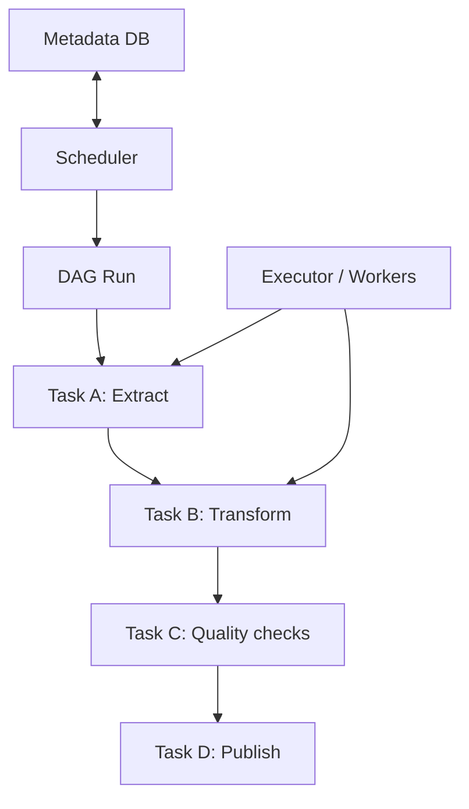

# 13 Airflow Orchestration

## 1. Introduction

Airflow là orchestration framework để định nghĩa, lên lịch, theo dõi và retry workflow dữ liệu. Beginner thường nhìn Airflow như cron nâng cao. Senior nhìn Airflow như control plane cho dependency, SLA, backfill, observability và incident response.

| Cấp độ | Năng lực cần đạt |
|---|---|
| Beginner | Hiểu DAG, task, dependency, scheduler. |
| Junior | Viết DAG có retry, schedule, sensor cơ bản. |
| Mid | Backfill, XCom, dynamic DAG, task groups. |
| Senior | Thiết kế production patterns: idempotency, alerting, pools, backpressure, data-aware scheduling. |



## 2. Theory

### DAG

DAG là Directed Acyclic Graph. Nó định nghĩa task và dependency, không nên chứa logic xử lý nặng trong parse time.

### Task dependency

Dependency thể hiện thứ tự chạy. Dependency sai có thể làm dữ liệu publish trước khi quality checks xong.

### Scheduler

Scheduler tạo DAG run theo schedule và đẩy task vào executor. Scheduler không nên bị quá tải bởi dynamic DAG sinh quá nhiều task.

### Sensors

Sensor chờ điều kiện: file tồn tại, partition sẵn sàng, upstream done. Dùng sensor sai có thể chiếm worker slot.

### Retry

Retry xử lý lỗi tạm thời. Retry không sửa được bug logic. Task phải idempotent để retry an toàn.

### Backfill

Backfill chạy lại quá khứ. Đây là nơi nhiều pipeline lộ bug vì logic không deterministic hoặc phụ thuộc current date.

### XCom

XCom truyền metadata nhỏ giữa tasks. Không dùng XCom để truyền dataset lớn.

### Dynamic DAG

Dynamic DAG tạo DAG/task từ config. Cần kiểm soát số lượng task và parse time.

### Production patterns

- Idempotent tasks.
- Explicit data intervals.
- Data quality gate trước publish.
- Alert theo severity.
- Pools để giới hạn concurrency.
- Separate backfill DAG nếu workload lớn.

## 3. Real-world example

Pipeline daily revenue:

1. Sensor chờ raw orders partition.
2. Task chạy dbt staging.
3. Task chạy dbt mart.
4. Task kiểm tra row count và revenue reconciliation.
5. Task publish dashboard flag.

Incident thực tế: DAG retry task load nhưng task không idempotent, mỗi retry append thêm dữ liệu. Revenue double. Fix: dùng merge/upsert, output partition overwrite an toàn, và task-level idempotency checklist.

## 4. SQL example

### PostgreSQL: kiểm tra partition trước khi downstream chạy

```sql
SELECT COUNT(*) AS rows_ready
FROM raw_orders
WHERE ingestion_date = CURRENT_DATE - INTERVAL '1 day';
```

### Oracle: kiểm tra partition trước khi downstream chạy

```sql
SELECT COUNT(*) AS rows_ready
FROM raw_orders
WHERE ingestion_date = TRUNC(SYSDATE) - 1;
```

### PostgreSQL: task quality check

```sql
SELECT
    CASE
        WHEN COUNT(*) = COUNT(DISTINCT order_id) THEN 1
        ELSE 0
    END AS is_unique
FROM fact_orders
WHERE order_date = CURRENT_DATE - INTERVAL '1 day';
```

### Oracle: task quality check

```sql
SELECT
    CASE
        WHEN COUNT(*) = COUNT(DISTINCT order_id) THEN 1
        ELSE 0
    END AS is_unique
FROM fact_orders
WHERE order_date = TRUNC(SYSDATE) - 1;
```

## 5. Python example

Ví dụ DAG rút gọn:

```python
from datetime import datetime, timedelta

from airflow import DAG
from airflow.operators.bash import BashOperator

default_args = {
    "retries": 2,
    "retry_delay": timedelta(minutes=10),
}

with DAG(
    dag_id="daily_revenue_pipeline",
    start_date=datetime(2026, 1, 1),
    schedule="@daily",
    catchup=True,
    default_args=default_args,
    max_active_runs=1,
) as dag:
    run_staging = BashOperator(
        task_id="run_staging",
        bash_command="dbt build --select tag:staging --vars '{run_date: {{ ds }}}'",
    )

    run_marts = BashOperator(
        task_id="run_marts",
        bash_command="dbt build --select tag:revenue --vars '{run_date: {{ ds }}}'",
    )

    quality_checks = BashOperator(
        task_id="quality_checks",
        bash_command="dbt test --select tag:revenue --vars '{run_date: {{ ds }}}'",
    )

    run_staging >> run_marts >> quality_checks
```

## 6. Optimization

### Performance optimization

- Giữ DAG parse nhanh, tránh query DB ở top-level.
- Dùng pools để giới hạn task nặng.
- Dùng deferrable sensors nếu có.
- Tách backfill lớn khỏi daily DAG.
- Tránh XCom payload lớn.

### Cost optimization

- Không schedule quá dày nếu source không refresh.
- Dùng data interval để chỉ xử lý partition cần thiết.
- Backfill theo batch, không bắn hàng trăm run cùng lúc.
- Tắt hoặc scale down workers ngoài giờ cao điểm nếu platform cho phép.

### Monitoring

Theo dõi:

- DAG success/failure.
- Task duration.
- Retry count.
- Queue time.
- SLA miss.
- Sensor wait time.
- Backfill progress.

## 7. Common mistakes

### Mistakes

- Task không idempotent nhưng bật retry.
- Dùng `datetime.now()` thay vì data interval.
- Sensor chiếm worker lâu.
- XCom truyền file/data lớn.
- Catchup/backfill không được test.

### Anti-patterns

- Airflow task chứa business transformation phức tạp thay vì gọi dbt/Spark job.
- Một DAG khổng lồ cho mọi domain.
- Dynamic DAG sinh hàng nghìn task không kiểm soát.
- Alert mọi lỗi cùng severity làm team bị noise.

### Best practices

- Task nhỏ, idempotent, có input/output rõ.
- Data quality gate trước publish.
- Dùng pools, retries, timeouts hợp lý.
- Backfill có runbook riêng.
- Alert có owner và severity.

### Incident scenario

DAG bị kẹt vì sensor:

1. Kiểm tra sensor mode.
2. Kiểm tra upstream partition có thật sự đến chưa.
3. Kiểm tra worker slots bị chiếm không.
4. Chuyển sang deferrable sensor hoặc reschedule mode.
5. Thêm timeout và alert.

## 8. Interview questions

### Junior

- DAG là gì?
- Task dependency là gì?
- Scheduler làm gì?

### Mid

- Retry và idempotency liên quan thế nào?
- Backfill trong Airflow cần chú ý gì?
- XCom nên và không nên dùng khi nào?

### Senior

- Thiết kế Airflow production cho 500 DAG như thế nào?
- Làm sao tránh backfill làm nghẽn daily pipeline?
- Làm sao thiết kế alert giảm noise nhưng không bỏ lỡ incident?

## 9. Exercises

1. Viết DAG 3 task extract-transform-check.
2. Thêm retry và timeout.
3. Viết SQL quality check task.
4. Thiết kế backfill cho 90 ngày dữ liệu.
5. Refactor DAG để dùng TaskGroup.
6. Thiết kế dynamic DAG từ config YAML.

## 10. Checklist

- [ ] DAG có owner và schedule rõ.
- [ ] Task idempotent.
- [ ] Retry không tạo duplicate.
- [ ] Dùng data interval thay vì current date tùy tiện.
- [ ] Sensor có timeout.
- [ ] XCom chỉ dùng metadata nhỏ.
- [ ] Có quality gate trước publish.
- [ ] Có pools/concurrency control.
- [ ] Backfill đã được test.
- [ ] Monitoring và alert rõ owner.
