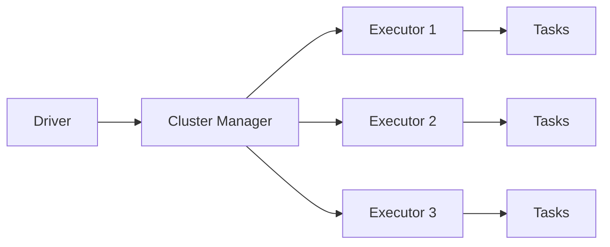

# 14 Apache Spark

## 1. Introduction

Apache Spark là engine xử lý dữ liệu phân tán cho batch và streaming. Beginner cần hiểu DataFrame API. Senior cần hiểu driver/executor, shuffle, partitioning, Catalyst optimizer, memory, skew, cost và vận hành production.

| Cấp độ | Năng lực cần đạt |
|---|---|
| Beginner | Đọc/ghi DataFrame, dùng Spark SQL cơ bản. |
| Junior | Hiểu lazy evaluation, actions, transformations. |
| Mid | Tối ưu shuffle, partitioning, joins, caching. |
| Senior | Debug skew/OOM, tune cluster, thiết kế job cost-aware và observable. |



## 2. Theory

### Spark architecture

Driver giữ SparkSession, tạo logical plan và điều phối job. Executors chạy tasks và lưu dữ liệu/cache.

### Driver/Executor

Driver OOM thường do `collect()` quá nhiều. Executor OOM thường do partition quá lớn, shuffle nặng hoặc skew.

### Lazy evaluation

Transformations như `select`, `filter`, `join` không chạy ngay. Actions như `count`, `write`, `collect` mới trigger execution.

### Shuffle

Shuffle di chuyển dữ liệu giữa executors, thường xảy ra khi `groupBy`, `join`, `distinct`, `orderBy`. Đây là nguồn cost lớn.

### Partitioning

Partition quyết định cách dữ liệu chia nhỏ. Quá ít partition làm task lớn. Quá nhiều partition tạo overhead.

### Catalyst optimizer

Catalyst tối ưu logical/physical plan: predicate pushdown, column pruning, join strategy.

### DataFrame API và Spark SQL

DataFrame API và Spark SQL đều đi qua Catalyst. Chọn cái dễ đọc, dễ maintain.

## 3. Real-world example

Bài toán: xử lý 2 TB event logs mỗi ngày.

- Read Parquet partition theo event_date.
- Dedup event theo `event_id`.
- Join với dimension user.
- Aggregate session metrics.
- Write partitioned output.

Incident thực tế: một key `country='US'` chiếm 80% data, join bị skew, vài task chạy 2 giờ trong khi task khác xong sau 2 phút. Fix: broadcast dimension nhỏ, salting key hoặc xử lý skew riêng.

## 4. SQL example

### PostgreSQL: logic nguồn trước khi Spark ingest

```sql
SELECT
    event_id,
    user_id,
    event_name,
    event_time,
    event_date
FROM raw_events
WHERE event_date = CURRENT_DATE - INTERVAL '1 day';
```

### Oracle: logic nguồn trước khi Spark ingest

```sql
SELECT
    event_id,
    user_id,
    event_name,
    event_time,
    event_date
FROM raw_events
WHERE event_date = TRUNC(SYSDATE) - 1;
```

### Spark SQL

```sql
SELECT
    user_id,
    event_date,
    COUNT(*) AS event_count,
    COUNT(DISTINCT session_id) AS session_count
FROM clean_events
WHERE event_date = DATE '2026-05-07'
GROUP BY user_id, event_date;
```

## 5. Python example

PySpark job:

```python
from pyspark.sql import SparkSession, functions as F, Window

spark = SparkSession.builder.appName("daily_events").getOrCreate()

events = (
    spark.read.parquet("s3://lake/raw/events/")
    .where(F.col("event_date") == "2026-05-07")
    .select("event_id", "user_id", "event_name", "event_time", "event_date", "ingestion_time")
)

window = Window.partitionBy("event_id").orderBy(F.col("ingestion_time").desc())

deduped = (
    events.withColumn("rn", F.row_number().over(window))
    .where(F.col("rn") == 1)
    .drop("rn")
)

deduped.write.mode("overwrite").partitionBy("event_date").parquet(
    "s3://lake/clean/events/"
)
```

## 6. Optimization

### Performance optimization

- Filter và select cột sớm để tận dụng predicate pushdown/column pruning.
- Broadcast join dimension nhỏ.
- Tránh `collect()` trên data lớn.
- Repartition theo key phù hợp trước write hoặc join nặng.
- Dùng Adaptive Query Execution nếu có.
- Xử lý skew bằng salting hoặc split heavy keys.

### Cost optimization

- Đọc đúng partition, không scan full lake.
- Dùng Parquet/ORC thay CSV/JSON cho data lớn.
- Right-size cluster, tránh over-provision.
- Cache chỉ khi reuse nhiều lần.
- Compact small files để giảm overhead.

### Monitoring

Theo dõi:

- Stage duration.
- Shuffle read/write.
- Spill memory/disk.
- Skewed tasks.
- Executor OOM.
- Input/output rows.
- Small file count.

## 7. Common mistakes

### Mistakes

- Dùng `collect()` để xử lý trên driver.
- Không filter partition.
- Join lớn-lớn không hiểu shuffle.
- Ghi quá nhiều small files.
- Cache mọi thứ.

### Anti-patterns

- Dùng Spark cho file vài MB.
- Viết UDF Python cho logic có thể dùng built-in functions.
- Full refresh data lake hằng ngày dù chỉ thay đổi một partition.
- Không đọc Spark UI khi job chậm.

### Best practices

- Bắt đầu bằng DataFrame built-in functions.
- Inspect physical plan với `explain`.
- Thiết kế partition strategy trước khi dữ liệu lớn.
- Monitor shuffle và skew.
- Ghi output idempotent theo partition.

### Incident scenario

Spark job OOM:

1. Kiểm tra stage nào fail.
2. Kiểm tra shuffle spill và task size.
3. Kiểm tra skew key.
4. Giảm partition size hoặc repartition.
5. Tránh collect/cache không cần thiết.

## 8. Interview questions

### Junior

- Spark driver và executor là gì?
- Lazy evaluation là gì?
- Transformation khác action thế nào?

### Mid

- Shuffle xảy ra khi nào?
- Broadcast join dùng khi nào?
- Partitioning ảnh hưởng performance thế nào?

### Senior

- Debug Spark skew như thế nào?
- Làm sao giảm cost Spark job xử lý 10 TB/ngày?
- Catalyst optimizer giúp gì và giới hạn ở đâu?

## 9. Exercises

1. Đọc Parquet theo partition và aggregate event count.
2. Dedup event bằng window.
3. Join fact lớn với dimension nhỏ bằng broadcast.
4. Dùng `explain` so sánh plan trước/sau filter.
5. Mô phỏng skew key và đề xuất fix.
6. Thiết kế output partition cho event lake.

## 10. Checklist

- [ ] Input được filter partition.
- [ ] Chỉ select cột cần thiết.
- [ ] Không dùng `collect()` trên data lớn.
- [ ] Join strategy rõ ràng.
- [ ] Shuffle được kiểm soát.
- [ ] Skew được kiểm tra.
- [ ] Output không tạo quá nhiều small files.
- [ ] Job có row count metrics.
- [ ] Spark UI/log được dùng để debug.
- [ ] Cost cluster phù hợp workload.
