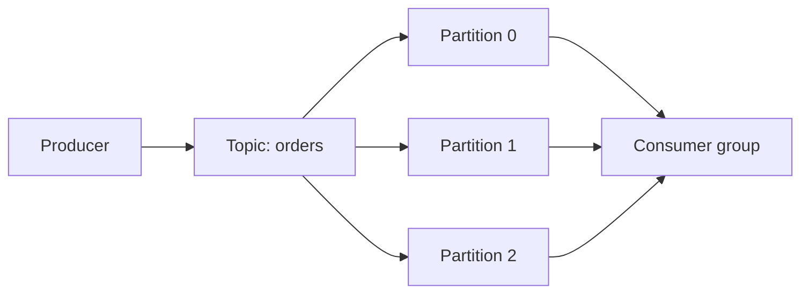

# 15 Kafka Fundamentals

## 1. Introduction

Kafka là distributed event log dùng cho streaming data pipelines, event-driven architecture và real-time integration. Beginner cần hiểu topic, partition, offset. Senior cần hiểu ordering, delivery guarantee, retention, replication, consumer lag, schema và vận hành incident.

| Cấp độ | Năng lực cần đạt |
|---|---|
| Beginner | Hiểu topic, partition, producer, consumer. |
| Junior | Đọc offset, consumer group, retention. |
| Mid | Thiết kế partition key, replication, delivery semantics. |
| Senior | Vận hành Kafka production: lag, rebalancing, schema evolution, exactly-once boundaries, cost. |



## 2. Theory

### Topic

Topic là log logical của event, ví dụ `orders.created`, `payments.updated`.

### Partition

Partition giúp scale throughput. Ordering chỉ được đảm bảo trong cùng partition.

### Offset

Offset là vị trí của message trong partition. Consumer commit offset để ghi nhớ đã xử lý đến đâu.

### Consumer group

Consumer group chia partitions cho nhiều consumers. Một partition trong một group chỉ được đọc bởi một consumer tại một thời điểm.

### Replication

Replication tạo bản sao partition trên nhiều brokers để tăng availability.

### Retention

Retention quyết định Kafka giữ message bao lâu hoặc bao nhiêu dung lượng.

### Ordering

Nếu cần ordering theo order_id, partition key phải là `order_id`. Nếu key sai, event cùng order có thể nằm ở nhiều partition.

### Delivery guarantee

- At-most-once: có thể mất message.
- At-least-once: không mất nhưng có thể duplicate.
- Exactly-once: phụ thuộc producer, broker, consumer, sink và transaction boundary.

## 3. Real-world example

CDC từ OLTP orders database vào Kafka:

- Topic: `db.orders`.
- Key: `order_id`.
- Consumers: warehouse loader, fraud detection, notification service.
- Retention: 7 ngày.
- Schema registry để quản lý schema evolution.

Incident thực tế: consumer xử lý xong nhưng commit offset trước khi ghi warehouse thành công. Khi job crash, một số message bị mất. Fix: commit offset sau khi sink transaction thành công hoặc dùng connector có exactly-once/idempotent sink.

## 4. SQL example

Kafka không phải SQL database, nhưng streaming pipeline thường sink vào PostgreSQL/Oracle để validate.

### PostgreSQL: kiểm tra duplicate event sau Kafka sink

```sql
SELECT
    event_id,
    COUNT(*) AS row_count
FROM kafka_orders_sink
WHERE event_date = CURRENT_DATE
GROUP BY event_id
HAVING COUNT(*) > 1;
```

### Oracle: kiểm tra duplicate event sau Kafka sink

```sql
SELECT
    event_id,
    COUNT(*) AS row_count
FROM kafka_orders_sink
WHERE event_date = TRUNC(SYSDATE)
GROUP BY event_id
HAVING COUNT(*) > 1;
```

### PostgreSQL: kiểm tra ordering theo business key

```sql
SELECT
    order_id,
    COUNT(*) AS out_of_order_events
FROM (
    SELECT
        order_id,
        event_time,
        LAG(event_time) OVER (
            PARTITION BY order_id
            ORDER BY consumed_offset
        ) AS previous_event_time
    FROM kafka_orders_sink
) x
WHERE event_time < previous_event_time
GROUP BY order_id;
```

## 5. Python example

Producer đơn giản:

```python
import json
from confluent_kafka import Producer

producer = Producer({"bootstrap.servers": "localhost:9092"})


def delivery_report(error, message) -> None:
    if error is not None:
        raise RuntimeError(f"Delivery failed: {error}")


event = {"order_id": "O123", "status": "PAID"}

producer.produce(
    topic="orders.events",
    key=event["order_id"],
    value=json.dumps(event).encode("utf-8"),
    callback=delivery_report,
)
producer.flush()
```

Consumer phải idempotent vì at-least-once có thể duplicate.

## 6. Optimization

### Performance optimization

- Chọn partition count theo throughput và consumer parallelism.
- Chọn partition key tránh skew.
- Batch producer messages.
- Tune compression như `snappy` hoặc `lz4`.
- Theo dõi consumer lag.

### Cost optimization

- Retention quá dài làm tăng storage.
- Replication factor cao tăng cost nhưng tăng availability.
- Event payload quá lớn làm tăng network/storage.
- Nén message để giảm bandwidth.

### Monitoring

Theo dõi:

- Consumer lag.
- Broker disk usage.
- Under-replicated partitions.
- Producer error rate.
- Consumer rebalance frequency.
- Message throughput.
- Retention size.

## 7. Common mistakes

### Mistakes

- Nghĩ Kafka đảm bảo global ordering.
- Commit offset trước khi sink thành công.
- Partition key gây skew.
- Không quản lý schema evolution.
- Retention ngắn hơn thời gian recovery.

### Anti-patterns

- Dùng Kafka như database query tùy ý.
- Message payload cực lớn chứa file/data dump.
- Một topic chứa quá nhiều event type không liên quan.
- Không có dead-letter topic.

### Best practices

- Key event theo entity cần ordering.
- Consumer xử lý idempotent.
- Schema có versioning.
- Có DLQ cho poison messages.
- Monitor lag như production SLO.

### Incident scenario

Consumer lag tăng nhanh:

1. Kiểm tra throughput producer có tăng không.
2. Kiểm tra consumer error/retry.
3. Kiểm tra rebalance liên tục.
4. Tăng consumer instances nếu partition cho phép.
5. Tối ưu sink hoặc batch writes.

## 8. Interview questions

### Junior

- Topic và partition là gì?
- Offset là gì?
- Consumer group hoạt động thế nào?

### Mid

- Ordering trong Kafka được đảm bảo ở mức nào?
- At-least-once khác exactly-once thế nào?
- Retention ảnh hưởng recovery ra sao?

### Senior

- Thiết kế Kafka topic cho CDC orders như thế nào?
- Debug consumer lag production như thế nào?
- Làm sao xử lý schema evolution không phá consumer?

## 9. Exercises

1. Thiết kế topic cho order events.
2. Chọn partition key cho payment events và giải thích.
3. Viết consumer idempotent pseudo-code.
4. Thiết kế DLQ cho invalid events.
5. Viết SQL kiểm tra duplicate sau sink.
6. Mô tả incident consumer lag và cách xử lý.

## 10. Checklist

- [ ] Topic naming rõ ràng.
- [ ] Partition key phù hợp ordering và throughput.
- [ ] Replication factor phù hợp availability.
- [ ] Retention đủ cho recovery.
- [ ] Consumer idempotent.
- [ ] Offset commit sau khi xử lý an toàn.
- [ ] Schema evolution được quản lý.
- [ ] Có DLQ.
- [ ] Monitoring lag, broker health, producer errors.
- [ ] Có runbook cho lag và poison message.
