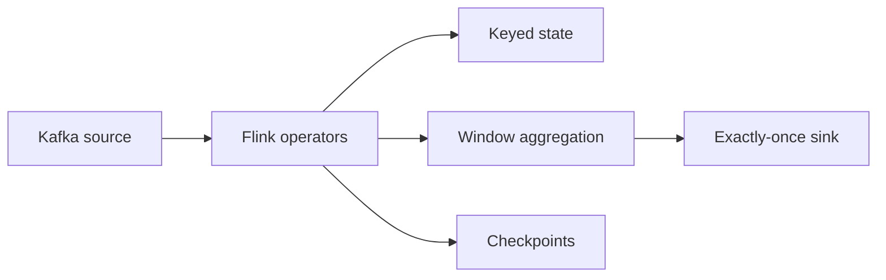

# 16 Flink Streaming

## 1. Introduction

Apache Flink là stream processing engine mạnh cho stateful, event-time, exactly-once pipelines. Beginner cần hiểu stream processing. Senior cần hiểu watermark, state backend, checkpoint, windowing, recovery, latency, throughput và operational cost.

| Cấp độ | Năng lực cần đạt |
|---|---|
| Beginner | Hiểu stream là dữ liệu liên tục. |
| Junior | Dùng event time, watermark, window cơ bản. |
| Mid | Stateful processing, checkpoint, exactly-once sink. |
| Senior | Tune state, latency, backpressure, recovery, schema evolution và incident response. |



## 2. Theory

### Stream processing

Stream processing xử lý event liên tục, khác batch xử lý theo lô.

### Event time

Event time là thời điểm sự kiện xảy ra, khác processing time là thời điểm hệ thống xử lý.

### Watermark

Watermark báo cho engine biết đã có thể xem như không còn event cũ hơn một mốc thời gian, dù vẫn có late events.

### Stateful processing

State lưu trạng thái theo key, ví dụ tổng tiền theo customer trong 5 phút.

### Windowing

Window gom event theo thời gian:

- Tumbling window: cửa sổ không overlap.
- Sliding window: overlap.
- Session window: dựa trên inactivity gap.

### Exactly-once

Exactly-once cần source, state, checkpoint và sink hỗ trợ đúng. Không nên tuyên bố exactly-once nếu sink chỉ append không idempotent.

### Checkpoint

Checkpoint lưu state định kỳ để recovery sau failure.

## 3. Real-world example

Real-time fraud detection:

- Source: Kafka `payments.events`.
- Key by `card_id`.
- Window 5 phút.
- Tính số transaction và tổng amount.
- Nếu vượt threshold, ghi alert.
- Checkpoint mỗi 60 giây.

Incident thực tế: watermark quá aggressive làm late payment events bị drop, fraud alert thiếu dữ liệu. Fix: tăng allowed lateness, monitor late event rate và đưa late events vào side output.

## 4. SQL example

### PostgreSQL: validate streaming sink

```sql
SELECT
    window_start,
    window_end,
    COUNT(*) AS alert_count
FROM fraud_alerts
WHERE window_start >= CURRENT_TIMESTAMP - INTERVAL '1 hour'
GROUP BY window_start, window_end
ORDER BY window_start;
```

### Oracle: validate streaming sink

```sql
SELECT
    window_start,
    window_end,
    COUNT(*) AS alert_count
FROM fraud_alerts
WHERE window_start >= SYSTIMESTAMP - INTERVAL '1' HOUR
GROUP BY window_start, window_end
ORDER BY window_start;
```

### Flink SQL: tumbling window

```sql
SELECT
    window_start,
    window_end,
    card_id,
    COUNT(*) AS txn_count,
    SUM(amount) AS total_amount
FROM TABLE(
    TUMBLE(TABLE payments, DESCRIPTOR(event_time), INTERVAL '5' MINUTES)
)
GROUP BY window_start, window_end, card_id;
```

## 5. Python example

PyFlink concept rút gọn:

```python
from pyflink.datastream import StreamExecutionEnvironment
from pyflink.common.watermark_strategy import WatermarkStrategy
from pyflink.common.time import Duration

env = StreamExecutionEnvironment.get_execution_environment()
env.enable_checkpointing(60000)

watermark_strategy = (
    WatermarkStrategy
    .for_bounded_out_of_orderness(Duration.of_minutes(2))
    .with_timestamp_assigner(lambda event, _: event["event_time_ms"])
)

payments = env.from_collection([
    {"card_id": "C1", "amount": 120.0, "event_time_ms": 1}
])

payments.assign_timestamps_and_watermarks(watermark_strategy)
```

## 6. Optimization

### Performance optimization

- Key distribution phải tránh skew.
- Tune checkpoint interval và timeout.
- Chọn state backend phù hợp.
- Monitor backpressure.
- Giảm state size bằng TTL.
- Dùng async I/O cho lookup external nếu cần.

### Cost optimization

- State quá lớn làm tăng storage/checkpoint cost.
- Checkpoint quá thường xuyên tăng overhead.
- Parallelism quá cao tăng compute cost.
- Retention state không hợp lý gây phình state.

### Monitoring

Theo dõi:

- Checkpoint duration/failure.
- Backpressure.
- Watermark lag.
- Late event count.
- State size.
- Throughput.
- End-to-end latency.
- Restart count.

## 7. Common mistakes

### Mistakes

- Dùng processing time cho logic cần event time.
- Watermark quá chặt làm mất late events.
- State không có TTL.
- Sink không idempotent nhưng claim exactly-once.
- Không monitor checkpoint failure.

### Anti-patterns

- External DB lookup sync từng event.
- Một job xử lý quá nhiều domain không liên quan.
- Không có side output cho late/invalid events.
- Deploy streaming job mà không có savepoint/rollback plan.

### Best practices

- Dùng event time cho business event.
- Định nghĩa allowed lateness theo data thực tế.
- Thiết kế sink idempotent hoặc transactional.
- Bật checkpoint và test recovery.
- Monitor watermark lag và state size.

### Incident scenario

Flink latency tăng:

1. Kiểm tra backpressure.
2. Kiểm tra sink chậm.
3. Kiểm tra checkpoint duration.
4. Kiểm tra key skew.
5. Scale parallelism hoặc tối ưu operator bottleneck.

## 8. Interview questions

### Junior

- Stream processing là gì?
- Event time khác processing time thế nào?
- Window là gì?

### Mid

- Watermark giải quyết vấn đề gì?
- Stateful processing là gì?
- Checkpoint dùng để làm gì?

### Senior

- Exactly-once trong Flink phụ thuộc những thành phần nào?
- Debug backpressure production như thế nào?
- Thiết kế late event handling cho financial stream ra sao?

## 9. Exercises

1. Thiết kế tumbling window 5 phút cho payments.
2. Giải thích watermark 2 phút ảnh hưởng late data.
3. Thiết kế state TTL cho user session.
4. Viết SQL validate sink alert count.
5. Mô tả recovery bằng checkpoint.
6. Thiết kế side output cho late events.

## 10. Checklist

- [ ] Dùng event time nếu business yêu cầu.
- [ ] Watermark phù hợp late data.
- [ ] State có TTL nếu cần.
- [ ] Checkpoint bật và monitor.
- [ ] Sink idempotent/transactional.
- [ ] Có strategy cho late events.
- [ ] Backpressure được monitor.
- [ ] State size được kiểm soát.
- [ ] Có savepoint/rollback plan.
- [ ] Alert cho latency, checkpoint failure, restart.
