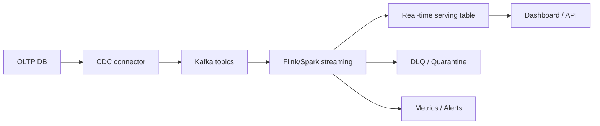

# 17 Real-Time Data Pipelines

## 1. Introduction

Real-time data pipelines đưa dữ liệu từ source đến consumer trong vài giây hoặc vài phút. Beginner thường nghĩ real-time chỉ là nhanh. Senior hiểu real-time là trade-off giữa latency, correctness, cost, ordering, replay, schema evolution và operational risk.

| Cấp độ | Năng lực cần đạt |
|---|---|
| Beginner | Hiểu streaming ETL và Kafka pipeline cơ bản. |
| Junior | Xây CDC streaming và real-time dashboard đơn giản. |
| Mid | Kết hợp Kafka + Spark/Flink, xử lý dedup, late data. |
| Senior | Thiết kế event-driven architecture có replay, exactly-once boundaries, monitoring và incident response. |



## 2. Theory

### Streaming ETL

Streaming ETL extract-transform-load dữ liệu liên tục. Nó cần idempotency, schema handling và monitoring tốt hơn batch vì lỗi lan nhanh.

### CDC streaming

CDC capture thay đổi từ database: insert, update, delete. CDC event thường có operation type, before/after values và log position.

### Kafka + Spark/Flink

Kafka lưu event log. Spark Structured Streaming hoặc Flink xử lý transformation. Sink có thể là warehouse, lakehouse, database phục vụ dashboard.

### Real-time dashboard

Dashboard real-time cần serving layer tối ưu đọc nhanh. Không nên query trực tiếp Kafka.

### Event-driven architecture

Service phát event khi business state thay đổi. Consumer phản ứng với event. Cần event contract rõ ràng.

## 3. Real-world example

Bài toán: real-time revenue dashboard.

- PostgreSQL/Oracle OLTP orders phát CDC.
- Kafka topic `orders.cdc`.
- Flink xử lý insert/update/delete.
- Dedup theo primary key và log sequence.
- Sink vào serving table `realtime_order_revenue`.
- Dashboard refresh mỗi 10 giây.

Incident thực tế: CDC connector gửi snapshot ban đầu và stream cùng lúc, downstream không dedup theo primary key + source position nên revenue double. Fix: dùng primary key merge, phân biệt snapshot/read events, monitor duplicate/update count.

## 4. SQL example

### PostgreSQL: source table CDC-friendly

```sql
SELECT
    order_id,
    customer_id,
    amount,
    order_status,
    updated_at
FROM orders
WHERE updated_at >= CURRENT_TIMESTAMP - INTERVAL '5 minutes';
```

### Oracle: source table CDC-friendly

```sql
SELECT
    order_id,
    customer_id,
    amount,
    order_status,
    updated_at
FROM orders
WHERE updated_at >= SYSTIMESTAMP - INTERVAL '5' MINUTE;
```

### PostgreSQL: serving table upsert

```sql
INSERT INTO realtime_order_revenue (
    order_id,
    customer_id,
    amount,
    order_status,
    updated_at
)
VALUES (
    $1, $2, $3, $4, $5
)
ON CONFLICT (order_id)
DO UPDATE SET
    customer_id = EXCLUDED.customer_id,
    amount = EXCLUDED.amount,
    order_status = EXCLUDED.order_status,
    updated_at = EXCLUDED.updated_at;
```

### Oracle: serving table merge

```sql
MERGE INTO realtime_order_revenue t
USING (
    SELECT
        :order_id AS order_id,
        :customer_id AS customer_id,
        :amount AS amount,
        :order_status AS order_status,
        :updated_at AS updated_at
    FROM dual
) s
ON (t.order_id = s.order_id)
WHEN MATCHED THEN UPDATE SET
    t.customer_id = s.customer_id,
    t.amount = s.amount,
    t.order_status = s.order_status,
    t.updated_at = s.updated_at
WHEN NOT MATCHED THEN INSERT (
    order_id, customer_id, amount, order_status, updated_at
) VALUES (
    s.order_id, s.customer_id, s.amount, s.order_status, s.updated_at
);
```

## 5. Python example

Consumer xử lý event-driven upsert pseudo-code:

```python
import json
import logging

logger = logging.getLogger(__name__)


def process_cdc_event(event: dict, sink) -> None:
    operation = event["op"]
    after = event.get("after")
    before = event.get("before")

    if operation in ("c", "u", "r"):
        sink.upsert(
            key=after["order_id"],
            value={
                "customer_id": after["customer_id"],
                "amount": after["amount"],
                "order_status": after["order_status"],
                "updated_at": after["updated_at"],
            },
        )
    elif operation == "d":
        sink.delete(key=before["order_id"])
    else:
        raise ValueError(f"Unsupported CDC operation: {operation}")

    logger.info("processed_cdc_event op=%s", operation)


raw_message = b'{"op":"u","after":{"order_id":"O1","customer_id":"C1","amount":10,"order_status":"PAID","updated_at":"2026-05-08T00:00:00Z"}}'
process_cdc_event(json.loads(raw_message), sink=...)
```

## 6. Optimization

### Performance optimization

- Partition Kafka theo entity key cần ordering.
- Batch sink writes.
- Dùng stateful dedup theo event ID/source offset.
- Tách hot path real-time khỏi batch reconciliation.
- Dùng serving store phù hợp low-latency reads.

### Cost optimization

- Real-time cho mọi metric là tốn kém; chọn metric cần latency thấp.
- Retention Kafka đủ replay nhưng không quá dài vô lý.
- Tối ưu payload event, tránh gửi snapshot lớn không cần thiết.
- Autoscale streaming workers theo traffic nếu platform hỗ trợ.

### Monitoring

Theo dõi:

- End-to-end latency.
- Kafka consumer lag.
- Event throughput.
- Duplicate rate.
- DLQ count.
- Sink write latency/error.
- CDC connector lag.
- Dashboard freshness.

## 7. Common mistakes

### Mistakes

- Không xử lý update/delete trong CDC.
- Không dedup snapshot + stream.
- Query trực tiếp Kafka cho dashboard.
- Không có DLQ.
- Không có batch reconciliation với source of truth.

### Anti-patterns

- Xây real-time pipeline cho metric không cần real-time.
- Đưa toàn bộ business logic phức tạp vào consumer khó test.
- Không version event schema.
- Không có replay plan.
- Claim exactly-once end-to-end nhưng sink không hỗ trợ.

### Best practices

- Xác định latency SLO rõ ràng.
- Event schema có version và owner.
- Sink idempotent theo business key.
- Có DLQ/quarantine cho bad events.
- Có batch reconciliation định kỳ.
- Có replay và backfill runbook.

### Incident scenario

Dashboard real-time lệch batch daily report:

1. Kiểm tra CDC có xử lý delete/update không.
2. Kiểm tra duplicate events.
3. Kiểm tra late/out-of-order events.
4. Reconcile theo order_id giữa serving table và source.
5. Replay từ Kafka offset hoặc backfill từ source.

## 8. Interview questions

### Junior

- Streaming ETL là gì?
- CDC là gì?
- Kafka đóng vai trò gì trong real-time pipeline?

### Mid

- Spark/Flink khác gì trong streaming?
- Real-time dashboard cần serving layer như thế nào?
- Xử lý duplicate CDC events ra sao?

### Senior

- Thiết kế real-time revenue pipeline có reconciliation như thế nào?
- Làm sao định nghĩa exactly-once boundary thực tế?
- Khi nào không nên dùng real-time pipeline?

## 9. Exercises

1. Vẽ kiến trúc CDC từ OLTP đến dashboard.
2. Thiết kế Kafka topics cho orders và payments.
3. Viết SQL upsert PostgreSQL và Oracle cho serving table.
4. Viết pseudo-code xử lý CDC delete.
5. Thiết kế monitoring dashboard cho streaming pipeline.
6. Viết runbook replay khi consumer bug.

## 10. Checklist

- [ ] Latency SLO được định nghĩa.
- [ ] Event schema có owner/version.
- [ ] Kafka key đảm bảo ordering cần thiết.
- [ ] CDC insert/update/delete được xử lý.
- [ ] Sink idempotent.
- [ ] Có DLQ/quarantine.
- [ ] Có monitoring lag, latency, duplicate, DLQ.
- [ ] Có reconciliation với batch/source of truth.
- [ ] Có replay/backfill strategy.
- [ ] Cost real-time được justify bằng business value.
