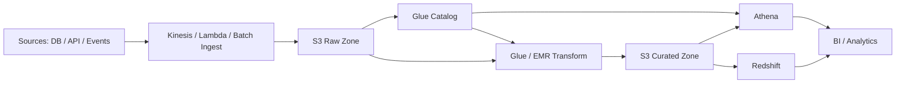
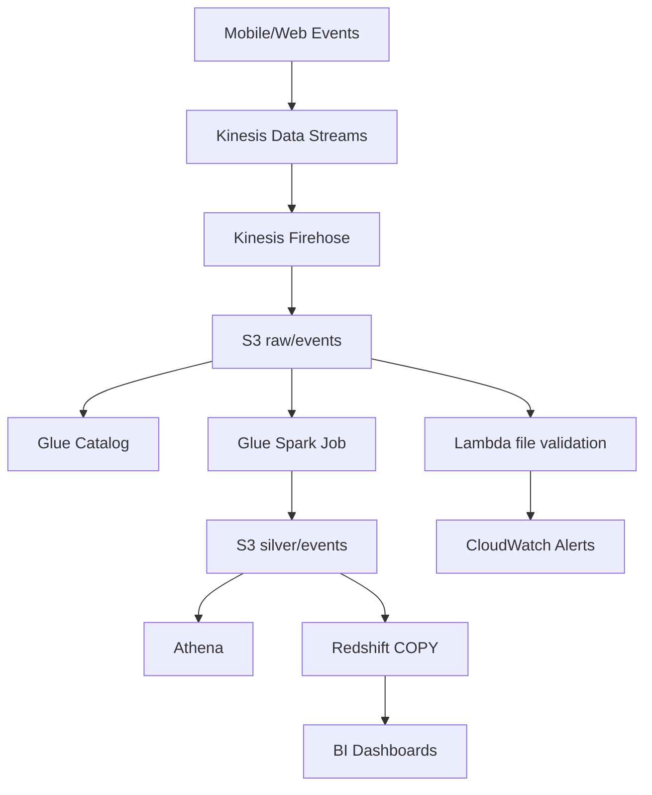

# 18 AWS for Data Engineering

## 1. Introduction

AWS là một nền tảng cloud phổ biến cho Data Engineering. Senior Data Engineer không cần biết mọi dịch vụ AWS, nhưng phải hiểu cách dữ liệu đi từ ingestion đến storage, catalog, processing, serving, monitoring và security.

Mục tiêu học:

- Beginner: hiểu S3, IAM, Glue, Athena ở mức cơ bản.
- Junior: xây pipeline đơn giản: ingest vào S3, catalog bằng Glue, query bằng Athena.
- Mid: dùng Redshift, Lambda, EMR, Kinesis cho workload phù hợp.
- Senior: thiết kế production architecture có security, cost control, observability, backfill, SLA và incident handling.

Các dịch vụ trong file:

- S3
- IAM
- Glue
- Athena
- Redshift
- Lambda
- EMR
- Kinesis



## 2. Theory

### S3

S3 là object storage, không phải file system truyền thống. Dữ liệu được lưu theo bucket, prefix và object key.

Best use cases:

- Data lake raw/bronze/silver/gold.
- Parquet/CSV/JSON storage.
- Backup và replay.
- Intermediate files cho Spark/EMR/Glue.

Senior cần hiểu:

- Prefix design ảnh hưởng listing và quản trị.
- Small files làm query chậm và tăng request cost.
- Versioning giúp rollback nhưng tăng storage cost.
- Lifecycle policy giúp kiểm soát cost.
- Server-side encryption và bucket policy là bắt buộc với dữ liệu nhạy cảm.

### IAM

IAM kiểm soát quyền truy cập. Principle of least privilege là bắt buộc.

Các thành phần:

- User: người dùng hoặc service identity legacy.
- Role: identity được assume bởi service/job.
- Policy: quyền được phép/không được phép.
- Trust relationship: ai được assume role.

Sai IAM là rủi ro production rất lớn: data leak, job fail, hoặc quyền quá rộng gây thiệt hại khi credential lộ.

### Glue

AWS Glue gồm:

- Glue Data Catalog: metadata catalog cho table/partition/schema.
- Glue Crawler: tự động infer schema, nhưng không nên lạm dụng trong production critical.
- Glue ETL: Spark serverless job.
- Glue Data Quality: kiểm tra chất lượng dữ liệu.

### Athena

Athena là query engine serverless trên S3, thường dùng với Glue Catalog. Athena tính phí theo dữ liệu scan, nên format và partition rất quan trọng.

### Redshift

Redshift là cloud data warehouse. Dùng khi cần BI hiệu năng ổn định, concurrency, semantic layer hoặc workload warehouse truyền thống.

Khái niệm quan trọng:

- Distribution style/key.
- Sort key.
- Vacuum/analyze.
- Spectrum để query S3.
- Workload management.

### Lambda

Lambda phù hợp cho event-driven lightweight tasks:

- Trigger khi file đến S3.
- Validate metadata.
- Gọi API nhỏ.
- Đẩy notification.

Không phù hợp cho transformation lớn, job lâu, hoặc xử lý file rất lớn.

### EMR

EMR dùng cho Spark/Hadoop/Flink workload lớn và cần kiểm soát compute sâu hơn Glue.

### Kinesis

Kinesis dùng cho streaming ingestion:

- Kinesis Data Streams: event stream.
- Kinesis Firehose: delivery stream vào S3/Redshift/OpenSearch.
- Kinesis Data Analytics: stream processing.

## 3. Real-world example

Bài toán: xây AWS data platform cho e-commerce.

Luồng production:

1. App events đi vào Kinesis.
2. Firehose ghi raw events vào S3 theo `event_date`.
3. Glue Catalog quản lý metadata.
4. Glue Spark job dedup và normalize events sang silver Parquet.
5. Athena phục vụ ad-hoc analytics.
6. Redshift chứa gold marts cho BI.
7. Lambda validate file arrival và gửi alert.
8. IAM role giới hạn từng job chỉ đọc/ghi đúng prefix.



Incident thực tế: Athena query cost tăng 10 lần vì raw events được ghi dạng JSON không partition đúng. Analyst query 30 ngày nhưng scan toàn bộ bucket. Fix: chuyển silver sang Parquet, partition theo `event_date`, tạo table curated, và chặn query trực tiếp raw zone cho dashboard.

## 4. SQL example

### PostgreSQL: source extraction watermark

```sql
CREATE TABLE ingestion_watermark (
    source_name text PRIMARY KEY,
    last_successful_updated_at timestamp NOT NULL,
    updated_at timestamp NOT NULL DEFAULT CURRENT_TIMESTAMP
);

SELECT
    order_id,
    customer_id,
    amount,
    order_status,
    updated_at
FROM orders
WHERE updated_at > (
    SELECT last_successful_updated_at
    FROM ingestion_watermark
    WHERE source_name = 'postgres_orders'
)
ORDER BY updated_at;
```

### Oracle: source extraction watermark

```sql
CREATE TABLE ingestion_watermark (
    source_name VARCHAR2(200) PRIMARY KEY,
    last_successful_updated_at TIMESTAMP NOT NULL,
    updated_at TIMESTAMP DEFAULT SYSTIMESTAMP NOT NULL
);

SELECT
    order_id,
    customer_id,
    amount,
    order_status,
    updated_at
FROM orders
WHERE updated_at > (
    SELECT last_successful_updated_at
    FROM ingestion_watermark
    WHERE source_name = 'oracle_orders'
)
ORDER BY updated_at;
```

### Athena: external table trên S3 Parquet

```sql
CREATE EXTERNAL TABLE silver_orders (
    order_id string,
    customer_id string,
    amount decimal(18,2),
    order_status string,
    updated_at timestamp
)
PARTITIONED BY (order_date date)
STORED AS PARQUET
LOCATION 's3://company-data-lake/silver/orders/';
```

### Redshift: load từ S3

```sql
COPY fact_orders
FROM 's3://company-data-lake/gold/fact_orders/'
IAM_ROLE 'arn:aws:iam::123456789012:role/redshift-copy-role'
FORMAT AS PARQUET;
```

### PostgreSQL: reconciliation source vs AWS curated table metadata

```sql
SELECT
    source.order_date,
    source.source_count,
    curated.curated_count,
    source.source_count - curated.curated_count AS diff_count
FROM (
    SELECT order_date, COUNT(*) AS source_count
    FROM orders
    WHERE order_date >= CURRENT_DATE - INTERVAL '7 days'
    GROUP BY order_date
) source
JOIN aws_curated_order_counts curated
  ON source.order_date = curated.order_date
WHERE source.source_count <> curated.curated_count;
```

## 5. Python example

Ví dụ kiểm tra S3 partition và phát hiện small files. Trong production dùng `boto3`, IAM role, retry, logging và metrics.

```python
import logging
from dataclasses import dataclass

import boto3

logger = logging.getLogger(__name__)


@dataclass(frozen=True)
class S3PrefixStats:
    bucket: str
    prefix: str
    file_count: int
    total_size_bytes: int


def collect_s3_prefix_stats(bucket: str, prefix: str) -> S3PrefixStats:
    client = boto3.client("s3")
    paginator = client.get_paginator("list_objects_v2")

    file_count = 0
    total_size = 0

    for page in paginator.paginate(Bucket=bucket, Prefix=prefix):
        for item in page.get("Contents", []):
            if item["Key"].endswith("/"):
                continue
            file_count += 1
            total_size += item["Size"]

    if file_count > 1000:
        logger.warning("Small-file risk bucket=%s prefix=%s files=%s", bucket, prefix, file_count)

    return S3PrefixStats(bucket, prefix, file_count, total_size)
```

## 6. Optimization

### Performance optimization

- Lưu curated data dạng Parquet hoặc ORC thay vì JSON/CSV.
- Partition theo date phù hợp query pattern.
- Compact small files định kỳ.
- Athena query phải có partition filter.
- Redshift cần sort key và distribution key phù hợp.
- Glue/EMR Spark job cần tránh shuffle không cần thiết.
- Kinesis shard count phải đủ throughput.
- Lambda chỉ xử lý tác vụ nhỏ, không dùng cho transformation lớn.

### Cost optimization

- Athena tính phí theo bytes scanned: dùng Parquet, compression, partition projection.
- S3 lifecycle policy chuyển dữ liệu cũ sang tier rẻ hơn.
- Glue/EMR job cần right-size worker/cluster.
- EMR transient cluster thường rẻ hơn cluster chạy mãi nếu batch workload.
- Redshift cần pause/resume hoặc serverless capacity đúng workload.
- Kinesis shard dư gây tốn tiền, thiếu shard gây throttling.

### Monitoring

Theo dõi:

- S3 object count và average file size.
- Glue job duration, failed jobs, DPU usage.
- Athena bytes scanned và query failure.
- Redshift queue time, query runtime, disk usage.
- Lambda duration, error, throttle.
- Kinesis iterator age, incoming records, throttled records.
- Data freshness, duplicate rate, null key rate.

### Best practices

- IAM least privilege cho từng job/service.
- Tách raw, silver, gold bằng bucket/prefix và policy rõ ràng.
- Encrypt dữ liệu bằng SSE-S3 hoặc SSE-KMS.
- Không để production dashboard query raw zone.
- Dùng Glue Catalog như metadata source, nhưng kiểm soát schema evolution.
- Có runbook cho failed Glue job, Athena cost spike, Kinesis lag.

## 7. Common mistakes

### Mistakes

- Dùng một IAM role quá rộng cho mọi job.
- Ghi dữ liệu không partition vào S3.
- Cho crawler tự đổi schema production mà không review.
- Query Athena trên raw JSON lớn.
- Redshift không vacuum/analyze sau load nặng.
- Lambda timeout vì xử lý file quá lớn.
- Kinesis không monitor iterator age.

### Anti-patterns

- Data lake chỉ là bucket dump file.
- Production job dùng access key cá nhân.
- Một bucket public hoặc policy quá rộng.
- Glue job full refresh toàn bộ lịch sử mỗi ngày.
- Redshift dùng như staging dump không có model/gov.
- Không có cost alert cho Athena/EMR/Redshift.

### Incident scenario

Athena bill tăng bất thường:

1. Kiểm tra query history và bytes scanned.
2. Tìm query scan raw zone hoặc thiếu partition filter.
3. Kiểm tra table format và compression.
4. Tạo curated Parquet table.
5. Thêm workgroup limit và cost alert.

## 8. Interview questions

### Junior

- S3 khác database như thế nào?
- IAM role dùng để làm gì?
- Glue Catalog là gì?
- Athena tính phí theo gì?

### Mid

- Khi nào dùng Glue, khi nào dùng EMR?
- Redshift khác Athena như thế nào?
- Kinesis Data Streams khác Firehose ra sao?
- Vì sao small files làm Spark/Athena chậm?

### Senior

- Thiết kế AWS data lake xử lý 5 TB/ngày như thế nào?
- Làm sao kiểm soát Athena cost ở tổ chức nhiều analyst?
- IAM least privilege cho pipeline S3 -> Glue -> Redshift thiết kế ra sao?
- Khi Kinesis lag tăng liên tục, bạn debug thế nào?
- Khi Glue crawler làm schema thay đổi phá downstream, bạn xử lý ra sao?

## 9. Exercises

1. Thiết kế S3 prefix layout cho raw/silver/gold orders.
2. Viết IAM policy ý tưởng cho job chỉ đọc raw và ghi silver.
3. Tạo Glue/Athena external table cho Parquet partition theo date.
4. Viết Redshift `COPY` từ S3.
5. Viết Python kiểm tra small files trong S3 prefix.
6. Thiết kế monitoring cho Kinesis stream ingestion.
7. Viết incident playbook cho Athena cost spike.

## 10. Checklist

- [ ] S3 zones và naming convention rõ ràng.
- [ ] IAM role theo least privilege.
- [ ] Dữ liệu nhạy cảm được encrypt.
- [ ] Glue Catalog schema được quản lý có kiểm soát.
- [ ] Athena tables dùng Parquet/partition cho dữ liệu lớn.
- [ ] Redshift load có reconciliation và analyze/vacuum strategy.
- [ ] Lambda chỉ xử lý workload phù hợp giới hạn runtime.
- [ ] EMR/Glue job có right-sizing và retry.
- [ ] Kinesis có monitoring lag/throttle.
- [ ] Có cost alert cho Athena, Glue, EMR, Redshift, Kinesis.
- [ ] Có data quality checks và freshness SLA.
- [ ] Có runbook cho failed job, schema drift, cost spike, late data.
