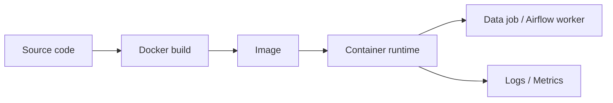
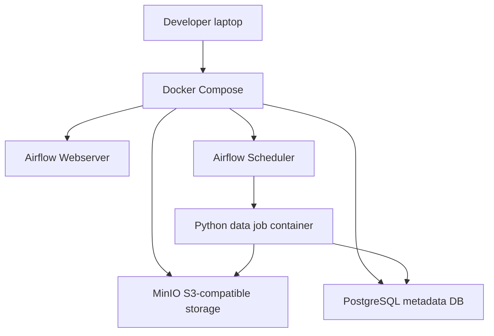

# 19 Docker for Data Engineering

## 1. Introduction

Docker giúp đóng gói môi trường chạy data pipeline: Python version, dependency, system library, CLI tool, config runtime. Senior Data Engineer không cần trở thành container platform engineer, nhưng phải biết đọc Dockerfile, debug container, tối ưu image và chạy local stack bằng Docker Compose.

Mục tiêu học:

- Beginner: hiểu image, container, volume, port, environment variable.
- Junior: viết Dockerfile cho Python data job.
- Mid: dùng Docker Compose cho Airflow/Postgres/MinIO/local warehouse.
- Senior: tối ưu image, security, networking, reproducibility và production deployment workflow.



## 2. Theory

### Docker basics

Khái niệm:

- Image: template bất biến chứa app và dependencies.
- Container: process đang chạy từ image.
- Dockerfile: công thức build image.
- Volume: mount dữ liệu/config vào container.
- Network: cách container giao tiếp với nhau.
- Registry: nơi lưu image như Docker Hub, ECR, GCR.

### Docker Compose

Compose chạy nhiều service local bằng một file YAML. Data Engineering thường dùng Compose để chạy:

- Airflow webserver/scheduler/worker.
- PostgreSQL metadata database.
- MinIO giả lập S3.
- Spark master/worker.
- dbt docs hoặc test database.

### Container networking

Trong Docker Compose, service có thể gọi nhau bằng service name, ví dụ `postgres:5432`. Từ host gọi vào container qua published port như `localhost:5432`.

### Image optimization

Image lớn làm CI/CD chậm, deploy chậm, security scanning nặng. Tối ưu bằng:

- Base image slim.
- Layer caching hợp lý.
- Không cài package thừa.
- Multi-stage build khi cần.
- `.dockerignore`.
- Pin dependency version.

### Airflow containerization

Airflow chạy container giúp môi trường scheduler/worker đồng nhất. Tuy nhiên cần cẩn thận:

- DAG dependencies.
- Connection/secret.
- Volume mount DAG local vs baked DAG image.
- Worker image version.
- Database migration.

## 3. Real-world example

Bài toán: local development stack cho Data Engineering team.

Services:

- `airflow-webserver`
- `airflow-scheduler`
- `postgres` cho Airflow metadata.
- `minio` làm S3 local.
- `data-job` image chứa Python pipeline.



Incident thực tế: pipeline chạy đúng trên máy developer nhưng fail trên Airflow production vì dependency `pyarrow` khác version. Fix: container hóa job, pin dependencies, build image trong CI, deploy cùng image digest qua môi trường dev/staging/prod.

## 4. SQL example

Docker không thay thế SQL, nhưng thường dùng để chạy database local phục vụ test pipeline.

### PostgreSQL: test table trong container

```sql
CREATE TABLE orders (
    order_id text PRIMARY KEY,
    customer_id text NOT NULL,
    amount numeric(18, 2) NOT NULL,
    order_status text NOT NULL,
    updated_at timestamp NOT NULL
);

INSERT INTO orders VALUES
('O1', 'C1', 100.00, 'PAID', CURRENT_TIMESTAMP),
('O2', 'C2', 50.00, 'PENDING', CURRENT_TIMESTAMP);
```

### PostgreSQL: validation query trong integration test

```sql
SELECT
    COUNT(*) AS row_count,
    SUM(CASE WHEN order_id IS NULL THEN 1 ELSE 0 END) AS null_order_ids,
    SUM(CASE WHEN amount < 0 THEN 1 ELSE 0 END) AS negative_amounts
FROM orders;
```

### Oracle: test table tương đương

```sql
CREATE TABLE orders (
    order_id VARCHAR2(100) PRIMARY KEY,
    customer_id VARCHAR2(100) NOT NULL,
    amount NUMBER(18, 2) NOT NULL,
    order_status VARCHAR2(30) NOT NULL,
    updated_at TIMESTAMP NOT NULL
);

INSERT INTO orders VALUES
('O1', 'C1', 100.00, 'PAID', SYSTIMESTAMP);
```

### Oracle: validation query

```sql
SELECT
    COUNT(*) AS row_count,
    SUM(CASE WHEN order_id IS NULL THEN 1 ELSE 0 END) AS null_order_ids,
    SUM(CASE WHEN amount < 0 THEN 1 ELSE 0 END) AS negative_amounts
FROM orders;
```

## 5. Python example

Ví dụ Python job chạy trong container:

```python
import os
import logging
import psycopg2

logger = logging.getLogger(__name__)


def main() -> None:
    connection = psycopg2.connect(
        host=os.environ["POSTGRES_HOST"],
        port=int(os.environ.get("POSTGRES_PORT", "5432")),
        dbname=os.environ["POSTGRES_DB"],
        user=os.environ["POSTGRES_USER"],
        password=os.environ["POSTGRES_PASSWORD"],
    )

    with connection.cursor() as cursor:
        cursor.execute("SELECT COUNT(*) FROM orders")
        row_count = cursor.fetchone()[0]

    logger.info("orders_row_count=%s", row_count)
    connection.close()


if __name__ == "__main__":
    logging.basicConfig(level=logging.INFO)
    main()
```

Dockerfile production-style:

```dockerfile
FROM python:3.12-slim

ENV PYTHONDONTWRITEBYTECODE=1
ENV PYTHONUNBUFFERED=1

WORKDIR /app

COPY requirements.txt .
RUN pip install --no-cache-dir -r requirements.txt

COPY src/ ./src/

CMD ["python", "-m", "src.pipeline"]
```

## 6. Optimization

### Performance optimization

- Copy `requirements.txt` trước source code để tận dụng Docker layer cache.
- Dùng `.dockerignore` để không copy data, `.venv`, logs, cache vào image.
- Tránh cài compiler/build tools nếu runtime không cần.
- Dùng slim image nhưng test kỹ native dependencies.
- Giới hạn container CPU/memory khi chạy local integration test để phát hiện memory issue.

### Cost optimization

- Image nhỏ giúp CI/CD nhanh hơn và giảm registry storage.
- Build cache giảm thời gian compute trong CI.
- Không bake dữ liệu lớn vào image.
- Dùng một base image chuẩn cho team để giảm duplication.

### Monitoring

Theo dõi container/job:

- Exit code.
- Runtime duration.
- Memory usage.
- CPU usage.
- Log error rate.
- Image version/digest.
- Dependency version.

### Best practices

- Pin dependency version.
- Không chạy production container bằng root nếu không cần.
- Không hardcode secret trong image.
- Dùng environment variables hoặc secret manager.
- Build image trong CI, không build thủ công trên server.
- Deploy bằng immutable image tag hoặc digest.

## 7. Common mistakes

### Mistakes

- Copy toàn bộ repo vào image trước khi install dependency, làm cache vô dụng.
- Bake secret vào Docker image.
- Không pin dependency nên image rebuild ra behavior khác.
- Dùng `latest` tag trong production.
- Không có healthcheck/logging rõ ràng.
- Nhầm `localhost` trong container với host machine.

### Anti-patterns

- Container chứa cả Airflow, database, Spark, và business job trong một image.
- Image 5 GB vì copy raw data vào build context.
- Production fix bằng cách exec vào container sửa tay.
- Mount source code production từ local folder.
- Một Dockerfile cho mọi workload không phân biệt dev/test/prod.

### Incident scenario

Airflow task fail chỉ ở production:

1. Kiểm tra image digest dev/staging/prod có giống không.
2. Kiểm tra environment variable và secret.
3. Kiểm tra network hostname trong container.
4. Kiểm tra dependency version.
5. Reproduce bằng chạy cùng image local.

## 8. Interview questions

### Junior

- Image khác container như thế nào?
- Dockerfile dùng để làm gì?
- Volume là gì?
- Port mapping là gì?

### Mid

- Docker Compose giúp gì cho data project?
- Vì sao không nên dùng `latest` tag trong production?
- Container networking trong Compose hoạt động thế nào?
- Làm sao giảm kích thước Docker image?

### Senior

- Thiết kế container hóa Airflow worker cho nhiều DAG dependency khác nhau như thế nào?
- Làm sao đảm bảo image chạy giống nhau ở dev/staging/prod?
- Khi container memory OOM, bạn debug thế nào?
- Làm sao quản lý secret an toàn trong containerized data jobs?

## 9. Exercises

1. Viết Dockerfile cho Python data job đọc Postgres và ghi log row count.
2. Viết Docker Compose chạy Postgres và Python job.
3. Thêm `.dockerignore` để giảm build context.
4. Tối ưu Dockerfile để tận dụng layer cache.
5. Container hóa một DAG Airflow đơn giản.
6. Debug lỗi container không connect được PostgreSQL service.
7. Thiết kế tagging strategy cho image dev/staging/prod.

## 10. Checklist

- [ ] Dockerfile pin base image hợp lý.
- [ ] Dependency được pin version.
- [ ] `.dockerignore` loại bỏ data/cache/venv/logs.
- [ ] Secret không nằm trong image.
- [ ] Không dùng `latest` cho production.
- [ ] Container log ra stdout/stderr.
- [ ] Có healthcheck hoặc job exit code rõ ràng.
- [ ] Compose network/volume/port được hiểu rõ.
- [ ] Image size được kiểm soát.
- [ ] Airflow image và worker dependencies được version hóa.
- [ ] CI build và scan image.
- [ ] Có runbook debug network, dependency, OOM, permission.
