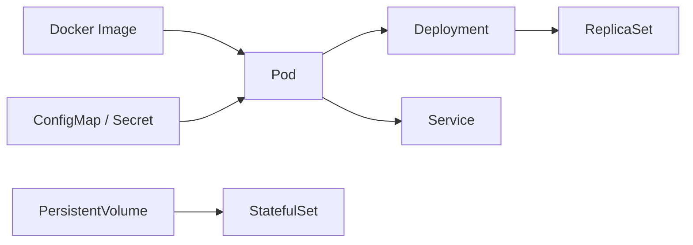
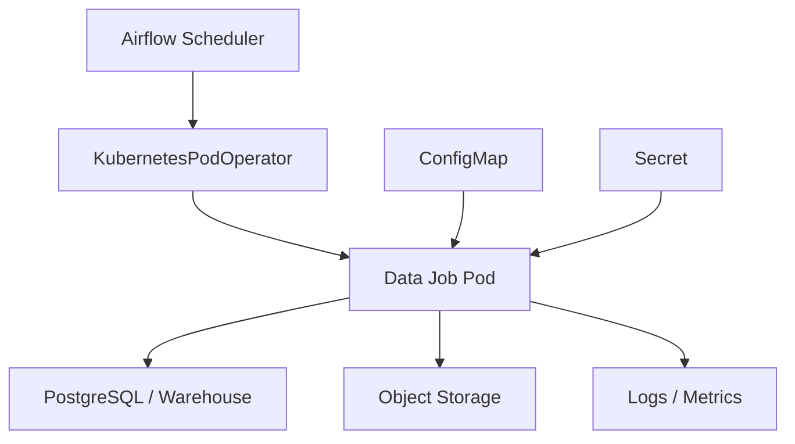

# 20 Kubernetes Basics

## 1. Introduction

Kubernetes là nền tảng orchestration container. Senior Data Engineer không nhất thiết phải vận hành Kubernetes cluster, nhưng phải đọc hiểu Pod, Deployment, Service, ConfigMap, StatefulSet, scaling và resource management để debug pipeline chạy trên K8s.

Mục tiêu:

- Beginner: hiểu Pod, container, namespace.
- Junior: đọc YAML Deployment/Service/ConfigMap.
- Mid: hiểu scaling, resource requests/limits, logs, restart, rollout.
- Senior: debug production data job trên K8s, phối hợp với platform team, tránh thiết kế workload không phù hợp.



## 2. Theory

### Pod

Pod là đơn vị chạy nhỏ nhất trong Kubernetes. Một Pod có thể chứa một hoặc nhiều container, chia sẻ network namespace và volume.

Data Engineering use cases:

- Chạy Python batch job.
- Chạy Spark driver/executor.
- Chạy Airflow worker task.
- Chạy dbt job container.

### Deployment

Deployment quản lý stateless app như API service, Airflow webserver, scheduler. Nó hỗ trợ rollout, rollback, replicas.

### Service

Service cung cấp endpoint ổn định để truy cập Pod. Pod có thể chết và tạo lại với IP khác, Service giữ DNS ổn định.

### ConfigMap

ConfigMap lưu config không nhạy cảm như environment, feature flags, endpoint, batch size. Secret dùng cho thông tin nhạy cảm.

### StatefulSet

StatefulSet dùng cho workload cần identity ổn định và persistent storage như Kafka, database, hoặc một số service stateful. Data Engineer chỉ cần đọc hiểu, không nên tự ý deploy database critical nếu chưa có platform maturity.

### Scaling

Scaling gồm:

- Horizontal scaling: tăng số Pod.
- Vertical scaling: tăng CPU/memory.
- Autoscaling: tự tăng/giảm theo metric.

### Resource management

Requests là tài nguyên Pod yêu cầu để scheduler đặt chỗ. Limits là mức tối đa container được dùng. Sai requests/limits gây pending, throttling hoặc OOMKilled.

## 3. Real-world example

Bài toán: chạy Airflow trên Kubernetes.

- Airflow scheduler chạy Deployment.
- Airflow webserver chạy Deployment.
- Airflow worker chạy Pod theo task.
- DAG dùng KubernetesPodOperator để chạy data job image.
- ConfigMap chứa non-secret config.
- Secret chứa database password.
- Logs đẩy về centralized logging.



Incident thực tế: Spark job trên K8s thường xuyên fail `OOMKilled`. Team tăng retry nhưng không xử lý gốc. Root cause là memory limit quá thấp so với shuffle. Fix: chỉnh resource request/limit, giảm partition skew, tối ưu shuffle, và thêm alert cho OOMKilled reason.

## 4. SQL example

Kubernetes không phải SQL engine, nhưng data job chạy trên K8s thường validate database/warehouse.

### PostgreSQL: job status table

```sql
CREATE TABLE pipeline_run_status (
    run_id text PRIMARY KEY,
    job_name text NOT NULL,
    k8s_namespace text NOT NULL,
    pod_name text,
    status text NOT NULL,
    started_at timestamp NOT NULL,
    finished_at timestamp,
    error_message text
);
```

### PostgreSQL: kiểm tra failed runs

```sql
SELECT
    job_name,
    COUNT(*) AS failed_runs
FROM pipeline_run_status
WHERE status = 'FAILED'
  AND started_at >= CURRENT_TIMESTAMP - INTERVAL '24 hours'
GROUP BY job_name
ORDER BY failed_runs DESC;
```

### Oracle: job status table

```sql
CREATE TABLE pipeline_run_status (
    run_id VARCHAR2(200) PRIMARY KEY,
    job_name VARCHAR2(200) NOT NULL,
    k8s_namespace VARCHAR2(200) NOT NULL,
    pod_name VARCHAR2(300),
    status VARCHAR2(50) NOT NULL,
    started_at TIMESTAMP NOT NULL,
    finished_at TIMESTAMP,
    error_message VARCHAR2(4000)
);
```

### Oracle: kiểm tra failed runs

```sql
SELECT
    job_name,
    COUNT(*) AS failed_runs
FROM pipeline_run_status
WHERE status = 'FAILED'
  AND started_at >= SYSTIMESTAMP - INTERVAL '24' HOUR
GROUP BY job_name
ORDER BY failed_runs DESC;
```

## 5. Python example

Ví dụ Python đọc config từ environment trong Pod:

```python
import os
import logging

logger = logging.getLogger(__name__)


def main() -> None:
    input_path = os.environ["INPUT_PATH"]
    output_path = os.environ["OUTPUT_PATH"]
    batch_size = int(os.environ.get("BATCH_SIZE", "10000"))

    logger.info(
        "starting_job input_path=%s output_path=%s batch_size=%s",
        input_path,
        output_path,
        batch_size,
    )

    # Run transformation here.


if __name__ == "__main__":
    logging.basicConfig(level=logging.INFO)
    main()
```

Ví dụ Deployment YAML tối giản:

```yaml
apiVersion: apps/v1
kind: Deployment
metadata:
  name: data-api
spec:
  replicas: 2
  selector:
    matchLabels:
      app: data-api
  template:
    metadata:
      labels:
        app: data-api
    spec:
      containers:
        - name: data-api
          image: registry.example.com/data-api:1.2.3
          resources:
            requests:
              cpu: "500m"
              memory: "1Gi"
            limits:
              cpu: "1"
              memory: "2Gi"
```

## 6. Optimization

### Performance optimization

- Set requests/limits phù hợp workload để tránh throttling/OOM.
- Tách batch job nặng khỏi service latency-sensitive.
- Dùng node pool phù hợp cho memory-heavy/Spark workload.
- Tránh mount volume chậm cho workload cần throughput cao.
- Với Spark trên K8s, tune executor count, memory, shuffle partitions.
- Dùng readiness/liveness probe cho service dài hạn, không dùng tùy tiện cho batch job ngắn.

### Cost optimization

- Không over-request CPU/memory quá lớn.
- Dùng autoscaling cho workload biến động.
- Dùng spot/preemptible nodes cho batch job chịu retry.
- Tắt namespace/dev environment không dùng.
- Theo dõi idle pods và failed pods không được cleanup.

### Monitoring

Theo dõi:

- Pod status: Pending, Running, Failed, OOMKilled, CrashLoopBackOff.
- CPU/memory usage vs requests/limits.
- Restart count.
- Job duration.
- Queue/pending time.
- Node pressure.
- Logs và events.

### Best practices

- Data job nên log ra stdout/stderr.
- Config không nhạy cảm dùng ConfigMap, secret dùng Secret/secret manager.
- Image tag nên immutable.
- Không chạy container privileged nếu không cần.
- Batch job cần retry policy và idempotency.
- Luôn biết namespace, pod name, image version khi debug.

## 7. Common mistakes

### Mistakes

- Không set resource requests/limits.
- Dùng `latest` image tag.
- Nhầm ConfigMap với Secret.
- Không đọc Kubernetes events khi debug.
- Batch job retry nhưng không idempotent.
- Chạy database stateful critical mà không hiểu storage/backup.

### Anti-patterns

- Data Engineer tự deploy production stateful system trên K8s không có platform support.
- Một Pod chạy quá nhiều process không liên quan.
- Fix OOM bằng retry vô hạn.
- Mount secret thành env rồi log toàn bộ environment.
- Không cleanup completed jobs.

### Incident scenario

Pod `Pending` lâu:

1. Kiểm tra `kubectl describe pod` events.
2. Kiểm tra resource requests có vượt node capacity không.
3. Kiểm tra node selector/toleration.
4. Kiểm tra quota namespace.
5. Kiểm tra image pull secret nếu lỗi pull image.

## 8. Interview questions

### Junior

- Pod là gì?
- Deployment dùng để làm gì?
- Service giải quyết vấn đề gì?
- ConfigMap khác Secret như thế nào?

### Mid

- Requests khác limits như thế nào?
- Vì sao Pod bị `CrashLoopBackOff`?
- Khi nào dùng StatefulSet?
- Horizontal scaling khác vertical scaling thế nào?

### Senior

- Debug data job bị `OOMKilled` trên K8s như thế nào?
- Thiết kế Airflow task chạy KubernetesPodOperator cần chú ý gì?
- Làm sao cân bằng cost và reliability cho batch jobs?
- Khi nào không nên chạy workload data trên Kubernetes?

## 9. Exercises

1. Đọc một Deployment YAML và giải thích image, replicas, resources.
2. Viết ConfigMap cho data job có `INPUT_PATH`, `OUTPUT_PATH`, `BATCH_SIZE`.
3. Thiết kế resource request/limit cho Python job xử lý 10 GB dữ liệu.
4. Viết SQL table lưu pipeline run status.
5. Mô tả debug flow cho Pod `CrashLoopBackOff`.
6. Mô tả debug flow cho Pod `OOMKilled`.
7. Thiết kế scaling strategy cho Airflow worker.

## 10. Checklist

- [ ] Image tag immutable.
- [ ] Resource requests/limits rõ ràng.
- [ ] ConfigMap/Secret phân tách đúng.
- [ ] Logs ra stdout/stderr.
- [ ] Batch job idempotent khi retry.
- [ ] Có monitoring Pod status, restart, OOMKilled.
- [ ] Có namespace/quota phù hợp.
- [ ] Có cleanup policy cho completed jobs.
- [ ] Không tự vận hành stateful critical system nếu không có năng lực backup/restore.
- [ ] Có runbook cho Pending, CrashLoopBackOff, OOMKilled, ImagePullBackOff.
