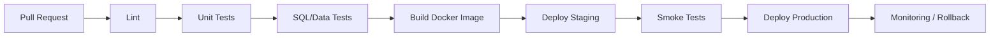
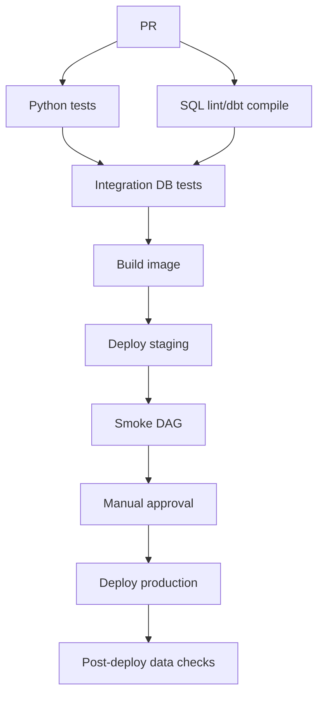

# 21 CI/CD for Data Engineering

## 1. Introduction

CI/CD trong Data Engineering giúp thay đổi SQL, Python, dbt model, Airflow DAG, Docker image và infrastructure config một cách an toàn. Senior Data Engineer phải biết thiết kế testing pipeline, deployment workflow, versioning và rollback để giảm incident.

Mục tiêu:

- Beginner: hiểu CI, CD, pipeline, job, artifact.
- Junior: chạy lint/test tự động trên Pull Request.
- Mid: deploy DAG/dbt/container qua dev/staging/prod.
- Senior: thiết kế versioning, rollback, data migration, quality gate và incident-safe release.



## 2. Theory

### GitHub Actions

GitHub Actions chạy workflow từ `.github/workflows/*.yml`. Dùng cho:

- Python unit tests.
- SQL lint.
- dbt compile/test.
- Docker build/push.
- Deploy Airflow DAGs.
- Run smoke test sau deploy.

### GitLab CI

GitLab CI dùng `.gitlab-ci.yml`, concept gồm stages, jobs, runners, artifacts, environments.

### Testing pipeline

Các tầng test:

- Static checks: format, lint, type check.
- Unit tests: logic Python.
- Integration tests: database/container.
- Data tests: uniqueness, not null, accepted values, relationships.
- Smoke tests: kiểm tra job deploy chạy được.
- Regression tests: so sánh metric trước/sau.

### Deployment workflow

Data deployment không chỉ deploy code. Có thể gồm:

- DAG deployment.
- dbt model deployment.
- SQL migration.
- Docker image deployment.
- Schema migration.
- Backfill.
- Feature flag hoặc incremental rollout.

### Versioning

Version cần cho:

- Docker image tag/digest.
- dbt package/model version.
- DAG version.
- Schema version.
- Data contract version.

### Rollback

Rollback data khó hơn rollback app vì dữ liệu đã ghi có thể bị sai. Senior cần rollback plan:

- Revert code.
- Restore table snapshot.
- Re-run backfill.
- Quarantine bad partition.
- Stop downstream dashboard.
- Communicate impact.

## 3. Real-world example

Bài toán: CI/CD cho dbt + Airflow + Python ingestion.

Workflow:

1. Pull Request chạy lint, unit test, dbt compile.
2. CI tạo ephemeral Postgres test database.
3. Chạy SQL data tests trên sample data.
4. Build Docker image cho ingestion job.
5. Merge vào main deploy staging.
6. Staging chạy smoke DAG.
7. Manual approval deploy production.
8. Monitor freshness và row count sau deploy.



Incident thực tế: một PR đổi logic revenue nhưng chỉ test compile, không test metric regression. Production deploy làm revenue giảm 25%. Fix: thêm regression test so sánh 30 ngày revenue giữa branch và baseline, require approval từ data owner khi metric critical thay đổi.

## 4. SQL example

### PostgreSQL: migration version table

```sql
CREATE TABLE schema_migrations (
    version text PRIMARY KEY,
    description text NOT NULL,
    applied_at timestamp NOT NULL DEFAULT CURRENT_TIMESTAMP,
    applied_by text NOT NULL
);
```

### PostgreSQL: data quality gate

```sql
SELECT
    CASE
        WHEN COUNT(*) = COUNT(DISTINCT order_id) THEN 'PASS'
        ELSE 'FAIL'
    END AS uniqueness_check
FROM fact_orders
WHERE order_date = CURRENT_DATE - INTERVAL '1 day';
```

### Oracle: migration version table

```sql
CREATE TABLE schema_migrations (
    version VARCHAR2(100) PRIMARY KEY,
    description VARCHAR2(1000) NOT NULL,
    applied_at TIMESTAMP DEFAULT SYSTIMESTAMP NOT NULL,
    applied_by VARCHAR2(200) NOT NULL
);
```

### Oracle: data quality gate

```sql
SELECT
    CASE
        WHEN COUNT(*) = COUNT(DISTINCT order_id) THEN 'PASS'
        ELSE 'FAIL'
    END AS uniqueness_check
FROM fact_orders
WHERE order_date = TRUNC(SYSDATE) - 1;
```

### PostgreSQL: rollback impact query

```sql
SELECT
    order_date,
    SUM(amount) AS revenue
FROM fact_orders
WHERE order_date >= CURRENT_DATE - INTERVAL '7 days'
GROUP BY order_date
ORDER BY order_date;
```

## 5. Python example

Ví dụ CI test cho transformation function:

```python
def normalize_status(value: str) -> str:
    normalized = value.strip().upper()
    allowed = {"PENDING", "PAID", "CANCELLED", "REFUNDED"}
    if normalized not in allowed:
        raise ValueError(f"Invalid status: {value}")
    return normalized


def test_normalize_status() -> None:
    assert normalize_status(" paid ") == "PAID"
    assert normalize_status("Cancelled") == "CANCELLED"
```

Ví dụ smoke test sau deploy:

```python
import psycopg2


def test_fact_orders_has_recent_data(connection: psycopg2.extensions.connection) -> None:
    with connection.cursor() as cursor:
        cursor.execute("""
            SELECT COUNT(*)
            FROM fact_orders
            WHERE order_date >= CURRENT_DATE - INTERVAL '1 day'
        """)
        row_count = cursor.fetchone()[0]

    assert row_count > 0
```

GitHub Actions ví dụ:

```yaml
name: data-ci

on:
  pull_request:

jobs:
  test:
    runs-on: ubuntu-latest
    steps:
      - uses: actions/checkout@v4
      - uses: actions/setup-python@v5
        with:
          python-version: "3.12"
      - run: pip install -r requirements-dev.txt
      - run: pytest
```

## 6. Optimization

### Performance optimization

- Chạy lint/unit test trước integration test để fail nhanh.
- Cache Python packages và Docker layers.
- Chỉ chạy dbt model affected khi PR nhỏ, nhưng nightly full test vẫn cần.
- Parallelize independent test suites.
- Dùng sample dataset cho PR test và full dataset cho scheduled regression.

### Cost optimization

- Tắt ephemeral test environments sau khi chạy.
- Không chạy full backfill trên mọi PR.
- Chỉ build/push Docker image khi code liên quan thay đổi.
- Dùng self-hosted runner cẩn thận nếu có dữ liệu nhạy cảm.

### Monitoring

Theo dõi:

- CI duration.
- Failure rate theo stage.
- Flaky tests.
- Deployment frequency.
- Change failure rate.
- Mean time to rollback.
- Post-deploy data quality status.

### Best practices

- PR phải chạy automated tests trước merge.
- Critical data model cần owner approval.
- Deploy production bằng artifact đã test, không rebuild khác.
- Version Docker image bằng commit SHA/digest.
- Mọi migration có rollback hoặc recovery plan.
- Post-deploy check bắt buộc cho bảng critical.

## 7. Common mistakes

### Mistakes

- Chỉ test code compile, không test dữ liệu.
- Deploy DAG trực tiếp bằng copy tay.
- Dùng image tag `latest`.
- Không version schema migration.
- Không có staging/smoke test.
- Rollback code nhưng không rollback data.

### Anti-patterns

- Production deploy từ laptop cá nhân.
- CI dùng credential production rộng quyền.
- Bỏ qua failed data tests vì "dashboard vẫn chạy".
- Backfill thủ công không log version.
- Một pipeline CI quá chậm nên team né không chạy.

### Incident scenario

Deploy làm dashboard sai:

1. Dừng downstream schedule nếu dữ liệu tiếp tục sai.
2. Xác định commit/DAG/model version.
3. So sánh metric trước/sau deploy.
4. Revert code hoặc rollback image.
5. Restore/rebuild affected partitions.
6. Thêm regression test để ngăn lặp lại.

## 8. Interview questions

### Junior

- CI khác CD như thế nào?
- Pull Request test nên chạy gì?
- Artifact là gì?
- Vì sao cần version migration?

### Mid

- Thiết kế pipeline test cho dbt project như thế nào?
- Smoke test khác integration test như thế nào?
- Vì sao deploy bằng image digest tốt hơn `latest`?
- Data rollback khác app rollback ra sao?

### Senior

- Thiết kế release process cho bảng finance critical như thế nào?
- Làm sao giảm CI time mà vẫn giữ độ tin cậy?
- Khi deploy gây sai dữ liệu đã ghi, rollback thế nào?
- Làm sao kiểm soát credential production trong CI/CD?

## 9. Exercises

1. Viết GitHub Actions chạy `pytest`.
2. Viết GitLab CI có stages lint, test, build.
3. Thiết kế data quality gate cho `fact_orders`.
4. Tạo migration version table trong PostgreSQL hoặc Oracle.
5. Thiết kế rollback plan cho dbt model revenue.
6. Viết smoke test kiểm tra bảng có dữ liệu ngày hôm qua.
7. Thiết kế CI/CD flow cho Airflow DAG deployment.

## 10. Checklist

- [ ] PR chạy lint/unit/integration/data tests phù hợp.
- [ ] CI không dùng credential production quá rộng.
- [ ] Artifact build một lần, deploy nhiều môi trường.
- [ ] Docker image version bằng commit SHA/digest.
- [ ] Schema migration được version hóa.
- [ ] Critical models có owner approval.
- [ ] Staging smoke test trước production.
- [ ] Production deploy có post-deploy data checks.
- [ ] Có rollback/recovery plan cho code và data.
- [ ] CI duration được tối ưu để team thật sự dùng.
- [ ] Có monitoring change failure rate và data test failure.
