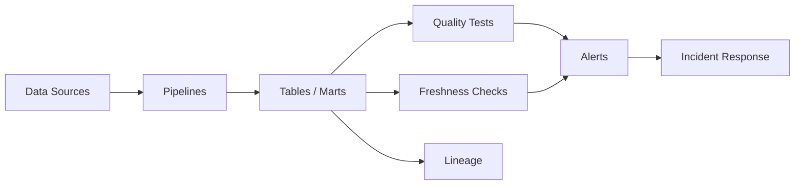
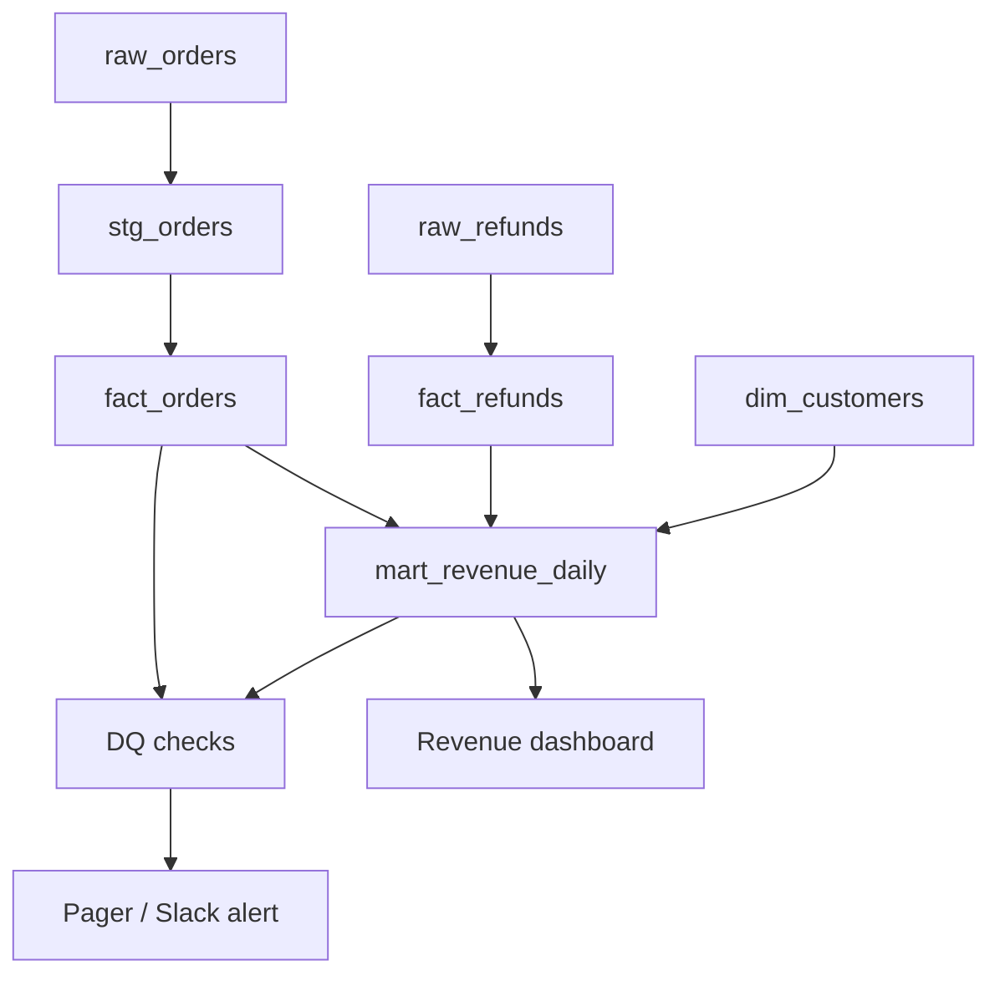

# 22 Data Quality and Observability

## 1. Introduction

Data Quality và Observability là năng lực cốt lõi của Senior Data Engineer. Pipeline chạy xanh không có nghĩa dữ liệu đúng. Bạn cần kiểm tra dữ liệu có đủ, mới, đúng schema, đúng business rule, đúng lineage và đúng SLA/SLO hay không.

Mục tiêu:

- Beginner: hiểu null, duplicate, freshness, accepted values.
- Junior: viết dbt tests và Great Expectations cơ bản.
- Mid: thiết kế monitoring, alerting, lineage, SLA.
- Senior: xây observability production có incident response, ownership, SLO, error budget và cost-aware checks.

Nội dung:

- Great Expectations
- dbt tests
- Freshness
- Lineage
- Monitoring
- Alerting
- SLA/SLO



## 2. Theory

### Data quality dimensions

| Dimension | Câu hỏi |
|---|---|
| Completeness | Dữ liệu có đủ không? |
| Freshness | Dữ liệu có mới không? |
| Validity | Value có đúng format/domain không? |
| Uniqueness | Key có duplicate không? |
| Consistency | Các bảng/metric có khớp nhau không? |
| Accuracy | Có phản ánh thực tế business không? |

### Great Expectations

Great Expectations định nghĩa expectation suite cho dataset:

- Column exists.
- Column values not null.
- Values in set.
- Row count between range.
- Compound uniqueness.
- Custom expectation.

Phù hợp khi cần validation ngoài SQL/dbt hoặc kiểm tra file/dataframe.

### dbt tests

dbt tests phổ biến:

- `not_null`
- `unique`
- `accepted_values`
- `relationships`
- custom generic tests
- singular tests bằng SQL

### Freshness

Freshness kiểm tra dữ liệu có cập nhật đúng SLA không. Ví dụ `fact_orders` phải có dữ liệu trước 07:00 mỗi ngày.

### Lineage

Lineage cho biết bảng/model nào phụ thuộc bảng/model nào. Khi incident xảy ra, lineage giúp biết downstream impact.

### Monitoring

Monitoring là lưu metric theo thời gian:

- Row count.
- Null rate.
- Duplicate rate.
- Freshness lag.
- Runtime.
- Cost.
- Failed records.
- Distribution drift.

### Alerting

Alert tốt phải actionable. Alert xấu gây noise và bị ignore.

### SLA/SLO

- SLA: cam kết với user/business.
- SLO: mục tiêu nội bộ để đạt SLA.
- SLI: chỉ số đo, ví dụ freshness lag, success rate.

## 3. Real-world example

Bài toán: observability cho revenue pipeline.

Checks:

- `fact_orders.order_id` unique.
- `customer_id` not null dưới 0.1%.
- `order_status` chỉ trong accepted values.
- Revenue daily không lệch quá 20% so với trung bình 7 ngày nếu không có event business.
- Freshness trước 07:00.
- Lineage biết `mart_revenue_daily` phụ thuộc `fact_orders`, `dim_customers`, `fact_refunds`.



Incident thực tế: pipeline success nhưng revenue dashboard bằng 0 vì upstream source gửi status `paid` thay vì `PAID`, trong khi transformation filter uppercase chưa được áp dụng. Alert freshness không bắt được vì data vẫn mới. Fix: accepted values test, volume anomaly check và revenue non-zero check.

## 4. SQL example

### PostgreSQL: uniqueness test

```sql
SELECT order_id, COUNT(*) AS row_count
FROM fact_orders
WHERE order_date = CURRENT_DATE - INTERVAL '1 day'
GROUP BY order_id
HAVING COUNT(*) > 1;
```

### PostgreSQL: freshness check

```sql
SELECT
    MAX(updated_at) AS max_updated_at,
    CURRENT_TIMESTAMP - MAX(updated_at) AS freshness_lag
FROM fact_orders;
```

### PostgreSQL: anomaly check

```sql
WITH daily AS (
    SELECT order_date, SUM(amount) AS revenue
    FROM fact_orders
    WHERE order_date >= CURRENT_DATE - INTERVAL '8 days'
    GROUP BY order_date
),
baseline AS (
    SELECT AVG(revenue) AS avg_revenue
    FROM daily
    WHERE order_date < CURRENT_DATE - INTERVAL '1 day'
)
SELECT
    d.order_date,
    d.revenue,
    b.avg_revenue,
    d.revenue / NULLIF(b.avg_revenue, 0) AS ratio_to_baseline
FROM daily d
CROSS JOIN baseline b
WHERE d.order_date = CURRENT_DATE - INTERVAL '1 day';
```

### Oracle: uniqueness test

```sql
SELECT order_id, COUNT(*) AS row_count
FROM fact_orders
WHERE order_date = TRUNC(SYSDATE) - 1
GROUP BY order_id
HAVING COUNT(*) > 1;
```

### Oracle: freshness check

```sql
SELECT
    MAX(updated_at) AS max_updated_at,
    SYSTIMESTAMP - MAX(updated_at) AS freshness_lag
FROM fact_orders;
```

### Oracle: accepted values test

```sql
SELECT order_status, COUNT(*) AS row_count
FROM fact_orders
WHERE order_status NOT IN ('PENDING', 'PAID', 'CANCELLED', 'REFUNDED')
GROUP BY order_status;
```

## 5. Python example

Ví dụ kiểm tra data quality và gửi alert đơn giản:

```python
import logging
import psycopg2

logger = logging.getLogger(__name__)


def fetch_scalar(connection, query: str) -> int:
    with connection.cursor() as cursor:
        cursor.execute(query)
        return cursor.fetchone()[0]


def run_quality_checks(connection) -> None:
    duplicate_count = fetch_scalar(connection, """
        SELECT COUNT(*)
        FROM (
            SELECT order_id
            FROM fact_orders
            WHERE order_date = CURRENT_DATE - INTERVAL '1 day'
            GROUP BY order_id
            HAVING COUNT(*) > 1
        ) x
    """)

    if duplicate_count > 0:
        raise RuntimeError(f"Duplicate order_id detected: {duplicate_count}")

    logger.info("quality_check_passed check=duplicate_order_id")
```

Great Expectations-style expectation concept:

```python
def expect_not_null(records: list[dict], column: str) -> None:
    null_count = sum(1 for record in records if record.get(column) is None)
    if null_count > 0:
        raise ValueError(f"Column {column} has null_count={null_count}")
```

## 6. Optimization

### Performance optimization

- Check partition mới thay vì full history mỗi lần.
- Dùng aggregate metrics table để theo dõi trend.
- Tách critical checks chạy blocking và non-critical checks chạy async.
- Dùng sampling chỉ cho exploration, không dùng cho finance critical checks.
- Tránh `COUNT(DISTINCT)` full table nếu có thể dùng incremental uniqueness check.
- Materialize DQ metrics để alert nhanh.

### Cost optimization

- Không scan toàn bộ raw events cho mỗi quality check.
- Chạy deep checks theo lịch daily/weekly, lightweight checks theo từng run.
- Alert theo metric đã aggregate thay vì query heavy trực tiếp.
- Ưu tiên checks có risk cao: freshness, uniqueness key, null critical field, accepted values.

### Monitoring

Theo dõi:

- Test pass/fail.
- Freshness lag.
- Row count trend.
- Null rate trend.
- Duplicate rate trend.
- Runtime pipeline.
- Cost per pipeline.
- Alert volume.
- Mean time to detect và mean time to resolve.

### Best practices

- Mỗi critical dataset cần owner và SLA.
- Chia checks thành blocking và warning.
- Alert phải có context: dataset, partition, check, expected, actual, owner.
- DQ metrics phải được lưu lịch sử.
- Lineage phải đủ để biết downstream impact.
- Incident postmortem nên tạo thêm test để ngăn tái diễn.

## 7. Common mistakes

### Mistakes

- Chỉ monitor job success, không monitor data correctness.
- Alert quá nhiều noise.
- Không có owner cho dataset.
- Freshness check dùng ingestion time sai ý nghĩa.
- Test uniqueness trên toàn bảng quá tốn cost.
- Không version data quality rules.
- Không kiểm tra downstream impact khi test fail.

### Anti-patterns

- Bỏ qua failed dbt test vì "chắc không sao".
- Great Expectations suite quá lớn, chạy chậm, không ai dùng.
- Alert gửi vào channel chung không owner.
- Quality check hardcode rải rác không quản lý.
- SLA được hứa với business nhưng không có SLO/SLI đo lường.
- Lineage chỉ vẽ cho đẹp nhưng không dùng trong incident.

### Incident scenario

Dashboard stale nhưng pipeline xanh:

1. Kiểm tra freshness của source và mart.
2. Kiểm tra DAG có skip branch không.
3. Kiểm tra partition mới có row count không.
4. Kiểm tra BI cache hoặc semantic layer.
5. Kiểm tra alert threshold có quá lỏng không.

## 8. Interview questions

### Junior

- Data quality test là gì?
- `not_null` và `unique` test dùng khi nào?
- Freshness là gì?
- Alert tốt cần thông tin gì?

### Mid

- dbt tests và Great Expectations khác nhau thế nào?
- Thiết kế freshness check cho daily table ra sao?
- Lineage giúp gì khi incident?
- Khi nào test nên blocking, khi nào chỉ warning?

### Senior

- Thiết kế observability cho revenue pipeline critical như thế nào?
- Làm sao giảm noise alert nhưng không bỏ lỡ incident?
- Làm sao đo SLO cho data freshness và correctness?
- Khi DQ check fail nhưng business cần dashboard, bạn xử lý thế nào?
- Làm sao tối ưu cost của data quality checks ở scale lớn?

## 9. Exercises

1. Viết SQL test `unique` cho `fact_orders.order_id`.
2. Viết SQL test `accepted_values` cho `order_status`.
3. Thiết kế freshness SLA cho 3 bảng: raw, fact, mart.
4. Viết Python quality check fail nếu duplicate > 0.
5. Thiết kế alert message có dataset, partition, owner, severity.
6. Vẽ lineage cho revenue dashboard.
7. Phân loại 10 checks thành blocking hoặc warning.
8. Thiết kế SLO cho pipeline có SLA 07:00 mỗi ngày.

## 10. Checklist

- [ ] Critical datasets có owner.
- [ ] Có SLA/SLO/SLI rõ ràng.
- [ ] Có checks not null, unique, accepted values, relationships khi phù hợp.
- [ ] Có freshness checks.
- [ ] Có anomaly checks cho metric quan trọng.
- [ ] Có lineage để xác định downstream impact.
- [ ] DQ metrics được lưu lịch sử.
- [ ] Alert có context và routing tới owner.
- [ ] Checks được phân loại blocking/warning.
- [ ] Cost của checks được kiểm soát.
- [ ] Incident tạo thêm test hoặc monitor để ngăn tái diễn.
