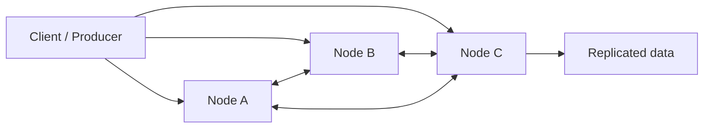

# 23 Distributed Systems Basics

## 1. Introduction

Distributed systems là phần phân biệt Senior thật với người chỉ biết viết pipeline. Khi dữ liệu vượt khỏi một máy, bạn phải hiểu consistency, replication, consensus, distributed transactions và scaling. Nếu không, bạn sẽ thiết kế hệ thống chạy được trong demo nhưng lỗi trong production: duplicate, stale reads, split-brain, partial failure, backfill sai, hoặc mất dữ liệu.



## 2. Theory

### CAP theorem

CAP nói rằng khi có network partition, distributed system phải chọn ưu tiên giữa:

- Consistency: mọi read thấy dữ liệu mới nhất.
- Availability: mọi request nhận response.
- Partition tolerance: hệ thống vẫn chịu được mất kết nối mạng giữa nodes.

Trong thực tế, partition tolerance gần như bắt buộc. Trade-off thường là CP hoặc AP khi partition xảy ra.

### Consistency

Các mức consistency thường gặp:

- Strong consistency: read sau write luôn thấy giá trị mới.
- Eventual consistency: dữ liệu sẽ đồng bộ cuối cùng nếu không có update mới.
- Read-your-writes: user đọc lại thấy chính write của mình.
- Monotonic reads: đọc sau không thấy version cũ hơn lần đọc trước.

### Replication

Replication sao chép dữ liệu giữa nodes để tăng availability, durability và read scale.

Các mô hình:

- Leader-follower.
- Multi-leader.
- Leaderless quorum.

### Consensus

Consensus giúp nhiều node thống nhất một trạng thái, ví dụ leader hiện tại hoặc commit log. Các thuật toán nổi tiếng gồm Raft và Paxos. Data Engineer không nhất thiết implement Raft, nhưng phải hiểu vì Kafka, databases, coordinators và metadata stores đều dựa trên consensus hoặc quorum.

### Distributed transactions

Distributed transaction cập nhật nhiều system cùng lúc. Nó khó vì partial failure: system A commit thành công, system B timeout, bạn không chắc B đã commit chưa.

Pattern thay thế:

- Idempotent writes.
- Outbox pattern.
- Saga pattern.
- Exactly-once semantics ở tầng phù hợp, không quảng cáo quá mức.

### Scaling

Scaling có hai hướng:

- Vertical scaling: tăng CPU/RAM/disk một node.
- Horizontal scaling: thêm nodes, cần partitioning/sharding, replication và coordination.

## 3. Real-world example

Bài toán: ingest đơn hàng từ nhiều region vào analytics platform.

- App ghi order vào database region gần user.
- CDC stream đẩy thay đổi vào Kafka.
- Data lake nhận event theo partition.
- Warehouse build fact table incremental.
- Dashboard cần gần real-time nhưng chấp nhận eventual consistency trong 5 phút.

Incident thực tế: network partition giữa hai region làm cùng một order được update ở hai nơi. Khi CDC merge về warehouse, bản ghi cũ overwrite bản ghi mới vì ordering chỉ dựa trên ingestion time. Fix: dùng source `updated_at`, version number, deterministic conflict resolution, và reconciliation job.

## 4. SQL example

### PostgreSQL: idempotent upsert chống duplicate event

```sql
INSERT INTO fact_orders (
    order_id,
    order_status,
    amount,
    source_version,
    updated_at
)
VALUES (
    'O1001',
    'PAID',
    120.50,
    7,
    TIMESTAMP '2026-05-08 10:00:00'
)
ON CONFLICT (order_id)
DO UPDATE SET
    order_status = EXCLUDED.order_status,
    amount = EXCLUDED.amount,
    source_version = EXCLUDED.source_version,
    updated_at = EXCLUDED.updated_at
WHERE fact_orders.source_version < EXCLUDED.source_version;
```

### Oracle: deterministic merge theo source version

```sql
MERGE INTO fact_orders f
USING (
    SELECT
        'O1001' AS order_id,
        'PAID' AS order_status,
        120.50 AS amount,
        7 AS source_version,
        TIMESTAMP '2026-05-08 10:00:00' AS updated_at
    FROM dual
) s
ON (f.order_id = s.order_id)
WHEN MATCHED THEN UPDATE SET
    f.order_status = s.order_status,
    f.amount = s.amount,
    f.source_version = s.source_version,
    f.updated_at = s.updated_at
WHERE f.source_version < s.source_version
WHEN NOT MATCHED THEN INSERT (
    order_id, order_status, amount, source_version, updated_at
) VALUES (
    s.order_id, s.order_status, s.amount, s.source_version, s.updated_at
);
```

## 5. Python example

```python
import hashlib
import time


def idempotency_key(order_id: str, source_version: int) -> str:
    raw = f"{order_id}|{source_version}"
    return hashlib.sha256(raw.encode("utf-8")).hexdigest()


def retry_with_backoff(operation, max_attempts: int = 5):
    for attempt in range(1, max_attempts + 1):
        try:
            return operation()
        except TimeoutError:
            if attempt == max_attempts:
                raise
            time.sleep(2 ** attempt)
```

## 6. Optimization

### Performance optimization

- Partition data theo key có phân phối đều.
- Tránh hot partition như một tenant quá lớn hoặc một ngày quá nhiều dữ liệu.
- Dùng batching thay vì request từng record.
- Đặt data gần compute nếu latency/cost quan trọng.
- Dùng compression cho network transfer.

### Cost optimization

- Replication factor càng cao càng tốn storage.
- Cross-region traffic rất đắt.
- Strong consistency thường tăng latency và compute.
- Không dùng distributed transaction nếu business có thể chấp nhận eventual consistency với reconciliation.

### Monitoring

Theo dõi:

- Replication lag.
- Consumer lag.
- Duplicate rate.
- Conflict count.
- Retry count.
- Cross-region latency.
- Failed quorum/leader election events.

## 7. Common mistakes

### Mistakes

- Tin rằng network luôn ổn định.
- Không thiết kế idempotency.
- Dùng ingestion time làm ordering duy nhất.
- Không có conflict resolution.
- Không đo replication lag.

### Anti-patterns

- Distributed transaction cho mọi use case.
- Exactly-once marketing nhưng pipeline không idempotent.
- Scale bằng cách thêm node mà không xử lý skew.
- Không có reconciliation sau eventual consistency.

### Best practices

- Thiết kế theo giả định partial failure luôn xảy ra.
- Mọi write quan trọng nên idempotent.
- Có deterministic ordering hoặc versioning.
- Có reconciliation job cho data critical.
- Document consistency guarantee cho downstream.

### Incident scenario

Dashboard hiển thị order status cũ:

1. Kiểm tra replication lag.
2. Kiểm tra CDC consumer lag.
3. Kiểm tra conflict resolution rule.
4. Kiểm tra event ordering.
5. Reconcile warehouse với source of truth.

## 8. Interview questions

### Junior

- CAP theorem là gì?
- Replication dùng để làm gì?
- Consistency khác availability như thế nào?

### Mid

- Eventual consistency gây vấn đề gì cho analytics?
- Idempotency là gì?
- Leader-follower replication có rủi ro gì?

### Senior

- Thiết kế conflict resolution cho CDC multi-region như thế nào?
- Khi nào tránh distributed transaction?
- Làm sao scale hệ thống ingest 1 tỷ event/ngày mà vẫn kiểm soát duplicate?

## 9. Exercises

1. Thiết kế idempotency key cho event pipeline.
2. Viết SQL merge chỉ update khi source version mới hơn.
3. Mô tả trade-off CP vs AP cho metadata service.
4. Thiết kế monitoring cho replication lag.
5. Mô phỏng partial failure và viết retry strategy.

## 10. Checklist

- [ ] Consistency guarantee được document.
- [ ] Write path idempotent.
- [ ] Conflict resolution deterministic.
- [ ] Có replication lag monitoring.
- [ ] Có retry với backoff và giới hạn.
- [ ] Có reconciliation cho dữ liệu critical.
- [ ] Scaling strategy xử lý skew.
- [ ] Cross-region cost được đánh giá.
- [ ] Không dùng distributed transaction nếu không thật cần.

