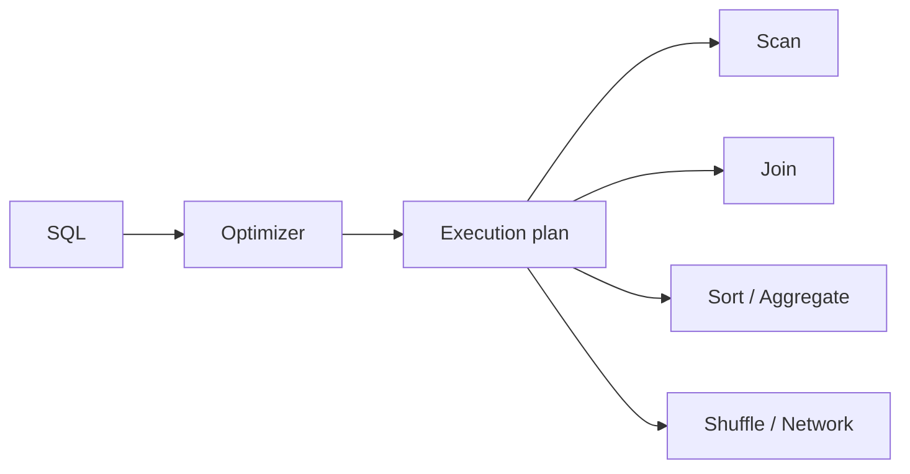

# 24 Query Optimization Performance

## 1. Introduction

Senior Data Engineer phải biết query chạy chậm vì sao, tốn tiền ở đâu, và sửa thế nào mà không làm sai kết quả. Query optimization không phải thêm index bừa bãi. Nó là hiểu execution plan, join strategy, shuffle, predicate pushdown, partition pruning, caching và cost model.



## 2. Theory

### Explain plan

Explain plan cho biết database dự định scan bảng nào, join kiểu gì, dùng index không, sort/hash bao nhiêu, estimated rows bao nhiêu.

### Join strategy

Các strategy phổ biến:

- Nested loop: tốt khi một bên nhỏ và có index.
- Hash join: tốt cho large equality join.
- Merge join: tốt khi dữ liệu đã sorted.
- Broadcast join trong distributed engine: gửi bảng nhỏ đến các workers.
- Shuffle join: redistribute dữ liệu theo join key, tốn network.

### Shuffle minimization

Shuffle là chuyển dữ liệu qua network giữa nodes. Nó thường là bottleneck lớn trong Spark/Trino/BigQuery/Snowflake.

### Predicate pushdown

Đẩy filter xuống gần source để giảm data scan. Ví dụ filter partition/file trước khi đọc toàn bộ.

### Partition pruning

Nếu bảng partition theo `order_date`, query phải filter trực tiếp trên `order_date` để engine bỏ qua partition không cần đọc.

### Caching

Cache giúp query lặp lại nhanh hơn nhưng không thay thế model tốt. Cache sai có thể làm user thấy dữ liệu stale.

## 3. Real-world example

Bài toán: dashboard revenue quét bảng `fact_order_items` 5 TB mỗi lần refresh.

Vấn đề:

- Query dùng `DATE(order_time)` nên không prune partition.
- Join product dimension có duplicate key làm row tăng.
- Dashboard tự chạy `COUNT(DISTINCT customer_id)` trên raw fact.

Fix:

- Thêm filter trực tiếp `order_date`.
- Dedup dimension hoặc enforce unique test.
- Tạo mart daily revenue pre-aggregated.
- Theo dõi bytes scanned và runtime.

## 4. SQL example

### PostgreSQL: explain analyze

```sql
EXPLAIN (ANALYZE, BUFFERS)
SELECT
    customer_id,
    SUM(amount) AS revenue
FROM fact_orders
WHERE order_date >= DATE '2026-05-01'
  AND order_date < DATE '2026-06-01'
GROUP BY customer_id;
```

### Oracle: explain plan

```sql
EXPLAIN PLAN FOR
SELECT
    customer_id,
    SUM(amount) AS revenue
FROM fact_orders
WHERE order_date >= DATE '2026-05-01'
  AND order_date < DATE '2026-06-01'
GROUP BY customer_id;

SELECT * FROM TABLE(DBMS_XPLAN.DISPLAY);
```

### Bad predicate

```sql
WHERE DATE(order_time) = DATE '2026-05-08'
```

### Better predicate

PostgreSQL:

```sql
WHERE order_time >= TIMESTAMP '2026-05-08 00:00:00'
  AND order_time < TIMESTAMP '2026-05-09 00:00:00'
```

Oracle:

```sql
WHERE order_time >= TIMESTAMP '2026-05-08 00:00:00'
  AND order_time < TIMESTAMP '2026-05-09 00:00:00'
```

### Pre-aggregate before join

```sql
WITH revenue_by_customer AS (
    SELECT
        customer_id,
        SUM(amount) AS revenue
    FROM fact_orders
    WHERE order_date = DATE '2026-05-08'
    GROUP BY customer_id
)
SELECT
    c.country,
    SUM(r.revenue) AS revenue
FROM revenue_by_customer r
JOIN dim_customers c
  ON r.customer_id = c.customer_id
GROUP BY c.country;
```

## 5. Python example

```python
import logging
import time

logger = logging.getLogger(__name__)


def run_timed_query(cursor, sql: str) -> None:
    started = time.time()
    cursor.execute(sql)
    rows = cursor.fetchall()
    duration = time.time() - started
    logger.info("query_metrics rows=%s duration_seconds=%.2f", len(rows), duration)
```

## 6. Optimization

### Performance optimization

- Filter partition sớm.
- Chỉ select cột cần thiết.
- Pre-aggregate bảng lớn trước khi join.
- Đảm bảo join key cùng data type.
- Thống kê bảng phải cập nhật để optimizer estimate đúng.
- Dùng index cho OLTP/PostgreSQL/Oracle workload phù hợp.
- Với distributed engine, giảm shuffle và xử lý skew.

### Cost optimization

- Materialized view cho query lặp lại.
- Aggregate mart cho dashboard.
- Caching cho workload đọc lặp lại nhưng phải kiểm soát freshness.
- Tránh full refresh nếu incremental đủ đúng.
- Monitor bytes scanned/logical reads theo job.

### Monitoring

Theo dõi:

- Runtime p50/p95.
- Rows scanned vs rows returned.
- Bytes scanned.
- Spilled bytes/temp usage.
- Shuffle bytes.
- Cache hit rate.
- Query failure rate.

## 7. Common mistakes

### Mistakes

- Dùng function trên partition column.
- Join hai bảng lớn trước khi filter.
- Không kiểm tra duplicate dimension.
- Dùng `SELECT *`.
- Tin estimated rows mà không kiểm tra stats.

### Anti-patterns

- Tối ưu query bằng cách thêm index cho mọi cột.
- Dashboard chạy trực tiếp trên raw event table.
- Caching để che model sai.
- Không đo cost trước/sau optimization.

### Best practices

- Đọc explain plan trước khi sửa.
- Tối ưu correctness trước, speed sau.
- Benchmark với dữ liệu đại diện production.
- Ghi lại query baseline trước/sau.
- Thêm tests để đảm bảo optimization không đổi kết quả.

### Incident scenario

Query runtime tăng từ 5 phút lên 90 phút:

1. So sánh execution plan trước/sau.
2. Kiểm tra stats stale.
3. Kiểm tra partition filter có bị mất không.
4. Kiểm tra dimension duplicate gây join explosion.
5. Kiểm tra data skew và spill.

## 8. Interview questions

### Junior

- Explain plan dùng để làm gì?
- Index giúp gì cho query?
- `WHERE` filter sớm có lợi gì?

### Mid

- Hash join khác nested loop join như thế nào?
- Predicate pushdown là gì?
- Partition pruning thất bại khi nào?

### Senior

- Tối ưu query quét 50 TB/ngày như thế nào?
- Làm sao giảm shuffle trong distributed SQL?
- Khi nào nên pre-aggregate thay vì optimize query gốc?

## 9. Exercises

1. Viết query bad predicate và sửa thành partition-friendly predicate.
2. Chạy explain plan cho query aggregate lớn.
3. Thiết kế mart giảm cost dashboard revenue.
4. Tìm join explosion bằng row count trước/sau join.
5. So sánh `UNION` và `UNION ALL` về cost.

## 10. Checklist

- [ ] Có explain plan cho query lớn.
- [ ] Partition pruning hoạt động.
- [ ] Predicate pushdown không bị chặn.
- [ ] Join strategy phù hợp.
- [ ] Không có join explosion.
- [ ] Shuffle/spill được kiểm soát.
- [ ] Query cost được đo trước/sau.
- [ ] Cache có freshness policy.
- [ ] Optimization có test kết quả.

