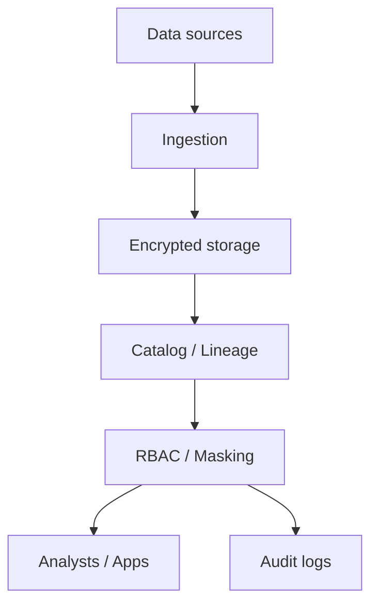

# 25 Data Security Governance

## 1. Introduction

Data Security và Governance là trách nhiệm bắt buộc ở senior/architect level. Một pipeline nhanh nhưng làm lộ PII, thiếu audit log, không có RBAC, hoặc vi phạm GDPR là thất bại production.



## 2. Theory

### RBAC

Role-Based Access Control cấp quyền theo vai trò, không theo từng cá nhân tùy tiện.

Ví dụ:

- `data_engineer`: build pipeline.
- `analyst`: query mart đã curated.
- `finance_analyst`: truy cập finance marts.
- `pii_admin`: quyền đặc biệt với PII.

### Encryption

- Encryption at rest: mã hóa khi lưu.
- Encryption in transit: TLS khi truyền.
- Key management: quản lý key qua KMS/HSM, rotate định kỳ.

### PII

PII là thông tin nhận dạng cá nhân: email, phone, address, government ID, IP trong một số ngữ cảnh. PII cần classification, masking, retention policy và access control.

### GDPR basics

Các nguyên tắc cơ bản:

- Data minimization.
- Purpose limitation.
- Right to access.
- Right to erasure.
- Consent và lawful basis.
- Breach notification.

### Masking

Masking che dữ liệu nhạy cảm:

- Static masking: tạo bản masked cố định.
- Dynamic masking: che theo role tại query time.
- Tokenization: thay PII bằng token.

### Audit logging

Audit log ghi ai truy cập dữ liệu gì, lúc nào, bằng query/job nào.

### Catalog

Data catalog quản lý metadata: owner, schema, classification, lineage, freshness, quality, glossary.

## 3. Real-world example

Bài toán: warehouse có bảng `dim_customers` chứa email và phone.

Yêu cầu:

- Analyst thường chỉ thấy masked email.
- Marketing role được xem email nếu có approval.
- Mọi truy cập PII được audit.
- Catalog đánh dấu cột PII.
- Retention xóa dữ liệu theo policy.

Incident thực tế: một analyst tạo extract chứa raw email vào shared folder. Fix: dynamic masking, hạn chế export, audit alert, classification trong catalog, và training access policy.

## 4. SQL example

### PostgreSQL: role và view masking

```sql
CREATE ROLE analyst;

CREATE VIEW vw_customers_masked AS
SELECT
    customer_id,
    LEFT(email, 2) || '***' || SUBSTRING(email FROM POSITION('@' IN email)) AS email_masked,
    country,
    segment
FROM dim_customers;

GRANT SELECT ON vw_customers_masked TO analyst;
```

### Oracle: role và view masking

```sql
CREATE ROLE analyst;

CREATE OR REPLACE VIEW vw_customers_masked AS
SELECT
    customer_id,
    SUBSTR(email, 1, 2) || '***' || SUBSTR(email, INSTR(email, '@')) AS email_masked,
    country,
    segment
FROM dim_customers;

GRANT SELECT ON vw_customers_masked TO analyst;
```

### Audit access table

```sql
CREATE TABLE data_access_audit (
    audit_id BIGINT,
    user_name VARCHAR(200),
    object_name VARCHAR(200),
    access_time TIMESTAMP,
    purpose VARCHAR(500)
);
```

## 5. Python example

```python
import hashlib


def hash_email(email: str, salt: str) -> str:
    normalized = email.strip().lower()
    return hashlib.sha256(f"{salt}|{normalized}".encode("utf-8")).hexdigest()


def mask_phone(phone: str) -> str:
    digits = "".join(ch for ch in phone if ch.isdigit())
    if len(digits) < 4:
        return "***"
    return "***-***-" + digits[-4:]
```

## 6. Optimization

### Performance optimization

- Masking view có thể tốn CPU nếu query lớn; materialize masked dataset cho workload nặng.
- Catalog scan nên chạy incremental.
- Audit log volume lớn cần partition theo ngày.
- Encryption thường có overhead nhỏ nhưng key access phải ổn định.

### Cost optimization

- Phân loại PII để không áp dụng policy nặng cho mọi cột.
- Retention policy giảm storage.
- Tách raw restricted zone và curated zone để giảm access review complexity.
- Audit log lưu lâu cần lifecycle policy.

### Monitoring

Theo dõi:

- PII access count.
- Failed access attempts.
- Permission changes.
- Unclassified columns.
- Export/download events.
- Audit log completeness.
- Encryption/key rotation status.

## 7. Common mistakes

### Mistakes

- Grant quyền trực tiếp cho user thay vì role.
- Không phân loại PII.
- Mask ở dashboard nhưng raw table vẫn mở.
- Không audit access.
- Không có retention policy.

### Anti-patterns

- Shared admin account.
- Copy PII sang sandbox/dev.
- Hardcode secrets trong pipeline.
- Catalog chỉ là tài liệu thủ công không được cập nhật.

### Best practices

- Least privilege by default.
- Role-based access, review định kỳ.
- PII classification ở column level.
- Masking/tokenization trước khi expose rộng.
- Audit log không thể sửa bởi user thường.
- Data owner rõ ràng cho mỗi domain.

### Incident scenario

Phát hiện raw email trong dashboard:

1. Xác định source table/view.
2. Thu hồi access hoặc rollback dashboard.
3. Kiểm tra audit log ai đã truy cập/export.
4. Đánh giá breach scope.
5. Thêm masking test và catalog classification.

## 8. Interview questions

### Junior

- RBAC là gì?
- PII là gì?
- Encryption at rest khác in transit thế nào?

### Mid

- Dynamic masking khác static masking thế nào?
- Audit log nên ghi những gì?
- Vì sao cần data catalog?

### Senior

- Thiết kế governance cho multi-tenant warehouse như thế nào?
- Làm sao enforce least privilege ở scale lớn?
- Xử lý right to erasure trong lakehouse ra sao?

## 9. Exercises

1. Tạo masked view cho customer email.
2. Thiết kế role matrix cho analyst, engineer, finance.
3. Viết audit table schema.
4. Phân loại PII cho bảng customer.
5. Thiết kế retention policy cho raw logs.

## 10. Checklist

- [ ] RBAC theo role, không theo cá nhân tùy tiện.
- [ ] PII được classify ở column level.
- [ ] Encryption at rest/in transit bật.
- [ ] Secrets không hardcode.
- [ ] Masking áp dụng trước khi expose rộng.
- [ ] Audit logging đầy đủ.
- [ ] Catalog có owner, lineage, classification.
- [ ] Retention và deletion policy rõ ràng.
- [ ] Access review định kỳ.
- [ ] Incident response cho data leak tồn tại.

