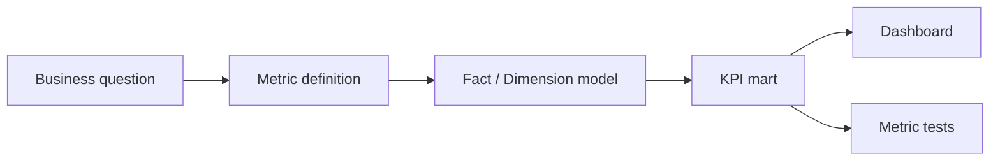

# 26 Analytical Patterns KPI

## 1. Introduction

KPI không chỉ là công thức. KPI là contract giữa business và data platform. Senior Data Engineer phải giúp thiết kế metric đúng grain, đúng entity, đúng thời gian, có thể audit, backfill, và không đổi nghĩa tùy dashboard.



## 2. Theory

### KPI design

KPI tốt cần:

- Owner.
- Definition.
- Grain.
- Inclusion/exclusion rules.
- Timezone.
- Source of truth.
- Refresh SLA.
- Known limitations.

### Retention

Retention đo user quay lại sau mốc ban đầu. Phải định nghĩa exact, rolling hay calendar retention.

### Cohort

Cohort nhóm entity theo start event như signup hoặc first purchase.

### Funnel

Funnel đo conversion qua các bước. Phải rõ strict order, conversion window và counting unit.

### Attribution

Attribution gán credit cho channel/campaign. Các model:

- First touch.
- Last touch.
- Linear.
- Position-based.
- Data-driven.

### OLAP thinking

OLAP thinking là thiết kế dữ liệu để slice/dice theo dimension, drill-down, roll-up, và reconcile từ summary về fact.

## 3. Real-world example

Bài toán: định nghĩa KPI `Monthly Active Customers`.

Definition:

- Customer có ít nhất một order `PAID` trong tháng.
- Loại test customers và fraud orders.
- Tính theo timezone business `Asia/Ho_Chi_Minh`.
- Grain output: một dòng trên mỗi tháng.

Incident thực tế: dashboard A tính active customer theo order date UTC, dashboard B tính theo local date. Cuối tháng số lệch 3%. Fix: tạo metric mart chuẩn và deprecate dashboard logic riêng.

## 4. SQL example

### PostgreSQL: monthly active customers

```sql
SELECT
    DATE_TRUNC('month', order_time AT TIME ZONE 'Asia/Ho_Chi_Minh') AS metric_month,
    COUNT(DISTINCT customer_id) AS monthly_active_customers
FROM fact_orders
WHERE order_status = 'PAID'
  AND is_test_order = FALSE
  AND is_fraud = FALSE
GROUP BY DATE_TRUNC('month', order_time AT TIME ZONE 'Asia/Ho_Chi_Minh');
```

### Oracle: monthly active customers

```sql
SELECT
    TRUNC(CAST(order_time AT TIME ZONE 'Asia/Ho_Chi_Minh' AS DATE), 'MM') AS metric_month,
    COUNT(DISTINCT customer_id) AS monthly_active_customers
FROM fact_orders
WHERE order_status = 'PAID'
  AND is_test_order = 0
  AND is_fraud = 0
GROUP BY TRUNC(CAST(order_time AT TIME ZONE 'Asia/Ho_Chi_Minh' AS DATE), 'MM');
```

### PostgreSQL: funnel strict order

```sql
WITH per_user AS (
    SELECT
        user_id,
        MIN(CASE WHEN event_name = 'product_viewed' THEN event_time END) AS viewed_at,
        MIN(CASE WHEN event_name = 'add_to_cart' THEN event_time END) AS cart_at,
        MIN(CASE WHEN event_name = 'purchase_completed' THEN event_time END) AS purchased_at
    FROM fact_events
    WHERE event_date >= DATE '2026-05-01'
    GROUP BY user_id
)
SELECT
    COUNT(*) AS entered,
    SUM(CASE WHEN viewed_at IS NOT NULL THEN 1 ELSE 0 END) AS viewed,
    SUM(CASE WHEN cart_at > viewed_at THEN 1 ELSE 0 END) AS added_to_cart,
    SUM(CASE WHEN purchased_at > cart_at THEN 1 ELSE 0 END) AS purchased
FROM per_user;
```

### Oracle: first-touch attribution

```sql
SELECT
    channel,
    COUNT(*) AS attributed_conversions
FROM (
    SELECT
        user_id,
        channel,
        ROW_NUMBER() OVER (
            PARTITION BY user_id
            ORDER BY touch_time
        ) AS rn
    FROM marketing_touches
)
WHERE rn = 1
GROUP BY channel;
```

## 5. Python example

```python
def validate_kpi_drift(today_value: float, yesterday_value: float, max_change: float) -> None:
    if yesterday_value == 0:
        return
    change = abs(today_value - yesterday_value) / yesterday_value
    if change > max_change:
        raise RuntimeError(
            f"KPI drift too high: today={today_value}, yesterday={yesterday_value}, change={change:.2%}"
        )
```

## 6. Optimization

### Performance optimization

- Tạo KPI mart ở grain dashboard cần dùng.
- Precompute cohort base table.
- Dùng approximate distinct chỉ khi business chấp nhận.
- Partition KPI mart theo metric date.
- Tránh tính funnel trực tiếp từ raw events mỗi lần dashboard refresh.

### Cost optimization

- Centralize metric logic để nhiều dashboard dùng chung.
- Materialize expensive attribution outputs.
- Retention/cohort nên incremental theo cohort window.
- Không rebuild toàn bộ KPI nếu chỉ có recent data thay đổi.

### Monitoring

Theo dõi:

- KPI value drift.
- Cohort size drift.
- Funnel step count.
- Null dimension rate.
- Metric freshness.
- Dashboard query cost.
- Reconciliation với source.

## 7. Common mistakes

### Mistakes

- Không định nghĩa timezone.
- Mỗi dashboard tự tính KPI.
- Đếm event thay vì user/customer.
- Funnel không enforce order.
- Attribution không xử lý multiple touches.

### Anti-patterns

- KPI không owner.
- Metric đổi nghĩa mà không version.
- Dashboard là source of truth.
- KPI mart không có tests.

### Best practices

- Mỗi KPI critical có definition document.
- Output grain rõ ràng.
- Metric logic nằm trong governed mart.
- Có reconciliation và anomaly detection.
- Version metric khi đổi definition.

### Incident scenario

Conversion rate tăng bất thường:

1. Kiểm tra denominator có giảm không.
2. Kiểm tra duplicate purchase events.
3. Kiểm tra event name mapping.
4. Kiểm tra campaign/bot traffic.
5. So sánh dashboard với metric mart.

## 8. Interview questions

### Junior

- KPI là gì?
- Cohort là gì?
- Funnel là gì?

### Mid

- Retention exact khác rolling như thế nào?
- Thiết kế active user metric cần những gì?
- Attribution first-touch khác last-touch thế nào?

### Senior

- Thiết kế metric platform tránh dashboard drift như thế nào?
- Làm sao version KPI definition?
- Làm sao audit KPI tài chính từ aggregate về fact?

## 9. Exercises

1. Định nghĩa Monthly Active Customers đầy đủ.
2. Viết cohort first purchase theo tháng.
3. Viết funnel strict order 4 bước.
4. Thiết kế attribution last-touch.
5. Tạo checklist metric contract cho KPI mới.

## 10. Checklist

- [ ] KPI có owner.
- [ ] Definition rõ inclusion/exclusion.
- [ ] Grain rõ ràng.
- [ ] Timezone rõ ràng.
- [ ] Source of truth xác định.
- [ ] KPI mart được materialize nếu cần.
- [ ] Có anomaly detection.
- [ ] Có reconciliation path.
- [ ] Metric changes được version.
- [ ] Dashboard không chứa logic critical riêng.

