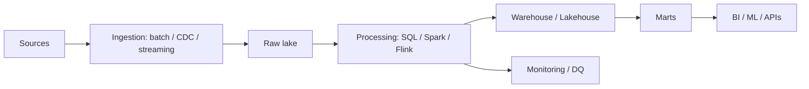
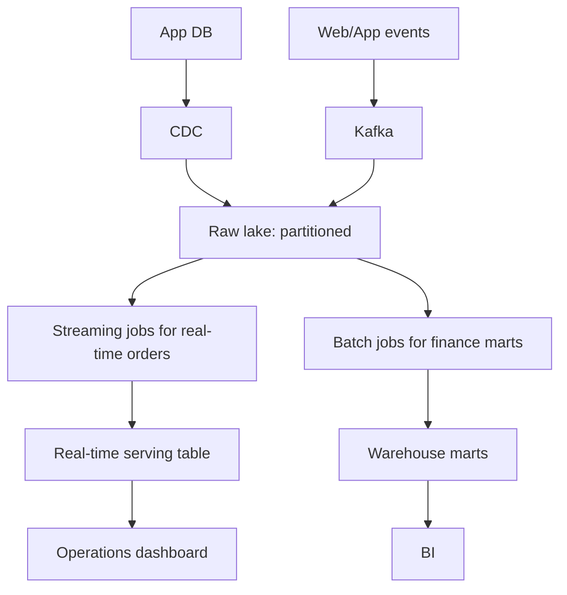

# 27 System Design for Data Engineering

## 1. Introduction

System design cho Data Engineering là khả năng thiết kế pipeline lớn, đáng tin, có chi phí hợp lý, đáp ứng SLA và chịu được incident. Đây là cấp architect: không chỉ chọn tool, mà phải giải thích trade-off.



## 2. Theory

### Large-scale pipeline

Một pipeline lớn cần:

- Ingestion strategy.
- Storage layout.
- Processing engine.
- Data model.
- Orchestration.
- Quality checks.
- Observability.
- Backfill strategy.
- Cost controls.

### Billion rows/day

1 tỷ dòng/ngày yêu cầu partitioning, compression, incremental processing, schema evolution, and failure isolation.

### Multi-tenant warehouse

Multi-tenant cần cô lập dữ liệu, access, cost và performance giữa tenants.

### Streaming architecture

Streaming dùng khi latency thấp quan trọng. Nhưng streaming phức tạp hơn batch: ordering, state, watermark, replay, exactly-once/idempotency.

### Cost/performance tradeoff

Nhanh hơn thường đắt hơn. Senior phải biết business cần latency bao nhiêu, không optimize mù.

### HA/DR

- HA: high availability, giảm downtime.
- DR: disaster recovery, khôi phục sau sự cố lớn.
- RPO: mất tối đa bao nhiêu dữ liệu.
- RTO: khôi phục trong bao lâu.

## 3. Real-world example

Thiết kế analytics platform cho ecommerce:

- 1 tỷ events/ngày.
- Orders cần gần real-time trong 1 phút.
- Finance revenue chấp nhận batch hourly nhưng phải chính xác.
- Multi-tenant theo country.
- PII cần masking.
- Backfill 2 năm dữ liệu.

Architecture:



## 4. SQL example

### PostgreSQL: tenant-aware query

```sql
SELECT
    tenant_id,
    order_date,
    SUM(amount) AS revenue
FROM fact_orders
WHERE tenant_id = 'vn'
  AND order_date >= DATE '2026-05-01'
GROUP BY tenant_id, order_date;
```

### Oracle: tenant-aware query

```sql
SELECT
    tenant_id,
    order_date,
    SUM(amount) AS revenue
FROM fact_orders
WHERE tenant_id = 'vn'
  AND order_date >= DATE '2026-05-01'
GROUP BY tenant_id, order_date;
```

### PostgreSQL: data freshness check

```sql
SELECT
    MAX(ingestion_time) AS latest_ingestion_time,
    NOW() - MAX(ingestion_time) AS freshness_lag
FROM fact_orders
WHERE order_date = CURRENT_DATE;
```

### Oracle: data freshness check

```sql
SELECT
    MAX(ingestion_time) AS latest_ingestion_time,
    SYSTIMESTAMP - MAX(ingestion_time) AS freshness_lag
FROM fact_orders
WHERE order_date = TRUNC(SYSDATE);
```

## 5. Python example

```python
from dataclasses import dataclass


@dataclass(frozen=True)
class PipelineSla:
    name: str
    max_lag_minutes: int
    rpo_minutes: int
    rto_minutes: int


def is_sla_breached(actual_lag_minutes: int, sla: PipelineSla) -> bool:
    return actual_lag_minutes > sla.max_lag_minutes
```

## 6. Optimization

### Performance optimization

- Partition theo ngày và tenant nếu access pattern phù hợp.
- Dùng file size tối ưu cho lakehouse, tránh small files.
- Tách hot path real-time và cold path batch.
- Pre-aggregate marts cho BI.
- Scale compute theo workload, không scale cố định.

### Cost optimization

- Dữ liệu raw cũ chuyển storage tier rẻ.
- Backfill chạy bằng spot/low-priority compute nếu phù hợp.
- Streaming chỉ dùng cho use case cần low latency.
- Multi-tenant cost attribution theo tenant_id.
- Materialize đúng nơi, không materialize mọi thứ.

### Monitoring

Theo dõi:

- End-to-end lag.
- Throughput rows/sec.
- Error rate.
- Data quality failure.
- Cost per pipeline.
- Tenant-level resource usage.
- RPO/RTO drill result.

## 7. Common mistakes

### Mistakes

- Chọn streaming dù batch đủ dùng.
- Không có backfill design.
- Không tính small files problem.
- Không có tenant isolation.
- SLA không rõ hoặc không đo được.

### Anti-patterns

- One pipeline does everything.
- Một cluster lớn chạy mọi workload.
- Không phân biệt real-time operational và finance reporting.
- DR plan chỉ nằm trên giấy, chưa test.

### Best practices

- Bắt đầu từ requirements: latency, volume, correctness, cost.
- Tách raw, curated, serving layers.
- Thiết kế idempotency và replay từ đầu.
- Có quality gates trước mart critical.
- Test HA/DR định kỳ.

### Incident scenario

Pipeline 1 tỷ rows/ngày bị chậm 6 giờ:

1. Kiểm tra source throughput.
2. Kiểm tra partition skew.
3. Kiểm tra small files.
4. Kiểm tra failed tasks và retries.
5. Ưu tiên phục hồi critical marts trước.

## 8. Interview questions

### Junior

- Batch khác streaming như thế nào?
- SLA là gì?
- Partitioning dùng để làm gì?

### Mid

- Thiết kế pipeline incremental như thế nào?
- Multi-tenant warehouse cần lưu ý gì?
- Backfill khác daily run như thế nào?

### Senior

- Thiết kế platform ingest 1 tỷ rows/ngày với SLA 15 phút.
- Trade-off streaming và micro-batch ra sao?
- Thiết kế HA/DR cho lakehouse và warehouse như thế nào?

## 9. Exercises

1. Vẽ architecture pipeline batch cho ecommerce.
2. Thêm streaming path cho order tracking real-time.
3. Thiết kế partition strategy cho 1 tỷ event/ngày.
4. Thiết kế multi-tenant cost monitoring.
5. Viết DR plan với RPO/RTO cụ thể.

## 10. Checklist

- [ ] Requirements latency, volume, correctness rõ ràng.
- [ ] Batch/streaming choice có lý do.
- [ ] Storage layout xử lý scale.
- [ ] Pipeline idempotent và replayable.
- [ ] Có backfill strategy.
- [ ] Có tenant isolation nếu multi-tenant.
- [ ] Cost/performance trade-off được document.
- [ ] HA/DR có RPO/RTO.
- [ ] Monitoring end-to-end tồn tại.
- [ ] Critical marts có quality gates.

