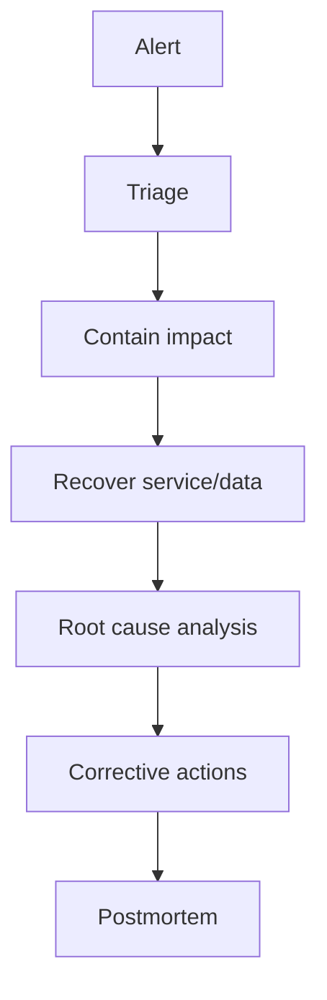

# 28 Production Incident Handling

## 1. Introduction

Incident handling là kỹ năng cực thực tế. Senior Data Engineer không chỉ fix job fail, mà phải giảm blast radius, khôi phục SLA, bảo vệ correctness, giao tiếp rõ ràng, RCA trung thực và ngăn tái diễn.



## 2. Theory

### Pipeline failure

Pipeline failure có thể do source, schema, compute, permission, bad code, data quality hoặc downstream dependency.

### Root cause analysis

RCA không phải tìm người có lỗi. RCA tìm system weakness.

### Retry strategy

Retry phải phân biệt:

- Transient failure: network timeout, rate limit.
- Permanent failure: schema missing, permission denied.
- Data failure: invalid records.

### Backfill strategy

Backfill cần idempotent, bounded, observable và không phá daily SLA.

### SLA breach

SLA breach là khi service/data không đạt cam kết freshness, completeness hoặc correctness.

### Data corruption handling

Data corruption nguy hiểm hơn job fail vì downstream có thể đã dùng dữ liệu sai.

## 3. Real-world example

Incident: bảng revenue daily bị nhân đôi do retry append dữ liệu cùng partition.

Impact:

- Dashboard executive sai.
- Finance export đã gửi.
- ML feature dùng revenue sai.

Response:

1. Freeze downstream refresh.
2. Identify affected partitions.
3. Restore hoặc rebuild từ raw idempotent source.
4. Re-run quality checks.
5. Communicate corrected numbers.
6. Add unique key merge và duplicate alert.

## 4. SQL example

### PostgreSQL: phát hiện duplicate partition

```sql
SELECT
    order_date,
    order_id,
    COUNT(*) AS row_count
FROM fact_orders
WHERE order_date BETWEEN DATE '2026-05-01' AND DATE '2026-05-08'
GROUP BY order_date, order_id
HAVING COUNT(*) > 1;
```

### Oracle: phát hiện duplicate partition

```sql
SELECT
    order_date,
    order_id,
    COUNT(*) AS row_count
FROM fact_orders
WHERE order_date BETWEEN DATE '2026-05-01' AND DATE '2026-05-08'
GROUP BY order_date, order_id
HAVING COUNT(*) > 1;
```

### PostgreSQL: quarantine bad records

```sql
INSERT INTO quarantine_orders
SELECT
    *,
    'duplicate_order_id' AS quarantine_reason,
    NOW() AS quarantined_at
FROM fact_orders
WHERE order_id IN (
    SELECT order_id
    FROM fact_orders
    GROUP BY order_id
    HAVING COUNT(*) > 1
);
```

### Oracle: quarantine bad records

```sql
INSERT INTO quarantine_orders
SELECT
    f.*,
    'duplicate_order_id' AS quarantine_reason,
    SYSTIMESTAMP AS quarantined_at
FROM fact_orders f
WHERE order_id IN (
    SELECT order_id
    FROM fact_orders
    GROUP BY order_id
    HAVING COUNT(*) > 1
);
```

## 5. Python example

```python
import logging
from dataclasses import dataclass

logger = logging.getLogger(__name__)


@dataclass(frozen=True)
class Incident:
    name: str
    severity: str
    affected_table: str
    started_at: str


def escalate_if_sev1(incident: Incident) -> None:
    if incident.severity == "SEV1":
        logger.error(
            "SEV1 incident affected_table=%s started_at=%s",
            incident.affected_table,
            incident.started_at,
        )
        raise RuntimeError(f"SEV1 requires immediate escalation: {incident.name}")
```

## 6. Optimization

### Performance optimization

- Backfill theo partition chunks.
- Ưu tiên rebuild critical partitions trước.
- Dùng incremental validation thay vì full scan nếu đang khôi phục SLA.
- Tách compute backfill khỏi compute daily production.

### Cost optimization

- Không full rebuild toàn warehouse nếu chỉ vài partition bị ảnh hưởng.
- Dùng raw immutable data để rebuild chính xác.
- Sau incident, cleanup corrupted temp/intermediate data.
- Chạy RCA queries có filter partition để tránh cost tăng đột biến.

### Monitoring

Theo dõi:

- Pipeline success/failure.
- SLA freshness.
- Row count anomaly.
- Duplicate/null rate.
- Backfill progress.
- Retry count.
- Downstream impacted assets.

## 7. Common mistakes

### Mistakes

- Retry vô hạn làm source quá tải.
- Fix trực tiếp data production không lưu audit.
- Không freeze downstream khi data corruption.
- Không xác định affected partitions.
- Postmortem chỉ mô tả symptom, không có action items.

### Anti-patterns

- Blamestorming.
- Manual hotfix không review.
- Delete/reload không có backup.
- Không thông báo stakeholder khi KPI sai.

### Best practices

- Triage impact trước, root cause sau.
- Contain blast radius.
- Mọi repair data có audit trail.
- Backfill phải idempotent.
- Postmortem có owner và deadline cho action items.

### Incident scenario

SLA breach 2 giờ:

1. Xác nhận alert đúng.
2. Xác định pipeline/source chậm.
3. Ước tính ETA phục hồi.
4. Communicate impact và ETA.
5. Khôi phục critical path trước.
6. RCA sau khi service ổn định.

## 8. Interview questions

### Junior

- Khi pipeline fail, bạn kiểm tra gì đầu tiên?
- Retry là gì?
- Backfill là gì?

### Mid

- Phân biệt transient và permanent failure.
- Làm sao xử lý duplicate do retry?
- SLA breach cần communicate gì?

### Senior

- Xử lý data corruption đã lan sang nhiều marts như thế nào?
- Thiết kế incident playbook cho finance pipeline.
- Làm sao backfill 2 năm dữ liệu mà không phá daily SLA?

## 9. Exercises

1. Viết playbook pipeline failure.
2. Thiết kế retry strategy cho API ingestion.
3. Viết SQL phát hiện duplicate và null key.
4. Thiết kế backfill plan cho 90 ngày dữ liệu.
5. Viết postmortem template với action items.

## 10. Checklist

- [ ] Alert có severity rõ ràng.
- [ ] Có owner/on-call.
- [ ] Có playbook cho pipeline critical.
- [ ] Retry có giới hạn.
- [ ] Backfill idempotent.
- [ ] Data repair có audit trail.
- [ ] Affected partitions được xác định.
- [ ] Downstream impact được communicate.
- [ ] RCA tập trung vào system weakness.
- [ ] Action items có owner/deadline.

