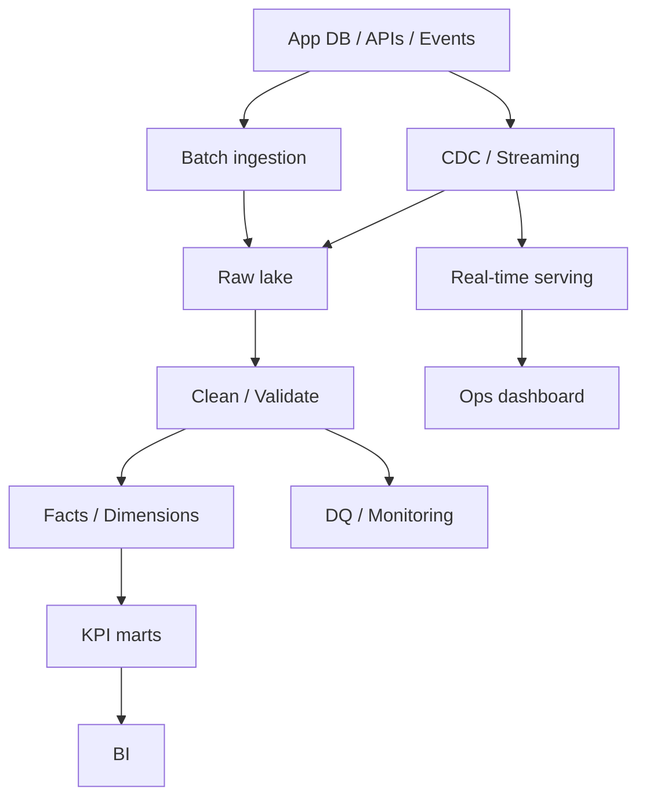

# 29 Data Engineering Capstone Project

## 1. Introduction

Capstone là nơi bạn chứng minh năng lực senior: không chỉ viết SQL/Python, mà thiết kế end-to-end platform có ingestion, modeling, streaming/batch, security, monitoring, incident handling, cost control và documentation.

Các project mẫu:

- Ecommerce analytics platform.
- Real-time order tracking.
- CDC pipeline.
- Lakehouse project.
- Batch + Streaming hybrid.



## 2. Theory

Capstone tốt phải thể hiện:

- Data architecture.
- Data modeling.
- SQL performance.
- Python ingestion.
- Batch and streaming thinking.
- Security/governance.
- Observability.
- Backfill/recovery.
- Cost/performance trade-off.

### Expected senior artifacts

- Architecture diagram.
- Data contracts.
- Table grain documentation.
- DQ checks.
- Runbook.
- Incident playbook.
- Cost estimate.
- Backfill plan.

## 3. Real-world example

Project: Ecommerce analytics platform.

Requirements:

- Ingest orders, payments, customers, products.
- Ingest clickstream events.
- Build `fact_orders`, `fact_order_items`, `dim_customer_scd`, `dim_product_scd`.
- Build KPI marts: revenue, retention, funnel, cohort.
- Real-time order tracking under 1 minute latency.
- Batch finance mart hourly.
- PII masking for customer fields.
- Monitoring and incident handling.

## 4. SQL example

### PostgreSQL: fact order mart

```sql
WITH paid_orders AS (
    SELECT
        order_id,
        customer_id,
        order_date,
        amount
    FROM fact_orders
    WHERE order_status = 'PAID'
)
SELECT
    order_date,
    COUNT(*) AS paid_orders,
    COUNT(DISTINCT customer_id) AS active_customers,
    SUM(amount) AS revenue
FROM paid_orders
GROUP BY order_date;
```

### Oracle: fact order mart

```sql
WITH paid_orders AS (
    SELECT
        order_id,
        customer_id,
        order_date,
        amount
    FROM fact_orders
    WHERE order_status = 'PAID'
)
SELECT
    order_date,
    COUNT(*) AS paid_orders,
    COUNT(DISTINCT customer_id) AS active_customers,
    SUM(amount) AS revenue
FROM paid_orders
GROUP BY order_date;
```

### PostgreSQL: SCD point-in-time join

```sql
SELECT
    o.order_id,
    c.segment,
    o.amount
FROM fact_orders o
JOIN dim_customer_scd c
  ON o.customer_id = c.customer_id
 AND o.order_time >= c.valid_from
 AND o.order_time < COALESCE(c.valid_to, TIMESTAMP '9999-12-31 00:00:00');
```

### Oracle: SCD point-in-time join

```sql
SELECT
    o.order_id,
    c.segment,
    o.amount
FROM fact_orders o
JOIN dim_customer_scd c
  ON o.customer_id = c.customer_id
 AND o.order_time >= c.valid_from
 AND o.order_time < COALESCE(c.valid_to, TIMESTAMP '9999-12-31 00:00:00');
```

## 5. Python example

```python
from dataclasses import dataclass
from pathlib import Path
import json


@dataclass(frozen=True)
class RawBatch:
    source: str
    partition_date: str
    path: Path


def load_raw_json(batch: RawBatch) -> list[dict]:
    records = json.loads(batch.path.read_text(encoding="utf-8"))
    if not isinstance(records, list):
        raise ValueError(f"Expected list records for source={batch.source}")
    return records


def validate_required(record: dict, required: set[str]) -> list[str]:
    return [field for field in required if record.get(field) in (None, "")]
```

## 6. Optimization

### Performance optimization

- Partition raw và fact theo date.
- Cluster hoặc index theo customer/order key.
- Pre-aggregate KPI marts.
- Tách real-time serving table khỏi finance mart.
- Dùng incremental build với lookback.
- Xử lý small files trong lakehouse.

### Cost optimization

- Storage tiering cho raw old data.
- Batch finance hourly thay vì streaming nếu không cần second-level latency.
- Materialize only high-value marts.
- Theo dõi cost theo pipeline/domain.
- Backfill chạy theo chunks và off-peak.

### Monitoring

Theo dõi:

- End-to-end freshness.
- Row count by source.
- Duplicate/null/reject rate.
- Revenue reconciliation.
- Streaming lag.
- Job runtime.
- Cost per run.
- PII access logs.

## 7. Common mistakes

### Mistakes

- Capstone chỉ có notebook, không có production pipeline.
- Không document grain.
- Không có DQ checks.
- Không có backfill story.
- Không có security/governance.
- Không đo cost.

### Anti-patterns

- One big table cho mọi use case.
- Dashboard query raw data.
- Streaming mọi thứ dù batch đủ.
- Không có runbook.
- Không có incident scenario.

### Best practices

- Bắt đầu từ requirements và SLA.
- Thiết kế raw, staging, fact/dim, mart layers.
- Mọi critical table có tests.
- Có architecture diagram và data contract.
- Có demo incident recovery/backfill.
- Có cost/performance explanation.

### Incident scenario

Capstone demo incident: revenue mart sai do duplicate order load.

Response:

1. Alert duplicate rate.
2. Freeze dashboard refresh.
3. Identify affected partition.
4. Rebuild partition từ raw.
5. Re-run reconciliation.
6. Add idempotent merge and test.

## 8. Interview questions

### Junior

- Capstone của bạn có những source nào?
- Fact và dimension chính là gì?
- Pipeline chạy batch hay streaming?

### Mid

- Bạn xử lý duplicate và late data thế nào?
- Backfill một partition ra sao?
- Monitoring gồm những metric nào?

### Senior

- Tại sao chọn architecture này thay vì architecture khác?
- Thiết kế platform cho 1 tỷ rows/ngày sẽ thay đổi gì?
- HA/DR, security, cost và incident handling trong capstone của bạn ra sao?

## 9. Exercises

1. Vẽ architecture ecommerce analytics platform.
2. Viết table grain document cho 5 bảng chính.
3. Implement SQL mart revenue daily.
4. Thiết kế SCD Type 2 customer dimension.
5. Viết DQ checks cho null, duplicate, freshness.
6. Viết runbook cho pipeline failure.
7. Ước tính cost và đề xuất optimization.

## 10. Checklist

- [ ] Có architecture diagram.
- [ ] Có batch và/hoặc streaming design rõ ràng.
- [ ] Có raw/staging/fact/dim/mart layers.
- [ ] Có PostgreSQL/Oracle SQL examples.
- [ ] Có Python ingestion/validation example.
- [ ] Có DQ checks.
- [ ] Có monitoring và alert.
- [ ] Có security/governance cho PII.
- [ ] Có backfill và incident playbook.
- [ ] Có cost/performance trade-off.
- [ ] Có interview-ready explanation.
