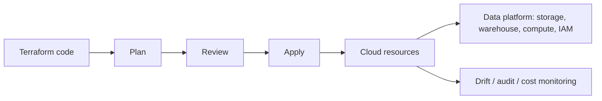

# 30 Terraform Infrastructure as Code

## 1. Introduction

Terraform giúp Data Engineer mô tả hạ tầng bằng code: bucket, database, warehouse, IAM/RBAC, network, secrets, streaming resources, scheduler. Ở mức junior, bạn biết chạy `terraform plan/apply`. Ở mức senior, bạn thiết kế module, state, review process, drift detection, cost guardrails và rollback strategy.



## 2. Theory

Infrastructure as Code nghĩa là hạ tầng được version, review, test và triển khai như software.

Các khái niệm chính:

- Provider: plugin nói chuyện với cloud hoặc service.
- Resource: object được quản lý, ví dụ bucket, role, database.
- Module: package tái sử dụng.
- State: bản ghi Terraform dùng để biết resource hiện tại.
- Plan: diff giữa code và thực tế.
- Apply: thực thi thay đổi.
- Drift: resource ngoài đời bị thay đổi khác code.

Beginner cần hiểu resource và variables. Mid cần hiểu modules, remote state, workspace/environment. Senior cần kiểm soát state locking, least privilege, CI/CD approval, policy-as-code, cost impact và blast radius.

## 3. Real-world example

Bài toán production: tạo hạ tầng ingestion cho data platform.

- Object storage cho raw zone và curated zone.
- Warehouse schema cho staging và marts.
- Role read-only cho analyst.
- Role write cho pipeline.
- Audit log table.
- Alert khi bucket public hoặc cost vượt ngưỡng.

Incident thực tế: một engineer sửa quyền bucket bằng console để debug, quên revert. Terraform không chạy drift detection nên bucket raw chứa PII bị mở rộng quyền đọc. Fix: remote state, CI plan bắt buộc, drift detection hằng ngày, policy chặn public access.

## 4. SQL example

Terraform không thay SQL, nhưng thường provision database objects rồi chạy SQL migrations.

### PostgreSQL: tạo schema và role cho pipeline

```sql
CREATE SCHEMA IF NOT EXISTS raw;
CREATE SCHEMA IF NOT EXISTS analytics;

CREATE ROLE de_pipeline LOGIN PASSWORD 'change_me';

GRANT USAGE ON SCHEMA raw, analytics TO de_pipeline;
GRANT SELECT, INSERT, UPDATE, DELETE ON ALL TABLES IN SCHEMA raw TO de_pipeline;
GRANT SELECT, INSERT, UPDATE, DELETE ON ALL TABLES IN SCHEMA analytics TO de_pipeline;

ALTER DEFAULT PRIVILEGES IN SCHEMA analytics
GRANT SELECT ON TABLES TO de_pipeline;
```

### Oracle: tạo user và quyền cơ bản

```sql
CREATE USER de_pipeline IDENTIFIED BY "change_me";

GRANT CREATE SESSION TO de_pipeline;
GRANT CREATE TABLE TO de_pipeline;
GRANT CREATE VIEW TO de_pipeline;
GRANT CREATE SEQUENCE TO de_pipeline;

GRANT SELECT, INSERT, UPDATE, DELETE ON raw.orders TO de_pipeline;
GRANT SELECT ON analytics.customer_revenue TO de_pipeline;
```

Senior note: credentials không nên hardcode trong Terraform state nếu state không được bảo vệ. Dùng secret manager và sensitive variables.

## 5. Python example

Python có thể kiểm tra drift hoặc validate policy sau Terraform apply.

```python
import json
from pathlib import Path


def load_tf_plan(path: Path) -> dict:
    return json.loads(path.read_text(encoding="utf-8"))


def assert_no_public_bucket(plan: dict) -> None:
    violations = []
    for change in plan.get("resource_changes", []):
        after = change.get("change", {}).get("after", {})
        if after.get("acl") in {"public-read", "public-read-write"}:
            violations.append(change.get("address"))

    if violations:
        raise RuntimeError(f"Public bucket ACL detected: {violations}")
```

## 6. Optimization

### Performance optimization

- Chia module nhỏ theo domain: storage, warehouse, network, IAM.
- Tránh một state file quá lớn làm plan chậm và blast radius lớn.
- Dùng remote state locking để tránh apply đồng thời.
- Tách environment dev/staging/prod.
- Không chạy apply thủ công ngoài pipeline cho production.

### Cost optimization

- Gắn tag cost center cho mọi resource.
- Dùng lifecycle policy cho storage raw cũ.
- Tự động tắt compute dev ngoài giờ.
- Review plan có resource đắt tiền như cluster, NAT gateway, warehouse size.
- Dùng policy-as-code chặn resource vượt size cho environment nhỏ.

### Monitoring

Theo dõi:

- Terraform apply success/failure.
- Drift detection result.
- Resource count theo environment.
- Public exposure.
- IAM policy changes.
- Monthly cost theo tag.

### Best practices

- Plan phải được review trước apply production.
- State phải được mã hóa và lock.
- Secrets không được commit.
- Module phải có input/output rõ ràng.
- Mỗi change nên nhỏ và có rollback path.

## 7. Common mistakes

### Mistakes

- Commit secret vào `.tfvars`.
- Dùng local state cho production.
- Một module khổng lồ quản lý mọi thứ.
- Apply trực tiếp từ laptop cho production.
- Không review Terraform plan.
- Không biết resource nào sẽ bị destroy.

### Anti-patterns

- Console-first: sửa cloud console rồi quên cập nhật code.
- Copy-paste module cho từng team thay vì reusable module.
- Grant admin role cho pipeline vì tiện.
- Terraform quản lý cả data object có lifecycle ngắn và thay đổi liên tục.

### Incident scenario

Warehouse production bị destroy do variable sai environment:

1. Dừng pipeline apply.
2. Kiểm tra Terraform plan và state history.
3. Restore từ backup/snapshot nếu resource mất.
4. Thêm approval bắt buộc cho destroy.
5. Thêm policy chặn destroy resource production không có break-glass approval.

## 8. Interview questions

### Junior

- Terraform state là gì?
- `plan` khác `apply` thế nào?
- Provider và resource là gì?
- Vì sao không nên commit secret?

### Mid

- Remote state và state locking dùng để làm gì?
- Module Terraform nên thiết kế ra sao?
- Drift là gì và phát hiện thế nào?
- Quản lý nhiều environment như thế nào?

### Senior

- Thiết kế Terraform workflow cho data platform production như thế nào?
- Làm sao giảm blast radius của một apply?
- Làm sao enforce least privilege bằng IaC?
- Xử lý incident Terraform destroy nhầm resource production ra sao?

## 9. Exercises

1. Viết module Terraform tạo bucket raw và curated.
2. Thiết kế variable cho dev/staging/prod.
3. Viết policy kiểm tra không bucket nào public.
4. Tạo PostgreSQL schema/role bằng migration sau Terraform.
5. Mô phỏng drift và viết checklist xử lý.
6. Thiết kế tagging strategy cho cost allocation.

## 10. Checklist

- [ ] Remote state được mã hóa và lock.
- [ ] Production apply yêu cầu review.
- [ ] Secrets không nằm trong repo/state không bảo vệ.
- [ ] Module có interface rõ ràng.
- [ ] Resource có tag owner, environment, cost center.
- [ ] Có drift detection.
- [ ] Có policy chặn public access và privilege quá rộng.
- [ ] Có backup/rollback strategy cho resource critical.
- [ ] Có monitoring apply failure và cost.
- [ ] Có incident playbook cho destroy hoặc permission mistake.
