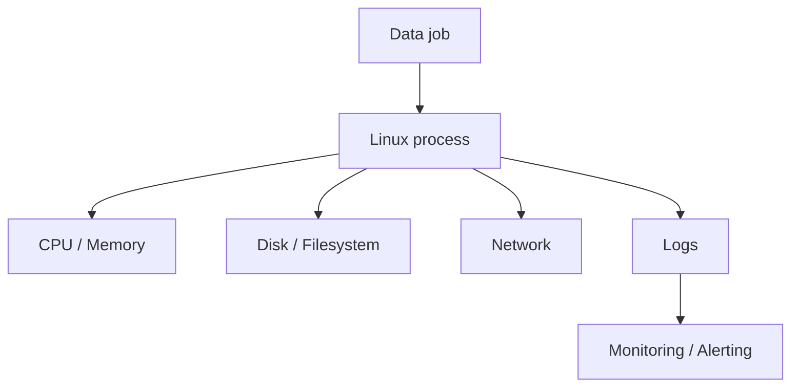

# 31 Linux for Data Engineers

## 1. Introduction

Linux là môi trường vận hành phổ biến của data pipelines: cron, Airflow workers, Spark nodes, containers, database servers, log processing. Fresher cần biết command cơ bản. Senior cần debug CPU, memory, disk, network, permission, process, file descriptor, cron, logs và production failure.



## 2. Theory

Các mảng Linux Data Engineer phải biết:

- Filesystem: path, ownership, permission, mount.
- Process: PID, signal, foreground/background.
- Shell: pipes, redirection, environment variables.
- Logs: `journalctl`, application logs, rotation.
- Scheduling: cron, systemd timer.
- Resource: CPU, memory, disk, inode, network.
- Security: user, group, sudo, SSH keys.

Beginner biết `ls`, `cd`, `cat`, `grep`. Mid biết `awk`, `sed`, `find`, `xargs`, `ps`, `top`, `df`, `du`. Senior biết debug production bằng evidence thay vì đoán.

## 3. Real-world example

Bài toán: nightly ETL thất bại lúc 2h sáng.

Triệu chứng:

- Job báo `No space left on device`.
- Disk còn 20GB trống.
- Nhưng inode đã hết vì có hàng triệu file nhỏ trong temp folder.

Fix:

- Kiểm tra `df -h` và `df -i`.
- Xóa temp theo retention an toàn.
- Gộp small files thành Parquet lớn hơn.
- Thêm monitoring inode.

## 4. SQL example

Linux thường dùng để chạy SQL health checks qua CLI.

### PostgreSQL: kiểm tra job output

```sql
SELECT
    CURRENT_DATE AS check_date,
    COUNT(*) AS rows_loaded,
    MAX(updated_at) AS max_updated_at
FROM analytics.fact_orders
WHERE load_date = CURRENT_DATE;
```

### Oracle: kiểm tra job output

```sql
SELECT
    TRUNC(SYSDATE) AS check_date,
    COUNT(*) AS rows_loaded,
    MAX(updated_at) AS max_updated_at
FROM analytics.fact_orders
WHERE load_date = TRUNC(SYSDATE);
```

Ví dụ shell gọi PostgreSQL:

```bash
psql "$POSTGRES_DSN" -f checks/fact_orders_freshness.sql
```

Ví dụ shell gọi Oracle:

```bash
sqlplus "$ORACLE_USER/$ORACLE_PASSWORD@$ORACLE_DSN" @checks/fact_orders_freshness.sql
```

## 5. Python example

Python kiểm tra disk và fail sớm trước khi job chạy.

```python
import shutil
from pathlib import Path


def assert_min_free_space(path: Path, min_gb: int) -> None:
    usage = shutil.disk_usage(path)
    free_gb = usage.free / (1024 ** 3)
    if free_gb < min_gb:
        raise RuntimeError(f"Not enough disk space at {path}: {free_gb:.2f} GB free")


assert_min_free_space(Path("/data/tmp"), min_gb=50)
```

## 6. Optimization

### Performance optimization

- Dùng streaming tools thay vì load file lớn vào memory.
- Tránh tạo hàng triệu small files.
- Dùng compression phù hợp: gzip tiết kiệm space, zstd thường cân bằng tốt.
- Kiểm tra bottleneck bằng `top`, `iotop`, `vmstat`, `iostat`.
- Với file lớn, dùng `rg`, `awk`, `sed` hợp lý thay vì mở editor.

### Cost optimization

- Xóa log/temp theo retention.
- Nén archive.
- Dùng lifecycle storage thay vì giữ mọi file trên disk đắt.
- Tắt instance dev khi không dùng.
- Theo dõi disk growth để tránh over-provision.

### Monitoring

Theo dõi:

- CPU load.
- Memory usage và swap.
- Disk usage và inode.
- Network throughput.
- Failed cron jobs.
- Process runtime.
- Log error rate.

### Best practices

- Script phải fail fast với `set -euo pipefail` nếu dùng bash.
- Log stdout/stderr về nơi tập trung.
- Không chạy production job bằng user cá nhân.
- Permission theo least privilege.
- Cleanup temp phải có guard path để tránh xóa nhầm.

## 7. Common mistakes

### Mistakes

- Chỉ kiểm tra `df -h`, quên inode.
- Dùng `chmod 777` để fix permission.
- Cron chạy khác environment với shell interactive.
- Không capture stderr.
- Xóa file bằng wildcard nguy hiểm.

### Anti-patterns

- Debug production bằng cách sửa script trực tiếp trên server.
- Job phụ thuộc file nằm trong home directory cá nhân.
- Log không rotate làm đầy disk.
- Hardcode absolute path không tồn tại ở environment khác.

### Incident scenario

Pipeline fail vì permission:

1. Kiểm tra user chạy job.
2. Kiểm tra owner/group của input/output path.
3. Kiểm tra umask và permission inherited.
4. Sửa bằng group/role đúng, không dùng `777`.
5. Thêm preflight permission check.

## 8. Interview questions

### Junior

- `chmod` và `chown` dùng để làm gì?
- `grep` khác `find` thế nào?
- Làm sao xem file log realtime?
- Cron là gì?

### Mid

- Debug disk full nhưng `df -h` vẫn còn space như thế nào?
- Vì sao cron job chạy fail nhưng chạy tay lại success?
- `stdout` và `stderr` khác gì?
- Kiểm tra process đang chạy thế nào?

### Senior

- Thiết kế Linux operational checklist cho data worker node.
- Debug pipeline chậm do I/O thế nào?
- Làm sao quản lý permission an toàn cho nhiều pipeline team?
- Xử lý incident log filling disk production ra sao?

## 9. Exercises

1. Viết script kiểm tra disk, memory, và input path trước ETL.
2. Tạo cron chạy SQL freshness check.
3. Dùng `awk` tính tổng amount từ CSV lớn.
4. Mô phỏng inode full bằng nhiều file nhỏ và viết cách phát hiện.
5. Thiết kế log rotation policy cho pipeline.
6. Viết runbook debug job Linux fail.

## 10. Checklist

- [ ] Job chạy bằng service user, không phải user cá nhân.
- [ ] Permission theo least privilege.
- [ ] Có log stdout/stderr.
- [ ] Có log rotation.
- [ ] Có monitoring CPU, memory, disk, inode.
- [ ] Có preflight check cho input/output path.
- [ ] Temp files có retention cleanup an toàn.
- [ ] Cron/systemd environment được khai báo rõ.
- [ ] Có runbook debug process, disk, permission, network.
