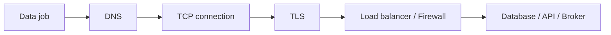

# 32 Networking Basics

## 1. Introduction

Data Engineer không cần thành network engineer, nhưng phải hiểu đủ để debug API timeout, database connection failure, Kafka lag do network, private endpoint, DNS, firewall, TLS, proxy và bandwidth bottleneck. Senior khác junior ở chỗ biết khoanh vùng lỗi network có hệ thống.



## 2. Theory

Khái niệm cốt lõi:

- IP address: định danh host.
- Port: định danh service trên host.
- DNS: phân giải hostname thành IP.
- TCP: kết nối tin cậy.
- TLS: mã hóa transport.
- Firewall/security group: cho phép hoặc chặn traffic.
- NAT/proxy: trung gian outbound.
- Latency: độ trễ.
- Bandwidth: băng thông.
- Throughput: lượng data truyền thực tế.

Beginner cần hiểu host/port/DNS. Mid cần debug timeout/refused/TLS. Senior cần thiết kế network path an toàn, riêng tư, scalable, observable.

## 3. Real-world example

Bài toán: Airflow task kết nối warehouse thất bại chỉ ở production.

Triệu chứng:

- Dev kết nối được.
- Prod báo connection timeout.
- Credential đúng.

Root cause: security group của warehouse chỉ allow subnet cũ, Airflow worker mới nằm trong subnet khác.

Fix:

- Cập nhật allowlist theo subnet production.
- Tạo private endpoint thay vì public IP.
- Thêm connection test trong deployment.
- Monitor connection failure rate.

## 4. SQL example

SQL giúp xác nhận lỗi là network hay database-level.

### PostgreSQL: xem session đang kết nối

```sql
SELECT
    client_addr,
    usename,
    datname,
    state,
    COUNT(*) AS connection_count
FROM pg_stat_activity
GROUP BY client_addr, usename, datname, state
ORDER BY connection_count DESC;
```

### Oracle: xem session và machine

```sql
SELECT
    machine,
    username,
    status,
    COUNT(*) AS connection_count
FROM v$session
WHERE username IS NOT NULL
GROUP BY machine, username, status
ORDER BY connection_count DESC;
```

### PostgreSQL: kiểm tra connection saturation

```sql
SELECT
    COUNT(*) AS current_connections,
    current_setting('max_connections')::int AS max_connections
FROM pg_stat_activity;
```

### Oracle: kiểm tra session limit

```sql
SELECT
    resource_name,
    current_utilization,
    max_utilization,
    limit_value
FROM v$resource_limit
WHERE resource_name IN ('sessions', 'processes');
```

## 5. Python example

Python connection diagnostic đơn giản.

```python
import socket
import ssl


def check_tcp(host: str, port: int, timeout: int = 5) -> None:
    with socket.create_connection((host, port), timeout=timeout):
        print(f"TCP OK: {host}:{port}")


def check_tls(host: str, port: int = 443) -> None:
    context = ssl.create_default_context()
    with socket.create_connection((host, port), timeout=5) as sock:
        with context.wrap_socket(sock, server_hostname=host) as tls_sock:
            cert = tls_sock.getpeercert()
            print(f"TLS OK: {cert.get('subject')}")
```

## 6. Optimization

### Performance optimization

- Dùng connection pooling cho database.
- Batch data transfer thay vì gọi API từng record.
- Compress payload lớn.
- Đặt compute gần data để giảm latency và egress.
- Tránh cross-region transfer nếu không cần.
- Tune timeout theo loại workload, không để timeout vô hạn.

### Cost optimization

- Cross-region egress có thể rất đắt.
- Private link/private endpoint có cost nhưng giảm rủi ro security.
- Cache response API khi hợp lệ.
- Giảm data movement bằng pushdown query vào database/warehouse.

### Monitoring

Theo dõi:

- Connection failure rate.
- DNS resolution failure.
- TLS handshake failure.
- Latency p50/p95/p99.
- Throughput.
- Retry count.
- Database connection count.
- Egress cost.

### Best practices

- Không hardcode IP nếu service có DNS ổn định.
- Dùng private networking cho data nhạy cảm.
- Giới hạn inbound theo subnet/service account.
- Credential đúng không có nghĩa network đúng.
- Có runbook phân biệt timeout, refused, auth failed, TLS failed.

## 7. Common mistakes

### Mistakes

- Nhầm connection refused với credential sai.
- Không set timeout cho API/database client.
- Mở `0.0.0.0/0` cho database production.
- Không dùng connection pool, tạo quá nhiều connection.
- Chạy compute và warehouse khác region.

### Anti-patterns

- Whitelist IP cá nhân cho production pipeline.
- Public database endpoint cho dữ liệu PII.
- Retry vô hạn khi network fail.
- Gửi từng dòng qua network thay vì batch.
- Không monitor egress cost.

### Incident scenario

API ingestion chậm gấp 10 lần:

1. Kiểm tra latency từ worker đến API.
2. Kiểm tra retry và status code.
3. Kiểm tra DNS hoặc proxy thay đổi.
4. Kiểm tra payload size và compression.
5. Kiểm tra region của worker.

## 8. Interview questions

### Junior

- DNS là gì?
- Port là gì?
- Timeout khác connection refused thế nào?
- TLS dùng để làm gì?

### Mid

- Debug database connection timeout như thế nào?
- Connection pooling là gì?
- Vì sao cross-region data transfer có vấn đề?
- Security group/firewall ảnh hưởng pipeline thế nào?

### Senior

- Thiết kế network path an toàn cho ingestion PII.
- Làm sao giảm egress cost cho data platform?
- Debug intermittent network failures trong streaming pipeline.
- Thiết kế connection pool cho multi-tenant warehouse ra sao?

## 9. Exercises

1. Viết Python check TCP cho PostgreSQL và Oracle port.
2. Query PostgreSQL/Oracle để xem active sessions.
3. Thiết kế network diagram cho Airflow -> warehouse -> object storage.
4. Tạo runbook phân biệt timeout, refused, auth failed.
5. Tính cost khi transfer 10TB cross-region mỗi ngày.
6. Thiết kế monitoring network cho API ingestion.

## 10. Checklist

- [ ] Host, port, DNS được document.
- [ ] Timeout được cấu hình.
- [ ] Có connection pooling.
- [ ] Database không public không cần thiết.
- [ ] Firewall/security group theo least privilege.
- [ ] Compute gần data khi có thể.
- [ ] Có monitoring latency, failure, retry, egress.
- [ ] Có runbook network incident.
- [ ] Có TLS cho kết nối nhạy cảm.
