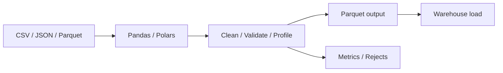

# 33 Advanced Pandas Polars

## 1. Introduction

Pandas và Polars rất hữu ích cho data preparation, validation, profiling, feature engineering nhỏ/vừa. Nhưng senior phải biết giới hạn: khi nào dùng dataframe local, khi nào đẩy logic vào SQL/Spark/warehouse, và làm sao tránh memory blow-up.



## 2. Theory

Pandas:

- Ecosystem lớn, dễ dùng.
- Eager execution.
- Có nhiều API quen thuộc.
- Dễ gặp memory issue với dữ liệu lớn.

Polars:

- Rust engine, nhanh, memory-efficient hơn nhiều case.
- Lazy execution và query optimization.
- Tốt với Parquet và analytical transformations.

Beginner cần biết đọc file, filter, groupby. Mid cần biết join, window, schema, dtype, chunking. Senior cần biết memory model, lazy execution, predicate pushdown, streaming, correctness và production validation.

## 3. Real-world example

Bài toán: nhận file vendor 5GB mỗi ngày, clean và load vào warehouse.

Pipeline:

- Đọc CSV với schema rõ ràng.
- Validate required columns.
- Normalize status/country.
- Dedup theo business key.
- Ghi Parquet partition theo ngày.
- Load vào PostgreSQL/Oracle staging.
- So sánh row count và checksum.

Incident thực tế: pandas tự infer `customer_id` thành integer, làm mất leading zero. Downstream join fail. Fix: khai báo dtype/schema rõ ràng và test null join rate.

## 4. SQL example

Sau khi xử lý bằng dataframe, vẫn cần warehouse validation.

### PostgreSQL: reconcile staging sau load

```sql
SELECT
    load_date,
    COUNT(*) AS row_count,
    COUNT(DISTINCT customer_id) AS distinct_customers,
    SUM(amount) AS total_amount
FROM stg_vendor_orders
GROUP BY load_date
ORDER BY load_date DESC;
```

### Oracle: reconcile staging sau load

```sql
SELECT
    load_date,
    COUNT(*) AS row_count,
    COUNT(DISTINCT customer_id) AS distinct_customers,
    SUM(amount) AS total_amount
FROM stg_vendor_orders
GROUP BY load_date
ORDER BY load_date DESC;
```

### PostgreSQL: kiểm tra leading zero issue

```sql
SELECT COUNT(*) AS suspicious_ids
FROM stg_vendor_orders
WHERE customer_id !~ '^[0-9]{8}$';
```

### Oracle: kiểm tra leading zero issue

```sql
SELECT COUNT(*) AS suspicious_ids
FROM stg_vendor_orders
WHERE NOT REGEXP_LIKE(customer_id, '^[0-9]{8}$');
```

## 5. Python example

### Pandas với dtype rõ ràng

```python
import pandas as pd

df = pd.read_csv(
    "vendor_orders.csv",
    dtype={
        "order_id": "string",
        "customer_id": "string",
        "order_status": "string",
    },
)

df["order_status"] = df["order_status"].str.strip().str.upper()
df = df[df["order_status"].isin(["PENDING", "PAID", "CANCELLED", "REFUNDED"])]
df = df.sort_values(["order_id", "updated_at"]).drop_duplicates("order_id", keep="last")
df.to_parquet("vendor_orders_clean.parquet", index=False)
```

### Polars lazy với predicate pushdown

```python
import polars as pl

valid_statuses = ["PENDING", "PAID", "CANCELLED", "REFUNDED"]

df = (
    pl.scan_csv(
        "vendor_orders.csv",
        schema_overrides={
            "order_id": pl.String,
            "customer_id": pl.String,
            "order_status": pl.String,
        },
    )
    .with_columns(pl.col("order_status").str.strip_chars().str.to_uppercase())
    .filter(pl.col("order_status").is_in(valid_statuses))
    .unique(subset=["order_id"], keep="last")
)

df.sink_parquet("vendor_orders_clean.parquet")
```

## 6. Optimization

### Performance optimization

- Chỉ đọc cột cần thiết.
- Khai báo dtype/schema để tránh inference sai và tốn thời gian.
- Với Polars, dùng lazy API để có predicate/projection pushdown.
- Đọc/ghi Parquet thay CSV khi có thể.
- Tránh `apply` row-by-row trong pandas.
- Chunking hoặc streaming khi dữ liệu gần giới hạn memory.

### Cost optimization

- Xử lý local phù hợp cho GB nhỏ/vừa, không dùng cluster đắt nếu không cần.
- Với dữ liệu lớn, đẩy transformation vào warehouse/Spark để tránh máy local quá lớn.
- Lưu clean Parquet để không parse CSV nhiều lần.
- Compress output.

### Monitoring

Theo dõi:

- Input/output row count.
- Memory peak.
- Runtime.
- Reject count.
- Duplicate count.
- Null rate.
- File size.

### Best practices

- Luôn khai báo schema cho ID dạng string.
- Viết validation trước khi load warehouse.
- Tách transformation function để unit test.
- Profile memory trước khi chạy production.
- Với output critical, reconcile bằng SQL sau load.

## 7. Common mistakes

### Mistakes

- Để pandas tự infer dtype cho ID.
- Dùng `apply` cho logic có thể vectorize.
- Load full file khi chỉ cần vài cột.
- Không kiểm tra memory.
- Ghi CSV thay Parquet cho data analytics lớn.

### Anti-patterns

- Dùng pandas để xử lý trăm GB trên một máy nhỏ.
- Business logic quan trọng chỉ nằm trong notebook.
- Không version notebook/script.
- Không có validation trước khi load vào warehouse.
- Convert qua lại pandas/polars nhiều lần không cần thiết.

### Incident scenario

Job bị OOM:

1. Kiểm tra file size và memory available.
2. Kiểm tra có đọc thừa cột không.
3. Kiểm tra object dtype quá nhiều không.
4. Chuyển sang Polars lazy hoặc chunking.
5. Nếu vẫn lớn, chuyển workload sang distributed engine.

## 8. Interview questions

### Junior

- Pandas DataFrame là gì?
- Đọc CSV và ghi Parquet như thế nào?
- `groupby` dùng để làm gì?
- Vì sao cần khai báo dtype?

### Mid

- Polars lazy execution là gì?
- Predicate pushdown trong Polars có lợi gì?
- Tránh pandas OOM như thế nào?
- Vì sao `apply` chậm?

### Senior

- Khi nào không nên dùng pandas/polars?
- Thiết kế validation cho vendor file 5GB/ngày như thế nào?
- Làm sao đảm bảo dataframe transformation idempotent?
- Debug mismatch row count giữa Parquet và warehouse ra sao?

## 9. Exercises

1. Clean CSV có customer ID leading zero.
2. Viết cùng transformation bằng pandas và polars.
3. Benchmark pandas vs polars trên file lớn.
4. Tạo reject file cho invalid status.
5. Load Parquet vào staging và reconcile bằng SQL.
6. Refactor notebook thành script testable.

## 10. Checklist

- [ ] Schema/dtype được khai báo.
- [ ] Không dùng pandas cho dữ liệu vượt memory an toàn.
- [ ] Chỉ đọc cột cần thiết.
- [ ] Output dùng Parquet nếu phù hợp.
- [ ] Có validation null, duplicate, enum.
- [ ] Có reject records.
- [ ] Có runtime và memory monitoring.
- [ ] Có SQL reconciliation sau load.
- [ ] Logic quan trọng không chỉ nằm trong notebook.
