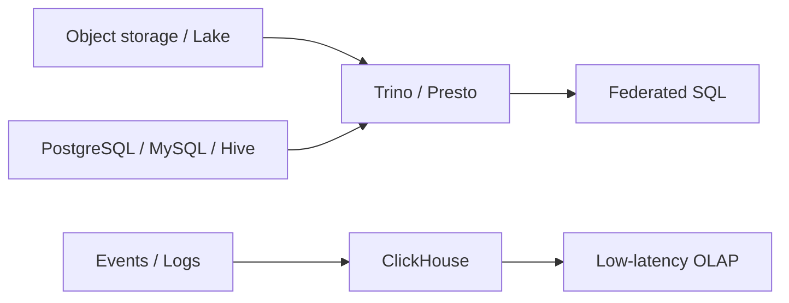

# 34 Trino Presto ClickHouse

## 1. Introduction

Trino/Presto và ClickHouse là các engine analytical mạnh nhưng có triết lý khác nhau. Trino/Presto phù hợp query federation trên data lake và nhiều nguồn. ClickHouse là columnar OLAP database rất nhanh cho event/log/metric analytics. Senior Data Engineer cần biết query pattern, partition, indexing/sorting, join strategy, cost và operational risk.



## 2. Theory

Trino/Presto:

- Distributed SQL query engine.
- Không phải storage engine chính.
- Đọc từ connectors: Hive/Iceberg, PostgreSQL, Kafka, etc.
- Tối ưu phụ thuộc partition, file format, connector pushdown.

ClickHouse:

- Columnar OLAP database.
- Rất mạnh cho scan/aggregate lớn.
- Dùng table engine như MergeTree.
- Tối ưu bằng partition key, order by key, data skipping index, materialized views.

Beginner cần query SQL. Mid cần hiểu partition, file format, join. Senior cần hiểu distributed execution, spill, memory, skew, materialized views, ingestion và cost.

## 3. Real-world example

Bài toán: analytics event platform.

- Raw events lưu Parquet/Iceberg trên object storage.
- Trino query ad hoc và batch marts.
- ClickHouse phục vụ dashboard realtime latency thấp.
- PostgreSQL lưu metadata và user dimension.
- Oracle lưu hệ thống finance legacy.

Incident thực tế: dashboard Trino quét toàn bộ 2 năm event vì thiếu filter partition. Cost tăng mạnh và cluster quá tải. Fix: bắt buộc predicate trên event_date, materialized daily aggregates, query guardrail.

## 4. SQL example

### Trino/Presto: predicate pushdown và partition pruning

```sql
SELECT
    event_date,
    event_name,
    COUNT(*) AS event_count
FROM lake.events
WHERE event_date >= DATE '2026-05-01'
  AND event_date < DATE '2026-05-08'
  AND event_name IN ('purchase_completed', 'checkout_started')
GROUP BY event_date, event_name;
```

### ClickHouse: aggregate event

```sql
SELECT
    toDate(event_time) AS event_date,
    event_name,
    count() AS event_count
FROM events
WHERE event_time >= toDateTime('2026-05-01 00:00:00')
  AND event_time < toDateTime('2026-05-08 00:00:00')
GROUP BY event_date, event_name
ORDER BY event_date, event_name;
```

### PostgreSQL: dimension source

```sql
SELECT
    customer_id,
    country,
    segment
FROM dim_customers
WHERE is_active = TRUE;
```

### Oracle: finance reconciliation

```sql
SELECT
    TRUNC(order_date) AS order_date,
    SUM(amount) AS finance_revenue
FROM finance_orders
WHERE order_date >= DATE '2026-05-01'
GROUP BY TRUNC(order_date);
```

## 5. Python example

Python gọi Trino để chạy quality check.

```python
from trino.dbapi import connect


def fetch_event_count(host: str, user: str) -> int:
    conn = connect(host=host, port=8080, user=user, catalog="lake", schema="default")
    cur = conn.cursor()
    cur.execute("""
        SELECT COUNT(*)
        FROM events
        WHERE event_date = CURRENT_DATE - INTERVAL '1' DAY
    """)
    return cur.fetchone()[0]
```

## 6. Optimization

### Performance optimization

- Với Trino, dùng Parquet/ORC thay CSV/JSON.
- Partition theo cột filter phổ biến như event_date.
- Tránh join lớn qua connector không pushdown tốt.
- Broadcast join dimension nhỏ, tránh shuffle fact lớn nếu có thể.
- Với ClickHouse, chọn `ORDER BY` theo access pattern.
- Dùng materialized views cho aggregate dashboard phổ biến.

### Cost optimization

- Query federation có thể kéo data qua network rất tốn.
- Giảm scanned data bằng partition pruning và column pruning.
- Tạo aggregate tables cho dashboard high-frequency.
- Tránh ad hoc query full history trên cluster shared.
- ClickHouse storage rẻ hơn compute nếu aggregate được reuse nhiều.

### Monitoring

Theo dõi:

- Query runtime.
- Bytes scanned.
- Memory/spill.
- Failed queries.
- Queue time.
- ClickHouse parts count.
- Insert lag.
- Slow query log.

### Best practices

- Bắt buộc filter partition cho bảng event lớn.
- Thiết kế data layout trước khi mở cho analyst.
- Tách workload ad hoc và production.
- Có query limits và resource groups.
- Materialize metric quan trọng thay vì để dashboard tự scan raw.

## 7. Common mistakes

### Mistakes

- Query lake table không filter partition.
- Join fact lớn từ nhiều connector khác nhau.
- Dùng CSV cho analytical lake.
- ClickHouse `ORDER BY` chọn sai, query không tận dụng skipping.
- Quá nhiều small files/parts.

### Anti-patterns

- Xem Trino như database lưu trữ.
- Cho dashboard realtime query raw data lake full scan.
- Không có resource governance cho ad hoc users.
- Đưa mọi workload vào một ClickHouse cluster không phân tầng.
- Không reconcile ClickHouse realtime với source of truth.

### Incident scenario

Trino cluster quá tải:

1. Xem top queries theo bytes scanned.
2. Tìm query thiếu partition predicate.
3. Kill query nếu ảnh hưởng production.
4. Thêm guardrail/resource group.
5. Tạo aggregate table hoặc materialized view.

## 8. Interview questions

### Junior

- Trino/Presto dùng để làm gì?
- ClickHouse là loại database gì?
- Columnar storage có lợi gì?
- Partition pruning là gì?

### Mid

- Trino connector pushdown là gì?
- Chọn partition key cho event table như thế nào?
- ClickHouse `ORDER BY` khác primary key truyền thống ra sao?
- Vì sao small files làm chậm query lake?

### Senior

- Thiết kế lakehouse query layer bằng Trino như thế nào?
- Khi nào dùng ClickHouse thay warehouse truyền thống?
- Giảm cost query federation như thế nào?
- Xử lý incident ClickHouse insert lag hoặc Trino cluster overload ra sao?

## 9. Exercises

1. Viết query Trino có partition pruning cho event table.
2. Thiết kế ClickHouse table cho clickstream.
3. Tạo daily aggregate table cho dashboard.
4. So sánh query raw events và aggregate events.
5. Viết checklist chống full scan.
6. Thiết kế monitoring cho Trino và ClickHouse.

## 10. Checklist

- [ ] Table lớn có partition strategy.
- [ ] File format columnar.
- [ ] Query production có partition predicate.
- [ ] Có resource governance.
- [ ] Có monitoring runtime, scan, spill, failure.
- [ ] ClickHouse order key phù hợp query pattern.
- [ ] Có aggregate/materialized view cho dashboard phổ biến.
- [ ] Có reconciliation với source of truth.
- [ ] Có incident playbook cho overload và insert lag.
