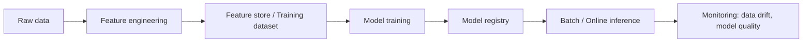

# 35 MLOps Fundamentals

## 1. Introduction

Data Engineer không nhất thiết phải là ML Engineer, nhưng senior Data Engineer thường phải hỗ trợ feature pipelines, training data, batch inference, model monitoring, data quality và lineage. MLOps là cách đưa ML vào production có kiểm soát.



## 2. Theory

Khái niệm chính:

- Feature: biến đầu vào cho model.
- Training dataset: snapshot dữ liệu dùng huấn luyện.
- Label: target cần dự đoán.
- Feature store: nơi quản lý feature reusable.
- Model registry: nơi version model.
- Batch inference: dự đoán theo lô.
- Online inference: dự đoán realtime.
- Data drift: phân phối dữ liệu thay đổi.
- Concept drift: quan hệ feature-label thay đổi.

Beginner cần hiểu feature và training data. Mid cần xây batch feature pipeline. Senior cần point-in-time correctness, leakage prevention, monitoring, rollback và governance.

## 3. Real-world example

Bài toán: model dự đoán customer churn.

Data Engineering responsibilities:

- Xây feature table theo ngày.
- Đảm bảo point-in-time correctness: không dùng data tương lai.
- Tạo training dataset có label rõ.
- Chạy batch inference hằng ngày.
- Ghi prediction vào warehouse.
- Monitor feature null rate, drift, prediction distribution.

Incident thực tế: feature `total_orders_next_30d` vô tình dùng dữ liệu sau ngày dự đoán, làm offline AUC rất cao nhưng production performance kém. Fix: point-in-time join, feature cutoff timestamp, leakage tests.

## 4. SQL example

### PostgreSQL: feature point-in-time

```sql
SELECT
    c.customer_id,
    d.snapshot_date,
    COUNT(o.order_id) AS orders_last_30d,
    COALESCE(SUM(o.amount), 0) AS revenue_last_30d
FROM customer_snapshots d
JOIN dim_customers c
  ON c.created_at <= d.snapshot_date
LEFT JOIN fact_orders o
  ON o.customer_id = c.customer_id
 AND o.order_date >= d.snapshot_date - INTERVAL '30 days'
 AND o.order_date < d.snapshot_date
GROUP BY c.customer_id, d.snapshot_date;
```

### Oracle: feature point-in-time

```sql
SELECT
    c.customer_id,
    d.snapshot_date,
    COUNT(o.order_id) AS orders_last_30d,
    COALESCE(SUM(o.amount), 0) AS revenue_last_30d
FROM customer_snapshots d
JOIN dim_customers c
  ON c.created_at <= d.snapshot_date
LEFT JOIN fact_orders o
  ON o.customer_id = c.customer_id
 AND o.order_date >= d.snapshot_date - INTERVAL '30' DAY
 AND o.order_date < d.snapshot_date
GROUP BY c.customer_id, d.snapshot_date;
```

### PostgreSQL: prediction monitoring

```sql
SELECT
    prediction_date,
    COUNT(*) AS scored_customers,
    AVG(churn_score) AS avg_score,
    SUM(CASE WHEN churn_score >= 0.8 THEN 1 ELSE 0 END) AS high_risk_customers
FROM churn_predictions
GROUP BY prediction_date
ORDER BY prediction_date DESC;
```

### Oracle: prediction monitoring

```sql
SELECT
    prediction_date,
    COUNT(*) AS scored_customers,
    AVG(churn_score) AS avg_score,
    SUM(CASE WHEN churn_score >= 0.8 THEN 1 ELSE 0 END) AS high_risk_customers
FROM churn_predictions
GROUP BY prediction_date
ORDER BY prediction_date DESC;
```

## 5. Python example

Batch inference skeleton.

```python
import logging
import pandas as pd

logger = logging.getLogger(__name__)


def run_batch_inference(model, features_path: str, output_path: str) -> None:
    features = pd.read_parquet(features_path)

    required = {"customer_id", "orders_last_30d", "revenue_last_30d"}
    missing = required - set(features.columns)
    if missing:
        raise ValueError(f"Missing features: {sorted(missing)}")

    scores = model.predict_proba(features[["orders_last_30d", "revenue_last_30d"]])[:, 1]
    output = features[["customer_id"]].copy()
    output["churn_score"] = scores

    output.to_parquet(output_path, index=False)
    logger.info("Batch inference completed rows=%s avg_score=%s", len(output), output["churn_score"].mean())
```

## 6. Optimization

### Performance optimization

- Precompute reusable features.
- Partition feature tables by snapshot date.
- Avoid training dataset full rebuild nếu chỉ cần incremental snapshot.
- Batch inference theo partition.
- Dùng vectorized inference, không score từng row nếu model hỗ trợ batch.
- Cache feature joins đắt tiền.

### Cost optimization

- Feature computation thường tốn hơn model inference.
- Reuse feature tables cho nhiều models.
- Tách training compute và inference compute.
- Downsample cẩn thận cho training exploration, không làm sai production dataset.
- Archive old predictions theo retention.

### Monitoring

Theo dõi:

- Feature freshness.
- Feature null rate.
- Feature distribution drift.
- Prediction count.
- Prediction score distribution.
- Model latency.
- Label availability.
- Model quality khi label về sau.

### Best practices

- Không dùng data tương lai cho feature.
- Version feature definition.
- Lưu training dataset snapshot.
- Có model registry và rollback.
- Monitor data quality trước khi inference.
- Tách offline feature và online feature nếu latency khác nhau.

## 7. Common mistakes

### Mistakes

- Data leakage.
- Training-serving skew.
- Feature null rate tăng nhưng vẫn inference.
- Không version model/features.
- Không lưu training dataset.
- Không có monitoring prediction distribution.

### Anti-patterns

- Notebook training trực tiếp trên production tables không snapshot.
- Feature logic copy-paste giữa training và serving.
- Deploy model không có rollback.
- Chỉ monitor system uptime, không monitor data/model quality.
- Dùng current dimension cho historical training.

### Incident scenario

Churn score trung bình tăng gấp đôi:

1. Kiểm tra feature freshness.
2. Kiểm tra null rate và distribution drift.
3. Kiểm tra model version có đổi không.
4. Kiểm tra upstream schema/status mapping.
5. Rollback model hoặc feature pipeline nếu business impact cao.

## 8. Interview questions

### Junior

- Feature là gì?
- Batch inference là gì?
- Data drift là gì?
- Training dataset gồm những gì?

### Mid

- Data leakage là gì?
- Point-in-time feature join viết như thế nào?
- Feature store giải quyết vấn đề gì?
- Training-serving skew là gì?

### Senior

- Thiết kế feature pipeline cho churn model production.
- Làm sao monitor model quality khi label đến muộn?
- Làm sao rollback model và feature version an toàn?
- Thiết kế governance cho PII trong ML features như thế nào?

## 9. Exercises

1. Viết feature SQL orders_last_30d point-in-time.
2. Tạo training dataset cho churn.
3. Viết batch inference script đọc Parquet và ghi predictions.
4. Thiết kế monitoring feature null rate và prediction drift.
5. Tìm ví dụ data leakage trong feature list.
6. Thiết kế rollback plan cho model deployment.

## 10. Checklist

- [ ] Feature definition được version.
- [ ] Point-in-time correctness được đảm bảo.
- [ ] Không có data leakage.
- [ ] Training dataset được snapshot.
- [ ] Model version được lưu.
- [ ] Batch inference idempotent.
- [ ] Có monitoring feature freshness/null/drift.
- [ ] Có monitoring prediction distribution.
- [ ] Có rollback plan.
- [ ] PII trong features được kiểm soát.
