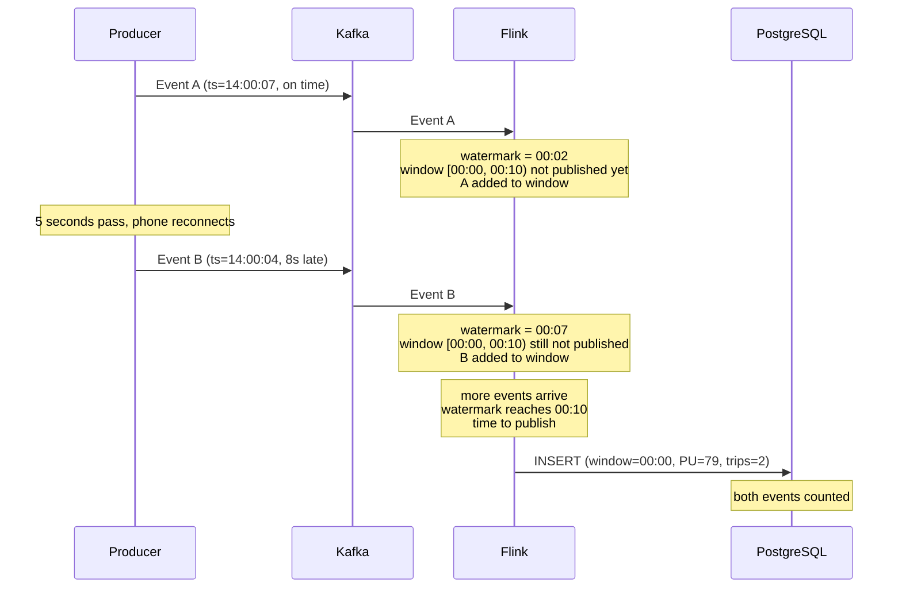
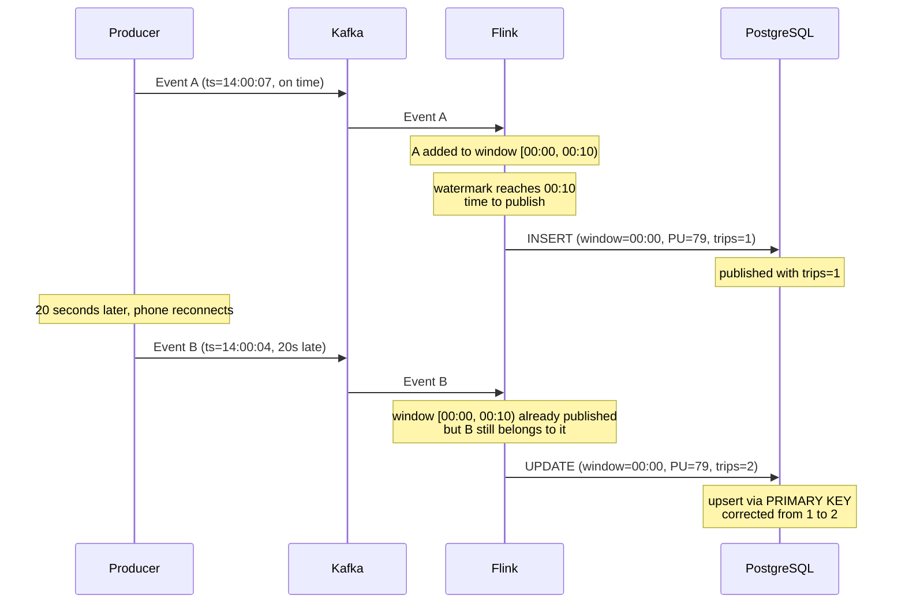

# repo_notes_M07 - Module 07 Streaming

Nguồn: `data-engineering-zoomcamp/07-streaming/`. File này đọc và gom lại toàn bộ file được liệt kê trong prompt, với phân tích theo flow thực tế và appendix nội dung nguyên văn.

## 1. CẤU TRÚC THƯ MỤC

```text
.gitignore
extras
extras\ksqldb
extras\ksqldb\commands.md
extras\pyflink
extras\pyflink\.gitignore
extras\pyflink\docker-compose.yml
extras\pyflink\Dockerfile.flink
extras\pyflink\homework.md
extras\pyflink\LICENSE
extras\pyflink\Makefile
extras\pyflink\README.md
extras\pyflink\requirements.txt
extras\pyflink\src
extras\pyflink\src\job
extras\pyflink\src\job\aggregation_job.py
extras\pyflink\src\job\start_job.py
extras\pyflink\src\job\taxi_job.py
extras\pyflink\src\producers
extras\pyflink\src\producers\load_taxi_data.py
extras\pyflink\src\producers\producer.py
extras\python
extras\python\avro_example
extras\python\avro_example\consumer.py
extras\python\avro_example\producer.py
extras\python\avro_example\ride_record.py
extras\python\avro_example\ride_record_key.py
extras\python\avro_example\settings.py
extras\python\docker
extras\python\docker\docker-compose.yml
extras\python\docker\kafka
extras\python\docker\kafka\docker-compose.yml
extras\python\docker\README.md
extras\python\docker\spark
extras\python\docker\spark\build.sh
extras\python\docker\spark\cluster-base.Dockerfile
extras\python\docker\spark\docker-compose.yml
extras\python\docker\spark\jupyterlab.Dockerfile
extras\python\docker\spark\spark-base.Dockerfile
extras\python\docker\spark\spark-master.Dockerfile
extras\python\docker\spark\spark-worker.Dockerfile
extras\python\json_example
extras\python\json_example\consumer.py
extras\python\json_example\producer.py
extras\python\json_example\ride.py
extras\python\json_example\settings.py
extras\python\README.md
extras\python\redpanda_example
extras\python\redpanda_example\consumer.py
extras\python\redpanda_example\docker-compose.yaml
extras\python\redpanda_example\producer.py
extras\python\redpanda_example\README.md
extras\python\redpanda_example\ride.py
extras\python\redpanda_example\settings.py
extras\python\requirements.txt
extras\python\resources
extras\python\resources\schemas
extras\python\resources\schemas\taxi_ride_key.avsc
extras\python\resources\schemas\taxi_ride_value.avsc
extras\python\streams-example
extras\python\streams-example\faust
extras\python\streams-example\faust\branch_price.py
extras\python\streams-example\faust\producer_taxi_json.py
extras\python\streams-example\faust\stream.py
extras\python\streams-example\faust\stream_count_vendor_trips.py
extras\python\streams-example\faust\taxi_rides.py
extras\python\streams-example\faust\windowing.py
extras\python\streams-example\pyspark
extras\python\streams-example\pyspark\consumer.py
extras\python\streams-example\pyspark\producer.py
extras\python\streams-example\pyspark\README.md
extras\python\streams-example\pyspark\settings.py
extras\python\streams-example\pyspark\spark-submit.sh
extras\python\streams-example\pyspark\streaming.py
extras\python\streams-example\pyspark\streaming-notebook.ipynb
extras\python\streams-example\redpanda
extras\python\streams-example\redpanda\consumer.py
extras\python\streams-example\redpanda\docker-compose.yaml
extras\python\streams-example\redpanda\producer.py
extras\python\streams-example\redpanda\README.md
extras\python\streams-example\redpanda\settings.py
extras\python\streams-example\redpanda\spark-submit.sh
extras\python\streams-example\redpanda\streaming.py
extras\python\streams-example\redpanda\streaming-notebook.ipynb
extras\README.md
README.md
theory
theory\java
theory\java\kafka_examples
theory\java\kafka_examples\.gitignore
theory\java\kafka_examples\build
theory\java\kafka_examples\build.gradle
theory\java\kafka_examples\build\generated-main-avro-java
theory\java\kafka_examples\build\generated-main-avro-java\schemaregistry
theory\java\kafka_examples\build\generated-main-avro-java\schemaregistry\RideRecord.java
theory\java\kafka_examples\build\generated-main-avro-java\schemaregistry\RideRecordCompatible.java
theory\java\kafka_examples\build\generated-main-avro-java\schemaregistry\RideRecordNoneCompatible.java
theory\java\kafka_examples\gradle
theory\java\kafka_examples\gradle\wrapper
theory\java\kafka_examples\gradle\wrapper\gradle-wrapper.jar
theory\java\kafka_examples\gradle\wrapper\gradle-wrapper.properties
theory\java\kafka_examples\gradlew
theory\java\kafka_examples\gradlew.bat
theory\java\kafka_examples\settings.gradle
theory\java\kafka_examples\src
theory\java\kafka_examples\src\main
theory\java\kafka_examples\src\main\avro
theory\java\kafka_examples\src\main\avro\rides.avsc
theory\java\kafka_examples\src\main\avro\rides_compatible.avsc
theory\java\kafka_examples\src\main\avro\rides_non_compatible.avsc
theory\java\kafka_examples\src\main\java
theory\java\kafka_examples\src\main\java\org
theory\java\kafka_examples\src\main\java\org\example
theory\java\kafka_examples\src\main\java\org\example\AvroProducer.java
theory\java\kafka_examples\src\main\java\org\example\customserdes
theory\java\kafka_examples\src\main\java\org\example\customserdes\CustomSerdes.java
theory\java\kafka_examples\src\main\java\org\example\data
theory\java\kafka_examples\src\main\java\org\example\data\PickupLocation.java
theory\java\kafka_examples\src\main\java\org\example\data\Ride.java
theory\java\kafka_examples\src\main\java\org\example\data\VendorInfo.java
theory\java\kafka_examples\src\main\java\org\example\JsonConsumer.java
theory\java\kafka_examples\src\main\java\org\example\JsonKStream.java
theory\java\kafka_examples\src\main\java\org\example\JsonKStreamJoins.java
theory\java\kafka_examples\src\main\java\org\example\JsonKStreamWindow.java
theory\java\kafka_examples\src\main\java\org\example\JsonProducer.java
theory\java\kafka_examples\src\main\java\org\example\JsonProducerPickupLocation.java
theory\java\kafka_examples\src\main\java\org\example\Secrets.java
theory\java\kafka_examples\src\main\java\org\example\Topics.java
theory\java\kafka_examples\src\main\resources
theory\java\kafka_examples\src\main\resources\rides.csv
theory\java\kafka_examples\src\test
theory\java\kafka_examples\src\test\java
theory\java\kafka_examples\src\test\java\org
theory\java\kafka_examples\src\test\java\org\example
theory\java\kafka_examples\src\test\java\org\example\helper
theory\java\kafka_examples\src\test\java\org\example\helper\DataGeneratorHelper.java
theory\java\kafka_examples\src\test\java\org\example\JsonKStreamJoinsTest.java
theory\java\kafka_examples\src\test\java\org\example\JsonKStreamTest.java
theory\README.md
workshop
workshop\.python-version
workshop\docker-compose.yml
workshop\Dockerfile.flink
workshop\Dockerfile_ARM64.flink
workshop\flink-config.yaml
workshop\live
workshop\live\.gitignore
workshop\live\.python-version
workshop\live\docker-compose.yaml
workshop\live\Dockerfile.flink
workshop\live\flink-config.yaml
workshop\live\main.py
workshop\live\notebooks
workshop\live\notebooks\consumer_db.ipynb
workshop\live\notebooks\models.py
workshop\live\notebooks\producer.ipynb
workshop\live\pyproject.flink.toml
workshop\live\pyproject.toml
workshop\live\README.md
workshop\live\src
workshop\live\src\job
workshop\live\src\job\aggregation_job.py
workshop\live\src\job\pass_through_job.py
workshop\live\src\producers
workshop\live\src\producers\models.py
workshop\live\src\producers\producer_realtime.py
workshop\live\uv.lock
workshop\Makefile
workshop\pyproject.flink.toml
workshop\pyproject.toml
workshop\README.md
workshop\src
workshop\src\consumers
workshop\src\consumers\consumer.py
workshop\src\consumers\consumer_postgres.py
workshop\src\job
workshop\src\job\aggregation_job.py
workshop\src\job\aggregation_job_demo.py
workshop\src\job\pass_through_job.py
workshop\src\models.py
workshop\src\producers
workshop\src\producers\producer.py
workshop\src\producers\producer_realtime.py
workshop\uv.lock
```

### Mục đích các nhóm chính
- `workshop/`: workshop chính cho pipeline `Python producer -> Redpanda(Kafka API) -> PyFlink -> PostgreSQL`, có Docker Compose, Flink image, job pass-through và aggregation.
- `workshop/live/`: bản code live/demo tương tự workshop, có notebook producer/consumer và job PyFlink được tạo trong buổi live.
- `extras/python/`: ví dụ bổ sung cho producer/consumer JSON, Avro, Redpanda, Faust và Spark Structured Streaming.
- `extras/pyflink/`: bài tập/ví dụ PyFlink cũ, dùng Kafka-compatible broker và Table API/DataStream API.
- `extras/ksqldb/`: tập lệnh ksqlDB để tạo stream/table/query.
- `theory/java/kafka_examples/`: project Java Gradle cho Kafka producer/consumer, Kafka Streams, Avro schema compatibility và topology tests.

### Mục đích từng file
- $f: Tài liệu hoặc metadata của module streaming.
- $f: Tài liệu hoặc metadata của module streaming.
- $f: Config và tài liệu cho pipeline Producer -> Redpanda -> Flink -> PostgreSQL.
- $f: Config và tài liệu cho pipeline Producer -> Redpanda -> Flink -> PostgreSQL.
- $f: Config và tài liệu cho pipeline Producer -> Redpanda -> Flink -> PostgreSQL.
- $f: Config và tài liệu cho pipeline Producer -> Redpanda -> Flink -> PostgreSQL.
- $f: Config và tài liệu cho pipeline Producer -> Redpanda -> Flink -> PostgreSQL.
- $f: Config và tài liệu cho pipeline Producer -> Redpanda -> Flink -> PostgreSQL.
- $f: Config và tài liệu cho pipeline Producer -> Redpanda -> Flink -> PostgreSQL.
- $f: Config và tài liệu cho pipeline Producer -> Redpanda -> Flink -> PostgreSQL.
- $f: Config và tài liệu cho pipeline Producer -> Redpanda -> Flink -> PostgreSQL.
- $f: Config và tài liệu cho pipeline Producer -> Redpanda -> Flink -> PostgreSQL.
- $f: Config và tài liệu cho pipeline Producer -> Redpanda -> Flink -> PostgreSQL.
- $f: Producer Python ghi taxi rides vào topic Kafka/Redpanda.
- $f: Producer Python ghi taxi rides vào topic Kafka/Redpanda.
- $f: Consumer Python đọc rides từ broker, in ra console hoặc ghi PostgreSQL.
- $f: Consumer Python đọc rides từ broker, in ra console hoặc ghi PostgreSQL.
- $f: PyFlink job đọc Kafka/Redpanda và ghi/aggregate dữ liệu sang PostgreSQL hoặc log.
- $f: PyFlink job đọc Kafka/Redpanda và ghi/aggregate dữ liệu sang PostgreSQL hoặc log.
- $f: PyFlink job đọc Kafka/Redpanda và ghi/aggregate dữ liệu sang PostgreSQL hoặc log.
- $f: Biến thể live/demo của workshop PyFlink: producer realtime, Flink jobs, notebooks và config Docker.
- $f: Biến thể live/demo của workshop PyFlink: producer realtime, Flink jobs, notebooks và config Docker.
- $f: Biến thể live/demo của workshop PyFlink: producer realtime, Flink jobs, notebooks và config Docker.
- $f: Biến thể live/demo của workshop PyFlink: producer realtime, Flink jobs, notebooks và config Docker.
- $f: Biến thể live/demo của workshop PyFlink: producer realtime, Flink jobs, notebooks và config Docker.
- $f: Biến thể live/demo của workshop PyFlink: producer realtime, Flink jobs, notebooks và config Docker.
- $f: Biến thể live/demo của workshop PyFlink: producer realtime, Flink jobs, notebooks và config Docker.
- $f: Biến thể live/demo của workshop PyFlink: producer realtime, Flink jobs, notebooks và config Docker.
- $f: Biến thể live/demo của workshop PyFlink: producer realtime, Flink jobs, notebooks và config Docker.
- $f: Biến thể live/demo của workshop PyFlink: producer realtime, Flink jobs, notebooks và config Docker.
- $f: Biến thể live/demo của workshop PyFlink: producer realtime, Flink jobs, notebooks và config Docker.
- $f: Biến thể live/demo của workshop PyFlink: producer realtime, Flink jobs, notebooks và config Docker.
- $f: Biến thể live/demo của workshop PyFlink: producer realtime, Flink jobs, notebooks và config Docker.
- $f: Biến thể live/demo của workshop PyFlink: producer realtime, Flink jobs, notebooks và config Docker.
- $f: Biến thể live/demo của workshop PyFlink: producer realtime, Flink jobs, notebooks và config Docker.
- $f: Biến thể live/demo của workshop PyFlink: producer realtime, Flink jobs, notebooks và config Docker.
- $f: Biến thể live/demo của workshop PyFlink: producer realtime, Flink jobs, notebooks và config Docker.
- $f: Tài liệu hoặc metadata của module streaming.
- $f: Lệnh ksqlDB cho stream/table processing.
- $f: Ví dụ PyFlink cũ: producer taxi data và job Table API/DataStream API.
- $f: Ví dụ PyFlink cũ: producer taxi data và job Table API/DataStream API.
- $f: Ví dụ PyFlink cũ: producer taxi data và job Table API/DataStream API.
- $f: Ví dụ PyFlink cũ: producer taxi data và job Table API/DataStream API.
- $f: Ví dụ PyFlink cũ: producer taxi data và job Table API/DataStream API.
- $f: Ví dụ PyFlink cũ: producer taxi data và job Table API/DataStream API.
- $f: Ví dụ PyFlink cũ: producer taxi data và job Table API/DataStream API.
- $f: Ví dụ PyFlink cũ: producer taxi data và job Table API/DataStream API.
- $f: Ví dụ PyFlink cũ: producer taxi data và job Table API/DataStream API.
- $f: Ví dụ PyFlink cũ: producer taxi data và job Table API/DataStream API.
- $f: Ví dụ PyFlink cũ: producer taxi data và job Table API/DataStream API.
- $f: Ví dụ PyFlink cũ: producer taxi data và job Table API/DataStream API.
- $f: Ví dụ PyFlink cũ: producer taxi data và job Table API/DataStream API.
- $f: Tài liệu hoặc metadata của module streaming.
- $f: Tài liệu hoặc metadata của module streaming.
- $f: Ví dụ Kafka producer/consumer serialize JSON bằng Python.
- $f: Ví dụ Kafka producer/consumer serialize JSON bằng Python.
- $f: Ví dụ Kafka producer/consumer serialize JSON bằng Python.
- $f: Ví dụ Kafka producer/consumer serialize JSON bằng Python.
- $f: Ví dụ Kafka producer/consumer dùng Avro và schema key/value.
- $f: Ví dụ Kafka producer/consumer dùng Avro và schema key/value.
- $f: Ví dụ Kafka producer/consumer dùng Avro và schema key/value.
- $f: Ví dụ Kafka producer/consumer dùng Avro và schema key/value.
- $f: Ví dụ Kafka producer/consumer dùng Avro và schema key/value.
- $f: Ví dụ producer/consumer với Redpanda local.
- $f: Ví dụ producer/consumer với Redpanda local.
- $f: Ví dụ producer/consumer với Redpanda local.
- $f: Ví dụ producer/consumer với Redpanda local.
- $f: Ví dụ producer/consumer với Redpanda local.
- $f: Ví dụ producer/consumer với Redpanda local.
- $f: Docker compose/Dockerfile cho Kafka và Spark local.
- $f: Docker compose/Dockerfile cho Kafka và Spark local.
- $f: Docker compose/Dockerfile cho Kafka và Spark local.
- $f: Docker compose/Dockerfile cho Kafka và Spark local.
- $f: Docker compose/Dockerfile cho Kafka và Spark local.
- $f: Docker compose/Dockerfile cho Kafka và Spark local.
- $f: Docker compose/Dockerfile cho Kafka và Spark local.
- $f: Docker compose/Dockerfile cho Kafka và Spark local.
- $f: Docker compose/Dockerfile cho Kafka và Spark local.
- $f: Docker compose/Dockerfile cho Kafka và Spark local.
- $f: Tài liệu hoặc metadata của module streaming.
- $f: Tài liệu hoặc metadata của module streaming.
- $f: Ví dụ stream processing bằng Faust: branch, count, window.
- $f: Ví dụ stream processing bằng Faust: branch, count, window.
- $f: Ví dụ stream processing bằng Faust: branch, count, window.
- $f: Ví dụ stream processing bằng Faust: branch, count, window.
- $f: Ví dụ stream processing bằng Faust: branch, count, window.
- $f: Ví dụ stream processing bằng Faust: branch, count, window.
- $f: Ví dụ Spark Structured Streaming đọc Kafka và xử lý taxi rides.
- $f: Ví dụ Spark Structured Streaming đọc Kafka và xử lý taxi rides.
- $f: Ví dụ Spark Structured Streaming đọc Kafka và xử lý taxi rides.
- $f: Ví dụ Spark Structured Streaming đọc Kafka và xử lý taxi rides.
- $f: Ví dụ Spark Structured Streaming đọc Kafka và xử lý taxi rides.
- $f: Ví dụ Spark Structured Streaming đọc Kafka và xử lý taxi rides.
- $f: Ví dụ Spark Structured Streaming đọc Kafka và xử lý taxi rides.
- $f: Ví dụ Spark Structured Streaming với Redpanda.
- $f: Ví dụ Spark Structured Streaming với Redpanda.
- $f: Ví dụ Spark Structured Streaming với Redpanda.
- $f: Ví dụ Spark Structured Streaming với Redpanda.
- $f: Ví dụ Spark Structured Streaming với Redpanda.
- $f: Ví dụ Spark Structured Streaming với Redpanda.
- $f: Ví dụ Spark Structured Streaming với Redpanda.
- $f: Ví dụ Spark Structured Streaming với Redpanda.
- $f: Kafka theory và Java Gradle project.
- $f: Kafka theory và Java Gradle project.
- $f: Kafka theory và Java Gradle project.
- $f: Kafka theory và Java Gradle project.
- $f: Kafka theory và Java Gradle project.
- $f: Kafka theory và Java Gradle project.
- $f: Kafka theory và Java Gradle project.
- $f: Kafka theory và Java Gradle project.
- $f: Avro schema dùng để minh họa schema compatibility.
- $f: Avro schema dùng để minh họa schema compatibility.
- $f: Avro schema dùng để minh họa schema compatibility.
- $f: Kafka theory và Java Gradle project.
- $f: Java Kafka/Kafka Streams example: producer, consumer, topology, serde hoặc model.
- $f: Java Kafka/Kafka Streams example: producer, consumer, topology, serde hoặc model.
- $f: Java Kafka/Kafka Streams example: producer, consumer, topology, serde hoặc model.
- $f: Java Kafka/Kafka Streams example: producer, consumer, topology, serde hoặc model.
- $f: Java Kafka/Kafka Streams example: producer, consumer, topology, serde hoặc model.
- $f: Java Kafka/Kafka Streams example: producer, consumer, topology, serde hoặc model.
- $f: Java Kafka/Kafka Streams example: producer, consumer, topology, serde hoặc model.
- $f: Java Kafka/Kafka Streams example: producer, consumer, topology, serde hoặc model.
- $f: Java Kafka/Kafka Streams example: producer, consumer, topology, serde hoặc model.
- $f: Java Kafka/Kafka Streams example: producer, consumer, topology, serde hoặc model.
- $f: Java Kafka/Kafka Streams example: producer, consumer, topology, serde hoặc model.
- $f: Java Kafka/Kafka Streams example: producer, consumer, topology, serde hoặc model.
- $f: Java Kafka/Kafka Streams example: producer, consumer, topology, serde hoặc model.
- $f: Test Kafka Streams topology bằng TopologyTestDriver.
- $f: Test Kafka Streams topology bằng TopologyTestDriver.
- $f: Test Kafka Streams topology bằng TopologyTestDriver.
- $f: Java class generated từ Avro schema.
- $f: Java class generated từ Avro schema.
- $f: Java class generated từ Avro schema.

## 2. NỘI DUNG CÁC FILE .MD

### README.md
- Dạy về: entrypoint module 7, link video, phân nhánh workshop/homework/theory/extras.
- Concepts chính: stream processing, PyFlink workshop, Kafka theory, extras.
- Commands được dùng: không có command chạy trực tiếp trong root README.
- Services/tools liên quan: PyFlink, Redpanda/Kafka, Java Kafka examples.
- Lưu ý đặc biệt: module chính nằm ở `workshop/`; `theory/` và `extras/` là optional.

### workshop/README.md
- Dạy về: build pipeline realtime từ đầu với producer Python, Redpanda, consumer, PostgreSQL và PyFlink.
- Concepts chính: Kafka-compatible broker, advertised listeners, producer/consumer, serialization JSON, consumer group/offset, Flink JobManager/TaskManager, Table API, Kafka source, JDBC sink, watermark, tumbling/sliding/session windows, checkpointing, late events, upsert sink.
- Commands được dùng: `docker compose up`, `uv init`, `uv add`, `uv sync`, `uv run python ...`, `docker compose exec postgres psql ...`, `docker compose exec jobmanager ./bin/flink run ...`, `docker compose down`.
- Services/tools liên quan: Redpanda, Kafka API, Python, PyFlink, PostgreSQL, Docker Compose, uv, pgcli/psql.
- Lưu ý đặc biệt: đây là tài liệu dài nhất, giải thích kỹ offset startup mode, watermark và trade-off streaming vs micro-batch.

### workshop/live/README.md
- Dạy về: placeholder ngắn cho bản live.
- Concepts chính: live workshop code.
- Commands được dùng: không có.
- Services/tools liên quan: cùng stack với workshop.
- Lưu ý đặc biệt: nội dung chính nằm trong code và notebook.

### extras/README.md
- Dạy về: các ví dụ bổ sung ngoài workshop chính.
- Concepts chính: Kafka theory, Python Kafka examples, PyFlink, ksqlDB.
- Commands được dùng: trỏ sang README con.
- Services/tools liên quan: Kafka, Redpanda, PyFlink, ksqlDB, Spark/Faust.
- Lưu ý đặc biệt: thư mục optional, nhiều code từ các năm trước.

### extras/ksqldb/commands.md
- Dạy về: các lệnh ksqlDB tạo stream/table và query dữ liệu taxi.
- Concepts chính: stream, table, aggregation, schema, topic.
- Commands được dùng: lệnh ksqlDB `CREATE STREAM`, `CREATE TABLE`, `SELECT`.
- Services/tools liên quan: ksqlDB, Kafka topics.
- Lưu ý đặc biệt: dùng để hiểu SQL layer trên stream.

### extras/pyflink/README.md và homework.md
- Dạy về: chạy PyFlink jobs, producer data và bài tập streaming.
- Concepts chính: Kafka source, PyFlink Table API, tumbling windows, aggregation, Dockerized Flink cluster.
- Commands được dùng: `docker compose up`, `make`, `flink run`, Python producer commands.
- Services/tools liên quan: Kafka/Redpanda, PyFlink, Docker Compose.
- Lưu ý đặc biệt: có Makefile và Dockerfile riêng, không hoàn toàn giống workshop chính.

### extras/python/README.md và docker/README.md
- Dạy về: ví dụ Kafka với Python, cách chạy docker local cho Kafka/Spark.
- Concepts chính: producer, consumer, JSON/Avro serialization, local infrastructure.
- Commands được dùng: `docker compose up`, Python scripts, Spark submit.
- Services/tools liên quan: Kafka, Redpanda, Spark, Python clients.
- Lưu ý đặc biệt: thư mục `docker/` cung cấp compose và Dockerfile hỗ trợ ví dụ Spark.

### extras/python/redpanda_example/README.md
- Dạy về: chạy Redpanda và producer/consumer Python.
- Concepts chính: broker compatible Kafka, topic, producer/consumer loop.
- Commands được dùng: `docker compose up`, Python producer/consumer.
- Services/tools liên quan: Redpanda, kafka-python.
- Lưu ý đặc biệt: ví dụ nhỏ hơn workshop chính.

### extras/python/streams-example/pyspark/README.md và redpanda/README.md
- Dạy về: Spark Structured Streaming đọc stream taxi từ Kafka/Redpanda.
- Concepts chính: streaming dataframe, Kafka source, JSON parsing, output sink, checkpoint.
- Commands được dùng: `spark-submit.sh`, Docker compose commands.
- Services/tools liên quan: Spark, Kafka/Redpanda, Python.
- Lưu ý đặc biệt: notebook được tóm tắt theo cell ở appendix.

### theory/README.md
- Dạy về: Kafka theory bằng Java examples.
- Concepts chính: producer, consumer, Kafka Streams, stream-table, joins, windows, Avro, schema compatibility, tests.
- Commands được dùng: Gradle wrapper commands và Java run/test commands theo project.
- Services/tools liên quan: Kafka, Schema Registry, Gradle, Java, Kafka Streams.
- Lưu ý đặc biệt: optional nhưng quan trọng để hiểu Kafka internals/API ở mức thấp hơn Python workshop.

## 3. PHÂN TÍCH CODE FILES & CONFIGS

### Docker Compose files
- `workshop/docker-compose.yml` và `workshop/live/docker-compose.yaml` dựng Redpanda, Flink JobManager, Flink TaskManager và PostgreSQL. Redpanda expose cả listener nội bộ `redpanda:29092` và listener ngoài Docker `localhost:9092`. Flink mount source vào `/opt/src` và `/opt/flink/usrlib`, JobManager expose UI `8081`, PostgreSQL dùng user/password/database đều là `postgres`.
- `extras/pyflink/docker-compose.yml` dựng stack PyFlink riêng cho ví dụ cũ.
- `extras/python/docker/*` dựng Kafka/Spark local: Kafka compose, Spark master/worker/Jupyter images.
- `extras/python/redpanda_example/docker-compose.yaml` và `extras/python/streams-example/redpanda/docker-compose.yaml` dùng Redpanda cho ví dụ Python/Spark.

### Dockerfile và Flink/Spark config
- `Dockerfile.flink` bắt đầu từ image Flink, cài Python/PyFlink qua `uv`, thêm connector JAR cho Kafka, JDBC và PostgreSQL, rồi dùng `flink-config.yaml` để tăng memory/metaspace.
- `Dockerfile_ARM64.flink` là biến thể cho ARM64, giữ mục tiêu tương tự nhưng khác cách cài binary/package.
- Spark Dockerfiles trong extras tạo base image, master, worker và JupyterLab để chạy Structured Streaming.
- `flink-config.yaml` cấu hình cluster/runtime memory cho JobManager/TaskManager và hỗ trợ chạy PyFlink ổn định hơn trong Docker.

### Python producer/consumer
- Producer chính đọc NYC yellow taxi parquet, chọn các cột `PULocationID`, `DOLocationID`, `trip_distance`, `total_amount`, `tpep_pickup_datetime`, convert pickup timestamp sang epoch milliseconds rồi ghi topic `rides` dưới dạng JSON.
- Producer realtime sinh events taxi synthetic với timestamp hiện tại và một phần events late để minh họa watermark/upsert.
- Consumer console đọc topic `rides` với `auto_offset_reset=earliest`, group riêng và deserialize JSON thành `Ride` dataclass.
- Consumer PostgreSQL đọc cùng topic với group khác rồi insert vào bảng `processed_events`.

### PyFlink/Flink jobs
- `pass_through_job.py` tạo Kafka source table trên topic `rides`, đọc JSON, convert timestamp và ghi từng event sang JDBC sink `processed_events`.
- `aggregation_job.py` tạo computed column `event_timestamp`, định nghĩa watermark, chạy `TUMBLE` window 1 giờ theo `PULocationID`, rồi upsert kết quả vào `processed_events_aggregated` qua primary key không enforced.
- `aggregation_job_demo.py` là biến thể demo để quan sát aggregation/window behavior.
- Jobs dùng Table API/SQL, bootstrap server nội bộ `redpanda:29092`, checkpointing và parallelism để thể hiện cách Flink quản lý state/offset.

### Python extras
- JSON example serialize dataclass/model taxi ride thành JSON và deserialize ở consumer.
- Avro example dùng schema key/value trong `resources/schemas`, tách key record và value record.
- Faust examples biểu diễn stream DSL: branch theo price, count trips theo vendor, windowing.
- PySpark examples đọc Kafka/Redpanda stream, parse JSON schema và xử lý bằng Structured Streaming.

### Java Kafka/Kafka Streams
- Producer/consumer Java dùng constants trong `Topics.java`, config trong `Secrets.java`, model classes `Ride`, `PickupLocation`, `VendorInfo` và custom Serdes.
- `JsonKStream.java` minh họa topology stream đơn giản; `JsonKStreamJoins.java` join ride stream với pickup location/vendor info; `JsonKStreamWindow.java` minh họa windowed aggregation.
- `AvroProducer.java` dùng generated Avro record và schema registry dependencies trong Gradle để minh họa Avro serialization.
- Tests dùng Kafka Streams `TopologyTestDriver` để chạy topology deterministic không cần Kafka broker thật.

### Avro schemas và generated classes
- `rides.avsc` là schema gốc cho taxi ride.
- `rides_compatible.avsc` thêm/thay đổi field theo hướng compatible nhờ default/nullable strategy.
- `rides_non_compatible.avsc` minh họa thay đổi phá compatibility.
- `build/generated-main-avro-java/...` là Java code sinh từ schema, nên verbose nhưng quan trọng để hiểu Avro codegen.

## 4. DATA FLOW THỰC TẾ

### Workshop flow
1. `docker compose up redpanda -d` khởi động broker Kafka-compatible.
2. `src/producers/producer.py` đọc taxi parquet, convert thành `Ride`, serialize JSON và ghi topic `rides` qua `localhost:9092`.
3. `src/consumers/consumer.py` có thể đọc topic `rides` để kiểm tra dữ liệu.
4. PostgreSQL được khởi động và tạo bảng `processed_events` hoặc `processed_events_aggregated`.
5. Flink JobManager/TaskManager chạy trong Docker, đọc topic qua listener nội bộ `redpanda:29092`.
6. `pass_through_job.py` ghi event raw sang PostgreSQL; `aggregation_job.py` aggregate theo event time/tumbling window rồi upsert PostgreSQL.

### Workshop/live flow
- Tương tự workshop chính nhưng code producer/model nằm trong `workshop/live/src/producers`, notebook mô phỏng producer và consumer DB. `main.py` là entrypoint nhỏ; flow thực nằm ở notebook và jobs.

### extras/python JSON flow
- `json_example/producer.py` tạo taxi ride JSON và ghi Kafka; `json_example/consumer.py` đọc lại và deserialize bằng model/settings cùng thư mục.

### extras/python Avro flow
- Producer dùng `ride_record_key.py`, `ride_record.py` và schema Avro trong `resources/schemas` để encode key/value; consumer decode theo schema tương ứng.

### extras/python Redpanda flow
- Docker Compose khởi động Redpanda; producer ghi rides vào broker; consumer đọc cùng topic qua Kafka API.

### extras/pyflink flow
- Producer/load taxi data tạo input Kafka; PyFlink jobs trong `src/job` đọc stream, xử lý taxi trips và aggregate bằng Table API.

### theory/java Kafka Streams flow
- Java producers ghi JSON/Avro records vào topics; Kafka Streams topologies đọc source topics, transform/join/window aggregate và ghi output topics. Tests dùng generated input records để xác minh output topology.

## 5. ĐIỂM YẾU & THIẾU SÓT
- Security: nhiều config hardcode `localhost:9092`, `redpanda:29092`, database `postgres/postgres`, không dùng secret manager, TLS/SASL hay network isolation.
- Delivery semantics: chưa cấu hình idempotent producer, transactions, exactly-once end-to-end, DLQ hoặc poison-message handling.
- Offset management: demo dùng `earliest-offset`/`latest-offset`; chưa có chiến lược restore từ savepoint/checkpoint khi redeploy production.
- Schema evolution: có Avro examples nhưng workshop chính dùng JSON không có schema registry, không validate contract giữa producer/consumer.
- Flink state/recovery: checkpointing được bật ở một số job nhưng chưa cấu hình durable checkpoint storage, savepoints, restart strategy, state backend production.
- Backpressure/retries: chưa có monitoring backpressure, retry policy, timeout handling, circuit breaker hoặc replay procedure.
- Data quality: thiếu validation range/type/null, deduplication theo event id, late-event policy rõ ràng và reconciliation batch.
- Observability: thiếu Kafka lag dashboard, Flink metrics, Postgres sink metrics, structured logs, tracing và alerting.
- Production readiness: single broker, replication factor thấp/không rõ, không có retention/compaction strategy, không có partition key strategy, không có CI/CD deploy job.
- Testing: Java có topology tests nhưng Python/PyFlink thiếu unit tests, integration tests, Testcontainers và contract tests.
- Senior DE cần bổ sung thiết kế vận hành: capacity planning, incident response, cost model, schema governance, data contracts và rollback plan.

## 6. KIẾN THỨC NGOÀI REPO
- Kafka/Redpanda internals: partition leadership, replication, ISR, controller/KRaft, log segment, retention, compaction, tiered storage, rebalancing cost.
- Producer/consumer advanced: `acks=all`, idempotence, transactions, batching, linger, compression, max in-flight, partitioner, cooperative rebalancing, static membership.
- Schema Registry & Avro: compatibility modes, subject naming strategy, schema references, default values, logical types, Protobuf/JSON Schema trade-offs.
- Kafka Streams: state store/changelog topic, repartition topic, standby replicas, exactly-once v2, interactive queries, topology optimization.
- Flink/PyFlink: checkpoint storage, savepoints, state backend, restart strategies, event-time semantics, watermarks per partition, allowed lateness, side outputs, Flink Kubernetes Operator.
- Spark Structured Streaming: trigger modes, output modes, checkpoint layout, state store tuning, watermark cleanup, foreachBatch, continuous mode limitations.
- Streaming architecture: Lambda vs Kappa, CDC, outbox/inbox pattern, event sourcing, stream-table duality, CQRS, materialized views.
- Operations: lag SLO, throughput sizing, partition count planning, consumer parallelism, broker disk/network monitoring, rolling upgrades, disaster recovery.
- Testing: deterministic replay tests, schema contract tests, topology tests, Testcontainers integration tests, golden event fixtures, backfill/reprocess tests.

## 7. APPENDIX - NỘI DUNG NGUYÊN VĂN / NOTEBOOK CELLS

### .gitignore
- Mục đích: Tài liệu hoặc metadata của module streaming.
- Size: 10 bytes
- Nội dung nguyên văn:
``
week6_venv
````

### README.md
- Mục đích: Tài liệu hoặc metadata của module streaming.
- Size: 1054 bytes
- Nội dung nguyên văn:
``
# Module 7: Stream Processing

Video: https://www.youtube.com/live/YDUgFeHQzJU

- [PyFlink workshop](workshop/) - build a real-time streaming pipeline step by step (Redpanda, Python, Flink, PostgreSQL)
- [Homework](../cohorts/2026/07-streaming/homework.md)
- [Kafka theory](theory/) - video lectures on Kafka concepts with Java code examples (optional)
- [Extras](extras/) - supplementary Python and PyFlink examples from previous years (optional)


## Community notes

<details>
<summary>Did you take notes? You can share them here</summary>

* [Notes by Alvaro Navas](https://github.com/ziritrion/dataeng-zoomcamp/blob/main/notes/6_streaming.md )
* [Marcos Torregrosa's blog (spanish)](https://www.n4gash.com/2023/data-engineering-zoomcamp-semana-6-stream-processing/)
* [Notes by Oscar Garcia](https://github.com/ozkary/Data-Engineering-Bootcamp/tree/main/Step6-Streaming)
* [Notes by Shayan Shafiee Moghadam](https://github.com/shayansm2/eng-notebook/blob/main/kafka/readme.md)
* Add your notes here (above this line)
</details>

````

### workshop/.python-version
- Mục đích: Config và tài liệu cho pipeline Producer -> Redpanda -> Flink -> PostgreSQL.
- Size: 6 bytes
- Nội dung nguyên văn:
``
3.13

````

### workshop/README.md
- Mục đích: Config và tài liệu cho pipeline Producer -> Redpanda -> Flink -> PostgreSQL.
- Size: 50284 bytes
- Nội dung nguyên văn:
``
# PyFlink: Stream Processing Workshop

Video: https://www.youtube.com/watch?v=YDUgFeHQzJU

This workshop is based on the
[2025 stream with Zach Wilson](https://www.youtube.com/watch?v=P2loELMUUeI).

In this workshop, we build a real-time streaming pipeline step by step.
We start with the basics - a message broker, a producer, and a consumer -
then add a database and finally a stream processing framework.

We'll use NYC yellow taxi trip data as our data source.

What we'll build by the end:

```
Producer (Python) -> Kafka (Redpanda) -> Flink -> PostgreSQL
```

Prerequisites:

- Docker and Docker Compose
- [uv](https://docs.astral.sh/uv/)
- A SQL client - [pgcli](https://www.pgcli.com/) (`uvx pgcli`), DBeaver, pgAdmin, or DataGrip

Code:

- [Reference code](./) in this directory (`07-streaming/workshop/`)
- [Code created during the workshop](live/) by Alexey

The README walks through building everything from scratch - you can follow
along step by step or study the existing files and run the commands.


## Redpanda - a Kafka-compatible broker

Before we can produce or consume messages, we need a message broker -
a service that receives messages from producers, stores them, and delivers
them to consumers.

We use [Redpanda](https://redpanda.com/), a drop-in replacement for
Apache Kafka. Redpanda implements the same protocol, so any Kafka client
library works with it unchanged. The `kafka-python` library we'll use
doesn't know or care that Redpanda is running instead of Kafka.

Why Redpanda instead of Kafka?

- No JVM - Kafka runs on Java and needs significant memory for the JVM.
  Redpanda is written in C++ and starts in seconds with far less overhead.
- No ZooKeeper - Kafka traditionally required a separate ZooKeeper cluster
  for coordination (metadata, leader election). Redpanda handles this
  internally using the Raft consensus protocol - one less service to run.
- Single binary - just one container, nothing else to configure.

For this workshop, every time we say "Kafka" we mean the Kafka protocol
and concepts. Redpanda is the actual broker running underneath.

Create `docker-compose.yml` with the Redpanda service:

```yaml
services:
  redpanda:
    image: redpandadata/redpanda:v25.3.9
    command:
      - redpanda
      - start
      - --smp
      - '1'
      - --reserve-memory
      - 0M
      - --overprovisioned
      - --node-id
      - '1'
      - --kafka-addr
      - PLAINTEXT://0.0.0.0:29092,OUTSIDE://0.0.0.0:9092
      - --advertise-kafka-addr
      - PLAINTEXT://redpanda:29092,OUTSIDE://localhost:9092
      - --pandaproxy-addr
      - PLAINTEXT://0.0.0.0:28082,OUTSIDE://0.0.0.0:8082
      - --advertise-pandaproxy-addr
      - PLAINTEXT://redpanda:28082,OUTSIDE://localhost:8082
      - --rpc-addr
      - 0.0.0.0:33145
      - --advertise-rpc-addr
      - redpanda:33145
    ports:
      - 8082:8082
      - 9092:9092
      - 28082:28082
      - 29092:29092
```

The command has many parameters. Let's go through them.

Resource parameters:

| Parameter | What it does |
|---|---|
| `--smp 1` | Use 1 CPU core. Redpanda is built on [Seastar](http://seastar.io/), a framework that pins threads to cores for high performance. For development, 1 core is enough. |
| `--reserve-memory 0M` | Don't reserve extra memory for Redpanda's internal cache. In production, Redpanda reserves memory for its own page cache; we skip this in development. |
| `--overprovisioned` | Don't pin threads to specific CPU cores. On a shared development machine, this avoids contention with other processes. |
| `--node-id 1` | Unique identifier for this broker in the cluster. With a single broker it doesn't matter, but the parameter is required. |

Networking parameters:

Redpanda exposes two separate listeners for the Kafka protocol - one for
connections from inside Docker (other containers) and one for connections
from outside Docker (your laptop):

| Parameter | Internal (Docker) | External (your laptop) |
|---|---|---|
| `--kafka-addr` | `PLAINTEXT://0.0.0.0:29092` | `OUTSIDE://0.0.0.0:9092` |
| `--advertise-kafka-addr` | `PLAINTEXT://redpanda:29092` | `OUTSIDE://localhost:9092` |

Why two addresses? Kafka clients use a two-step connection process:

1. The client connects to a bootstrap server and asks for cluster metadata
2. The broker responds with advertised addresses - where the client should
   connect for actual data transfer

Inside Docker, containers find each other by service name, so the internal
advertised address is `redpanda:29092`. From your laptop, you connect via
the published port at `localhost:9092`. If we used only one address, either
Docker containers or your laptop wouldn't be able to connect.

The `--pandaproxy-addr` / `--advertise-pandaproxy-addr` follow the same
pattern for Redpanda's HTTP REST API (not used in this workshop).
The `--rpc-addr` / `--advertise-rpc-addr` are for internal cluster
communication between Redpanda nodes (not relevant with a single node).

Published ports:

| Port | What it's for |
|---|---|
| `9092` | Kafka protocol (external) - your Python producer/consumer connects here |
| `29092` | Kafka protocol (internal) - Flink containers will connect here later |
| `8082` / `28082` | HTTP Proxy - REST API access (not used in this workshop) |

Start Redpanda:

```bash
docker compose up redpanda -d
```

Verify it's running:

```bash
docker compose ps
```

```
NAME                IMAGE                           SERVICE    STATUS
workshop-redpanda   redpandadata/redpanda:v25.3.9   redpanda   Up
```


## Produce messages to Kafka

Initialize a Python project and add the dependencies we need:

```bash
uv init -p 3.12
uv add kafka-python pandas pyarrow
```

> If you cloned the repository, `pyproject.toml` already exists.
> Run `uv sync` instead.

We'll send NYC yellow taxi trip data to Kafka. You can run the code below
either as a Python script or in a Jupyter notebook (`uv add jupyter`,
then `uv run jupyter lab`).

First, download the data. We read a parquet file of yellow taxi trips and
take the first 1000 rows:

```python
import pandas as pd

url = "https://d37ci6vzurychx.cloudfront.net/trip-data/yellow_tripdata_2025-11.parquet"
columns = ['PULocationID', 'DOLocationID', 'trip_distance', 'total_amount', 'tpep_pickup_datetime']
df = pd.read_parquet(url, columns=columns).head(1000)
df.head()
```

We only read 5 columns to keep things focused. The full dataset has many
more (fare breakdown, rate codes, payment type, etc.).

Define a dataclass for our message. This gives us a clear schema for each
taxi trip:

```python
from dataclasses import dataclass

@dataclass
class Ride:
    PULocationID: int
    DOLocationID: int
    trip_distance: float
    total_amount: float
    tpep_pickup_datetime: int  # epoch milliseconds
```

Write a function to convert a DataFrame row into a `Ride`. We convert the
pandas Timestamp to epoch milliseconds - that's the format Flink expects
later:

```python
def ride_from_row(row):
    return Ride(
        PULocationID=int(row['PULocationID']),
        DOLocationID=int(row['DOLocationID']),
        trip_distance=float(row['trip_distance']),
        total_amount=float(row['total_amount']),
        tpep_pickup_datetime=int(row['tpep_pickup_datetime'].timestamp() * 1000),
    )
```

Test it:

```python
ride = ride_from_row(df.iloc[0])
ride
# Ride(PULocationID=186, DOLocationID=79, trip_distance=1.72,
#      total_amount=17.31, tpep_pickup_datetime=1730429702000)
```

Next, connect to Kafka. The `bootstrap_servers` is where the broker accepts
connections - `localhost:9092` because we're running this from our laptop
(outside Docker). In production with multiple brokers, you'd list several
for redundancy - if one is down, the client connects through another.

Kafka works with raw bytes, so we need a serializer that converts Python
dicts to JSON:

```python
import json
from kafka import KafkaProducer

def json_serializer(data):
    return json.dumps(data).encode('utf-8')

server = 'localhost:9092'

producer = KafkaProducer(
    bootstrap_servers=[server],
    value_serializer=json_serializer
)
```

Let's send a single ride to try it out. `dataclasses.asdict(ride)` converts
the dataclass to a plain dict, which the serializer turns into JSON bytes.
The broker auto-creates the `rides` topic on first use:

```python
import dataclasses

topic_name = 'rides'

producer.send(topic_name, value=dataclasses.asdict(ride))
producer.flush()
```

This works, but calling `dataclasses.asdict()` every time is tedious. We
can make a serializer that handles dataclasses directly:

```python
def ride_serializer(ride):
    ride_dict = dataclasses.asdict(ride)
    json_str = json.dumps(ride_dict)
    return json_str.encode('utf-8')
```

Now recreate the producer with the new serializer - we can pass `Ride`
objects directly without converting them to dicts first:

```python
producer = KafkaProducer(
    bootstrap_servers=[server],
    value_serializer=ride_serializer
)
```

Send one ride to verify:

```python
producer.send(topic_name, value=ride)
producer.flush()
```

That sent one record. Now let's send all 1000 rides in a loop:

```python
import time

t0 = time.time()

for _, row in df.iterrows():
    ride = ride_from_row(row)
    producer.send(topic_name, value=ride)
    print(f"Sent: {ride}")
    time.sleep(0.01)

producer.flush()

t1 = time.time()
print(f'took {(t1 - t0):.2f} seconds')
```

If you're building from scratch (not using the cloned repo files), create
the source directory structure and save the shared data model. The
producer and consumer scripts both import from this file:

```bash
mkdir -p src/producers src/consumers src/job
```

Create `src/models.py`:

```python
import json
from dataclasses import dataclass


@dataclass
class Ride:
    PULocationID: int
    DOLocationID: int
    trip_distance: float
    total_amount: float
    tpep_pickup_datetime: int  # epoch milliseconds


def ride_from_row(row):
    return Ride(
        PULocationID=int(row['PULocationID']),
        DOLocationID=int(row['DOLocationID']),
        trip_distance=float(row['trip_distance']),
        total_amount=float(row['total_amount']),
        tpep_pickup_datetime=int(row['tpep_pickup_datetime'].timestamp() * 1000),
    )


def ride_deserializer(data):
    json_str = data.decode('utf-8')
    ride_dict = json.loads(json_str)
    return Ride(**ride_dict)
```

`ride_deserializer` is introduced in the next step - we include it here so
the file is complete.

> The complete script is in `src/producers/producer.py`.

Run it:

```bash
uv run python src/producers/producer.py
```

You'll see 1000 taxi trips sent over ~10 seconds:

```
Sent: Ride(PULocationID=..., DOLocationID=..., trip_distance=..., total_amount=..., tpep_pickup_datetime=...)
...
took 10.23 seconds
```


## Consume messages with Python

Now let's read back the messages. The consumer receives raw bytes from
Kafka. Instead of deserializing to a dict and then constructing a `Ride`
manually, let's write a function that does both in one step:

```python
import json

def ride_deserializer(data):
    json_str = data.decode('utf-8')
    ride_dict = json.loads(json_str)
    return Ride(**ride_dict)
```

Test it with a sample JSON binary string (this is what Kafka delivers):

```python
test_bytes = json.dumps({
    'PULocationID': 186,
    'DOLocationID': 79,
    'trip_distance': 1.72,
    'total_amount': 17.31,
    'tpep_pickup_datetime': 1730429702000
}).encode('utf-8')

ride_deserializer(test_bytes)
# Ride(PULocationID=186, DOLocationID=79, trip_distance=1.72,
#      total_amount=17.31, tpep_pickup_datetime=1730429702000)
```

Now we can pass `ride_deserializer` directly as the `value_deserializer` -
Kafka calls it on every message, so `message.value` is already a `Ride`.

Connect to Kafka as a consumer. `auto_offset_reset='earliest'` means we
start reading from the beginning of the topic (without this, new consumers
default to `latest` and only see new messages). `group_id` identifies this
consumer group - Kafka tracks how far each group has read, so restarting
with the same group ID continues where it left off:

```python
from kafka import KafkaConsumer

server = 'localhost:9092'
topic_name = 'rides'

consumer = KafkaConsumer(
    topic_name,
    bootstrap_servers=[server],
    auto_offset_reset='earliest',
    group_id='rides-console',
    value_deserializer=ride_deserializer
)
```

Read messages and print them. Since `value_deserializer` returns a `Ride`,
`message.value` is already a `Ride` object - no extra conversion needed:

```python
from datetime import datetime

print(f"Listening to {topic_name}...")

count = 0
for message in consumer:
    ride = message.value
    pickup_dt = datetime.fromtimestamp(ride.tpep_pickup_datetime / 1000)
    print(f"Received: PU={ride.PULocationID}, DO={ride.DOLocationID}, "
          f"distance={ride.trip_distance}, amount=${ride.total_amount:.2f}, "
          f"pickup={pickup_dt}")
    count += 1
    if count >= 10:
        print(f"\n... received {count} messages so far (stopping after 10 for demo)")
        break

consumer.close()
```

> The complete script is in `src/consumers/consumer.py`.

Run it:

```bash
uv run python src/consumers/consumer.py
```

```
Listening to rides...
Received: PU=..., DO=..., distance=..., amount=$..., pickup=2025-...
...
... received 10 messages so far (stopping after 10 for demo)
```


## Save events to PostgreSQL

Printing to the screen is fine for debugging, but let's save events to a
database. Add the PostgreSQL service to `docker-compose.yml`:

```yaml
  postgres:
    image: postgres:18
    restart: on-failure
    environment:
      - POSTGRES_DB=postgres
      - POSTGRES_USER=postgres
      - POSTGRES_PASSWORD=postgres
    ports:
      - "5432:5432"
```

Start it:

```bash
docker compose up postgres -d
```

Connect to PostgreSQL. With `pgcli`:

```bash
uvx pgcli -h localhost -p 5432 -U postgres -d postgres
# password: postgres
```

Or via Docker:

```bash
docker compose exec postgres psql -U postgres -d postgres
```

Create a table for our events:

```sql
CREATE TABLE processed_events (
    PULocationID INTEGER,
    DOLocationID INTEGER,
    trip_distance DOUBLE PRECISION,
    total_amount DOUBLE PRECISION,
    pickup_datetime TIMESTAMP
);
```

Install the PostgreSQL client library:

```bash
uv add psycopg2-binary
```

Create `src/consumers/consumer_postgres.py`.

Set up the Kafka consumer. We reuse the same `ride_deserializer` from the
previous step. The `group_id` is different - each consumer group tracks its
offsets independently, so the console consumer and the PostgreSQL consumer
each read all messages:

```python
from kafka import KafkaConsumer

server = 'localhost:9092'
topic_name = 'rides'

consumer = KafkaConsumer(
    topic_name,
    bootstrap_servers=[server],
    auto_offset_reset='earliest',
    group_id='rides-to-postgres',
    value_deserializer=ride_deserializer
)
```

Connect to PostgreSQL:

```python
import psycopg2

conn = psycopg2.connect(
    host='localhost',
    port=5432,
    database='postgres',
    user='postgres',
    password='postgres'
)
conn.autocommit = True
cur = conn.cursor()
```

`autocommit = True` means each INSERT is committed immediately - no need
to call `conn.commit()` after every row.

Read messages and insert into PostgreSQL:

```python
from datetime import datetime

print(f"Listening to {topic_name} and writing to PostgreSQL...")

count = 0
for message in consumer:
    ride = message.value
    pickup_dt = datetime.fromtimestamp(ride.tpep_pickup_datetime / 1000)
    cur.execute(
        """INSERT INTO processed_events
           (PULocationID, DOLocationID, trip_distance, total_amount, pickup_datetime)
           VALUES (%s, %s, %s, %s, %s)""",
        (ride.PULocationID, ride.DOLocationID,
         ride.trip_distance, ride.total_amount, pickup_dt)
    )
    count += 1
    if count % 100 == 0:
        print(f"Inserted {count} rows...")

consumer.close()
cur.close()
conn.close()
```

Run it (press Ctrl+C after it processes the data):

```bash
uv run python src/consumers/consumer_postgres.py
```

Check PostgreSQL:

```sql
SELECT count(*) FROM processed_events;
```

```
 count
-------
  1000
```

This works, but think about what's missing:

- What if we want to aggregate by time window? We'd need to implement windowing
  logic ourselves.
- What if the consumer crashes? We'd need to track offsets ourselves to avoid
  reprocessing or missing data.
- What about parallelism? We'd need to manage multiple consumer instances and
  partition assignment.
- What about writing to different sinks? We'd need to write connector code for
  each destination.

This is where Flink comes in. Clear the table before moving on:

```sql
TRUNCATE processed_events;
```


## Why Flink?

Flink is a stream processing framework that handles all the hard parts:

- Windowing - built-in tumbling, sliding, and session windows
- Checkpointing - automatic state recovery after failures (no manual offset tracking)
- Parallelism - distribute processing across multiple workers
- Connectors - built-in JDBC, Kafka, filesystem sinks (no psycopg2 code)
- SQL interface - express stream processing with SQL queries

Flink can also connect to sources beyond Kafka - REST APIs, websockets,
filesystems, and more. But Kafka is the most common source in stream processing.

The trade-off is infrastructure complexity - we need the JobManager and
TaskManager containers. A streaming job is more like owning a server than
running a batch pipeline - it runs 24/7 and needs monitoring. But for anything
beyond simple consume-and-write, Flink pays for itself.


## The Flink image and services

Flink doesn't come with Python support out of the box. We need a custom
Docker image with Python, PyFlink, and connector JARs.

Download the Flink build files:

```bash
PREFIX="https://raw.githubusercontent.com/DataTalksClub/data-engineering-zoomcamp/main/07-streaming/workshop"

wget ${PREFIX}/Dockerfile.flink
wget ${PREFIX}/pyproject.flink.toml
wget ${PREFIX}/flink-config.yaml
```

> If you cloned the repository, these files are already in the
> `07-streaming/workshop/` directory.

You can look at
[`Dockerfile.flink`](https://github.com/DataTalksClub/data-engineering-zoomcamp/blob/main/07-streaming/workshop/Dockerfile.flink)
to see what it does:

- Starts from the official Flink image (`flink:2.2.0-scala_2.12-java17`)
- Installs Python 3.12 and PyFlink via uv
- Downloads connector JARs (Kafka, JDBC, PostgreSQL driver)
- Applies a custom Flink config to increase JVM metaspace for PyFlink

Now add the Flink services to `docker-compose.yml`. A Flink cluster has
two types of processes - let's add them one at a time.

The JobManager is the coordinator. It accepts jobs, manages checkpoints,
and assigns work to task managers. You interact with it through the web UI
(port `8081`) and submit jobs via its RPC port (`6123`):

```yaml
  jobmanager:
    build:
      context: .
      dockerfile: ./Dockerfile.flink
    image: pyflink-workshop
    pull_policy: never
    expose:
      - "6123"
    ports:
      - "8081:8081"
    volumes:
      - ./:/opt/flink/usrlib
      - ./src/:/opt/src
    command: jobmanager
    environment:
      - |
        FLINK_PROPERTIES=
        jobmanager.rpc.address: jobmanager
        jobmanager.memory.process.size: 1600m
```

- `build` + `image: pyflink-workshop` - builds our custom Docker image and
  tags it as `pyflink-workshop`. The taskmanager will reuse this same image
  without rebuilding.
- `pull_policy: never` - don't try to pull `pyflink-workshop` from Docker Hub
  (it doesn't exist there - we built it locally).
- `volumes` - mount the source code into the container so we can submit jobs
  without rebuilding the image.
- `FLINK_PROPERTIES` - Flink configuration passed as an environment variable.
  `jobmanager.rpc.address: jobmanager` tells Flink where the coordinator
  lives (`jobmanager` is the Docker service name).

The TaskManager is the worker. It executes the actual data processing:

```yaml
  taskmanager:
    image: pyflink-workshop
    pull_policy: never
    expose:
      - "6121"
      - "6122"
    volumes:
      - ./:/opt/flink/usrlib
      - ./src/:/opt/src
    depends_on:
      - jobmanager
    command: taskmanager --taskmanager.registration.timeout 5 min
    environment:
      - |
        FLINK_PROPERTIES=
        jobmanager.rpc.address: jobmanager
        taskmanager.memory.process.size: 1728m
        taskmanager.numberOfTaskSlots: 15
        parallelism.default: 3
```

- `image: pyflink-workshop` - reuses the image built by the jobmanager
  service, no `build` needed.
- `depends_on: jobmanager` - start after the jobmanager.
- `--taskmanager.registration.timeout 5 min` - give the task manager
  5 minutes to find the job manager on startup (useful when services start
  in parallel).
- `taskmanager.numberOfTaskSlots: 15` - this task manager has 15 slots.
- `parallelism.default: 3` - by default, each pipeline stage runs 3 copies
  processing data in parallel.

A task slot is a unit of resources (memory, CPU) that can run one parallel
instance of a pipeline stage. Think of slots like lanes on a highway - more
lanes means more data can flow through at once. If you submit a job with
parallelism 3, that job uses 3 slots. With 15 slots available, you can run
5 such jobs simultaneously on this single task manager. In production, you'd
have multiple task managers across different machines, each contributing
slots to the cluster. The job manager decides which slots run which parts
of which jobs.

Make sure `src/` exists before starting Docker - the volume mount
`./src/:/opt/src` will create it as root if it doesn't exist, causing
permission issues later when you try to create files inside it:

```bash
mkdir -p src/job
```

Build the Flink image and start all services:

```bash
docker compose up --build -d
```

The first build takes a few minutes - it installs Python, PyFlink, and downloads
the connector JARs.

Verify all four services are running:

```bash
docker compose ps
```

```
NAME                  IMAGE                           SERVICE        STATUS
workshop-jobmanager   pyflink-workshop                jobmanager     Up
workshop-taskmanager  pyflink-workshop                taskmanager    Up
workshop-postgres     postgres:18                     postgres       Up
workshop-redpanda     redpandadata/redpanda:v25.3.9   redpanda       Up
```

Check the Flink dashboard at [http://localhost:8081](http://localhost:8081) -
you should see 1 task manager with 15 available task slots.


## The pass-through Flink job

Now let's do the same thing our Python consumer did, but with Flink.

Unlike the producer and consumer scripts, Flink jobs can't run from a
Jupyter notebook. They are submitted to the Flink cluster as .py files
using `docker compose exec`. We cover how job submission works in
production in the "Flink in production" section at the end.

Create `src/job/pass_through_job.py`.

The Kafka source table:

```python
def create_events_source_kafka(t_env):
    table_name = "events"
    source_ddl = f"""
        CREATE TABLE {table_name} (
            PULocationID INTEGER,
            DOLocationID INTEGER,
            trip_distance DOUBLE,
            total_amount DOUBLE,
            tpep_pickup_datetime BIGINT
        ) WITH (
            'connector' = 'kafka',
            'properties.bootstrap.servers' = 'redpanda:29092',
            'topic' = 'rides',
            'scan.startup.mode' = 'latest-offset',
            'properties.auto.offset.reset' = 'latest',
            'format' = 'json'
        );
        """
    t_env.execute_sql(source_ddl)
    return table_name
```

This is a Flink SQL DDL statement. Breaking it down:

- `PULocationID`, `DOLocationID`, `trip_distance`, `total_amount`,
  `tpep_pickup_datetime` - the JSON fields from our producer
- `'properties.bootstrap.servers' = 'redpanda:29092'` - the internal Docker
  network address (not `localhost` - Flink runs inside Docker)
- `'scan.startup.mode' = 'latest-offset'` - only read new messages arriving
  after the job starts
- `'format' = 'json'` - Flink deserializes JSON automatically

The PostgreSQL sink table:

```python
def create_processed_events_sink_postgres(t_env):
    table_name = 'processed_events'
    sink_ddl = f"""
        CREATE TABLE {table_name} (
            PULocationID INTEGER,
            DOLocationID INTEGER,
            trip_distance DOUBLE,
            total_amount DOUBLE,
            pickup_datetime TIMESTAMP
        ) WITH (
            'connector' = 'jdbc',
            'url' = 'jdbc:postgresql://postgres:5432/postgres',
            'table-name' = '{table_name}',
            'username' = 'postgres',
            'password' = 'postgres',
            'driver' = 'org.postgresql.Driver'
        );
        """
    t_env.execute_sql(sink_ddl)
    return table_name
```

No psycopg2, no INSERT statements - just declare the table and Flink handles
the rest.

The execution:

```python
from pyflink.datastream import StreamExecutionEnvironment
from pyflink.table import EnvironmentSettings, StreamTableEnvironment

def log_processing():
    env = StreamExecutionEnvironment.get_execution_environment()
    env.enable_checkpointing(10 * 1000)  # checkpoint every 10 seconds

    settings = EnvironmentSettings.new_instance().in_streaming_mode().build()
    t_env = StreamTableEnvironment.create(env, environment_settings=settings)

    source_table = create_events_source_kafka(t_env)
    postgres_sink = create_processed_events_sink_postgres(t_env)

    t_env.execute_sql(
        f"""
        INSERT INTO {postgres_sink}
        SELECT
            PULocationID,
            DOLocationID,
            trip_distance,
            total_amount,
            TO_TIMESTAMP_LTZ(tpep_pickup_datetime, 3) as pickup_datetime
        FROM {source_table}
        """
    ).wait()

if __name__ == '__main__':
    log_processing()
```

- Streaming mode - the job runs continuously, waiting for new data
- The `INSERT INTO ... SELECT` is the pipeline - read from Kafka, convert the
  timestamp, write to PostgreSQL

`enable_checkpointing(10 * 1000)` tells Flink to take a snapshot of the
job's state every 10 seconds. A checkpoint captures the Kafka offsets (how
far Flink has read) and any in-flight data. If the job crashes, it resumes
from the last checkpoint instead of starting from the beginning.

Checkpointing gets especially important with windows. If you have a
5-minute window and the job fails 2 minutes in, Flink doesn't just track
the offset - it also serializes the open windows to disk. When it
restarts, it picks up right where it left off, with the partially-filled
window intact.

The trade-off is resilience versus efficiency. Checkpointing every 1 second
is expensive - Flink has to serialize and persist the entire state that
often. Checkpointing every 10 minutes means you could lose up to 10 minutes
of progress on failure. 10 seconds is a reasonable default for most jobs.

Submit the job:

```bash
docker compose exec jobmanager ./bin/flink run \
    -py /opt/src/job/pass_through_job.py \
    --pyFiles /opt/src -d
```

```
Job has been submitted with JobID 663cff6811b65e97fc1e068d641401f4
```

Check the Flink UI at [http://localhost:8081](http://localhost:8081) - you should
see a running job.

Since the job uses `latest-offset`, it's waiting for new messages. Send data:

```bash
uv run python src/producers/producer.py
```

Query PostgreSQL:

```sql
SELECT count(*) FROM processed_events;
```

Compare this to our Python consumer approach - same result, but Flink handles
checkpointing, offset management, and PostgreSQL writes automatically.


## Offsets - earliest vs latest

When Flink connects to Kafka, it needs to know where to start reading. This
is the `scan.startup.mode` setting:

| Mode | Behavior |
|---|---|
| `latest-offset` | Only read messages arriving after the job starts |
| `earliest-offset` | Read everything from the beginning of the topic |
| `timestamp` | Start from a specific point in time |

`earliest` is typically used for backfilling or restating data - you're
using Flink to process data that's been sitting in Kafka for a while, not
real-time data. `latest` is the more common production setting - the job
starts up and only processes new events as people click buttons on your
website or whatever event feed you're consuming.

Our pass-through job uses `latest-offset`. Let's see what happens with
`earliest-offset`:

1. Cancel the running job from the Flink UI (click on the job, then Cancel)
2. Clear the table:
   ```sql
   TRUNCATE processed_events;
   ```
3. Edit `src/job/pass_through_job.py` - change both offset settings:
   ```
   'scan.startup.mode' = 'earliest-offset',
   'properties.auto.offset.reset' = 'earliest',
   ```
4. Resubmit:
   ```bash
   docker compose exec jobmanager ./bin/flink run \
       -py /opt/src/job/pass_through_job.py \
       --pyFiles /opt/src -d
   ```
5. Wait 15 seconds, then check:
   ```sql
   SELECT count(*) FROM processed_events;
   ```

Flink reads all messages from the topic - including data from previous producer
runs. If you ran the producer twice before, you'll see ~2000 rows (duplicates
of everything already processed).

Why duplicates? Checkpoints are scoped to a specific job instance. When you
cancel and resubmit, it's a brand new job that knows nothing about previous
checkpoints. With `earliest-offset`, it starts from scratch. The offset
setting only matters at startup - once the job is running, checkpointing
takes over and tracks progress. But if you kill the job and create a new
one, those checkpoints are gone.

There is a third option - `timestamp` mode. If your job was running fine
until 2:00 PM and then crashed, you can restart it from exactly 2:00 PM.
This is useful for recovering from failures without reprocessing everything
from the beginning or missing the data that arrived while the job was down.

A common production pattern (Lambda architecture): run your streaming job with
`latest-offset` for real-time results, and if it goes down, use a separate
batch job to backfill the gap. This way the streaming job stays fast and you
don't lose data.

> Change the offset back to `latest-offset` when you're done experimenting.


## Aggregation with tumbling windows

Now let's do something our plain Python consumer can't easily do - windowed
aggregation. We'll count taxi trips and sum revenue by pickup location per hour.

First, cancel any running jobs. Then create the aggregation table in PostgreSQL:

```sql
CREATE TABLE processed_events_aggregated (
    window_start TIMESTAMP,
    PULocationID INTEGER,
    num_trips BIGINT,
    total_revenue DOUBLE PRECISION,
    PRIMARY KEY (window_start, PULocationID)
);
```

Two important design choices:

1. `PULocationID` is included - we group by both time window and pickup
   location, so both appear in the output.
2. `PRIMARY KEY` - enables upsert behavior. When Flink sends updated counts
   for the same window, PostgreSQL updates the existing row instead of creating
   a duplicate. This matters because late-arriving events can cause Flink to
   re-evaluate a window it already emitted results for. With upsert, the
   corrected count replaces the old one automatically.

Now create `src/job/aggregation_job.py`:

```python
from pyflink.datastream import StreamExecutionEnvironment
from pyflink.table import EnvironmentSettings, StreamTableEnvironment


def create_events_source_kafka(t_env):
    table_name = "events"
    source_ddl = f"""
        CREATE TABLE {table_name} (
            PULocationID INTEGER,
            DOLocationID INTEGER,
            trip_distance DOUBLE,
            total_amount DOUBLE,
            tpep_pickup_datetime BIGINT,
            event_timestamp AS TO_TIMESTAMP_LTZ(tpep_pickup_datetime, 3),
            WATERMARK for event_timestamp as event_timestamp - INTERVAL '5' SECOND
        ) WITH (
            'connector' = 'kafka',
            'properties.bootstrap.servers' = 'redpanda:29092',
            'topic' = 'rides',
            'scan.startup.mode' = 'earliest-offset',
            'properties.auto.offset.reset' = 'earliest',
            'format' = 'json'
        );
        """
    t_env.execute_sql(source_ddl)
    return table_name


def create_events_aggregated_sink(t_env):
    table_name = 'processed_events_aggregated'
    sink_ddl = f"""
        CREATE TABLE {table_name} (
            window_start TIMESTAMP(3),
            PULocationID INT,
            num_trips BIGINT,
            total_revenue DOUBLE,
            PRIMARY KEY (window_start, PULocationID) NOT ENFORCED
        ) WITH (
            'connector' = 'jdbc',
            'url' = 'jdbc:postgresql://postgres:5432/postgres',
            'table-name' = '{table_name}',
            'username' = 'postgres',
            'password' = 'postgres',
            'driver' = 'org.postgresql.Driver'
        );
        """
    t_env.execute_sql(sink_ddl)
    return table_name


def log_aggregation():
    env = StreamExecutionEnvironment.get_execution_environment()
    env.enable_checkpointing(10 * 1000)
    env.set_parallelism(3)

    settings = EnvironmentSettings.new_instance().in_streaming_mode().build()
    t_env = StreamTableEnvironment.create(env, environment_settings=settings)

    try:
        source_table = create_events_source_kafka(t_env)
        aggregated_table = create_events_aggregated_sink(t_env)

        t_env.execute_sql(f"""
        INSERT INTO {aggregated_table}
        SELECT
            window_start,
            PULocationID,
            COUNT(*) AS num_trips,
            SUM(total_amount) AS total_revenue
        FROM TABLE(
            TUMBLE(TABLE {source_table}, DESCRIPTOR(event_timestamp), INTERVAL '1' HOUR)
        )
        GROUP BY window_start, PULocationID;

        """).wait()

    except Exception as e:
        print("Writing records from Kafka to JDBC failed:", str(e))


if __name__ == '__main__':
    log_aggregation()
```

The Kafka source table has two new lines compared to the pass-through job:

- `event_timestamp AS TO_TIMESTAMP_LTZ(tpep_pickup_datetime, 3)` - a computed
  column that converts epoch milliseconds to a timestamp. The `3` means
  milliseconds precision.
- `WATERMARK for event_timestamp as event_timestamp - INTERVAL '5' SECOND` -
  tells Flink when to publish window results.

The window defines WHAT you're counting - a 1-hour bucket of taxi trips.
But in a stream, events keep arriving. How does Flink know when to stop
waiting and publish the count for the 2 PM - 3 PM hour? It can't just
look at the clock because some events arrive late. Without a trigger,
Flink would accumulate data forever and never write anything to PostgreSQL.

The watermark is that trigger. It tells Flink when to publish. In the SQL:

```
WATERMARK FOR event_timestamp AS event_timestamp - INTERVAL '5' SECOND
                                                   ^^^^^^^^^^^^^^^^^^^
                                                   patience = 5 seconds
```

The watermark is always 5 seconds behind the latest event timestamp Flink
has seen. When the watermark passes the end of a window, Flink publishes
that window's results. The 5 seconds is patience for stragglers - events
that happened before the window ended but arrived a few seconds late.

Three pieces working together:

- Window = what bucket to count into (1 hour)
- Watermark = when to publish the result (the trigger)
- Upsert (PRIMARY KEY) = safety net that corrects the result if something
  arrives after publishing

Here's a concrete example. Two taxi pickups in East Village (PU=79) with
a 10-second window and 5-second watermark. Event A is on time, Event B is
8 seconds late (the rider's phone lost signal in a tunnel).

Event B arrives late, but Flink hasn't published yet - both events counted:



Event B arrived late, but within Flink's patience window. Flink hadn't
published the result yet, so B was included in the count.

Now what if Event B were 20 seconds late - arriving after Flink already
published?



Flink already published trips=1, but when Event B finally arrives, the
PRIMARY KEY lets Flink send a correction. PostgreSQL updates the row
from 1 to 2. Without the PRIMARY KEY (an append-only sink), Event B
would be lost - Flink can't re-open a published window in append mode.

The trade-off is latency vs completeness. A larger watermark means more
patience for late events, but you wait longer before seeing any results.
5 seconds is a reasonable default. In production, you'd tune this based
on how out-of-order your data actually is.

Other differences from the pass-through job:

- The sink has a `PRIMARY KEY` with `NOT ENFORCED` - this enables upsert
  behavior in the Flink JDBC connector.
- `earliest-offset` - reads all existing data from Kafka.
- `env.set_parallelism(3)` - runs 3 copies processing data in parallel.
- The `TUMBLE` function creates fixed-size, non-overlapping windows.
  `DESCRIPTOR(event_timestamp)` must reference the column with the `WATERMARK`
  defined on it, and `INTERVAL '1' HOUR` sets the window size.

Submit and test:

```bash
docker compose exec jobmanager ./bin/flink run \
    -py /opt/src/job/aggregation_job.py \
    --pyFiles /opt/src -d
```

Send data:

```bash
uv run python src/producers/producer.py
```

Wait ~15 seconds for the windows to close, then check:

```sql
SELECT window_start, count(*) as locations, sum(num_trips) as total_trips,
       round(sum(total_revenue)::numeric, 2) as revenue
FROM processed_events_aggregated
GROUP BY window_start
ORDER BY window_start;
```

```
     window_start     | locations | total_trips | revenue
----------------------+-----------+-------------+---------
 2025-11-01 00:00:00  |        ...
 2025-11-01 01:00:00  |        ...
 ...
```

The 1000 taxi trips were grouped into 1-hour tumbling windows by pickup
location. Each row shows how many locations had trips in that hour and the
total number of trips.

Try this with a plain Python consumer - you'd need to implement the windowing
logic, handle late events, manage state, and write the upsert SQL yourself.
With Flink, it's a SQL query.


## Late events and upserts

The CSV producer sends events in order, so the watermark never has to
handle late arrivals. Let's use a real-time producer that generates
synthetic events with occasional delays to see what happens.

Download and run the real-time producer:

```bash
PREFIX="https://raw.githubusercontent.com/DataTalksClub/data-engineering-zoomcamp/main/07-streaming/workshop"
wget ${PREFIX}/src/producers/producer_realtime.py -P src/producers/
```

```bash
uv run python src/producers/producer_realtime.py
```

It generates random taxi trips with current timestamps, but ~20% of events
are sent with a timestamp 3-10 seconds in the past (simulating network
delays). The output labels each event:

```
  on time   -> PU=79 ts=14:23:05
  on time   -> PU=107 ts=14:23:05
  LATE (8s) -> PU=234 ts=14:22:58
  on time   -> PU=48 ts=14:23:06
```

With our 5-second watermark and 1-hour windows, no events will be dropped -
even an event 10 seconds late lands well within the current hour window.
But the watermark + upsert behavior is still visible: Flink first emits
window results when the watermark passes the window end, then late events
update those results via the PRIMARY KEY.

To see this in action, open two terminals:

Terminal 1 - run the real-time producer:

```bash
uv run python src/producers/producer_realtime.py
```

Terminal 2 - watch aggregation counts change:

```bash
watch -n 1 'PGPASSWORD=postgres docker compose exec postgres psql -U postgres -d postgres -c "SELECT window_start, sum(num_trips) as trips, round(sum(total_revenue)::numeric, 2) as revenue FROM processed_events_aggregated GROUP BY window_start ORDER BY window_start;"'
```

You'll see the counts for older windows increase as late events arrive
and update the aggregation via upsert. This is why we set up the PRIMARY
KEY - without it, late events would either be dropped or create duplicates.


## Understanding window types

We used tumbling windows above. Flink supports three types:

### Tumbling windows

Fixed-size, non-overlapping. Every event belongs to exactly one window.
If you come from the batch world, tumbling windows are the most familiar -
they just cut up your data into fixed segments. It's essentially a way to
speed up batch processing.

```
|  Window 1  |  Window 2  |  Window 3  |
|  1 hour    |  1 hour    |  1 hour    |
```

Use case: Counting trips per hour, daily revenue summaries.

### Sliding windows

Fixed-size, overlapping. An event can belong to multiple windows. When you
think of a 1-hour window, most people think of 00:00-01:00. But there's
also 00:15-01:15, 00:30-01:30 - those are also 1-hour windows, just
starting at different points. Sliding windows capture all of them.

```
|--- Window 1 (1 hour) ---|
      |--- Window 2 (1 hour) ---|
            |--- Window 3 (1 hour) ---|
      <- 15 min slide ->
```

```sql
HOP(TABLE events, DESCRIPTOR(event_timestamp), INTERVAL '15' MINUTE, INTERVAL '1' HOUR)
```

Use case: finding peaks and valleys - "what was our peak traffic in any
1-hour window?" These overlapping windows let you find the moment in time
where you have the highest or lowest values. Good for min-maxing, moving
averages, and surge detection (e.g., ride-share surge pricing).

### Session windows

Dynamic windows based on inactivity gaps. Unlike tumbling and sliding
windows, the window size isn't fixed - the window doesn't close at a
specified time, it closes after a specified amount of inactivity.

```
|--events--| gap |--events------| gap |--events--|
| Session 1|     |  Session 2   |     | Session 3|
```

Use case: grouping user behavior together. Imagine a user logs into an app,
clicks a bunch of buttons, leaves for 2 minutes, then comes back - that's
still technically the same session. You set a session gap (say, 30 minutes
of inactivity) and Flink groups all the events within that session together.
Sessionization is very powerful for behavioral analytics.


## Cleanup

Stop and remove all containers:

```bash
docker compose down
```

To also remove the PostgreSQL data volume:

```bash
docker compose down -v
```


## Q&A

Questions and answers from the
[2025 stream with Zach Wilson](https://www.youtube.com/watch?v=P2loELMUUeI).

### What happens when a Flink job dies and restarts? Does it reprocess everything?

The `earliest` offset setting is only for the initial startup. If the job
restarts (not re-submitted as a new job), it uses checkpointing to resume
from the last snapshot. Without checkpointing, you either reprocess
everything (with `earliest`) or skip data (with `latest`).

The catch: checkpoints are scoped to a specific job instance. If you
completely kill a job and submit a new one, the new job has no knowledge of
the previous checkpoints. To preserve state across redeployments, restart
the existing job rather than creating a new one.

### Why can't we just use Kafka consumers? What does Flink actually add?

For simple pass-through (read a message, write it somewhere), a Kafka
consumer is fine. For anything involving time windows, watermarks,
checkpointing, or parallel processing, Flink saves you from building all
that yourself.

You can do windowing, watermarking, late data handling, and job recovery
with a plain consumer - go ahead and manage it yourself. But as Zach puts
it: "good luck." With a plain consumer, you'd also need to track
checkpoints yourself - save the latest processed timestamp to a file or
database and manage it on every restart. Flink keeps the state for you.

It's like asking "why use Spark when you can use Pandas?" You can, but
Pandas won't work at higher scale in a distributed way.

### What happens with events delayed beyond the watermark (the "tunnel" scenario)?

There are two types of lateness. The watermark handles acceptable lateness -
small delays where events arrive a few seconds late. For events arriving
much later (like after a 5-minute tunnel), Flink has an allowed lateness
parameter.

By default, allowed lateness is zero - events arriving after the watermark
closes a window are discarded. If you set allowed lateness to 10 minutes,
Flink will go back, find the old closed window, create a new aggregation
with the late event, and send it to the sink as a brand new record. This
means you need deduplication logic on the sink side (a primary key with
upsert behavior - exactly what we set up in the aggregation section).

The trade-off: allowed lateness requires Flink to hold all those windows
on disk for the duration of the tolerance.

### When do we actually need streaming? For many things micro-batch is enough.

The key question: is something going to happen in real time on the other
side? If there is an automated process that will change something based on
the data, streaming is a great choice. If a human is just looking at data,
real-time is unnecessary and micro-batch is easier to maintain.

In 10 years as a data engineer, Zach had literally two use cases that
genuinely needed streaming - Netflix fraud/security detection (5 minutes of
delay means 5 more minutes of a hacked account) and Airbnb surge pricing
(supply and demand changes rapidly). Everything else was daily batch, or
hourly/every-15-minute micro-batch for lower latency needs.

Before committing to streaming, consider the operational cost. A streaming
job runs 24/7 - if it breaks at 3 AM, someone needs to fix it. If you're
the only person on the team who understands Flink, you'll be on-call for
it forever. Talk to your manager before implementing streaming - you'll
need to teach your entire team before you can share the on-call burden.

### Spark Streaming vs Flink Streaming?

They are fundamentally different today but will likely converge. The key
difference: Spark Streaming is micro-batch - it pulses every 15-30 seconds,
pulling data in small batches (pull architecture). Flink is genuine
continuous processing - events flow through as they arrive (push
architecture). For most use cases the difference is negligible, but Flink
has lower latency for truly real-time needs.

For micro-batch intervals, Zach finds every-5-minutes too frequent with
Spark because startup alone takes about a minute, making the
overhead-to-work ratio poor. His sweet spots are hourly and every 15
minutes.

### How does job submission work in production?

In this workshop we mount local files into Docker and submit jobs with
`docker compose exec` - that's a development convenience. In production,
job submission looks different depending on the deployment:

- Managed services (AWS Kinesis Data Analytics, Google Cloud Dataflow,
  Confluent Cloud) - you upload a JAR or Python zip through a web console
  or CLI. The service handles the cluster.
- Self-hosted Flink on Kubernetes - you typically build a Docker image with
  your job code baked in, or use the Flink Kubernetes Operator which pulls
  job artifacts from S3/GCS at startup.
- Standalone Flink cluster - you use the `flink run` CLI pointing to a
  local file or an HTTP/S3 URL. CI/CD pipelines often upload the job
  artifact to S3 and then call `flink run` with that URL.

The common pattern: your code lives in git, CI builds an artifact (JAR,
Python zip, or Docker image), pushes it to a registry or object store, and
then triggers the Flink cluster to pick it up.

````

### workshop/docker-compose.yml
- Mục đích: Config và tài liệu cho pipeline Producer -> Redpanda -> Flink -> PostgreSQL.
- Size: 1949 bytes
- Nội dung nguyên văn:
``yaml
services:
  redpanda:
    image: redpandadata/redpanda:v25.3.9
    command:
      - redpanda
      - start
      - --smp
      - '1'
      - --reserve-memory
      - 0M
      - --overprovisioned
      - --node-id
      - '1'
      - --kafka-addr
      - PLAINTEXT://0.0.0.0:29092,OUTSIDE://0.0.0.0:9092
      - --advertise-kafka-addr
      - PLAINTEXT://redpanda:29092,OUTSIDE://localhost:9092
      - --pandaproxy-addr
      - PLAINTEXT://0.0.0.0:28082,OUTSIDE://0.0.0.0:8082
      - --advertise-pandaproxy-addr
      - PLAINTEXT://redpanda:28082,OUTSIDE://localhost:8082
      - --rpc-addr
      - 0.0.0.0:33145
      - --advertise-rpc-addr
      - redpanda:33145
    ports:
      - 8082:8082
      - 9092:9092
      - 28082:28082
      - 29092:29092

  jobmanager:
    build:
      context: .
      dockerfile: ./Dockerfile.flink
    image: pyflink-workshop
    pull_policy: never
    expose:
      - "6123"
    ports:
      - "8081:8081"
    volumes:
      - ./:/opt/flink/usrlib
      - ./src/:/opt/src
    command: jobmanager
    environment:
      - |
        FLINK_PROPERTIES=
        jobmanager.rpc.address: jobmanager
        jobmanager.memory.process.size: 1600m

  taskmanager:
    image: pyflink-workshop
    pull_policy: never
    expose:
      - "6121"
      - "6122"
    volumes:
      - ./:/opt/flink/usrlib
      - ./src/:/opt/src
    depends_on:
      - jobmanager
    command: taskmanager --taskmanager.registration.timeout 5 min
    environment:
      - |
        FLINK_PROPERTIES=
        jobmanager.rpc.address: jobmanager
        taskmanager.memory.process.size: 1728m
        taskmanager.numberOfTaskSlots: 15
        parallelism.default: 3

  postgres:
    image: postgres:18
    restart: on-failure
    environment:
      - POSTGRES_DB=postgres
      - POSTGRES_USER=postgres
      - POSTGRES_PASSWORD=postgres
    ports:
      - "5432:5432"

````

### workshop/Dockerfile.flink
- Mục đích: Config và tài liệu cho pipeline Producer -> Redpanda -> Flink -> PostgreSQL.
- Size: 1156 bytes
- Nội dung nguyên văn:
``dockerfile
FROM flink:2.2.0-scala_2.12-java17

COPY --from=ghcr.io/astral-sh/uv:latest /uv /bin/

# ref: https://nightlies.apache.org/flink/flink-docs-release-2.2/docs/deployment/resource-providers/standalone/docker/#using-flink-python-on-docker

WORKDIR /opt/pyflink
COPY pyproject.flink.toml pyproject.toml
RUN uv python install 3.12 && uv sync
ENV PATH="/opt/pyflink/.venv/bin:$PATH"

# Download connector libraries

WORKDIR /opt/flink/lib
RUN wget https://repo.maven.apache.org/maven2/org/apache/flink/flink-json/2.2.0/flink-json-2.2.0.jar; \
    wget https://repo1.maven.org/maven2/org/apache/flink/flink-sql-connector-kafka/4.0.1-2.0/flink-sql-connector-kafka-4.0.1-2.0.jar; \
    wget https://repo.maven.apache.org/maven2/org/apache/flink/flink-connector-jdbc-core/4.0.0-2.0/flink-connector-jdbc-core-4.0.0-2.0.jar; \
    wget https://repo.maven.apache.org/maven2/org/apache/flink/flink-connector-jdbc-postgres/4.0.0-2.0/flink-connector-jdbc-postgres-4.0.0-2.0.jar; \
    wget https://repo1.maven.org/maven2/org/postgresql/postgresql/42.7.10/postgresql-42.7.10.jar

COPY flink-config.yaml /opt/flink/conf/config.yaml

WORKDIR /opt/flink

````

### workshop/Dockerfile_ARM64.flink
- Mục đích: Config và tài liệu cho pipeline Producer -> Redpanda -> Flink -> PostgreSQL.
- Size: 1809 bytes
- Nội dung nguyên văn:
``dockerfile
FROM flink:2.2.0-scala_2.12-java17

COPY --from=ghcr.io/astral-sh/uv:latest /uv /bin/

USER root

# Install a full JDK (not just a runtime) plus native build tools for pemja
RUN apt-get update && apt-get install -y --no-install-recommends \
    openjdk-17-jdk-headless \
    build-essential \
    python3-dev \
    wget \
    ca-certificates \
    && rm -rf /var/lib/apt/lists/*

# Point JAVA_HOME at the full JDK and make /opt/java/openjdk match what pemja expects
RUN JDK_DIR="$(dirname "$(dirname "$(readlink -f "$(command -v javac)")")")" \
    && rm -rf /opt/java/openjdk \
    && ln -s "${JDK_DIR}" /opt/java/openjdk \
    && test -d /opt/java/openjdk/include

ENV JAVA_HOME=/opt/java/openjdk
ENV PATH="${JAVA_HOME}/bin:${PATH}"

# ref: https://nightlies.apache.org/flink/flink-docs-release-2.2/docs/deployment/resource-providers/standalone/docker/#using-flink-python-on-docker

WORKDIR /opt/pyflink
COPY pyproject.flink.toml pyproject.toml
RUN uv python install 3.12 && uv sync
ENV PATH="/opt/pyflink/.venv/bin:$PATH"

# Download connector libraries
# flink-json-2.2.0.jar is already bundled in the base image -- do NOT re-download it.
WORKDIR /opt/flink/lib
RUN wget https://repo1.maven.org/maven2/org/apache/flink/flink-sql-connector-kafka/4.0.1-2.0/flink-sql-connector-kafka-4.0.1-2.0.jar \
    && wget https://repo.maven.apache.org/maven2/org/apache/flink/flink-connector-jdbc-core/4.0.0-2.0/flink-connector-jdbc-core-4.0.0-2.0.jar \
    && wget https://repo.maven.apache.org/maven2/org/apache/flink/flink-connector-jdbc-postgres/4.0.0-2.0/flink-connector-jdbc-postgres-4.0.0-2.0.jar \
    && wget https://repo1.maven.org/maven2/org/postgresql/postgresql/42.7.10/postgresql-42.7.10.jar

COPY flink-config.yaml /opt/flink/conf/config.yaml

WORKDIR /opt/flink
````

### workshop/flink-config.yaml
- Mục đích: Config và tài liệu cho pipeline Producer -> Redpanda -> Flink -> PostgreSQL.
- Size: 1752 bytes
- Nội dung nguyên văn:
``yaml
# Custom Flink config for PyFlink workshop.
# Original: https://github.com/apache/flink/blob/release-2.2/flink-dist/src/main/resources/config.yaml
# Changes from default:
#   1. Added taskmanager.memory.jvm-metaspace.size: 512m (PyFlink needs more metaspace)
#   2. Removed --add-exports=jdk.compiler/... from env.java.opts.all
#      (jdk.compiler module is not present in the JRE, causing warnings on every command)

blob:
  server:
    port: '6124'
taskmanager:
  memory:
    process:
      size: 1728m
    jvm-metaspace:
      size: 512m  # added for PyFlink
  bind-host: 0.0.0.0
  numberOfTaskSlots: 15
jobmanager:
  execution:
    failover-strategy: region
  rpc:
    address: jobmanager
    port: 6123
  memory:
    process:
      size: 1600m
  bind-host: 0.0.0.0
query:
  server:
    port: '6125'
parallelism:
  default: 1
rest:
  address: 0.0.0.0
env:
  java:
    opts:
      all: >-
        --add-exports=java.rmi/sun.rmi.registry=ALL-UNNAMED
        --add-exports=java.security.jgss/sun.security.krb5=ALL-UNNAMED
        --add-opens=java.base/java.lang=ALL-UNNAMED
        --add-opens=java.base/java.net=ALL-UNNAMED
        --add-opens=java.base/java.io=ALL-UNNAMED
        --add-opens=java.base/java.nio=ALL-UNNAMED
        --add-opens=java.base/sun.nio.ch=ALL-UNNAMED
        --add-opens=java.base/java.lang.reflect=ALL-UNNAMED
        --add-opens=java.base/java.text=ALL-UNNAMED
        --add-opens=java.base/java.time=ALL-UNNAMED
        --add-opens=java.base/java.util=ALL-UNNAMED
        --add-opens=java.base/java.util.concurrent=ALL-UNNAMED
        --add-opens=java.base/java.util.concurrent.atomic=ALL-UNNAMED
        --add-opens=java.base/java.util.concurrent.locks=ALL-UNNAMED

````

### workshop/Makefile
- Mục đích: Config và tài liệu cho pipeline Producer -> Redpanda -> Flink -> PostgreSQL.
- Size: 490 bytes
- Nội dung nguyên văn:
``makefile
.PHONY: build up down job aggregation_job stop start

build:
	docker compose build

up:
	docker compose up --build --remove-orphans -d

down:
	docker compose down --remove-orphans

job:
	docker compose exec jobmanager ./bin/flink run -py /opt/src/job/start_job.py --pyFiles /opt/src -d

aggregation_job:
	docker compose exec jobmanager ./bin/flink run -py /opt/src/job/aggregation_job.py --pyFiles /opt/src -d

stop:
	docker compose stop

start:
	docker compose start

````

### workshop/pyproject.toml
- Mục đích: Config và tài liệu cho pipeline Producer -> Redpanda -> Flink -> PostgreSQL.
- Size: 256 bytes
- Nội dung nguyên văn:
``toml
[project]
name = "workshop"
version = "0.1.0"
description = "PyFlink Stream Processing Workshop"
requires-python = ">=3.12"
dependencies = [
    "kafka-python>=2.3.0",
    "pandas>=2.2.0",
    "psycopg2-binary>=2.9.11",
    "pyarrow>=19.0.0",
]

````

### workshop/pyproject.flink.toml
- Mục đích: Config và tài liệu cho pipeline Producer -> Redpanda -> Flink -> PostgreSQL.
- Size: 134 bytes
- Nội dung nguyên văn:
``toml
[project]
name = "pyflink-workshop"
version = "0.1.0"
requires-python = ">=3.12"
dependencies = [
    "apache-flink==2.2.0",
]

````

### workshop/uv.lock
- Mục đích: Config và tài liệu cho pipeline Producer -> Redpanda -> Flink -> PostgreSQL.
- Size: 56968 bytes
- Nội dung nguyên văn:
``
version = 1
revision = 3
requires-python = ">=3.12"
resolution-markers = [
    "python_full_version >= '3.14' and sys_platform == 'win32'",
    "python_full_version >= '3.14' and sys_platform == 'emscripten'",
    "python_full_version >= '3.14' and sys_platform != 'emscripten' and sys_platform != 'win32'",
    "python_full_version < '3.14' and sys_platform == 'win32'",
    "python_full_version < '3.14' and sys_platform == 'emscripten'",
    "python_full_version < '3.14' and sys_platform != 'emscripten' and sys_platform != 'win32'",
]

[[package]]
name = "kafka-python"
version = "2.3.0"
source = { registry = "https://pypi.org/simple" }
sdist = { url = "https://files.pythonhosted.org/packages/27/5c/d3b6d93ed625d2cb0265e6fe0f507be544f6edde577c1b118f42566389bf/kafka_python-2.3.0.tar.gz", hash = "sha256:de65b596d26b5c894f227c35c7d29a65cea8f8a1c4f0f2b4e3e2ea60d503acc8", size = 358391, upload-time = "2025-11-21T00:47:34.078Z" }
wheels = [
    { url = "https://files.pythonhosted.org/packages/4a/db/694fd552295ed091e7418d02b6268ee36092d4c93211136c448fe061fe32/kafka_python-2.3.0-py2.py3-none-any.whl", hash = "sha256:831ba6dff28144d0f1145c874d391f3ebb3c2c3e940cc78d74e83f0183497c98", size = 326260, upload-time = "2025-11-21T00:47:32.561Z" },
]

[[package]]
name = "numpy"
version = "2.4.2"
source = { registry = "https://pypi.org/simple" }
sdist = { url = "https://files.pythonhosted.org/packages/57/fd/0005efbd0af48e55eb3c7208af93f2862d4b1a56cd78e84309a2d959208d/numpy-2.4.2.tar.gz", hash = "sha256:659a6107e31a83c4e33f763942275fd278b21d095094044eb35569e86a21ddae", size = 20723651, upload-time = "2026-01-31T23:13:10.135Z" }
wheels = [
    { url = "https://files.pythonhosted.org/packages/51/6e/6f394c9c77668153e14d4da83bcc247beb5952f6ead7699a1a2992613bea/numpy-2.4.2-cp312-cp312-macosx_10_13_x86_64.whl", hash = "sha256:21982668592194c609de53ba4933a7471880ccbaadcc52352694a59ecc860b3a", size = 16667963, upload-time = "2026-01-31T23:10:52.147Z" },
    { url = "https://files.pythonhosted.org/packages/1f/f8/55483431f2b2fd015ae6ed4fe62288823ce908437ed49db5a03d15151678/numpy-2.4.2-cp312-cp312-macosx_11_0_arm64.whl", hash = "sha256:40397bda92382fcec844066efb11f13e1c9a3e2a8e8f318fb72ed8b6db9f60f1", size = 14693571, upload-time = "2026-01-31T23:10:54.789Z" },
    { url = "https://files.pythonhosted.org/packages/2f/20/18026832b1845cdc82248208dd929ca14c9d8f2bac391f67440707fff27c/numpy-2.4.2-cp312-cp312-macosx_14_0_arm64.whl", hash = "sha256:b3a24467af63c67829bfaa61eecf18d5432d4f11992688537be59ecd6ad32f5e", size = 5203469, upload-time = "2026-01-31T23:10:57.343Z" },
    { url = "https://files.pythonhosted.org/packages/7d/33/2eb97c8a77daaba34eaa3fa7241a14ac5f51c46a6bd5911361b644c4a1e2/numpy-2.4.2-cp312-cp312-macosx_14_0_x86_64.whl", hash = "sha256:805cc8de9fd6e7a22da5aed858e0ab16be5a4db6c873dde1d7451c541553aa27", size = 6550820, upload-time = "2026-01-31T23:10:59.429Z" },
    { url = "https://files.pythonhosted.org/packages/b1/91/b97fdfd12dc75b02c44e26c6638241cc004d4079a0321a69c62f51470c4c/numpy-2.4.2-cp312-cp312-manylinux_2_27_aarch64.manylinux_2_28_aarch64.whl", hash = "sha256:6d82351358ffbcdcd7b686b90742a9b86632d6c1c051016484fa0b326a0a1548", size = 15663067, upload-time = "2026-01-31T23:11:01.291Z" },
    { url = "https://files.pythonhosted.org/packages/f5/c6/a18e59f3f0b8071cc85cbc8d80cd02d68aa9710170b2553a117203d46936/numpy-2.4.2-cp312-cp312-manylinux_2_27_x86_64.manylinux_2_28_x86_64.whl", hash = "sha256:9e35d3e0144137d9fdae62912e869136164534d64a169f86438bc9561b6ad49f", size = 16619782, upload-time = "2026-01-31T23:11:03.669Z" },
    { url = "https://files.pythonhosted.org/packages/b7/83/9751502164601a79e18847309f5ceec0b1446d7b6aa12305759b72cf98b2/numpy-2.4.2-cp312-cp312-musllinux_1_2_aarch64.whl", hash = "sha256:adb6ed2ad29b9e15321d167d152ee909ec73395901b70936f029c3bc6d7f4460", size = 17013128, upload-time = "2026-01-31T23:11:05.913Z" },
    { url = "https://files.pythonhosted.org/packages/61/c4/c4066322256ec740acc1c8923a10047818691d2f8aec254798f3dd90f5f2/numpy-2.4.2-cp312-cp312-musllinux_1_2_x86_64.whl", hash = "sha256:8906e71fd8afcb76580404e2a950caef2685df3d2a57fe82a86ac8d33cc007ba", size = 18345324, upload-time = "2026-01-31T23:11:08.248Z" },
    { url = "https://files.pythonhosted.org/packages/ab/af/6157aa6da728fa4525a755bfad486ae7e3f76d4c1864138003eb84328497/numpy-2.4.2-cp312-cp312-win32.whl", hash = "sha256:ec055f6dae239a6299cace477b479cca2fc125c5675482daf1dd886933a1076f", size = 5960282, upload-time = "2026-01-31T23:11:10.497Z" },
    { url = "https://files.pythonhosted.org/packages/92/0f/7ceaaeaacb40567071e94dbf2c9480c0ae453d5bb4f52bea3892c39dc83c/numpy-2.4.2-cp312-cp312-win_amd64.whl", hash = "sha256:209fae046e62d0ce6435fcfe3b1a10537e858249b3d9b05829e2a05218296a85", size = 12314210, upload-time = "2026-01-31T23:11:12.176Z" },
    { url = "https://files.pythonhosted.org/packages/2f/a3/56c5c604fae6dd40fa2ed3040d005fca97e91bd320d232ac9931d77ba13c/numpy-2.4.2-cp312-cp312-win_arm64.whl", hash = "sha256:fbde1b0c6e81d56f5dccd95dd4a711d9b95df1ae4009a60887e56b27e8d903fa", size = 10220171, upload-time = "2026-01-31T23:11:14.684Z" },
    { url = "https://files.pythonhosted.org/packages/a1/22/815b9fe25d1d7ae7d492152adbc7226d3eff731dffc38fe970589fcaaa38/numpy-2.4.2-cp313-cp313-macosx_10_13_x86_64.whl", hash = "sha256:25f2059807faea4b077a2b6837391b5d830864b3543627f381821c646f31a63c", size = 16663696, upload-time = "2026-01-31T23:11:17.516Z" },
    { url = "https://files.pythonhosted.org/packages/09/f0/817d03a03f93ba9c6c8993de509277d84e69f9453601915e4a69554102a1/numpy-2.4.2-cp313-cp313-macosx_11_0_arm64.whl", hash = "sha256:bd3a7a9f5847d2fb8c2c6d1c862fa109c31a9abeca1a3c2bd5a64572955b2979", size = 14688322, upload-time = "2026-01-31T23:11:19.883Z" },
    { url = "https://files.pythonhosted.org/packages/da/b4/f805ab79293c728b9a99438775ce51885fd4f31b76178767cfc718701a39/numpy-2.4.2-cp313-cp313-macosx_14_0_arm64.whl", hash = "sha256:8e4549f8a3c6d13d55041925e912bfd834285ef1dd64d6bc7d542583355e2e98", size = 5198157, upload-time = "2026-01-31T23:11:22.375Z" },
    { url = "https://files.pythonhosted.org/packages/74/09/826e4289844eccdcd64aac27d13b0fd3f32039915dd5b9ba01baae1f436c/numpy-2.4.2-cp313-cp313-macosx_14_0_x86_64.whl", hash = "sha256:aea4f66ff44dfddf8c2cffd66ba6538c5ec67d389285292fe428cb2c738c8aef", size = 6546330, upload-time = "2026-01-31T23:11:23.958Z" },
    { url = "https://files.pythonhosted.org/packages/19/fb/cbfdbfa3057a10aea5422c558ac57538e6acc87ec1669e666d32ac198da7/numpy-2.4.2-cp313-cp313-manylinux_2_27_aarch64.manylinux_2_28_aarch64.whl", hash = "sha256:c3cd545784805de05aafe1dde61752ea49a359ccba9760c1e5d1c88a93bbf2b7", size = 15660968, upload-time = "2026-01-31T23:11:25.713Z" },
    { url = "https://files.pythonhosted.org/packages/04/dc/46066ce18d01645541f0186877377b9371b8fa8017fa8262002b4ef22612/numpy-2.4.2-cp313-cp313-manylinux_2_27_x86_64.manylinux_2_28_x86_64.whl", hash = "sha256:d0d9b7c93578baafcbc5f0b83eaf17b79d345c6f36917ba0c67f45226911d499", size = 16607311, upload-time = "2026-01-31T23:11:28.117Z" },
    { url = "https://files.pythonhosted.org/packages/14/d9/4b5adfc39a43fa6bf918c6d544bc60c05236cc2f6339847fc5b35e6cb5b0/numpy-2.4.2-cp313-cp313-musllinux_1_2_aarch64.whl", hash = "sha256:f74f0f7779cc7ae07d1810aab8ac6b1464c3eafb9e283a40da7309d5e6e48fbb", size = 17012850, upload-time = "2026-01-31T23:11:30.888Z" },
    { url = "https://files.pythonhosted.org/packages/b7/20/adb6e6adde6d0130046e6fdfb7675cc62bc2f6b7b02239a09eb58435753d/numpy-2.4.2-cp313-cp313-musllinux_1_2_x86_64.whl", hash = "sha256:c7ac672d699bf36275c035e16b65539931347d68b70667d28984c9fb34e07fa7", size = 18334210, upload-time = "2026-01-31T23:11:33.214Z" },
    { url = "https://files.pythonhosted.org/packages/78/0e/0a73b3dff26803a8c02baa76398015ea2a5434d9b8265a7898a6028c1591/numpy-2.4.2-cp313-cp313-win32.whl", hash = "sha256:8e9afaeb0beff068b4d9cd20d322ba0ee1cecfb0b08db145e4ab4dd44a6b5110", size = 5958199, upload-time = "2026-01-31T23:11:35.385Z" },
    { url = "https://files.pythonhosted.org/packages/43/bc/6352f343522fcb2c04dbaf94cb30cca6fd32c1a750c06ad6231b4293708c/numpy-2.4.2-cp313-cp313-win_amd64.whl", hash = "sha256:7df2de1e4fba69a51c06c28f5a3de36731eb9639feb8e1cf7e4a7b0daf4cf622", size = 12310848, upload-time = "2026-01-31T23:11:38.001Z" },
    { url = "https://files.pythonhosted.org/packages/6e/8d/6da186483e308da5da1cc6918ce913dcfe14ffde98e710bfeff2a6158d4e/numpy-2.4.2-cp313-cp313-win_arm64.whl", hash = "sha256:0fece1d1f0a89c16b03442eae5c56dc0be0c7883b5d388e0c03f53019a4bfd71", size = 10221082, upload-time = "2026-01-31T23:11:40.392Z" },
    { url = "https://files.pythonhosted.org/packages/25/a1/9510aa43555b44781968935c7548a8926274f815de42ad3997e9e83680dd/numpy-2.4.2-cp313-cp313t-macosx_11_0_arm64.whl", hash = "sha256:5633c0da313330fd20c484c78cdd3f9b175b55e1a766c4a174230c6b70ad8262", size = 14815866, upload-time = "2026-01-31T23:11:42.495Z" },
    { url = "https://files.pythonhosted.org/packages/36/30/6bbb5e76631a5ae46e7923dd16ca9d3f1c93cfa8d4ed79a129814a9d8db3/numpy-2.4.2-cp313-cp313t-macosx_14_0_arm64.whl", hash = "sha256:d9f64d786b3b1dd742c946c42d15b07497ed14af1a1f3ce840cce27daa0ce913", size = 5325631, upload-time = "2026-01-31T23:11:44.7Z" },
    { url = "https://files.pythonhosted.org/packages/46/00/3a490938800c1923b567b3a15cd17896e68052e2145d8662aaf3e1ffc58f/numpy-2.4.2-cp313-cp313t-macosx_14_0_x86_64.whl", hash = "sha256:b21041e8cb6a1eb5312dd1d2f80a94d91efffb7a06b70597d44f1bd2dfc315ab", size = 6646254, upload-time = "2026-01-31T23:11:46.341Z" },
    { url = "https://files.pythonhosted.org/packages/d3/e9/fac0890149898a9b609caa5af7455a948b544746e4b8fe7c212c8edd71f8/numpy-2.4.2-cp313-cp313t-manylinux_2_27_aarch64.manylinux_2_28_aarch64.whl", hash = "sha256:00ab83c56211a1d7c07c25e3217ea6695e50a3e2f255053686b081dc0b091a82", size = 15720138, upload-time = "2026-01-31T23:11:48.082Z" },
    { url = "https://files.pythonhosted.org/packages/ea/5c/08887c54e68e1e28df53709f1893ce92932cc6f01f7c3d4dc952f61ffd4e/numpy-2.4.2-cp313-cp313t-manylinux_2_27_x86_64.manylinux_2_28_x86_64.whl", hash = "sha256:2fb882da679409066b4603579619341c6d6898fc83a8995199d5249f986e8e8f", size = 16655398, upload-time = "2026-01-31T23:11:50.293Z" },
    { url = "https://files.pythonhosted.org/packages/4d/89/253db0fa0e66e9129c745e4ef25631dc37d5f1314dad2b53e907b8538e6d/numpy-2.4.2-cp313-cp313t-musllinux_1_2_aarch64.whl", hash = "sha256:66cb9422236317f9d44b67b4d18f44efe6e9c7f8794ac0462978513359461554", size = 17079064, upload-time = "2026-01-31T23:11:52.927Z" },
    { url = "https://files.pythonhosted.org/packages/2a/d5/cbade46ce97c59c6c3da525e8d95b7abe8a42974a1dc5c1d489c10433e88/numpy-2.4.2-cp313-cp313t-musllinux_1_2_x86_64.whl", hash = "sha256:0f01dcf33e73d80bd8dc0f20a71303abbafa26a19e23f6b68d1aa9990af90257", size = 18379680, upload-time = "2026-01-31T23:11:55.22Z" },
    { url = "https://files.pythonhosted.org/packages/40/62/48f99ae172a4b63d981babe683685030e8a3df4f246c893ea5c6ef99f018/numpy-2.4.2-cp313-cp313t-win32.whl", hash = "sha256:52b913ec40ff7ae845687b0b34d8d93b60cb66dcee06996dd5c99f2fc9328657", size = 6082433, upload-time = "2026-01-31T23:11:58.096Z" },
    { url = "https://files.pythonhosted.org/packages/07/38/e054a61cfe48ad9f1ed0d188e78b7e26859d0b60ef21cd9de4897cdb5326/numpy-2.4.2-cp313-cp313t-win_amd64.whl", hash = "sha256:5eea80d908b2c1f91486eb95b3fb6fab187e569ec9752ab7d9333d2e66bf2d6b", size = 12451181, upload-time = "2026-01-31T23:11:59.782Z" },
    { url = "https://files.pythonhosted.org/packages/6e/a4/a05c3a6418575e185dd84d0b9680b6bb2e2dc3e4202f036b7b4e22d6e9dc/numpy-2.4.2-cp313-cp313t-win_arm64.whl", hash = "sha256:fd49860271d52127d61197bb50b64f58454e9f578cb4b2c001a6de8b1f50b0b1", size = 10290756, upload-time = "2026-01-31T23:12:02.438Z" },
    { url = "https://files.pythonhosted.org/packages/18/88/b7df6050bf18fdcfb7046286c6535cabbdd2064a3440fca3f069d319c16e/numpy-2.4.2-cp314-cp314-macosx_10_15_x86_64.whl", hash = "sha256:444be170853f1f9d528428eceb55f12918e4fda5d8805480f36a002f1415e09b", size = 16663092, upload-time = "2026-01-31T23:12:04.521Z" },
    { url = "https://files.pythonhosted.org/packages/25/7a/1fee4329abc705a469a4afe6e69b1ef7e915117747886327104a8493a955/numpy-2.4.2-cp314-cp314-macosx_11_0_arm64.whl", hash = "sha256:d1240d50adff70c2a88217698ca844723068533f3f5c5fa6ee2e3220e3bdb000", size = 14698770, upload-time = "2026-01-31T23:12:06.96Z" },
    { url = "https://files.pythonhosted.org/packages/fb/0b/f9e49ba6c923678ad5bc38181c08ac5e53b7a5754dbca8e581aa1a56b1ff/numpy-2.4.2-cp314-cp314-macosx_14_0_arm64.whl", hash = "sha256:7cdde6de52fb6664b00b056341265441192d1291c130e99183ec0d4b110ff8b1", size = 5208562, upload-time = "2026-01-31T23:12:09.632Z" },
    { url = "https://files.pythonhosted.org/packages/7d/12/d7de8f6f53f9bb76997e5e4c069eda2051e3fe134e9181671c4391677bb2/numpy-2.4.2-cp314-cp314-macosx_14_0_x86_64.whl", hash = "sha256:cda077c2e5b780200b6b3e09d0b42205a3d1c68f30c6dceb90401c13bff8fe74", size = 6543710, upload-time = "2026-01-31T23:12:11.969Z" },
    { url = "https://files.pythonhosted.org/packages/09/63/c66418c2e0268a31a4cf8a8b512685748200f8e8e8ec6c507ce14e773529/numpy-2.4.2-cp314-cp314-manylinux_2_27_aarch64.manylinux_2_28_aarch64.whl", hash = "sha256:d30291931c915b2ab5717c2974bb95ee891a1cf22ebc16a8006bd59cd210d40a", size = 15677205, upload-time = "2026-01-31T23:12:14.33Z" },
    { url = "https://files.pythonhosted.org/packages/5d/6c/7f237821c9642fb2a04d2f1e88b4295677144ca93285fd76eff3bcba858d/numpy-2.4.2-cp314-cp314-manylinux_2_27_x86_64.manylinux_2_28_x86_64.whl", hash = "sha256:bba37bc29d4d85761deed3954a1bc62be7cf462b9510b51d367b769a8c8df325", size = 16611738, upload-time = "2026-01-31T23:12:16.525Z" },
    { url = "https://files.pythonhosted.org/packages/c2/a7/39c4cdda9f019b609b5c473899d87abff092fc908cfe4d1ecb2fcff453b0/numpy-2.4.2-cp314-cp314-musllinux_1_2_aarch64.whl", hash = "sha256:b2f0073ed0868db1dcd86e052d37279eef185b9c8db5bf61f30f46adac63c909", size = 17028888, upload-time = "2026-01-31T23:12:19.306Z" },
    { url = "https://files.pythonhosted.org/packages/da/b3/e84bb64bdfea967cc10950d71090ec2d84b49bc691df0025dddb7c26e8e3/numpy-2.4.2-cp314-cp314-musllinux_1_2_x86_64.whl", hash = "sha256:7f54844851cdb630ceb623dcec4db3240d1ac13d4990532446761baede94996a", size = 18339556, upload-time = "2026-01-31T23:12:21.816Z" },
    { url = "https://files.pythonhosted.org/packages/88/f5/954a291bc1192a27081706862ac62bb5920fbecfbaa302f64682aa90beed/numpy-2.4.2-cp314-cp314-win32.whl", hash = "sha256:12e26134a0331d8dbd9351620f037ec470b7c75929cb8a1537f6bfe411152a1a", size = 6006899, upload-time = "2026-01-31T23:12:24.14Z" },
    { url = "https://files.pythonhosted.org/packages/05/cb/eff72a91b2efdd1bc98b3b8759f6a1654aa87612fc86e3d87d6fe4f948c4/numpy-2.4.2-cp314-cp314-win_amd64.whl", hash = "sha256:068cdb2d0d644cdb45670810894f6a0600797a69c05f1ac478e8d31670b8ee75", size = 12443072, upload-time = "2026-01-31T23:12:26.33Z" },
    { url = "https://files.pythonhosted.org/packages/37/75/62726948db36a56428fce4ba80a115716dc4fad6a3a4352487f8bb950966/numpy-2.4.2-cp314-cp314-win_arm64.whl", hash = "sha256:6ed0be1ee58eef41231a5c943d7d1375f093142702d5723ca2eb07db9b934b05", size = 10494886, upload-time = "2026-01-31T23:12:28.488Z" },
    { url = "https://files.pythonhosted.org/packages/36/2f/ee93744f1e0661dc267e4b21940870cabfae187c092e1433b77b09b50ac4/numpy-2.4.2-cp314-cp314t-macosx_11_0_arm64.whl", hash = "sha256:98f16a80e917003a12c0580f97b5f875853ebc33e2eaa4bccfc8201ac6869308", size = 14818567, upload-time = "2026-01-31T23:12:30.709Z" },
    { url = "https://files.pythonhosted.org/packages/a7/24/6535212add7d76ff938d8bdc654f53f88d35cddedf807a599e180dcb8e66/numpy-2.4.2-cp314-cp314t-macosx_14_0_arm64.whl", hash = "sha256:20abd069b9cda45874498b245c8015b18ace6de8546bf50dfa8cea1696ed06ef", size = 5328372, upload-time = "2026-01-31T23:12:32.962Z" },
    { url = "https://files.pythonhosted.org/packages/5e/9d/c48f0a035725f925634bf6b8994253b43f2047f6778a54147d7e213bc5a7/numpy-2.4.2-cp314-cp314t-macosx_14_0_x86_64.whl", hash = "sha256:e98c97502435b53741540a5717a6749ac2ada901056c7db951d33e11c885cc7d", size = 6649306, upload-time = "2026-01-31T23:12:34.797Z" },
    { url = "https://files.pythonhosted.org/packages/81/05/7c73a9574cd4a53a25907bad38b59ac83919c0ddc8234ec157f344d57d9a/numpy-2.4.2-cp314-cp314t-manylinux_2_27_aarch64.manylinux_2_28_aarch64.whl", hash = "sha256:da6cad4e82cb893db4b69105c604d805e0c3ce11501a55b5e9f9083b47d2ffe8", size = 15722394, upload-time = "2026-01-31T23:12:36.565Z" },
    { url = "https://files.pythonhosted.org/packages/35/fa/4de10089f21fc7d18442c4a767ab156b25c2a6eaf187c0db6d9ecdaeb43f/numpy-2.4.2-cp314-cp314t-manylinux_2_27_x86_64.manylinux_2_28_x86_64.whl", hash = "sha256:9e4424677ce4b47fe73c8b5556d876571f7c6945d264201180db2dc34f676ab5", size = 16653343, upload-time = "2026-01-31T23:12:39.188Z" },
    { url = "https://files.pythonhosted.org/packages/b8/f9/d33e4ffc857f3763a57aa85650f2e82486832d7492280ac21ba9efda80da/numpy-2.4.2-cp314-cp314t-musllinux_1_2_aarch64.whl", hash = "sha256:2b8f157c8a6f20eb657e240f8985cc135598b2b46985c5bccbde7616dc9c6b1e", size = 17078045, upload-time = "2026-01-31T23:12:42.041Z" },
    { url = "https://files.pythonhosted.org/packages/c8/b8/54bdb43b6225badbea6389fa038c4ef868c44f5890f95dd530a218706da3/numpy-2.4.2-cp314-cp314t-musllinux_1_2_x86_64.whl", hash = "sha256:5daf6f3914a733336dab21a05cdec343144600e964d2fcdabaac0c0269874b2a", size = 18380024, upload-time = "2026-01-31T23:12:44.331Z" },
    { url = "https://files.pythonhosted.org/packages/a5/55/6e1a61ded7af8df04016d81b5b02daa59f2ea9252ee0397cb9f631efe9e5/numpy-2.4.2-cp314-cp314t-win32.whl", hash = "sha256:8c50dd1fc8826f5b26a5ee4d77ca55d88a895f4e4819c7ecc2a9f5905047a443", size = 6153937, upload-time = "2026-01-31T23:12:47.229Z" },
    { url = "https://files.pythonhosted.org/packages/45/aa/fa6118d1ed6d776b0983f3ceac9b1a5558e80df9365b1c3aa6d42bf9eee4/numpy-2.4.2-cp314-cp314t-win_amd64.whl", hash = "sha256:fcf92bee92742edd401ba41135185866f7026c502617f422eb432cfeca4fe236", size = 12631844, upload-time = "2026-01-31T23:12:48.997Z" },
    { url = "https://files.pythonhosted.org/packages/32/0a/2ec5deea6dcd158f254a7b372fb09cfba5719419c8d66343bab35237b3fb/numpy-2.4.2-cp314-cp314t-win_arm64.whl", hash = "sha256:1f92f53998a17265194018d1cc321b2e96e900ca52d54c7c77837b71b9465181", size = 10565379, upload-time = "2026-01-31T23:12:51.345Z" },
]

[[package]]
name = "pandas"
version = "3.0.1"
source = { registry = "https://pypi.org/simple" }
dependencies = [
    { name = "numpy" },
    { name = "python-dateutil" },
    { name = "tzdata", marker = "sys_platform == 'emscripten' or sys_platform == 'win32'" },
]
sdist = { url = "https://files.pythonhosted.org/packages/2e/0c/b28ed414f080ee0ad153f848586d61d1878f91689950f037f976ce15f6c8/pandas-3.0.1.tar.gz", hash = "sha256:4186a699674af418f655dbd420ed87f50d56b4cd6603784279d9eef6627823c8", size = 4641901, upload-time = "2026-02-17T22:20:16.434Z" }
wheels = [
    { url = "https://files.pythonhosted.org/packages/37/51/b467209c08dae2c624873d7491ea47d2b47336e5403309d433ea79c38571/pandas-3.0.1-cp312-cp312-macosx_10_13_x86_64.whl", hash = "sha256:476f84f8c20c9f5bc47252b66b4bb25e1a9fc2fa98cead96744d8116cb85771d", size = 10344357, upload-time = "2026-02-17T22:18:38.262Z" },
    { url = "https://files.pythonhosted.org/packages/7c/f1/e2567ffc8951ab371db2e40b2fe068e36b81d8cf3260f06ae508700e5504/pandas-3.0.1-cp312-cp312-macosx_11_0_arm64.whl", hash = "sha256:0ab749dfba921edf641d4036c4c21c0b3ea70fea478165cb98a998fb2a261955", size = 9884543, upload-time = "2026-02-17T22:18:41.476Z" },
    { url = "https://files.pythonhosted.org/packages/d7/39/327802e0b6d693182403c144edacbc27eb82907b57062f23ef5a4c4a5ea7/pandas-3.0.1-cp312-cp312-manylinux_2_24_aarch64.manylinux_2_28_aarch64.whl", hash = "sha256:b8e36891080b87823aff3640c78649b91b8ff6eea3c0d70aeabd72ea43ab069b", size = 10396030, upload-time = "2026-02-17T22:18:43.822Z" },
    { url = "https://files.pythonhosted.org/packages/3d/fe/89d77e424365280b79d99b3e1e7d606f5165af2f2ecfaf0c6d24c799d607/pandas-3.0.1-cp312-cp312-manylinux_2_24_x86_64.manylinux_2_28_x86_64.whl", hash = "sha256:532527a701281b9dd371e2f582ed9094f4c12dd9ffb82c0c54ee28d8ac9520c4", size = 10876435, upload-time = "2026-02-17T22:18:45.954Z" },
    { url = "https://files.pythonhosted.org/packages/b5/a6/2a75320849dd154a793f69c951db759aedb8d1dd3939eeacda9bdcfa1629/pandas-3.0.1-cp312-cp312-musllinux_1_2_aarch64.whl", hash = "sha256:356e5c055ed9b0da1580d465657bc7d00635af4fd47f30afb23025352ba764d1", size = 11405133, upload-time = "2026-02-17T22:18:48.533Z" },
    { url = "https://files.pythonhosted.org/packages/58/53/1d68fafb2e02d7881df66aa53be4cd748d25cbe311f3b3c85c93ea5d30ca/pandas-3.0.1-cp312-cp312-musllinux_1_2_x86_64.whl", hash = "sha256:9d810036895f9ad6345b8f2a338dd6998a74e8483847403582cab67745bff821", size = 11932065, upload-time = "2026-02-17T22:18:50.837Z" },
    { url = "https://files.pythonhosted.org/packages/75/08/67cc404b3a966b6df27b38370ddd96b3b023030b572283d035181854aac5/pandas-3.0.1-cp312-cp312-win_amd64.whl", hash = "sha256:536232a5fe26dd989bd633e7a0c450705fdc86a207fec7254a55e9a22950fe43", size = 9741627, upload-time = "2026-02-17T22:18:53.905Z" },
    { url = "https://files.pythonhosted.org/packages/86/4f/caf9952948fb00d23795f09b893d11f1cacb384e666854d87249530f7cbe/pandas-3.0.1-cp312-cp312-win_arm64.whl", hash = "sha256:0f463ebfd8de7f326d38037c7363c6dacb857c5881ab8961fb387804d6daf2f7", size = 9052483, upload-time = "2026-02-17T22:18:57.31Z" },
    { url = "https://files.pythonhosted.org/packages/0b/48/aad6ec4f8d007534c091e9a7172b3ec1b1ee6d99a9cbb936b5eab6c6cf58/pandas-3.0.1-cp313-cp313-macosx_10_13_x86_64.whl", hash = "sha256:5272627187b5d9c20e55d27caf5f2cd23e286aba25cadf73c8590e432e2b7262", size = 10317509, upload-time = "2026-02-17T22:18:59.498Z" },
    { url = "https://files.pythonhosted.org/packages/a8/14/5990826f779f79148ae9d3a2c39593dc04d61d5d90541e71b5749f35af95/pandas-3.0.1-cp313-cp313-macosx_11_0_arm64.whl", hash = "sha256:661e0f665932af88c7877f31da0dc743fe9c8f2524bdffe23d24fdcb67ef9d56", size = 9860561, upload-time = "2026-02-17T22:19:02.265Z" },
    { url = "https://files.pythonhosted.org/packages/fa/80/f01ff54664b6d70fed71475543d108a9b7c888e923ad210795bef04ffb7d/pandas-3.0.1-cp313-cp313-manylinux_2_24_aarch64.manylinux_2_28_aarch64.whl", hash = "sha256:75e6e292ff898679e47a2199172593d9f6107fd2dd3617c22c2946e97d5df46e", size = 10365506, upload-time = "2026-02-17T22:19:05.017Z" },
    { url = "https://files.pythonhosted.org/packages/f2/85/ab6d04733a7d6ff32bfc8382bf1b07078228f5d6ebec5266b91bfc5c4ff7/pandas-3.0.1-cp313-cp313-manylinux_2_24_x86_64.manylinux_2_28_x86_64.whl", hash = "sha256:1ff8cf1d2896e34343197685f432450ec99a85ba8d90cce2030c5eee2ef98791", size = 10873196, upload-time = "2026-02-17T22:19:07.204Z" },
    { url = "https://files.pythonhosted.org/packages/48/a9/9301c83d0b47c23ac5deab91c6b39fd98d5b5db4d93b25df8d381451828f/pandas-3.0.1-cp313-cp313-musllinux_1_2_aarch64.whl", hash = "sha256:eca8b4510f6763f3d37359c2105df03a7a221a508f30e396a51d0713d462e68a", size = 11370859, upload-time = "2026-02-17T22:19:09.436Z" },
    { url = "https://files.pythonhosted.org/packages/59/fe/0c1fc5bd2d29c7db2ab372330063ad555fb83e08422829c785f5ec2176ca/pandas-3.0.1-cp313-cp313-musllinux_1_2_x86_64.whl", hash = "sha256:06aff2ad6f0b94a17822cf8b83bbb563b090ed82ff4fe7712db2ce57cd50d9b8", size = 11924584, upload-time = "2026-02-17T22:19:11.562Z" },
    { url = "https://files.pythonhosted.org/packages/d6/7d/216a1588b65a7aa5f4535570418a599d943c85afb1d95b0876fc00aa1468/pandas-3.0.1-cp313-cp313-win_amd64.whl", hash = "sha256:9fea306c783e28884c29057a1d9baa11a349bbf99538ec1da44c8476563d1b25", size = 9742769, upload-time = "2026-02-17T22:19:13.926Z" },
    { url = "https://files.pythonhosted.org/packages/c4/cb/810a22a6af9a4e97c8ab1c946b47f3489c5bca5adc483ce0ffc84c9cc768/pandas-3.0.1-cp313-cp313-win_arm64.whl", hash = "sha256:a8d37a43c52917427e897cb2e429f67a449327394396a81034a4449b99afda59", size = 9043855, upload-time = "2026-02-17T22:19:16.09Z" },
    { url = "https://files.pythonhosted.org/packages/92/fa/423c89086cca1f039cf1253c3ff5b90f157b5b3757314aa635f6bf3e30aa/pandas-3.0.1-cp313-cp313t-macosx_10_13_x86_64.whl", hash = "sha256:d54855f04f8246ed7b6fc96b05d4871591143c46c0b6f4af874764ed0d2d6f06", size = 10752673, upload-time = "2026-02-17T22:19:18.304Z" },
    { url = "https://files.pythonhosted.org/packages/22/23/b5a08ec1f40020397f0faba72f1e2c11f7596a6169c7b3e800abff0e433f/pandas-3.0.1-cp313-cp313t-macosx_11_0_arm64.whl", hash = "sha256:4e1b677accee34a09e0dc2ce5624e4a58a1870ffe56fc021e9caf7f23cd7668f", size = 10404967, upload-time = "2026-02-17T22:19:20.726Z" },
    { url = "https://files.pythonhosted.org/packages/5c/81/94841f1bb4afdc2b52a99daa895ac2c61600bb72e26525ecc9543d453ebc/pandas-3.0.1-cp313-cp313t-manylinux_2_24_aarch64.manylinux_2_28_aarch64.whl", hash = "sha256:a9cabbdcd03f1b6cd254d6dda8ae09b0252524be1592594c00b7895916cb1324", size = 10320575, upload-time = "2026-02-17T22:19:24.919Z" },
    { url = "https://files.pythonhosted.org/packages/0a/8b/2ae37d66a5342a83adadfd0cb0b4bf9c3c7925424dd5f40d15d6cfaa35ee/pandas-3.0.1-cp313-cp313t-manylinux_2_24_x86_64.manylinux_2_28_x86_64.whl", hash = "sha256:5ae2ab1f166668b41e770650101e7090824fd34d17915dd9cd479f5c5e0065e9", size = 10710921, upload-time = "2026-02-17T22:19:27.181Z" },
    { url = "https://files.pythonhosted.org/packages/a2/61/772b2e2757855e232b7ccf7cb8079a5711becb3a97f291c953def15a833f/pandas-3.0.1-cp313-cp313t-musllinux_1_2_aarch64.whl", hash = "sha256:6bf0603c2e30e2cafac32807b06435f28741135cb8697eae8b28c7d492fc7d76", size = 11334191, upload-time = "2026-02-17T22:19:29.411Z" },
    { url = "https://files.pythonhosted.org/packages/1b/08/b16c6df3ef555d8495d1d265a7963b65be166785d28f06a350913a4fac78/pandas-3.0.1-cp313-cp313t-musllinux_1_2_x86_64.whl", hash = "sha256:6c426422973973cae1f4a23e51d4ae85974f44871b24844e4f7de752dd877098", size = 11782256, upload-time = "2026-02-17T22:19:32.34Z" },
    { url = "https://files.pythonhosted.org/packages/55/80/178af0594890dee17e239fca96d3d8670ba0f5ff59b7d0439850924a9c09/pandas-3.0.1-cp313-cp313t-win_amd64.whl", hash = "sha256:b03f91ae8c10a85c1613102c7bef5229b5379f343030a3ccefeca8a33414cf35", size = 10485047, upload-time = "2026-02-17T22:19:34.605Z" },
    { url = "https://files.pythonhosted.org/packages/bb/8b/4bb774a998b97e6c2fd62a9e6cfdaae133b636fd1c468f92afb4ae9a447a/pandas-3.0.1-cp314-cp314-macosx_10_15_x86_64.whl", hash = "sha256:99d0f92ed92d3083d140bf6b97774f9f13863924cf3f52a70711f4e7588f9d0a", size = 10322465, upload-time = "2026-02-17T22:19:36.803Z" },
    { url = "https://files.pythonhosted.org/packages/72/3a/5b39b51c64159f470f1ca3b1c2a87da290657ca022f7cd11442606f607d1/pandas-3.0.1-cp314-cp314-macosx_11_0_arm64.whl", hash = "sha256:3b66857e983208654294bb6477b8a63dee26b37bdd0eb34d010556e91261784f", size = 9910632, upload-time = "2026-02-17T22:19:39.001Z" },
    { url = "https://files.pythonhosted.org/packages/4e/f7/b449ffb3f68c11da12fc06fbf6d2fa3a41c41e17d0284d23a79e1c13a7e4/pandas-3.0.1-cp314-cp314-manylinux_2_24_aarch64.manylinux_2_28_aarch64.whl", hash = "sha256:56cf59638bf24dc9bdf2154c81e248b3289f9a09a6d04e63608c159022352749", size = 10440535, upload-time = "2026-02-17T22:19:41.157Z" },
    { url = "https://files.pythonhosted.org/packages/55/77/6ea82043db22cb0f2bbfe7198da3544000ddaadb12d26be36e19b03a2dc5/pandas-3.0.1-cp314-cp314-manylinux_2_24_x86_64.manylinux_2_28_x86_64.whl", hash = "sha256:c1a9f55e0f46951874b863d1f3906dcb57df2d9be5c5847ba4dfb55b2c815249", size = 10893940, upload-time = "2026-02-17T22:19:43.493Z" },
    { url = "https://files.pythonhosted.org/packages/03/30/f1b502a72468c89412c1b882a08f6eed8a4ee9dc033f35f65d0663df6081/pandas-3.0.1-cp314-cp314-musllinux_1_2_aarch64.whl", hash = "sha256:1849f0bba9c8a2fb0f691d492b834cc8dadf617e29015c66e989448d58d011ee", size = 11442711, upload-time = "2026-02-17T22:19:46.074Z" },
    { url = "https://files.pythonhosted.org/packages/0d/f0/ebb6ddd8fc049e98cabac5c2924d14d1dda26a20adb70d41ea2e428d3ec4/pandas-3.0.1-cp314-cp314-musllinux_1_2_x86_64.whl", hash = "sha256:c3d288439e11b5325b02ae6e9cc83e6805a62c40c5a6220bea9beb899c073b1c", size = 11963918, upload-time = "2026-02-17T22:19:48.838Z" },
    { url = "https://files.pythonhosted.org/packages/09/f8/8ce132104074f977f907442790eaae24e27bce3b3b454e82faa3237ff098/pandas-3.0.1-cp314-cp314-win_amd64.whl", hash = "sha256:93325b0fe372d192965f4cca88d97667f49557398bbf94abdda3bf1b591dbe66", size = 9862099, upload-time = "2026-02-17T22:19:51.081Z" },
    { url = "https://files.pythonhosted.org/packages/e6/b7/6af9aac41ef2456b768ef0ae60acf8abcebb450a52043d030a65b4b7c9bd/pandas-3.0.1-cp314-cp314-win_arm64.whl", hash = "sha256:97ca08674e3287c7148f4858b01136f8bdfe7202ad25ad04fec602dd1d29d132", size = 9185333, upload-time = "2026-02-17T22:19:53.266Z" },
    { url = "https://files.pythonhosted.org/packages/66/fc/848bb6710bc6061cb0c5badd65b92ff75c81302e0e31e496d00029fe4953/pandas-3.0.1-cp314-cp314t-macosx_10_15_x86_64.whl", hash = "sha256:58eeb1b2e0fb322befcf2bbc9ba0af41e616abadb3d3414a6bc7167f6cbfce32", size = 10772664, upload-time = "2026-02-17T22:19:55.806Z" },
    { url = "https://files.pythonhosted.org/packages/69/5c/866a9bbd0f79263b4b0db6ec1a341be13a1473323f05c122388e0f15b21d/pandas-3.0.1-cp314-cp314t-macosx_11_0_arm64.whl", hash = "sha256:cd9af1276b5ca9e298bd79a26bda32fa9cc87ed095b2a9a60978d2ca058eaf87", size = 10421286, upload-time = "2026-02-17T22:19:58.091Z" },
    { url = "https://files.pythonhosted.org/packages/51/a4/2058fb84fb1cfbfb2d4a6d485e1940bb4ad5716e539d779852494479c580/pandas-3.0.1-cp314-cp314t-manylinux_2_24_aarch64.manylinux_2_28_aarch64.whl", hash = "sha256:94f87a04984d6b63788327cd9f79dda62b7f9043909d2440ceccf709249ca988", size = 10342050, upload-time = "2026-02-17T22:20:01.376Z" },
    { url = "https://files.pythonhosted.org/packages/22/1b/674e89996cc4be74db3c4eb09240c4bb549865c9c3f5d9b086ff8fcfbf00/pandas-3.0.1-cp314-cp314t-manylinux_2_24_x86_64.manylinux_2_28_x86_64.whl", hash = "sha256:85fe4c4df62e1e20f9db6ebfb88c844b092c22cd5324bdcf94bfa2fc1b391221", size = 10740055, upload-time = "2026-02-17T22:20:04.328Z" },
    { url = "https://files.pythonhosted.org/packages/d0/f8/e954b750764298c22fa4614376531fe63c521ef517e7059a51f062b87dca/pandas-3.0.1-cp314-cp314t-musllinux_1_2_aarch64.whl", hash = "sha256:331ca75a2f8672c365ae25c0b29e46f5ac0c6551fdace8eec4cd65e4fac271ff", size = 11357632, upload-time = "2026-02-17T22:20:06.647Z" },
    { url = "https://files.pythonhosted.org/packages/6d/02/c6e04b694ffd68568297abd03588b6d30295265176a5c01b7459d3bc35a3/pandas-3.0.1-cp314-cp314t-musllinux_1_2_x86_64.whl", hash = "sha256:15860b1fdb1973fffade772fdb931ccf9b2f400a3f5665aef94a00445d7d8dd5", size = 11810974, upload-time = "2026-02-17T22:20:08.946Z" },
    { url = "https://files.pythonhosted.org/packages/89/41/d7dfb63d2407f12055215070c42fc6ac41b66e90a2946cdc5e759058398b/pandas-3.0.1-cp314-cp314t-win_amd64.whl", hash = "sha256:44f1364411d5670efa692b146c748f4ed013df91ee91e9bec5677fb1fd58b937", size = 10884622, upload-time = "2026-02-17T22:20:11.711Z" },
    { url = "https://files.pythonhosted.org/packages/68/b0/34937815889fa982613775e4b97fddd13250f11012d769949c5465af2150/pandas-3.0.1-cp314-cp314t-win_arm64.whl", hash = "sha256:108dd1790337a494aa80e38def654ca3f0968cf4f362c85f44c15e471667102d", size = 9452085, upload-time = "2026-02-17T22:20:14.331Z" },
]

[[package]]
name = "psycopg2-binary"
version = "2.9.11"
source = { registry = "https://pypi.org/simple" }
sdist = { url = "https://files.pythonhosted.org/packages/ac/6c/8767aaa597ba424643dc87348c6f1754dd9f48e80fdc1b9f7ca5c3a7c213/psycopg2-binary-2.9.11.tar.gz", hash = "sha256:b6aed9e096bf63f9e75edf2581aa9a7e7186d97ab5c177aa6c87797cd591236c", size = 379620, upload-time = "2025-10-10T11:14:48.041Z" }
wheels = [
    { url = "https://files.pythonhosted.org/packages/d8/91/f870a02f51be4a65987b45a7de4c2e1897dd0d01051e2b559a38fa634e3e/psycopg2_binary-2.9.11-cp312-cp312-macosx_10_13_x86_64.whl", hash = "sha256:be9b840ac0525a283a96b556616f5b4820e0526addb8dcf6525a0fa162730be4", size = 3756603, upload-time = "2025-10-10T11:11:52.213Z" },
    { url = "https://files.pythonhosted.org/packages/27/fa/cae40e06849b6c9a95eb5c04d419942f00d9eaac8d81626107461e268821/psycopg2_binary-2.9.11-cp312-cp312-macosx_11_0_arm64.whl", hash = "sha256:f090b7ddd13ca842ebfe301cd587a76a4cf0913b1e429eb92c1be5dbeb1a19bc", size = 3864509, upload-time = "2025-10-10T11:11:56.452Z" },
    { url = "https://files.pythonhosted.org/packages/2d/75/364847b879eb630b3ac8293798e380e441a957c53657995053c5ec39a316/psycopg2_binary-2.9.11-cp312-cp312-manylinux2014_aarch64.manylinux_2_17_aarch64.whl", hash = "sha256:ab8905b5dcb05bf3fb22e0cf90e10f469563486ffb6a96569e51f897c750a76a", size = 4411159, upload-time = "2025-10-10T11:12:00.49Z" },
    { url = "https://files.pythonhosted.org/packages/6f/a0/567f7ea38b6e1c62aafd58375665a547c00c608a471620c0edc364733e13/psycopg2_binary-2.9.11-cp312-cp312-manylinux2014_ppc64le.manylinux_2_17_ppc64le.whl", hash = "sha256:bf940cd7e7fec19181fdbc29d76911741153d51cab52e5c21165f3262125685e", size = 4468234, upload-time = "2025-10-10T11:12:04.892Z" },
    { url = "https://files.pythonhosted.org/packages/30/da/4e42788fb811bbbfd7b7f045570c062f49e350e1d1f3df056c3fb5763353/psycopg2_binary-2.9.11-cp312-cp312-manylinux2014_x86_64.manylinux_2_17_x86_64.whl", hash = "sha256:fa0f693d3c68ae925966f0b14b8edda71696608039f4ed61b1fe9ffa468d16db", size = 4166236, upload-time = "2025-10-10T11:12:11.674Z" },
    { url = "https://files.pythonhosted.org/packages/3c/94/c1777c355bc560992af848d98216148be5f1be001af06e06fc49cbded578/psycopg2_binary-2.9.11-cp312-cp312-manylinux_2_38_riscv64.manylinux_2_39_riscv64.whl", hash = "sha256:a1cf393f1cdaf6a9b57c0a719a1068ba1069f022a59b8b1fe44b006745b59757", size = 3983083, upload-time = "2025-10-30T02:55:15.73Z" },
    { url = "https://files.pythonhosted.org/packages/bd/42/c9a21edf0e3daa7825ed04a4a8588686c6c14904344344a039556d78aa58/psycopg2_binary-2.9.11-cp312-cp312-musllinux_1_2_aarch64.whl", hash = "sha256:ef7a6beb4beaa62f88592ccc65df20328029d721db309cb3250b0aae0fa146c3", size = 3652281, upload-time = "2025-10-10T11:12:17.713Z" },
    { url = "https://files.pythonhosted.org/packages/12/22/dedfbcfa97917982301496b6b5e5e6c5531d1f35dd2b488b08d1ebc52482/psycopg2_binary-2.9.11-cp312-cp312-musllinux_1_2_ppc64le.whl", hash = "sha256:31b32c457a6025e74d233957cc9736742ac5a6cb196c6b68499f6bb51390bd6a", size = 3298010, upload-time = "2025-10-10T11:12:22.671Z" },
    { url = "https://files.pythonhosted.org/packages/66/ea/d3390e6696276078bd01b2ece417deac954dfdd552d2edc3d03204416c0c/psycopg2_binary-2.9.11-cp312-cp312-musllinux_1_2_riscv64.whl", hash = "sha256:edcb3aeb11cb4bf13a2af3c53a15b3d612edeb6409047ea0b5d6a21a9d744b34", size = 3044641, upload-time = "2025-10-30T02:55:19.929Z" },
    { url = "https://files.pythonhosted.org/packages/12/9a/0402ded6cbd321da0c0ba7d34dc12b29b14f5764c2fc10750daa38e825fc/psycopg2_binary-2.9.11-cp312-cp312-musllinux_1_2_x86_64.whl", hash = "sha256:62b6d93d7c0b61a1dd6197d208ab613eb7dcfdcca0a49c42ceb082257991de9d", size = 3347940, upload-time = "2025-10-10T11:12:26.529Z" },
    { url = "https://files.pythonhosted.org/packages/b1/d2/99b55e85832ccde77b211738ff3925a5d73ad183c0b37bcbbe5a8ff04978/psycopg2_binary-2.9.11-cp312-cp312-win_amd64.whl", hash = "sha256:b33fabeb1fde21180479b2d4667e994de7bbf0eec22832ba5d9b5e4cf65b6c6d", size = 2714147, upload-time = "2025-10-10T11:12:29.535Z" },
    { url = "https://files.pythonhosted.org/packages/ff/a8/a2709681b3ac11b0b1786def10006b8995125ba268c9a54bea6f5ae8bd3e/psycopg2_binary-2.9.11-cp313-cp313-macosx_10_13_x86_64.whl", hash = "sha256:b8fb3db325435d34235b044b199e56cdf9ff41223a4b9752e8576465170bb38c", size = 3756572, upload-time = "2025-10-10T11:12:32.873Z" },
    { url = "https://files.pythonhosted.org/packages/62/e1/c2b38d256d0dafd32713e9f31982a5b028f4a3651f446be70785f484f472/psycopg2_binary-2.9.11-cp313-cp313-macosx_11_0_arm64.whl", hash = "sha256:366df99e710a2acd90efed3764bb1e28df6c675d33a7fb40df9b7281694432ee", size = 3864529, upload-time = "2025-10-10T11:12:36.791Z" },
    { url = "https://files.pythonhosted.org/packages/11/32/b2ffe8f3853c181e88f0a157c5fb4e383102238d73c52ac6d93a5c8bffe6/psycopg2_binary-2.9.11-cp313-cp313-manylinux2014_aarch64.manylinux_2_17_aarch64.whl", hash = "sha256:8c55b385daa2f92cb64b12ec4536c66954ac53654c7f15a203578da4e78105c0", size = 4411242, upload-time = "2025-10-10T11:12:42.388Z" },
    { url = "https://files.pythonhosted.org/packages/10/04/6ca7477e6160ae258dc96f67c371157776564679aefd247b66f4661501a2/psycopg2_binary-2.9.11-cp313-cp313-manylinux2014_ppc64le.manylinux_2_17_ppc64le.whl", hash = "sha256:c0377174bf1dd416993d16edc15357f6eb17ac998244cca19bc67cdc0e2e5766", size = 4468258, upload-time = "2025-10-10T11:12:48.654Z" },
    { url = "https://files.pythonhosted.org/packages/3c/7e/6a1a38f86412df101435809f225d57c1a021307dd0689f7a5e7fe83588b1/psycopg2_binary-2.9.11-cp313-cp313-manylinux2014_x86_64.manylinux_2_17_x86_64.whl", hash = "sha256:5c6ff3335ce08c75afaed19e08699e8aacf95d4a260b495a4a8545244fe2ceb3", size = 4166295, upload-time = "2025-10-10T11:12:52.525Z" },
    { url = "https://files.pythonhosted.org/packages/f2/7d/c07374c501b45f3579a9eb761cbf2604ddef3d96ad48679112c2c5aa9c25/psycopg2_binary-2.9.11-cp313-cp313-manylinux_2_38_riscv64.manylinux_2_39_riscv64.whl", hash = "sha256:84011ba3109e06ac412f95399b704d3d6950e386b7994475b231cf61eec2fc1f", size = 3983133, upload-time = "2025-10-30T02:55:24.329Z" },
    { url = "https://files.pythonhosted.org/packages/82/56/993b7104cb8345ad7d4516538ccf8f0d0ac640b1ebd8c754a7b024e76878/psycopg2_binary-2.9.11-cp313-cp313-musllinux_1_2_aarch64.whl", hash = "sha256:ba34475ceb08cccbdd98f6b46916917ae6eeb92b5ae111df10b544c3a4621dc4", size = 3652383, upload-time = "2025-10-10T11:12:56.387Z" },
    { url = "https://files.pythonhosted.org/packages/2d/ac/eaeb6029362fd8d454a27374d84c6866c82c33bfc24587b4face5a8e43ef/psycopg2_binary-2.9.11-cp313-cp313-musllinux_1_2_ppc64le.whl", hash = "sha256:b31e90fdd0f968c2de3b26ab014314fe814225b6c324f770952f7d38abf17e3c", size = 3298168, upload-time = "2025-10-10T11:13:00.403Z" },
    { url = "https://files.pythonhosted.org/packages/2b/39/50c3facc66bded9ada5cbc0de867499a703dc6bca6be03070b4e3b65da6c/psycopg2_binary-2.9.11-cp313-cp313-musllinux_1_2_riscv64.whl", hash = "sha256:d526864e0f67f74937a8fce859bd56c979f5e2ec57ca7c627f5f1071ef7fee60", size = 3044712, upload-time = "2025-10-30T02:55:27.975Z" },
    { url = "https://files.pythonhosted.org/packages/9c/8e/b7de019a1f562f72ada81081a12823d3c1590bedc48d7d2559410a2763fe/psycopg2_binary-2.9.11-cp313-cp313-musllinux_1_2_x86_64.whl", hash = "sha256:04195548662fa544626c8ea0f06561eb6203f1984ba5b4562764fbeb4c3d14b1", size = 3347549, upload-time = "2025-10-10T11:13:03.971Z" },
    { url = "https://files.pythonhosted.org/packages/80/2d/1bb683f64737bbb1f86c82b7359db1eb2be4e2c0c13b947f80efefa7d3e5/psycopg2_binary-2.9.11-cp313-cp313-win_amd64.whl", hash = "sha256:efff12b432179443f54e230fdf60de1f6cc726b6c832db8701227d089310e8aa", size = 2714215, upload-time = "2025-10-10T11:13:07.14Z" },
    { url = "https://files.pythonhosted.org/packages/64/12/93ef0098590cf51d9732b4f139533732565704f45bdc1ffa741b7c95fb54/psycopg2_binary-2.9.11-cp314-cp314-macosx_10_13_x86_64.whl", hash = "sha256:92e3b669236327083a2e33ccfa0d320dd01b9803b3e14dd986a4fc54aa00f4e1", size = 3756567, upload-time = "2025-10-10T11:13:11.885Z" },
    { url = "https://files.pythonhosted.org/packages/7c/a9/9d55c614a891288f15ca4b5209b09f0f01e3124056924e17b81b9fa054cc/psycopg2_binary-2.9.11-cp314-cp314-macosx_11_0_arm64.whl", hash = "sha256:e0deeb03da539fa3577fcb0b3f2554a97f7e5477c246098dbb18091a4a01c16f", size = 3864755, upload-time = "2025-10-10T11:13:17.727Z" },
    { url = "https://files.pythonhosted.org/packages/13/1e/98874ce72fd29cbde93209977b196a2edae03f8490d1bd8158e7f1daf3a0/psycopg2_binary-2.9.11-cp314-cp314-manylinux2014_aarch64.manylinux_2_17_aarch64.whl", hash = "sha256:9b52a3f9bb540a3e4ec0f6ba6d31339727b2950c9772850d6545b7eae0b9d7c5", size = 4411646, upload-time = "2025-10-10T11:13:24.432Z" },
    { url = "https://files.pythonhosted.org/packages/5a/bd/a335ce6645334fb8d758cc358810defca14a1d19ffbc8a10bd38a2328565/psycopg2_binary-2.9.11-cp314-cp314-manylinux2014_ppc64le.manylinux_2_17_ppc64le.whl", hash = "sha256:db4fd476874ccfdbb630a54426964959e58da4c61c9feba73e6094d51303d7d8", size = 4468701, upload-time = "2025-10-10T11:13:29.266Z" },
    { url = "https://files.pythonhosted.org/packages/44/d6/c8b4f53f34e295e45709b7568bf9b9407a612ea30387d35eb9fa84f269b4/psycopg2_binary-2.9.11-cp314-cp314-manylinux2014_x86_64.manylinux_2_17_x86_64.whl", hash = "sha256:47f212c1d3be608a12937cc131bd85502954398aaa1320cb4c14421a0ffccf4c", size = 4166293, upload-time = "2025-10-10T11:13:33.336Z" },
    { url = "https://files.pythonhosted.org/packages/4b/e0/f8cc36eadd1b716ab36bb290618a3292e009867e5c97ce4aba908cb99644/psycopg2_binary-2.9.11-cp314-cp314-manylinux_2_38_riscv64.manylinux_2_39_riscv64.whl", hash = "sha256:e35b7abae2b0adab776add56111df1735ccc71406e56203515e228a8dc07089f", size = 3983184, upload-time = "2025-10-30T02:55:32.483Z" },
    { url = "https://files.pythonhosted.org/packages/53/3e/2a8fe18a4e61cfb3417da67b6318e12691772c0696d79434184a511906dc/psycopg2_binary-2.9.11-cp314-cp314-musllinux_1_2_aarch64.whl", hash = "sha256:fcf21be3ce5f5659daefd2b3b3b6e4727b028221ddc94e6c1523425579664747", size = 3652650, upload-time = "2025-10-10T11:13:38.181Z" },
    { url = "https://files.pythonhosted.org/packages/76/36/03801461b31b29fe58d228c24388f999fe814dfc302856e0d17f97d7c54d/psycopg2_binary-2.9.11-cp314-cp314-musllinux_1_2_ppc64le.whl", hash = "sha256:9bd81e64e8de111237737b29d68039b9c813bdf520156af36d26819c9a979e5f", size = 3298663, upload-time = "2025-10-10T11:13:44.878Z" },
    { url = "https://files.pythonhosted.org/packages/97/77/21b0ea2e1a73aa5fa9222b2a6b8ba325c43c3a8d54272839c991f2345656/psycopg2_binary-2.9.11-cp314-cp314-musllinux_1_2_riscv64.whl", hash = "sha256:32770a4d666fbdafab017086655bcddab791d7cb260a16679cc5a7338b64343b", size = 3044737, upload-time = "2025-10-30T02:55:35.69Z" },
    { url = "https://files.pythonhosted.org/packages/67/69/f36abe5f118c1dca6d3726ceae164b9356985805480731ac6712a63f24f0/psycopg2_binary-2.9.11-cp314-cp314-musllinux_1_2_x86_64.whl", hash = "sha256:c3cb3a676873d7506825221045bd70e0427c905b9c8ee8d6acd70cfcbd6e576d", size = 3347643, upload-time = "2025-10-10T11:13:53.499Z" },
    { url = "https://files.pythonhosted.org/packages/e1/36/9c0c326fe3a4227953dfb29f5d0c8ae3b8eb8c1cd2967aa569f50cb3c61f/psycopg2_binary-2.9.11-cp314-cp314-win_amd64.whl", hash = "sha256:4012c9c954dfaccd28f94e84ab9f94e12df76b4afb22331b1f0d3154893a6316", size = 2803913, upload-time = "2025-10-10T11:13:57.058Z" },
]

[[package]]
name = "pyarrow"
version = "23.0.1"
source = { registry = "https://pypi.org/simple" }
sdist = { url = "https://files.pythonhosted.org/packages/88/22/134986a4cc224d593c1afde5494d18ff629393d74cc2eddb176669f234a4/pyarrow-23.0.1.tar.gz", hash = "sha256:b8c5873e33440b2bc2f4a79d2b47017a89c5a24116c055625e6f2ee50523f019", size = 1167336, upload-time = "2026-02-16T10:14:12.39Z" }
wheels = [
    { url = "https://files.pythonhosted.org/packages/9a/4b/4166bb5abbfe6f750fc60ad337c43ecf61340fa52ab386da6e8dbf9e63c4/pyarrow-23.0.1-cp312-cp312-macosx_12_0_arm64.whl", hash = "sha256:f4b0dbfa124c0bb161f8b5ebb40f1a680b70279aa0c9901d44a2b5a20806039f", size = 34214575, upload-time = "2026-02-16T10:09:56.225Z" },
    { url = "https://files.pythonhosted.org/packages/e1/da/3f941e3734ac8088ea588b53e860baeddac8323ea40ce22e3d0baa865cc9/pyarrow-23.0.1-cp312-cp312-macosx_12_0_x86_64.whl", hash = "sha256:7707d2b6673f7de054e2e83d59f9e805939038eebe1763fe811ee8fa5c0cd1a7", size = 35832540, upload-time = "2026-02-16T10:10:03.428Z" },
    { url = "https://files.pythonhosted.org/packages/88/7c/3d841c366620e906d54430817531b877ba646310296df42ef697308c2705/pyarrow-23.0.1-cp312-cp312-manylinux_2_28_aarch64.whl", hash = "sha256:86ff03fb9f1a320266e0de855dee4b17da6794c595d207f89bba40d16b5c78b9", size = 44470940, upload-time = "2026-02-16T10:10:10.704Z" },
    { url = "https://files.pythonhosted.org/packages/2c/a5/da83046273d990f256cb79796a190bbf7ec999269705ddc609403f8c6b06/pyarrow-23.0.1-cp312-cp312-manylinux_2_28_x86_64.whl", hash = "sha256:813d99f31275919c383aab17f0f455a04f5a429c261cc411b1e9a8f5e4aaaa05", size = 47586063, upload-time = "2026-02-16T10:10:17.95Z" },
    { url = "https://files.pythonhosted.org/packages/5b/3c/b7d2ebcff47a514f47f9da1e74b7949138c58cfeb108cdd4ee62f43f0cf3/pyarrow-23.0.1-cp312-cp312-musllinux_1_2_aarch64.whl", hash = "sha256:bf5842f960cddd2ef757d486041d57c96483efc295a8c4a0e20e704cbbf39c67", size = 48173045, upload-time = "2026-02-16T10:10:25.363Z" },
    { url = "https://files.pythonhosted.org/packages/43/b2/b40961262213beaba6acfc88698eb773dfce32ecdf34d19291db94c2bd73/pyarrow-23.0.1-cp312-cp312-musllinux_1_2_x86_64.whl", hash = "sha256:564baf97c858ecc03ec01a41062e8f4698abc3e6e2acd79c01c2e97880a19730", size = 50621741, upload-time = "2026-02-16T10:10:33.477Z" },
    { url = "https://files.pythonhosted.org/packages/f6/70/1fdda42d65b28b078e93d75d371b2185a61da89dda4def8ba6ba41ebdeb4/pyarrow-23.0.1-cp312-cp312-win_amd64.whl", hash = "sha256:07deae7783782ac7250989a7b2ecde9b3c343a643f82e8a4df03d93b633006f0", size = 27620678, upload-time = "2026-02-16T10:10:39.31Z" },
    { url = "https://files.pythonhosted.org/packages/47/10/2cbe4c6f0fb83d2de37249567373d64327a5e4d8db72f486db42875b08f6/pyarrow-23.0.1-cp313-cp313-macosx_12_0_arm64.whl", hash = "sha256:6b8fda694640b00e8af3c824f99f789e836720aa8c9379fb435d4c4953a756b8", size = 34210066, upload-time = "2026-02-16T10:10:45.487Z" },
    { url = "https://files.pythonhosted.org/packages/cb/4f/679fa7e84dadbaca7a65f7cdba8d6c83febbd93ca12fa4adf40ba3b6362b/pyarrow-23.0.1-cp313-cp313-macosx_12_0_x86_64.whl", hash = "sha256:8ff51b1addc469b9444b7c6f3548e19dc931b172ab234e995a60aea9f6e6025f", size = 35825526, upload-time = "2026-02-16T10:10:52.266Z" },
    { url = "https://files.pythonhosted.org/packages/f9/63/d2747d930882c9d661e9398eefc54f15696547b8983aaaf11d4a2e8b5426/pyarrow-23.0.1-cp313-cp313-manylinux_2_28_aarch64.whl", hash = "sha256:71c5be5cbf1e1cb6169d2a0980850bccb558ddc9b747b6206435313c47c37677", size = 44473279, upload-time = "2026-02-16T10:11:01.557Z" },
    { url = "https://files.pythonhosted.org/packages/b3/93/10a48b5e238de6d562a411af6467e71e7aedbc9b87f8d3a35f1560ae30fb/pyarrow-23.0.1-cp313-cp313-manylinux_2_28_x86_64.whl", hash = "sha256:9b6f4f17b43bc39d56fec96e53fe89d94bac3eb134137964371b45352d40d0c2", size = 47585798, upload-time = "2026-02-16T10:11:09.401Z" },
    { url = "https://files.pythonhosted.org/packages/5c/20/476943001c54ef078dbf9542280e22741219a184a0632862bca4feccd666/pyarrow-23.0.1-cp313-cp313-musllinux_1_2_aarch64.whl", hash = "sha256:9fc13fc6c403d1337acab46a2c4346ca6c9dec5780c3c697cf8abfd5e19b6b37", size = 48179446, upload-time = "2026-02-16T10:11:17.781Z" },
    { url = "https://files.pythonhosted.org/packages/4b/b6/5dd0c47b335fcd8edba9bfab78ad961bd0fd55ebe53468cc393f45e0be60/pyarrow-23.0.1-cp313-cp313-musllinux_1_2_x86_64.whl", hash = "sha256:5c16ed4f53247fa3ffb12a14d236de4213a4415d127fe9cebed33d51671113e2", size = 50623972, upload-time = "2026-02-16T10:11:26.185Z" },
    { url = "https://files.pythonhosted.org/packages/d5/09/a532297c9591a727d67760e2e756b83905dd89adb365a7f6e9c72578bcc1/pyarrow-23.0.1-cp313-cp313-win_amd64.whl", hash = "sha256:cecfb12ef629cf6be0b1887f9f86463b0dd3dc3195ae6224e74006be4736035a", size = 27540749, upload-time = "2026-02-16T10:12:23.297Z" },
    { url = "https://files.pythonhosted.org/packages/a5/8e/38749c4b1303e6ae76b3c80618f84861ae0c55dd3c2273842ea6f8258233/pyarrow-23.0.1-cp313-cp313t-macosx_12_0_arm64.whl", hash = "sha256:29f7f7419a0e30264ea261fdc0e5fe63ce5a6095003db2945d7cd78df391a7e1", size = 34471544, upload-time = "2026-02-16T10:11:32.535Z" },
    { url = "https://files.pythonhosted.org/packages/a3/73/f237b2bc8c669212f842bcfd842b04fc8d936bfc9d471630569132dc920d/pyarrow-23.0.1-cp313-cp313t-macosx_12_0_x86_64.whl", hash = "sha256:33d648dc25b51fd8055c19e4261e813dfc4d2427f068bcecc8b53d01b81b0500", size = 35949911, upload-time = "2026-02-16T10:11:39.813Z" },
    { url = "https://files.pythonhosted.org/packages/0c/86/b912195eee0903b5611bf596833def7d146ab2d301afeb4b722c57ffc966/pyarrow-23.0.1-cp313-cp313t-manylinux_2_28_aarch64.whl", hash = "sha256:cd395abf8f91c673dd3589cadc8cc1ee4e8674fa61b2e923c8dd215d9c7d1f41", size = 44520337, upload-time = "2026-02-16T10:11:47.764Z" },
    { url = "https://files.pythonhosted.org/packages/69/c2/f2a717fb824f62d0be952ea724b4f6f9372a17eed6f704b5c9526f12f2f1/pyarrow-23.0.1-cp313-cp313t-manylinux_2_28_x86_64.whl", hash = "sha256:00be9576d970c31defb5c32eb72ef585bf600ef6d0a82d5eccaae96639cf9d07", size = 47548944, upload-time = "2026-02-16T10:11:56.607Z" },
    { url = "https://files.pythonhosted.org/packages/84/a7/90007d476b9f0dc308e3bc57b832d004f848fd6c0da601375d20d92d1519/pyarrow-23.0.1-cp313-cp313t-musllinux_1_2_aarch64.whl", hash = "sha256:c2139549494445609f35a5cda4eb94e2c9e4d704ce60a095b342f82460c73a83", size = 48236269, upload-time = "2026-02-16T10:12:04.47Z" },
    { url = "https://files.pythonhosted.org/packages/b0/3f/b16fab3e77709856eb6ac328ce35f57a6d4a18462c7ca5186ef31b45e0e0/pyarrow-23.0.1-cp313-cp313t-musllinux_1_2_x86_64.whl", hash = "sha256:7044b442f184d84e2351e5084600f0d7343d6117aabcbc1ac78eb1ae11eb4125", size = 50604794, upload-time = "2026-02-16T10:12:11.797Z" },
    { url = "https://files.pythonhosted.org/packages/e9/a1/22df0620a9fac31d68397a75465c344e83c3dfe521f7612aea33e27ab6c0/pyarrow-23.0.1-cp313-cp313t-win_amd64.whl", hash = "sha256:a35581e856a2fafa12f3f54fce4331862b1cfb0bef5758347a858a4aa9d6bae8", size = 27660642, upload-time = "2026-02-16T10:12:17.746Z" },
    { url = "https://files.pythonhosted.org/packages/8d/1b/6da9a89583ce7b23ac611f183ae4843cd3a6cf54f079549b0e8c14031e73/pyarrow-23.0.1-cp314-cp314-macosx_12_0_arm64.whl", hash = "sha256:5df1161da23636a70838099d4aaa65142777185cc0cdba4037a18cee7d8db9ca", size = 34238755, upload-time = "2026-02-16T10:12:32.819Z" },
    { url = "https://files.pythonhosted.org/packages/ae/b5/d58a241fbe324dbaeb8df07be6af8752c846192d78d2272e551098f74e88/pyarrow-23.0.1-cp314-cp314-macosx_12_0_x86_64.whl", hash = "sha256:fa8e51cb04b9f8c9c5ace6bab63af9a1f88d35c0d6cbf53e8c17c098552285e1", size = 35847826, upload-time = "2026-02-16T10:12:38.949Z" },
    { url = "https://files.pythonhosted.org/packages/54/a5/8cbc83f04aba433ca7b331b38f39e000efd9f0c7ce47128670e737542996/pyarrow-23.0.1-cp314-cp314-manylinux_2_28_aarch64.whl", hash = "sha256:0b95a3994f015be13c63148fef8832e8a23938128c185ee951c98908a696e0eb", size = 44536859, upload-time = "2026-02-16T10:12:45.467Z" },
    { url = "https://files.pythonhosted.org/packages/36/2e/c0f017c405fcdc252dbccafbe05e36b0d0eb1ea9a958f081e01c6972927f/pyarrow-23.0.1-cp314-cp314-manylinux_2_28_x86_64.whl", hash = "sha256:4982d71350b1a6e5cfe1af742c53dfb759b11ce14141870d05d9e540d13bc5d1", size = 47614443, upload-time = "2026-02-16T10:12:55.525Z" },
    { url = "https://files.pythonhosted.org/packages/af/6b/2314a78057912f5627afa13ba43809d9d653e6630859618b0fd81a4e0759/pyarrow-23.0.1-cp314-cp314-musllinux_1_2_aarch64.whl", hash = "sha256:c250248f1fe266db627921c89b47b7c06fee0489ad95b04d50353537d74d6886", size = 48232991, upload-time = "2026-02-16T10:13:04.729Z" },
    { url = "https://files.pythonhosted.org/packages/40/f2/1bcb1d3be3460832ef3370d621142216e15a2c7c62602a4ea19ec240dd64/pyarrow-23.0.1-cp314-cp314-musllinux_1_2_x86_64.whl", hash = "sha256:5f4763b83c11c16e5f4c15601ba6dfa849e20723b46aa2617cb4bffe8768479f", size = 50645077, upload-time = "2026-02-16T10:13:14.147Z" },
    { url = "https://files.pythonhosted.org/packages/eb/3f/b1da7b61cd66566a4d4c8383d376c606d1c34a906c3f1cb35c479f59d1aa/pyarrow-23.0.1-cp314-cp314-win_amd64.whl", hash = "sha256:3a4c85ef66c134161987c17b147d6bffdca4566f9a4c1d81a0a01cdf08414ea5", size = 28234271, upload-time = "2026-02-16T10:14:09.397Z" },
    { url = "https://files.pythonhosted.org/packages/b5/78/07f67434e910a0f7323269be7bfbf58699bd0c1d080b18a1ab49ba943fe8/pyarrow-23.0.1-cp314-cp314t-macosx_12_0_arm64.whl", hash = "sha256:17cd28e906c18af486a499422740298c52d7c6795344ea5002a7720b4eadf16d", size = 34488692, upload-time = "2026-02-16T10:13:21.541Z" },
    { url = "https://files.pythonhosted.org/packages/50/76/34cf7ae93ece1f740a04910d9f7e80ba166b9b4ab9596a953e9e62b90fe1/pyarrow-23.0.1-cp314-cp314t-macosx_12_0_x86_64.whl", hash = "sha256:76e823d0e86b4fb5e1cf4a58d293036e678b5a4b03539be933d3b31f9406859f", size = 35964383, upload-time = "2026-02-16T10:13:28.63Z" },
    { url = "https://files.pythonhosted.org/packages/46/90/459b827238936d4244214be7c684e1b366a63f8c78c380807ae25ed92199/pyarrow-23.0.1-cp314-cp314t-manylinux_2_28_aarch64.whl", hash = "sha256:a62e1899e3078bf65943078b3ad2a6ddcacf2373bc06379aac61b1e548a75814", size = 44538119, upload-time = "2026-02-16T10:13:35.506Z" },
    { url = "https://files.pythonhosted.org/packages/28/a1/93a71ae5881e99d1f9de1d4554a87be37da11cd6b152239fb5bd924fdc64/pyarrow-23.0.1-cp314-cp314t-manylinux_2_28_x86_64.whl", hash = "sha256:df088e8f640c9fae3b1f495b3c64755c4e719091caf250f3a74d095ddf3c836d", size = 47571199, upload-time = "2026-02-16T10:13:42.504Z" },
    { url = "https://files.pythonhosted.org/packages/88/a3/d2c462d4ef313521eaf2eff04d204ac60775263f1fb08c374b543f79f610/pyarrow-23.0.1-cp314-cp314t-musllinux_1_2_aarch64.whl", hash = "sha256:46718a220d64677c93bc243af1d44b55998255427588e400677d7192671845c7", size = 48259435, upload-time = "2026-02-16T10:13:49.226Z" },
    { url = "https://files.pythonhosted.org/packages/cc/f1/11a544b8c3d38a759eb3fbb022039117fd633e9a7b19e4841cc3da091915/pyarrow-23.0.1-cp314-cp314t-musllinux_1_2_x86_64.whl", hash = "sha256:a09f3876e87f48bc2f13583ab551f0379e5dfb83210391e68ace404181a20690", size = 50629149, upload-time = "2026-02-16T10:13:57.238Z" },
    { url = "https://files.pythonhosted.org/packages/50/f2/c0e76a0b451ffdf0cf788932e182758eb7558953f4f27f1aff8e2518b653/pyarrow-23.0.1-cp314-cp314t-win_amd64.whl", hash = "sha256:527e8d899f14bd15b740cd5a54ad56b7f98044955373a17179d5956ddb93d9ce", size = 28365807, upload-time = "2026-02-16T10:14:03.892Z" },
]

[[package]]
name = "python-dateutil"
version = "2.9.0.post0"
source = { registry = "https://pypi.org/simple" }
dependencies = [
    { name = "six" },
]
sdist = { url = "https://files.pythonhosted.org/packages/66/c0/0c8b6ad9f17a802ee498c46e004a0eb49bc148f2fd230864601a86dcf6db/python-dateutil-2.9.0.post0.tar.gz", hash = "sha256:37dd54208da7e1cd875388217d5e00ebd4179249f90fb72437e91a35459a0ad3", size = 342432, upload-time = "2024-03-01T18:36:20.211Z" }
wheels = [
    { url = "https://files.pythonhosted.org/packages/ec/57/56b9bcc3c9c6a792fcbaf139543cee77261f3651ca9da0c93f5c1221264b/python_dateutil-2.9.0.post0-py2.py3-none-any.whl", hash = "sha256:a8b2bc7bffae282281c8140a97d3aa9c14da0b136dfe83f850eea9a5f7470427", size = 229892, upload-time = "2024-03-01T18:36:18.57Z" },
]

[[package]]
name = "six"
version = "1.17.0"
source = { registry = "https://pypi.org/simple" }
sdist = { url = "https://files.pythonhosted.org/packages/94/e7/b2c673351809dca68a0e064b6af791aa332cf192da575fd474ed7d6f16a2/six-1.17.0.tar.gz", hash = "sha256:ff70335d468e7eb6ec65b95b99d3a2836546063f63acc5171de367e834932a81", size = 34031, upload-time = "2024-12-04T17:35:28.174Z" }
wheels = [
    { url = "https://files.pythonhosted.org/packages/b7/ce/149a00dd41f10bc29e5921b496af8b574d8413afcd5e30dfa0ed46c2cc5e/six-1.17.0-py2.py3-none-any.whl", hash = "sha256:4721f391ed90541fddacab5acf947aa0d3dc7d27b2e1e8eda2be8970586c3274", size = 11050, upload-time = "2024-12-04T17:35:26.475Z" },
]

[[package]]
name = "tzdata"
version = "2025.3"
source = { registry = "https://pypi.org/simple" }
sdist = { url = "https://files.pythonhosted.org/packages/5e/a7/c202b344c5ca7daf398f3b8a477eeb205cf3b6f32e7ec3a6bac0629ca975/tzdata-2025.3.tar.gz", hash = "sha256:de39c2ca5dc7b0344f2eba86f49d614019d29f060fc4ebc8a417896a620b56a7", size = 196772, upload-time = "2025-12-13T17:45:35.667Z" }
wheels = [
    { url = "https://files.pythonhosted.org/packages/c7/b0/003792df09decd6849a5e39c28b513c06e84436a54440380862b5aeff25d/tzdata-2025.3-py2.py3-none-any.whl", hash = "sha256:06a47e5700f3081aab02b2e513160914ff0694bce9947d6b76ebd6bf57cfc5d1", size = 348521, upload-time = "2025-12-13T17:45:33.889Z" },
]

[[package]]
name = "workshop"
version = "0.1.0"
source = { virtual = "." }
dependencies = [
    { name = "kafka-python" },
    { name = "pandas" },
    { name = "psycopg2-binary" },
    { name = "pyarrow" },
]

[package.metadata]
requires-dist = [
    { name = "kafka-python", specifier = ">=2.3.0" },
    { name = "pandas", specifier = ">=2.2.0" },
    { name = "psycopg2-binary", specifier = ">=2.9.11" },
    { name = "pyarrow", specifier = ">=19.0.0" },
]

````

### workshop/src/models.py
- Mục đích: Config và tài liệu cho pipeline Producer -> Redpanda -> Flink -> PostgreSQL.
- Size: 701 bytes
- Nội dung nguyên văn:
``python
import json
from dataclasses import dataclass


@dataclass
class Ride:
    PULocationID: int
    DOLocationID: int
    trip_distance: float
    total_amount: float
    tpep_pickup_datetime: int  # epoch milliseconds


def ride_from_row(row):
    return Ride(
        PULocationID=int(row['PULocationID']),
        DOLocationID=int(row['DOLocationID']),
        trip_distance=float(row['trip_distance']),
        total_amount=float(row['total_amount']),
        tpep_pickup_datetime=int(row['tpep_pickup_datetime'].timestamp() * 1000),
    )


def ride_deserializer(data):
    json_str = data.decode('utf-8')
    ride_dict = json.loads(json_str)
    return Ride(**ride_dict)

````

### workshop/src/producers/producer.py
- Mục đích: Producer Python ghi taxi rides vào topic Kafka/Redpanda.
- Size: 1097 bytes
- Nội dung nguyên văn:
``python
import dataclasses
import json
import sys
import time
from pathlib import Path

sys.path.insert(0, str(Path(__file__).parent.parent))

import pandas as pd
from kafka import KafkaProducer
from models import Ride, ride_from_row

# Download NYC yellow taxi trip data (first 1000 rows)
url = "https://d37ci6vzurychx.cloudfront.net/trip-data/yellow_tripdata_2025-11.parquet"
columns = ['PULocationID', 'DOLocationID', 'trip_distance', 'total_amount', 'tpep_pickup_datetime']
df = pd.read_parquet(url, columns=columns).head(1000)

def ride_serializer(ride):
    ride_dict = dataclasses.asdict(ride)
    json_str = json.dumps(ride_dict)
    return json_str.encode('utf-8')

server = 'localhost:9092'

producer = KafkaProducer(
    bootstrap_servers=[server],
    value_serializer=ride_serializer
)
t0 = time.time()

topic_name = 'rides'

for _, row in df.iterrows():
    ride = ride_from_row(row)
    producer.send(topic_name, value=ride)
    print(f"Sent: {ride}")
    time.sleep(0.01)

producer.flush()

t1 = time.time()
print(f'took {(t1 - t0):.2f} seconds')

````

### workshop/src/producers/producer_realtime.py
- Mục đích: Producer Python ghi taxi rides vào topic Kafka/Redpanda.
- Size: 2841 bytes
- Nội dung nguyên văn:
``python
import dataclasses
import json
import random
import sys
import time
from datetime import datetime, timezone
from pathlib import Path

sys.path.insert(0, str(Path(__file__).parent.parent))

from kafka import KafkaProducer
from models import Ride

# Top pickup locations from the actual NYC yellow taxi data.
# PULocationID is a taxi zone ID (1-263) defined by the NYC TLC.
# See https://d37ci6vzurychx.cloudfront.net/misc/taxi_zone_lookup.csv
PICKUP_LOCATIONS = [
    79,   # East Village, Manhattan
    107,  # Gramercy, Manhattan
    48,   # Clinton East (Hell's Kitchen), Manhattan
    132,  # JFK Airport
    234,  # Union Sq, Manhattan
    148,  # Lower East Side, Manhattan
    249,  # West Village, Manhattan
    68,   # East Chelsea, Manhattan
    90,   # Flatiron, Manhattan
    263,  # Yorkville West, Manhattan
    138,  # LaGuardia Airport
    230,  # Times Sq/Theatre District, Manhattan
    161,  # Midtown Center, Manhattan
    162,  # Midtown East, Manhattan
    170,  # Murray Hill, Manhattan
    237,  # Upper East Side South, Manhattan
    239,  # Upper West Side South, Manhattan
    186,  # Penn Station/Madison Sq West, Manhattan
    164,  # Midtown South, Manhattan
    236,  # Upper East Side North, Manhattan
]

DROPOFF_LOCATIONS = PICKUP_LOCATIONS  # same pool for simplicity


def make_ride(delay_seconds=0):
    now_ms = int(time.time() * 1000) - delay_seconds * 1000
    return Ride(
        PULocationID=random.choice(PICKUP_LOCATIONS),
        DOLocationID=random.choice(DROPOFF_LOCATIONS),
        trip_distance=round(random.uniform(0.5, 20.0), 2),
        total_amount=round(random.uniform(5.0, 100.0), 2),
        tpep_pickup_datetime=now_ms,
    )


def ride_serializer(ride):
    return json.dumps(dataclasses.asdict(ride)).encode('utf-8')


server = 'localhost:9092'
producer = KafkaProducer(
    bootstrap_servers=[server],
    value_serializer=ride_serializer,
)

topic_name = 'rides'
count = 0

print("Sending events (Ctrl+C to stop)...")
print()

try:
    while True:
        # ~20% chance of a late event (3-10 seconds old)
        if random.random() < 0.2:
            delay = random.randint(3, 10)
            ride = make_ride(delay_seconds=delay)
            ts = datetime.fromtimestamp(ride.tpep_pickup_datetime / 1000, tz=timezone.utc)
            print(f"  LATE ({delay}s) -> PU={ride.PULocationID} ts={ts:%H:%M:%S}")
        else:
            ride = make_ride()
            ts = datetime.fromtimestamp(ride.tpep_pickup_datetime / 1000, tz=timezone.utc)
            print(f"  on time   -> PU={ride.PULocationID} ts={ts:%H:%M:%S}")

        producer.send(topic_name, value=ride)
        count += 1
        time.sleep(0.5)

except KeyboardInterrupt:
    producer.flush()
    print(f"\nSent {count} events")

````

### workshop/src/consumers/consumer.py
- Mục đích: Consumer Python đọc rides từ broker, in ra console hoặc ghi PostgreSQL.
- Size: 966 bytes
- Nội dung nguyên văn:
``python
import sys
from datetime import datetime
from pathlib import Path

sys.path.insert(0, str(Path(__file__).parent.parent))

from kafka import KafkaConsumer
from models import ride_deserializer

server = 'localhost:9092'
topic_name = 'rides'

consumer = KafkaConsumer(
    topic_name,
    bootstrap_servers=[server],
    auto_offset_reset='earliest',
    group_id='rides-console',
    value_deserializer=ride_deserializer
)

print(f"Listening to {topic_name}...")

count = 0
for message in consumer:
    ride = message.value
    pickup_dt = datetime.fromtimestamp(ride.tpep_pickup_datetime / 1000)
    print(f"Received: PU={ride.PULocationID}, DO={ride.DOLocationID}, "
          f"distance={ride.trip_distance}, amount=${ride.total_amount:.2f}, "
          f"pickup={pickup_dt}")
    count += 1
    if count >= 10:
        print(f"\n... received {count} messages so far (stopping after 10 for demo)")
        break

consumer.close()

````

### workshop/src/consumers/consumer_postgres.py
- Mục đích: Consumer Python đọc rides từ broker, in ra console hoặc ghi PostgreSQL.
- Size: 1319 bytes
- Nội dung nguyên văn:
``python
import sys
from datetime import datetime
from pathlib import Path

sys.path.insert(0, str(Path(__file__).parent.parent))

import psycopg2
from kafka import KafkaConsumer
from models import ride_deserializer

server = 'localhost:9092'
topic_name = 'rides'

# Connect to PostgreSQL
conn = psycopg2.connect(
    host='localhost',
    port=5432,
    database='postgres',
    user='postgres',
    password='postgres'
)
conn.autocommit = True
cur = conn.cursor()

consumer = KafkaConsumer(
    topic_name,
    bootstrap_servers=[server],
    auto_offset_reset='earliest',
    group_id='rides-to-postgres',
    value_deserializer=ride_deserializer
)

print(f"Listening to {topic_name} and writing to PostgreSQL...")

count = 0
for message in consumer:
    ride = message.value
    pickup_dt = datetime.fromtimestamp(ride.tpep_pickup_datetime / 1000)
    cur.execute(
        """INSERT INTO processed_events
           (PULocationID, DOLocationID, trip_distance, total_amount, pickup_datetime)
           VALUES (%s, %s, %s, %s, %s)""",
        (ride.PULocationID, ride.DOLocationID,
         ride.trip_distance, ride.total_amount, pickup_dt)
    )
    count += 1
    if count % 100 == 0:
        print(f"Inserted {count} rows...")

consumer.close()
cur.close()
conn.close()

````

### workshop/src/job/pass_through_job.py
- Mục đích: PyFlink job đọc Kafka/Redpanda và ghi/aggregate dữ liệu sang PostgreSQL hoặc log.
- Size: 2684 bytes
- Nội dung nguyên văn:
``python
from pyflink.datastream import StreamExecutionEnvironment
from pyflink.table import EnvironmentSettings, StreamTableEnvironment


def create_processed_events_sink_postgres(t_env):
    table_name = 'processed_events'
    sink_ddl = f"""
        CREATE TABLE {table_name} (
            PULocationID INTEGER,
            DOLocationID INTEGER,
            trip_distance DOUBLE,
            total_amount DOUBLE,
            pickup_datetime TIMESTAMP
        ) WITH (
            'connector' = 'jdbc',
            'url' = 'jdbc:postgresql://postgres:5432/postgres',
            'table-name' = '{table_name}',
            'username' = 'postgres',
            'password' = 'postgres',
            'driver' = 'org.postgresql.Driver'
        );
        """
    t_env.execute_sql(sink_ddl)
    return table_name


def create_events_source_kafka(t_env):
    table_name = "events"
    source_ddl = f"""
        CREATE TABLE {table_name} (
            PULocationID INTEGER,
            DOLocationID INTEGER,
            trip_distance DOUBLE,
            total_amount DOUBLE,
            tpep_pickup_datetime BIGINT
        ) WITH (
            'connector' = 'kafka',
            'properties.bootstrap.servers' = 'redpanda:29092',
            'topic' = 'rides',
            'scan.startup.mode' = 'latest-offset',
            'properties.auto.offset.reset' = 'latest',
            'format' = 'json'
        );
        """
    t_env.execute_sql(source_ddl)
    return table_name

def log_processing():
    # Set up the execution environment
    env = StreamExecutionEnvironment.get_execution_environment()
    env.enable_checkpointing(10 * 1000)

    # Set up the table environment
    settings = EnvironmentSettings.new_instance().in_streaming_mode().build()
    t_env = StreamTableEnvironment.create(env, environment_settings=settings)
    try:
        # Create Kafka table
        source_table = create_events_source_kafka(t_env)
        postgres_sink = create_processed_events_sink_postgres(t_env)
        # write records to postgres
        t_env.execute_sql(
            f"""
                    INSERT INTO {postgres_sink}
                    SELECT
                        PULocationID,
                        DOLocationID,
                        trip_distance,
                        total_amount,
                        TO_TIMESTAMP_LTZ(tpep_pickup_datetime, 3) as pickup_datetime
                    FROM {source_table}
                    """
        ).wait()

    except Exception as e:
        print("Writing records from Kafka to JDBC failed:", str(e))


if __name__ == '__main__':
    log_processing()

````

### workshop/src/job/aggregation_job.py
- Mục đích: PyFlink job đọc Kafka/Redpanda và ghi/aggregate dữ liệu sang PostgreSQL hoặc log.
- Size: 2836 bytes
- Nội dung nguyên văn:
``python
from pyflink.datastream import StreamExecutionEnvironment
from pyflink.table import EnvironmentSettings, StreamTableEnvironment


def create_events_aggregated_sink(t_env):
    table_name = 'processed_events_aggregated'
    sink_ddl = f"""
        CREATE TABLE {table_name} (
            window_start TIMESTAMP(3),
            PULocationID INT,
            num_trips BIGINT,
            total_revenue DOUBLE,
            PRIMARY KEY (window_start, PULocationID) NOT ENFORCED
        ) WITH (
            'connector' = 'jdbc',
            'url' = 'jdbc:postgresql://postgres:5432/postgres',
            'table-name' = '{table_name}',
            'username' = 'postgres',
            'password' = 'postgres',
            'driver' = 'org.postgresql.Driver'
        );
        """
    t_env.execute_sql(sink_ddl)
    return table_name

def create_events_source_kafka(t_env):
    table_name = "events"
    source_ddl = f"""
        CREATE TABLE {table_name} (
            PULocationID INTEGER,
            DOLocationID INTEGER,
            trip_distance DOUBLE,
            total_amount DOUBLE,
            tpep_pickup_datetime BIGINT,
            event_timestamp AS TO_TIMESTAMP_LTZ(tpep_pickup_datetime, 3),
            WATERMARK for event_timestamp as event_timestamp - INTERVAL '5' SECOND
        ) WITH (
            'connector' = 'kafka',
            'properties.bootstrap.servers' = 'redpanda:29092',
            'topic' = 'rides',
            'scan.startup.mode' = 'earliest-offset',
            'properties.auto.offset.reset' = 'earliest',
            'format' = 'json'
        );
        """
    t_env.execute_sql(source_ddl)
    return table_name


def log_aggregation():
    # Set up the execution environment
    env = StreamExecutionEnvironment.get_execution_environment()
    env.enable_checkpointing(10 * 1000)
    env.set_parallelism(3)

    # Set up the table environment
    settings = EnvironmentSettings.new_instance().in_streaming_mode().build()
    t_env = StreamTableEnvironment.create(env, environment_settings=settings)

    try:
        # Create Kafka table
        source_table = create_events_source_kafka(t_env)
        aggregated_table = create_events_aggregated_sink(t_env)

        t_env.execute_sql(f"""
        INSERT INTO {aggregated_table}
        SELECT
            window_start,
            PULocationID,
            COUNT(*) AS num_trips,
            SUM(total_amount) AS total_revenue
        FROM TABLE(
            TUMBLE(TABLE {source_table}, DESCRIPTOR(event_timestamp), INTERVAL '1' HOUR)
        )
        GROUP BY window_start, PULocationID;

        """).wait()

    except Exception as e:
        print("Writing records from Kafka to JDBC failed:", str(e))


if __name__ == '__main__':
    log_aggregation()

````

### workshop/src/job/aggregation_job_demo.py
- Mục đích: PyFlink job đọc Kafka/Redpanda và ghi/aggregate dữ liệu sang PostgreSQL hoặc log.
- Size: 3199 bytes
- Nội dung nguyên văn:
``python
"""
Demo aggregation job with 10-second tumbling windows.

Use with producer_realtime.py to observe watermark behavior:
- Watermark = event_timestamp - 5 seconds
- Late events (<=5s) arrive before the watermark closes the window -> included
- Late events (>5s) may arrive after the watermark closes the window -> dropped
"""

from pyflink.datastream import StreamExecutionEnvironment
from pyflink.table import EnvironmentSettings, StreamTableEnvironment


def create_events_source_kafka(t_env):
    table_name = "events"
    source_ddl = f"""
        CREATE TABLE {table_name} (
            PULocationID INTEGER,
            DOLocationID INTEGER,
            trip_distance DOUBLE,
            total_amount DOUBLE,
            tpep_pickup_datetime BIGINT,
            event_timestamp AS TO_TIMESTAMP_LTZ(tpep_pickup_datetime, 3),
            WATERMARK for event_timestamp as event_timestamp - INTERVAL '5' SECOND
        ) WITH (
            'connector' = 'kafka',
            'properties.bootstrap.servers' = 'redpanda:29092',
            'topic' = 'rides',
            'scan.startup.mode' = 'latest-offset',
            'properties.auto.offset.reset' = 'latest',
            'format' = 'json'
        );
        """
    t_env.execute_sql(source_ddl)
    return table_name


def create_events_aggregated_sink(t_env):
    table_name = 'processed_events_aggregated'
    sink_ddl = f"""
        CREATE TABLE {table_name} (
            window_start TIMESTAMP(3),
            PULocationID INT,
            num_trips BIGINT,
            total_revenue DOUBLE,
            PRIMARY KEY (window_start, PULocationID) NOT ENFORCED
        ) WITH (
            'connector' = 'jdbc',
            'url' = 'jdbc:postgresql://postgres:5432/postgres',
            'table-name' = '{table_name}',
            'username' = 'postgres',
            'password' = 'postgres',
            'driver' = 'org.postgresql.Driver'
        );
        """
    t_env.execute_sql(sink_ddl)
    return table_name


def log_aggregation():
    env = StreamExecutionEnvironment.get_execution_environment()
    env.enable_checkpointing(10 * 1000)
    env.set_parallelism(1)

    settings = EnvironmentSettings.new_instance().in_streaming_mode().build()
    t_env = StreamTableEnvironment.create(env, environment_settings=settings)

    try:
        source_table = create_events_source_kafka(t_env)
        aggregated_table = create_events_aggregated_sink(t_env)

        # 10-second tumbling windows (instead of 1 hour) so we can
        # observe windows closing and late events being dropped
        t_env.execute_sql(f"""
        INSERT INTO {aggregated_table}
        SELECT
            window_start,
            PULocationID,
            COUNT(*) AS num_trips,
            SUM(total_amount) AS total_revenue
        FROM TABLE(
            TUMBLE(TABLE {source_table}, DESCRIPTOR(event_timestamp), INTERVAL '10' SECOND)
        )
        GROUP BY window_start, PULocationID;

        """).wait()

    except Exception as e:
        print("Writing records from Kafka to JDBC failed:", str(e))


if __name__ == '__main__':
    log_aggregation()

````

### workshop/live/.gitignore
- Mục đích: Biến thể live/demo của workshop PyFlink: producer realtime, Flink jobs, notebooks và config Docker.
- Size: 4895 bytes
- Nội dung nguyên văn:
``
# Byte-compiled / optimized / DLL files
__pycache__/
*.py[codz]
*$py.class

# C extensions
*.so

# Distribution / packaging
.Python
build/
develop-eggs/
dist/
downloads/
eggs/
.eggs/
lib/
lib64/
parts/
sdist/
var/
wheels/
share/python-wheels/
*.egg-info/
.installed.cfg
*.egg
MANIFEST

# PyInstaller
#  Usually these files are written by a python script from a template
#  before PyInstaller builds the exe, so as to inject date/other infos into it.
*.manifest
*.spec

# Installer logs
pip-log.txt
pip-delete-this-directory.txt

# Unit test / coverage reports
htmlcov/
.tox/
.nox/
.coverage
.coverage.*
.cache
nosetests.xml
coverage.xml
*.cover
*.py.cover
.hypothesis/
.pytest_cache/
cover/

# Translations
*.mo
*.pot

# Django stuff:
*.log
local_settings.py
db.sqlite3
db.sqlite3-journal

# Flask stuff:
instance/
.webassets-cache

# Scrapy stuff:
.scrapy

# Sphinx documentation
docs/_build/

# PyBuilder
.pybuilder/
target/

# Jupyter Notebook
.ipynb_checkpoints

# IPython
profile_default/
ipython_config.py

# pyenv
#   For a library or package, you might want to ignore these files since the code is
#   intended to run in multiple environments; otherwise, check them in:
# .python-version

# pipenv
#   According to pypa/pipenv#598, it is recommended to include Pipfile.lock in version control.
#   However, in case of collaboration, if having platform-specific dependencies or dependencies
#   having no cross-platform support, pipenv may install dependencies that don't work, or not
#   install all needed dependencies.
#Pipfile.lock

# UV
#   Similar to Pipfile.lock, it is generally recommended to include uv.lock in version control.
#   This is especially recommended for binary packages to ensure reproducibility, and is more
#   commonly ignored for libraries.
#uv.lock

# poetry
#   Similar to Pipfile.lock, it is generally recommended to include poetry.lock in version control.
#   This is especially recommended for binary packages to ensure reproducibility, and is more
#   commonly ignored for libraries.
#   https://python-poetry.org/docs/basic-usage/#commit-your-poetrylock-file-to-version-control
#poetry.lock
#poetry.toml

# pdm
#   Similar to Pipfile.lock, it is generally recommended to include pdm.lock in version control.
#   pdm recommends including project-wide configuration in pdm.toml, but excluding .pdm-python.
#   https://pdm-project.org/en/latest/usage/project/#working-with-version-control
#pdm.lock
#pdm.toml
.pdm-python
.pdm-build/

# pixi
#   Similar to Pipfile.lock, it is generally recommended to include pixi.lock in version control.
#pixi.lock
#   Pixi creates a virtual environment in the .pixi directory, just like venv module creates one
#   in the .venv directory. It is recommended not to include this directory in version control.
.pixi

# PEP 582; used by e.g. github.com/David-OConnor/pyflow and github.com/pdm-project/pdm
__pypackages__/

# Celery stuff
celerybeat-schedule
celerybeat.pid

# SageMath parsed files
*.sage.py

# Environments
.env
.envrc
.venv
env/
venv/
ENV/
env.bak/
venv.bak/

# Spyder project settings
.spyderproject
.spyproject

# Rope project settings
.ropeproject

# mkdocs documentation
/site

# mypy
.mypy_cache/
.dmypy.json
dmypy.json

# Pyre type checker
.pyre/

# pytype static type analyzer
.pytype/

# Cython debug symbols
cython_debug/

# PyCharm
#  JetBrains specific template is maintained in a separate JetBrains.gitignore that can
#  be found at https://github.com/github/gitignore/blob/main/Global/JetBrains.gitignore
#  and can be added to the global gitignore or merged into this file.  For a more nuclear
#  option (not recommended) you can uncomment the following to ignore the entire idea folder.
#.idea/

# Abstra
# Abstra is an AI-powered process automation framework.
# Ignore directories containing user credentials, local state, and settings.
# Learn more at https://abstra.io/docs
.abstra/

# Visual Studio Code
#  Visual Studio Code specific template is maintained in a separate VisualStudioCode.gitignore 
#  that can be found at https://github.com/github/gitignore/blob/main/Global/VisualStudioCode.gitignore
#  and can be added to the global gitignore or merged into this file. However, if you prefer, 
#  you could uncomment the following to ignore the entire vscode folder
# .vscode/

# Ruff stuff:
.ruff_cache/

# PyPI configuration file
.pypirc

# Cursor
#  Cursor is an AI-powered code editor. `.cursorignore` specifies files/directories to
#  exclude from AI features like autocomplete and code analysis. Recommended for sensitive data
#  refer to https://docs.cursor.com/context/ignore-files
.cursorignore
.cursorindexingignore

# Marimo
marimo/_static/
marimo/_lsp/
__marimo__/

````

### workshop/live/.python-version
- Mục đích: Biến thể live/demo của workshop PyFlink: producer realtime, Flink jobs, notebooks và config Docker.
- Size: 6 bytes
- Nội dung nguyên văn:
``
3.12

````

### workshop/live/README.md
- Mục đích: Biến thể live/demo của workshop PyFlink: producer realtime, Flink jobs, notebooks và config Docker.
- Size: 20 bytes
- Nội dung nguyên văn:
``
# streaming-workshop
````

### workshop/live/docker-compose.yaml
- Mục đích: Biến thể live/demo của workshop PyFlink: producer realtime, Flink jobs, notebooks và config Docker.
- Size: 1947 bytes
- Nội dung nguyên văn:
``yaml
services:
  redpanda:
    image: redpandadata/redpanda:v25.3.9
    command:
      - redpanda
      - start
      - --smp
      - '1'
      - --reserve-memory
      - 0M
      - --overprovisioned
      - --node-id
      - '1'
      - --kafka-addr
      - PLAINTEXT://0.0.0.0:29092,OUTSIDE://0.0.0.0:9092
      - --advertise-kafka-addr
      - PLAINTEXT://redpanda:29092,OUTSIDE://localhost:9092
      - --pandaproxy-addr
      - PLAINTEXT://0.0.0.0:28082,OUTSIDE://0.0.0.0:8082
      - --advertise-pandaproxy-addr
      - PLAINTEXT://redpanda:28082,OUTSIDE://localhost:8082
      - --rpc-addr
      - 0.0.0.0:33145
      - --advertise-rpc-addr
      - redpanda:33145
    ports:
      - 8082:8082
      - 9092:9092
      - 28082:28082
      - 29092:29092

  postgres:
    image: postgres:18
    restart: on-failure
    environment:
      - POSTGRES_DB=postgres
      - POSTGRES_USER=postgres
      - POSTGRES_PASSWORD=postgres
    ports:
      - "5432:5432"

  jobmanager:
    build:
      context: .
      dockerfile: ./Dockerfile.flink
    image: pyflink-workshop
    pull_policy: never
    expose:
      - "6123"
    ports:
      - "8081:8081"
    volumes:
      - ./:/opt/flink/usrlib
      - ./src/:/opt/src
    command: jobmanager
    environment:
      - |
        FLINK_PROPERTIES=
        jobmanager.rpc.address: jobmanager
        jobmanager.memory.process.size: 1600m

  taskmanager:
    image: pyflink-workshop
    pull_policy: never
    expose:
      - "6121"
      - "6122"
    volumes:
      - ./:/opt/flink/usrlib
      - ./src/:/opt/src
    depends_on:
      - jobmanager
    command: taskmanager --taskmanager.registration.timeout 5 min
    environment:
      - |
        FLINK_PROPERTIES=
        jobmanager.rpc.address: jobmanager
        taskmanager.memory.process.size: 1728m
        taskmanager.numberOfTaskSlots: 15
        parallelism.default: 3
````

### workshop/live/Dockerfile.flink
- Mục đích: Biến thể live/demo của workshop PyFlink: producer realtime, Flink jobs, notebooks và config Docker.
- Size: 1156 bytes
- Nội dung nguyên văn:
``dockerfile
FROM flink:2.2.0-scala_2.12-java17

COPY --from=ghcr.io/astral-sh/uv:latest /uv /bin/

# ref: https://nightlies.apache.org/flink/flink-docs-release-2.2/docs/deployment/resource-providers/standalone/docker/#using-flink-python-on-docker

WORKDIR /opt/pyflink
COPY pyproject.flink.toml pyproject.toml
RUN uv python install 3.12 && uv sync
ENV PATH="/opt/pyflink/.venv/bin:$PATH"

# Download connector libraries

WORKDIR /opt/flink/lib
RUN wget https://repo.maven.apache.org/maven2/org/apache/flink/flink-json/2.2.0/flink-json-2.2.0.jar; \
    wget https://repo1.maven.org/maven2/org/apache/flink/flink-sql-connector-kafka/4.0.1-2.0/flink-sql-connector-kafka-4.0.1-2.0.jar; \
    wget https://repo.maven.apache.org/maven2/org/apache/flink/flink-connector-jdbc-core/4.0.0-2.0/flink-connector-jdbc-core-4.0.0-2.0.jar; \
    wget https://repo.maven.apache.org/maven2/org/apache/flink/flink-connector-jdbc-postgres/4.0.0-2.0/flink-connector-jdbc-postgres-4.0.0-2.0.jar; \
    wget https://repo1.maven.org/maven2/org/postgresql/postgresql/42.7.10/postgresql-42.7.10.jar

COPY flink-config.yaml /opt/flink/conf/config.yaml

WORKDIR /opt/flink

````

### workshop/live/flink-config.yaml
- Mục đích: Biến thể live/demo của workshop PyFlink: producer realtime, Flink jobs, notebooks và config Docker.
- Size: 1752 bytes
- Nội dung nguyên văn:
``yaml
# Custom Flink config for PyFlink workshop.
# Original: https://github.com/apache/flink/blob/release-2.2/flink-dist/src/main/resources/config.yaml
# Changes from default:
#   1. Added taskmanager.memory.jvm-metaspace.size: 512m (PyFlink needs more metaspace)
#   2. Removed --add-exports=jdk.compiler/... from env.java.opts.all
#      (jdk.compiler module is not present in the JRE, causing warnings on every command)

blob:
  server:
    port: '6124'
taskmanager:
  memory:
    process:
      size: 1728m
    jvm-metaspace:
      size: 512m  # added for PyFlink
  bind-host: 0.0.0.0
  numberOfTaskSlots: 15
jobmanager:
  execution:
    failover-strategy: region
  rpc:
    address: jobmanager
    port: 6123
  memory:
    process:
      size: 1600m
  bind-host: 0.0.0.0
query:
  server:
    port: '6125'
parallelism:
  default: 1
rest:
  address: 0.0.0.0
env:
  java:
    opts:
      all: >-
        --add-exports=java.rmi/sun.rmi.registry=ALL-UNNAMED
        --add-exports=java.security.jgss/sun.security.krb5=ALL-UNNAMED
        --add-opens=java.base/java.lang=ALL-UNNAMED
        --add-opens=java.base/java.net=ALL-UNNAMED
        --add-opens=java.base/java.io=ALL-UNNAMED
        --add-opens=java.base/java.nio=ALL-UNNAMED
        --add-opens=java.base/sun.nio.ch=ALL-UNNAMED
        --add-opens=java.base/java.lang.reflect=ALL-UNNAMED
        --add-opens=java.base/java.text=ALL-UNNAMED
        --add-opens=java.base/java.time=ALL-UNNAMED
        --add-opens=java.base/java.util=ALL-UNNAMED
        --add-opens=java.base/java.util.concurrent=ALL-UNNAMED
        --add-opens=java.base/java.util.concurrent.atomic=ALL-UNNAMED
        --add-opens=java.base/java.util.concurrent.locks=ALL-UNNAMED

````

### workshop/live/main.py
- Mục đích: Biến thể live/demo của workshop PyFlink: producer realtime, Flink jobs, notebooks và config Docker.
- Size: 102 bytes
- Nội dung nguyên văn:
``python
def main():
    print("Hello from streaming-workshop!")


if __name__ == "__main__":
    main()

````

### workshop/live/pyproject.toml
- Mục đích: Biến thể live/demo của workshop PyFlink: producer realtime, Flink jobs, notebooks và config Docker.
- Size: 337 bytes
- Nội dung nguyên văn:
``toml
[project]
name = "streaming-workshop"
version = "0.1.0"
description = "Add your description here"
readme = "README.md"
requires-python = ">=3.12"
dependencies = [
    "kafka-python>=2.3.0",
    "pandas>=3.0.1",
    "psycopg2-binary>=2.9.11",
    "pyarrow>=23.0.1",
]

[dependency-groups]
dev = [
    "jupyter>=1.1.1",
]

````

### workshop/live/pyproject.flink.toml
- Mục đích: Biến thể live/demo của workshop PyFlink: producer realtime, Flink jobs, notebooks và config Docker.
- Size: 134 bytes
- Nội dung nguyên văn:
``toml
[project]
name = "pyflink-workshop"
version = "0.1.0"
requires-python = ">=3.12"
dependencies = [
    "apache-flink==2.2.0",
]

````

### workshop/live/uv.lock
- Mục đích: Biến thể live/demo của workshop PyFlink: producer realtime, Flink jobs, notebooks và config Docker.
- Size: 248660 bytes
- Nội dung nguyên văn:
``
version = 1
revision = 3
requires-python = ">=3.12"
resolution-markers = [
    "python_full_version >= '3.14' and sys_platform == 'win32'",
    "python_full_version >= '3.14' and sys_platform == 'emscripten'",
    "python_full_version >= '3.14' and sys_platform != 'emscripten' and sys_platform != 'win32'",
    "python_full_version < '3.14' and sys_platform == 'win32'",
    "python_full_version < '3.14' and sys_platform == 'emscripten'",
    "python_full_version < '3.14' and sys_platform != 'emscripten' and sys_platform != 'win32'",
]

[[package]]
name = "anyio"
version = "4.12.1"
source = { registry = "https://pypi.org/simple" }
dependencies = [
    { name = "idna" },
    { name = "typing-extensions", marker = "python_full_version < '3.13'" },
]
sdist = { url = "https://files.pythonhosted.org/packages/96/f0/5eb65b2bb0d09ac6776f2eb54adee6abe8228ea05b20a5ad0e4945de8aac/anyio-4.12.1.tar.gz", hash = "sha256:41cfcc3a4c85d3f05c932da7c26d0201ac36f72abd4435ba90d0464a3ffed703", size = 228685, upload-time = "2026-01-06T11:45:21.246Z" }
wheels = [
    { url = "https://files.pythonhosted.org/packages/38/0e/27be9fdef66e72d64c0cdc3cc2823101b80585f8119b5c112c2e8f5f7dab/anyio-4.12.1-py3-none-any.whl", hash = "sha256:d405828884fc140aa80a3c667b8beed277f1dfedec42ba031bd6ac3db606ab6c", size = 113592, upload-time = "2026-01-06T11:45:19.497Z" },
]

[[package]]
name = "appnope"
version = "0.1.4"
source = { registry = "https://pypi.org/simple" }
sdist = { url = "https://files.pythonhosted.org/packages/35/5d/752690df9ef5b76e169e68d6a129fa6d08a7100ca7f754c89495db3c6019/appnope-0.1.4.tar.gz", hash = "sha256:1de3860566df9caf38f01f86f65e0e13e379af54f9e4bee1e66b48f2efffd1ee", size = 4170, upload-time = "2024-02-06T09:43:11.258Z" }
wheels = [
    { url = "https://files.pythonhosted.org/packages/81/29/5ecc3a15d5a33e31b26c11426c45c501e439cb865d0bff96315d86443b78/appnope-0.1.4-py2.py3-none-any.whl", hash = "sha256:502575ee11cd7a28c0205f379b525beefebab9d161b7c964670864014ed7213c", size = 4321, upload-time = "2024-02-06T09:43:09.663Z" },
]

[[package]]
name = "argon2-cffi"
version = "25.1.0"
source = { registry = "https://pypi.org/simple" }
dependencies = [
    { name = "argon2-cffi-bindings" },
]
sdist = { url = "https://files.pythonhosted.org/packages/0e/89/ce5af8a7d472a67cc819d5d998aa8c82c5d860608c4db9f46f1162d7dab9/argon2_cffi-25.1.0.tar.gz", hash = "sha256:694ae5cc8a42f4c4e2bf2ca0e64e51e23a040c6a517a85074683d3959e1346c1", size = 45706, upload-time = "2025-06-03T06:55:32.073Z" }
wheels = [
    { url = "https://files.pythonhosted.org/packages/4f/d3/a8b22fa575b297cd6e3e3b0155c7e25db170edf1c74783d6a31a2490b8d9/argon2_cffi-25.1.0-py3-none-any.whl", hash = "sha256:fdc8b074db390fccb6eb4a3604ae7231f219aa669a2652e0f20e16ba513d5741", size = 14657, upload-time = "2025-06-03T06:55:30.804Z" },
]

[[package]]
name = "argon2-cffi-bindings"
version = "25.1.0"
source = { registry = "https://pypi.org/simple" }
dependencies = [
    { name = "cffi" },
]
sdist = { url = "https://files.pythonhosted.org/packages/5c/2d/db8af0df73c1cf454f71b2bbe5e356b8c1f8041c979f505b3d3186e520a9/argon2_cffi_bindings-25.1.0.tar.gz", hash = "sha256:b957f3e6ea4d55d820e40ff76f450952807013d361a65d7f28acc0acbf29229d", size = 1783441, upload-time = "2025-07-30T10:02:05.147Z" }
wheels = [
    { url = "https://files.pythonhosted.org/packages/60/97/3c0a35f46e52108d4707c44b95cfe2afcafc50800b5450c197454569b776/argon2_cffi_bindings-25.1.0-cp314-cp314t-macosx_10_13_universal2.whl", hash = "sha256:3d3f05610594151994ca9ccb3c771115bdb4daef161976a266f0dd8aa9996b8f", size = 54393, upload-time = "2025-07-30T10:01:40.97Z" },
    { url = "https://files.pythonhosted.org/packages/9d/f4/98bbd6ee89febd4f212696f13c03ca302b8552e7dbf9c8efa11ea4a388c3/argon2_cffi_bindings-25.1.0-cp314-cp314t-macosx_10_13_x86_64.whl", hash = "sha256:8b8efee945193e667a396cbc7b4fb7d357297d6234d30a489905d96caabde56b", size = 29328, upload-time = "2025-07-30T10:01:41.916Z" },
    { url = "https://files.pythonhosted.org/packages/43/24/90a01c0ef12ac91a6be05969f29944643bc1e5e461155ae6559befa8f00b/argon2_cffi_bindings-25.1.0-cp314-cp314t-macosx_11_0_arm64.whl", hash = "sha256:3c6702abc36bf3ccba3f802b799505def420a1b7039862014a65db3205967f5a", size = 31269, upload-time = "2025-07-30T10:01:42.716Z" },
    { url = "https://files.pythonhosted.org/packages/d4/d3/942aa10782b2697eee7af5e12eeff5ebb325ccfb86dd8abda54174e377e4/argon2_cffi_bindings-25.1.0-cp314-cp314t-manylinux_2_26_aarch64.manylinux_2_28_aarch64.whl", hash = "sha256:a1c70058c6ab1e352304ac7e3b52554daadacd8d453c1752e547c76e9c99ac44", size = 86558, upload-time = "2025-07-30T10:01:43.943Z" },
    { url = "https://files.pythonhosted.org/packages/0d/82/b484f702fec5536e71836fc2dbc8c5267b3f6e78d2d539b4eaa6f0db8bf8/argon2_cffi_bindings-25.1.0-cp314-cp314t-manylinux_2_26_x86_64.manylinux_2_28_x86_64.whl", hash = "sha256:e2fd3bfbff3c5d74fef31a722f729bf93500910db650c925c2d6ef879a7e51cb", size = 92364, upload-time = "2025-07-30T10:01:44.887Z" },
    { url = "https://files.pythonhosted.org/packages/c9/c1/a606ff83b3f1735f3759ad0f2cd9e038a0ad11a3de3b6c673aa41c24bb7b/argon2_cffi_bindings-25.1.0-cp314-cp314t-musllinux_1_2_aarch64.whl", hash = "sha256:c4f9665de60b1b0e99bcd6be4f17d90339698ce954cfd8d9cf4f91c995165a92", size = 85637, upload-time = "2025-07-30T10:01:46.225Z" },
    { url = "https://files.pythonhosted.org/packages/44/b4/678503f12aceb0262f84fa201f6027ed77d71c5019ae03b399b97caa2f19/argon2_cffi_bindings-25.1.0-cp314-cp314t-musllinux_1_2_x86_64.whl", hash = "sha256:ba92837e4a9aa6a508c8d2d7883ed5a8f6c308c89a4790e1e447a220deb79a85", size = 91934, upload-time = "2025-07-30T10:01:47.203Z" },
    { url = "https://files.pythonhosted.org/packages/f0/c7/f36bd08ef9bd9f0a9cff9428406651f5937ce27b6c5b07b92d41f91ae541/argon2_cffi_bindings-25.1.0-cp314-cp314t-win32.whl", hash = "sha256:84a461d4d84ae1295871329b346a97f68eade8c53b6ed9a7ca2d7467f3c8ff6f", size = 28158, upload-time = "2025-07-30T10:01:48.341Z" },
    { url = "https://files.pythonhosted.org/packages/b3/80/0106a7448abb24a2c467bf7d527fe5413b7fdfa4ad6d6a96a43a62ef3988/argon2_cffi_bindings-25.1.0-cp314-cp314t-win_amd64.whl", hash = "sha256:b55aec3565b65f56455eebc9b9f34130440404f27fe21c3b375bf1ea4d8fbae6", size = 32597, upload-time = "2025-07-30T10:01:49.112Z" },
    { url = "https://files.pythonhosted.org/packages/05/b8/d663c9caea07e9180b2cb662772865230715cbd573ba3b5e81793d580316/argon2_cffi_bindings-25.1.0-cp314-cp314t-win_arm64.whl", hash = "sha256:87c33a52407e4c41f3b70a9c2d3f6056d88b10dad7695be708c5021673f55623", size = 28231, upload-time = "2025-07-30T10:01:49.92Z" },
    { url = "https://files.pythonhosted.org/packages/1d/57/96b8b9f93166147826da5f90376e784a10582dd39a393c99bb62cfcf52f0/argon2_cffi_bindings-25.1.0-cp39-abi3-macosx_10_9_universal2.whl", hash = "sha256:aecba1723ae35330a008418a91ea6cfcedf6d31e5fbaa056a166462ff066d500", size = 54121, upload-time = "2025-07-30T10:01:50.815Z" },
    { url = "https://files.pythonhosted.org/packages/0a/08/a9bebdb2e0e602dde230bdde8021b29f71f7841bd54801bcfd514acb5dcf/argon2_cffi_bindings-25.1.0-cp39-abi3-macosx_10_9_x86_64.whl", hash = "sha256:2630b6240b495dfab90aebe159ff784d08ea999aa4b0d17efa734055a07d2f44", size = 29177, upload-time = "2025-07-30T10:01:51.681Z" },
    { url = "https://files.pythonhosted.org/packages/b6/02/d297943bcacf05e4f2a94ab6f462831dc20158614e5d067c35d4e63b9acb/argon2_cffi_bindings-25.1.0-cp39-abi3-macosx_11_0_arm64.whl", hash = "sha256:7aef0c91e2c0fbca6fc68e7555aa60ef7008a739cbe045541e438373bc54d2b0", size = 31090, upload-time = "2025-07-30T10:01:53.184Z" },
    { url = "https://files.pythonhosted.org/packages/c1/93/44365f3d75053e53893ec6d733e4a5e3147502663554b4d864587c7828a7/argon2_cffi_bindings-25.1.0-cp39-abi3-manylinux_2_26_aarch64.manylinux_2_28_aarch64.whl", hash = "sha256:1e021e87faa76ae0d413b619fe2b65ab9a037f24c60a1e6cc43457ae20de6dc6", size = 81246, upload-time = "2025-07-30T10:01:54.145Z" },
    { url = "https://files.pythonhosted.org/packages/09/52/94108adfdd6e2ddf58be64f959a0b9c7d4ef2fa71086c38356d22dc501ea/argon2_cffi_bindings-25.1.0-cp39-abi3-manylinux_2_26_x86_64.manylinux_2_28_x86_64.whl", hash = "sha256:d3e924cfc503018a714f94a49a149fdc0b644eaead5d1f089330399134fa028a", size = 87126, upload-time = "2025-07-30T10:01:55.074Z" },
    { url = "https://files.pythonhosted.org/packages/72/70/7a2993a12b0ffa2a9271259b79cc616e2389ed1a4d93842fac5a1f923ffd/argon2_cffi_bindings-25.1.0-cp39-abi3-musllinux_1_2_aarch64.whl", hash = "sha256:c87b72589133f0346a1cb8d5ecca4b933e3c9b64656c9d175270a000e73b288d", size = 80343, upload-time = "2025-07-30T10:01:56.007Z" },
    { url = "https://files.pythonhosted.org/packages/78/9a/4e5157d893ffc712b74dbd868c7f62365618266982b64accab26bab01edc/argon2_cffi_bindings-25.1.0-cp39-abi3-musllinux_1_2_x86_64.whl", hash = "sha256:1db89609c06afa1a214a69a462ea741cf735b29a57530478c06eb81dd403de99", size = 86777, upload-time = "2025-07-30T10:01:56.943Z" },
    { url = "https://files.pythonhosted.org/packages/74/cd/15777dfde1c29d96de7f18edf4cc94c385646852e7c7b0320aa91ccca583/argon2_cffi_bindings-25.1.0-cp39-abi3-win32.whl", hash = "sha256:473bcb5f82924b1becbb637b63303ec8d10e84c8d241119419897a26116515d2", size = 27180, upload-time = "2025-07-30T10:01:57.759Z" },
    { url = "https://files.pythonhosted.org/packages/e2/c6/a759ece8f1829d1f162261226fbfd2c6832b3ff7657384045286d2afa384/argon2_cffi_bindings-25.1.0-cp39-abi3-win_amd64.whl", hash = "sha256:a98cd7d17e9f7ce244c0803cad3c23a7d379c301ba618a5fa76a67d116618b98", size = 31715, upload-time = "2025-07-30T10:01:58.56Z" },
    { url = "https://files.pythonhosted.org/packages/42/b9/f8d6fa329ab25128b7e98fd83a3cb34d9db5b059a9847eddb840a0af45dd/argon2_cffi_bindings-25.1.0-cp39-abi3-win_arm64.whl", hash = "sha256:b0fdbcf513833809c882823f98dc2f931cf659d9a1429616ac3adebb49f5db94", size = 27149, upload-time = "2025-07-30T10:01:59.329Z" },
]

[[package]]
name = "arrow"
version = "1.4.0"
source = { registry = "https://pypi.org/simple" }
dependencies = [
    { name = "python-dateutil" },
    { name = "tzdata" },
]
sdist = { url = "https://files.pythonhosted.org/packages/b9/33/032cdc44182491aa708d06a68b62434140d8c50820a087fac7af37703357/arrow-1.4.0.tar.gz", hash = "sha256:ed0cc050e98001b8779e84d461b0098c4ac597e88704a655582b21d116e526d7", size = 152931, upload-time = "2025-10-18T17:46:46.761Z" }
wheels = [
    { url = "https://files.pythonhosted.org/packages/ed/c9/d7977eaacb9df673210491da99e6a247e93df98c715fc43fd136ce1d3d33/arrow-1.4.0-py3-none-any.whl", hash = "sha256:749f0769958ebdc79c173ff0b0670d59051a535fa26e8eba02953dc19eb43205", size = 68797, upload-time = "2025-10-18T17:46:45.663Z" },
]

[[package]]
name = "asttokens"
version = "3.0.1"
source = { registry = "https://pypi.org/simple" }
sdist = { url = "https://files.pythonhosted.org/packages/be/a5/8e3f9b6771b0b408517c82d97aed8f2036509bc247d46114925e32fe33f0/asttokens-3.0.1.tar.gz", hash = "sha256:71a4ee5de0bde6a31d64f6b13f2293ac190344478f081c3d1bccfcf5eacb0cb7", size = 62308, upload-time = "2025-11-15T16:43:48.578Z" }
wheels = [
    { url = "https://files.pythonhosted.org/packages/d2/39/e7eaf1799466a4aef85b6a4fe7bd175ad2b1c6345066aa33f1f58d4b18d0/asttokens-3.0.1-py3-none-any.whl", hash = "sha256:15a3ebc0f43c2d0a50eeafea25e19046c68398e487b9f1f5b517f7c0f40f976a", size = 27047, upload-time = "2025-11-15T16:43:16.109Z" },
]

[[package]]
name = "async-lru"
version = "2.2.0"
source = { registry = "https://pypi.org/simple" }
sdist = { url = "https://files.pythonhosted.org/packages/05/8a/ca724066c32a53fa75f59e0f21aa822fdaa8a0dffa112d223634e3caabf9/async_lru-2.2.0.tar.gz", hash = "sha256:80abae2a237dbc6c60861d621619af39f0d920aea306de34cb992c879e01370c", size = 14654, upload-time = "2026-02-20T19:11:43.848Z" }
wheels = [
    { url = "https://files.pythonhosted.org/packages/13/5c/af990f019b8dd11c5492a6371fe74a5b0276357370030b67254a87329944/async_lru-2.2.0-py3-none-any.whl", hash = "sha256:e2c1cf731eba202b59c5feedaef14ffd9d02ad0037fcda64938699f2c380eafe", size = 7890, upload-time = "2026-02-20T19:11:42.273Z" },
]

[[package]]
name = "attrs"
version = "25.4.0"
source = { registry = "https://pypi.org/simple" }
sdist = { url = "https://files.pythonhosted.org/packages/6b/5c/685e6633917e101e5dcb62b9dd76946cbb57c26e133bae9e0cd36033c0a9/attrs-25.4.0.tar.gz", hash = "sha256:16d5969b87f0859ef33a48b35d55ac1be6e42ae49d5e853b597db70c35c57e11", size = 934251, upload-time = "2025-10-06T13:54:44.725Z" }
wheels = [
    { url = "https://files.pythonhosted.org/packages/3a/2a/7cc015f5b9f5db42b7d48157e23356022889fc354a2813c15934b7cb5c0e/attrs-25.4.0-py3-none-any.whl", hash = "sha256:adcf7e2a1fb3b36ac48d97835bb6d8ade15b8dcce26aba8bf1d14847b57a3373", size = 67615, upload-time = "2025-10-06T13:54:43.17Z" },
]

[[package]]
name = "babel"
version = "2.18.0"
source = { registry = "https://pypi.org/simple" }
sdist = { url = "https://files.pythonhosted.org/packages/7d/b2/51899539b6ceeeb420d40ed3cd4b7a40519404f9baf3d4ac99dc413a834b/babel-2.18.0.tar.gz", hash = "sha256:b80b99a14bd085fcacfa15c9165f651fbb3406e66cc603abf11c5750937c992d", size = 9959554, upload-time = "2026-02-01T12:30:56.078Z" }
wheels = [
    { url = "https://files.pythonhosted.org/packages/77/f5/21d2de20e8b8b0408f0681956ca2c69f1320a3848ac50e6e7f39c6159675/babel-2.18.0-py3-none-any.whl", hash = "sha256:e2b422b277c2b9a9630c1d7903c2a00d0830c409c59ac8cae9081c92f1aeba35", size = 10196845, upload-time = "2026-02-01T12:30:53.445Z" },
]

[[package]]
name = "beautifulsoup4"
version = "4.14.3"
source = { registry = "https://pypi.org/simple" }
dependencies = [
    { name = "soupsieve" },
    { name = "typing-extensions" },
]
sdist = { url = "https://files.pythonhosted.org/packages/c3/b0/1c6a16426d389813b48d95e26898aff79abbde42ad353958ad95cc8c9b21/beautifulsoup4-4.14.3.tar.gz", hash = "sha256:6292b1c5186d356bba669ef9f7f051757099565ad9ada5dd630bd9de5fa7fb86", size = 627737, upload-time = "2025-11-30T15:08:26.084Z" }
wheels = [
    { url = "https://files.pythonhosted.org/packages/1a/39/47f9197bdd44df24d67ac8893641e16f386c984a0619ef2ee4c51fbbc019/beautifulsoup4-4.14.3-py3-none-any.whl", hash = "sha256:0918bfe44902e6ad8d57732ba310582e98da931428d231a5ecb9e7c703a735bb", size = 107721, upload-time = "2025-11-30T15:08:24.087Z" },
]

[[package]]
name = "bleach"
version = "6.3.0"
source = { registry = "https://pypi.org/simple" }
dependencies = [
    { name = "webencodings" },
]
sdist = { url = "https://files.pythonhosted.org/packages/07/18/3c8523962314be6bf4c8989c79ad9531c825210dd13a8669f6b84336e8bd/bleach-6.3.0.tar.gz", hash = "sha256:6f3b91b1c0a02bb9a78b5a454c92506aa0fdf197e1d5e114d2e00c6f64306d22", size = 203533, upload-time = "2025-10-27T17:57:39.211Z" }
wheels = [
    { url = "https://files.pythonhosted.org/packages/cd/3a/577b549de0cc09d95f11087ee63c739bba856cd3952697eec4c4bb91350a/bleach-6.3.0-py3-none-any.whl", hash = "sha256:fe10ec77c93ddf3d13a73b035abaac7a9f5e436513864ccdad516693213c65d6", size = 164437, upload-time = "2025-10-27T17:57:37.538Z" },
]

[package.optional-dependencies]
css = [
    { name = "tinycss2" },
]

[[package]]
name = "certifi"
version = "2026.2.25"
source = { registry = "https://pypi.org/simple" }
sdist = { url = "https://files.pythonhosted.org/packages/af/2d/7bf41579a8986e348fa033a31cdd0e4121114f6bce2457e8876010b092dd/certifi-2026.2.25.tar.gz", hash = "sha256:e887ab5cee78ea814d3472169153c2d12cd43b14bd03329a39a9c6e2e80bfba7", size = 155029, upload-time = "2026-02-25T02:54:17.342Z" }
wheels = [
    { url = "https://files.pythonhosted.org/packages/9a/3c/c17fb3ca2d9c3acff52e30b309f538586f9f5b9c9cf454f3845fc9af4881/certifi-2026.2.25-py3-none-any.whl", hash = "sha256:027692e4402ad994f1c42e52a4997a9763c646b73e4096e4d5d6db8af1d6f0fa", size = 153684, upload-time = "2026-02-25T02:54:15.766Z" },
]

[[package]]
name = "cffi"
version = "2.0.0"
source = { registry = "https://pypi.org/simple" }
dependencies = [
    { name = "pycparser", marker = "implementation_name != 'PyPy'" },
]
sdist = { url = "https://files.pythonhosted.org/packages/eb/56/b1ba7935a17738ae8453301356628e8147c79dbb825bcbc73dc7401f9846/cffi-2.0.0.tar.gz", hash = "sha256:44d1b5909021139fe36001ae048dbdde8214afa20200eda0f64c068cac5d5529", size = 523588, upload-time = "2025-09-08T23:24:04.541Z" }
wheels = [
    { url = "https://files.pythonhosted.org/packages/ea/47/4f61023ea636104d4f16ab488e268b93008c3d0bb76893b1b31db1f96802/cffi-2.0.0-cp312-cp312-macosx_10_13_x86_64.whl", hash = "sha256:6d02d6655b0e54f54c4ef0b94eb6be0607b70853c45ce98bd278dc7de718be5d", size = 185271, upload-time = "2025-09-08T23:22:44.795Z" },
    { url = "https://files.pythonhosted.org/packages/df/a2/781b623f57358e360d62cdd7a8c681f074a71d445418a776eef0aadb4ab4/cffi-2.0.0-cp312-cp312-macosx_11_0_arm64.whl", hash = "sha256:8eca2a813c1cb7ad4fb74d368c2ffbbb4789d377ee5bb8df98373c2cc0dee76c", size = 181048, upload-time = "2025-09-08T23:22:45.938Z" },
    { url = "https://files.pythonhosted.org/packages/ff/df/a4f0fbd47331ceeba3d37c2e51e9dfc9722498becbeec2bd8bc856c9538a/cffi-2.0.0-cp312-cp312-manylinux1_i686.manylinux2014_i686.manylinux_2_17_i686.manylinux_2_5_i686.whl", hash = "sha256:21d1152871b019407d8ac3985f6775c079416c282e431a4da6afe7aefd2bccbe", size = 212529, upload-time = "2025-09-08T23:22:47.349Z" },
    { url = "https://files.pythonhosted.org/packages/d5/72/12b5f8d3865bf0f87cf1404d8c374e7487dcf097a1c91c436e72e6badd83/cffi-2.0.0-cp312-cp312-manylinux2014_aarch64.manylinux_2_17_aarch64.whl", hash = "sha256:b21e08af67b8a103c71a250401c78d5e0893beff75e28c53c98f4de42f774062", size = 220097, upload-time = "2025-09-08T23:22:48.677Z" },
    { url = "https://files.pythonhosted.org/packages/c2/95/7a135d52a50dfa7c882ab0ac17e8dc11cec9d55d2c18dda414c051c5e69e/cffi-2.0.0-cp312-cp312-manylinux2014_ppc64le.manylinux_2_17_ppc64le.whl", hash = "sha256:1e3a615586f05fc4065a8b22b8152f0c1b00cdbc60596d187c2a74f9e3036e4e", size = 207983, upload-time = "2025-09-08T23:22:50.06Z" },
    { url = "https://files.pythonhosted.org/packages/3a/c8/15cb9ada8895957ea171c62dc78ff3e99159ee7adb13c0123c001a2546c1/cffi-2.0.0-cp312-cp312-manylinux2014_s390x.manylinux_2_17_s390x.whl", hash = "sha256:81afed14892743bbe14dacb9e36d9e0e504cd204e0b165062c488942b9718037", size = 206519, upload-time = "2025-09-08T23:22:51.364Z" },
    { url = "https://files.pythonhosted.org/packages/78/2d/7fa73dfa841b5ac06c7b8855cfc18622132e365f5b81d02230333ff26e9e/cffi-2.0.0-cp312-cp312-manylinux2014_x86_64.manylinux_2_17_x86_64.whl", hash = "sha256:3e17ed538242334bf70832644a32a7aae3d83b57567f9fd60a26257e992b79ba", size = 219572, upload-time = "2025-09-08T23:22:52.902Z" },
    { url = "https://files.pythonhosted.org/packages/07/e0/267e57e387b4ca276b90f0434ff88b2c2241ad72b16d31836adddfd6031b/cffi-2.0.0-cp312-cp312-musllinux_1_2_aarch64.whl", hash = "sha256:3925dd22fa2b7699ed2617149842d2e6adde22b262fcbfada50e3d195e4b3a94", size = 222963, upload-time = "2025-09-08T23:22:54.518Z" },
    { url = "https://files.pythonhosted.org/packages/b6/75/1f2747525e06f53efbd878f4d03bac5b859cbc11c633d0fb81432d98a795/cffi-2.0.0-cp312-cp312-musllinux_1_2_x86_64.whl", hash = "sha256:2c8f814d84194c9ea681642fd164267891702542f028a15fc97d4674b6206187", size = 221361, upload-time = "2025-09-08T23:22:55.867Z" },
    { url = "https://files.pythonhosted.org/packages/7b/2b/2b6435f76bfeb6bbf055596976da087377ede68df465419d192acf00c437/cffi-2.0.0-cp312-cp312-win32.whl", hash = "sha256:da902562c3e9c550df360bfa53c035b2f241fed6d9aef119048073680ace4a18", size = 172932, upload-time = "2025-09-08T23:22:57.188Z" },
    { url = "https://files.pythonhosted.org/packages/f8/ed/13bd4418627013bec4ed6e54283b1959cf6db888048c7cf4b4c3b5b36002/cffi-2.0.0-cp312-cp312-win_amd64.whl", hash = "sha256:da68248800ad6320861f129cd9c1bf96ca849a2771a59e0344e88681905916f5", size = 183557, upload-time = "2025-09-08T23:22:58.351Z" },
    { url = "https://files.pythonhosted.org/packages/95/31/9f7f93ad2f8eff1dbc1c3656d7ca5bfd8fb52c9d786b4dcf19b2d02217fa/cffi-2.0.0-cp312-cp312-win_arm64.whl", hash = "sha256:4671d9dd5ec934cb9a73e7ee9676f9362aba54f7f34910956b84d727b0d73fb6", size = 177762, upload-time = "2025-09-08T23:22:59.668Z" },
    { url = "https://files.pythonhosted.org/packages/4b/8d/a0a47a0c9e413a658623d014e91e74a50cdd2c423f7ccfd44086ef767f90/cffi-2.0.0-cp313-cp313-macosx_10_13_x86_64.whl", hash = "sha256:00bdf7acc5f795150faa6957054fbbca2439db2f775ce831222b66f192f03beb", size = 185230, upload-time = "2025-09-08T23:23:00.879Z" },
    { url = "https://files.pythonhosted.org/packages/4a/d2/a6c0296814556c68ee32009d9c2ad4f85f2707cdecfd7727951ec228005d/cffi-2.0.0-cp313-cp313-macosx_11_0_arm64.whl", hash = "sha256:45d5e886156860dc35862657e1494b9bae8dfa63bf56796f2fb56e1679fc0bca", size = 181043, upload-time = "2025-09-08T23:23:02.231Z" },
    { url = "https://files.pythonhosted.org/packages/b0/1e/d22cc63332bd59b06481ceaac49d6c507598642e2230f201649058a7e704/cffi-2.0.0-cp313-cp313-manylinux1_i686.manylinux2014_i686.manylinux_2_17_i686.manylinux_2_5_i686.whl", hash = "sha256:07b271772c100085dd28b74fa0cd81c8fb1a3ba18b21e03d7c27f3436a10606b", size = 212446, upload-time = "2025-09-08T23:23:03.472Z" },
    { url = "https://files.pythonhosted.org/packages/a9/f5/a2c23eb03b61a0b8747f211eb716446c826ad66818ddc7810cc2cc19b3f2/cffi-2.0.0-cp313-cp313-manylinux2014_aarch64.manylinux_2_17_aarch64.whl", hash = "sha256:d48a880098c96020b02d5a1f7d9251308510ce8858940e6fa99ece33f610838b", size = 220101, upload-time = "2025-09-08T23:23:04.792Z" },
    { url = "https://files.pythonhosted.org/packages/f2/7f/e6647792fc5850d634695bc0e6ab4111ae88e89981d35ac269956605feba/cffi-2.0.0-cp313-cp313-manylinux2014_ppc64le.manylinux_2_17_ppc64le.whl", hash = "sha256:f93fd8e5c8c0a4aa1f424d6173f14a892044054871c771f8566e4008eaa359d2", size = 207948, upload-time = "2025-09-08T23:23:06.127Z" },
    { url = "https://files.pythonhosted.org/packages/cb/1e/a5a1bd6f1fb30f22573f76533de12a00bf274abcdc55c8edab639078abb6/cffi-2.0.0-cp313-cp313-manylinux2014_s390x.manylinux_2_17_s390x.whl", hash = "sha256:dd4f05f54a52fb558f1ba9f528228066954fee3ebe629fc1660d874d040ae5a3", size = 206422, upload-time = "2025-09-08T23:23:07.753Z" },
    { url = "https://files.pythonhosted.org/packages/98/df/0a1755e750013a2081e863e7cd37e0cdd02664372c754e5560099eb7aa44/cffi-2.0.0-cp313-cp313-manylinux2014_x86_64.manylinux_2_17_x86_64.whl", hash = "sha256:c8d3b5532fc71b7a77c09192b4a5a200ea992702734a2e9279a37f2478236f26", size = 219499, upload-time = "2025-09-08T23:23:09.648Z" },
    { url = "https://files.pythonhosted.org/packages/50/e1/a969e687fcf9ea58e6e2a928ad5e2dd88cc12f6f0ab477e9971f2309b57c/cffi-2.0.0-cp313-cp313-musllinux_1_2_aarch64.whl", hash = "sha256:d9b29c1f0ae438d5ee9acb31cadee00a58c46cc9c0b2f9038c6b0b3470877a8c", size = 222928, upload-time = "2025-09-08T23:23:10.928Z" },
    { url = "https://files.pythonhosted.org/packages/36/54/0362578dd2c9e557a28ac77698ed67323ed5b9775ca9d3fe73fe191bb5d8/cffi-2.0.0-cp313-cp313-musllinux_1_2_x86_64.whl", hash = "sha256:6d50360be4546678fc1b79ffe7a66265e28667840010348dd69a314145807a1b", size = 221302, upload-time = "2025-09-08T23:23:12.42Z" },
    { url = "https://files.pythonhosted.org/packages/eb/6d/bf9bda840d5f1dfdbf0feca87fbdb64a918a69bca42cfa0ba7b137c48cb8/cffi-2.0.0-cp313-cp313-win32.whl", hash = "sha256:74a03b9698e198d47562765773b4a8309919089150a0bb17d829ad7b44b60d27", size = 172909, upload-time = "2025-09-08T23:23:14.32Z" },
    { url = "https://files.pythonhosted.org/packages/37/18/6519e1ee6f5a1e579e04b9ddb6f1676c17368a7aba48299c3759bbc3c8b3/cffi-2.0.0-cp313-cp313-win_amd64.whl", hash = "sha256:19f705ada2530c1167abacb171925dd886168931e0a7b78f5bffcae5c6b5be75", size = 183402, upload-time = "2025-09-08T23:23:15.535Z" },
    { url = "https://files.pythonhosted.org/packages/cb/0e/02ceeec9a7d6ee63bb596121c2c8e9b3a9e150936f4fbef6ca1943e6137c/cffi-2.0.0-cp313-cp313-win_arm64.whl", hash = "sha256:256f80b80ca3853f90c21b23ee78cd008713787b1b1e93eae9f3d6a7134abd91", size = 177780, upload-time = "2025-09-08T23:23:16.761Z" },
    { url = "https://files.pythonhosted.org/packages/92/c4/3ce07396253a83250ee98564f8d7e9789fab8e58858f35d07a9a2c78de9f/cffi-2.0.0-cp314-cp314-macosx_10_13_x86_64.whl", hash = "sha256:fc33c5141b55ed366cfaad382df24fe7dcbc686de5be719b207bb248e3053dc5", size = 185320, upload-time = "2025-09-08T23:23:18.087Z" },
    { url = "https://files.pythonhosted.org/packages/59/dd/27e9fa567a23931c838c6b02d0764611c62290062a6d4e8ff7863daf9730/cffi-2.0.0-cp314-cp314-macosx_11_0_arm64.whl", hash = "sha256:c654de545946e0db659b3400168c9ad31b5d29593291482c43e3564effbcee13", size = 181487, upload-time = "2025-09-08T23:23:19.622Z" },
    { url = "https://files.pythonhosted.org/packages/d6/43/0e822876f87ea8a4ef95442c3d766a06a51fc5298823f884ef87aaad168c/cffi-2.0.0-cp314-cp314-manylinux2014_aarch64.manylinux_2_17_aarch64.whl", hash = "sha256:24b6f81f1983e6df8db3adc38562c83f7d4a0c36162885ec7f7b77c7dcbec97b", size = 220049, upload-time = "2025-09-08T23:23:20.853Z" },
    { url = "https://files.pythonhosted.org/packages/b4/89/76799151d9c2d2d1ead63c2429da9ea9d7aac304603de0c6e8764e6e8e70/cffi-2.0.0-cp314-cp314-manylinux2014_ppc64le.manylinux_2_17_ppc64le.whl", hash = "sha256:12873ca6cb9b0f0d3a0da705d6086fe911591737a59f28b7936bdfed27c0d47c", size = 207793, upload-time = "2025-09-08T23:23:22.08Z" },
    { url = "https://files.pythonhosted.org/packages/bb/dd/3465b14bb9e24ee24cb88c9e3730f6de63111fffe513492bf8c808a3547e/cffi-2.0.0-cp314-cp314-manylinux2014_s390x.manylinux_2_17_s390x.whl", hash = "sha256:d9b97165e8aed9272a6bb17c01e3cc5871a594a446ebedc996e2397a1c1ea8ef", size = 206300, upload-time = "2025-09-08T23:23:23.314Z" },
    { url = "https://files.pythonhosted.org/packages/47/d9/d83e293854571c877a92da46fdec39158f8d7e68da75bf73581225d28e90/cffi-2.0.0-cp314-cp314-manylinux2014_x86_64.manylinux_2_17_x86_64.whl", hash = "sha256:afb8db5439b81cf9c9d0c80404b60c3cc9c3add93e114dcae767f1477cb53775", size = 219244, upload-time = "2025-09-08T23:23:24.541Z" },
    { url = "https://files.pythonhosted.org/packages/2b/0f/1f177e3683aead2bb00f7679a16451d302c436b5cbf2505f0ea8146ef59e/cffi-2.0.0-cp314-cp314-musllinux_1_2_aarch64.whl", hash = "sha256:737fe7d37e1a1bffe70bd5754ea763a62a066dc5913ca57e957824b72a85e205", size = 222828, upload-time = "2025-09-08T23:23:26.143Z" },
    { url = "https://files.pythonhosted.org/packages/c6/0f/cafacebd4b040e3119dcb32fed8bdef8dfe94da653155f9d0b9dc660166e/cffi-2.0.0-cp314-cp314-musllinux_1_2_x86_64.whl", hash = "sha256:38100abb9d1b1435bc4cc340bb4489635dc2f0da7456590877030c9b3d40b0c1", size = 220926, upload-time = "2025-09-08T23:23:27.873Z" },
    { url = "https://files.pythonhosted.org/packages/3e/aa/df335faa45b395396fcbc03de2dfcab242cd61a9900e914fe682a59170b1/cffi-2.0.0-cp314-cp314-win32.whl", hash = "sha256:087067fa8953339c723661eda6b54bc98c5625757ea62e95eb4898ad5e776e9f", size = 175328, upload-time = "2025-09-08T23:23:44.61Z" },
    { url = "https://files.pythonhosted.org/packages/bb/92/882c2d30831744296ce713f0feb4c1cd30f346ef747b530b5318715cc367/cffi-2.0.0-cp314-cp314-win_amd64.whl", hash = "sha256:203a48d1fb583fc7d78a4c6655692963b860a417c0528492a6bc21f1aaefab25", size = 185650, upload-time = "2025-09-08T23:23:45.848Z" },
    { url = "https://files.pythonhosted.org/packages/9f/2c/98ece204b9d35a7366b5b2c6539c350313ca13932143e79dc133ba757104/cffi-2.0.0-cp314-cp314-win_arm64.whl", hash = "sha256:dbd5c7a25a7cb98f5ca55d258b103a2054f859a46ae11aaf23134f9cc0d356ad", size = 180687, upload-time = "2025-09-08T23:23:47.105Z" },
    { url = "https://files.pythonhosted.org/packages/3e/61/c768e4d548bfa607abcda77423448df8c471f25dbe64fb2ef6d555eae006/cffi-2.0.0-cp314-cp314t-macosx_10_13_x86_64.whl", hash = "sha256:9a67fc9e8eb39039280526379fb3a70023d77caec1852002b4da7e8b270c4dd9", size = 188773, upload-time = "2025-09-08T23:23:29.347Z" },
    { url = "https://files.pythonhosted.org/packages/2c/ea/5f76bce7cf6fcd0ab1a1058b5af899bfbef198bea4d5686da88471ea0336/cffi-2.0.0-cp314-cp314t-macosx_11_0_arm64.whl", hash = "sha256:7a66c7204d8869299919db4d5069a82f1561581af12b11b3c9f48c584eb8743d", size = 185013, upload-time = "2025-09-08T23:23:30.63Z" },
    { url = "https://files.pythonhosted.org/packages/be/b4/c56878d0d1755cf9caa54ba71e5d049479c52f9e4afc230f06822162ab2f/cffi-2.0.0-cp314-cp314t-manylinux2014_aarch64.manylinux_2_17_aarch64.whl", hash = "sha256:7cc09976e8b56f8cebd752f7113ad07752461f48a58cbba644139015ac24954c", size = 221593, upload-time = "2025-09-08T23:23:31.91Z" },
    { url = "https://files.pythonhosted.org/packages/e0/0d/eb704606dfe8033e7128df5e90fee946bbcb64a04fcdaa97321309004000/cffi-2.0.0-cp314-cp314t-manylinux2014_ppc64le.manylinux_2_17_ppc64le.whl", hash = "sha256:92b68146a71df78564e4ef48af17551a5ddd142e5190cdf2c5624d0c3ff5b2e8", size = 209354, upload-time = "2025-09-08T23:23:33.214Z" },
    { url = "https://files.pythonhosted.org/packages/d8/19/3c435d727b368ca475fb8742ab97c9cb13a0de600ce86f62eab7fa3eea60/cffi-2.0.0-cp314-cp314t-manylinux2014_s390x.manylinux_2_17_s390x.whl", hash = "sha256:b1e74d11748e7e98e2f426ab176d4ed720a64412b6a15054378afdb71e0f37dc", size = 208480, upload-time = "2025-09-08T23:23:34.495Z" },
    { url = "https://files.pythonhosted.org/packages/d0/44/681604464ed9541673e486521497406fadcc15b5217c3e326b061696899a/cffi-2.0.0-cp314-cp314t-manylinux2014_x86_64.manylinux_2_17_x86_64.whl", hash = "sha256:28a3a209b96630bca57cce802da70c266eb08c6e97e5afd61a75611ee6c64592", size = 221584, upload-time = "2025-09-08T23:23:36.096Z" },
    { url = "https://files.pythonhosted.org/packages/25/8e/342a504ff018a2825d395d44d63a767dd8ebc927ebda557fecdaca3ac33a/cffi-2.0.0-cp314-cp314t-musllinux_1_2_aarch64.whl", hash = "sha256:7553fb2090d71822f02c629afe6042c299edf91ba1bf94951165613553984512", size = 224443, upload-time = "2025-09-08T23:23:37.328Z" },
    { url = "https://files.pythonhosted.org/packages/e1/5e/b666bacbbc60fbf415ba9988324a132c9a7a0448a9a8f125074671c0f2c3/cffi-2.0.0-cp314-cp314t-musllinux_1_2_x86_64.whl", hash = "sha256:6c6c373cfc5c83a975506110d17457138c8c63016b563cc9ed6e056a82f13ce4", size = 223437, upload-time = "2025-09-08T23:23:38.945Z" },
    { url = "https://files.pythonhosted.org/packages/a0/1d/ec1a60bd1a10daa292d3cd6bb0b359a81607154fb8165f3ec95fe003b85c/cffi-2.0.0-cp314-cp314t-win32.whl", hash = "sha256:1fc9ea04857caf665289b7a75923f2c6ed559b8298a1b8c49e59f7dd95c8481e", size = 180487, upload-time = "2025-09-08T23:23:40.423Z" },
    { url = "https://files.pythonhosted.org/packages/bf/41/4c1168c74fac325c0c8156f04b6749c8b6a8f405bbf91413ba088359f60d/cffi-2.0.0-cp314-cp314t-win_amd64.whl", hash = "sha256:d68b6cef7827e8641e8ef16f4494edda8b36104d79773a334beaa1e3521430f6", size = 191726, upload-time = "2025-09-08T23:23:41.742Z" },
    { url = "https://files.pythonhosted.org/packages/ae/3a/dbeec9d1ee0844c679f6bb5d6ad4e9f198b1224f4e7a32825f47f6192b0c/cffi-2.0.0-cp314-cp314t-win_arm64.whl", hash = "sha256:0a1527a803f0a659de1af2e1fd700213caba79377e27e4693648c2923da066f9", size = 184195, upload-time = "2025-09-08T23:23:43.004Z" },
]

[[package]]
name = "charset-normalizer"
version = "3.4.4"
source = { registry = "https://pypi.org/simple" }
sdist = { url = "https://files.pythonhosted.org/packages/13/69/33ddede1939fdd074bce5434295f38fae7136463422fe4fd3e0e89b98062/charset_normalizer-3.4.4.tar.gz", hash = "sha256:94537985111c35f28720e43603b8e7b43a6ecfb2ce1d3058bbe955b73404e21a", size = 129418, upload-time = "2025-10-14T04:42:32.879Z" }
wheels = [
    { url = "https://files.pythonhosted.org/packages/f3/85/1637cd4af66fa687396e757dec650f28025f2a2f5a5531a3208dc0ec43f2/charset_normalizer-3.4.4-cp312-cp312-macosx_10_13_universal2.whl", hash = "sha256:0a98e6759f854bd25a58a73fa88833fba3b7c491169f86ce1180c948ab3fd394", size = 208425, upload-time = "2025-10-14T04:40:53.353Z" },
    { url = "https://files.pythonhosted.org/packages/9d/6a/04130023fef2a0d9c62d0bae2649b69f7b7d8d24ea5536feef50551029df/charset_normalizer-3.4.4-cp312-cp312-manylinux2014_aarch64.manylinux_2_17_aarch64.manylinux_2_28_aarch64.whl", hash = "sha256:b5b290ccc2a263e8d185130284f8501e3e36c5e02750fc6b6bdeb2e9e96f1e25", size = 148162, upload-time = "2025-10-14T04:40:54.558Z" },
    { url = "https://files.pythonhosted.org/packages/78/29/62328d79aa60da22c9e0b9a66539feae06ca0f5a4171ac4f7dc285b83688/charset_normalizer-3.4.4-cp312-cp312-manylinux2014_armv7l.manylinux_2_17_armv7l.manylinux_2_31_armv7l.whl", hash = "sha256:74bb723680f9f7a6234dcf67aea57e708ec1fbdf5699fb91dfd6f511b0a320ef", size = 144558, upload-time = "2025-10-14T04:40:55.677Z" },
    { url = "https://files.pythonhosted.org/packages/86/bb/b32194a4bf15b88403537c2e120b817c61cd4ecffa9b6876e941c3ee38fe/charset_normalizer-3.4.4-cp312-cp312-manylinux2014_ppc64le.manylinux_2_17_ppc64le.manylinux_2_28_ppc64le.whl", hash = "sha256:f1e34719c6ed0b92f418c7c780480b26b5d9c50349e9a9af7d76bf757530350d", size = 161497, upload-time = "2025-10-14T04:40:57.217Z" },
    { url = "https://files.pythonhosted.org/packages/19/89/a54c82b253d5b9b111dc74aca196ba5ccfcca8242d0fb64146d4d3183ff1/charset_normalizer-3.4.4-cp312-cp312-manylinux2014_s390x.manylinux_2_17_s390x.manylinux_2_28_s390x.whl", hash = "sha256:2437418e20515acec67d86e12bf70056a33abdacb5cb1655042f6538d6b085a8", size = 159240, upload-time = "2025-10-14T04:40:58.358Z" },
    { url = "https://files.pythonhosted.org/packages/c0/10/d20b513afe03acc89ec33948320a5544d31f21b05368436d580dec4e234d/charset_normalizer-3.4.4-cp312-cp312-manylinux2014_x86_64.manylinux_2_17_x86_64.manylinux_2_28_x86_64.whl", hash = "sha256:11d694519d7f29d6cd09f6ac70028dba10f92f6cdd059096db198c283794ac86", size = 153471, upload-time = "2025-10-14T04:40:59.468Z" },
    { url = "https://files.pythonhosted.org/packages/61/fa/fbf177b55bdd727010f9c0a3c49eefa1d10f960e5f09d1d887bf93c2e698/charset_normalizer-3.4.4-cp312-cp312-manylinux_2_31_riscv64.manylinux_2_39_riscv64.whl", hash = "sha256:ac1c4a689edcc530fc9d9aa11f5774b9e2f33f9a0c6a57864e90908f5208d30a", size = 150864, upload-time = "2025-10-14T04:41:00.623Z" },
    { url = "https://files.pythonhosted.org/packages/05/12/9fbc6a4d39c0198adeebbde20b619790e9236557ca59fc40e0e3cebe6f40/charset_normalizer-3.4.4-cp312-cp312-musllinux_1_2_aarch64.whl", hash = "sha256:21d142cc6c0ec30d2efee5068ca36c128a30b0f2c53c1c07bd78cb6bc1d3be5f", size = 150647, upload-time = "2025-10-14T04:41:01.754Z" },
    { url = "https://files.pythonhosted.org/packages/ad/1f/6a9a593d52e3e8c5d2b167daf8c6b968808efb57ef4c210acb907c365bc4/charset_normalizer-3.4.4-cp312-cp312-musllinux_1_2_armv7l.whl", hash = "sha256:5dbe56a36425d26d6cfb40ce79c314a2e4dd6211d51d6d2191c00bed34f354cc", size = 145110, upload-time = "2025-10-14T04:41:03.231Z" },
    { url = "https://files.pythonhosted.org/packages/30/42/9a52c609e72471b0fc54386dc63c3781a387bb4fe61c20231a4ebcd58bdd/charset_normalizer-3.4.4-cp312-cp312-musllinux_1_2_ppc64le.whl", hash = "sha256:5bfbb1b9acf3334612667b61bd3002196fe2a1eb4dd74d247e0f2a4d50ec9bbf", size = 162839, upload-time = "2025-10-14T04:41:04.715Z" },
    { url = "https://files.pythonhosted.org/packages/c4/5b/c0682bbf9f11597073052628ddd38344a3d673fda35a36773f7d19344b23/charset_normalizer-3.4.4-cp312-cp312-musllinux_1_2_riscv64.whl", hash = "sha256:d055ec1e26e441f6187acf818b73564e6e6282709e9bcb5b63f5b23068356a15", size = 150667, upload-time = "2025-10-14T04:41:05.827Z" },
    { url = "https://files.pythonhosted.org/packages/e4/24/a41afeab6f990cf2daf6cb8c67419b63b48cf518e4f56022230840c9bfb2/charset_normalizer-3.4.4-cp312-cp312-musllinux_1_2_s390x.whl", hash = "sha256:af2d8c67d8e573d6de5bc30cdb27e9b95e49115cd9baad5ddbd1a6207aaa82a9", size = 160535, upload-time = "2025-10-14T04:41:06.938Z" },
    { url = "https://files.pythonhosted.org/packages/2a/e5/6a4ce77ed243c4a50a1fecca6aaaab419628c818a49434be428fe24c9957/charset_normalizer-3.4.4-cp312-cp312-musllinux_1_2_x86_64.whl", hash = "sha256:780236ac706e66881f3b7f2f32dfe90507a09e67d1d454c762cf642e6e1586e0", size = 154816, upload-time = "2025-10-14T04:41:08.101Z" },
    { url = "https://files.pythonhosted.org/packages/a8/ef/89297262b8092b312d29cdb2517cb1237e51db8ecef2e9af5edbe7b683b1/charset_normalizer-3.4.4-cp312-cp312-win32.whl", hash = "sha256:5833d2c39d8896e4e19b689ffc198f08ea58116bee26dea51e362ecc7cd3ed26", size = 99694, upload-time = "2025-10-14T04:41:09.23Z" },
    { url = "https://files.pythonhosted.org/packages/3d/2d/1e5ed9dd3b3803994c155cd9aacb60c82c331bad84daf75bcb9c91b3295e/charset_normalizer-3.4.4-cp312-cp312-win_amd64.whl", hash = "sha256:a79cfe37875f822425b89a82333404539ae63dbdddf97f84dcbc3d339aae9525", size = 107131, upload-time = "2025-10-14T04:41:10.467Z" },
    { url = "https://files.pythonhosted.org/packages/d0/d9/0ed4c7098a861482a7b6a95603edce4c0d9db2311af23da1fb2b75ec26fc/charset_normalizer-3.4.4-cp312-cp312-win_arm64.whl", hash = "sha256:376bec83a63b8021bb5c8ea75e21c4ccb86e7e45ca4eb81146091b56599b80c3", size = 100390, upload-time = "2025-10-14T04:41:11.915Z" },
    { url = "https://files.pythonhosted.org/packages/97/45/4b3a1239bbacd321068ea6e7ac28875b03ab8bc0aa0966452db17cd36714/charset_normalizer-3.4.4-cp313-cp313-macosx_10_13_universal2.whl", hash = "sha256:e1f185f86a6f3403aa2420e815904c67b2f9ebc443f045edd0de921108345794", size = 208091, upload-time = "2025-10-14T04:41:13.346Z" },
    { url = "https://files.pythonhosted.org/packages/7d/62/73a6d7450829655a35bb88a88fca7d736f9882a27eacdca2c6d505b57e2e/charset_normalizer-3.4.4-cp313-cp313-manylinux2014_aarch64.manylinux_2_17_aarch64.manylinux_2_28_aarch64.whl", hash = "sha256:6b39f987ae8ccdf0d2642338faf2abb1862340facc796048b604ef14919e55ed", size = 147936, upload-time = "2025-10-14T04:41:14.461Z" },
    { url = "https://files.pythonhosted.org/packages/89/c5/adb8c8b3d6625bef6d88b251bbb0d95f8205831b987631ab0c8bb5d937c2/charset_normalizer-3.4.4-cp313-cp313-manylinux2014_armv7l.manylinux_2_17_armv7l.manylinux_2_31_armv7l.whl", hash = "sha256:3162d5d8ce1bb98dd51af660f2121c55d0fa541b46dff7bb9b9f86ea1d87de72", size = 144180, upload-time = "2025-10-14T04:41:15.588Z" },
    { url = "https://files.pythonhosted.org/packages/91/ed/9706e4070682d1cc219050b6048bfd293ccf67b3d4f5a4f39207453d4b99/charset_normalizer-3.4.4-cp313-cp313-manylinux2014_ppc64le.manylinux_2_17_ppc64le.manylinux_2_28_ppc64le.whl", hash = "sha256:81d5eb2a312700f4ecaa977a8235b634ce853200e828fbadf3a9c50bab278328", size = 161346, upload-time = "2025-10-14T04:41:16.738Z" },
    { url = "https://files.pythonhosted.org/packages/d5/0d/031f0d95e4972901a2f6f09ef055751805ff541511dc1252ba3ca1f80cf5/charset_normalizer-3.4.4-cp313-cp313-manylinux2014_s390x.manylinux_2_17_s390x.manylinux_2_28_s390x.whl", hash = "sha256:5bd2293095d766545ec1a8f612559f6b40abc0eb18bb2f5d1171872d34036ede", size = 158874, upload-time = "2025-10-14T04:41:17.923Z" },
    { url = "https://files.pythonhosted.org/packages/f5/83/6ab5883f57c9c801ce5e5677242328aa45592be8a00644310a008d04f922/charset_normalizer-3.4.4-cp313-cp313-manylinux2014_x86_64.manylinux_2_17_x86_64.manylinux_2_28_x86_64.whl", hash = "sha256:a8a8b89589086a25749f471e6a900d3f662d1d3b6e2e59dcecf787b1cc3a1894", size = 153076, upload-time = "2025-10-14T04:41:19.106Z" },
    { url = "https://files.pythonhosted.org/packages/75/1e/5ff781ddf5260e387d6419959ee89ef13878229732732ee73cdae01800f2/charset_normalizer-3.4.4-cp313-cp313-manylinux_2_31_riscv64.manylinux_2_39_riscv64.whl", hash = "sha256:bc7637e2f80d8530ee4a78e878bce464f70087ce73cf7c1caf142416923b98f1", size = 150601, upload-time = "2025-10-14T04:41:20.245Z" },
    { url = "https://files.pythonhosted.org/packages/d7/57/71be810965493d3510a6ca79b90c19e48696fb1ff964da319334b12677f0/charset_normalizer-3.4.4-cp313-cp313-musllinux_1_2_aarch64.whl", hash = "sha256:f8bf04158c6b607d747e93949aa60618b61312fe647a6369f88ce2ff16043490", size = 150376, upload-time = "2025-10-14T04:41:21.398Z" },
    { url = "https://files.pythonhosted.org/packages/e5/d5/c3d057a78c181d007014feb7e9f2e65905a6c4ef182c0ddf0de2924edd65/charset_normalizer-3.4.4-cp313-cp313-musllinux_1_2_armv7l.whl", hash = "sha256:554af85e960429cf30784dd47447d5125aaa3b99a6f0683589dbd27e2f45da44", size = 144825, upload-time = "2025-10-14T04:41:22.583Z" },
    { url = "https://files.pythonhosted.org/packages/e6/8c/d0406294828d4976f275ffbe66f00266c4b3136b7506941d87c00cab5272/charset_normalizer-3.4.4-cp313-cp313-musllinux_1_2_ppc64le.whl", hash = "sha256:74018750915ee7ad843a774364e13a3db91682f26142baddf775342c3f5b1133", size = 162583, upload-time = "2025-10-14T04:41:23.754Z" },
    { url = "https://files.pythonhosted.org/packages/d7/24/e2aa1f18c8f15c4c0e932d9287b8609dd30ad56dbe41d926bd846e22fb8d/charset_normalizer-3.4.4-cp313-cp313-musllinux_1_2_riscv64.whl", hash = "sha256:c0463276121fdee9c49b98908b3a89c39be45d86d1dbaa22957e38f6321d4ce3", size = 150366, upload-time = "2025-10-14T04:41:25.27Z" },
    { url = "https://files.pythonhosted.org/packages/e4/5b/1e6160c7739aad1e2df054300cc618b06bf784a7a164b0f238360721ab86/charset_normalizer-3.4.4-cp313-cp313-musllinux_1_2_s390x.whl", hash = "sha256:362d61fd13843997c1c446760ef36f240cf81d3ebf74ac62652aebaf7838561e", size = 160300, upload-time = "2025-10-14T04:41:26.725Z" },
    { url = "https://files.pythonhosted.org/packages/7a/10/f882167cd207fbdd743e55534d5d9620e095089d176d55cb22d5322f2afd/charset_normalizer-3.4.4-cp313-cp313-musllinux_1_2_x86_64.whl", hash = "sha256:9a26f18905b8dd5d685d6d07b0cdf98a79f3c7a918906af7cc143ea2e164c8bc", size = 154465, upload-time = "2025-10-14T04:41:28.322Z" },
    { url = "https://files.pythonhosted.org/packages/89/66/c7a9e1b7429be72123441bfdbaf2bc13faab3f90b933f664db506dea5915/charset_normalizer-3.4.4-cp313-cp313-win32.whl", hash = "sha256:9b35f4c90079ff2e2edc5b26c0c77925e5d2d255c42c74fdb70fb49b172726ac", size = 99404, upload-time = "2025-10-14T04:41:29.95Z" },
    { url = "https://files.pythonhosted.org/packages/c4/26/b9924fa27db384bdcd97ab83b4f0a8058d96ad9626ead570674d5e737d90/charset_normalizer-3.4.4-cp313-cp313-win_amd64.whl", hash = "sha256:b435cba5f4f750aa6c0a0d92c541fb79f69a387c91e61f1795227e4ed9cece14", size = 107092, upload-time = "2025-10-14T04:41:31.188Z" },
    { url = "https://files.pythonhosted.org/packages/af/8f/3ed4bfa0c0c72a7ca17f0380cd9e4dd842b09f664e780c13cff1dcf2ef1b/charset_normalizer-3.4.4-cp313-cp313-win_arm64.whl", hash = "sha256:542d2cee80be6f80247095cc36c418f7bddd14f4a6de45af91dfad36d817bba2", size = 100408, upload-time = "2025-10-14T04:41:32.624Z" },
    { url = "https://files.pythonhosted.org/packages/2a/35/7051599bd493e62411d6ede36fd5af83a38f37c4767b92884df7301db25d/charset_normalizer-3.4.4-cp314-cp314-macosx_10_13_universal2.whl", hash = "sha256:da3326d9e65ef63a817ecbcc0df6e94463713b754fe293eaa03da99befb9a5bd", size = 207746, upload-time = "2025-10-14T04:41:33.773Z" },
    { url = "https://files.pythonhosted.org/packages/10/9a/97c8d48ef10d6cd4fcead2415523221624bf58bcf68a802721a6bc807c8f/charset_normalizer-3.4.4-cp314-cp314-manylinux2014_aarch64.manylinux_2_17_aarch64.manylinux_2_28_aarch64.whl", hash = "sha256:8af65f14dc14a79b924524b1e7fffe304517b2bff5a58bf64f30b98bbc5079eb", size = 147889, upload-time = "2025-10-14T04:41:34.897Z" },
    { url = "https://files.pythonhosted.org/packages/10/bf/979224a919a1b606c82bd2c5fa49b5c6d5727aa47b4312bb27b1734f53cd/charset_normalizer-3.4.4-cp314-cp314-manylinux2014_armv7l.manylinux_2_17_armv7l.manylinux_2_31_armv7l.whl", hash = "sha256:74664978bb272435107de04e36db5a9735e78232b85b77d45cfb38f758efd33e", size = 143641, upload-time = "2025-10-14T04:41:36.116Z" },
    { url = "https://files.pythonhosted.org/packages/ba/33/0ad65587441fc730dc7bd90e9716b30b4702dc7b617e6ba4997dc8651495/charset_normalizer-3.4.4-cp314-cp314-manylinux2014_ppc64le.manylinux_2_17_ppc64le.manylinux_2_28_ppc64le.whl", hash = "sha256:752944c7ffbfdd10c074dc58ec2d5a8a4cd9493b314d367c14d24c17684ddd14", size = 160779, upload-time = "2025-10-14T04:41:37.229Z" },
    { url = "https://files.pythonhosted.org/packages/67/ed/331d6b249259ee71ddea93f6f2f0a56cfebd46938bde6fcc6f7b9a3d0e09/charset_normalizer-3.4.4-cp314-cp314-manylinux2014_s390x.manylinux_2_17_s390x.manylinux_2_28_s390x.whl", hash = "sha256:d1f13550535ad8cff21b8d757a3257963e951d96e20ec82ab44bc64aeb62a191", size = 159035, upload-time = "2025-10-14T04:41:38.368Z" },
    { url = "https://files.pythonhosted.org/packages/67/ff/f6b948ca32e4f2a4576aa129d8bed61f2e0543bf9f5f2b7fc3758ed005c9/charset_normalizer-3.4.4-cp314-cp314-manylinux2014_x86_64.manylinux_2_17_x86_64.manylinux_2_28_x86_64.whl", hash = "sha256:ecaae4149d99b1c9e7b88bb03e3221956f68fd6d50be2ef061b2381b61d20838", size = 152542, upload-time = "2025-10-14T04:41:39.862Z" },
    { url = "https://files.pythonhosted.org/packages/16/85/276033dcbcc369eb176594de22728541a925b2632f9716428c851b149e83/charset_normalizer-3.4.4-cp314-cp314-manylinux_2_31_riscv64.manylinux_2_39_riscv64.whl", hash = "sha256:cb6254dc36b47a990e59e1068afacdcd02958bdcce30bb50cc1700a8b9d624a6", size = 149524, upload-time = "2025-10-14T04:41:41.319Z" },
    { url = "https://files.pythonhosted.org/packages/9e/f2/6a2a1f722b6aba37050e626530a46a68f74e63683947a8acff92569f979a/charset_normalizer-3.4.4-cp314-cp314-musllinux_1_2_aarch64.whl", hash = "sha256:c8ae8a0f02f57a6e61203a31428fa1d677cbe50c93622b4149d5c0f319c1d19e", size = 150395, upload-time = "2025-10-14T04:41:42.539Z" },
    { url = "https://files.pythonhosted.org/packages/60/bb/2186cb2f2bbaea6338cad15ce23a67f9b0672929744381e28b0592676824/charset_normalizer-3.4.4-cp314-cp314-musllinux_1_2_armv7l.whl", hash = "sha256:47cc91b2f4dd2833fddaedd2893006b0106129d4b94fdb6af1f4ce5a9965577c", size = 143680, upload-time = "2025-10-14T04:41:43.661Z" },
    { url = "https://files.pythonhosted.org/packages/7d/a5/bf6f13b772fbb2a90360eb620d52ed8f796f3c5caee8398c3b2eb7b1c60d/charset_normalizer-3.4.4-cp314-cp314-musllinux_1_2_ppc64le.whl", hash = "sha256:82004af6c302b5d3ab2cfc4cc5f29db16123b1a8417f2e25f9066f91d4411090", size = 162045, upload-time = "2025-10-14T04:41:44.821Z" },
    { url = "https://files.pythonhosted.org/packages/df/c5/d1be898bf0dc3ef9030c3825e5d3b83f2c528d207d246cbabe245966808d/charset_normalizer-3.4.4-cp314-cp314-musllinux_1_2_riscv64.whl", hash = "sha256:2b7d8f6c26245217bd2ad053761201e9f9680f8ce52f0fcd8d0755aeae5b2152", size = 149687, upload-time = "2025-10-14T04:41:46.442Z" },
    { url = "https://files.pythonhosted.org/packages/a5/42/90c1f7b9341eef50c8a1cb3f098ac43b0508413f33affd762855f67a410e/charset_normalizer-3.4.4-cp314-cp314-musllinux_1_2_s390x.whl", hash = "sha256:799a7a5e4fb2d5898c60b640fd4981d6a25f1c11790935a44ce38c54e985f828", size = 160014, upload-time = "2025-10-14T04:41:47.631Z" },
    { url = "https://files.pythonhosted.org/packages/76/be/4d3ee471e8145d12795ab655ece37baed0929462a86e72372fd25859047c/charset_normalizer-3.4.4-cp314-cp314-musllinux_1_2_x86_64.whl", hash = "sha256:99ae2cffebb06e6c22bdc25801d7b30f503cc87dbd283479e7b606f70aff57ec", size = 154044, upload-time = "2025-10-14T04:41:48.81Z" },
    { url = "https://files.pythonhosted.org/packages/b0/6f/8f7af07237c34a1defe7defc565a9bc1807762f672c0fde711a4b22bf9c0/charset_normalizer-3.4.4-cp314-cp314-win32.whl", hash = "sha256:f9d332f8c2a2fcbffe1378594431458ddbef721c1769d78e2cbc06280d8155f9", size = 99940, upload-time = "2025-10-14T04:41:49.946Z" },
    { url = "https://files.pythonhosted.org/packages/4b/51/8ade005e5ca5b0d80fb4aff72a3775b325bdc3d27408c8113811a7cbe640/charset_normalizer-3.4.4-cp314-cp314-win_amd64.whl", hash = "sha256:8a6562c3700cce886c5be75ade4a5db4214fda19fede41d9792d100288d8f94c", size = 107104, upload-time = "2025-10-14T04:41:51.051Z" },
    { url = "https://files.pythonhosted.org/packages/da/5f/6b8f83a55bb8278772c5ae54a577f3099025f9ade59d0136ac24a0df4bde/charset_normalizer-3.4.4-cp314-cp314-win_arm64.whl", hash = "sha256:de00632ca48df9daf77a2c65a484531649261ec9f25489917f09e455cb09ddb2", size = 100743, upload-time = "2025-10-14T04:41:52.122Z" },
    { url = "https://files.pythonhosted.org/packages/0a/4c/925909008ed5a988ccbb72dcc897407e5d6d3bd72410d69e051fc0c14647/charset_normalizer-3.4.4-py3-none-any.whl", hash = "sha256:7a32c560861a02ff789ad905a2fe94e3f840803362c84fecf1851cb4cf3dc37f", size = 53402, upload-time = "2025-10-14T04:42:31.76Z" },
]

[[package]]
name = "colorama"
version = "0.4.6"
source = { registry = "https://pypi.org/simple" }
sdist = { url = "https://files.pythonhosted.org/packages/d8/53/6f443c9a4a8358a93a6792e2acffb9d9d5cb0a5cfd8802644b7b1c9a02e4/colorama-0.4.6.tar.gz", hash = "sha256:08695f5cb7ed6e0531a20572697297273c47b8cae5a63ffc6d6ed5c201be6e44", size = 27697, upload-time = "2022-10-25T02:36:22.414Z" }
wheels = [
    { url = "https://files.pythonhosted.org/packages/d1/d6/3965ed04c63042e047cb6a3e6ed1a63a35087b6a609aa3a15ed8ac56c221/colorama-0.4.6-py2.py3-none-any.whl", hash = "sha256:4f1d9991f5acc0ca119f9d443620b77f9d6b33703e51011c16baf57afb285fc6", size = 25335, upload-time = "2022-10-25T02:36:20.889Z" },
]

[[package]]
name = "comm"
version = "0.2.3"
source = { registry = "https://pypi.org/simple" }
sdist = { url = "https://files.pythonhosted.org/packages/4c/13/7d740c5849255756bc17888787313b61fd38a0a8304fc4f073dfc46122aa/comm-0.2.3.tar.gz", hash = "sha256:2dc8048c10962d55d7ad693be1e7045d891b7ce8d999c97963a5e3e99c055971", size = 6319, upload-time = "2025-07-25T14:02:04.452Z" }
wheels = [
    { url = "https://files.pythonhosted.org/packages/60/97/891a0971e1e4a8c5d2b20bbe0e524dc04548d2307fee33cdeba148fd4fc7/comm-0.2.3-py3-none-any.whl", hash = "sha256:c615d91d75f7f04f095b30d1c1711babd43bdc6419c1be9886a85f2f4e489417", size = 7294, upload-time = "2025-07-25T14:02:02.896Z" },
]

[[package]]
name = "debugpy"
version = "1.8.20"
source = { registry = "https://pypi.org/simple" }
sdist = { url = "https://files.pythonhosted.org/packages/e0/b7/cd8080344452e4874aae67c40d8940e2b4d47b01601a8fd9f44786c757c7/debugpy-1.8.20.tar.gz", hash = "sha256:55bc8701714969f1ab89a6d5f2f3d40c36f91b2cbe2f65d98bf8196f6a6a2c33", size = 1645207, upload-time = "2026-01-29T23:03:28.199Z" }
wheels = [
    { url = "https://files.pythonhosted.org/packages/14/57/7f34f4736bfb6e00f2e4c96351b07805d83c9a7b33d28580ae01374430f7/debugpy-1.8.20-cp312-cp312-macosx_15_0_universal2.whl", hash = "sha256:4ae3135e2089905a916909ef31922b2d733d756f66d87345b3e5e52b7a55f13d", size = 2550686, upload-time = "2026-01-29T23:03:42.023Z" },
    { url = "https://files.pythonhosted.org/packages/ab/78/b193a3975ca34458f6f0e24aaf5c3e3da72f5401f6054c0dfd004b41726f/debugpy-1.8.20-cp312-cp312-manylinux_2_34_x86_64.whl", hash = "sha256:88f47850a4284b88bd2bfee1f26132147d5d504e4e86c22485dfa44b97e19b4b", size = 4310588, upload-time = "2026-01-29T23:03:43.314Z" },
    { url = "https://files.pythonhosted.org/packages/c1/55/f14deb95eaf4f30f07ef4b90a8590fc05d9e04df85ee379712f6fb6736d7/debugpy-1.8.20-cp312-cp312-win32.whl", hash = "sha256:4057ac68f892064e5f98209ab582abfee3b543fb55d2e87610ddc133a954d390", size = 5331372, upload-time = "2026-01-29T23:03:45.526Z" },
    { url = "https://files.pythonhosted.org/packages/a1/39/2bef246368bd42f9bd7cba99844542b74b84dacbdbea0833e610f384fee8/debugpy-1.8.20-cp312-cp312-win_amd64.whl", hash = "sha256:a1a8f851e7cf171330679ef6997e9c579ef6dd33c9098458bd9986a0f4ca52e3", size = 5372835, upload-time = "2026-01-29T23:03:47.245Z" },
    { url = "https://files.pythonhosted.org/packages/15/e2/fc500524cc6f104a9d049abc85a0a8b3f0d14c0a39b9c140511c61e5b40b/debugpy-1.8.20-cp313-cp313-macosx_15_0_universal2.whl", hash = "sha256:5dff4bb27027821fdfcc9e8f87309a28988231165147c31730128b1c983e282a", size = 2539560, upload-time = "2026-01-29T23:03:48.738Z" },
    { url = "https://files.pythonhosted.org/packages/90/83/fb33dcea789ed6018f8da20c5a9bc9d82adc65c0c990faed43f7c955da46/debugpy-1.8.20-cp313-cp313-manylinux_2_34_x86_64.whl", hash = "sha256:84562982dd7cf5ebebfdea667ca20a064e096099997b175fe204e86817f64eaf", size = 4293272, upload-time = "2026-01-29T23:03:50.169Z" },
    { url = "https://files.pythonhosted.org/packages/a6/25/b1e4a01bfb824d79a6af24b99ef291e24189080c93576dfd9b1a2815cd0f/debugpy-1.8.20-cp313-cp313-win32.whl", hash = "sha256:da11dea6447b2cadbf8ce2bec59ecea87cc18d2c574980f643f2d2dfe4862393", size = 5331208, upload-time = "2026-01-29T23:03:51.547Z" },
    { url = "https://files.pythonhosted.org/packages/13/f7/a0b368ce54ffff9e9028c098bd2d28cfc5b54f9f6c186929083d4c60ba58/debugpy-1.8.20-cp313-cp313-win_amd64.whl", hash = "sha256:eb506e45943cab2efb7c6eafdd65b842f3ae779f020c82221f55aca9de135ed7", size = 5372930, upload-time = "2026-01-29T23:03:53.585Z" },
    { url = "https://files.pythonhosted.org/packages/33/2e/f6cb9a8a13f5058f0a20fe09711a7b726232cd5a78c6a7c05b2ec726cff9/debugpy-1.8.20-cp314-cp314-macosx_15_0_universal2.whl", hash = "sha256:9c74df62fc064cd5e5eaca1353a3ef5a5d50da5eb8058fcef63106f7bebe6173", size = 2538066, upload-time = "2026-01-29T23:03:54.999Z" },
    { url = "https://files.pythonhosted.org/packages/c5/56/6ddca50b53624e1ca3ce1d1e49ff22db46c47ea5fb4c0cc5c9b90a616364/debugpy-1.8.20-cp314-cp314-manylinux_2_34_x86_64.whl", hash = "sha256:077a7447589ee9bc1ff0cdf443566d0ecf540ac8aa7333b775ebcb8ce9f4ecad", size = 4269425, upload-time = "2026-01-29T23:03:56.518Z" },
    { url = "https://files.pythonhosted.org/packages/c5/d9/d64199c14a0d4c476df46c82470a3ce45c8d183a6796cfb5e66533b3663c/debugpy-1.8.20-cp314-cp314-win32.whl", hash = "sha256:352036a99dd35053b37b7803f748efc456076f929c6a895556932eaf2d23b07f", size = 5331407, upload-time = "2026-01-29T23:03:58.481Z" },
    { url = "https://files.pythonhosted.org/packages/e0/d9/1f07395b54413432624d61524dfd98c1a7c7827d2abfdb8829ac92638205/debugpy-1.8.20-cp314-cp314-win_amd64.whl", hash = "sha256:a98eec61135465b062846112e5ecf2eebb855305acc1dfbae43b72903b8ab5be", size = 5372521, upload-time = "2026-01-29T23:03:59.864Z" },
    { url = "https://files.pythonhosted.org/packages/e0/c3/7f67dea8ccf8fdcb9c99033bbe3e90b9e7395415843accb81428c441be2d/debugpy-1.8.20-py2.py3-none-any.whl", hash = "sha256:5be9bed9ae3be00665a06acaa48f8329d2b9632f15fd09f6a9a8c8d9907e54d7", size = 5337658, upload-time = "2026-01-29T23:04:17.404Z" },
]

[[package]]
name = "decorator"
version = "5.2.1"
source = { registry = "https://pypi.org/simple" }
sdist = { url = "https://files.pythonhosted.org/packages/43/fa/6d96a0978d19e17b68d634497769987b16c8f4cd0a7a05048bec693caa6b/decorator-5.2.1.tar.gz", hash = "sha256:65f266143752f734b0a7cc83c46f4618af75b8c5911b00ccb61d0ac9b6da0360", size = 56711, upload-time = "2025-02-24T04:41:34.073Z" }
wheels = [
    { url = "https://files.pythonhosted.org/packages/4e/8c/f3147f5c4b73e7550fe5f9352eaa956ae838d5c51eb58e7a25b9f3e2643b/decorator-5.2.1-py3-none-any.whl", hash = "sha256:d316bb415a2d9e2d2b3abcc4084c6502fc09240e292cd76a76afc106a1c8e04a", size = 9190, upload-time = "2025-02-24T04:41:32.565Z" },
]

[[package]]
name = "defusedxml"
version = "0.7.1"
source = { registry = "https://pypi.org/simple" }
sdist = { url = "https://files.pythonhosted.org/packages/0f/d5/c66da9b79e5bdb124974bfe172b4daf3c984ebd9c2a06e2b8a4dc7331c72/defusedxml-0.7.1.tar.gz", hash = "sha256:1bb3032db185915b62d7c6209c5a8792be6a32ab2fedacc84e01b52c51aa3e69", size = 75520, upload-time = "2021-03-08T10:59:26.269Z" }
wheels = [
    { url = "https://files.pythonhosted.org/packages/07/6c/aa3f2f849e01cb6a001cd8554a88d4c77c5c1a31c95bdf1cf9301e6d9ef4/defusedxml-0.7.1-py2.py3-none-any.whl", hash = "sha256:a352e7e428770286cc899e2542b6cdaedb2b4953ff269a210103ec58f6198a61", size = 25604, upload-time = "2021-03-08T10:59:24.45Z" },
]

[[package]]
name = "executing"
version = "2.2.1"
source = { registry = "https://pypi.org/simple" }
sdist = { url = "https://files.pythonhosted.org/packages/cc/28/c14e053b6762b1044f34a13aab6859bbf40456d37d23aa286ac24cfd9a5d/executing-2.2.1.tar.gz", hash = "sha256:3632cc370565f6648cc328b32435bd120a1e4ebb20c77e3fdde9a13cd1e533c4", size = 1129488, upload-time = "2025-09-01T09:48:10.866Z" }
wheels = [
    { url = "https://files.pythonhosted.org/packages/c1/ea/53f2148663b321f21b5a606bd5f191517cf40b7072c0497d3c92c4a13b1e/executing-2.2.1-py2.py3-none-any.whl", hash = "sha256:760643d3452b4d777d295bb167ccc74c64a81df23fb5e08eff250c425a4b2017", size = 28317, upload-time = "2025-09-01T09:48:08.5Z" },
]

[[package]]
name = "fastjsonschema"
version = "2.21.2"
source = { registry = "https://pypi.org/simple" }
sdist = { url = "https://files.pythonhosted.org/packages/20/b5/23b216d9d985a956623b6bd12d4086b60f0059b27799f23016af04a74ea1/fastjsonschema-2.21.2.tar.gz", hash = "sha256:b1eb43748041c880796cd077f1a07c3d94e93ae84bba5ed36800a33554ae05de", size = 374130, upload-time = "2025-08-14T18:49:36.666Z" }
wheels = [
    { url = "https://files.pythonhosted.org/packages/cb/a8/20d0723294217e47de6d9e2e40fd4a9d2f7c4b6ef974babd482a59743694/fastjsonschema-2.21.2-py3-none-any.whl", hash = "sha256:1c797122d0a86c5cace2e54bf4e819c36223b552017172f32c5c024a6b77e463", size = 24024, upload-time = "2025-08-14T18:49:34.776Z" },
]

[[package]]
name = "fqdn"
version = "1.5.1"
source = { registry = "https://pypi.org/simple" }
sdist = { url = "https://files.pythonhosted.org/packages/30/3e/a80a8c077fd798951169626cde3e239adeba7dab75deb3555716415bd9b0/fqdn-1.5.1.tar.gz", hash = "sha256:105ed3677e767fb5ca086a0c1f4bb66ebc3c100be518f0e0d755d9eae164d89f", size = 6015, upload-time = "2021-03-11T07:16:29.08Z" }
wheels = [
    { url = "https://files.pythonhosted.org/packages/cf/58/8acf1b3e91c58313ce5cb67df61001fc9dcd21be4fadb76c1a2d540e09ed/fqdn-1.5.1-py3-none-any.whl", hash = "sha256:3a179af3761e4df6eb2e026ff9e1a3033d3587bf980a0b1b2e1e5d08d7358014", size = 9121, upload-time = "2021-03-11T07:16:28.351Z" },
]

[[package]]
name = "h11"
version = "0.16.0"
source = { registry = "https://pypi.org/simple" }
sdist = { url = "https://files.pythonhosted.org/packages/01/ee/02a2c011bdab74c6fb3c75474d40b3052059d95df7e73351460c8588d963/h11-0.16.0.tar.gz", hash = "sha256:4e35b956cf45792e4caa5885e69fba00bdbc6ffafbfa020300e549b208ee5ff1", size = 101250, upload-time = "2025-04-24T03:35:25.427Z" }
wheels = [
    { url = "https://files.pythonhosted.org/packages/04/4b/29cac41a4d98d144bf5f6d33995617b185d14b22401f75ca86f384e87ff1/h11-0.16.0-py3-none-any.whl", hash = "sha256:63cf8bbe7522de3bf65932fda1d9c2772064ffb3dae62d55932da54b31cb6c86", size = 37515, upload-time = "2025-04-24T03:35:24.344Z" },
]

[[package]]
name = "httpcore"
version = "1.0.9"
source = { registry = "https://pypi.org/simple" }
dependencies = [
    { name = "certifi" },
    { name = "h11" },
]
sdist = { url = "https://files.pythonhosted.org/packages/06/94/82699a10bca87a5556c9c59b5963f2d039dbd239f25bc2a63907a05a14cb/httpcore-1.0.9.tar.gz", hash = "sha256:6e34463af53fd2ab5d807f399a9b45ea31c3dfa2276f15a2c3f00afff6e176e8", size = 85484, upload-time = "2025-04-24T22:06:22.219Z" }
wheels = [
    { url = "https://files.pythonhosted.org/packages/7e/f5/f66802a942d491edb555dd61e3a9961140fd64c90bce1eafd741609d334d/httpcore-1.0.9-py3-none-any.whl", hash = "sha256:2d400746a40668fc9dec9810239072b40b4484b640a8c38fd654a024c7a1bf55", size = 78784, upload-time = "2025-04-24T22:06:20.566Z" },
]

[[package]]
name = "httpx"
version = "0.28.1"
source = { registry = "https://pypi.org/simple" }
dependencies = [
    { name = "anyio" },
    { name = "certifi" },
    { name = "httpcore" },
    { name = "idna" },
]
sdist = { url = "https://files.pythonhosted.org/packages/b1/df/48c586a5fe32a0f01324ee087459e112ebb7224f646c0b5023f5e79e9956/httpx-0.28.1.tar.gz", hash = "sha256:75e98c5f16b0f35b567856f597f06ff2270a374470a5c2392242528e3e3e42fc", size = 141406, upload-time = "2024-12-06T15:37:23.222Z" }
wheels = [
    { url = "https://files.pythonhosted.org/packages/2a/39/e50c7c3a983047577ee07d2a9e53faf5a69493943ec3f6a384bdc792deb2/httpx-0.28.1-py3-none-any.whl", hash = "sha256:d909fcccc110f8c7faf814ca82a9a4d816bc5a6dbfea25d6591d6985b8ba59ad", size = 73517, upload-time = "2024-12-06T15:37:21.509Z" },
]

[[package]]
name = "idna"
version = "3.11"
source = { registry = "https://pypi.org/simple" }
sdist = { url = "https://files.pythonhosted.org/packages/6f/6d/0703ccc57f3a7233505399edb88de3cbd678da106337b9fcde432b65ed60/idna-3.11.tar.gz", hash = "sha256:795dafcc9c04ed0c1fb032c2aa73654d8e8c5023a7df64a53f39190ada629902", size = 194582, upload-time = "2025-10-12T14:55:20.501Z" }
wheels = [
    { url = "https://files.pythonhosted.org/packages/0e/61/66938bbb5fc52dbdf84594873d5b51fb1f7c7794e9c0f5bd885f30bc507b/idna-3.11-py3-none-any.whl", hash = "sha256:771a87f49d9defaf64091e6e6fe9c18d4833f140bd19464795bc32d966ca37ea", size = 71008, upload-time = "2025-10-12T14:55:18.883Z" },
]

[[package]]
name = "ipykernel"
version = "7.2.0"
source = { registry = "https://pypi.org/simple" }
dependencies = [
    { name = "appnope", marker = "sys_platform == 'darwin'" },
    { name = "comm" },
    { name = "debugpy" },
    { name = "ipython" },
    { name = "jupyter-client" },
    { name = "jupyter-core" },
    { name = "matplotlib-inline" },
    { name = "nest-asyncio" },
    { name = "packaging" },
    { name = "psutil" },
    { name = "pyzmq" },
    { name = "tornado" },
    { name = "traitlets" },
]
sdist = { url = "https://files.pythonhosted.org/packages/ca/8d/b68b728e2d06b9e0051019640a40a9eb7a88fcd82c2e1b5ce70bef5ff044/ipykernel-7.2.0.tar.gz", hash = "sha256:18ed160b6dee2cbb16e5f3575858bc19d8f1fe6046a9a680c708494ce31d909e", size = 176046, upload-time = "2026-02-06T16:43:27.403Z" }
wheels = [
    { url = "https://files.pythonhosted.org/packages/82/b9/e73d5d9f405cba7706c539aa8b311b49d4c2f3d698d9c12f815231169c71/ipykernel-7.2.0-py3-none-any.whl", hash = "sha256:3bbd4420d2b3cc105cbdf3756bfc04500b1e52f090a90716851f3916c62e1661", size = 118788, upload-time = "2026-02-06T16:43:25.149Z" },
]

[[package]]
name = "ipython"
version = "9.10.0"
source = { registry = "https://pypi.org/simple" }
dependencies = [
    { name = "colorama", marker = "sys_platform == 'win32'" },
    { name = "decorator" },
    { name = "ipython-pygments-lexers" },
    { name = "jedi" },
    { name = "matplotlib-inline" },
    { name = "pexpect", marker = "sys_platform != 'emscripten' and sys_platform != 'win32'" },
    { name = "prompt-toolkit" },
    { name = "pygments" },
    { name = "stack-data" },
    { name = "traitlets" },
]
sdist = { url = "https://files.pythonhosted.org/packages/a6/60/2111715ea11f39b1535bed6024b7dec7918b71e5e5d30855a5b503056b50/ipython-9.10.0.tar.gz", hash = "sha256:cd9e656be97618a0676d058134cd44e6dc7012c0e5cb36a9ce96a8c904adaf77", size = 4426526, upload-time = "2026-02-02T10:00:33.594Z" }
wheels = [
    { url = "https://files.pythonhosted.org/packages/3d/aa/898dec789a05731cd5a9f50605b7b44a72bd198fd0d4528e11fc610177cc/ipython-9.10.0-py3-none-any.whl", hash = "sha256:c6ab68cc23bba8c7e18e9b932797014cc61ea7fd6f19de180ab9ba73e65ee58d", size = 622774, upload-time = "2026-02-02T10:00:31.503Z" },
]

[[package]]
name = "ipython-pygments-lexers"
version = "1.1.1"
source = { registry = "https://pypi.org/simple" }
dependencies = [
    { name = "pygments" },
]
sdist = { url = "https://files.pythonhosted.org/packages/ef/4c/5dd1d8af08107f88c7f741ead7a40854b8ac24ddf9ae850afbcf698aa552/ipython_pygments_lexers-1.1.1.tar.gz", hash = "sha256:09c0138009e56b6854f9535736f4171d855c8c08a563a0dcd8022f78355c7e81", size = 8393, upload-time = "2025-01-17T11:24:34.505Z" }
wheels = [
    { url = "https://files.pythonhosted.org/packages/d9/33/1f075bf72b0b747cb3288d011319aaf64083cf2efef8354174e3ed4540e2/ipython_pygments_lexers-1.1.1-py3-none-any.whl", hash = "sha256:a9462224a505ade19a605f71f8fa63c2048833ce50abc86768a0d81d876dc81c", size = 8074, upload-time = "2025-01-17T11:24:33.271Z" },
]

[[package]]
name = "ipywidgets"
version = "8.1.8"
source = { registry = "https://pypi.org/simple" }
dependencies = [
    { name = "comm" },
    { name = "ipython" },
    { name = "jupyterlab-widgets" },
    { name = "traitlets" },
    { name = "widgetsnbextension" },
]
sdist = { url = "https://files.pythonhosted.org/packages/4c/ae/c5ce1edc1afe042eadb445e95b0671b03cee61895264357956e61c0d2ac0/ipywidgets-8.1.8.tar.gz", hash = "sha256:61f969306b95f85fba6b6986b7fe45d73124d1d9e3023a8068710d47a22ea668", size = 116739, upload-time = "2025-11-01T21:18:12.393Z" }
wheels = [
    { url = "https://files.pythonhosted.org/packages/56/6d/0d9848617b9f753b87f214f1c682592f7ca42de085f564352f10f0843026/ipywidgets-8.1.8-py3-none-any.whl", hash = "sha256:ecaca67aed704a338f88f67b1181b58f821ab5dc89c1f0f5ef99db43c1c2921e", size = 139808, upload-time = "2025-11-01T21:18:10.956Z" },
]

[[package]]
name = "isoduration"
version = "20.11.0"
source = { registry = "https://pypi.org/simple" }
dependencies = [
    { name = "arrow" },
]
sdist = { url = "https://files.pythonhosted.org/packages/7c/1a/3c8edc664e06e6bd06cce40c6b22da5f1429aa4224d0c590f3be21c91ead/isoduration-20.11.0.tar.gz", hash = "sha256:ac2f9015137935279eac671f94f89eb00584f940f5dc49462a0c4ee692ba1bd9", size = 11649, upload-time = "2020-11-01T11:00:00.312Z" }
wheels = [
    { url = "https://files.pythonhosted.org/packages/7b/55/e5326141505c5d5e34c5e0935d2908a74e4561eca44108fbfb9c13d2911a/isoduration-20.11.0-py3-none-any.whl", hash = "sha256:b2904c2a4228c3d44f409c8ae8e2370eb21a26f7ac2ec5446df141dde3452042", size = 11321, upload-time = "2020-11-01T10:59:58.02Z" },
]

[[package]]
name = "jedi"
version = "0.19.2"
source = { registry = "https://pypi.org/simple" }
dependencies = [
    { name = "parso" },
]
sdist = { url = "https://files.pythonhosted.org/packages/72/3a/79a912fbd4d8dd6fbb02bf69afd3bb72cf0c729bb3063c6f4498603db17a/jedi-0.19.2.tar.gz", hash = "sha256:4770dc3de41bde3966b02eb84fbcf557fb33cce26ad23da12c742fb50ecb11f0", size = 1231287, upload-time = "2024-11-11T01:41:42.873Z" }
wheels = [
    { url = "https://files.pythonhosted.org/packages/c0/5a/9cac0c82afec3d09ccd97c8b6502d48f165f9124db81b4bcb90b4af974ee/jedi-0.19.2-py2.py3-none-any.whl", hash = "sha256:a8ef22bde8490f57fe5c7681a3c83cb58874daf72b4784de3cce5b6ef6edb5b9", size = 1572278, upload-time = "2024-11-11T01:41:40.175Z" },
]

[[package]]
name = "jinja2"
version = "3.1.6"
source = { registry = "https://pypi.org/simple" }
dependencies = [
    { name = "markupsafe" },
]
sdist = { url = "https://files.pythonhosted.org/packages/df/bf/f7da0350254c0ed7c72f3e33cef02e048281fec7ecec5f032d4aac52226b/jinja2-3.1.6.tar.gz", hash = "sha256:0137fb05990d35f1275a587e9aee6d56da821fc83491a0fb838183be43f66d6d", size = 245115, upload-time = "2025-03-05T20:05:02.478Z" }
wheels = [
    { url = "https://files.pythonhosted.org/packages/62/a1/3d680cbfd5f4b8f15abc1d571870c5fc3e594bb582bc3b64ea099db13e56/jinja2-3.1.6-py3-none-any.whl", hash = "sha256:85ece4451f492d0c13c5dd7c13a64681a86afae63a5f347908daf103ce6d2f67", size = 134899, upload-time = "2025-03-05T20:05:00.369Z" },
]

[[package]]
name = "json5"
version = "0.13.0"
source = { registry = "https://pypi.org/simple" }
sdist = { url = "https://files.pythonhosted.org/packages/77/e8/a3f261a66e4663f22700bc8a17c08cb83e91fbf086726e7a228398968981/json5-0.13.0.tar.gz", hash = "sha256:b1edf8d487721c0bf64d83c28e91280781f6e21f4a797d3261c7c828d4c165bf", size = 52441, upload-time = "2026-01-01T19:42:14.99Z" }
wheels = [
    { url = "https://files.pythonhosted.org/packages/d7/9e/038522f50ceb7e74f1f991bf1b699f24b0c2bbe7c390dd36ad69f4582258/json5-0.13.0-py3-none-any.whl", hash = "sha256:9a08e1dd65f6a4d4c6fa82d216cf2477349ec2346a38fd70cc11d2557499fbcc", size = 36163, upload-time = "2026-01-01T19:42:13.962Z" },
]

[[package]]
name = "jsonpointer"
version = "3.0.0"
source = { registry = "https://pypi.org/simple" }
sdist = { url = "https://files.pythonhosted.org/packages/6a/0a/eebeb1fa92507ea94016a2a790b93c2ae41a7e18778f85471dc54475ed25/jsonpointer-3.0.0.tar.gz", hash = "sha256:2b2d729f2091522d61c3b31f82e11870f60b68f43fbc705cb76bf4b832af59ef", size = 9114, upload-time = "2024-06-10T19:24:42.462Z" }
wheels = [
    { url = "https://files.pythonhosted.org/packages/71/92/5e77f98553e9e75130c78900d000368476aed74276eb8ae8796f65f00918/jsonpointer-3.0.0-py2.py3-none-any.whl", hash = "sha256:13e088adc14fca8b6aa8177c044e12701e6ad4b28ff10e65f2267a90109c9942", size = 7595, upload-time = "2024-06-10T19:24:40.698Z" },
]

[[package]]
name = "jsonschema"
version = "4.26.0"
source = { registry = "https://pypi.org/simple" }
dependencies = [
    { name = "attrs" },
    { name = "jsonschema-specifications" },
    { name = "referencing" },
    { name = "rpds-py" },
]
sdist = { url = "https://files.pythonhosted.org/packages/b3/fc/e067678238fa451312d4c62bf6e6cf5ec56375422aee02f9cb5f909b3047/jsonschema-4.26.0.tar.gz", hash = "sha256:0c26707e2efad8aa1bfc5b7ce170f3fccc2e4918ff85989ba9ffa9facb2be326", size = 366583, upload-time = "2026-01-07T13:41:07.246Z" }
wheels = [
    { url = "https://files.pythonhosted.org/packages/69/90/f63fb5873511e014207a475e2bb4e8b2e570d655b00ac19a9a0ca0a385ee/jsonschema-4.26.0-py3-none-any.whl", hash = "sha256:d489f15263b8d200f8387e64b4c3a75f06629559fb73deb8fdfb525f2dab50ce", size = 90630, upload-time = "2026-01-07T13:41:05.306Z" },
]

[package.optional-dependencies]
format-nongpl = [
    { name = "fqdn" },
    { name = "idna" },
    { name = "isoduration" },
    { name = "jsonpointer" },
    { name = "rfc3339-validator" },
    { name = "rfc3986-validator" },
    { name = "rfc3987-syntax" },
    { name = "uri-template" },
    { name = "webcolors" },
]

[[package]]
name = "jsonschema-specifications"
version = "2025.9.1"
source = { registry = "https://pypi.org/simple" }
dependencies = [
    { name = "referencing" },
]
sdist = { url = "https://files.pythonhosted.org/packages/19/74/a633ee74eb36c44aa6d1095e7cc5569bebf04342ee146178e2d36600708b/jsonschema_specifications-2025.9.1.tar.gz", hash = "sha256:b540987f239e745613c7a9176f3edb72b832a4ac465cf02712288397832b5e8d", size = 32855, upload-time = "2025-09-08T01:34:59.186Z" }
wheels = [
    { url = "https://files.pythonhosted.org/packages/41/45/1a4ed80516f02155c51f51e8cedb3c1902296743db0bbc66608a0db2814f/jsonschema_specifications-2025.9.1-py3-none-any.whl", hash = "sha256:98802fee3a11ee76ecaca44429fda8a41bff98b00a0f2838151b113f210cc6fe", size = 18437, upload-time = "2025-09-08T01:34:57.871Z" },
]

[[package]]
name = "jupyter"
version = "1.1.1"
source = { registry = "https://pypi.org/simple" }
dependencies = [
    { name = "ipykernel" },
    { name = "ipywidgets" },
    { name = "jupyter-console" },
    { name = "jupyterlab" },
    { name = "nbconvert" },
    { name = "notebook" },
]
sdist = { url = "https://files.pythonhosted.org/packages/58/f3/af28ea964ab8bc1e472dba2e82627d36d470c51f5cd38c37502eeffaa25e/jupyter-1.1.1.tar.gz", hash = "sha256:d55467bceabdea49d7e3624af7e33d59c37fff53ed3a350e1ac957bed731de7a", size = 5714959, upload-time = "2024-08-30T07:15:48.299Z" }
wheels = [
    { url = "https://files.pythonhosted.org/packages/38/64/285f20a31679bf547b75602702f7800e74dbabae36ef324f716c02804753/jupyter-1.1.1-py2.py3-none-any.whl", hash = "sha256:7a59533c22af65439b24bbe60373a4e95af8f16ac65a6c00820ad378e3f7cc83", size = 2657, upload-time = "2024-08-30T07:15:47.045Z" },
]

[[package]]
name = "jupyter-client"
version = "8.8.0"
source = { registry = "https://pypi.org/simple" }
dependencies = [
    { name = "jupyter-core" },
    { name = "python-dateutil" },
    { name = "pyzmq" },
    { name = "tornado" },
    { name = "traitlets" },
]
sdist = { url = "https://files.pythonhosted.org/packages/05/e4/ba649102a3bc3fbca54e7239fb924fd434c766f855693d86de0b1f2bec81/jupyter_client-8.8.0.tar.gz", hash = "sha256:d556811419a4f2d96c869af34e854e3f059b7cc2d6d01a9cd9c85c267691be3e", size = 348020, upload-time = "2026-01-08T13:55:47.938Z" }
wheels = [
    { url = "https://files.pythonhosted.org/packages/2d/0b/ceb7694d864abc0a047649aec263878acb9f792e1fec3e676f22dc9015e3/jupyter_client-8.8.0-py3-none-any.whl", hash = "sha256:f93a5b99c5e23a507b773d3a1136bd6e16c67883ccdbd9a829b0bbdb98cd7d7a", size = 107371, upload-time = "2026-01-08T13:55:45.562Z" },
]

[[package]]
name = "jupyter-console"
version = "6.6.3"
source = { registry = "https://pypi.org/simple" }
dependencies = [
    { name = "ipykernel" },
    { name = "ipython" },
    { name = "jupyter-client" },
    { name = "jupyter-core" },
    { name = "prompt-toolkit" },
    { name = "pygments" },
    { name = "pyzmq" },
    { name = "traitlets" },
]
sdist = { url = "https://files.pythonhosted.org/packages/bd/2d/e2fd31e2fc41c14e2bcb6c976ab732597e907523f6b2420305f9fc7fdbdb/jupyter_console-6.6.3.tar.gz", hash = "sha256:566a4bf31c87adbfadf22cdf846e3069b59a71ed5da71d6ba4d8aaad14a53539", size = 34363, upload-time = "2023-03-06T14:13:31.02Z" }
wheels = [
    { url = "https://files.pythonhosted.org/packages/ca/77/71d78d58f15c22db16328a476426f7ac4a60d3a5a7ba3b9627ee2f7903d4/jupyter_console-6.6.3-py3-none-any.whl", hash = "sha256:309d33409fcc92ffdad25f0bcdf9a4a9daa61b6f341177570fdac03de5352485", size = 24510, upload-time = "2023-03-06T14:13:28.229Z" },
]

[[package]]
name = "jupyter-core"
version = "5.9.1"
source = { registry = "https://pypi.org/simple" }
dependencies = [
    { name = "platformdirs" },
    { name = "traitlets" },
]
sdist = { url = "https://files.pythonhosted.org/packages/02/49/9d1284d0dc65e2c757b74c6687b6d319b02f822ad039e5c512df9194d9dd/jupyter_core-5.9.1.tar.gz", hash = "sha256:4d09aaff303b9566c3ce657f580bd089ff5c91f5f89cf7d8846c3cdf465b5508", size = 89814, upload-time = "2025-10-16T19:19:18.444Z" }
wheels = [
    { url = "https://files.pythonhosted.org/packages/e7/e7/80988e32bf6f73919a113473a604f5a8f09094de312b9d52b79c2df7612b/jupyter_core-5.9.1-py3-none-any.whl", hash = "sha256:ebf87fdc6073d142e114c72c9e29a9d7ca03fad818c5d300ce2adc1fb0743407", size = 29032, upload-time = "2025-10-16T19:19:16.783Z" },
]

[[package]]
name = "jupyter-events"
version = "0.12.0"
source = { registry = "https://pypi.org/simple" }
dependencies = [
    { name = "jsonschema", extra = ["format-nongpl"] },
    { name = "packaging" },
    { name = "python-json-logger" },
    { name = "pyyaml" },
    { name = "referencing" },
    { name = "rfc3339-validator" },
    { name = "rfc3986-validator" },
    { name = "traitlets" },
]
sdist = { url = "https://files.pythonhosted.org/packages/9d/c3/306d090461e4cf3cd91eceaff84bede12a8e52cd821c2d20c9a4fd728385/jupyter_events-0.12.0.tar.gz", hash = "sha256:fc3fce98865f6784c9cd0a56a20644fc6098f21c8c33834a8d9fe383c17e554b", size = 62196, upload-time = "2025-02-03T17:23:41.485Z" }
wheels = [
    { url = "https://files.pythonhosted.org/packages/e2/48/577993f1f99c552f18a0428731a755e06171f9902fa118c379eb7c04ea22/jupyter_events-0.12.0-py3-none-any.whl", hash = "sha256:6464b2fa5ad10451c3d35fabc75eab39556ae1e2853ad0c0cc31b656731a97fb", size = 19430, upload-time = "2025-02-03T17:23:38.643Z" },
]

[[package]]
name = "jupyter-lsp"
version = "2.3.0"
source = { registry = "https://pypi.org/simple" }
dependencies = [
    { name = "jupyter-server" },
]
sdist = { url = "https://files.pythonhosted.org/packages/eb/5a/9066c9f8e94ee517133cd98dba393459a16cd48bba71a82f16a65415206c/jupyter_lsp-2.3.0.tar.gz", hash = "sha256:458aa59339dc868fb784d73364f17dbce8836e906cd75fd471a325cba02e0245", size = 54823, upload-time = "2025-08-27T17:47:34.671Z" }
wheels = [
    { url = "https://files.pythonhosted.org/packages/1a/60/1f6cee0c46263de1173894f0fafcb3475ded276c472c14d25e0280c18d6d/jupyter_lsp-2.3.0-py3-none-any.whl", hash = "sha256:e914a3cb2addf48b1c7710914771aaf1819d46b2e5a79b0f917b5478ec93f34f", size = 76687, upload-time = "2025-08-27T17:47:33.15Z" },
]

[[package]]
name = "jupyter-server"
version = "2.17.0"
source = { registry = "https://pypi.org/simple" }
dependencies = [
    { name = "anyio" },
    { name = "argon2-cffi" },
    { name = "jinja2" },
    { name = "jupyter-client" },
    { name = "jupyter-core" },
    { name = "jupyter-events" },
    { name = "jupyter-server-terminals" },
    { name = "nbconvert" },
    { name = "nbformat" },
    { name = "packaging" },
    { name = "prometheus-client" },
    { name = "pywinpty", marker = "os_name == 'nt'" },
    { name = "pyzmq" },
    { name = "send2trash" },
    { name = "terminado" },
    { name = "tornado" },
    { name = "traitlets" },
    { name = "websocket-client" },
]
sdist = { url = "https://files.pythonhosted.org/packages/5b/ac/e040ec363d7b6b1f11304cc9f209dac4517ece5d5e01821366b924a64a50/jupyter_server-2.17.0.tar.gz", hash = "sha256:c38ea898566964c888b4772ae1ed58eca84592e88251d2cfc4d171f81f7e99d5", size = 731949, upload-time = "2025-08-21T14:42:54.042Z" }
wheels = [
    { url = "https://files.pythonhosted.org/packages/92/80/a24767e6ca280f5a49525d987bf3e4d7552bf67c8be07e8ccf20271f8568/jupyter_server-2.17.0-py3-none-any.whl", hash = "sha256:e8cb9c7db4251f51ed307e329b81b72ccf2056ff82d50524debde1ee1870e13f", size = 388221, upload-time = "2025-08-21T14:42:52.034Z" },
]

[[package]]
name = "jupyter-server-terminals"
version = "0.5.4"
source = { registry = "https://pypi.org/simple" }
dependencies = [
    { name = "pywinpty", marker = "os_name == 'nt'" },
    { name = "terminado" },
]
sdist = { url = "https://files.pythonhosted.org/packages/f4/a7/bcd0a9b0cbba88986fe944aaaf91bfda603e5a50bda8ed15123f381a3b2f/jupyter_server_terminals-0.5.4.tar.gz", hash = "sha256:bbda128ed41d0be9020349f9f1f2a4ab9952a73ed5f5ac9f1419794761fb87f5", size = 31770, upload-time = "2026-01-14T16:53:20.213Z" }
wheels = [
    { url = "https://files.pythonhosted.org/packages/d1/2d/6674563f71c6320841fc300911a55143925112a72a883e2ca71fba4c618d/jupyter_server_terminals-0.5.4-py3-none-any.whl", hash = "sha256:55be353fc74a80bc7f3b20e6be50a55a61cd525626f578dcb66a5708e2007d14", size = 13704, upload-time = "2026-01-14T16:53:18.738Z" },
]

[[package]]
name = "jupyterlab"
version = "4.5.5"
source = { registry = "https://pypi.org/simple" }
dependencies = [
    { name = "async-lru" },
    { name = "httpx" },
    { name = "ipykernel" },
    { name = "jinja2" },
    { name = "jupyter-core" },
    { name = "jupyter-lsp" },
    { name = "jupyter-server" },
    { name = "jupyterlab-server" },
    { name = "notebook-shim" },
    { name = "packaging" },
    { name = "setuptools" },
    { name = "tornado" },
    { name = "traitlets" },
]
sdist = { url = "https://files.pythonhosted.org/packages/6e/2d/953a5612a34a3c799a62566a548e711d103f631672fd49650e0f2de80870/jupyterlab-4.5.5.tar.gz", hash = "sha256:eac620698c59eb810e1729909be418d9373d18137cac66637141abba613b3fda", size = 23968441, upload-time = "2026-02-23T18:57:34.339Z" }
wheels = [
    { url = "https://files.pythonhosted.org/packages/b9/52/372d3494766d690dfdd286871bf5f7fb9a6c61f7566ccaa7153a163dd1df/jupyterlab-4.5.5-py3-none-any.whl", hash = "sha256:a35694a40a8e7f2e82f387472af24e61b22adcce87b5a8ab97a5d9c486202a6d", size = 12446824, upload-time = "2026-02-23T18:57:30.398Z" },
]

[[package]]
name = "jupyterlab-pygments"
version = "0.3.0"
source = { registry = "https://pypi.org/simple" }
sdist = { url = "https://files.pythonhosted.org/packages/90/51/9187be60d989df97f5f0aba133fa54e7300f17616e065d1ada7d7646b6d6/jupyterlab_pygments-0.3.0.tar.gz", hash = "sha256:721aca4d9029252b11cfa9d185e5b5af4d54772bb8072f9b7036f4170054d35d", size = 512900, upload-time = "2023-11-23T09:26:37.44Z" }
wheels = [
    { url = "https://files.pythonhosted.org/packages/b1/dd/ead9d8ea85bf202d90cc513b533f9c363121c7792674f78e0d8a854b63b4/jupyterlab_pygments-0.3.0-py3-none-any.whl", hash = "sha256:841a89020971da1d8693f1a99997aefc5dc424bb1b251fd6322462a1b8842780", size = 15884, upload-time = "2023-11-23T09:26:34.325Z" },
]

[[package]]
name = "jupyterlab-server"
version = "2.28.0"
source = { registry = "https://pypi.org/simple" }
dependencies = [
    { name = "babel" },
    { name = "jinja2" },
    { name = "json5" },
    { name = "jsonschema" },
    { name = "jupyter-server" },
    { name = "packaging" },
    { name = "requests" },
]
sdist = { url = "https://files.pythonhosted.org/packages/d6/2c/90153f189e421e93c4bb4f9e3f59802a1f01abd2ac5cf40b152d7f735232/jupyterlab_server-2.28.0.tar.gz", hash = "sha256:35baa81898b15f93573e2deca50d11ac0ae407ebb688299d3a5213265033712c", size = 76996, upload-time = "2025-10-22T13:59:18.37Z" }
wheels = [
    { url = "https://files.pythonhosted.org/packages/e0/07/a000fe835f76b7e1143242ab1122e6362ef1c03f23f83a045c38859c2ae0/jupyterlab_server-2.28.0-py3-none-any.whl", hash = "sha256:e4355b148fdcf34d312bbbc80f22467d6d20460e8b8736bf235577dd18506968", size = 59830, upload-time = "2025-10-22T13:59:16.767Z" },
]

[[package]]
name = "jupyterlab-widgets"
version = "3.0.16"
source = { registry = "https://pypi.org/simple" }
sdist = { url = "https://files.pythonhosted.org/packages/26/2d/ef58fed122b268c69c0aa099da20bc67657cdfb2e222688d5731bd5b971d/jupyterlab_widgets-3.0.16.tar.gz", hash = "sha256:423da05071d55cf27a9e602216d35a3a65a3e41cdf9c5d3b643b814ce38c19e0", size = 897423, upload-time = "2025-11-01T21:11:29.724Z" }
wheels = [
    { url = "https://files.pythonhosted.org/packages/ab/b5/36c712098e6191d1b4e349304ef73a8d06aed77e56ceaac8c0a306c7bda1/jupyterlab_widgets-3.0.16-py3-none-any.whl", hash = "sha256:45fa36d9c6422cf2559198e4db481aa243c7a32d9926b500781c830c80f7ecf8", size = 914926, upload-time = "2025-11-01T21:11:28.008Z" },
]

[[package]]
name = "kafka-python"
version = "2.3.0"
source = { registry = "https://pypi.org/simple" }
sdist = { url = "https://files.pythonhosted.org/packages/27/5c/d3b6d93ed625d2cb0265e6fe0f507be544f6edde577c1b118f42566389bf/kafka_python-2.3.0.tar.gz", hash = "sha256:de65b596d26b5c894f227c35c7d29a65cea8f8a1c4f0f2b4e3e2ea60d503acc8", size = 358391, upload-time = "2025-11-21T00:47:34.078Z" }
wheels = [
    { url = "https://files.pythonhosted.org/packages/4a/db/694fd552295ed091e7418d02b6268ee36092d4c93211136c448fe061fe32/kafka_python-2.3.0-py2.py3-none-any.whl", hash = "sha256:831ba6dff28144d0f1145c874d391f3ebb3c2c3e940cc78d74e83f0183497c98", size = 326260, upload-time = "2025-11-21T00:47:32.561Z" },
]

[[package]]
name = "lark"
version = "1.3.1"
source = { registry = "https://pypi.org/simple" }
sdist = { url = "https://files.pythonhosted.org/packages/da/34/28fff3ab31ccff1fd4f6c7c7b0ceb2b6968d8ea4950663eadcb5720591a0/lark-1.3.1.tar.gz", hash = "sha256:b426a7a6d6d53189d318f2b6236ab5d6429eaf09259f1ca33eb716eed10d2905", size = 382732, upload-time = "2025-10-27T18:25:56.653Z" }
wheels = [
    { url = "https://files.pythonhosted.org/packages/82/3d/14ce75ef66813643812f3093ab17e46d3a206942ce7376d31ec2d36229e7/lark-1.3.1-py3-none-any.whl", hash = "sha256:c629b661023a014c37da873b4ff58a817398d12635d3bbb2c5a03be7fe5d1e12", size = 113151, upload-time = "2025-10-27T18:25:54.882Z" },
]

[[package]]
name = "markupsafe"
version = "3.0.3"
source = { registry = "https://pypi.org/simple" }
sdist = { url = "https://files.pythonhosted.org/packages/7e/99/7690b6d4034fffd95959cbe0c02de8deb3098cc577c67bb6a24fe5d7caa7/markupsafe-3.0.3.tar.gz", hash = "sha256:722695808f4b6457b320fdc131280796bdceb04ab50fe1795cd540799ebe1698", size = 80313, upload-time = "2025-09-27T18:37:40.426Z" }
wheels = [
    { url = "https://files.pythonhosted.org/packages/5a/72/147da192e38635ada20e0a2e1a51cf8823d2119ce8883f7053879c2199b5/markupsafe-3.0.3-cp312-cp312-macosx_10_13_x86_64.whl", hash = "sha256:d53197da72cc091b024dd97249dfc7794d6a56530370992a5e1a08983ad9230e", size = 11615, upload-time = "2025-09-27T18:36:30.854Z" },
    { url = "https://files.pythonhosted.org/packages/9a/81/7e4e08678a1f98521201c3079f77db69fb552acd56067661f8c2f534a718/markupsafe-3.0.3-cp312-cp312-macosx_11_0_arm64.whl", hash = "sha256:1872df69a4de6aead3491198eaf13810b565bdbeec3ae2dc8780f14458ec73ce", size = 12020, upload-time = "2025-09-27T18:36:31.971Z" },
    { url = "https://files.pythonhosted.org/packages/1e/2c/799f4742efc39633a1b54a92eec4082e4f815314869865d876824c257c1e/markupsafe-3.0.3-cp312-cp312-manylinux2014_aarch64.manylinux_2_17_aarch64.manylinux_2_28_aarch64.whl", hash = "sha256:3a7e8ae81ae39e62a41ec302f972ba6ae23a5c5396c8e60113e9066ef893da0d", size = 24332, upload-time = "2025-09-27T18:36:32.813Z" },
    { url = "https://files.pythonhosted.org/packages/3c/2e/8d0c2ab90a8c1d9a24f0399058ab8519a3279d1bd4289511d74e909f060e/markupsafe-3.0.3-cp312-cp312-manylinux2014_x86_64.manylinux_2_17_x86_64.manylinux_2_28_x86_64.whl", hash = "sha256:d6dd0be5b5b189d31db7cda48b91d7e0a9795f31430b7f271219ab30f1d3ac9d", size = 22947, upload-time = "2025-09-27T18:36:33.86Z" },
    { url = "https://files.pythonhosted.org/packages/2c/54/887f3092a85238093a0b2154bd629c89444f395618842e8b0c41783898ea/markupsafe-3.0.3-cp312-cp312-manylinux_2_31_riscv64.manylinux_2_39_riscv64.whl", hash = "sha256:94c6f0bb423f739146aec64595853541634bde58b2135f27f61c1ffd1cd4d16a", size = 21962, upload-time = "2025-09-27T18:36:35.099Z" },
    { url = "https://files.pythonhosted.org/packages/c9/2f/336b8c7b6f4a4d95e91119dc8521402461b74a485558d8f238a68312f11c/markupsafe-3.0.3-cp312-cp312-musllinux_1_2_aarch64.whl", hash = "sha256:be8813b57049a7dc738189df53d69395eba14fb99345e0a5994914a3864c8a4b", size = 23760, upload-time = "2025-09-27T18:36:36.001Z" },
    { url = "https://files.pythonhosted.org/packages/32/43/67935f2b7e4982ffb50a4d169b724d74b62a3964bc1a9a527f5ac4f1ee2b/markupsafe-3.0.3-cp312-cp312-musllinux_1_2_riscv64.whl", hash = "sha256:83891d0e9fb81a825d9a6d61e3f07550ca70a076484292a70fde82c4b807286f", size = 21529, upload-time = "2025-09-27T18:36:36.906Z" },
    { url = "https://files.pythonhosted.org/packages/89/e0/4486f11e51bbba8b0c041098859e869e304d1c261e59244baa3d295d47b7/markupsafe-3.0.3-cp312-cp312-musllinux_1_2_x86_64.whl", hash = "sha256:77f0643abe7495da77fb436f50f8dab76dbc6e5fd25d39589a0f1fe6548bfa2b", size = 23015, upload-time = "2025-09-27T18:36:37.868Z" },
    { url = "https://files.pythonhosted.org/packages/2f/e1/78ee7a023dac597a5825441ebd17170785a9dab23de95d2c7508ade94e0e/markupsafe-3.0.3-cp312-cp312-win32.whl", hash = "sha256:d88b440e37a16e651bda4c7c2b930eb586fd15ca7406cb39e211fcff3bf3017d", size = 14540, upload-time = "2025-09-27T18:36:38.761Z" },
    { url = "https://files.pythonhosted.org/packages/aa/5b/bec5aa9bbbb2c946ca2733ef9c4ca91c91b6a24580193e891b5f7dbe8e1e/markupsafe-3.0.3-cp312-cp312-win_amd64.whl", hash = "sha256:26a5784ded40c9e318cfc2bdb30fe164bdb8665ded9cd64d500a34fb42067b1c", size = 15105, upload-time = "2025-09-27T18:36:39.701Z" },
    { url = "https://files.pythonhosted.org/packages/e5/f1/216fc1bbfd74011693a4fd837e7026152e89c4bcf3e77b6692fba9923123/markupsafe-3.0.3-cp312-cp312-win_arm64.whl", hash = "sha256:35add3b638a5d900e807944a078b51922212fb3dedb01633a8defc4b01a3c85f", size = 13906, upload-time = "2025-09-27T18:36:40.689Z" },
    { url = "https://files.pythonhosted.org/packages/38/2f/907b9c7bbba283e68f20259574b13d005c121a0fa4c175f9bed27c4597ff/markupsafe-3.0.3-cp313-cp313-macosx_10_13_x86_64.whl", hash = "sha256:e1cf1972137e83c5d4c136c43ced9ac51d0e124706ee1c8aa8532c1287fa8795", size = 11622, upload-time = "2025-09-27T18:36:41.777Z" },
    { url = "https://files.pythonhosted.org/packages/9c/d9/5f7756922cdd676869eca1c4e3c0cd0df60ed30199ffd775e319089cb3ed/markupsafe-3.0.3-cp313-cp313-macosx_11_0_arm64.whl", hash = "sha256:116bb52f642a37c115f517494ea5feb03889e04df47eeff5b130b1808ce7c219", size = 12029, upload-time = "2025-09-27T18:36:43.257Z" },
    { url = "https://files.pythonhosted.org/packages/00/07/575a68c754943058c78f30db02ee03a64b3c638586fba6a6dd56830b30a3/markupsafe-3.0.3-cp313-cp313-manylinux2014_aarch64.manylinux_2_17_aarch64.manylinux_2_28_aarch64.whl", hash = "sha256:133a43e73a802c5562be9bbcd03d090aa5a1fe899db609c29e8c8d815c5f6de6", size = 24374, upload-time = "2025-09-27T18:36:44.508Z" },
    { url = "https://files.pythonhosted.org/packages/a9/21/9b05698b46f218fc0e118e1f8168395c65c8a2c750ae2bab54fc4bd4e0e8/markupsafe-3.0.3-cp313-cp313-manylinux2014_x86_64.manylinux_2_17_x86_64.manylinux_2_28_x86_64.whl", hash = "sha256:ccfcd093f13f0f0b7fdd0f198b90053bf7b2f02a3927a30e63f3ccc9df56b676", size = 22980, upload-time = "2025-09-27T18:36:45.385Z" },
    { url = "https://files.pythonhosted.org/packages/7f/71/544260864f893f18b6827315b988c146b559391e6e7e8f7252839b1b846a/markupsafe-3.0.3-cp313-cp313-manylinux_2_31_riscv64.manylinux_2_39_riscv64.whl", hash = "sha256:509fa21c6deb7a7a273d629cf5ec029bc209d1a51178615ddf718f5918992ab9", size = 21990, upload-time = "2025-09-27T18:36:46.916Z" },
    { url = "https://files.pythonhosted.org/packages/c2/28/b50fc2f74d1ad761af2f5dcce7492648b983d00a65b8c0e0cb457c82ebbe/markupsafe-3.0.3-cp313-cp313-musllinux_1_2_aarch64.whl", hash = "sha256:a4afe79fb3de0b7097d81da19090f4df4f8d3a2b3adaa8764138aac2e44f3af1", size = 23784, upload-time = "2025-09-27T18:36:47.884Z" },
    { url = "https://files.pythonhosted.org/packages/ed/76/104b2aa106a208da8b17a2fb72e033a5a9d7073c68f7e508b94916ed47a9/markupsafe-3.0.3-cp313-cp313-musllinux_1_2_riscv64.whl", hash = "sha256:795e7751525cae078558e679d646ae45574b47ed6e7771863fcc079a6171a0fc", size = 21588, upload-time = "2025-09-27T18:36:48.82Z" },
    { url = "https://files.pythonhosted.org/packages/b5/99/16a5eb2d140087ebd97180d95249b00a03aa87e29cc224056274f2e45fd6/markupsafe-3.0.3-cp313-cp313-musllinux_1_2_x86_64.whl", hash = "sha256:8485f406a96febb5140bfeca44a73e3ce5116b2501ac54fe953e488fb1d03b12", size = 23041, upload-time = "2025-09-27T18:36:49.797Z" },
    { url = "https://files.pythonhosted.org/packages/19/bc/e7140ed90c5d61d77cea142eed9f9c303f4c4806f60a1044c13e3f1471d0/markupsafe-3.0.3-cp313-cp313-win32.whl", hash = "sha256:bdd37121970bfd8be76c5fb069c7751683bdf373db1ed6c010162b2a130248ed", size = 14543, upload-time = "2025-09-27T18:36:51.584Z" },
    { url = "https://files.pythonhosted.org/packages/05/73/c4abe620b841b6b791f2edc248f556900667a5a1cf023a6646967ae98335/markupsafe-3.0.3-cp313-cp313-win_amd64.whl", hash = "sha256:9a1abfdc021a164803f4d485104931fb8f8c1efd55bc6b748d2f5774e78b62c5", size = 15113, upload-time = "2025-09-27T18:36:52.537Z" },
    { url = "https://files.pythonhosted.org/packages/f0/3a/fa34a0f7cfef23cf9500d68cb7c32dd64ffd58a12b09225fb03dd37d5b80/markupsafe-3.0.3-cp313-cp313-win_arm64.whl", hash = "sha256:7e68f88e5b8799aa49c85cd116c932a1ac15caaa3f5db09087854d218359e485", size = 13911, upload-time = "2025-09-27T18:36:53.513Z" },
    { url = "https://files.pythonhosted.org/packages/e4/d7/e05cd7efe43a88a17a37b3ae96e79a19e846f3f456fe79c57ca61356ef01/markupsafe-3.0.3-cp313-cp313t-macosx_10_13_x86_64.whl", hash = "sha256:218551f6df4868a8d527e3062d0fb968682fe92054e89978594c28e642c43a73", size = 11658, upload-time = "2025-09-27T18:36:54.819Z" },
    { url = "https://files.pythonhosted.org/packages/99/9e/e412117548182ce2148bdeacdda3bb494260c0b0184360fe0d56389b523b/markupsafe-3.0.3-cp313-cp313t-macosx_11_0_arm64.whl", hash = "sha256:3524b778fe5cfb3452a09d31e7b5adefeea8c5be1d43c4f810ba09f2ceb29d37", size = 12066, upload-time = "2025-09-27T18:36:55.714Z" },
    { url = "https://files.pythonhosted.org/packages/bc/e6/fa0ffcda717ef64a5108eaa7b4f5ed28d56122c9a6d70ab8b72f9f715c80/markupsafe-3.0.3-cp313-cp313t-manylinux2014_aarch64.manylinux_2_17_aarch64.manylinux_2_28_aarch64.whl", hash = "sha256:4e885a3d1efa2eadc93c894a21770e4bc67899e3543680313b09f139e149ab19", size = 25639, upload-time = "2025-09-27T18:36:56.908Z" },
    { url = "https://files.pythonhosted.org/packages/96/ec/2102e881fe9d25fc16cb4b25d5f5cde50970967ffa5dddafdb771237062d/markupsafe-3.0.3-cp313-cp313t-manylinux2014_x86_64.manylinux_2_17_x86_64.manylinux_2_28_x86_64.whl", hash = "sha256:8709b08f4a89aa7586de0aadc8da56180242ee0ada3999749b183aa23df95025", size = 23569, upload-time = "2025-09-27T18:36:57.913Z" },
    { url = "https://files.pythonhosted.org/packages/4b/30/6f2fce1f1f205fc9323255b216ca8a235b15860c34b6798f810f05828e32/markupsafe-3.0.3-cp313-cp313t-manylinux_2_31_riscv64.manylinux_2_39_riscv64.whl", hash = "sha256:b8512a91625c9b3da6f127803b166b629725e68af71f8184ae7e7d54686a56d6", size = 23284, upload-time = "2025-09-27T18:36:58.833Z" },
    { url = "https://files.pythonhosted.org/packages/58/47/4a0ccea4ab9f5dcb6f79c0236d954acb382202721e704223a8aafa38b5c8/markupsafe-3.0.3-cp313-cp313t-musllinux_1_2_aarch64.whl", hash = "sha256:9b79b7a16f7fedff2495d684f2b59b0457c3b493778c9eed31111be64d58279f", size = 24801, upload-time = "2025-09-27T18:36:59.739Z" },
    { url = "https://files.pythonhosted.org/packages/6a/70/3780e9b72180b6fecb83a4814d84c3bf4b4ae4bf0b19c27196104149734c/markupsafe-3.0.3-cp313-cp313t-musllinux_1_2_riscv64.whl", hash = "sha256:12c63dfb4a98206f045aa9563db46507995f7ef6d83b2f68eda65c307c6829eb", size = 22769, upload-time = "2025-09-27T18:37:00.719Z" },
    { url = "https://files.pythonhosted.org/packages/98/c5/c03c7f4125180fc215220c035beac6b9cb684bc7a067c84fc69414d315f5/markupsafe-3.0.3-cp313-cp313t-musllinux_1_2_x86_64.whl", hash = "sha256:8f71bc33915be5186016f675cd83a1e08523649b0e33efdb898db577ef5bb009", size = 23642, upload-time = "2025-09-27T18:37:01.673Z" },
    { url = "https://files.pythonhosted.org/packages/80/d6/2d1b89f6ca4bff1036499b1e29a1d02d282259f3681540e16563f27ebc23/markupsafe-3.0.3-cp313-cp313t-win32.whl", hash = "sha256:69c0b73548bc525c8cb9a251cddf1931d1db4d2258e9599c28c07ef3580ef354", size = 14612, upload-time = "2025-09-27T18:37:02.639Z" },
    { url = "https://files.pythonhosted.org/packages/2b/98/e48a4bfba0a0ffcf9925fe2d69240bfaa19c6f7507b8cd09c70684a53c1e/markupsafe-3.0.3-cp313-cp313t-win_amd64.whl", hash = "sha256:1b4b79e8ebf6b55351f0d91fe80f893b4743f104bff22e90697db1590e47a218", size = 15200, upload-time = "2025-09-27T18:37:03.582Z" },
    { url = "https://files.pythonhosted.org/packages/0e/72/e3cc540f351f316e9ed0f092757459afbc595824ca724cbc5a5d4263713f/markupsafe-3.0.3-cp313-cp313t-win_arm64.whl", hash = "sha256:ad2cf8aa28b8c020ab2fc8287b0f823d0a7d8630784c31e9ee5edea20f406287", size = 13973, upload-time = "2025-09-27T18:37:04.929Z" },
    { url = "https://files.pythonhosted.org/packages/33/8a/8e42d4838cd89b7dde187011e97fe6c3af66d8c044997d2183fbd6d31352/markupsafe-3.0.3-cp314-cp314-macosx_10_13_x86_64.whl", hash = "sha256:eaa9599de571d72e2daf60164784109f19978b327a3910d3e9de8c97b5b70cfe", size = 11619, upload-time = "2025-09-27T18:37:06.342Z" },
    { url = "https://files.pythonhosted.org/packages/b5/64/7660f8a4a8e53c924d0fa05dc3a55c9cee10bbd82b11c5afb27d44b096ce/markupsafe-3.0.3-cp314-cp314-macosx_11_0_arm64.whl", hash = "sha256:c47a551199eb8eb2121d4f0f15ae0f923d31350ab9280078d1e5f12b249e0026", size = 12029, upload-time = "2025-09-27T18:37:07.213Z" },
    { url = "https://files.pythonhosted.org/packages/da/ef/e648bfd021127bef5fa12e1720ffed0c6cbb8310c8d9bea7266337ff06de/markupsafe-3.0.3-cp314-cp314-manylinux2014_aarch64.manylinux_2_17_aarch64.manylinux_2_28_aarch64.whl", hash = "sha256:f34c41761022dd093b4b6896d4810782ffbabe30f2d443ff5f083e0cbbb8c737", size = 24408, upload-time = "2025-09-27T18:37:09.572Z" },
    { url = "https://files.pythonhosted.org/packages/41/3c/a36c2450754618e62008bf7435ccb0f88053e07592e6028a34776213d877/markupsafe-3.0.3-cp314-cp314-manylinux2014_x86_64.manylinux_2_17_x86_64.manylinux_2_28_x86_64.whl", hash = "sha256:457a69a9577064c05a97c41f4e65148652db078a3a509039e64d3467b9e7ef97", size = 23005, upload-time = "2025-09-27T18:37:10.58Z" },
    { url = "https://files.pythonhosted.org/packages/bc/20/b7fdf89a8456b099837cd1dc21974632a02a999ec9bf7ca3e490aacd98e7/markupsafe-3.0.3-cp314-cp314-manylinux_2_31_riscv64.manylinux_2_39_riscv64.whl", hash = "sha256:e8afc3f2ccfa24215f8cb28dcf43f0113ac3c37c2f0f0806d8c70e4228c5cf4d", size = 22048, upload-time = "2025-09-27T18:37:11.547Z" },
    { url = "https://files.pythonhosted.org/packages/9a/a7/591f592afdc734f47db08a75793a55d7fbcc6902a723ae4cfbab61010cc5/markupsafe-3.0.3-cp314-cp314-musllinux_1_2_aarch64.whl", hash = "sha256:ec15a59cf5af7be74194f7ab02d0f59a62bdcf1a537677ce67a2537c9b87fcda", size = 23821, upload-time = "2025-09-27T18:37:12.48Z" },
    { url = "https://files.pythonhosted.org/packages/7d/33/45b24e4f44195b26521bc6f1a82197118f74df348556594bd2262bda1038/markupsafe-3.0.3-cp314-cp314-musllinux_1_2_riscv64.whl", hash = "sha256:0eb9ff8191e8498cca014656ae6b8d61f39da5f95b488805da4bb029cccbfbaf", size = 21606, upload-time = "2025-09-27T18:37:13.485Z" },
    { url = "https://files.pythonhosted.org/packages/ff/0e/53dfaca23a69fbfbbf17a4b64072090e70717344c52eaaaa9c5ddff1e5f0/markupsafe-3.0.3-cp314-cp314-musllinux_1_2_x86_64.whl", hash = "sha256:2713baf880df847f2bece4230d4d094280f4e67b1e813eec43b4c0e144a34ffe", size = 23043, upload-time = "2025-09-27T18:37:14.408Z" },
    { url = "https://files.pythonhosted.org/packages/46/11/f333a06fc16236d5238bfe74daccbca41459dcd8d1fa952e8fbd5dccfb70/markupsafe-3.0.3-cp314-cp314-win32.whl", hash = "sha256:729586769a26dbceff69f7a7dbbf59ab6572b99d94576a5592625d5b411576b9", size = 14747, upload-time = "2025-09-27T18:37:15.36Z" },
    { url = "https://files.pythonhosted.org/packages/28/52/182836104b33b444e400b14f797212f720cbc9ed6ba34c800639d154e821/markupsafe-3.0.3-cp314-cp314-win_amd64.whl", hash = "sha256:bdc919ead48f234740ad807933cdf545180bfbe9342c2bb451556db2ed958581", size = 15341, upload-time = "2025-09-27T18:37:16.496Z" },
    { url = "https://files.pythonhosted.org/packages/6f/18/acf23e91bd94fd7b3031558b1f013adfa21a8e407a3fdb32745538730382/markupsafe-3.0.3-cp314-cp314-win_arm64.whl", hash = "sha256:5a7d5dc5140555cf21a6fefbdbf8723f06fcd2f63ef108f2854de715e4422cb4", size = 14073, upload-time = "2025-09-27T18:37:17.476Z" },
    { url = "https://files.pythonhosted.org/packages/3c/f0/57689aa4076e1b43b15fdfa646b04653969d50cf30c32a102762be2485da/markupsafe-3.0.3-cp314-cp314t-macosx_10_13_x86_64.whl", hash = "sha256:1353ef0c1b138e1907ae78e2f6c63ff67501122006b0f9abad68fda5f4ffc6ab", size = 11661, upload-time = "2025-09-27T18:37:18.453Z" },
    { url = "https://files.pythonhosted.org/packages/89/c3/2e67a7ca217c6912985ec766c6393b636fb0c2344443ff9d91404dc4c79f/markupsafe-3.0.3-cp314-cp314t-macosx_11_0_arm64.whl", hash = "sha256:1085e7fbddd3be5f89cc898938f42c0b3c711fdcb37d75221de2666af647c175", size = 12069, upload-time = "2025-09-27T18:37:19.332Z" },
    { url = "https://files.pythonhosted.org/packages/f0/00/be561dce4e6ca66b15276e184ce4b8aec61fe83662cce2f7d72bd3249d28/markupsafe-3.0.3-cp314-cp314t-manylinux2014_aarch64.manylinux_2_17_aarch64.manylinux_2_28_aarch64.whl", hash = "sha256:1b52b4fb9df4eb9ae465f8d0c228a00624de2334f216f178a995ccdcf82c4634", size = 25670, upload-time = "2025-09-27T18:37:20.245Z" },
    { url = "https://files.pythonhosted.org/packages/50/09/c419f6f5a92e5fadde27efd190eca90f05e1261b10dbd8cbcb39cd8ea1dc/markupsafe-3.0.3-cp314-cp314t-manylinux2014_x86_64.manylinux_2_17_x86_64.manylinux_2_28_x86_64.whl", hash = "sha256:fed51ac40f757d41b7c48425901843666a6677e3e8eb0abcff09e4ba6e664f50", size = 23598, upload-time = "2025-09-27T18:37:21.177Z" },
    { url = "https://files.pythonhosted.org/packages/22/44/a0681611106e0b2921b3033fc19bc53323e0b50bc70cffdd19f7d679bb66/markupsafe-3.0.3-cp314-cp314t-manylinux_2_31_riscv64.manylinux_2_39_riscv64.whl", hash = "sha256:f190daf01f13c72eac4efd5c430a8de82489d9cff23c364c3ea822545032993e", size = 23261, upload-time = "2025-09-27T18:37:22.167Z" },
    { url = "https://files.pythonhosted.org/packages/5f/57/1b0b3f100259dc9fffe780cfb60d4be71375510e435efec3d116b6436d43/markupsafe-3.0.3-cp314-cp314t-musllinux_1_2_aarch64.whl", hash = "sha256:e56b7d45a839a697b5eb268c82a71bd8c7f6c94d6fd50c3d577fa39a9f1409f5", size = 24835, upload-time = "2025-09-27T18:37:23.296Z" },
    { url = "https://files.pythonhosted.org/packages/26/6a/4bf6d0c97c4920f1597cc14dd720705eca0bf7c787aebc6bb4d1bead5388/markupsafe-3.0.3-cp314-cp314t-musllinux_1_2_riscv64.whl", hash = "sha256:f3e98bb3798ead92273dc0e5fd0f31ade220f59a266ffd8a4f6065e0a3ce0523", size = 22733, upload-time = "2025-09-27T18:37:24.237Z" },
    { url = "https://files.pythonhosted.org/packages/14/c7/ca723101509b518797fedc2fdf79ba57f886b4aca8a7d31857ba3ee8281f/markupsafe-3.0.3-cp314-cp314t-musllinux_1_2_x86_64.whl", hash = "sha256:5678211cb9333a6468fb8d8be0305520aa073f50d17f089b5b4b477ea6e67fdc", size = 23672, upload-time = "2025-09-27T18:37:25.271Z" },
    { url = "https://files.pythonhosted.org/packages/fb/df/5bd7a48c256faecd1d36edc13133e51397e41b73bb77e1a69deab746ebac/markupsafe-3.0.3-cp314-cp314t-win32.whl", hash = "sha256:915c04ba3851909ce68ccc2b8e2cd691618c4dc4c4232fb7982bca3f41fd8c3d", size = 14819, upload-time = "2025-09-27T18:37:26.285Z" },
    { url = "https://files.pythonhosted.org/packages/1a/8a/0402ba61a2f16038b48b39bccca271134be00c5c9f0f623208399333c448/markupsafe-3.0.3-cp314-cp314t-win_amd64.whl", hash = "sha256:4faffd047e07c38848ce017e8725090413cd80cbc23d86e55c587bf979e579c9", size = 15426, upload-time = "2025-09-27T18:37:27.316Z" },
    { url = "https://files.pythonhosted.org/packages/70/bc/6f1c2f612465f5fa89b95bead1f44dcb607670fd42891d8fdcd5d039f4f4/markupsafe-3.0.3-cp314-cp314t-win_arm64.whl", hash = "sha256:32001d6a8fc98c8cb5c947787c5d08b0a50663d139f1305bac5885d98d9b40fa", size = 14146, upload-time = "2025-09-27T18:37:28.327Z" },
]

[[package]]
name = "matplotlib-inline"
version = "0.2.1"
source = { registry = "https://pypi.org/simple" }
dependencies = [
    { name = "traitlets" },
]
sdist = { url = "https://files.pythonhosted.org/packages/c7/74/97e72a36efd4ae2bccb3463284300f8953f199b5ffbc04cbbb0ec78f74b1/matplotlib_inline-0.2.1.tar.gz", hash = "sha256:e1ee949c340d771fc39e241ea75683deb94762c8fa5f2927ec57c83c4dffa9fe", size = 8110, upload-time = "2025-10-23T09:00:22.126Z" }
wheels = [
    { url = "https://files.pythonhosted.org/packages/af/33/ee4519fa02ed11a94aef9559552f3b17bb863f2ecfe1a35dc7f548cde231/matplotlib_inline-0.2.1-py3-none-any.whl", hash = "sha256:d56ce5156ba6085e00a9d54fead6ed29a9c47e215cd1bba2e976ef39f5710a76", size = 9516, upload-time = "2025-10-23T09:00:20.675Z" },
]

[[package]]
name = "mistune"
version = "3.2.0"
source = { registry = "https://pypi.org/simple" }
sdist = { url = "https://files.pythonhosted.org/packages/9d/55/d01f0c4b45ade6536c51170b9043db8b2ec6ddf4a35c7ea3f5f559ac935b/mistune-3.2.0.tar.gz", hash = "sha256:708487c8a8cdd99c9d90eb3ed4c3ed961246ff78ac82f03418f5183ab70e398a", size = 95467, upload-time = "2025-12-23T11:36:34.994Z" }
wheels = [
    { url = "https://files.pythonhosted.org/packages/9b/f7/4a5e785ec9fbd65146a27b6b70b6cdc161a66f2024e4b04ac06a67f5578b/mistune-3.2.0-py3-none-any.whl", hash = "sha256:febdc629a3c78616b94393c6580551e0e34cc289987ec6c35ed3f4be42d0eee1", size = 53598, upload-time = "2025-12-23T11:36:33.211Z" },
]

[[package]]
name = "nbclient"
version = "0.10.4"
source = { registry = "https://pypi.org/simple" }
dependencies = [
    { name = "jupyter-client" },
    { name = "jupyter-core" },
    { name = "nbformat" },
    { name = "traitlets" },
]
sdist = { url = "https://files.pythonhosted.org/packages/56/91/1c1d5a4b9a9ebba2b4e32b8c852c2975c872aec1fe42ab5e516b2cecd193/nbclient-0.10.4.tar.gz", hash = "sha256:1e54091b16e6da39e297b0ece3e10f6f29f4ac4e8ee515d29f8a7099bd6553c9", size = 62554, upload-time = "2025-12-23T07:45:46.369Z" }
wheels = [
    { url = "https://files.pythonhosted.org/packages/83/a0/5b0c2f11142ed1dddec842457d3f65eaf71a0080894eb6f018755b319c3a/nbclient-0.10.4-py3-none-any.whl", hash = "sha256:9162df5a7373d70d606527300a95a975a47c137776cd942e52d9c7e29ff83440", size = 25465, upload-time = "2025-12-23T07:45:44.51Z" },
]

[[package]]
name = "nbconvert"
version = "7.17.0"
source = { registry = "https://pypi.org/simple" }
dependencies = [
    { name = "beautifulsoup4" },
    { name = "bleach", extra = ["css"] },
    { name = "defusedxml" },
    { name = "jinja2" },
    { name = "jupyter-core" },
    { name = "jupyterlab-pygments" },
    { name = "markupsafe" },
    { name = "mistune" },
    { name = "nbclient" },
    { name = "nbformat" },
    { name = "packaging" },
    { name = "pandocfilters" },
    { name = "pygments" },
    { name = "traitlets" },
]
sdist = { url = "https://files.pythonhosted.org/packages/38/47/81f886b699450d0569f7bc551df2b1673d18df7ff25cc0c21ca36ed8a5ff/nbconvert-7.17.0.tar.gz", hash = "sha256:1b2696f1b5be12309f6c7d707c24af604b87dfaf6d950794c7b07acab96dda78", size = 862855, upload-time = "2026-01-29T16:37:48.478Z" }
wheels = [
    { url = "https://files.pythonhosted.org/packages/0d/4b/8d5f796a792f8a25f6925a96032f098789f448571eb92011df1ae59e8ea8/nbconvert-7.17.0-py3-none-any.whl", hash = "sha256:4f99a63b337b9a23504347afdab24a11faa7d86b405e5c8f9881cd313336d518", size = 261510, upload-time = "2026-01-29T16:37:46.322Z" },
]

[[package]]
name = "nbformat"
version = "5.10.4"
source = { registry = "https://pypi.org/simple" }
dependencies = [
    { name = "fastjsonschema" },
    { name = "jsonschema" },
    { name = "jupyter-core" },
    { name = "traitlets" },
]
sdist = { url = "https://files.pythonhosted.org/packages/6d/fd/91545e604bc3dad7dca9ed03284086039b294c6b3d75c0d2fa45f9e9caf3/nbformat-5.10.4.tar.gz", hash = "sha256:322168b14f937a5d11362988ecac2a4952d3d8e3a2cbeb2319584631226d5b3a", size = 142749, upload-time = "2024-04-04T11:20:37.371Z" }
wheels = [
    { url = "https://files.pythonhosted.org/packages/a9/82/0340caa499416c78e5d8f5f05947ae4bc3cba53c9f038ab6e9ed964e22f1/nbformat-5.10.4-py3-none-any.whl", hash = "sha256:3b48d6c8fbca4b299bf3982ea7db1af21580e4fec269ad087b9e81588891200b", size = 78454, upload-time = "2024-04-04T11:20:34.895Z" },
]

[[package]]
name = "nest-asyncio"
version = "1.6.0"
source = { registry = "https://pypi.org/simple" }
sdist = { url = "https://files.pythonhosted.org/packages/83/f8/51569ac65d696c8ecbee95938f89d4abf00f47d58d48f6fbabfe8f0baefe/nest_asyncio-1.6.0.tar.gz", hash = "sha256:6f172d5449aca15afd6c646851f4e31e02c598d553a667e38cafa997cfec55fe", size = 7418, upload-time = "2024-01-21T14:25:19.227Z" }
wheels = [
    { url = "https://files.pythonhosted.org/packages/a0/c4/c2971a3ba4c6103a3d10c4b0f24f461ddc027f0f09763220cf35ca1401b3/nest_asyncio-1.6.0-py3-none-any.whl", hash = "sha256:87af6efd6b5e897c81050477ef65c62e2b2f35d51703cae01aff2905b1852e1c", size = 5195, upload-time = "2024-01-21T14:25:17.223Z" },
]

[[package]]
name = "notebook"
version = "7.5.4"
source = { registry = "https://pypi.org/simple" }
dependencies = [
    { name = "jupyter-server" },
    { name = "jupyterlab" },
    { name = "jupyterlab-server" },
    { name = "notebook-shim" },
    { name = "tornado" },
]
sdist = { url = "https://files.pythonhosted.org/packages/78/08/9d446fbb49f95de316ea6d7f25d0a4bc95117dd574e35f405895ac706f29/notebook-7.5.4.tar.gz", hash = "sha256:b928b2ba22cb63aa83df2e0e76fe3697950a0c1c4a41b84ebccf1972b1bb5771", size = 14167892, upload-time = "2026-02-24T14:13:56.116Z" }
wheels = [
    { url = "https://files.pythonhosted.org/packages/59/01/05e5387b53e0f549212d5eff58845886f3827617b5c9409c966ddc07cb6d/notebook-7.5.4-py3-none-any.whl", hash = "sha256:860e31782b3d3a25ca0819ff039f5cf77845d1bf30c78ef9528b88b25e0a9850", size = 14578014, upload-time = "2026-02-24T14:13:52.274Z" },
]

[[package]]
name = "notebook-shim"
version = "0.2.4"
source = { registry = "https://pypi.org/simple" }
dependencies = [
    { name = "jupyter-server" },
]
sdist = { url = "https://files.pythonhosted.org/packages/54/d2/92fa3243712b9a3e8bafaf60aac366da1cada3639ca767ff4b5b3654ec28/notebook_shim-0.2.4.tar.gz", hash = "sha256:b4b2cfa1b65d98307ca24361f5b30fe785b53c3fd07b7a47e89acb5e6ac638cb", size = 13167, upload-time = "2024-02-14T23:35:18.353Z" }
wheels = [
    { url = "https://files.pythonhosted.org/packages/f9/33/bd5b9137445ea4b680023eb0469b2bb969d61303dedb2aac6560ff3d14a1/notebook_shim-0.2.4-py3-none-any.whl", hash = "sha256:411a5be4e9dc882a074ccbcae671eda64cceb068767e9a3419096986560e1cef", size = 13307, upload-time = "2024-02-14T23:35:16.286Z" },
]

[[package]]
name = "numpy"
version = "2.4.2"
source = { registry = "https://pypi.org/simple" }
sdist = { url = "https://files.pythonhosted.org/packages/57/fd/0005efbd0af48e55eb3c7208af93f2862d4b1a56cd78e84309a2d959208d/numpy-2.4.2.tar.gz", hash = "sha256:659a6107e31a83c4e33f763942275fd278b21d095094044eb35569e86a21ddae", size = 20723651, upload-time = "2026-01-31T23:13:10.135Z" }
wheels = [
    { url = "https://files.pythonhosted.org/packages/51/6e/6f394c9c77668153e14d4da83bcc247beb5952f6ead7699a1a2992613bea/numpy-2.4.2-cp312-cp312-macosx_10_13_x86_64.whl", hash = "sha256:21982668592194c609de53ba4933a7471880ccbaadcc52352694a59ecc860b3a", size = 16667963, upload-time = "2026-01-31T23:10:52.147Z" },
    { url = "https://files.pythonhosted.org/packages/1f/f8/55483431f2b2fd015ae6ed4fe62288823ce908437ed49db5a03d15151678/numpy-2.4.2-cp312-cp312-macosx_11_0_arm64.whl", hash = "sha256:40397bda92382fcec844066efb11f13e1c9a3e2a8e8f318fb72ed8b6db9f60f1", size = 14693571, upload-time = "2026-01-31T23:10:54.789Z" },
    { url = "https://files.pythonhosted.org/packages/2f/20/18026832b1845cdc82248208dd929ca14c9d8f2bac391f67440707fff27c/numpy-2.4.2-cp312-cp312-macosx_14_0_arm64.whl", hash = "sha256:b3a24467af63c67829bfaa61eecf18d5432d4f11992688537be59ecd6ad32f5e", size = 5203469, upload-time = "2026-01-31T23:10:57.343Z" },
    { url = "https://files.pythonhosted.org/packages/7d/33/2eb97c8a77daaba34eaa3fa7241a14ac5f51c46a6bd5911361b644c4a1e2/numpy-2.4.2-cp312-cp312-macosx_14_0_x86_64.whl", hash = "sha256:805cc8de9fd6e7a22da5aed858e0ab16be5a4db6c873dde1d7451c541553aa27", size = 6550820, upload-time = "2026-01-31T23:10:59.429Z" },
    { url = "https://files.pythonhosted.org/packages/b1/91/b97fdfd12dc75b02c44e26c6638241cc004d4079a0321a69c62f51470c4c/numpy-2.4.2-cp312-cp312-manylinux_2_27_aarch64.manylinux_2_28_aarch64.whl", hash = "sha256:6d82351358ffbcdcd7b686b90742a9b86632d6c1c051016484fa0b326a0a1548", size = 15663067, upload-time = "2026-01-31T23:11:01.291Z" },
    { url = "https://files.pythonhosted.org/packages/f5/c6/a18e59f3f0b8071cc85cbc8d80cd02d68aa9710170b2553a117203d46936/numpy-2.4.2-cp312-cp312-manylinux_2_27_x86_64.manylinux_2_28_x86_64.whl", hash = "sha256:9e35d3e0144137d9fdae62912e869136164534d64a169f86438bc9561b6ad49f", size = 16619782, upload-time = "2026-01-31T23:11:03.669Z" },
    { url = "https://files.pythonhosted.org/packages/b7/83/9751502164601a79e18847309f5ceec0b1446d7b6aa12305759b72cf98b2/numpy-2.4.2-cp312-cp312-musllinux_1_2_aarch64.whl", hash = "sha256:adb6ed2ad29b9e15321d167d152ee909ec73395901b70936f029c3bc6d7f4460", size = 17013128, upload-time = "2026-01-31T23:11:05.913Z" },
    { url = "https://files.pythonhosted.org/packages/61/c4/c4066322256ec740acc1c8923a10047818691d2f8aec254798f3dd90f5f2/numpy-2.4.2-cp312-cp312-musllinux_1_2_x86_64.whl", hash = "sha256:8906e71fd8afcb76580404e2a950caef2685df3d2a57fe82a86ac8d33cc007ba", size = 18345324, upload-time = "2026-01-31T23:11:08.248Z" },
    { url = "https://files.pythonhosted.org/packages/ab/af/6157aa6da728fa4525a755bfad486ae7e3f76d4c1864138003eb84328497/numpy-2.4.2-cp312-cp312-win32.whl", hash = "sha256:ec055f6dae239a6299cace477b479cca2fc125c5675482daf1dd886933a1076f", size = 5960282, upload-time = "2026-01-31T23:11:10.497Z" },
    { url = "https://files.pythonhosted.org/packages/92/0f/7ceaaeaacb40567071e94dbf2c9480c0ae453d5bb4f52bea3892c39dc83c/numpy-2.4.2-cp312-cp312-win_amd64.whl", hash = "sha256:209fae046e62d0ce6435fcfe3b1a10537e858249b3d9b05829e2a05218296a85", size = 12314210, upload-time = "2026-01-31T23:11:12.176Z" },
    { url = "https://files.pythonhosted.org/packages/2f/a3/56c5c604fae6dd40fa2ed3040d005fca97e91bd320d232ac9931d77ba13c/numpy-2.4.2-cp312-cp312-win_arm64.whl", hash = "sha256:fbde1b0c6e81d56f5dccd95dd4a711d9b95df1ae4009a60887e56b27e8d903fa", size = 10220171, upload-time = "2026-01-31T23:11:14.684Z" },
    { url = "https://files.pythonhosted.org/packages/a1/22/815b9fe25d1d7ae7d492152adbc7226d3eff731dffc38fe970589fcaaa38/numpy-2.4.2-cp313-cp313-macosx_10_13_x86_64.whl", hash = "sha256:25f2059807faea4b077a2b6837391b5d830864b3543627f381821c646f31a63c", size = 16663696, upload-time = "2026-01-31T23:11:17.516Z" },
    { url = "https://files.pythonhosted.org/packages/09/f0/817d03a03f93ba9c6c8993de509277d84e69f9453601915e4a69554102a1/numpy-2.4.2-cp313-cp313-macosx_11_0_arm64.whl", hash = "sha256:bd3a7a9f5847d2fb8c2c6d1c862fa109c31a9abeca1a3c2bd5a64572955b2979", size = 14688322, upload-time = "2026-01-31T23:11:19.883Z" },
    { url = "https://files.pythonhosted.org/packages/da/b4/f805ab79293c728b9a99438775ce51885fd4f31b76178767cfc718701a39/numpy-2.4.2-cp313-cp313-macosx_14_0_arm64.whl", hash = "sha256:8e4549f8a3c6d13d55041925e912bfd834285ef1dd64d6bc7d542583355e2e98", size = 5198157, upload-time = "2026-01-31T23:11:22.375Z" },
    { url = "https://files.pythonhosted.org/packages/74/09/826e4289844eccdcd64aac27d13b0fd3f32039915dd5b9ba01baae1f436c/numpy-2.4.2-cp313-cp313-macosx_14_0_x86_64.whl", hash = "sha256:aea4f66ff44dfddf8c2cffd66ba6538c5ec67d389285292fe428cb2c738c8aef", size = 6546330, upload-time = "2026-01-31T23:11:23.958Z" },
    { url = "https://files.pythonhosted.org/packages/19/fb/cbfdbfa3057a10aea5422c558ac57538e6acc87ec1669e666d32ac198da7/numpy-2.4.2-cp313-cp313-manylinux_2_27_aarch64.manylinux_2_28_aarch64.whl", hash = "sha256:c3cd545784805de05aafe1dde61752ea49a359ccba9760c1e5d1c88a93bbf2b7", size = 15660968, upload-time = "2026-01-31T23:11:25.713Z" },
    { url = "https://files.pythonhosted.org/packages/04/dc/46066ce18d01645541f0186877377b9371b8fa8017fa8262002b4ef22612/numpy-2.4.2-cp313-cp313-manylinux_2_27_x86_64.manylinux_2_28_x86_64.whl", hash = "sha256:d0d9b7c93578baafcbc5f0b83eaf17b79d345c6f36917ba0c67f45226911d499", size = 16607311, upload-time = "2026-01-31T23:11:28.117Z" },
    { url = "https://files.pythonhosted.org/packages/14/d9/4b5adfc39a43fa6bf918c6d544bc60c05236cc2f6339847fc5b35e6cb5b0/numpy-2.4.2-cp313-cp313-musllinux_1_2_aarch64.whl", hash = "sha256:f74f0f7779cc7ae07d1810aab8ac6b1464c3eafb9e283a40da7309d5e6e48fbb", size = 17012850, upload-time = "2026-01-31T23:11:30.888Z" },
    { url = "https://files.pythonhosted.org/packages/b7/20/adb6e6adde6d0130046e6fdfb7675cc62bc2f6b7b02239a09eb58435753d/numpy-2.4.2-cp313-cp313-musllinux_1_2_x86_64.whl", hash = "sha256:c7ac672d699bf36275c035e16b65539931347d68b70667d28984c9fb34e07fa7", size = 18334210, upload-time = "2026-01-31T23:11:33.214Z" },
    { url = "https://files.pythonhosted.org/packages/78/0e/0a73b3dff26803a8c02baa76398015ea2a5434d9b8265a7898a6028c1591/numpy-2.4.2-cp313-cp313-win32.whl", hash = "sha256:8e9afaeb0beff068b4d9cd20d322ba0ee1cecfb0b08db145e4ab4dd44a6b5110", size = 5958199, upload-time = "2026-01-31T23:11:35.385Z" },
    { url = "https://files.pythonhosted.org/packages/43/bc/6352f343522fcb2c04dbaf94cb30cca6fd32c1a750c06ad6231b4293708c/numpy-2.4.2-cp313-cp313-win_amd64.whl", hash = "sha256:7df2de1e4fba69a51c06c28f5a3de36731eb9639feb8e1cf7e4a7b0daf4cf622", size = 12310848, upload-time = "2026-01-31T23:11:38.001Z" },
    { url = "https://files.pythonhosted.org/packages/6e/8d/6da186483e308da5da1cc6918ce913dcfe14ffde98e710bfeff2a6158d4e/numpy-2.4.2-cp313-cp313-win_arm64.whl", hash = "sha256:0fece1d1f0a89c16b03442eae5c56dc0be0c7883b5d388e0c03f53019a4bfd71", size = 10221082, upload-time = "2026-01-31T23:11:40.392Z" },
    { url = "https://files.pythonhosted.org/packages/25/a1/9510aa43555b44781968935c7548a8926274f815de42ad3997e9e83680dd/numpy-2.4.2-cp313-cp313t-macosx_11_0_arm64.whl", hash = "sha256:5633c0da313330fd20c484c78cdd3f9b175b55e1a766c4a174230c6b70ad8262", size = 14815866, upload-time = "2026-01-31T23:11:42.495Z" },
    { url = "https://files.pythonhosted.org/packages/36/30/6bbb5e76631a5ae46e7923dd16ca9d3f1c93cfa8d4ed79a129814a9d8db3/numpy-2.4.2-cp313-cp313t-macosx_14_0_arm64.whl", hash = "sha256:d9f64d786b3b1dd742c946c42d15b07497ed14af1a1f3ce840cce27daa0ce913", size = 5325631, upload-time = "2026-01-31T23:11:44.7Z" },
    { url = "https://files.pythonhosted.org/packages/46/00/3a490938800c1923b567b3a15cd17896e68052e2145d8662aaf3e1ffc58f/numpy-2.4.2-cp313-cp313t-macosx_14_0_x86_64.whl", hash = "sha256:b21041e8cb6a1eb5312dd1d2f80a94d91efffb7a06b70597d44f1bd2dfc315ab", size = 6646254, upload-time = "2026-01-31T23:11:46.341Z" },
    { url = "https://files.pythonhosted.org/packages/d3/e9/fac0890149898a9b609caa5af7455a948b544746e4b8fe7c212c8edd71f8/numpy-2.4.2-cp313-cp313t-manylinux_2_27_aarch64.manylinux_2_28_aarch64.whl", hash = "sha256:00ab83c56211a1d7c07c25e3217ea6695e50a3e2f255053686b081dc0b091a82", size = 15720138, upload-time = "2026-01-31T23:11:48.082Z" },
    { url = "https://files.pythonhosted.org/packages/ea/5c/08887c54e68e1e28df53709f1893ce92932cc6f01f7c3d4dc952f61ffd4e/numpy-2.4.2-cp313-cp313t-manylinux_2_27_x86_64.manylinux_2_28_x86_64.whl", hash = "sha256:2fb882da679409066b4603579619341c6d6898fc83a8995199d5249f986e8e8f", size = 16655398, upload-time = "2026-01-31T23:11:50.293Z" },
    { url = "https://files.pythonhosted.org/packages/4d/89/253db0fa0e66e9129c745e4ef25631dc37d5f1314dad2b53e907b8538e6d/numpy-2.4.2-cp313-cp313t-musllinux_1_2_aarch64.whl", hash = "sha256:66cb9422236317f9d44b67b4d18f44efe6e9c7f8794ac0462978513359461554", size = 17079064, upload-time = "2026-01-31T23:11:52.927Z" },
    { url = "https://files.pythonhosted.org/packages/2a/d5/cbade46ce97c59c6c3da525e8d95b7abe8a42974a1dc5c1d489c10433e88/numpy-2.4.2-cp313-cp313t-musllinux_1_2_x86_64.whl", hash = "sha256:0f01dcf33e73d80bd8dc0f20a71303abbafa26a19e23f6b68d1aa9990af90257", size = 18379680, upload-time = "2026-01-31T23:11:55.22Z" },
    { url = "https://files.pythonhosted.org/packages/40/62/48f99ae172a4b63d981babe683685030e8a3df4f246c893ea5c6ef99f018/numpy-2.4.2-cp313-cp313t-win32.whl", hash = "sha256:52b913ec40ff7ae845687b0b34d8d93b60cb66dcee06996dd5c99f2fc9328657", size = 6082433, upload-time = "2026-01-31T23:11:58.096Z" },
    { url = "https://files.pythonhosted.org/packages/07/38/e054a61cfe48ad9f1ed0d188e78b7e26859d0b60ef21cd9de4897cdb5326/numpy-2.4.2-cp313-cp313t-win_amd64.whl", hash = "sha256:5eea80d908b2c1f91486eb95b3fb6fab187e569ec9752ab7d9333d2e66bf2d6b", size = 12451181, upload-time = "2026-01-31T23:11:59.782Z" },
    { url = "https://files.pythonhosted.org/packages/6e/a4/a05c3a6418575e185dd84d0b9680b6bb2e2dc3e4202f036b7b4e22d6e9dc/numpy-2.4.2-cp313-cp313t-win_arm64.whl", hash = "sha256:fd49860271d52127d61197bb50b64f58454e9f578cb4b2c001a6de8b1f50b0b1", size = 10290756, upload-time = "2026-01-31T23:12:02.438Z" },
    { url = "https://files.pythonhosted.org/packages/18/88/b7df6050bf18fdcfb7046286c6535cabbdd2064a3440fca3f069d319c16e/numpy-2.4.2-cp314-cp314-macosx_10_15_x86_64.whl", hash = "sha256:444be170853f1f9d528428eceb55f12918e4fda5d8805480f36a002f1415e09b", size = 16663092, upload-time = "2026-01-31T23:12:04.521Z" },
    { url = "https://files.pythonhosted.org/packages/25/7a/1fee4329abc705a469a4afe6e69b1ef7e915117747886327104a8493a955/numpy-2.4.2-cp314-cp314-macosx_11_0_arm64.whl", hash = "sha256:d1240d50adff70c2a88217698ca844723068533f3f5c5fa6ee2e3220e3bdb000", size = 14698770, upload-time = "2026-01-31T23:12:06.96Z" },
    { url = "https://files.pythonhosted.org/packages/fb/0b/f9e49ba6c923678ad5bc38181c08ac5e53b7a5754dbca8e581aa1a56b1ff/numpy-2.4.2-cp314-cp314-macosx_14_0_arm64.whl", hash = "sha256:7cdde6de52fb6664b00b056341265441192d1291c130e99183ec0d4b110ff8b1", size = 5208562, upload-time = "2026-01-31T23:12:09.632Z" },
    { url = "https://files.pythonhosted.org/packages/7d/12/d7de8f6f53f9bb76997e5e4c069eda2051e3fe134e9181671c4391677bb2/numpy-2.4.2-cp314-cp314-macosx_14_0_x86_64.whl", hash = "sha256:cda077c2e5b780200b6b3e09d0b42205a3d1c68f30c6dceb90401c13bff8fe74", size = 6543710, upload-time = "2026-01-31T23:12:11.969Z" },
    { url = "https://files.pythonhosted.org/packages/09/63/c66418c2e0268a31a4cf8a8b512685748200f8e8e8ec6c507ce14e773529/numpy-2.4.2-cp314-cp314-manylinux_2_27_aarch64.manylinux_2_28_aarch64.whl", hash = "sha256:d30291931c915b2ab5717c2974bb95ee891a1cf22ebc16a8006bd59cd210d40a", size = 15677205, upload-time = "2026-01-31T23:12:14.33Z" },
    { url = "https://files.pythonhosted.org/packages/5d/6c/7f237821c9642fb2a04d2f1e88b4295677144ca93285fd76eff3bcba858d/numpy-2.4.2-cp314-cp314-manylinux_2_27_x86_64.manylinux_2_28_x86_64.whl", hash = "sha256:bba37bc29d4d85761deed3954a1bc62be7cf462b9510b51d367b769a8c8df325", size = 16611738, upload-time = "2026-01-31T23:12:16.525Z" },
    { url = "https://files.pythonhosted.org/packages/c2/a7/39c4cdda9f019b609b5c473899d87abff092fc908cfe4d1ecb2fcff453b0/numpy-2.4.2-cp314-cp314-musllinux_1_2_aarch64.whl", hash = "sha256:b2f0073ed0868db1dcd86e052d37279eef185b9c8db5bf61f30f46adac63c909", size = 17028888, upload-time = "2026-01-31T23:12:19.306Z" },
    { url = "https://files.pythonhosted.org/packages/da/b3/e84bb64bdfea967cc10950d71090ec2d84b49bc691df0025dddb7c26e8e3/numpy-2.4.2-cp314-cp314-musllinux_1_2_x86_64.whl", hash = "sha256:7f54844851cdb630ceb623dcec4db3240d1ac13d4990532446761baede94996a", size = 18339556, upload-time = "2026-01-31T23:12:21.816Z" },
    { url = "https://files.pythonhosted.org/packages/88/f5/954a291bc1192a27081706862ac62bb5920fbecfbaa302f64682aa90beed/numpy-2.4.2-cp314-cp314-win32.whl", hash = "sha256:12e26134a0331d8dbd9351620f037ec470b7c75929cb8a1537f6bfe411152a1a", size = 6006899, upload-time = "2026-01-31T23:12:24.14Z" },
    { url = "https://files.pythonhosted.org/packages/05/cb/eff72a91b2efdd1bc98b3b8759f6a1654aa87612fc86e3d87d6fe4f948c4/numpy-2.4.2-cp314-cp314-win_amd64.whl", hash = "sha256:068cdb2d0d644cdb45670810894f6a0600797a69c05f1ac478e8d31670b8ee75", size = 12443072, upload-time = "2026-01-31T23:12:26.33Z" },
    { url = "https://files.pythonhosted.org/packages/37/75/62726948db36a56428fce4ba80a115716dc4fad6a3a4352487f8bb950966/numpy-2.4.2-cp314-cp314-win_arm64.whl", hash = "sha256:6ed0be1ee58eef41231a5c943d7d1375f093142702d5723ca2eb07db9b934b05", size = 10494886, upload-time = "2026-01-31T23:12:28.488Z" },
    { url = "https://files.pythonhosted.org/packages/36/2f/ee93744f1e0661dc267e4b21940870cabfae187c092e1433b77b09b50ac4/numpy-2.4.2-cp314-cp314t-macosx_11_0_arm64.whl", hash = "sha256:98f16a80e917003a12c0580f97b5f875853ebc33e2eaa4bccfc8201ac6869308", size = 14818567, upload-time = "2026-01-31T23:12:30.709Z" },
    { url = "https://files.pythonhosted.org/packages/a7/24/6535212add7d76ff938d8bdc654f53f88d35cddedf807a599e180dcb8e66/numpy-2.4.2-cp314-cp314t-macosx_14_0_arm64.whl", hash = "sha256:20abd069b9cda45874498b245c8015b18ace6de8546bf50dfa8cea1696ed06ef", size = 5328372, upload-time = "2026-01-31T23:12:32.962Z" },
    { url = "https://files.pythonhosted.org/packages/5e/9d/c48f0a035725f925634bf6b8994253b43f2047f6778a54147d7e213bc5a7/numpy-2.4.2-cp314-cp314t-macosx_14_0_x86_64.whl", hash = "sha256:e98c97502435b53741540a5717a6749ac2ada901056c7db951d33e11c885cc7d", size = 6649306, upload-time = "2026-01-31T23:12:34.797Z" },
    { url = "https://files.pythonhosted.org/packages/81/05/7c73a9574cd4a53a25907bad38b59ac83919c0ddc8234ec157f344d57d9a/numpy-2.4.2-cp314-cp314t-manylinux_2_27_aarch64.manylinux_2_28_aarch64.whl", hash = "sha256:da6cad4e82cb893db4b69105c604d805e0c3ce11501a55b5e9f9083b47d2ffe8", size = 15722394, upload-time = "2026-01-31T23:12:36.565Z" },
    { url = "https://files.pythonhosted.org/packages/35/fa/4de10089f21fc7d18442c4a767ab156b25c2a6eaf187c0db6d9ecdaeb43f/numpy-2.4.2-cp314-cp314t-manylinux_2_27_x86_64.manylinux_2_28_x86_64.whl", hash = "sha256:9e4424677ce4b47fe73c8b5556d876571f7c6945d264201180db2dc34f676ab5", size = 16653343, upload-time = "2026-01-31T23:12:39.188Z" },
    { url = "https://files.pythonhosted.org/packages/b8/f9/d33e4ffc857f3763a57aa85650f2e82486832d7492280ac21ba9efda80da/numpy-2.4.2-cp314-cp314t-musllinux_1_2_aarch64.whl", hash = "sha256:2b8f157c8a6f20eb657e240f8985cc135598b2b46985c5bccbde7616dc9c6b1e", size = 17078045, upload-time = "2026-01-31T23:12:42.041Z" },
    { url = "https://files.pythonhosted.org/packages/c8/b8/54bdb43b6225badbea6389fa038c4ef868c44f5890f95dd530a218706da3/numpy-2.4.2-cp314-cp314t-musllinux_1_2_x86_64.whl", hash = "sha256:5daf6f3914a733336dab21a05cdec343144600e964d2fcdabaac0c0269874b2a", size = 18380024, upload-time = "2026-01-31T23:12:44.331Z" },
    { url = "https://files.pythonhosted.org/packages/a5/55/6e1a61ded7af8df04016d81b5b02daa59f2ea9252ee0397cb9f631efe9e5/numpy-2.4.2-cp314-cp314t-win32.whl", hash = "sha256:8c50dd1fc8826f5b26a5ee4d77ca55d88a895f4e4819c7ecc2a9f5905047a443", size = 6153937, upload-time = "2026-01-31T23:12:47.229Z" },
    { url = "https://files.pythonhosted.org/packages/45/aa/fa6118d1ed6d776b0983f3ceac9b1a5558e80df9365b1c3aa6d42bf9eee4/numpy-2.4.2-cp314-cp314t-win_amd64.whl", hash = "sha256:fcf92bee92742edd401ba41135185866f7026c502617f422eb432cfeca4fe236", size = 12631844, upload-time = "2026-01-31T23:12:48.997Z" },
    { url = "https://files.pythonhosted.org/packages/32/0a/2ec5deea6dcd158f254a7b372fb09cfba5719419c8d66343bab35237b3fb/numpy-2.4.2-cp314-cp314t-win_arm64.whl", hash = "sha256:1f92f53998a17265194018d1cc321b2e96e900ca52d54c7c77837b71b9465181", size = 10565379, upload-time = "2026-01-31T23:12:51.345Z" },
]

[[package]]
name = "packaging"
version = "26.0"
source = { registry = "https://pypi.org/simple" }
sdist = { url = "https://files.pythonhosted.org/packages/65/ee/299d360cdc32edc7d2cf530f3accf79c4fca01e96ffc950d8a52213bd8e4/packaging-26.0.tar.gz", hash = "sha256:00243ae351a257117b6a241061796684b084ed1c516a08c48a3f7e147a9d80b4", size = 143416, upload-time = "2026-01-21T20:50:39.064Z" }
wheels = [
    { url = "https://files.pythonhosted.org/packages/b7/b9/c538f279a4e237a006a2c98387d081e9eb060d203d8ed34467cc0f0b9b53/packaging-26.0-py3-none-any.whl", hash = "sha256:b36f1fef9334a5588b4166f8bcd26a14e521f2b55e6b9de3aaa80d3ff7a37529", size = 74366, upload-time = "2026-01-21T20:50:37.788Z" },
]

[[package]]
name = "pandas"
version = "3.0.1"
source = { registry = "https://pypi.org/simple" }
dependencies = [
    { name = "numpy" },
    { name = "python-dateutil" },
    { name = "tzdata", marker = "sys_platform == 'emscripten' or sys_platform == 'win32'" },
]
sdist = { url = "https://files.pythonhosted.org/packages/2e/0c/b28ed414f080ee0ad153f848586d61d1878f91689950f037f976ce15f6c8/pandas-3.0.1.tar.gz", hash = "sha256:4186a699674af418f655dbd420ed87f50d56b4cd6603784279d9eef6627823c8", size = 4641901, upload-time = "2026-02-17T22:20:16.434Z" }
wheels = [
    { url = "https://files.pythonhosted.org/packages/37/51/b467209c08dae2c624873d7491ea47d2b47336e5403309d433ea79c38571/pandas-3.0.1-cp312-cp312-macosx_10_13_x86_64.whl", hash = "sha256:476f84f8c20c9f5bc47252b66b4bb25e1a9fc2fa98cead96744d8116cb85771d", size = 10344357, upload-time = "2026-02-17T22:18:38.262Z" },
    { url = "https://files.pythonhosted.org/packages/7c/f1/e2567ffc8951ab371db2e40b2fe068e36b81d8cf3260f06ae508700e5504/pandas-3.0.1-cp312-cp312-macosx_11_0_arm64.whl", hash = "sha256:0ab749dfba921edf641d4036c4c21c0b3ea70fea478165cb98a998fb2a261955", size = 9884543, upload-time = "2026-02-17T22:18:41.476Z" },
    { url = "https://files.pythonhosted.org/packages/d7/39/327802e0b6d693182403c144edacbc27eb82907b57062f23ef5a4c4a5ea7/pandas-3.0.1-cp312-cp312-manylinux_2_24_aarch64.manylinux_2_28_aarch64.whl", hash = "sha256:b8e36891080b87823aff3640c78649b91b8ff6eea3c0d70aeabd72ea43ab069b", size = 10396030, upload-time = "2026-02-17T22:18:43.822Z" },
    { url = "https://files.pythonhosted.org/packages/3d/fe/89d77e424365280b79d99b3e1e7d606f5165af2f2ecfaf0c6d24c799d607/pandas-3.0.1-cp312-cp312-manylinux_2_24_x86_64.manylinux_2_28_x86_64.whl", hash = "sha256:532527a701281b9dd371e2f582ed9094f4c12dd9ffb82c0c54ee28d8ac9520c4", size = 10876435, upload-time = "2026-02-17T22:18:45.954Z" },
    { url = "https://files.pythonhosted.org/packages/b5/a6/2a75320849dd154a793f69c951db759aedb8d1dd3939eeacda9bdcfa1629/pandas-3.0.1-cp312-cp312-musllinux_1_2_aarch64.whl", hash = "sha256:356e5c055ed9b0da1580d465657bc7d00635af4fd47f30afb23025352ba764d1", size = 11405133, upload-time = "2026-02-17T22:18:48.533Z" },
    { url = "https://files.pythonhosted.org/packages/58/53/1d68fafb2e02d7881df66aa53be4cd748d25cbe311f3b3c85c93ea5d30ca/pandas-3.0.1-cp312-cp312-musllinux_1_2_x86_64.whl", hash = "sha256:9d810036895f9ad6345b8f2a338dd6998a74e8483847403582cab67745bff821", size = 11932065, upload-time = "2026-02-17T22:18:50.837Z" },
    { url = "https://files.pythonhosted.org/packages/75/08/67cc404b3a966b6df27b38370ddd96b3b023030b572283d035181854aac5/pandas-3.0.1-cp312-cp312-win_amd64.whl", hash = "sha256:536232a5fe26dd989bd633e7a0c450705fdc86a207fec7254a55e9a22950fe43", size = 9741627, upload-time = "2026-02-17T22:18:53.905Z" },
    { url = "https://files.pythonhosted.org/packages/86/4f/caf9952948fb00d23795f09b893d11f1cacb384e666854d87249530f7cbe/pandas-3.0.1-cp312-cp312-win_arm64.whl", hash = "sha256:0f463ebfd8de7f326d38037c7363c6dacb857c5881ab8961fb387804d6daf2f7", size = 9052483, upload-time = "2026-02-17T22:18:57.31Z" },
    { url = "https://files.pythonhosted.org/packages/0b/48/aad6ec4f8d007534c091e9a7172b3ec1b1ee6d99a9cbb936b5eab6c6cf58/pandas-3.0.1-cp313-cp313-macosx_10_13_x86_64.whl", hash = "sha256:5272627187b5d9c20e55d27caf5f2cd23e286aba25cadf73c8590e432e2b7262", size = 10317509, upload-time = "2026-02-17T22:18:59.498Z" },
    { url = "https://files.pythonhosted.org/packages/a8/14/5990826f779f79148ae9d3a2c39593dc04d61d5d90541e71b5749f35af95/pandas-3.0.1-cp313-cp313-macosx_11_0_arm64.whl", hash = "sha256:661e0f665932af88c7877f31da0dc743fe9c8f2524bdffe23d24fdcb67ef9d56", size = 9860561, upload-time = "2026-02-17T22:19:02.265Z" },
    { url = "https://files.pythonhosted.org/packages/fa/80/f01ff54664b6d70fed71475543d108a9b7c888e923ad210795bef04ffb7d/pandas-3.0.1-cp313-cp313-manylinux_2_24_aarch64.manylinux_2_28_aarch64.whl", hash = "sha256:75e6e292ff898679e47a2199172593d9f6107fd2dd3617c22c2946e97d5df46e", size = 10365506, upload-time = "2026-02-17T22:19:05.017Z" },
    { url = "https://files.pythonhosted.org/packages/f2/85/ab6d04733a7d6ff32bfc8382bf1b07078228f5d6ebec5266b91bfc5c4ff7/pandas-3.0.1-cp313-cp313-manylinux_2_24_x86_64.manylinux_2_28_x86_64.whl", hash = "sha256:1ff8cf1d2896e34343197685f432450ec99a85ba8d90cce2030c5eee2ef98791", size = 10873196, upload-time = "2026-02-17T22:19:07.204Z" },
    { url = "https://files.pythonhosted.org/packages/48/a9/9301c83d0b47c23ac5deab91c6b39fd98d5b5db4d93b25df8d381451828f/pandas-3.0.1-cp313-cp313-musllinux_1_2_aarch64.whl", hash = "sha256:eca8b4510f6763f3d37359c2105df03a7a221a508f30e396a51d0713d462e68a", size = 11370859, upload-time = "2026-02-17T22:19:09.436Z" },
    { url = "https://files.pythonhosted.org/packages/59/fe/0c1fc5bd2d29c7db2ab372330063ad555fb83e08422829c785f5ec2176ca/pandas-3.0.1-cp313-cp313-musllinux_1_2_x86_64.whl", hash = "sha256:06aff2ad6f0b94a17822cf8b83bbb563b090ed82ff4fe7712db2ce57cd50d9b8", size = 11924584, upload-time = "2026-02-17T22:19:11.562Z" },
    { url = "https://files.pythonhosted.org/packages/d6/7d/216a1588b65a7aa5f4535570418a599d943c85afb1d95b0876fc00aa1468/pandas-3.0.1-cp313-cp313-win_amd64.whl", hash = "sha256:9fea306c783e28884c29057a1d9baa11a349bbf99538ec1da44c8476563d1b25", size = 9742769, upload-time = "2026-02-17T22:19:13.926Z" },
    { url = "https://files.pythonhosted.org/packages/c4/cb/810a22a6af9a4e97c8ab1c946b47f3489c5bca5adc483ce0ffc84c9cc768/pandas-3.0.1-cp313-cp313-win_arm64.whl", hash = "sha256:a8d37a43c52917427e897cb2e429f67a449327394396a81034a4449b99afda59", size = 9043855, upload-time = "2026-02-17T22:19:16.09Z" },
    { url = "https://files.pythonhosted.org/packages/92/fa/423c89086cca1f039cf1253c3ff5b90f157b5b3757314aa635f6bf3e30aa/pandas-3.0.1-cp313-cp313t-macosx_10_13_x86_64.whl", hash = "sha256:d54855f04f8246ed7b6fc96b05d4871591143c46c0b6f4af874764ed0d2d6f06", size = 10752673, upload-time = "2026-02-17T22:19:18.304Z" },
    { url = "https://files.pythonhosted.org/packages/22/23/b5a08ec1f40020397f0faba72f1e2c11f7596a6169c7b3e800abff0e433f/pandas-3.0.1-cp313-cp313t-macosx_11_0_arm64.whl", hash = "sha256:4e1b677accee34a09e0dc2ce5624e4a58a1870ffe56fc021e9caf7f23cd7668f", size = 10404967, upload-time = "2026-02-17T22:19:20.726Z" },
    { url = "https://files.pythonhosted.org/packages/5c/81/94841f1bb4afdc2b52a99daa895ac2c61600bb72e26525ecc9543d453ebc/pandas-3.0.1-cp313-cp313t-manylinux_2_24_aarch64.manylinux_2_28_aarch64.whl", hash = "sha256:a9cabbdcd03f1b6cd254d6dda8ae09b0252524be1592594c00b7895916cb1324", size = 10320575, upload-time = "2026-02-17T22:19:24.919Z" },
    { url = "https://files.pythonhosted.org/packages/0a/8b/2ae37d66a5342a83adadfd0cb0b4bf9c3c7925424dd5f40d15d6cfaa35ee/pandas-3.0.1-cp313-cp313t-manylinux_2_24_x86_64.manylinux_2_28_x86_64.whl", hash = "sha256:5ae2ab1f166668b41e770650101e7090824fd34d17915dd9cd479f5c5e0065e9", size = 10710921, upload-time = "2026-02-17T22:19:27.181Z" },
    { url = "https://files.pythonhosted.org/packages/a2/61/772b2e2757855e232b7ccf7cb8079a5711becb3a97f291c953def15a833f/pandas-3.0.1-cp313-cp313t-musllinux_1_2_aarch64.whl", hash = "sha256:6bf0603c2e30e2cafac32807b06435f28741135cb8697eae8b28c7d492fc7d76", size = 11334191, upload-time = "2026-02-17T22:19:29.411Z" },
    { url = "https://files.pythonhosted.org/packages/1b/08/b16c6df3ef555d8495d1d265a7963b65be166785d28f06a350913a4fac78/pandas-3.0.1-cp313-cp313t-musllinux_1_2_x86_64.whl", hash = "sha256:6c426422973973cae1f4a23e51d4ae85974f44871b24844e4f7de752dd877098", size = 11782256, upload-time = "2026-02-17T22:19:32.34Z" },
    { url = "https://files.pythonhosted.org/packages/55/80/178af0594890dee17e239fca96d3d8670ba0f5ff59b7d0439850924a9c09/pandas-3.0.1-cp313-cp313t-win_amd64.whl", hash = "sha256:b03f91ae8c10a85c1613102c7bef5229b5379f343030a3ccefeca8a33414cf35", size = 10485047, upload-time = "2026-02-17T22:19:34.605Z" },
    { url = "https://files.pythonhosted.org/packages/bb/8b/4bb774a998b97e6c2fd62a9e6cfdaae133b636fd1c468f92afb4ae9a447a/pandas-3.0.1-cp314-cp314-macosx_10_15_x86_64.whl", hash = "sha256:99d0f92ed92d3083d140bf6b97774f9f13863924cf3f52a70711f4e7588f9d0a", size = 10322465, upload-time = "2026-02-17T22:19:36.803Z" },
    { url = "https://files.pythonhosted.org/packages/72/3a/5b39b51c64159f470f1ca3b1c2a87da290657ca022f7cd11442606f607d1/pandas-3.0.1-cp314-cp314-macosx_11_0_arm64.whl", hash = "sha256:3b66857e983208654294bb6477b8a63dee26b37bdd0eb34d010556e91261784f", size = 9910632, upload-time = "2026-02-17T22:19:39.001Z" },
    { url = "https://files.pythonhosted.org/packages/4e/f7/b449ffb3f68c11da12fc06fbf6d2fa3a41c41e17d0284d23a79e1c13a7e4/pandas-3.0.1-cp314-cp314-manylinux_2_24_aarch64.manylinux_2_28_aarch64.whl", hash = "sha256:56cf59638bf24dc9bdf2154c81e248b3289f9a09a6d04e63608c159022352749", size = 10440535, upload-time = "2026-02-17T22:19:41.157Z" },
    { url = "https://files.pythonhosted.org/packages/55/77/6ea82043db22cb0f2bbfe7198da3544000ddaadb12d26be36e19b03a2dc5/pandas-3.0.1-cp314-cp314-manylinux_2_24_x86_64.manylinux_2_28_x86_64.whl", hash = "sha256:c1a9f55e0f46951874b863d1f3906dcb57df2d9be5c5847ba4dfb55b2c815249", size = 10893940, upload-time = "2026-02-17T22:19:43.493Z" },
    { url = "https://files.pythonhosted.org/packages/03/30/f1b502a72468c89412c1b882a08f6eed8a4ee9dc033f35f65d0663df6081/pandas-3.0.1-cp314-cp314-musllinux_1_2_aarch64.whl", hash = "sha256:1849f0bba9c8a2fb0f691d492b834cc8dadf617e29015c66e989448d58d011ee", size = 11442711, upload-time = "2026-02-17T22:19:46.074Z" },
    { url = "https://files.pythonhosted.org/packages/0d/f0/ebb6ddd8fc049e98cabac5c2924d14d1dda26a20adb70d41ea2e428d3ec4/pandas-3.0.1-cp314-cp314-musllinux_1_2_x86_64.whl", hash = "sha256:c3d288439e11b5325b02ae6e9cc83e6805a62c40c5a6220bea9beb899c073b1c", size = 11963918, upload-time = "2026-02-17T22:19:48.838Z" },
    { url = "https://files.pythonhosted.org/packages/09/f8/8ce132104074f977f907442790eaae24e27bce3b3b454e82faa3237ff098/pandas-3.0.1-cp314-cp314-win_amd64.whl", hash = "sha256:93325b0fe372d192965f4cca88d97667f49557398bbf94abdda3bf1b591dbe66", size = 9862099, upload-time = "2026-02-17T22:19:51.081Z" },
    { url = "https://files.pythonhosted.org/packages/e6/b7/6af9aac41ef2456b768ef0ae60acf8abcebb450a52043d030a65b4b7c9bd/pandas-3.0.1-cp314-cp314-win_arm64.whl", hash = "sha256:97ca08674e3287c7148f4858b01136f8bdfe7202ad25ad04fec602dd1d29d132", size = 9185333, upload-time = "2026-02-17T22:19:53.266Z" },
    { url = "https://files.pythonhosted.org/packages/66/fc/848bb6710bc6061cb0c5badd65b92ff75c81302e0e31e496d00029fe4953/pandas-3.0.1-cp314-cp314t-macosx_10_15_x86_64.whl", hash = "sha256:58eeb1b2e0fb322befcf2bbc9ba0af41e616abadb3d3414a6bc7167f6cbfce32", size = 10772664, upload-time = "2026-02-17T22:19:55.806Z" },
    { url = "https://files.pythonhosted.org/packages/69/5c/866a9bbd0f79263b4b0db6ec1a341be13a1473323f05c122388e0f15b21d/pandas-3.0.1-cp314-cp314t-macosx_11_0_arm64.whl", hash = "sha256:cd9af1276b5ca9e298bd79a26bda32fa9cc87ed095b2a9a60978d2ca058eaf87", size = 10421286, upload-time = "2026-02-17T22:19:58.091Z" },
    { url = "https://files.pythonhosted.org/packages/51/a4/2058fb84fb1cfbfb2d4a6d485e1940bb4ad5716e539d779852494479c580/pandas-3.0.1-cp314-cp314t-manylinux_2_24_aarch64.manylinux_2_28_aarch64.whl", hash = "sha256:94f87a04984d6b63788327cd9f79dda62b7f9043909d2440ceccf709249ca988", size = 10342050, upload-time = "2026-02-17T22:20:01.376Z" },
    { url = "https://files.pythonhosted.org/packages/22/1b/674e89996cc4be74db3c4eb09240c4bb549865c9c3f5d9b086ff8fcfbf00/pandas-3.0.1-cp314-cp314t-manylinux_2_24_x86_64.manylinux_2_28_x86_64.whl", hash = "sha256:85fe4c4df62e1e20f9db6ebfb88c844b092c22cd5324bdcf94bfa2fc1b391221", size = 10740055, upload-time = "2026-02-17T22:20:04.328Z" },
    { url = "https://files.pythonhosted.org/packages/d0/f8/e954b750764298c22fa4614376531fe63c521ef517e7059a51f062b87dca/pandas-3.0.1-cp314-cp314t-musllinux_1_2_aarch64.whl", hash = "sha256:331ca75a2f8672c365ae25c0b29e46f5ac0c6551fdace8eec4cd65e4fac271ff", size = 11357632, upload-time = "2026-02-17T22:20:06.647Z" },
    { url = "https://files.pythonhosted.org/packages/6d/02/c6e04b694ffd68568297abd03588b6d30295265176a5c01b7459d3bc35a3/pandas-3.0.1-cp314-cp314t-musllinux_1_2_x86_64.whl", hash = "sha256:15860b1fdb1973fffade772fdb931ccf9b2f400a3f5665aef94a00445d7d8dd5", size = 11810974, upload-time = "2026-02-17T22:20:08.946Z" },
    { url = "https://files.pythonhosted.org/packages/89/41/d7dfb63d2407f12055215070c42fc6ac41b66e90a2946cdc5e759058398b/pandas-3.0.1-cp314-cp314t-win_amd64.whl", hash = "sha256:44f1364411d5670efa692b146c748f4ed013df91ee91e9bec5677fb1fd58b937", size = 10884622, upload-time = "2026-02-17T22:20:11.711Z" },
    { url = "https://files.pythonhosted.org/packages/68/b0/34937815889fa982613775e4b97fddd13250f11012d769949c5465af2150/pandas-3.0.1-cp314-cp314t-win_arm64.whl", hash = "sha256:108dd1790337a494aa80e38def654ca3f0968cf4f362c85f44c15e471667102d", size = 9452085, upload-time = "2026-02-17T22:20:14.331Z" },
]

[[package]]
name = "pandocfilters"
version = "1.5.1"
source = { registry = "https://pypi.org/simple" }
sdist = { url = "https://files.pythonhosted.org/packages/70/6f/3dd4940bbe001c06a65f88e36bad298bc7a0de5036115639926b0c5c0458/pandocfilters-1.5.1.tar.gz", hash = "sha256:002b4a555ee4ebc03f8b66307e287fa492e4a77b4ea14d3f934328297bb4939e", size = 8454, upload-time = "2024-01-18T20:08:13.726Z" }
wheels = [
    { url = "https://files.pythonhosted.org/packages/ef/af/4fbc8cab944db5d21b7e2a5b8e9211a03a79852b1157e2c102fcc61ac440/pandocfilters-1.5.1-py2.py3-none-any.whl", hash = "sha256:93be382804a9cdb0a7267585f157e5d1731bbe5545a85b268d6f5fe6232de2bc", size = 8663, upload-time = "2024-01-18T20:08:11.28Z" },
]

[[package]]
name = "parso"
version = "0.8.6"
source = { registry = "https://pypi.org/simple" }
sdist = { url = "https://files.pythonhosted.org/packages/81/76/a1e769043c0c0c9fe391b702539d594731a4362334cdf4dc25d0c09761e7/parso-0.8.6.tar.gz", hash = "sha256:2b9a0332696df97d454fa67b81618fd69c35a7b90327cbe6ba5c92d2c68a7bfd", size = 401621, upload-time = "2026-02-09T15:45:24.425Z" }
wheels = [
    { url = "https://files.pythonhosted.org/packages/b6/61/fae042894f4296ec49e3f193aff5d7c18440da9e48102c3315e1bc4519a7/parso-0.8.6-py2.py3-none-any.whl", hash = "sha256:2c549f800b70a5c4952197248825584cb00f033b29c692671d3bf08bf380baff", size = 106894, upload-time = "2026-02-09T15:45:21.391Z" },
]

[[package]]
name = "pexpect"
version = "4.9.0"
source = { registry = "https://pypi.org/simple" }
dependencies = [
    { name = "ptyprocess", marker = "sys_platform != 'emscripten' and sys_platform != 'win32'" },
]
sdist = { url = "https://files.pythonhosted.org/packages/42/92/cc564bf6381ff43ce1f4d06852fc19a2f11d180f23dc32d9588bee2f149d/pexpect-4.9.0.tar.gz", hash = "sha256:ee7d41123f3c9911050ea2c2dac107568dc43b2d3b0c7557a33212c398ead30f", size = 166450, upload-time = "2023-11-25T09:07:26.339Z" }
wheels = [
    { url = "https://files.pythonhosted.org/packages/9e/c3/059298687310d527a58bb01f3b1965787ee3b40dce76752eda8b44e9a2c5/pexpect-4.9.0-py2.py3-none-any.whl", hash = "sha256:7236d1e080e4936be2dc3e326cec0af72acf9212a7e1d060210e70a47e253523", size = 63772, upload-time = "2023-11-25T06:56:14.81Z" },
]

[[package]]
name = "platformdirs"
version = "4.9.2"
source = { registry = "https://pypi.org/simple" }
sdist = { url = "https://files.pythonhosted.org/packages/1b/04/fea538adf7dbbd6d186f551d595961e564a3b6715bdf276b477460858672/platformdirs-4.9.2.tar.gz", hash = "sha256:9a33809944b9db043ad67ca0db94b14bf452cc6aeaac46a88ea55b26e2e9d291", size = 28394, upload-time = "2026-02-16T03:56:10.574Z" }
wheels = [
    { url = "https://files.pythonhosted.org/packages/48/31/05e764397056194206169869b50cf2fee4dbbbc71b344705b9c0d878d4d8/platformdirs-4.9.2-py3-none-any.whl", hash = "sha256:9170634f126f8efdae22fb58ae8a0eaa86f38365bc57897a6c4f781d1f5875bd", size = 21168, upload-time = "2026-02-16T03:56:08.891Z" },
]

[[package]]
name = "prometheus-client"
version = "0.24.1"
source = { registry = "https://pypi.org/simple" }
sdist = { url = "https://files.pythonhosted.org/packages/f0/58/a794d23feb6b00fc0c72787d7e87d872a6730dd9ed7c7b3e954637d8f280/prometheus_client-0.24.1.tar.gz", hash = "sha256:7e0ced7fbbd40f7b84962d5d2ab6f17ef88a72504dcf7c0b40737b43b2a461f9", size = 85616, upload-time = "2026-01-14T15:26:26.965Z" }
wheels = [
    { url = "https://files.pythonhosted.org/packages/74/c3/24a2f845e3917201628ecaba4f18bab4d18a337834c1df2a159ee9d22a42/prometheus_client-0.24.1-py3-none-any.whl", hash = "sha256:150db128af71a5c2482b36e588fc8a6b95e498750da4b17065947c16070f4055", size = 64057, upload-time = "2026-01-14T15:26:24.42Z" },
]

[[package]]
name = "prompt-toolkit"
version = "3.0.52"
source = { registry = "https://pypi.org/simple" }
dependencies = [
    { name = "wcwidth" },
]
sdist = { url = "https://files.pythonhosted.org/packages/a1/96/06e01a7b38dce6fe1db213e061a4602dd6032a8a97ef6c1a862537732421/prompt_toolkit-3.0.52.tar.gz", hash = "sha256:28cde192929c8e7321de85de1ddbe736f1375148b02f2e17edd840042b1be855", size = 434198, upload-time = "2025-08-27T15:24:02.057Z" }
wheels = [
    { url = "https://files.pythonhosted.org/packages/84/03/0d3ce49e2505ae70cf43bc5bb3033955d2fc9f932163e84dc0779cc47f48/prompt_toolkit-3.0.52-py3-none-any.whl", hash = "sha256:9aac639a3bbd33284347de5ad8d68ecc044b91a762dc39b7c21095fcd6a19955", size = 391431, upload-time = "2025-08-27T15:23:59.498Z" },
]

[[package]]
name = "psutil"
version = "7.2.2"
source = { registry = "https://pypi.org/simple" }
sdist = { url = "https://files.pythonhosted.org/packages/aa/c6/d1ddf4abb55e93cebc4f2ed8b5d6dbad109ecb8d63748dd2b20ab5e57ebe/psutil-7.2.2.tar.gz", hash = "sha256:0746f5f8d406af344fd547f1c8daa5f5c33dbc293bb8d6a16d80b4bb88f59372", size = 493740, upload-time = "2026-01-28T18:14:54.428Z" }
wheels = [
    { url = "https://files.pythonhosted.org/packages/51/08/510cbdb69c25a96f4ae523f733cdc963ae654904e8db864c07585ef99875/psutil-7.2.2-cp313-cp313t-macosx_10_13_x86_64.whl", hash = "sha256:2edccc433cbfa046b980b0df0171cd25bcaeb3a68fe9022db0979e7aa74a826b", size = 130595, upload-time = "2026-01-28T18:14:57.293Z" },
    { url = "https://files.pythonhosted.org/packages/d6/f5/97baea3fe7a5a9af7436301f85490905379b1c6f2dd51fe3ecf24b4c5fbf/psutil-7.2.2-cp313-cp313t-macosx_11_0_arm64.whl", hash = "sha256:e78c8603dcd9a04c7364f1a3e670cea95d51ee865e4efb3556a3a63adef958ea", size = 131082, upload-time = "2026-01-28T18:14:59.732Z" },
    { url = "https://files.pythonhosted.org/packages/37/d6/246513fbf9fa174af531f28412297dd05241d97a75911ac8febefa1a53c6/psutil-7.2.2-cp313-cp313t-manylinux2010_x86_64.manylinux_2_12_x86_64.manylinux_2_28_x86_64.whl", hash = "sha256:1a571f2330c966c62aeda00dd24620425d4b0cc86881c89861fbc04549e5dc63", size = 181476, upload-time = "2026-01-28T18:15:01.884Z" },
    { url = "https://files.pythonhosted.org/packages/b8/b5/9182c9af3836cca61696dabe4fd1304e17bc56cb62f17439e1154f225dd3/psutil-7.2.2-cp313-cp313t-manylinux2014_aarch64.manylinux_2_17_aarch64.manylinux_2_28_aarch64.whl", hash = "sha256:917e891983ca3c1887b4ef36447b1e0873e70c933afc831c6b6da078ba474312", size = 184062, upload-time = "2026-01-28T18:15:04.436Z" },
    { url = "https://files.pythonhosted.org/packages/16/ba/0756dca669f5a9300d0cbcbfae9a4c30e446dfc7440ffe43ded5724bfd93/psutil-7.2.2-cp313-cp313t-win_amd64.whl", hash = "sha256:ab486563df44c17f5173621c7b198955bd6b613fb87c71c161f827d3fb149a9b", size = 139893, upload-time = "2026-01-28T18:15:06.378Z" },
    { url = "https://files.pythonhosted.org/packages/1c/61/8fa0e26f33623b49949346de05ec1ddaad02ed8ba64af45f40a147dbfa97/psutil-7.2.2-cp313-cp313t-win_arm64.whl", hash = "sha256:ae0aefdd8796a7737eccea863f80f81e468a1e4cf14d926bd9b6f5f2d5f90ca9", size = 135589, upload-time = "2026-01-28T18:15:08.03Z" },
    { url = "https://files.pythonhosted.org/packages/81/69/ef179ab5ca24f32acc1dac0c247fd6a13b501fd5534dbae0e05a1c48b66d/psutil-7.2.2-cp314-cp314t-macosx_10_15_x86_64.whl", hash = "sha256:eed63d3b4d62449571547b60578c5b2c4bcccc5387148db46e0c2313dad0ee00", size = 130664, upload-time = "2026-01-28T18:15:09.469Z" },
    { url = "https://files.pythonhosted.org/packages/7b/64/665248b557a236d3fa9efc378d60d95ef56dd0a490c2cd37dafc7660d4a9/psutil-7.2.2-cp314-cp314t-macosx_11_0_arm64.whl", hash = "sha256:7b6d09433a10592ce39b13d7be5a54fbac1d1228ed29abc880fb23df7cb694c9", size = 131087, upload-time = "2026-01-28T18:15:11.724Z" },
    { url = "https://files.pythonhosted.org/packages/d5/2e/e6782744700d6759ebce3043dcfa661fb61e2fb752b91cdeae9af12c2178/psutil-7.2.2-cp314-cp314t-manylinux2010_x86_64.manylinux_2_12_x86_64.manylinux_2_28_x86_64.whl", hash = "sha256:1fa4ecf83bcdf6e6c8f4449aff98eefb5d0604bf88cb883d7da3d8d2d909546a", size = 182383, upload-time = "2026-01-28T18:15:13.445Z" },
    { url = "https://files.pythonhosted.org/packages/57/49/0a41cefd10cb7505cdc04dab3eacf24c0c2cb158a998b8c7b1d27ee2c1f5/psutil-7.2.2-cp314-cp314t-manylinux2014_aarch64.manylinux_2_17_aarch64.manylinux_2_28_aarch64.whl", hash = "sha256:e452c464a02e7dc7822a05d25db4cde564444a67e58539a00f929c51eddda0cf", size = 185210, upload-time = "2026-01-28T18:15:16.002Z" },
    { url = "https://files.pythonhosted.org/packages/dd/2c/ff9bfb544f283ba5f83ba725a3c5fec6d6b10b8f27ac1dc641c473dc390d/psutil-7.2.2-cp314-cp314t-win_amd64.whl", hash = "sha256:c7663d4e37f13e884d13994247449e9f8f574bc4655d509c3b95e9ec9e2b9dc1", size = 141228, upload-time = "2026-01-28T18:15:18.385Z" },
    { url = "https://files.pythonhosted.org/packages/f2/fc/f8d9c31db14fcec13748d373e668bc3bed94d9077dbc17fb0eebc073233c/psutil-7.2.2-cp314-cp314t-win_arm64.whl", hash = "sha256:11fe5a4f613759764e79c65cf11ebdf26e33d6dd34336f8a337aa2996d71c841", size = 136284, upload-time = "2026-01-28T18:15:19.912Z" },
    { url = "https://files.pythonhosted.org/packages/e7/36/5ee6e05c9bd427237b11b3937ad82bb8ad2752d72c6969314590dd0c2f6e/psutil-7.2.2-cp36-abi3-macosx_10_9_x86_64.whl", hash = "sha256:ed0cace939114f62738d808fdcecd4c869222507e266e574799e9c0faa17d486", size = 129090, upload-time = "2026-01-28T18:15:22.168Z" },
    { url = "https://files.pythonhosted.org/packages/80/c4/f5af4c1ca8c1eeb2e92ccca14ce8effdeec651d5ab6053c589b074eda6e1/psutil-7.2.2-cp36-abi3-macosx_11_0_arm64.whl", hash = "sha256:1a7b04c10f32cc88ab39cbf606e117fd74721c831c98a27dc04578deb0c16979", size = 129859, upload-time = "2026-01-28T18:15:23.795Z" },
    { url = "https://files.pythonhosted.org/packages/b5/70/5d8df3b09e25bce090399cf48e452d25c935ab72dad19406c77f4e828045/psutil-7.2.2-cp36-abi3-manylinux2010_x86_64.manylinux_2_12_x86_64.manylinux_2_28_x86_64.whl", hash = "sha256:076a2d2f923fd4821644f5ba89f059523da90dc9014e85f8e45a5774ca5bc6f9", size = 155560, upload-time = "2026-01-28T18:15:25.976Z" },
    { url = "https://files.pythonhosted.org/packages/63/65/37648c0c158dc222aba51c089eb3bdfa238e621674dc42d48706e639204f/psutil-7.2.2-cp36-abi3-manylinux2014_aarch64.manylinux_2_17_aarch64.manylinux_2_28_aarch64.whl", hash = "sha256:b0726cecd84f9474419d67252add4ac0cd9811b04d61123054b9fb6f57df6e9e", size = 156997, upload-time = "2026-01-28T18:15:27.794Z" },
    { url = "https://files.pythonhosted.org/packages/8e/13/125093eadae863ce03c6ffdbae9929430d116a246ef69866dad94da3bfbc/psutil-7.2.2-cp36-abi3-musllinux_1_2_aarch64.whl", hash = "sha256:fd04ef36b4a6d599bbdb225dd1d3f51e00105f6d48a28f006da7f9822f2606d8", size = 148972, upload-time = "2026-01-28T18:15:29.342Z" },
    { url = "https://files.pythonhosted.org/packages/04/78/0acd37ca84ce3ddffaa92ef0f571e073faa6d8ff1f0559ab1272188ea2be/psutil-7.2.2-cp36-abi3-musllinux_1_2_x86_64.whl", hash = "sha256:b58fabe35e80b264a4e3bb23e6b96f9e45a3df7fb7eed419ac0e5947c61e47cc", size = 148266, upload-time = "2026-01-28T18:15:31.597Z" },
    { url = "https://files.pythonhosted.org/packages/b4/90/e2159492b5426be0c1fef7acba807a03511f97c5f86b3caeda6ad92351a7/psutil-7.2.2-cp37-abi3-win_amd64.whl", hash = "sha256:eb7e81434c8d223ec4a219b5fc1c47d0417b12be7ea866e24fb5ad6e84b3d988", size = 137737, upload-time = "2026-01-28T18:15:33.849Z" },
    { url = "https://files.pythonhosted.org/packages/8c/c7/7bb2e321574b10df20cbde462a94e2b71d05f9bbda251ef27d104668306a/psutil-7.2.2-cp37-abi3-win_arm64.whl", hash = "sha256:8c233660f575a5a89e6d4cb65d9f938126312bca76d8fe087b947b3a1aaac9ee", size = 134617, upload-time = "2026-01-28T18:15:36.514Z" },
]

[[package]]
name = "psycopg2-binary"
version = "2.9.11"
source = { registry = "https://pypi.org/simple" }
sdist = { url = "https://files.pythonhosted.org/packages/ac/6c/8767aaa597ba424643dc87348c6f1754dd9f48e80fdc1b9f7ca5c3a7c213/psycopg2-binary-2.9.11.tar.gz", hash = "sha256:b6aed9e096bf63f9e75edf2581aa9a7e7186d97ab5c177aa6c87797cd591236c", size = 379620, upload-time = "2025-10-10T11:14:48.041Z" }
wheels = [
    { url = "https://files.pythonhosted.org/packages/d8/91/f870a02f51be4a65987b45a7de4c2e1897dd0d01051e2b559a38fa634e3e/psycopg2_binary-2.9.11-cp312-cp312-macosx_10_13_x86_64.whl", hash = "sha256:be9b840ac0525a283a96b556616f5b4820e0526addb8dcf6525a0fa162730be4", size = 3756603, upload-time = "2025-10-10T11:11:52.213Z" },
    { url = "https://files.pythonhosted.org/packages/27/fa/cae40e06849b6c9a95eb5c04d419942f00d9eaac8d81626107461e268821/psycopg2_binary-2.9.11-cp312-cp312-macosx_11_0_arm64.whl", hash = "sha256:f090b7ddd13ca842ebfe301cd587a76a4cf0913b1e429eb92c1be5dbeb1a19bc", size = 3864509, upload-time = "2025-10-10T11:11:56.452Z" },
    { url = "https://files.pythonhosted.org/packages/2d/75/364847b879eb630b3ac8293798e380e441a957c53657995053c5ec39a316/psycopg2_binary-2.9.11-cp312-cp312-manylinux2014_aarch64.manylinux_2_17_aarch64.whl", hash = "sha256:ab8905b5dcb05bf3fb22e0cf90e10f469563486ffb6a96569e51f897c750a76a", size = 4411159, upload-time = "2025-10-10T11:12:00.49Z" },
    { url = "https://files.pythonhosted.org/packages/6f/a0/567f7ea38b6e1c62aafd58375665a547c00c608a471620c0edc364733e13/psycopg2_binary-2.9.11-cp312-cp312-manylinux2014_ppc64le.manylinux_2_17_ppc64le.whl", hash = "sha256:bf940cd7e7fec19181fdbc29d76911741153d51cab52e5c21165f3262125685e", size = 4468234, upload-time = "2025-10-10T11:12:04.892Z" },
    { url = "https://files.pythonhosted.org/packages/30/da/4e42788fb811bbbfd7b7f045570c062f49e350e1d1f3df056c3fb5763353/psycopg2_binary-2.9.11-cp312-cp312-manylinux2014_x86_64.manylinux_2_17_x86_64.whl", hash = "sha256:fa0f693d3c68ae925966f0b14b8edda71696608039f4ed61b1fe9ffa468d16db", size = 4166236, upload-time = "2025-10-10T11:12:11.674Z" },
    { url = "https://files.pythonhosted.org/packages/3c/94/c1777c355bc560992af848d98216148be5f1be001af06e06fc49cbded578/psycopg2_binary-2.9.11-cp312-cp312-manylinux_2_38_riscv64.manylinux_2_39_riscv64.whl", hash = "sha256:a1cf393f1cdaf6a9b57c0a719a1068ba1069f022a59b8b1fe44b006745b59757", size = 3983083, upload-time = "2025-10-30T02:55:15.73Z" },
    { url = "https://files.pythonhosted.org/packages/bd/42/c9a21edf0e3daa7825ed04a4a8588686c6c14904344344a039556d78aa58/psycopg2_binary-2.9.11-cp312-cp312-musllinux_1_2_aarch64.whl", hash = "sha256:ef7a6beb4beaa62f88592ccc65df20328029d721db309cb3250b0aae0fa146c3", size = 3652281, upload-time = "2025-10-10T11:12:17.713Z" },
    { url = "https://files.pythonhosted.org/packages/12/22/dedfbcfa97917982301496b6b5e5e6c5531d1f35dd2b488b08d1ebc52482/psycopg2_binary-2.9.11-cp312-cp312-musllinux_1_2_ppc64le.whl", hash = "sha256:31b32c457a6025e74d233957cc9736742ac5a6cb196c6b68499f6bb51390bd6a", size = 3298010, upload-time = "2025-10-10T11:12:22.671Z" },
    { url = "https://files.pythonhosted.org/packages/66/ea/d3390e6696276078bd01b2ece417deac954dfdd552d2edc3d03204416c0c/psycopg2_binary-2.9.11-cp312-cp312-musllinux_1_2_riscv64.whl", hash = "sha256:edcb3aeb11cb4bf13a2af3c53a15b3d612edeb6409047ea0b5d6a21a9d744b34", size = 3044641, upload-time = "2025-10-30T02:55:19.929Z" },
    { url = "https://files.pythonhosted.org/packages/12/9a/0402ded6cbd321da0c0ba7d34dc12b29b14f5764c2fc10750daa38e825fc/psycopg2_binary-2.9.11-cp312-cp312-musllinux_1_2_x86_64.whl", hash = "sha256:62b6d93d7c0b61a1dd6197d208ab613eb7dcfdcca0a49c42ceb082257991de9d", size = 3347940, upload-time = "2025-10-10T11:12:26.529Z" },
    { url = "https://files.pythonhosted.org/packages/b1/d2/99b55e85832ccde77b211738ff3925a5d73ad183c0b37bcbbe5a8ff04978/psycopg2_binary-2.9.11-cp312-cp312-win_amd64.whl", hash = "sha256:b33fabeb1fde21180479b2d4667e994de7bbf0eec22832ba5d9b5e4cf65b6c6d", size = 2714147, upload-time = "2025-10-10T11:12:29.535Z" },
    { url = "https://files.pythonhosted.org/packages/ff/a8/a2709681b3ac11b0b1786def10006b8995125ba268c9a54bea6f5ae8bd3e/psycopg2_binary-2.9.11-cp313-cp313-macosx_10_13_x86_64.whl", hash = "sha256:b8fb3db325435d34235b044b199e56cdf9ff41223a4b9752e8576465170bb38c", size = 3756572, upload-time = "2025-10-10T11:12:32.873Z" },
    { url = "https://files.pythonhosted.org/packages/62/e1/c2b38d256d0dafd32713e9f31982a5b028f4a3651f446be70785f484f472/psycopg2_binary-2.9.11-cp313-cp313-macosx_11_0_arm64.whl", hash = "sha256:366df99e710a2acd90efed3764bb1e28df6c675d33a7fb40df9b7281694432ee", size = 3864529, upload-time = "2025-10-10T11:12:36.791Z" },
    { url = "https://files.pythonhosted.org/packages/11/32/b2ffe8f3853c181e88f0a157c5fb4e383102238d73c52ac6d93a5c8bffe6/psycopg2_binary-2.9.11-cp313-cp313-manylinux2014_aarch64.manylinux_2_17_aarch64.whl", hash = "sha256:8c55b385daa2f92cb64b12ec4536c66954ac53654c7f15a203578da4e78105c0", size = 4411242, upload-time = "2025-10-10T11:12:42.388Z" },
    { url = "https://files.pythonhosted.org/packages/10/04/6ca7477e6160ae258dc96f67c371157776564679aefd247b66f4661501a2/psycopg2_binary-2.9.11-cp313-cp313-manylinux2014_ppc64le.manylinux_2_17_ppc64le.whl", hash = "sha256:c0377174bf1dd416993d16edc15357f6eb17ac998244cca19bc67cdc0e2e5766", size = 4468258, upload-time = "2025-10-10T11:12:48.654Z" },
    { url = "https://files.pythonhosted.org/packages/3c/7e/6a1a38f86412df101435809f225d57c1a021307dd0689f7a5e7fe83588b1/psycopg2_binary-2.9.11-cp313-cp313-manylinux2014_x86_64.manylinux_2_17_x86_64.whl", hash = "sha256:5c6ff3335ce08c75afaed19e08699e8aacf95d4a260b495a4a8545244fe2ceb3", size = 4166295, upload-time = "2025-10-10T11:12:52.525Z" },
    { url = "https://files.pythonhosted.org/packages/f2/7d/c07374c501b45f3579a9eb761cbf2604ddef3d96ad48679112c2c5aa9c25/psycopg2_binary-2.9.11-cp313-cp313-manylinux_2_38_riscv64.manylinux_2_39_riscv64.whl", hash = "sha256:84011ba3109e06ac412f95399b704d3d6950e386b7994475b231cf61eec2fc1f", size = 3983133, upload-time = "2025-10-30T02:55:24.329Z" },
    { url = "https://files.pythonhosted.org/packages/82/56/993b7104cb8345ad7d4516538ccf8f0d0ac640b1ebd8c754a7b024e76878/psycopg2_binary-2.9.11-cp313-cp313-musllinux_1_2_aarch64.whl", hash = "sha256:ba34475ceb08cccbdd98f6b46916917ae6eeb92b5ae111df10b544c3a4621dc4", size = 3652383, upload-time = "2025-10-10T11:12:56.387Z" },
    { url = "https://files.pythonhosted.org/packages/2d/ac/eaeb6029362fd8d454a27374d84c6866c82c33bfc24587b4face5a8e43ef/psycopg2_binary-2.9.11-cp313-cp313-musllinux_1_2_ppc64le.whl", hash = "sha256:b31e90fdd0f968c2de3b26ab014314fe814225b6c324f770952f7d38abf17e3c", size = 3298168, upload-time = "2025-10-10T11:13:00.403Z" },
    { url = "https://files.pythonhosted.org/packages/2b/39/50c3facc66bded9ada5cbc0de867499a703dc6bca6be03070b4e3b65da6c/psycopg2_binary-2.9.11-cp313-cp313-musllinux_1_2_riscv64.whl", hash = "sha256:d526864e0f67f74937a8fce859bd56c979f5e2ec57ca7c627f5f1071ef7fee60", size = 3044712, upload-time = "2025-10-30T02:55:27.975Z" },
    { url = "https://files.pythonhosted.org/packages/9c/8e/b7de019a1f562f72ada81081a12823d3c1590bedc48d7d2559410a2763fe/psycopg2_binary-2.9.11-cp313-cp313-musllinux_1_2_x86_64.whl", hash = "sha256:04195548662fa544626c8ea0f06561eb6203f1984ba5b4562764fbeb4c3d14b1", size = 3347549, upload-time = "2025-10-10T11:13:03.971Z" },
    { url = "https://files.pythonhosted.org/packages/80/2d/1bb683f64737bbb1f86c82b7359db1eb2be4e2c0c13b947f80efefa7d3e5/psycopg2_binary-2.9.11-cp313-cp313-win_amd64.whl", hash = "sha256:efff12b432179443f54e230fdf60de1f6cc726b6c832db8701227d089310e8aa", size = 2714215, upload-time = "2025-10-10T11:13:07.14Z" },
    { url = "https://files.pythonhosted.org/packages/64/12/93ef0098590cf51d9732b4f139533732565704f45bdc1ffa741b7c95fb54/psycopg2_binary-2.9.11-cp314-cp314-macosx_10_13_x86_64.whl", hash = "sha256:92e3b669236327083a2e33ccfa0d320dd01b9803b3e14dd986a4fc54aa00f4e1", size = 3756567, upload-time = "2025-10-10T11:13:11.885Z" },
    { url = "https://files.pythonhosted.org/packages/7c/a9/9d55c614a891288f15ca4b5209b09f0f01e3124056924e17b81b9fa054cc/psycopg2_binary-2.9.11-cp314-cp314-macosx_11_0_arm64.whl", hash = "sha256:e0deeb03da539fa3577fcb0b3f2554a97f7e5477c246098dbb18091a4a01c16f", size = 3864755, upload-time = "2025-10-10T11:13:17.727Z" },
    { url = "https://files.pythonhosted.org/packages/13/1e/98874ce72fd29cbde93209977b196a2edae03f8490d1bd8158e7f1daf3a0/psycopg2_binary-2.9.11-cp314-cp314-manylinux2014_aarch64.manylinux_2_17_aarch64.whl", hash = "sha256:9b52a3f9bb540a3e4ec0f6ba6d31339727b2950c9772850d6545b7eae0b9d7c5", size = 4411646, upload-time = "2025-10-10T11:13:24.432Z" },
    { url = "https://files.pythonhosted.org/packages/5a/bd/a335ce6645334fb8d758cc358810defca14a1d19ffbc8a10bd38a2328565/psycopg2_binary-2.9.11-cp314-cp314-manylinux2014_ppc64le.manylinux_2_17_ppc64le.whl", hash = "sha256:db4fd476874ccfdbb630a54426964959e58da4c61c9feba73e6094d51303d7d8", size = 4468701, upload-time = "2025-10-10T11:13:29.266Z" },
    { url = "https://files.pythonhosted.org/packages/44/d6/c8b4f53f34e295e45709b7568bf9b9407a612ea30387d35eb9fa84f269b4/psycopg2_binary-2.9.11-cp314-cp314-manylinux2014_x86_64.manylinux_2_17_x86_64.whl", hash = "sha256:47f212c1d3be608a12937cc131bd85502954398aaa1320cb4c14421a0ffccf4c", size = 4166293, upload-time = "2025-10-10T11:13:33.336Z" },
    { url = "https://files.pythonhosted.org/packages/4b/e0/f8cc36eadd1b716ab36bb290618a3292e009867e5c97ce4aba908cb99644/psycopg2_binary-2.9.11-cp314-cp314-manylinux_2_38_riscv64.manylinux_2_39_riscv64.whl", hash = "sha256:e35b7abae2b0adab776add56111df1735ccc71406e56203515e228a8dc07089f", size = 3983184, upload-time = "2025-10-30T02:55:32.483Z" },
    { url = "https://files.pythonhosted.org/packages/53/3e/2a8fe18a4e61cfb3417da67b6318e12691772c0696d79434184a511906dc/psycopg2_binary-2.9.11-cp314-cp314-musllinux_1_2_aarch64.whl", hash = "sha256:fcf21be3ce5f5659daefd2b3b3b6e4727b028221ddc94e6c1523425579664747", size = 3652650, upload-time = "2025-10-10T11:13:38.181Z" },
    { url = "https://files.pythonhosted.org/packages/76/36/03801461b31b29fe58d228c24388f999fe814dfc302856e0d17f97d7c54d/psycopg2_binary-2.9.11-cp314-cp314-musllinux_1_2_ppc64le.whl", hash = "sha256:9bd81e64e8de111237737b29d68039b9c813bdf520156af36d26819c9a979e5f", size = 3298663, upload-time = "2025-10-10T11:13:44.878Z" },
    { url = "https://files.pythonhosted.org/packages/97/77/21b0ea2e1a73aa5fa9222b2a6b8ba325c43c3a8d54272839c991f2345656/psycopg2_binary-2.9.11-cp314-cp314-musllinux_1_2_riscv64.whl", hash = "sha256:32770a4d666fbdafab017086655bcddab791d7cb260a16679cc5a7338b64343b", size = 3044737, upload-time = "2025-10-30T02:55:35.69Z" },
    { url = "https://files.pythonhosted.org/packages/67/69/f36abe5f118c1dca6d3726ceae164b9356985805480731ac6712a63f24f0/psycopg2_binary-2.9.11-cp314-cp314-musllinux_1_2_x86_64.whl", hash = "sha256:c3cb3a676873d7506825221045bd70e0427c905b9c8ee8d6acd70cfcbd6e576d", size = 3347643, upload-time = "2025-10-10T11:13:53.499Z" },
    { url = "https://files.pythonhosted.org/packages/e1/36/9c0c326fe3a4227953dfb29f5d0c8ae3b8eb8c1cd2967aa569f50cb3c61f/psycopg2_binary-2.9.11-cp314-cp314-win_amd64.whl", hash = "sha256:4012c9c954dfaccd28f94e84ab9f94e12df76b4afb22331b1f0d3154893a6316", size = 2803913, upload-time = "2025-10-10T11:13:57.058Z" },
]

[[package]]
name = "ptyprocess"
version = "0.7.0"
source = { registry = "https://pypi.org/simple" }
sdist = { url = "https://files.pythonhosted.org/packages/20/e5/16ff212c1e452235a90aeb09066144d0c5a6a8c0834397e03f5224495c4e/ptyprocess-0.7.0.tar.gz", hash = "sha256:5c5d0a3b48ceee0b48485e0c26037c0acd7d29765ca3fbb5cb3831d347423220", size = 70762, upload-time = "2020-12-28T15:15:30.155Z" }
wheels = [
    { url = "https://files.pythonhosted.org/packages/22/a6/858897256d0deac81a172289110f31629fc4cee19b6f01283303e18c8db3/ptyprocess-0.7.0-py2.py3-none-any.whl", hash = "sha256:4b41f3967fce3af57cc7e94b888626c18bf37a083e3651ca8feeb66d492fef35", size = 13993, upload-time = "2020-12-28T15:15:28.35Z" },
]

[[package]]
name = "pure-eval"
version = "0.2.3"
source = { registry = "https://pypi.org/simple" }
sdist = { url = "https://files.pythonhosted.org/packages/cd/05/0a34433a064256a578f1783a10da6df098ceaa4a57bbeaa96a6c0352786b/pure_eval-0.2.3.tar.gz", hash = "sha256:5f4e983f40564c576c7c8635ae88db5956bb2229d7e9237d03b3c0b0190eaf42", size = 19752, upload-time = "2024-07-21T12:58:21.801Z" }
wheels = [
    { url = "https://files.pythonhosted.org/packages/8e/37/efad0257dc6e593a18957422533ff0f87ede7c9c6ea010a2177d738fb82f/pure_eval-0.2.3-py3-none-any.whl", hash = "sha256:1db8e35b67b3d218d818ae653e27f06c3aa420901fa7b081ca98cbedc874e0d0", size = 11842, upload-time = "2024-07-21T12:58:20.04Z" },
]

[[package]]
name = "pyarrow"
version = "23.0.1"
source = { registry = "https://pypi.org/simple" }
sdist = { url = "https://files.pythonhosted.org/packages/88/22/134986a4cc224d593c1afde5494d18ff629393d74cc2eddb176669f234a4/pyarrow-23.0.1.tar.gz", hash = "sha256:b8c5873e33440b2bc2f4a79d2b47017a89c5a24116c055625e6f2ee50523f019", size = 1167336, upload-time = "2026-02-16T10:14:12.39Z" }
wheels = [
    { url = "https://files.pythonhosted.org/packages/9a/4b/4166bb5abbfe6f750fc60ad337c43ecf61340fa52ab386da6e8dbf9e63c4/pyarrow-23.0.1-cp312-cp312-macosx_12_0_arm64.whl", hash = "sha256:f4b0dbfa124c0bb161f8b5ebb40f1a680b70279aa0c9901d44a2b5a20806039f", size = 34214575, upload-time = "2026-02-16T10:09:56.225Z" },
    { url = "https://files.pythonhosted.org/packages/e1/da/3f941e3734ac8088ea588b53e860baeddac8323ea40ce22e3d0baa865cc9/pyarrow-23.0.1-cp312-cp312-macosx_12_0_x86_64.whl", hash = "sha256:7707d2b6673f7de054e2e83d59f9e805939038eebe1763fe811ee8fa5c0cd1a7", size = 35832540, upload-time = "2026-02-16T10:10:03.428Z" },
    { url = "https://files.pythonhosted.org/packages/88/7c/3d841c366620e906d54430817531b877ba646310296df42ef697308c2705/pyarrow-23.0.1-cp312-cp312-manylinux_2_28_aarch64.whl", hash = "sha256:86ff03fb9f1a320266e0de855dee4b17da6794c595d207f89bba40d16b5c78b9", size = 44470940, upload-time = "2026-02-16T10:10:10.704Z" },
    { url = "https://files.pythonhosted.org/packages/2c/a5/da83046273d990f256cb79796a190bbf7ec999269705ddc609403f8c6b06/pyarrow-23.0.1-cp312-cp312-manylinux_2_28_x86_64.whl", hash = "sha256:813d99f31275919c383aab17f0f455a04f5a429c261cc411b1e9a8f5e4aaaa05", size = 47586063, upload-time = "2026-02-16T10:10:17.95Z" },
    { url = "https://files.pythonhosted.org/packages/5b/3c/b7d2ebcff47a514f47f9da1e74b7949138c58cfeb108cdd4ee62f43f0cf3/pyarrow-23.0.1-cp312-cp312-musllinux_1_2_aarch64.whl", hash = "sha256:bf5842f960cddd2ef757d486041d57c96483efc295a8c4a0e20e704cbbf39c67", size = 48173045, upload-time = "2026-02-16T10:10:25.363Z" },
    { url = "https://files.pythonhosted.org/packages/43/b2/b40961262213beaba6acfc88698eb773dfce32ecdf34d19291db94c2bd73/pyarrow-23.0.1-cp312-cp312-musllinux_1_2_x86_64.whl", hash = "sha256:564baf97c858ecc03ec01a41062e8f4698abc3e6e2acd79c01c2e97880a19730", size = 50621741, upload-time = "2026-02-16T10:10:33.477Z" },
    { url = "https://files.pythonhosted.org/packages/f6/70/1fdda42d65b28b078e93d75d371b2185a61da89dda4def8ba6ba41ebdeb4/pyarrow-23.0.1-cp312-cp312-win_amd64.whl", hash = "sha256:07deae7783782ac7250989a7b2ecde9b3c343a643f82e8a4df03d93b633006f0", size = 27620678, upload-time = "2026-02-16T10:10:39.31Z" },
    { url = "https://files.pythonhosted.org/packages/47/10/2cbe4c6f0fb83d2de37249567373d64327a5e4d8db72f486db42875b08f6/pyarrow-23.0.1-cp313-cp313-macosx_12_0_arm64.whl", hash = "sha256:6b8fda694640b00e8af3c824f99f789e836720aa8c9379fb435d4c4953a756b8", size = 34210066, upload-time = "2026-02-16T10:10:45.487Z" },
    { url = "https://files.pythonhosted.org/packages/cb/4f/679fa7e84dadbaca7a65f7cdba8d6c83febbd93ca12fa4adf40ba3b6362b/pyarrow-23.0.1-cp313-cp313-macosx_12_0_x86_64.whl", hash = "sha256:8ff51b1addc469b9444b7c6f3548e19dc931b172ab234e995a60aea9f6e6025f", size = 35825526, upload-time = "2026-02-16T10:10:52.266Z" },
    { url = "https://files.pythonhosted.org/packages/f9/63/d2747d930882c9d661e9398eefc54f15696547b8983aaaf11d4a2e8b5426/pyarrow-23.0.1-cp313-cp313-manylinux_2_28_aarch64.whl", hash = "sha256:71c5be5cbf1e1cb6169d2a0980850bccb558ddc9b747b6206435313c47c37677", size = 44473279, upload-time = "2026-02-16T10:11:01.557Z" },
    { url = "https://files.pythonhosted.org/packages/b3/93/10a48b5e238de6d562a411af6467e71e7aedbc9b87f8d3a35f1560ae30fb/pyarrow-23.0.1-cp313-cp313-manylinux_2_28_x86_64.whl", hash = "sha256:9b6f4f17b43bc39d56fec96e53fe89d94bac3eb134137964371b45352d40d0c2", size = 47585798, upload-time = "2026-02-16T10:11:09.401Z" },
    { url = "https://files.pythonhosted.org/packages/5c/20/476943001c54ef078dbf9542280e22741219a184a0632862bca4feccd666/pyarrow-23.0.1-cp313-cp313-musllinux_1_2_aarch64.whl", hash = "sha256:9fc13fc6c403d1337acab46a2c4346ca6c9dec5780c3c697cf8abfd5e19b6b37", size = 48179446, upload-time = "2026-02-16T10:11:17.781Z" },
    { url = "https://files.pythonhosted.org/packages/4b/b6/5dd0c47b335fcd8edba9bfab78ad961bd0fd55ebe53468cc393f45e0be60/pyarrow-23.0.1-cp313-cp313-musllinux_1_2_x86_64.whl", hash = "sha256:5c16ed4f53247fa3ffb12a14d236de4213a4415d127fe9cebed33d51671113e2", size = 50623972, upload-time = "2026-02-16T10:11:26.185Z" },
    { url = "https://files.pythonhosted.org/packages/d5/09/a532297c9591a727d67760e2e756b83905dd89adb365a7f6e9c72578bcc1/pyarrow-23.0.1-cp313-cp313-win_amd64.whl", hash = "sha256:cecfb12ef629cf6be0b1887f9f86463b0dd3dc3195ae6224e74006be4736035a", size = 27540749, upload-time = "2026-02-16T10:12:23.297Z" },
    { url = "https://files.pythonhosted.org/packages/a5/8e/38749c4b1303e6ae76b3c80618f84861ae0c55dd3c2273842ea6f8258233/pyarrow-23.0.1-cp313-cp313t-macosx_12_0_arm64.whl", hash = "sha256:29f7f7419a0e30264ea261fdc0e5fe63ce5a6095003db2945d7cd78df391a7e1", size = 34471544, upload-time = "2026-02-16T10:11:32.535Z" },
    { url = "https://files.pythonhosted.org/packages/a3/73/f237b2bc8c669212f842bcfd842b04fc8d936bfc9d471630569132dc920d/pyarrow-23.0.1-cp313-cp313t-macosx_12_0_x86_64.whl", hash = "sha256:33d648dc25b51fd8055c19e4261e813dfc4d2427f068bcecc8b53d01b81b0500", size = 35949911, upload-time = "2026-02-16T10:11:39.813Z" },
    { url = "https://files.pythonhosted.org/packages/0c/86/b912195eee0903b5611bf596833def7d146ab2d301afeb4b722c57ffc966/pyarrow-23.0.1-cp313-cp313t-manylinux_2_28_aarch64.whl", hash = "sha256:cd395abf8f91c673dd3589cadc8cc1ee4e8674fa61b2e923c8dd215d9c7d1f41", size = 44520337, upload-time = "2026-02-16T10:11:47.764Z" },
    { url = "https://files.pythonhosted.org/packages/69/c2/f2a717fb824f62d0be952ea724b4f6f9372a17eed6f704b5c9526f12f2f1/pyarrow-23.0.1-cp313-cp313t-manylinux_2_28_x86_64.whl", hash = "sha256:00be9576d970c31defb5c32eb72ef585bf600ef6d0a82d5eccaae96639cf9d07", size = 47548944, upload-time = "2026-02-16T10:11:56.607Z" },
    { url = "https://files.pythonhosted.org/packages/84/a7/90007d476b9f0dc308e3bc57b832d004f848fd6c0da601375d20d92d1519/pyarrow-23.0.1-cp313-cp313t-musllinux_1_2_aarch64.whl", hash = "sha256:c2139549494445609f35a5cda4eb94e2c9e4d704ce60a095b342f82460c73a83", size = 48236269, upload-time = "2026-02-16T10:12:04.47Z" },
    { url = "https://files.pythonhosted.org/packages/b0/3f/b16fab3e77709856eb6ac328ce35f57a6d4a18462c7ca5186ef31b45e0e0/pyarrow-23.0.1-cp313-cp313t-musllinux_1_2_x86_64.whl", hash = "sha256:7044b442f184d84e2351e5084600f0d7343d6117aabcbc1ac78eb1ae11eb4125", size = 50604794, upload-time = "2026-02-16T10:12:11.797Z" },
    { url = "https://files.pythonhosted.org/packages/e9/a1/22df0620a9fac31d68397a75465c344e83c3dfe521f7612aea33e27ab6c0/pyarrow-23.0.1-cp313-cp313t-win_amd64.whl", hash = "sha256:a35581e856a2fafa12f3f54fce4331862b1cfb0bef5758347a858a4aa9d6bae8", size = 27660642, upload-time = "2026-02-16T10:12:17.746Z" },
    { url = "https://files.pythonhosted.org/packages/8d/1b/6da9a89583ce7b23ac611f183ae4843cd3a6cf54f079549b0e8c14031e73/pyarrow-23.0.1-cp314-cp314-macosx_12_0_arm64.whl", hash = "sha256:5df1161da23636a70838099d4aaa65142777185cc0cdba4037a18cee7d8db9ca", size = 34238755, upload-time = "2026-02-16T10:12:32.819Z" },
    { url = "https://files.pythonhosted.org/packages/ae/b5/d58a241fbe324dbaeb8df07be6af8752c846192d78d2272e551098f74e88/pyarrow-23.0.1-cp314-cp314-macosx_12_0_x86_64.whl", hash = "sha256:fa8e51cb04b9f8c9c5ace6bab63af9a1f88d35c0d6cbf53e8c17c098552285e1", size = 35847826, upload-time = "2026-02-16T10:12:38.949Z" },
    { url = "https://files.pythonhosted.org/packages/54/a5/8cbc83f04aba433ca7b331b38f39e000efd9f0c7ce47128670e737542996/pyarrow-23.0.1-cp314-cp314-manylinux_2_28_aarch64.whl", hash = "sha256:0b95a3994f015be13c63148fef8832e8a23938128c185ee951c98908a696e0eb", size = 44536859, upload-time = "2026-02-16T10:12:45.467Z" },
    { url = "https://files.pythonhosted.org/packages/36/2e/c0f017c405fcdc252dbccafbe05e36b0d0eb1ea9a958f081e01c6972927f/pyarrow-23.0.1-cp314-cp314-manylinux_2_28_x86_64.whl", hash = "sha256:4982d71350b1a6e5cfe1af742c53dfb759b11ce14141870d05d9e540d13bc5d1", size = 47614443, upload-time = "2026-02-16T10:12:55.525Z" },
    { url = "https://files.pythonhosted.org/packages/af/6b/2314a78057912f5627afa13ba43809d9d653e6630859618b0fd81a4e0759/pyarrow-23.0.1-cp314-cp314-musllinux_1_2_aarch64.whl", hash = "sha256:c250248f1fe266db627921c89b47b7c06fee0489ad95b04d50353537d74d6886", size = 48232991, upload-time = "2026-02-16T10:13:04.729Z" },
    { url = "https://files.pythonhosted.org/packages/40/f2/1bcb1d3be3460832ef3370d621142216e15a2c7c62602a4ea19ec240dd64/pyarrow-23.0.1-cp314-cp314-musllinux_1_2_x86_64.whl", hash = "sha256:5f4763b83c11c16e5f4c15601ba6dfa849e20723b46aa2617cb4bffe8768479f", size = 50645077, upload-time = "2026-02-16T10:13:14.147Z" },
    { url = "https://files.pythonhosted.org/packages/eb/3f/b1da7b61cd66566a4d4c8383d376c606d1c34a906c3f1cb35c479f59d1aa/pyarrow-23.0.1-cp314-cp314-win_amd64.whl", hash = "sha256:3a4c85ef66c134161987c17b147d6bffdca4566f9a4c1d81a0a01cdf08414ea5", size = 28234271, upload-time = "2026-02-16T10:14:09.397Z" },
    { url = "https://files.pythonhosted.org/packages/b5/78/07f67434e910a0f7323269be7bfbf58699bd0c1d080b18a1ab49ba943fe8/pyarrow-23.0.1-cp314-cp314t-macosx_12_0_arm64.whl", hash = "sha256:17cd28e906c18af486a499422740298c52d7c6795344ea5002a7720b4eadf16d", size = 34488692, upload-time = "2026-02-16T10:13:21.541Z" },
    { url = "https://files.pythonhosted.org/packages/50/76/34cf7ae93ece1f740a04910d9f7e80ba166b9b4ab9596a953e9e62b90fe1/pyarrow-23.0.1-cp314-cp314t-macosx_12_0_x86_64.whl", hash = "sha256:76e823d0e86b4fb5e1cf4a58d293036e678b5a4b03539be933d3b31f9406859f", size = 35964383, upload-time = "2026-02-16T10:13:28.63Z" },
    { url = "https://files.pythonhosted.org/packages/46/90/459b827238936d4244214be7c684e1b366a63f8c78c380807ae25ed92199/pyarrow-23.0.1-cp314-cp314t-manylinux_2_28_aarch64.whl", hash = "sha256:a62e1899e3078bf65943078b3ad2a6ddcacf2373bc06379aac61b1e548a75814", size = 44538119, upload-time = "2026-02-16T10:13:35.506Z" },
    { url = "https://files.pythonhosted.org/packages/28/a1/93a71ae5881e99d1f9de1d4554a87be37da11cd6b152239fb5bd924fdc64/pyarrow-23.0.1-cp314-cp314t-manylinux_2_28_x86_64.whl", hash = "sha256:df088e8f640c9fae3b1f495b3c64755c4e719091caf250f3a74d095ddf3c836d", size = 47571199, upload-time = "2026-02-16T10:13:42.504Z" },
    { url = "https://files.pythonhosted.org/packages/88/a3/d2c462d4ef313521eaf2eff04d204ac60775263f1fb08c374b543f79f610/pyarrow-23.0.1-cp314-cp314t-musllinux_1_2_aarch64.whl", hash = "sha256:46718a220d64677c93bc243af1d44b55998255427588e400677d7192671845c7", size = 48259435, upload-time = "2026-02-16T10:13:49.226Z" },
    { url = "https://files.pythonhosted.org/packages/cc/f1/11a544b8c3d38a759eb3fbb022039117fd633e9a7b19e4841cc3da091915/pyarrow-23.0.1-cp314-cp314t-musllinux_1_2_x86_64.whl", hash = "sha256:a09f3876e87f48bc2f13583ab551f0379e5dfb83210391e68ace404181a20690", size = 50629149, upload-time = "2026-02-16T10:13:57.238Z" },
    { url = "https://files.pythonhosted.org/packages/50/f2/c0e76a0b451ffdf0cf788932e182758eb7558953f4f27f1aff8e2518b653/pyarrow-23.0.1-cp314-cp314t-win_amd64.whl", hash = "sha256:527e8d899f14bd15b740cd5a54ad56b7f98044955373a17179d5956ddb93d9ce", size = 28365807, upload-time = "2026-02-16T10:14:03.892Z" },
]

[[package]]
name = "pycparser"
version = "3.0"
source = { registry = "https://pypi.org/simple" }
sdist = { url = "https://files.pythonhosted.org/packages/1b/7d/92392ff7815c21062bea51aa7b87d45576f649f16458d78b7cf94b9ab2e6/pycparser-3.0.tar.gz", hash = "sha256:600f49d217304a5902ac3c37e1281c9fe94e4d0489de643a9504c5cdfdfc6b29", size = 103492, upload-time = "2026-01-21T14:26:51.89Z" }
wheels = [
    { url = "https://files.pythonhosted.org/packages/0c/c3/44f3fbbfa403ea2a7c779186dc20772604442dde72947e7d01069cbe98e3/pycparser-3.0-py3-none-any.whl", hash = "sha256:b727414169a36b7d524c1c3e31839a521725078d7b2ff038656844266160a992", size = 48172, upload-time = "2026-01-21T14:26:50.693Z" },
]

[[package]]
name = "pygments"
version = "2.19.2"
source = { registry = "https://pypi.org/simple" }
sdist = { url = "https://files.pythonhosted.org/packages/b0/77/a5b8c569bf593b0140bde72ea885a803b82086995367bf2037de0159d924/pygments-2.19.2.tar.gz", hash = "sha256:636cb2477cec7f8952536970bc533bc43743542f70392ae026374600add5b887", size = 4968631, upload-time = "2025-06-21T13:39:12.283Z" }
wheels = [
    { url = "https://files.pythonhosted.org/packages/c7/21/705964c7812476f378728bdf590ca4b771ec72385c533964653c68e86bdc/pygments-2.19.2-py3-none-any.whl", hash = "sha256:86540386c03d588bb81d44bc3928634ff26449851e99741617ecb9037ee5ec0b", size = 1225217, upload-time = "2025-06-21T13:39:07.939Z" },
]

[[package]]
name = "python-dateutil"
version = "2.9.0.post0"
source = { registry = "https://pypi.org/simple" }
dependencies = [
    { name = "six" },
]
sdist = { url = "https://files.pythonhosted.org/packages/66/c0/0c8b6ad9f17a802ee498c46e004a0eb49bc148f2fd230864601a86dcf6db/python-dateutil-2.9.0.post0.tar.gz", hash = "sha256:37dd54208da7e1cd875388217d5e00ebd4179249f90fb72437e91a35459a0ad3", size = 342432, upload-time = "2024-03-01T18:36:20.211Z" }
wheels = [
    { url = "https://files.pythonhosted.org/packages/ec/57/56b9bcc3c9c6a792fcbaf139543cee77261f3651ca9da0c93f5c1221264b/python_dateutil-2.9.0.post0-py2.py3-none-any.whl", hash = "sha256:a8b2bc7bffae282281c8140a97d3aa9c14da0b136dfe83f850eea9a5f7470427", size = 229892, upload-time = "2024-03-01T18:36:18.57Z" },
]

[[package]]
name = "python-json-logger"
version = "4.0.0"
source = { registry = "https://pypi.org/simple" }
sdist = { url = "https://files.pythonhosted.org/packages/29/bf/eca6a3d43db1dae7070f70e160ab20b807627ba953663ba07928cdd3dc58/python_json_logger-4.0.0.tar.gz", hash = "sha256:f58e68eb46e1faed27e0f574a55a0455eecd7b8a5b88b85a784519ba3cff047f", size = 17683, upload-time = "2025-10-06T04:15:18.984Z" }
wheels = [
    { url = "https://files.pythonhosted.org/packages/51/e5/fecf13f06e5e5f67e8837d777d1bc43fac0ed2b77a676804df5c34744727/python_json_logger-4.0.0-py3-none-any.whl", hash = "sha256:af09c9daf6a813aa4cc7180395f50f2a9e5fa056034c9953aec92e381c5ba1e2", size = 15548, upload-time = "2025-10-06T04:15:17.553Z" },
]

[[package]]
name = "pywinpty"
version = "3.0.3"
source = { registry = "https://pypi.org/simple" }
sdist = { url = "https://files.pythonhosted.org/packages/f7/54/37c7370ba91f579235049dc26cd2c5e657d2a943e01820844ffc81f32176/pywinpty-3.0.3.tar.gz", hash = "sha256:523441dc34d231fb361b4b00f8c99d3f16de02f5005fd544a0183112bcc22412", size = 31309, upload-time = "2026-02-04T21:51:09.524Z" }
wheels = [
    { url = "https://files.pythonhosted.org/packages/7c/d4/aeb5e1784d2c5bff6e189138a9ca91a090117459cea0c30378e1f2db3d54/pywinpty-3.0.3-cp312-cp312-win_amd64.whl", hash = "sha256:c9081df0e49ffa86d15db4a6ba61530630e48707f987df42c9d3313537e81fc0", size = 2113098, upload-time = "2026-02-04T21:54:37.711Z" },
    { url = "https://files.pythonhosted.org/packages/b9/53/7278223c493ccfe4883239cf06c823c56460a8010e0fc778eef67858dc14/pywinpty-3.0.3-cp312-cp312-win_arm64.whl", hash = "sha256:15e79d870e18b678fb8a5a6105fd38496b55697c66e6fc0378236026bc4d59e9", size = 234901, upload-time = "2026-02-04T21:53:31.35Z" },
    { url = "https://files.pythonhosted.org/packages/e5/cb/58d6ed3fd429c96a90ef01ac9a617af10a6d41469219c25e7dc162abbb71/pywinpty-3.0.3-cp313-cp313-win_amd64.whl", hash = "sha256:9c91dbb026050c77bdcef964e63a4f10f01a639113c4d3658332614544c467ab", size = 2112686, upload-time = "2026-02-04T21:52:03.035Z" },
    { url = "https://files.pythonhosted.org/packages/fd/50/724ed5c38c504d4e58a88a072776a1e880d970789deaeb2b9f7bd9a5141a/pywinpty-3.0.3-cp313-cp313-win_arm64.whl", hash = "sha256:fe1f7911805127c94cf51f89ab14096c6f91ffdcacf993d2da6082b2142a2523", size = 234591, upload-time = "2026-02-04T21:52:29.821Z" },
    { url = "https://files.pythonhosted.org/packages/f7/ad/90a110538696b12b39fd8758a06d70ded899308198ad2305ac68e361126e/pywinpty-3.0.3-cp313-cp313t-win_amd64.whl", hash = "sha256:3f07a6cf1c1d470d284e614733c3d0f726d2c85e78508ea10a403140c3c0c18a", size = 2112360, upload-time = "2026-02-04T21:55:33.397Z" },
    { url = "https://files.pythonhosted.org/packages/44/0f/7ffa221757a220402bc79fda44044c3f2cc57338d878ab7d622add6f4581/pywinpty-3.0.3-cp313-cp313t-win_arm64.whl", hash = "sha256:15c7c0b6f8e9d87aabbaff76468dabf6e6121332c40fc1d83548d02a9d6a3759", size = 233107, upload-time = "2026-02-04T21:51:45.455Z" },
    { url = "https://files.pythonhosted.org/packages/28/88/2ff917caff61e55f38bcdb27de06ee30597881b2cae44fbba7627be015c4/pywinpty-3.0.3-cp314-cp314-win_amd64.whl", hash = "sha256:d4b6b7b0fe0cdcd02e956bd57cfe9f4e5a06514eecf3b5ae174da4f951b58be9", size = 2113282, upload-time = "2026-02-04T21:52:08.188Z" },
    { url = "https://files.pythonhosted.org/packages/63/32/40a775343ace542cc43ece3f1d1fce454021521ecac41c4c4573081c2336/pywinpty-3.0.3-cp314-cp314-win_arm64.whl", hash = "sha256:34789d685fc0d547ce0c8a65e5a70e56f77d732fa6e03c8f74fefb8cbb252019", size = 234207, upload-time = "2026-02-04T21:51:58.687Z" },
    { url = "https://files.pythonhosted.org/packages/8d/54/5d5e52f4cb75028104ca6faf36c10f9692389b1986d34471663b4ebebd6d/pywinpty-3.0.3-cp314-cp314t-win_amd64.whl", hash = "sha256:0c37e224a47a971d1a6e08649a1714dac4f63c11920780977829ed5c8cadead1", size = 2112910, upload-time = "2026-02-04T21:52:30.976Z" },
    { url = "https://files.pythonhosted.org/packages/0a/44/dcd184824e21d4620b06c7db9fbb15c3ad0a0f1fa2e6de79969fb82647ec/pywinpty-3.0.3-cp314-cp314t-win_arm64.whl", hash = "sha256:c4e9c3dff7d86ba81937438d5819f19f385a39d8f592d4e8af67148ceb4f6ab5", size = 233425, upload-time = "2026-02-04T21:51:56.754Z" },
]

[[package]]
name = "pyyaml"
version = "6.0.3"
source = { registry = "https://pypi.org/simple" }
sdist = { url = "https://files.pythonhosted.org/packages/05/8e/961c0007c59b8dd7729d542c61a4d537767a59645b82a0b521206e1e25c2/pyyaml-6.0.3.tar.gz", hash = "sha256:d76623373421df22fb4cf8817020cbb7ef15c725b9d5e45f17e189bfc384190f", size = 130960, upload-time = "2025-09-25T21:33:16.546Z" }
wheels = [
    { url = "https://files.pythonhosted.org/packages/d1/33/422b98d2195232ca1826284a76852ad5a86fe23e31b009c9886b2d0fb8b2/pyyaml-6.0.3-cp312-cp312-macosx_10_13_x86_64.whl", hash = "sha256:7f047e29dcae44602496db43be01ad42fc6f1cc0d8cd6c83d342306c32270196", size = 182063, upload-time = "2025-09-25T21:32:11.445Z" },
    { url = "https://files.pythonhosted.org/packages/89/a0/6cf41a19a1f2f3feab0e9c0b74134aa2ce6849093d5517a0c550fe37a648/pyyaml-6.0.3-cp312-cp312-macosx_11_0_arm64.whl", hash = "sha256:fc09d0aa354569bc501d4e787133afc08552722d3ab34836a80547331bb5d4a0", size = 173973, upload-time = "2025-09-25T21:32:12.492Z" },
    { url = "https://files.pythonhosted.org/packages/ed/23/7a778b6bd0b9a8039df8b1b1d80e2e2ad78aa04171592c8a5c43a56a6af4/pyyaml-6.0.3-cp312-cp312-manylinux2014_aarch64.manylinux_2_17_aarch64.manylinux_2_28_aarch64.whl", hash = "sha256:9149cad251584d5fb4981be1ecde53a1ca46c891a79788c0df828d2f166bda28", size = 775116, upload-time = "2025-09-25T21:32:13.652Z" },
    { url = "https://files.pythonhosted.org/packages/65/30/d7353c338e12baef4ecc1b09e877c1970bd3382789c159b4f89d6a70dc09/pyyaml-6.0.3-cp312-cp312-manylinux2014_s390x.manylinux_2_17_s390x.manylinux_2_28_s390x.whl", hash = "sha256:5fdec68f91a0c6739b380c83b951e2c72ac0197ace422360e6d5a959d8d97b2c", size = 844011, upload-time = "2025-09-25T21:32:15.21Z" },
    { url = "https://files.pythonhosted.org/packages/8b/9d/b3589d3877982d4f2329302ef98a8026e7f4443c765c46cfecc8858c6b4b/pyyaml-6.0.3-cp312-cp312-manylinux2014_x86_64.manylinux_2_17_x86_64.manylinux_2_28_x86_64.whl", hash = "sha256:ba1cc08a7ccde2d2ec775841541641e4548226580ab850948cbfda66a1befcdc", size = 807870, upload-time = "2025-09-25T21:32:16.431Z" },
    { url = "https://files.pythonhosted.org/packages/05/c0/b3be26a015601b822b97d9149ff8cb5ead58c66f981e04fedf4e762f4bd4/pyyaml-6.0.3-cp312-cp312-musllinux_1_2_aarch64.whl", hash = "sha256:8dc52c23056b9ddd46818a57b78404882310fb473d63f17b07d5c40421e47f8e", size = 761089, upload-time = "2025-09-25T21:32:17.56Z" },
    { url = "https://files.pythonhosted.org/packages/be/8e/98435a21d1d4b46590d5459a22d88128103f8da4c2d4cb8f14f2a96504e1/pyyaml-6.0.3-cp312-cp312-musllinux_1_2_x86_64.whl", hash = "sha256:41715c910c881bc081f1e8872880d3c650acf13dfa8214bad49ed4cede7c34ea", size = 790181, upload-time = "2025-09-25T21:32:18.834Z" },
    { url = "https://files.pythonhosted.org/packages/74/93/7baea19427dcfbe1e5a372d81473250b379f04b1bd3c4c5ff825e2327202/pyyaml-6.0.3-cp312-cp312-win32.whl", hash = "sha256:96b533f0e99f6579b3d4d4995707cf36df9100d67e0c8303a0c55b27b5f99bc5", size = 137658, upload-time = "2025-09-25T21:32:20.209Z" },
    { url = "https://files.pythonhosted.org/packages/86/bf/899e81e4cce32febab4fb42bb97dcdf66bc135272882d1987881a4b519e9/pyyaml-6.0.3-cp312-cp312-win_amd64.whl", hash = "sha256:5fcd34e47f6e0b794d17de1b4ff496c00986e1c83f7ab2fb8fcfe9616ff7477b", size = 154003, upload-time = "2025-09-25T21:32:21.167Z" },
    { url = "https://files.pythonhosted.org/packages/1a/08/67bd04656199bbb51dbed1439b7f27601dfb576fb864099c7ef0c3e55531/pyyaml-6.0.3-cp312-cp312-win_arm64.whl", hash = "sha256:64386e5e707d03a7e172c0701abfb7e10f0fb753ee1d773128192742712a98fd", size = 140344, upload-time = "2025-09-25T21:32:22.617Z" },
    { url = "https://files.pythonhosted.org/packages/d1/11/0fd08f8192109f7169db964b5707a2f1e8b745d4e239b784a5a1dd80d1db/pyyaml-6.0.3-cp313-cp313-macosx_10_13_x86_64.whl", hash = "sha256:8da9669d359f02c0b91ccc01cac4a67f16afec0dac22c2ad09f46bee0697eba8", size = 181669, upload-time = "2025-09-25T21:32:23.673Z" },
    { url = "https://files.pythonhosted.org/packages/b1/16/95309993f1d3748cd644e02e38b75d50cbc0d9561d21f390a76242ce073f/pyyaml-6.0.3-cp313-cp313-macosx_11_0_arm64.whl", hash = "sha256:2283a07e2c21a2aa78d9c4442724ec1eb15f5e42a723b99cb3d822d48f5f7ad1", size = 173252, upload-time = "2025-09-25T21:32:25.149Z" },
    { url = "https://files.pythonhosted.org/packages/50/31/b20f376d3f810b9b2371e72ef5adb33879b25edb7a6d072cb7ca0c486398/pyyaml-6.0.3-cp313-cp313-manylinux2014_aarch64.manylinux_2_17_aarch64.manylinux_2_28_aarch64.whl", hash = "sha256:ee2922902c45ae8ccada2c5b501ab86c36525b883eff4255313a253a3160861c", size = 767081, upload-time = "2025-09-25T21:32:26.575Z" },
    { url = "https://files.pythonhosted.org/packages/49/1e/a55ca81e949270d5d4432fbbd19dfea5321eda7c41a849d443dc92fd1ff7/pyyaml-6.0.3-cp313-cp313-manylinux2014_s390x.manylinux_2_17_s390x.manylinux_2_28_s390x.whl", hash = "sha256:a33284e20b78bd4a18c8c2282d549d10bc8408a2a7ff57653c0cf0b9be0afce5", size = 841159, upload-time = "2025-09-25T21:32:27.727Z" },
    { url = "https://files.pythonhosted.org/packages/74/27/e5b8f34d02d9995b80abcef563ea1f8b56d20134d8f4e5e81733b1feceb2/pyyaml-6.0.3-cp313-cp313-manylinux2014_x86_64.manylinux_2_17_x86_64.manylinux_2_28_x86_64.whl", hash = "sha256:0f29edc409a6392443abf94b9cf89ce99889a1dd5376d94316ae5145dfedd5d6", size = 801626, upload-time = "2025-09-25T21:32:28.878Z" },
    { url = "https://files.pythonhosted.org/packages/f9/11/ba845c23988798f40e52ba45f34849aa8a1f2d4af4b798588010792ebad6/pyyaml-6.0.3-cp313-cp313-musllinux_1_2_aarch64.whl", hash = "sha256:f7057c9a337546edc7973c0d3ba84ddcdf0daa14533c2065749c9075001090e6", size = 753613, upload-time = "2025-09-25T21:32:30.178Z" },
    { url = "https://files.pythonhosted.org/packages/3d/e0/7966e1a7bfc0a45bf0a7fb6b98ea03fc9b8d84fa7f2229e9659680b69ee3/pyyaml-6.0.3-cp313-cp313-musllinux_1_2_x86_64.whl", hash = "sha256:eda16858a3cab07b80edaf74336ece1f986ba330fdb8ee0d6c0d68fe82bc96be", size = 794115, upload-time = "2025-09-25T21:32:31.353Z" },
    { url = "https://files.pythonhosted.org/packages/de/94/980b50a6531b3019e45ddeada0626d45fa85cbe22300844a7983285bed3b/pyyaml-6.0.3-cp313-cp313-win32.whl", hash = "sha256:d0eae10f8159e8fdad514efdc92d74fd8d682c933a6dd088030f3834bc8e6b26", size = 137427, upload-time = "2025-09-25T21:32:32.58Z" },
    { url = "https://files.pythonhosted.org/packages/97/c9/39d5b874e8b28845e4ec2202b5da735d0199dbe5b8fb85f91398814a9a46/pyyaml-6.0.3-cp313-cp313-win_amd64.whl", hash = "sha256:79005a0d97d5ddabfeeea4cf676af11e647e41d81c9a7722a193022accdb6b7c", size = 154090, upload-time = "2025-09-25T21:32:33.659Z" },
    { url = "https://files.pythonhosted.org/packages/73/e8/2bdf3ca2090f68bb3d75b44da7bbc71843b19c9f2b9cb9b0f4ab7a5a4329/pyyaml-6.0.3-cp313-cp313-win_arm64.whl", hash = "sha256:5498cd1645aa724a7c71c8f378eb29ebe23da2fc0d7a08071d89469bf1d2defb", size = 140246, upload-time = "2025-09-25T21:32:34.663Z" },
    { url = "https://files.pythonhosted.org/packages/9d/8c/f4bd7f6465179953d3ac9bc44ac1a8a3e6122cf8ada906b4f96c60172d43/pyyaml-6.0.3-cp314-cp314-macosx_10_13_x86_64.whl", hash = "sha256:8d1fab6bb153a416f9aeb4b8763bc0f22a5586065f86f7664fc23339fc1c1fac", size = 181814, upload-time = "2025-09-25T21:32:35.712Z" },
    { url = "https://files.pythonhosted.org/packages/bd/9c/4d95bb87eb2063d20db7b60faa3840c1b18025517ae857371c4dd55a6b3a/pyyaml-6.0.3-cp314-cp314-macosx_11_0_arm64.whl", hash = "sha256:34d5fcd24b8445fadc33f9cf348c1047101756fd760b4dacb5c3e99755703310", size = 173809, upload-time = "2025-09-25T21:32:36.789Z" },
    { url = "https://files.pythonhosted.org/packages/92/b5/47e807c2623074914e29dabd16cbbdd4bf5e9b2db9f8090fa64411fc5382/pyyaml-6.0.3-cp314-cp314-manylinux2014_aarch64.manylinux_2_17_aarch64.manylinux_2_28_aarch64.whl", hash = "sha256:501a031947e3a9025ed4405a168e6ef5ae3126c59f90ce0cd6f2bfc477be31b7", size = 766454, upload-time = "2025-09-25T21:32:37.966Z" },
    { url = "https://files.pythonhosted.org/packages/02/9e/e5e9b168be58564121efb3de6859c452fccde0ab093d8438905899a3a483/pyyaml-6.0.3-cp314-cp314-manylinux2014_s390x.manylinux_2_17_s390x.manylinux_2_28_s390x.whl", hash = "sha256:b3bc83488de33889877a0f2543ade9f70c67d66d9ebb4ac959502e12de895788", size = 836355, upload-time = "2025-09-25T21:32:39.178Z" },
    { url = "https://files.pythonhosted.org/packages/88/f9/16491d7ed2a919954993e48aa941b200f38040928474c9e85ea9e64222c3/pyyaml-6.0.3-cp314-cp314-manylinux2014_x86_64.manylinux_2_17_x86_64.manylinux_2_28_x86_64.whl", hash = "sha256:c458b6d084f9b935061bc36216e8a69a7e293a2f1e68bf956dcd9e6cbcd143f5", size = 794175, upload-time = "2025-09-25T21:32:40.865Z" },
    { url = "https://files.pythonhosted.org/packages/dd/3f/5989debef34dc6397317802b527dbbafb2b4760878a53d4166579111411e/pyyaml-6.0.3-cp314-cp314-musllinux_1_2_aarch64.whl", hash = "sha256:7c6610def4f163542a622a73fb39f534f8c101d690126992300bf3207eab9764", size = 755228, upload-time = "2025-09-25T21:32:42.084Z" },
    { url = "https://files.pythonhosted.org/packages/d7/ce/af88a49043cd2e265be63d083fc75b27b6ed062f5f9fd6cdc223ad62f03e/pyyaml-6.0.3-cp314-cp314-musllinux_1_2_x86_64.whl", hash = "sha256:5190d403f121660ce8d1d2c1bb2ef1bd05b5f68533fc5c2ea899bd15f4399b35", size = 789194, upload-time = "2025-09-25T21:32:43.362Z" },
    { url = "https://files.pythonhosted.org/packages/23/20/bb6982b26a40bb43951265ba29d4c246ef0ff59c9fdcdf0ed04e0687de4d/pyyaml-6.0.3-cp314-cp314-win_amd64.whl", hash = "sha256:4a2e8cebe2ff6ab7d1050ecd59c25d4c8bd7e6f400f5f82b96557ac0abafd0ac", size = 156429, upload-time = "2025-09-25T21:32:57.844Z" },
    { url = "https://files.pythonhosted.org/packages/f4/f4/a4541072bb9422c8a883ab55255f918fa378ecf083f5b85e87fc2b4eda1b/pyyaml-6.0.3-cp314-cp314-win_arm64.whl", hash = "sha256:93dda82c9c22deb0a405ea4dc5f2d0cda384168e466364dec6255b293923b2f3", size = 143912, upload-time = "2025-09-25T21:32:59.247Z" },
    { url = "https://files.pythonhosted.org/packages/7c/f9/07dd09ae774e4616edf6cda684ee78f97777bdd15847253637a6f052a62f/pyyaml-6.0.3-cp314-cp314t-macosx_10_13_x86_64.whl", hash = "sha256:02893d100e99e03eda1c8fd5c441d8c60103fd175728e23e431db1b589cf5ab3", size = 189108, upload-time = "2025-09-25T21:32:44.377Z" },
    { url = "https://files.pythonhosted.org/packages/4e/78/8d08c9fb7ce09ad8c38ad533c1191cf27f7ae1effe5bb9400a46d9437fcf/pyyaml-6.0.3-cp314-cp314t-macosx_11_0_arm64.whl", hash = "sha256:c1ff362665ae507275af2853520967820d9124984e0f7466736aea23d8611fba", size = 183641, upload-time = "2025-09-25T21:32:45.407Z" },
    { url = "https://files.pythonhosted.org/packages/7b/5b/3babb19104a46945cf816d047db2788bcaf8c94527a805610b0289a01c6b/pyyaml-6.0.3-cp314-cp314t-manylinux2014_aarch64.manylinux_2_17_aarch64.manylinux_2_28_aarch64.whl", hash = "sha256:6adc77889b628398debc7b65c073bcb99c4a0237b248cacaf3fe8a557563ef6c", size = 831901, upload-time = "2025-09-25T21:32:48.83Z" },
    { url = "https://files.pythonhosted.org/packages/8b/cc/dff0684d8dc44da4d22a13f35f073d558c268780ce3c6ba1b87055bb0b87/pyyaml-6.0.3-cp314-cp314t-manylinux2014_s390x.manylinux_2_17_s390x.manylinux_2_28_s390x.whl", hash = "sha256:a80cb027f6b349846a3bf6d73b5e95e782175e52f22108cfa17876aaeff93702", size = 861132, upload-time = "2025-09-25T21:32:50.149Z" },
    { url = "https://files.pythonhosted.org/packages/b1/5e/f77dc6b9036943e285ba76b49e118d9ea929885becb0a29ba8a7c75e29fe/pyyaml-6.0.3-cp314-cp314t-manylinux2014_x86_64.manylinux_2_17_x86_64.manylinux_2_28_x86_64.whl", hash = "sha256:00c4bdeba853cc34e7dd471f16b4114f4162dc03e6b7afcc2128711f0eca823c", size = 839261, upload-time = "2025-09-25T21:32:51.808Z" },
    { url = "https://files.pythonhosted.org/packages/ce/88/a9db1376aa2a228197c58b37302f284b5617f56a5d959fd1763fb1675ce6/pyyaml-6.0.3-cp314-cp314t-musllinux_1_2_aarch64.whl", hash = "sha256:66e1674c3ef6f541c35191caae2d429b967b99e02040f5ba928632d9a7f0f065", size = 805272, upload-time = "2025-09-25T21:32:52.941Z" },
    { url = "https://files.pythonhosted.org/packages/da/92/1446574745d74df0c92e6aa4a7b0b3130706a4142b2d1a5869f2eaa423c6/pyyaml-6.0.3-cp314-cp314t-musllinux_1_2_x86_64.whl", hash = "sha256:16249ee61e95f858e83976573de0f5b2893b3677ba71c9dd36b9cf8be9ac6d65", size = 829923, upload-time = "2025-09-25T21:32:54.537Z" },
    { url = "https://files.pythonhosted.org/packages/f0/7a/1c7270340330e575b92f397352af856a8c06f230aa3e76f86b39d01b416a/pyyaml-6.0.3-cp314-cp314t-win_amd64.whl", hash = "sha256:4ad1906908f2f5ae4e5a8ddfce73c320c2a1429ec52eafd27138b7f1cbe341c9", size = 174062, upload-time = "2025-09-25T21:32:55.767Z" },
    { url = "https://files.pythonhosted.org/packages/f1/12/de94a39c2ef588c7e6455cfbe7343d3b2dc9d6b6b2f40c4c6565744c873d/pyyaml-6.0.3-cp314-cp314t-win_arm64.whl", hash = "sha256:ebc55a14a21cb14062aa4162f906cd962b28e2e9ea38f9b4391244cd8de4ae0b", size = 149341, upload-time = "2025-09-25T21:32:56.828Z" },
]

[[package]]
name = "pyzmq"
version = "27.1.0"
source = { registry = "https://pypi.org/simple" }
dependencies = [
    { name = "cffi", marker = "implementation_name == 'pypy'" },
]
sdist = { url = "https://files.pythonhosted.org/packages/04/0b/3c9baedbdf613ecaa7aa07027780b8867f57b6293b6ee50de316c9f3222b/pyzmq-27.1.0.tar.gz", hash = "sha256:ac0765e3d44455adb6ddbf4417dcce460fc40a05978c08efdf2948072f6db540", size = 281750, upload-time = "2025-09-08T23:10:18.157Z" }
wheels = [
    { url = "https://files.pythonhosted.org/packages/92/e7/038aab64a946d535901103da16b953c8c9cc9c961dadcbf3609ed6428d23/pyzmq-27.1.0-cp312-abi3-macosx_10_15_universal2.whl", hash = "sha256:452631b640340c928fa343801b0d07eb0c3789a5ffa843f6e1a9cee0ba4eb4fc", size = 1306279, upload-time = "2025-09-08T23:08:03.807Z" },
    { url = "https://files.pythonhosted.org/packages/e8/5e/c3c49fdd0f535ef45eefcc16934648e9e59dace4a37ee88fc53f6cd8e641/pyzmq-27.1.0-cp312-abi3-manylinux2014_i686.manylinux_2_17_i686.whl", hash = "sha256:1c179799b118e554b66da67d88ed66cd37a169f1f23b5d9f0a231b4e8d44a113", size = 895645, upload-time = "2025-09-08T23:08:05.301Z" },
    { url = "https://files.pythonhosted.org/packages/f8/e5/b0b2504cb4e903a74dcf1ebae157f9e20ebb6ea76095f6cfffea28c42ecd/pyzmq-27.1.0-cp312-abi3-manylinux_2_26_aarch64.manylinux_2_28_aarch64.whl", hash = "sha256:3837439b7f99e60312f0c926a6ad437b067356dc2bc2ec96eb395fd0fe804233", size = 652574, upload-time = "2025-09-08T23:08:06.828Z" },
    { url = "https://files.pythonhosted.org/packages/f8/9b/c108cdb55560eaf253f0cbdb61b29971e9fb34d9c3499b0e96e4e60ed8a5/pyzmq-27.1.0-cp312-abi3-manylinux_2_26_x86_64.manylinux_2_28_x86_64.whl", hash = "sha256:43ad9a73e3da1fab5b0e7e13402f0b2fb934ae1c876c51d0afff0e7c052eca31", size = 840995, upload-time = "2025-09-08T23:08:08.396Z" },
    { url = "https://files.pythonhosted.org/packages/c2/bb/b79798ca177b9eb0825b4c9998c6af8cd2a7f15a6a1a4272c1d1a21d382f/pyzmq-27.1.0-cp312-abi3-musllinux_1_2_aarch64.whl", hash = "sha256:0de3028d69d4cdc475bfe47a6128eb38d8bc0e8f4d69646adfbcd840facbac28", size = 1642070, upload-time = "2025-09-08T23:08:09.989Z" },
    { url = "https://files.pythonhosted.org/packages/9c/80/2df2e7977c4ede24c79ae39dcef3899bfc5f34d1ca7a5b24f182c9b7a9ca/pyzmq-27.1.0-cp312-abi3-musllinux_1_2_i686.whl", hash = "sha256:cf44a7763aea9298c0aa7dbf859f87ed7012de8bda0f3977b6fb1d96745df856", size = 2021121, upload-time = "2025-09-08T23:08:11.907Z" },
    { url = "https://files.pythonhosted.org/packages/46/bd/2d45ad24f5f5ae7e8d01525eb76786fa7557136555cac7d929880519e33a/pyzmq-27.1.0-cp312-abi3-musllinux_1_2_x86_64.whl", hash = "sha256:f30f395a9e6fbca195400ce833c731e7b64c3919aa481af4d88c3759e0cb7496", size = 1878550, upload-time = "2025-09-08T23:08:13.513Z" },
    { url = "https://files.pythonhosted.org/packages/e6/2f/104c0a3c778d7c2ab8190e9db4f62f0b6957b53c9d87db77c284b69f33ea/pyzmq-27.1.0-cp312-abi3-win32.whl", hash = "sha256:250e5436a4ba13885494412b3da5d518cd0d3a278a1ae640e113c073a5f88edd", size = 559184, upload-time = "2025-09-08T23:08:15.163Z" },
    { url = "https://files.pythonhosted.org/packages/fc/7f/a21b20d577e4100c6a41795842028235998a643b1ad406a6d4163ea8f53e/pyzmq-27.1.0-cp312-abi3-win_amd64.whl", hash = "sha256:9ce490cf1d2ca2ad84733aa1d69ce6855372cb5ce9223802450c9b2a7cba0ccf", size = 619480, upload-time = "2025-09-08T23:08:17.192Z" },
    { url = "https://files.pythonhosted.org/packages/78/c2/c012beae5f76b72f007a9e91ee9401cb88c51d0f83c6257a03e785c81cc2/pyzmq-27.1.0-cp312-abi3-win_arm64.whl", hash = "sha256:75a2f36223f0d535a0c919e23615fc85a1e23b71f40c7eb43d7b1dedb4d8f15f", size = 552993, upload-time = "2025-09-08T23:08:18.926Z" },
    { url = "https://files.pythonhosted.org/packages/60/cb/84a13459c51da6cec1b7b1dc1a47e6db6da50b77ad7fd9c145842750a011/pyzmq-27.1.0-cp313-cp313-android_24_arm64_v8a.whl", hash = "sha256:93ad4b0855a664229559e45c8d23797ceac03183c7b6f5b4428152a6b06684a5", size = 1122436, upload-time = "2025-09-08T23:08:20.801Z" },
    { url = "https://files.pythonhosted.org/packages/dc/b6/94414759a69a26c3dd674570a81813c46a078767d931a6c70ad29fc585cb/pyzmq-27.1.0-cp313-cp313-android_24_x86_64.whl", hash = "sha256:fbb4f2400bfda24f12f009cba62ad5734148569ff4949b1b6ec3b519444342e6", size = 1156301, upload-time = "2025-09-08T23:08:22.47Z" },
    { url = "https://files.pythonhosted.org/packages/a5/ad/15906493fd40c316377fd8a8f6b1f93104f97a752667763c9b9c1b71d42d/pyzmq-27.1.0-cp313-cp313t-macosx_10_15_universal2.whl", hash = "sha256:e343d067f7b151cfe4eb3bb796a7752c9d369eed007b91231e817071d2c2fec7", size = 1341197, upload-time = "2025-09-08T23:08:24.286Z" },
    { url = "https://files.pythonhosted.org/packages/14/1d/d343f3ce13db53a54cb8946594e567410b2125394dafcc0268d8dda027e0/pyzmq-27.1.0-cp313-cp313t-manylinux2014_i686.manylinux_2_17_i686.whl", hash = "sha256:08363b2011dec81c354d694bdecaef4770e0ae96b9afea70b3f47b973655cc05", size = 897275, upload-time = "2025-09-08T23:08:26.063Z" },
    { url = "https://files.pythonhosted.org/packages/69/2d/d83dd6d7ca929a2fc67d2c3005415cdf322af7751d773524809f9e585129/pyzmq-27.1.0-cp313-cp313t-manylinux_2_26_aarch64.manylinux_2_28_aarch64.whl", hash = "sha256:d54530c8c8b5b8ddb3318f481297441af102517602b569146185fa10b63f4fa9", size = 660469, upload-time = "2025-09-08T23:08:27.623Z" },
    { url = "https://files.pythonhosted.org/packages/3e/cd/9822a7af117f4bc0f1952dbe9ef8358eb50a24928efd5edf54210b850259/pyzmq-27.1.0-cp313-cp313t-manylinux_2_26_x86_64.manylinux_2_28_x86_64.whl", hash = "sha256:6f3afa12c392f0a44a2414056d730eebc33ec0926aae92b5ad5cf26ebb6cc128", size = 847961, upload-time = "2025-09-08T23:08:29.672Z" },
    { url = "https://files.pythonhosted.org/packages/9a/12/f003e824a19ed73be15542f172fd0ec4ad0b60cf37436652c93b9df7c585/pyzmq-27.1.0-cp313-cp313t-musllinux_1_2_aarch64.whl", hash = "sha256:c65047adafe573ff023b3187bb93faa583151627bc9c51fc4fb2c561ed689d39", size = 1650282, upload-time = "2025-09-08T23:08:31.349Z" },
    { url = "https://files.pythonhosted.org/packages/d5/4a/e82d788ed58e9a23995cee70dbc20c9aded3d13a92d30d57ec2291f1e8a3/pyzmq-27.1.0-cp313-cp313t-musllinux_1_2_i686.whl", hash = "sha256:90e6e9441c946a8b0a667356f7078d96411391a3b8f80980315455574177ec97", size = 2024468, upload-time = "2025-09-08T23:08:33.543Z" },
    { url = "https://files.pythonhosted.org/packages/d9/94/2da0a60841f757481e402b34bf4c8bf57fa54a5466b965de791b1e6f747d/pyzmq-27.1.0-cp313-cp313t-musllinux_1_2_x86_64.whl", hash = "sha256:add071b2d25f84e8189aaf0882d39a285b42fa3853016ebab234a5e78c7a43db", size = 1885394, upload-time = "2025-09-08T23:08:35.51Z" },
    { url = "https://files.pythonhosted.org/packages/4f/6f/55c10e2e49ad52d080dc24e37adb215e5b0d64990b57598abc2e3f01725b/pyzmq-27.1.0-cp313-cp313t-win32.whl", hash = "sha256:7ccc0700cfdf7bd487bea8d850ec38f204478681ea02a582a8da8171b7f90a1c", size = 574964, upload-time = "2025-09-08T23:08:37.178Z" },
    { url = "https://files.pythonhosted.org/packages/87/4d/2534970ba63dd7c522d8ca80fb92777f362c0f321900667c615e2067cb29/pyzmq-27.1.0-cp313-cp313t-win_amd64.whl", hash = "sha256:8085a9fba668216b9b4323be338ee5437a235fe275b9d1610e422ccc279733e2", size = 641029, upload-time = "2025-09-08T23:08:40.595Z" },
    { url = "https://files.pythonhosted.org/packages/f6/fa/f8aea7a28b0641f31d40dea42d7ef003fded31e184ef47db696bc74cd610/pyzmq-27.1.0-cp313-cp313t-win_arm64.whl", hash = "sha256:6bb54ca21bcfe361e445256c15eedf083f153811c37be87e0514934d6913061e", size = 561541, upload-time = "2025-09-08T23:08:42.668Z" },
    { url = "https://files.pythonhosted.org/packages/87/45/19efbb3000956e82d0331bafca5d9ac19ea2857722fa2caacefb6042f39d/pyzmq-27.1.0-cp314-cp314t-macosx_10_15_universal2.whl", hash = "sha256:ce980af330231615756acd5154f29813d553ea555485ae712c491cd483df6b7a", size = 1341197, upload-time = "2025-09-08T23:08:44.973Z" },
    { url = "https://files.pythonhosted.org/packages/48/43/d72ccdbf0d73d1343936296665826350cb1e825f92f2db9db3e61c2162a2/pyzmq-27.1.0-cp314-cp314t-manylinux2014_i686.manylinux_2_17_i686.whl", hash = "sha256:1779be8c549e54a1c38f805e56d2a2e5c009d26de10921d7d51cfd1c8d4632ea", size = 897175, upload-time = "2025-09-08T23:08:46.601Z" },
    { url = "https://files.pythonhosted.org/packages/2f/2e/a483f73a10b65a9ef0161e817321d39a770b2acf8bcf3004a28d90d14a94/pyzmq-27.1.0-cp314-cp314t-manylinux_2_26_aarch64.manylinux_2_28_aarch64.whl", hash = "sha256:7200bb0f03345515df50d99d3db206a0a6bee1955fbb8c453c76f5bf0e08fb96", size = 660427, upload-time = "2025-09-08T23:08:48.187Z" },
    { url = "https://files.pythonhosted.org/packages/f5/d2/5f36552c2d3e5685abe60dfa56f91169f7a2d99bbaf67c5271022ab40863/pyzmq-27.1.0-cp314-cp314t-manylinux_2_26_x86_64.manylinux_2_28_x86_64.whl", hash = "sha256:01c0e07d558b06a60773744ea6251f769cd79a41a97d11b8bf4ab8f034b0424d", size = 847929, upload-time = "2025-09-08T23:08:49.76Z" },
    { url = "https://files.pythonhosted.org/packages/c4/2a/404b331f2b7bf3198e9945f75c4c521f0c6a3a23b51f7a4a401b94a13833/pyzmq-27.1.0-cp314-cp314t-musllinux_1_2_aarch64.whl", hash = "sha256:80d834abee71f65253c91540445d37c4c561e293ba6e741b992f20a105d69146", size = 1650193, upload-time = "2025-09-08T23:08:51.7Z" },
    { url = "https://files.pythonhosted.org/packages/1c/0b/f4107e33f62a5acf60e3ded67ed33d79b4ce18de432625ce2fc5093d6388/pyzmq-27.1.0-cp314-cp314t-musllinux_1_2_i686.whl", hash = "sha256:544b4e3b7198dde4a62b8ff6685e9802a9a1ebf47e77478a5eb88eca2a82f2fd", size = 2024388, upload-time = "2025-09-08T23:08:53.393Z" },
    { url = "https://files.pythonhosted.org/packages/0d/01/add31fe76512642fd6e40e3a3bd21f4b47e242c8ba33efb6809e37076d9b/pyzmq-27.1.0-cp314-cp314t-musllinux_1_2_x86_64.whl", hash = "sha256:cedc4c68178e59a4046f97eca31b148ddcf51e88677de1ef4e78cf06c5376c9a", size = 1885316, upload-time = "2025-09-08T23:08:55.702Z" },
    { url = "https://files.pythonhosted.org/packages/c4/59/a5f38970f9bf07cee96128de79590bb354917914a9be11272cfc7ff26af0/pyzmq-27.1.0-cp314-cp314t-win32.whl", hash = "sha256:1f0b2a577fd770aa6f053211a55d1c47901f4d537389a034c690291485e5fe92", size = 587472, upload-time = "2025-09-08T23:08:58.18Z" },
    { url = "https://files.pythonhosted.org/packages/70/d8/78b1bad170f93fcf5e3536e70e8fadac55030002275c9a29e8f5719185de/pyzmq-27.1.0-cp314-cp314t-win_amd64.whl", hash = "sha256:19c9468ae0437f8074af379e986c5d3d7d7bfe033506af442e8c879732bedbe0", size = 661401, upload-time = "2025-09-08T23:08:59.802Z" },
    { url = "https://files.pythonhosted.org/packages/81/d6/4bfbb40c9a0b42fc53c7cf442f6385db70b40f74a783130c5d0a5aa62228/pyzmq-27.1.0-cp314-cp314t-win_arm64.whl", hash = "sha256:dc5dbf68a7857b59473f7df42650c621d7e8923fb03fa74a526890f4d33cc4d7", size = 575170, upload-time = "2025-09-08T23:09:01.418Z" },
]

[[package]]
name = "referencing"
version = "0.37.0"
source = { registry = "https://pypi.org/simple" }
dependencies = [
    { name = "attrs" },
    { name = "rpds-py" },
    { name = "typing-extensions", marker = "python_full_version < '3.13'" },
]
sdist = { url = "https://files.pythonhosted.org/packages/22/f5/df4e9027acead3ecc63e50fe1e36aca1523e1719559c499951bb4b53188f/referencing-0.37.0.tar.gz", hash = "sha256:44aefc3142c5b842538163acb373e24cce6632bd54bdb01b21ad5863489f50d8", size = 78036, upload-time = "2025-10-13T15:30:48.871Z" }
wheels = [
    { url = "https://files.pythonhosted.org/packages/2c/58/ca301544e1fa93ed4f80d724bf5b194f6e4b945841c5bfd555878eea9fcb/referencing-0.37.0-py3-none-any.whl", hash = "sha256:381329a9f99628c9069361716891d34ad94af76e461dcb0335825aecc7692231", size = 26766, upload-time = "2025-10-13T15:30:47.625Z" },
]

[[package]]
name = "requests"
version = "2.32.5"
source = { registry = "https://pypi.org/simple" }
dependencies = [
    { name = "certifi" },
    { name = "charset-normalizer" },
    { name = "idna" },
    { name = "urllib3" },
]
sdist = { url = "https://files.pythonhosted.org/packages/c9/74/b3ff8e6c8446842c3f5c837e9c3dfcfe2018ea6ecef224c710c85ef728f4/requests-2.32.5.tar.gz", hash = "sha256:dbba0bac56e100853db0ea71b82b4dfd5fe2bf6d3754a8893c3af500cec7d7cf", size = 134517, upload-time = "2025-08-18T20:46:02.573Z" }
wheels = [
    { url = "https://files.pythonhosted.org/packages/1e/db/4254e3eabe8020b458f1a747140d32277ec7a271daf1d235b70dc0b4e6e3/requests-2.32.5-py3-none-any.whl", hash = "sha256:2462f94637a34fd532264295e186976db0f5d453d1cdd31473c85a6a161affb6", size = 64738, upload-time = "2025-08-18T20:46:00.542Z" },
]

[[package]]
name = "rfc3339-validator"
version = "0.1.4"
source = { registry = "https://pypi.org/simple" }
dependencies = [
    { name = "six" },
]
sdist = { url = "https://files.pythonhosted.org/packages/28/ea/a9387748e2d111c3c2b275ba970b735e04e15cdb1eb30693b6b5708c4dbd/rfc3339_validator-0.1.4.tar.gz", hash = "sha256:138a2abdf93304ad60530167e51d2dfb9549521a836871b88d7f4695d0022f6b", size = 5513, upload-time = "2021-05-12T16:37:54.178Z" }
wheels = [
    { url = "https://files.pythonhosted.org/packages/7b/44/4e421b96b67b2daff264473f7465db72fbdf36a07e05494f50300cc7b0c6/rfc3339_validator-0.1.4-py2.py3-none-any.whl", hash = "sha256:24f6ec1eda14ef823da9e36ec7113124b39c04d50a4d3d3a3c2859577e7791fa", size = 3490, upload-time = "2021-05-12T16:37:52.536Z" },
]

[[package]]
name = "rfc3986-validator"
version = "0.1.1"
source = { registry = "https://pypi.org/simple" }
sdist = { url = "https://files.pythonhosted.org/packages/da/88/f270de456dd7d11dcc808abfa291ecdd3f45ff44e3b549ffa01b126464d0/rfc3986_validator-0.1.1.tar.gz", hash = "sha256:3d44bde7921b3b9ec3ae4e3adca370438eccebc676456449b145d533b240d055", size = 6760, upload-time = "2019-10-28T16:00:19.144Z" }
wheels = [
    { url = "https://files.pythonhosted.org/packages/9e/51/17023c0f8f1869d8806b979a2bffa3f861f26a3f1a66b094288323fba52f/rfc3986_validator-0.1.1-py2.py3-none-any.whl", hash = "sha256:2f235c432ef459970b4306369336b9d5dbdda31b510ca1e327636e01f528bfa9", size = 4242, upload-time = "2019-10-28T16:00:13.976Z" },
]

[[package]]
name = "rfc3987-syntax"
version = "1.1.0"
source = { registry = "https://pypi.org/simple" }
dependencies = [
    { name = "lark" },
]
sdist = { url = "https://files.pythonhosted.org/packages/2c/06/37c1a5557acf449e8e406a830a05bf885ac47d33270aec454ef78675008d/rfc3987_syntax-1.1.0.tar.gz", hash = "sha256:717a62cbf33cffdd16dfa3a497d81ce48a660ea691b1ddd7be710c22f00b4a0d", size = 14239, upload-time = "2025-07-18T01:05:05.015Z" }
wheels = [
    { url = "https://files.pythonhosted.org/packages/7e/71/44ce230e1b7fadd372515a97e32a83011f906ddded8d03e3c6aafbdedbb7/rfc3987_syntax-1.1.0-py3-none-any.whl", hash = "sha256:6c3d97604e4c5ce9f714898e05401a0445a641cfa276432b0a648c80856f6a3f", size = 8046, upload-time = "2025-07-18T01:05:03.843Z" },
]

[[package]]
name = "rpds-py"
version = "0.30.0"
source = { registry = "https://pypi.org/simple" }
sdist = { url = "https://files.pythonhosted.org/packages/20/af/3f2f423103f1113b36230496629986e0ef7e199d2aa8392452b484b38ced/rpds_py-0.30.0.tar.gz", hash = "sha256:dd8ff7cf90014af0c0f787eea34794ebf6415242ee1d6fa91eaba725cc441e84", size = 69469, upload-time = "2025-11-30T20:24:38.837Z" }
wheels = [
    { url = "https://files.pythonhosted.org/packages/03/e7/98a2f4ac921d82f33e03f3835f5bf3a4a40aa1bfdc57975e74a97b2b4bdd/rpds_py-0.30.0-cp312-cp312-macosx_10_12_x86_64.whl", hash = "sha256:a161f20d9a43006833cd7068375a94d035714d73a172b681d8881820600abfad", size = 375086, upload-time = "2025-11-30T20:22:17.93Z" },
    { url = "https://files.pythonhosted.org/packages/4d/a1/bca7fd3d452b272e13335db8d6b0b3ecde0f90ad6f16f3328c6fb150c889/rpds_py-0.30.0-cp312-cp312-macosx_11_0_arm64.whl", hash = "sha256:6abc8880d9d036ecaafe709079969f56e876fcf107f7a8e9920ba6d5a3878d05", size = 359053, upload-time = "2025-11-30T20:22:19.297Z" },
    { url = "https://files.pythonhosted.org/packages/65/1c/ae157e83a6357eceff62ba7e52113e3ec4834a84cfe07fa4b0757a7d105f/rpds_py-0.30.0-cp312-cp312-manylinux_2_17_aarch64.manylinux2014_aarch64.whl", hash = "sha256:ca28829ae5f5d569bb62a79512c842a03a12576375d5ece7d2cadf8abe96ec28", size = 390763, upload-time = "2025-11-30T20:22:21.661Z" },
    { url = "https://files.pythonhosted.org/packages/d4/36/eb2eb8515e2ad24c0bd43c3ee9cd74c33f7ca6430755ccdb240fd3144c44/rpds_py-0.30.0-cp312-cp312-manylinux_2_17_armv7l.manylinux2014_armv7l.whl", hash = "sha256:a1010ed9524c73b94d15919ca4d41d8780980e1765babf85f9a2f90d247153dd", size = 408951, upload-time = "2025-11-30T20:22:23.408Z" },
    { url = "https://files.pythonhosted.org/packages/d6/65/ad8dc1784a331fabbd740ef6f71ce2198c7ed0890dab595adb9ea2d775a1/rpds_py-0.30.0-cp312-cp312-manylinux_2_17_ppc64le.manylinux2014_ppc64le.whl", hash = "sha256:f8d1736cfb49381ba528cd5baa46f82fdc65c06e843dab24dd70b63d09121b3f", size = 514622, upload-time = "2025-11-30T20:22:25.16Z" },
    { url = "https://files.pythonhosted.org/packages/63/8e/0cfa7ae158e15e143fe03993b5bcd743a59f541f5952e1546b1ac1b5fd45/rpds_py-0.30.0-cp312-cp312-manylinux_2_17_s390x.manylinux2014_s390x.whl", hash = "sha256:d948b135c4693daff7bc2dcfc4ec57237a29bd37e60c2fabf5aff2bbacf3e2f1", size = 414492, upload-time = "2025-11-30T20:22:26.505Z" },
    { url = "https://files.pythonhosted.org/packages/60/1b/6f8f29f3f995c7ffdde46a626ddccd7c63aefc0efae881dc13b6e5d5bb16/rpds_py-0.30.0-cp312-cp312-manylinux_2_17_x86_64.manylinux2014_x86_64.whl", hash = "sha256:47f236970bccb2233267d89173d3ad2703cd36a0e2a6e92d0560d333871a3d23", size = 394080, upload-time = "2025-11-30T20:22:27.934Z" },
    { url = "https://files.pythonhosted.org/packages/6d/d5/a266341051a7a3ca2f4b750a3aa4abc986378431fc2da508c5034d081b70/rpds_py-0.30.0-cp312-cp312-manylinux_2_31_riscv64.whl", hash = "sha256:2e6ecb5a5bcacf59c3f912155044479af1d0b6681280048b338b28e364aca1f6", size = 408680, upload-time = "2025-11-30T20:22:29.341Z" },
    { url = "https://files.pythonhosted.org/packages/10/3b/71b725851df9ab7a7a4e33cf36d241933da66040d195a84781f49c50490c/rpds_py-0.30.0-cp312-cp312-manylinux_2_5_i686.manylinux1_i686.whl", hash = "sha256:a8fa71a2e078c527c3e9dc9fc5a98c9db40bcc8a92b4e8858e36d329f8684b51", size = 423589, upload-time = "2025-11-30T20:22:31.469Z" },
    { url = "https://files.pythonhosted.org/packages/00/2b/e59e58c544dc9bd8bd8384ecdb8ea91f6727f0e37a7131baeff8d6f51661/rpds_py-0.30.0-cp312-cp312-musllinux_1_2_aarch64.whl", hash = "sha256:73c67f2db7bc334e518d097c6d1e6fed021bbc9b7d678d6cc433478365d1d5f5", size = 573289, upload-time = "2025-11-30T20:22:32.997Z" },
    { url = "https://files.pythonhosted.org/packages/da/3e/a18e6f5b460893172a7d6a680e86d3b6bc87a54c1f0b03446a3c8c7b588f/rpds_py-0.30.0-cp312-cp312-musllinux_1_2_i686.whl", hash = "sha256:5ba103fb455be00f3b1c2076c9d4264bfcb037c976167a6047ed82f23153f02e", size = 599737, upload-time = "2025-11-30T20:22:34.419Z" },
    { url = "https://files.pythonhosted.org/packages/5c/e2/714694e4b87b85a18e2c243614974413c60aa107fd815b8cbc42b873d1d7/rpds_py-0.30.0-cp312-cp312-musllinux_1_2_x86_64.whl", hash = "sha256:7cee9c752c0364588353e627da8a7e808a66873672bcb5f52890c33fd965b394", size = 563120, upload-time = "2025-11-30T20:22:35.903Z" },
    { url = "https://files.pythonhosted.org/packages/6f/ab/d5d5e3bcedb0a77f4f613706b750e50a5a3ba1c15ccd3665ecc636c968fd/rpds_py-0.30.0-cp312-cp312-win32.whl", hash = "sha256:1ab5b83dbcf55acc8b08fc62b796ef672c457b17dbd7820a11d6c52c06839bdf", size = 223782, upload-time = "2025-11-30T20:22:37.271Z" },
    { url = "https://files.pythonhosted.org/packages/39/3b/f786af9957306fdc38a74cef405b7b93180f481fb48453a114bb6465744a/rpds_py-0.30.0-cp312-cp312-win_amd64.whl", hash = "sha256:a090322ca841abd453d43456ac34db46e8b05fd9b3b4ac0c78bcde8b089f959b", size = 240463, upload-time = "2025-11-30T20:22:39.021Z" },
    { url = "https://files.pythonhosted.org/packages/f3/d2/b91dc748126c1559042cfe41990deb92c4ee3e2b415f6b5234969ffaf0cc/rpds_py-0.30.0-cp312-cp312-win_arm64.whl", hash = "sha256:669b1805bd639dd2989b281be2cfd951c6121b65e729d9b843e9639ef1fd555e", size = 230868, upload-time = "2025-11-30T20:22:40.493Z" },
    { url = "https://files.pythonhosted.org/packages/ed/dc/d61221eb88ff410de3c49143407f6f3147acf2538c86f2ab7ce65ae7d5f9/rpds_py-0.30.0-cp313-cp313-macosx_10_12_x86_64.whl", hash = "sha256:f83424d738204d9770830d35290ff3273fbb02b41f919870479fab14b9d303b2", size = 374887, upload-time = "2025-11-30T20:22:41.812Z" },
    { url = "https://files.pythonhosted.org/packages/fd/32/55fb50ae104061dbc564ef15cc43c013dc4a9f4527a1f4d99baddf56fe5f/rpds_py-0.30.0-cp313-cp313-macosx_11_0_arm64.whl", hash = "sha256:e7536cd91353c5273434b4e003cbda89034d67e7710eab8761fd918ec6c69cf8", size = 358904, upload-time = "2025-11-30T20:22:43.479Z" },
    { url = "https://files.pythonhosted.org/packages/58/70/faed8186300e3b9bdd138d0273109784eea2396c68458ed580f885dfe7ad/rpds_py-0.30.0-cp313-cp313-manylinux_2_17_aarch64.manylinux2014_aarch64.whl", hash = "sha256:2771c6c15973347f50fece41fc447c054b7ac2ae0502388ce3b6738cd366e3d4", size = 389945, upload-time = "2025-11-30T20:22:44.819Z" },
    { url = "https://files.pythonhosted.org/packages/bd/a8/073cac3ed2c6387df38f71296d002ab43496a96b92c823e76f46b8af0543/rpds_py-0.30.0-cp313-cp313-manylinux_2_17_armv7l.manylinux2014_armv7l.whl", hash = "sha256:0a59119fc6e3f460315fe9d08149f8102aa322299deaa5cab5b40092345c2136", size = 407783, upload-time = "2025-11-30T20:22:46.103Z" },
    { url = "https://files.pythonhosted.org/packages/77/57/5999eb8c58671f1c11eba084115e77a8899d6e694d2a18f69f0ba471ec8b/rpds_py-0.30.0-cp313-cp313-manylinux_2_17_ppc64le.manylinux2014_ppc64le.whl", hash = "sha256:76fec018282b4ead0364022e3c54b60bf368b9d926877957a8624b58419169b7", size = 515021, upload-time = "2025-11-30T20:22:47.458Z" },
    { url = "https://files.pythonhosted.org/packages/e0/af/5ab4833eadc36c0a8ed2bc5c0de0493c04f6c06de223170bd0798ff98ced/rpds_py-0.30.0-cp313-cp313-manylinux_2_17_s390x.manylinux2014_s390x.whl", hash = "sha256:692bef75a5525db97318e8cd061542b5a79812d711ea03dbc1f6f8dbb0c5f0d2", size = 414589, upload-time = "2025-11-30T20:22:48.872Z" },
    { url = "https://files.pythonhosted.org/packages/b7/de/f7192e12b21b9e9a68a6d0f249b4af3fdcdff8418be0767a627564afa1f1/rpds_py-0.30.0-cp313-cp313-manylinux_2_17_x86_64.manylinux2014_x86_64.whl", hash = "sha256:9027da1ce107104c50c81383cae773ef5c24d296dd11c99e2629dbd7967a20c6", size = 394025, upload-time = "2025-11-30T20:22:50.196Z" },
    { url = "https://files.pythonhosted.org/packages/91/c4/fc70cd0249496493500e7cc2de87504f5aa6509de1e88623431fec76d4b6/rpds_py-0.30.0-cp313-cp313-manylinux_2_31_riscv64.whl", hash = "sha256:9cf69cdda1f5968a30a359aba2f7f9aa648a9ce4b580d6826437f2b291cfc86e", size = 408895, upload-time = "2025-11-30T20:22:51.87Z" },
    { url = "https://files.pythonhosted.org/packages/58/95/d9275b05ab96556fefff73a385813eb66032e4c99f411d0795372d9abcea/rpds_py-0.30.0-cp313-cp313-manylinux_2_5_i686.manylinux1_i686.whl", hash = "sha256:a4796a717bf12b9da9d3ad002519a86063dcac8988b030e405704ef7d74d2d9d", size = 422799, upload-time = "2025-11-30T20:22:53.341Z" },
    { url = "https://files.pythonhosted.org/packages/06/c1/3088fc04b6624eb12a57eb814f0d4997a44b0d208d6cace713033ff1a6ba/rpds_py-0.30.0-cp313-cp313-musllinux_1_2_aarch64.whl", hash = "sha256:5d4c2aa7c50ad4728a094ebd5eb46c452e9cb7edbfdb18f9e1221f597a73e1e7", size = 572731, upload-time = "2025-11-30T20:22:54.778Z" },
    { url = "https://files.pythonhosted.org/packages/d8/42/c612a833183b39774e8ac8fecae81263a68b9583ee343db33ab571a7ce55/rpds_py-0.30.0-cp313-cp313-musllinux_1_2_i686.whl", hash = "sha256:ba81a9203d07805435eb06f536d95a266c21e5b2dfbf6517748ca40c98d19e31", size = 599027, upload-time = "2025-11-30T20:22:56.212Z" },
    { url = "https://files.pythonhosted.org/packages/5f/60/525a50f45b01d70005403ae0e25f43c0384369ad24ffe46e8d9068b50086/rpds_py-0.30.0-cp313-cp313-musllinux_1_2_x86_64.whl", hash = "sha256:945dccface01af02675628334f7cf49c2af4c1c904748efc5cf7bbdf0b579f95", size = 563020, upload-time = "2025-11-30T20:22:58.2Z" },
    { url = "https://files.pythonhosted.org/packages/0b/5d/47c4655e9bcd5ca907148535c10e7d489044243cc9941c16ed7cd53be91d/rpds_py-0.30.0-cp313-cp313-win32.whl", hash = "sha256:b40fb160a2db369a194cb27943582b38f79fc4887291417685f3ad693c5a1d5d", size = 223139, upload-time = "2025-11-30T20:23:00.209Z" },
    { url = "https://files.pythonhosted.org/packages/f2/e1/485132437d20aa4d3e1d8b3fb5a5e65aa8139f1e097080c2a8443201742c/rpds_py-0.30.0-cp313-cp313-win_amd64.whl", hash = "sha256:806f36b1b605e2d6a72716f321f20036b9489d29c51c91f4dd29a3e3afb73b15", size = 240224, upload-time = "2025-11-30T20:23:02.008Z" },
    { url = "https://files.pythonhosted.org/packages/24/95/ffd128ed1146a153d928617b0ef673960130be0009c77d8fbf0abe306713/rpds_py-0.30.0-cp313-cp313-win_arm64.whl", hash = "sha256:d96c2086587c7c30d44f31f42eae4eac89b60dabbac18c7669be3700f13c3ce1", size = 230645, upload-time = "2025-11-30T20:23:03.43Z" },
    { url = "https://files.pythonhosted.org/packages/ff/1b/b10de890a0def2a319a2626334a7f0ae388215eb60914dbac8a3bae54435/rpds_py-0.30.0-cp313-cp313t-macosx_10_12_x86_64.whl", hash = "sha256:eb0b93f2e5c2189ee831ee43f156ed34e2a89a78a66b98cadad955972548be5a", size = 364443, upload-time = "2025-11-30T20:23:04.878Z" },
    { url = "https://files.pythonhosted.org/packages/0d/bf/27e39f5971dc4f305a4fb9c672ca06f290f7c4e261c568f3dea16a410d47/rpds_py-0.30.0-cp313-cp313t-macosx_11_0_arm64.whl", hash = "sha256:922e10f31f303c7c920da8981051ff6d8c1a56207dbdf330d9047f6d30b70e5e", size = 353375, upload-time = "2025-11-30T20:23:06.342Z" },
    { url = "https://files.pythonhosted.org/packages/40/58/442ada3bba6e8e6615fc00483135c14a7538d2ffac30e2d933ccf6852232/rpds_py-0.30.0-cp313-cp313t-manylinux_2_17_aarch64.manylinux2014_aarch64.whl", hash = "sha256:cdc62c8286ba9bf7f47befdcea13ea0e26bf294bda99758fd90535cbaf408000", size = 383850, upload-time = "2025-11-30T20:23:07.825Z" },
    { url = "https://files.pythonhosted.org/packages/14/14/f59b0127409a33c6ef6f5c1ebd5ad8e32d7861c9c7adfa9a624fc3889f6c/rpds_py-0.30.0-cp313-cp313t-manylinux_2_17_armv7l.manylinux2014_armv7l.whl", hash = "sha256:47f9a91efc418b54fb8190a6b4aa7813a23fb79c51f4bb84e418f5476c38b8db", size = 392812, upload-time = "2025-11-30T20:23:09.228Z" },
    { url = "https://files.pythonhosted.org/packages/b3/66/e0be3e162ac299b3a22527e8913767d869e6cc75c46bd844aa43fb81ab62/rpds_py-0.30.0-cp313-cp313t-manylinux_2_17_ppc64le.manylinux2014_ppc64le.whl", hash = "sha256:1f3587eb9b17f3789ad50824084fa6f81921bbf9a795826570bda82cb3ed91f2", size = 517841, upload-time = "2025-11-30T20:23:11.186Z" },
    { url = "https://files.pythonhosted.org/packages/3d/55/fa3b9cf31d0c963ecf1ba777f7cf4b2a2c976795ac430d24a1f43d25a6ba/rpds_py-0.30.0-cp313-cp313t-manylinux_2_17_s390x.manylinux2014_s390x.whl", hash = "sha256:39c02563fc592411c2c61d26b6c5fe1e51eaa44a75aa2c8735ca88b0d9599daa", size = 408149, upload-time = "2025-11-30T20:23:12.864Z" },
    { url = "https://files.pythonhosted.org/packages/60/ca/780cf3b1a32b18c0f05c441958d3758f02544f1d613abf9488cd78876378/rpds_py-0.30.0-cp313-cp313t-manylinux_2_17_x86_64.manylinux2014_x86_64.whl", hash = "sha256:51a1234d8febafdfd33a42d97da7a43f5dcb120c1060e352a3fbc0c6d36e2083", size = 383843, upload-time = "2025-11-30T20:23:14.638Z" },
    { url = "https://files.pythonhosted.org/packages/82/86/d5f2e04f2aa6247c613da0c1dd87fcd08fa17107e858193566048a1e2f0a/rpds_py-0.30.0-cp313-cp313t-manylinux_2_31_riscv64.whl", hash = "sha256:eb2c4071ab598733724c08221091e8d80e89064cd472819285a9ab0f24bcedb9", size = 396507, upload-time = "2025-11-30T20:23:16.105Z" },
    { url = "https://files.pythonhosted.org/packages/4b/9a/453255d2f769fe44e07ea9785c8347edaf867f7026872e76c1ad9f7bed92/rpds_py-0.30.0-cp313-cp313t-manylinux_2_5_i686.manylinux1_i686.whl", hash = "sha256:6bdfdb946967d816e6adf9a3d8201bfad269c67efe6cefd7093ef959683c8de0", size = 414949, upload-time = "2025-11-30T20:23:17.539Z" },
    { url = "https://files.pythonhosted.org/packages/a3/31/622a86cdc0c45d6df0e9ccb6becdba5074735e7033c20e401a6d9d0e2ca0/rpds_py-0.30.0-cp313-cp313t-musllinux_1_2_aarch64.whl", hash = "sha256:c77afbd5f5250bf27bf516c7c4a016813eb2d3e116139aed0096940c5982da94", size = 565790, upload-time = "2025-11-30T20:23:19.029Z" },
    { url = "https://files.pythonhosted.org/packages/1c/5d/15bbf0fb4a3f58a3b1c67855ec1efcc4ceaef4e86644665fff03e1b66d8d/rpds_py-0.30.0-cp313-cp313t-musllinux_1_2_i686.whl", hash = "sha256:61046904275472a76c8c90c9ccee9013d70a6d0f73eecefd38c1ae7c39045a08", size = 590217, upload-time = "2025-11-30T20:23:20.885Z" },
    { url = "https://files.pythonhosted.org/packages/6d/61/21b8c41f68e60c8cc3b2e25644f0e3681926020f11d06ab0b78e3c6bbff1/rpds_py-0.30.0-cp313-cp313t-musllinux_1_2_x86_64.whl", hash = "sha256:4c5f36a861bc4b7da6516dbdf302c55313afa09b81931e8280361a4f6c9a2d27", size = 555806, upload-time = "2025-11-30T20:23:22.488Z" },
    { url = "https://files.pythonhosted.org/packages/f9/39/7e067bb06c31de48de3eb200f9fc7c58982a4d3db44b07e73963e10d3be9/rpds_py-0.30.0-cp313-cp313t-win32.whl", hash = "sha256:3d4a69de7a3e50ffc214ae16d79d8fbb0922972da0356dcf4d0fdca2878559c6", size = 211341, upload-time = "2025-11-30T20:23:24.449Z" },
    { url = "https://files.pythonhosted.org/packages/0a/4d/222ef0b46443cf4cf46764d9c630f3fe4abaa7245be9417e56e9f52b8f65/rpds_py-0.30.0-cp313-cp313t-win_amd64.whl", hash = "sha256:f14fc5df50a716f7ece6a80b6c78bb35ea2ca47c499e422aa4463455dd96d56d", size = 225768, upload-time = "2025-11-30T20:23:25.908Z" },
    { url = "https://files.pythonhosted.org/packages/86/81/dad16382ebbd3d0e0328776d8fd7ca94220e4fa0798d1dc5e7da48cb3201/rpds_py-0.30.0-cp314-cp314-macosx_10_12_x86_64.whl", hash = "sha256:68f19c879420aa08f61203801423f6cd5ac5f0ac4ac82a2368a9fcd6a9a075e0", size = 362099, upload-time = "2025-11-30T20:23:27.316Z" },
    { url = "https://files.pythonhosted.org/packages/2b/60/19f7884db5d5603edf3c6bce35408f45ad3e97e10007df0e17dd57af18f8/rpds_py-0.30.0-cp314-cp314-macosx_11_0_arm64.whl", hash = "sha256:ec7c4490c672c1a0389d319b3a9cfcd098dcdc4783991553c332a15acf7249be", size = 353192, upload-time = "2025-11-30T20:23:29.151Z" },
    { url = "https://files.pythonhosted.org/packages/bf/c4/76eb0e1e72d1a9c4703c69607cec123c29028bff28ce41588792417098ac/rpds_py-0.30.0-cp314-cp314-manylinux_2_17_aarch64.manylinux2014_aarch64.whl", hash = "sha256:f251c812357a3fed308d684a5079ddfb9d933860fc6de89f2b7ab00da481e65f", size = 384080, upload-time = "2025-11-30T20:23:30.785Z" },
    { url = "https://files.pythonhosted.org/packages/72/87/87ea665e92f3298d1b26d78814721dc39ed8d2c74b86e83348d6b48a6f31/rpds_py-0.30.0-cp314-cp314-manylinux_2_17_armv7l.manylinux2014_armv7l.whl", hash = "sha256:ac98b175585ecf4c0348fd7b29c3864bda53b805c773cbf7bfdaffc8070c976f", size = 394841, upload-time = "2025-11-30T20:23:32.209Z" },
    { url = "https://files.pythonhosted.org/packages/77/ad/7783a89ca0587c15dcbf139b4a8364a872a25f861bdb88ed99f9b0dec985/rpds_py-0.30.0-cp314-cp314-manylinux_2_17_ppc64le.manylinux2014_ppc64le.whl", hash = "sha256:3e62880792319dbeb7eb866547f2e35973289e7d5696c6e295476448f5b63c87", size = 516670, upload-time = "2025-11-30T20:23:33.742Z" },
    { url = "https://files.pythonhosted.org/packages/5b/3c/2882bdac942bd2172f3da574eab16f309ae10a3925644e969536553cb4ee/rpds_py-0.30.0-cp314-cp314-manylinux_2_17_s390x.manylinux2014_s390x.whl", hash = "sha256:4e7fc54e0900ab35d041b0601431b0a0eb495f0851a0639b6ef90f7741b39a18", size = 408005, upload-time = "2025-11-30T20:23:35.253Z" },
    { url = "https://files.pythonhosted.org/packages/ce/81/9a91c0111ce1758c92516a3e44776920b579d9a7c09b2b06b642d4de3f0f/rpds_py-0.30.0-cp314-cp314-manylinux_2_17_x86_64.manylinux2014_x86_64.whl", hash = "sha256:47e77dc9822d3ad616c3d5759ea5631a75e5809d5a28707744ef79d7a1bcfcad", size = 382112, upload-time = "2025-11-30T20:23:36.842Z" },
    { url = "https://files.pythonhosted.org/packages/cf/8e/1da49d4a107027e5fbc64daeab96a0706361a2918da10cb41769244b805d/rpds_py-0.30.0-cp314-cp314-manylinux_2_31_riscv64.whl", hash = "sha256:b4dc1a6ff022ff85ecafef7979a2c6eb423430e05f1165d6688234e62ba99a07", size = 399049, upload-time = "2025-11-30T20:23:38.343Z" },
    { url = "https://files.pythonhosted.org/packages/df/5a/7ee239b1aa48a127570ec03becbb29c9d5a9eb092febbd1699d567cae859/rpds_py-0.30.0-cp314-cp314-manylinux_2_5_i686.manylinux1_i686.whl", hash = "sha256:4559c972db3a360808309e06a74628b95eaccbf961c335c8fe0d590cf587456f", size = 415661, upload-time = "2025-11-30T20:23:40.263Z" },
    { url = "https://files.pythonhosted.org/packages/70/ea/caa143cf6b772f823bc7929a45da1fa83569ee49b11d18d0ada7f5ee6fd6/rpds_py-0.30.0-cp314-cp314-musllinux_1_2_aarch64.whl", hash = "sha256:0ed177ed9bded28f8deb6ab40c183cd1192aa0de40c12f38be4d59cd33cb5c65", size = 565606, upload-time = "2025-11-30T20:23:42.186Z" },
    { url = "https://files.pythonhosted.org/packages/64/91/ac20ba2d69303f961ad8cf55bf7dbdb4763f627291ba3d0d7d67333cced9/rpds_py-0.30.0-cp314-cp314-musllinux_1_2_i686.whl", hash = "sha256:ad1fa8db769b76ea911cb4e10f049d80bf518c104f15b3edb2371cc65375c46f", size = 591126, upload-time = "2025-11-30T20:23:44.086Z" },
    { url = "https://files.pythonhosted.org/packages/21/20/7ff5f3c8b00c8a95f75985128c26ba44503fb35b8e0259d812766ea966c7/rpds_py-0.30.0-cp314-cp314-musllinux_1_2_x86_64.whl", hash = "sha256:46e83c697b1f1c72b50e5ee5adb4353eef7406fb3f2043d64c33f20ad1c2fc53", size = 553371, upload-time = "2025-11-30T20:23:46.004Z" },
    { url = "https://files.pythonhosted.org/packages/72/c7/81dadd7b27c8ee391c132a6b192111ca58d866577ce2d9b0ca157552cce0/rpds_py-0.30.0-cp314-cp314-win32.whl", hash = "sha256:ee454b2a007d57363c2dfd5b6ca4a5d7e2c518938f8ed3b706e37e5d470801ed", size = 215298, upload-time = "2025-11-30T20:23:47.696Z" },
    { url = "https://files.pythonhosted.org/packages/3e/d2/1aaac33287e8cfb07aab2e6b8ac1deca62f6f65411344f1433c55e6f3eb8/rpds_py-0.30.0-cp314-cp314-win_amd64.whl", hash = "sha256:95f0802447ac2d10bcc69f6dc28fe95fdf17940367b21d34e34c737870758950", size = 228604, upload-time = "2025-11-30T20:23:49.501Z" },
    { url = "https://files.pythonhosted.org/packages/e8/95/ab005315818cc519ad074cb7784dae60d939163108bd2b394e60dc7b5461/rpds_py-0.30.0-cp314-cp314-win_arm64.whl", hash = "sha256:613aa4771c99f03346e54c3f038e4cc574ac09a3ddfb0e8878487335e96dead6", size = 222391, upload-time = "2025-11-30T20:23:50.96Z" },
    { url = "https://files.pythonhosted.org/packages/9e/68/154fe0194d83b973cdedcdcc88947a2752411165930182ae41d983dcefa6/rpds_py-0.30.0-cp314-cp314t-macosx_10_12_x86_64.whl", hash = "sha256:7e6ecfcb62edfd632e56983964e6884851786443739dbfe3582947e87274f7cb", size = 364868, upload-time = "2025-11-30T20:23:52.494Z" },
    { url = "https://files.pythonhosted.org/packages/83/69/8bbc8b07ec854d92a8b75668c24d2abcb1719ebf890f5604c61c9369a16f/rpds_py-0.30.0-cp314-cp314t-macosx_11_0_arm64.whl", hash = "sha256:a1d0bc22a7cdc173fedebb73ef81e07faef93692b8c1ad3733b67e31e1b6e1b8", size = 353747, upload-time = "2025-11-30T20:23:54.036Z" },
    { url = "https://files.pythonhosted.org/packages/ab/00/ba2e50183dbd9abcce9497fa5149c62b4ff3e22d338a30d690f9af970561/rpds_py-0.30.0-cp314-cp314t-manylinux_2_17_aarch64.manylinux2014_aarch64.whl", hash = "sha256:0d08f00679177226c4cb8c5265012eea897c8ca3b93f429e546600c971bcbae7", size = 383795, upload-time = "2025-11-30T20:23:55.556Z" },
    { url = "https://files.pythonhosted.org/packages/05/6f/86f0272b84926bcb0e4c972262f54223e8ecc556b3224d281e6598fc9268/rpds_py-0.30.0-cp314-cp314t-manylinux_2_17_armv7l.manylinux2014_armv7l.whl", hash = "sha256:5965af57d5848192c13534f90f9dd16464f3c37aaf166cc1da1cae1fd5a34898", size = 393330, upload-time = "2025-11-30T20:23:57.033Z" },
    { url = "https://files.pythonhosted.org/packages/cb/e9/0e02bb2e6dc63d212641da45df2b0bf29699d01715913e0d0f017ee29438/rpds_py-0.30.0-cp314-cp314t-manylinux_2_17_ppc64le.manylinux2014_ppc64le.whl", hash = "sha256:9a4e86e34e9ab6b667c27f3211ca48f73dba7cd3d90f8d5b11be56e5dbc3fb4e", size = 518194, upload-time = "2025-11-30T20:23:58.637Z" },
    { url = "https://files.pythonhosted.org/packages/ee/ca/be7bca14cf21513bdf9c0606aba17d1f389ea2b6987035eb4f62bd923f25/rpds_py-0.30.0-cp314-cp314t-manylinux_2_17_s390x.manylinux2014_s390x.whl", hash = "sha256:e5d3e6b26f2c785d65cc25ef1e5267ccbe1b069c5c21b8cc724efee290554419", size = 408340, upload-time = "2025-11-30T20:24:00.2Z" },
    { url = "https://files.pythonhosted.org/packages/c2/c7/736e00ebf39ed81d75544c0da6ef7b0998f8201b369acf842f9a90dc8fce/rpds_py-0.30.0-cp314-cp314t-manylinux_2_17_x86_64.manylinux2014_x86_64.whl", hash = "sha256:626a7433c34566535b6e56a1b39a7b17ba961e97ce3b80ec62e6f1312c025551", size = 383765, upload-time = "2025-11-30T20:24:01.759Z" },
    { url = "https://files.pythonhosted.org/packages/4a/3f/da50dfde9956aaf365c4adc9533b100008ed31aea635f2b8d7b627e25b49/rpds_py-0.30.0-cp314-cp314t-manylinux_2_31_riscv64.whl", hash = "sha256:acd7eb3f4471577b9b5a41baf02a978e8bdeb08b4b355273994f8b87032000a8", size = 396834, upload-time = "2025-11-30T20:24:03.687Z" },
    { url = "https://files.pythonhosted.org/packages/4e/00/34bcc2565b6020eab2623349efbdec810676ad571995911f1abdae62a3a0/rpds_py-0.30.0-cp314-cp314t-manylinux_2_5_i686.manylinux1_i686.whl", hash = "sha256:fe5fa731a1fa8a0a56b0977413f8cacac1768dad38d16b3a296712709476fbd5", size = 415470, upload-time = "2025-11-30T20:24:05.232Z" },
    { url = "https://files.pythonhosted.org/packages/8c/28/882e72b5b3e6f718d5453bd4d0d9cf8df36fddeb4ddbbab17869d5868616/rpds_py-0.30.0-cp314-cp314t-musllinux_1_2_aarch64.whl", hash = "sha256:74a3243a411126362712ee1524dfc90c650a503502f135d54d1b352bd01f2404", size = 565630, upload-time = "2025-11-30T20:24:06.878Z" },
    { url = "https://files.pythonhosted.org/packages/3b/97/04a65539c17692de5b85c6e293520fd01317fd878ea1995f0367d4532fb1/rpds_py-0.30.0-cp314-cp314t-musllinux_1_2_i686.whl", hash = "sha256:3e8eeb0544f2eb0d2581774be4c3410356eba189529a6b3e36bbbf9696175856", size = 591148, upload-time = "2025-11-30T20:24:08.445Z" },
    { url = "https://files.pythonhosted.org/packages/85/70/92482ccffb96f5441aab93e26c4d66489eb599efdcf96fad90c14bbfb976/rpds_py-0.30.0-cp314-cp314t-musllinux_1_2_x86_64.whl", hash = "sha256:dbd936cde57abfee19ab3213cf9c26be06d60750e60a8e4dd85d1ab12c8b1f40", size = 556030, upload-time = "2025-11-30T20:24:10.956Z" },
    { url = "https://files.pythonhosted.org/packages/20/53/7c7e784abfa500a2b6b583b147ee4bb5a2b3747a9166bab52fec4b5b5e7d/rpds_py-0.30.0-cp314-cp314t-win32.whl", hash = "sha256:dc824125c72246d924f7f796b4f63c1e9dc810c7d9e2355864b3c3a73d59ade0", size = 211570, upload-time = "2025-11-30T20:24:12.735Z" },
    { url = "https://files.pythonhosted.org/packages/d0/02/fa464cdfbe6b26e0600b62c528b72d8608f5cc49f96b8d6e38c95d60c676/rpds_py-0.30.0-cp314-cp314t-win_amd64.whl", hash = "sha256:27f4b0e92de5bfbc6f86e43959e6edd1425c33b5e69aab0984a72047f2bcf1e3", size = 226532, upload-time = "2025-11-30T20:24:14.634Z" },
]

[[package]]
name = "send2trash"
version = "2.1.0"
source = { registry = "https://pypi.org/simple" }
sdist = { url = "https://files.pythonhosted.org/packages/c5/f0/184b4b5f8d00f2a92cf96eec8967a3d550b52cf94362dad1100df9e48d57/send2trash-2.1.0.tar.gz", hash = "sha256:1c72b39f09457db3c05ce1d19158c2cbef4c32b8bedd02c155e49282b7ea7459", size = 17255, upload-time = "2026-01-14T06:27:36.056Z" }
wheels = [
    { url = "https://files.pythonhosted.org/packages/1c/78/504fdd027da3b84ff1aecd9f6957e65f35134534ccc6da8628eb71e76d3f/send2trash-2.1.0-py3-none-any.whl", hash = "sha256:0da2f112e6d6bb22de6aa6daa7e144831a4febf2a87261451c4ad849fe9a873c", size = 17610, upload-time = "2026-01-14T06:27:35.218Z" },
]

[[package]]
name = "setuptools"
version = "82.0.0"
source = { registry = "https://pypi.org/simple" }
sdist = { url = "https://files.pythonhosted.org/packages/82/f3/748f4d6f65d1756b9ae577f329c951cda23fb900e4de9f70900ced962085/setuptools-82.0.0.tar.gz", hash = "sha256:22e0a2d69474c6ae4feb01951cb69d515ed23728cf96d05513d36e42b62b37cb", size = 1144893, upload-time = "2026-02-08T15:08:40.206Z" }
wheels = [
    { url = "https://files.pythonhosted.org/packages/e1/c6/76dc613121b793286a3f91621d7b75a2b493e0390ddca50f11993eadf192/setuptools-82.0.0-py3-none-any.whl", hash = "sha256:70b18734b607bd1da571d097d236cfcfacaf01de45717d59e6e04b96877532e0", size = 1003468, upload-time = "2026-02-08T15:08:38.723Z" },
]

[[package]]
name = "six"
version = "1.17.0"
source = { registry = "https://pypi.org/simple" }
sdist = { url = "https://files.pythonhosted.org/packages/94/e7/b2c673351809dca68a0e064b6af791aa332cf192da575fd474ed7d6f16a2/six-1.17.0.tar.gz", hash = "sha256:ff70335d468e7eb6ec65b95b99d3a2836546063f63acc5171de367e834932a81", size = 34031, upload-time = "2024-12-04T17:35:28.174Z" }
wheels = [
    { url = "https://files.pythonhosted.org/packages/b7/ce/149a00dd41f10bc29e5921b496af8b574d8413afcd5e30dfa0ed46c2cc5e/six-1.17.0-py2.py3-none-any.whl", hash = "sha256:4721f391ed90541fddacab5acf947aa0d3dc7d27b2e1e8eda2be8970586c3274", size = 11050, upload-time = "2024-12-04T17:35:26.475Z" },
]

[[package]]
name = "soupsieve"
version = "2.8.3"
source = { registry = "https://pypi.org/simple" }
sdist = { url = "https://files.pythonhosted.org/packages/7b/ae/2d9c981590ed9999a0d91755b47fc74f74de286b0f5cee14c9269041e6c4/soupsieve-2.8.3.tar.gz", hash = "sha256:3267f1eeea4251fb42728b6dfb746edc9acaffc4a45b27e19450b676586e8349", size = 118627, upload-time = "2026-01-20T04:27:02.457Z" }
wheels = [
    { url = "https://files.pythonhosted.org/packages/46/2c/1462b1d0a634697ae9e55b3cecdcb64788e8b7d63f54d923fcd0bb140aed/soupsieve-2.8.3-py3-none-any.whl", hash = "sha256:ed64f2ba4eebeab06cc4962affce381647455978ffc1e36bb79a545b91f45a95", size = 37016, upload-time = "2026-01-20T04:27:01.012Z" },
]

[[package]]
name = "stack-data"
version = "0.6.3"
source = { registry = "https://pypi.org/simple" }
dependencies = [
    { name = "asttokens" },
    { name = "executing" },
    { name = "pure-eval" },
]
sdist = { url = "https://files.pythonhosted.org/packages/28/e3/55dcc2cfbc3ca9c29519eb6884dd1415ecb53b0e934862d3559ddcb7e20b/stack_data-0.6.3.tar.gz", hash = "sha256:836a778de4fec4dcd1dcd89ed8abff8a221f58308462e1c4aa2a3cf30148f0b9", size = 44707, upload-time = "2023-09-30T13:58:05.479Z" }
wheels = [
    { url = "https://files.pythonhosted.org/packages/f1/7b/ce1eafaf1a76852e2ec9b22edecf1daa58175c090266e9f6c64afcd81d91/stack_data-0.6.3-py3-none-any.whl", hash = "sha256:d5558e0c25a4cb0853cddad3d77da9891a08cb85dd9f9f91b9f8cd66e511e695", size = 24521, upload-time = "2023-09-30T13:58:03.53Z" },
]

[[package]]
name = "streaming-workshop"
version = "0.1.0"
source = { virtual = "." }
dependencies = [
    { name = "kafka-python" },
    { name = "pandas" },
    { name = "psycopg2-binary" },
    { name = "pyarrow" },
]

[package.dev-dependencies]
dev = [
    { name = "jupyter" },
]

[package.metadata]
requires-dist = [
    { name = "kafka-python", specifier = ">=2.3.0" },
    { name = "pandas", specifier = ">=3.0.1" },
    { name = "psycopg2-binary", specifier = ">=2.9.11" },
    { name = "pyarrow", specifier = ">=23.0.1" },
]

[package.metadata.requires-dev]
dev = [{ name = "jupyter", specifier = ">=1.1.1" }]

[[package]]
name = "terminado"
version = "0.18.1"
source = { registry = "https://pypi.org/simple" }
dependencies = [
    { name = "ptyprocess", marker = "os_name != 'nt'" },
    { name = "pywinpty", marker = "os_name == 'nt'" },
    { name = "tornado" },
]
sdist = { url = "https://files.pythonhosted.org/packages/8a/11/965c6fd8e5cc254f1fe142d547387da17a8ebfd75a3455f637c663fb38a0/terminado-0.18.1.tar.gz", hash = "sha256:de09f2c4b85de4765f7714688fff57d3e75bad1f909b589fde880460c753fd2e", size = 32701, upload-time = "2024-03-12T14:34:39.026Z" }
wheels = [
    { url = "https://files.pythonhosted.org/packages/6a/9e/2064975477fdc887e47ad42157e214526dcad8f317a948dee17e1659a62f/terminado-0.18.1-py3-none-any.whl", hash = "sha256:a4468e1b37bb318f8a86514f65814e1afc977cf29b3992a4500d9dd305dcceb0", size = 14154, upload-time = "2024-03-12T14:34:36.569Z" },
]

[[package]]
name = "tinycss2"
version = "1.4.0"
source = { registry = "https://pypi.org/simple" }
dependencies = [
    { name = "webencodings" },
]
sdist = { url = "https://files.pythonhosted.org/packages/7a/fd/7a5ee21fd08ff70d3d33a5781c255cbe779659bd03278feb98b19ee550f4/tinycss2-1.4.0.tar.gz", hash = "sha256:10c0972f6fc0fbee87c3edb76549357415e94548c1ae10ebccdea16fb404a9b7", size = 87085, upload-time = "2024-10-24T14:58:29.895Z" }
wheels = [
    { url = "https://files.pythonhosted.org/packages/e6/34/ebdc18bae6aa14fbee1a08b63c015c72b64868ff7dae68808ab500c492e2/tinycss2-1.4.0-py3-none-any.whl", hash = "sha256:3a49cf47b7675da0b15d0c6e1df8df4ebd96e9394bb905a5775adb0d884c5289", size = 26610, upload-time = "2024-10-24T14:58:28.029Z" },
]

[[package]]
name = "tornado"
version = "6.5.4"
source = { registry = "https://pypi.org/simple" }
sdist = { url = "https://files.pythonhosted.org/packages/37/1d/0a336abf618272d53f62ebe274f712e213f5a03c0b2339575430b8362ef2/tornado-6.5.4.tar.gz", hash = "sha256:a22fa9047405d03260b483980635f0b041989d8bcc9a313f8fe18b411d84b1d7", size = 513632, upload-time = "2025-12-15T19:21:03.836Z" }
wheels = [
    { url = "https://files.pythonhosted.org/packages/ab/a9/e94a9d5224107d7ce3cc1fab8d5dc97f5ea351ccc6322ee4fb661da94e35/tornado-6.5.4-cp39-abi3-macosx_10_9_universal2.whl", hash = "sha256:d6241c1a16b1c9e4cc28148b1cda97dd1c6cb4fb7068ac1bedc610768dff0ba9", size = 443909, upload-time = "2025-12-15T19:20:48.382Z" },
    { url = "https://files.pythonhosted.org/packages/db/7e/f7b8d8c4453f305a51f80dbb49014257bb7d28ccb4bbb8dd328ea995ecad/tornado-6.5.4-cp39-abi3-macosx_10_9_x86_64.whl", hash = "sha256:2d50f63dda1d2cac3ae1fa23d254e16b5e38153758470e9956cbc3d813d40843", size = 442163, upload-time = "2025-12-15T19:20:49.791Z" },
    { url = "https://files.pythonhosted.org/packages/ba/b5/206f82d51e1bfa940ba366a8d2f83904b15942c45a78dd978b599870ab44/tornado-6.5.4-cp39-abi3-manylinux_2_17_aarch64.manylinux2014_aarch64.whl", hash = "sha256:d1cf66105dc6acb5af613c054955b8137e34a03698aa53272dbda4afe252be17", size = 445746, upload-time = "2025-12-15T19:20:51.491Z" },
    { url = "https://files.pythonhosted.org/packages/8e/9d/1a3338e0bd30ada6ad4356c13a0a6c35fbc859063fa7eddb309183364ac1/tornado-6.5.4-cp39-abi3-manylinux_2_5_i686.manylinux1_i686.manylinux_2_17_i686.manylinux2014_i686.whl", hash = "sha256:50ff0a58b0dc97939d29da29cd624da010e7f804746621c78d14b80238669335", size = 445083, upload-time = "2025-12-15T19:20:52.778Z" },
    { url = "https://files.pythonhosted.org/packages/50/d4/e51d52047e7eb9a582da59f32125d17c0482d065afd5d3bc435ff2120dc5/tornado-6.5.4-cp39-abi3-manylinux_2_5_x86_64.manylinux1_x86_64.manylinux_2_17_x86_64.manylinux2014_x86_64.whl", hash = "sha256:e5fb5e04efa54cf0baabdd10061eb4148e0be137166146fff835745f59ab9f7f", size = 445315, upload-time = "2025-12-15T19:20:53.996Z" },
    { url = "https://files.pythonhosted.org/packages/27/07/2273972f69ca63dbc139694a3fc4684edec3ea3f9efabf77ed32483b875c/tornado-6.5.4-cp39-abi3-musllinux_1_2_aarch64.whl", hash = "sha256:9c86b1643b33a4cd415f8d0fe53045f913bf07b4a3ef646b735a6a86047dda84", size = 446003, upload-time = "2025-12-15T19:20:56.101Z" },
    { url = "https://files.pythonhosted.org/packages/d1/83/41c52e47502bf7260044413b6770d1a48dda2f0246f95ee1384a3cd9c44a/tornado-6.5.4-cp39-abi3-musllinux_1_2_i686.whl", hash = "sha256:6eb82872335a53dd063a4f10917b3efd28270b56a33db69009606a0312660a6f", size = 445412, upload-time = "2025-12-15T19:20:57.398Z" },
    { url = "https://files.pythonhosted.org/packages/10/c7/bc96917f06cbee182d44735d4ecde9c432e25b84f4c2086143013e7b9e52/tornado-6.5.4-cp39-abi3-musllinux_1_2_x86_64.whl", hash = "sha256:6076d5dda368c9328ff41ab5d9dd3608e695e8225d1cd0fd1e006f05da3635a8", size = 445392, upload-time = "2025-12-15T19:20:58.692Z" },
    { url = "https://files.pythonhosted.org/packages/0c/1a/d7592328d037d36f2d2462f4bc1fbb383eec9278bc786c1b111cbbd44cfa/tornado-6.5.4-cp39-abi3-win32.whl", hash = "sha256:1768110f2411d5cd281bac0a090f707223ce77fd110424361092859e089b38d1", size = 446481, upload-time = "2025-12-15T19:21:00.008Z" },
    { url = "https://files.pythonhosted.org/packages/d6/6d/c69be695a0a64fd37a97db12355a035a6d90f79067a3cf936ec2b1dc38cd/tornado-6.5.4-cp39-abi3-win_amd64.whl", hash = "sha256:fa07d31e0cd85c60713f2b995da613588aa03e1303d75705dca6af8babc18ddc", size = 446886, upload-time = "2025-12-15T19:21:01.287Z" },
    { url = "https://files.pythonhosted.org/packages/50/49/8dc3fd90902f70084bd2cd059d576ddb4f8bb44c2c7c0e33a11422acb17e/tornado-6.5.4-cp39-abi3-win_arm64.whl", hash = "sha256:053e6e16701eb6cbe641f308f4c1a9541f91b6261991160391bfc342e8a551a1", size = 445910, upload-time = "2025-12-15T19:21:02.571Z" },
]

[[package]]
name = "traitlets"
version = "5.14.3"
source = { registry = "https://pypi.org/simple" }
sdist = { url = "https://files.pythonhosted.org/packages/eb/79/72064e6a701c2183016abbbfedaba506d81e30e232a68c9f0d6f6fcd1574/traitlets-5.14.3.tar.gz", hash = "sha256:9ed0579d3502c94b4b3732ac120375cda96f923114522847de4b3bb98b96b6b7", size = 161621, upload-time = "2024-04-19T11:11:49.746Z" }
wheels = [
    { url = "https://files.pythonhosted.org/packages/00/c0/8f5d070730d7836adc9c9b6408dec68c6ced86b304a9b26a14df072a6e8c/traitlets-5.14.3-py3-none-any.whl", hash = "sha256:b74e89e397b1ed28cc831db7aea759ba6640cb3de13090ca145426688ff1ac4f", size = 85359, upload-time = "2024-04-19T11:11:46.763Z" },
]

[[package]]
name = "typing-extensions"
version = "4.15.0"
source = { registry = "https://pypi.org/simple" }
sdist = { url = "https://files.pythonhosted.org/packages/72/94/1a15dd82efb362ac84269196e94cf00f187f7ed21c242792a923cdb1c61f/typing_extensions-4.15.0.tar.gz", hash = "sha256:0cea48d173cc12fa28ecabc3b837ea3cf6f38c6d1136f85cbaaf598984861466", size = 109391, upload-time = "2025-08-25T13:49:26.313Z" }
wheels = [
    { url = "https://files.pythonhosted.org/packages/18/67/36e9267722cc04a6b9f15c7f3441c2363321a3ea07da7ae0c0707beb2a9c/typing_extensions-4.15.0-py3-none-any.whl", hash = "sha256:f0fa19c6845758ab08074a0cfa8b7aecb71c999ca73d62883bc25cc018c4e548", size = 44614, upload-time = "2025-08-25T13:49:24.86Z" },
]

[[package]]
name = "tzdata"
version = "2025.3"
source = { registry = "https://pypi.org/simple" }
sdist = { url = "https://files.pythonhosted.org/packages/5e/a7/c202b344c5ca7daf398f3b8a477eeb205cf3b6f32e7ec3a6bac0629ca975/tzdata-2025.3.tar.gz", hash = "sha256:de39c2ca5dc7b0344f2eba86f49d614019d29f060fc4ebc8a417896a620b56a7", size = 196772, upload-time = "2025-12-13T17:45:35.667Z" }
wheels = [
    { url = "https://files.pythonhosted.org/packages/c7/b0/003792df09decd6849a5e39c28b513c06e84436a54440380862b5aeff25d/tzdata-2025.3-py2.py3-none-any.whl", hash = "sha256:06a47e5700f3081aab02b2e513160914ff0694bce9947d6b76ebd6bf57cfc5d1", size = 348521, upload-time = "2025-12-13T17:45:33.889Z" },
]

[[package]]
name = "uri-template"
version = "1.3.0"
source = { registry = "https://pypi.org/simple" }
sdist = { url = "https://files.pythonhosted.org/packages/31/c7/0336f2bd0bcbada6ccef7aaa25e443c118a704f828a0620c6fa0207c1b64/uri-template-1.3.0.tar.gz", hash = "sha256:0e00f8eb65e18c7de20d595a14336e9f337ead580c70934141624b6d1ffdacc7", size = 21678, upload-time = "2023-06-21T01:49:05.374Z" }
wheels = [
    { url = "https://files.pythonhosted.org/packages/e7/00/3fca040d7cf8a32776d3d81a00c8ee7457e00f80c649f1e4a863c8321ae9/uri_template-1.3.0-py3-none-any.whl", hash = "sha256:a44a133ea12d44a0c0f06d7d42a52d71282e77e2f937d8abd5655b8d56fc1363", size = 11140, upload-time = "2023-06-21T01:49:03.467Z" },
]

[[package]]
name = "urllib3"
version = "2.6.3"
source = { registry = "https://pypi.org/simple" }
sdist = { url = "https://files.pythonhosted.org/packages/c7/24/5f1b3bdffd70275f6661c76461e25f024d5a38a46f04aaca912426a2b1d3/urllib3-2.6.3.tar.gz", hash = "sha256:1b62b6884944a57dbe321509ab94fd4d3b307075e0c2eae991ac71ee15ad38ed", size = 435556, upload-time = "2026-01-07T16:24:43.925Z" }
wheels = [
    { url = "https://files.pythonhosted.org/packages/39/08/aaaad47bc4e9dc8c725e68f9d04865dbcb2052843ff09c97b08904852d84/urllib3-2.6.3-py3-none-any.whl", hash = "sha256:bf272323e553dfb2e87d9bfd225ca7b0f467b919d7bbd355436d3fd37cb0acd4", size = 131584, upload-time = "2026-01-07T16:24:42.685Z" },
]

[[package]]
name = "wcwidth"
version = "0.6.0"
source = { registry = "https://pypi.org/simple" }
sdist = { url = "https://files.pythonhosted.org/packages/35/a2/8e3becb46433538a38726c948d3399905a4c7cabd0df578ede5dc51f0ec2/wcwidth-0.6.0.tar.gz", hash = "sha256:cdc4e4262d6ef9a1a57e018384cbeb1208d8abbc64176027e2c2455c81313159", size = 159684, upload-time = "2026-02-06T19:19:40.919Z" }
wheels = [
    { url = "https://files.pythonhosted.org/packages/68/5a/199c59e0a824a3db2b89c5d2dade7ab5f9624dbf6448dc291b46d5ec94d3/wcwidth-0.6.0-py3-none-any.whl", hash = "sha256:1a3a1e510b553315f8e146c54764f4fb6264ffad731b3d78088cdb1478ffbdad", size = 94189, upload-time = "2026-02-06T19:19:39.646Z" },
]

[[package]]
name = "webcolors"
version = "25.10.0"
source = { registry = "https://pypi.org/simple" }
sdist = { url = "https://files.pythonhosted.org/packages/1d/7a/eb316761ec35664ea5174709a68bbd3389de60d4a1ebab8808bfc264ed67/webcolors-25.10.0.tar.gz", hash = "sha256:62abae86504f66d0f6364c2a8520de4a0c47b80c03fc3a5f1815fedbef7c19bf", size = 53491, upload-time = "2025-10-31T07:51:03.977Z" }
wheels = [
    { url = "https://files.pythonhosted.org/packages/e2/cc/e097523dd85c9cf5d354f78310927f1656c422bd7b2613b2db3e3f9a0f2c/webcolors-25.10.0-py3-none-any.whl", hash = "sha256:032c727334856fc0b968f63daa252a1ac93d33db2f5267756623c210e57a4f1d", size = 14905, upload-time = "2025-10-31T07:51:01.778Z" },
]

[[package]]
name = "webencodings"
version = "0.5.1"
source = { registry = "https://pypi.org/simple" }
sdist = { url = "https://files.pythonhosted.org/packages/0b/02/ae6ceac1baeda530866a85075641cec12989bd8d31af6d5ab4a3e8c92f47/webencodings-0.5.1.tar.gz", hash = "sha256:b36a1c245f2d304965eb4e0a82848379241dc04b865afcc4aab16748587e1923", size = 9721, upload-time = "2017-04-05T20:21:34.189Z" }
wheels = [
    { url = "https://files.pythonhosted.org/packages/f4/24/2a3e3df732393fed8b3ebf2ec078f05546de641fe1b667ee316ec1dcf3b7/webencodings-0.5.1-py2.py3-none-any.whl", hash = "sha256:a0af1213f3c2226497a97e2b3aa01a7e4bee4f403f95be16fc9acd2947514a78", size = 11774, upload-time = "2017-04-05T20:21:32.581Z" },
]

[[package]]
name = "websocket-client"
version = "1.9.0"
source = { registry = "https://pypi.org/simple" }
sdist = { url = "https://files.pythonhosted.org/packages/2c/41/aa4bf9664e4cda14c3b39865b12251e8e7d239f4cd0e3cc1b6c2ccde25c1/websocket_client-1.9.0.tar.gz", hash = "sha256:9e813624b6eb619999a97dc7958469217c3176312b3a16a4bd1bc7e08a46ec98", size = 70576, upload-time = "2025-10-07T21:16:36.495Z" }
wheels = [
    { url = "https://files.pythonhosted.org/packages/34/db/b10e48aa8fff7407e67470363eac595018441cf32d5e1001567a7aeba5d2/websocket_client-1.9.0-py3-none-any.whl", hash = "sha256:af248a825037ef591efbf6ed20cc5faa03d3b47b9e5a2230a529eeee1c1fc3ef", size = 82616, upload-time = "2025-10-07T21:16:34.951Z" },
]

[[package]]
name = "widgetsnbextension"
version = "4.0.15"
source = { registry = "https://pypi.org/simple" }
sdist = { url = "https://files.pythonhosted.org/packages/bd/f4/c67440c7fb409a71b7404b7aefcd7569a9c0d6bd071299bf4198ae7a5d95/widgetsnbextension-4.0.15.tar.gz", hash = "sha256:de8610639996f1567952d763a5a41af8af37f2575a41f9852a38f947eb82a3b9", size = 1097402, upload-time = "2025-11-01T21:15:55.178Z" }
wheels = [
    { url = "https://files.pythonhosted.org/packages/3f/0e/fa3b193432cfc60c93b42f3be03365f5f909d2b3ea410295cf36df739e31/widgetsnbextension-4.0.15-py3-none-any.whl", hash = "sha256:8156704e4346a571d9ce73b84bee86a29906c9abfd7223b7228a28899ccf3366", size = 2196503, upload-time = "2025-11-01T21:15:53.565Z" },
]

````

### workshop/live/notebooks/models.py
- Mục đích: Biến thể live/demo của workshop PyFlink: producer realtime, Flink jobs, notebooks và config Docker.
- Size: 874 bytes
- Nội dung nguyên văn:
``python
import json
import dataclasses

from dataclasses import dataclass


@dataclass
class Ride:
    PULocationID: int
    DOLocationID: int
    trip_distance: float
    total_amount: float
    tpep_pickup_datetime: int  # epoch milliseconds


def ride_from_row(row):
    return Ride(
        PULocationID=int(row['PULocationID']),
        DOLocationID=int(row['DOLocationID']),
        trip_distance=float(row['trip_distance']),
        total_amount=float(row['total_amount']),
        tpep_pickup_datetime=int(row['tpep_pickup_datetime'].timestamp() * 1000),
    )


def ride_serializer(ride):
    ride_dict = dataclasses.asdict(ride)
    ride_json = json.dumps(ride_dict).encode('utf-8')
    return ride_json


def ride_deserializer(data):
    json_str = data.decode('utf-8')
    ride_dict = json.loads(json_str)
    return Ride(**ride_dict)

````

### workshop/live/notebooks/producer.ipynb
- Mục đích: Biến thể live/demo của workshop PyFlink: producer realtime, Flink jobs, notebooks và config Docker.
- Size: 137272 bytes
- Notebook: không copy toàn bộ JSON notebook; bên dưới là tóm tắt cell và code cell chính.
- Code cell 1:
```python
import pandas as pd
```
- Code cell 2:
```python
url = 'https://d37ci6vzurychx.cloudfront.net/trip-data/yellow_tripdata_2025-11.parquet'
```
- Code cell 3:
```python
columns = ['PULocationID', 'DOLocationID', 'trip_distance', 'total_amount', 'tpep_pickup_datetime']
df = pd.read_parquet(url, columns=columns).head(1000)
```
- Code cell 4:
```python
from models import Ride, ride_from_row, ride_serializer
```
- Code cell 5:
```python
ride = ride_from_row(df.iloc[1])
ride
```
- Code cell 6:
```python
from kafka import KafkaProducer

server = 'localhost:9092'

producer = KafkaProducer(
    bootstrap_servers=[server],
    value_serializer=ride_serializer
)
```
- Code cell 7:
```python
topic_name = 'rides'

producer.send(topic_name, value=ride)
producer.flush()
```
- Code cell 8:
```python
import time

t0 = time.time()

for _, row in df.iterrows():
    ride = ride_from_row(row)
    producer.send(topic_name, value=ride)
    print(f"Sent: {ride}")
    time.sleep(0.01)

producer.flush()

t1 = time.time()
print(f'took {(t1 - t0):.2f} seconds')
```
- Code cell 9:
```python

```

### workshop/live/notebooks/consumer_db.ipynb
- Mục đích: Biến thể live/demo của workshop PyFlink: producer realtime, Flink jobs, notebooks và config Docker.
- Size: 17915 bytes
- Notebook: không copy toàn bộ JSON notebook; bên dưới là tóm tắt cell và code cell chính.
- Code cell 1:
```python
from kafka import KafkaConsumer

server = 'localhost:9092'
topic_name = 'rides'
```
- Code cell 2:
```python
from models import Ride, ride_deserializer
```
- Code cell 3:
```python
consumer = KafkaConsumer(
    topic_name,
    bootstrap_servers=[server],
    auto_offset_reset='earliest',
    group_id='rides-database',
    value_deserializer=ride_deserializer
)
```
- Code cell 4:
```python
import psycopg2

conn = psycopg2.connect(
    host='localhost',
    port=5432,
    database='postgres',
    user='postgres',
    password='postgres'
)

conn.autocommit = True
cur = conn.cursor()
```
- Code cell 5:
```python
from datetime import datetime

print(f"Listening to {topic_name} and writing to PostgreSQL...")

count = 0
for message in consumer:
    ride = message.value
    pickup_dt = datetime.fromtimestamp(ride.tpep_pickup_datetime / 1000)
    cur.execute(
        """INSERT INTO processed_events
           (PULocationID, DOLocationID, trip_distance, total_amount, pickup_datetime)
           VALUES (%s, %s, %s, %s, %s)""",
        (ride.PULocationID, ride.DOLocationID,
         ride.trip_distance, ride.total_amount, pickup_dt)
    )
    count += 1
    if count % 100 == 0:
        print(f"Inserted {count} rows...")

consumer.close()
cur.close()
conn.close()
```
- Code cell 6:
```python

```
- Code cell 7:
```python

```

### workshop/live/src/producers/models.py
- Mục đích: Biến thể live/demo của workshop PyFlink: producer realtime, Flink jobs, notebooks và config Docker.
- Size: 874 bytes
- Nội dung nguyên văn:
``python
import json
import dataclasses

from dataclasses import dataclass


@dataclass
class Ride:
    PULocationID: int
    DOLocationID: int
    trip_distance: float
    total_amount: float
    tpep_pickup_datetime: int  # epoch milliseconds


def ride_from_row(row):
    return Ride(
        PULocationID=int(row['PULocationID']),
        DOLocationID=int(row['DOLocationID']),
        trip_distance=float(row['trip_distance']),
        total_amount=float(row['total_amount']),
        tpep_pickup_datetime=int(row['tpep_pickup_datetime'].timestamp() * 1000),
    )


def ride_serializer(ride):
    ride_dict = dataclasses.asdict(ride)
    ride_json = json.dumps(ride_dict).encode('utf-8')
    return ride_json


def ride_deserializer(data):
    json_str = data.decode('utf-8')
    ride_dict = json.loads(json_str)
    return Ride(**ride_dict)

````

### workshop/live/src/producers/producer_realtime.py
- Mục đích: Biến thể live/demo của workshop PyFlink: producer realtime, Flink jobs, notebooks và config Docker.
- Size: 2841 bytes
- Nội dung nguyên văn:
``python
import dataclasses
import json
import random
import sys
import time
from datetime import datetime, timezone
from pathlib import Path

sys.path.insert(0, str(Path(__file__).parent.parent))

from kafka import KafkaProducer
from models import Ride

# Top pickup locations from the actual NYC yellow taxi data.
# PULocationID is a taxi zone ID (1-263) defined by the NYC TLC.
# See https://d37ci6vzurychx.cloudfront.net/misc/taxi_zone_lookup.csv
PICKUP_LOCATIONS = [
    79,   # East Village, Manhattan
    107,  # Gramercy, Manhattan
    48,   # Clinton East (Hell's Kitchen), Manhattan
    132,  # JFK Airport
    234,  # Union Sq, Manhattan
    148,  # Lower East Side, Manhattan
    249,  # West Village, Manhattan
    68,   # East Chelsea, Manhattan
    90,   # Flatiron, Manhattan
    263,  # Yorkville West, Manhattan
    138,  # LaGuardia Airport
    230,  # Times Sq/Theatre District, Manhattan
    161,  # Midtown Center, Manhattan
    162,  # Midtown East, Manhattan
    170,  # Murray Hill, Manhattan
    237,  # Upper East Side South, Manhattan
    239,  # Upper West Side South, Manhattan
    186,  # Penn Station/Madison Sq West, Manhattan
    164,  # Midtown South, Manhattan
    236,  # Upper East Side North, Manhattan
]

DROPOFF_LOCATIONS = PICKUP_LOCATIONS  # same pool for simplicity


def make_ride(delay_seconds=0):
    now_ms = int(time.time() * 1000) - delay_seconds * 1000
    return Ride(
        PULocationID=random.choice(PICKUP_LOCATIONS),
        DOLocationID=random.choice(DROPOFF_LOCATIONS),
        trip_distance=round(random.uniform(0.5, 20.0), 2),
        total_amount=round(random.uniform(5.0, 100.0), 2),
        tpep_pickup_datetime=now_ms,
    )


def ride_serializer(ride):
    return json.dumps(dataclasses.asdict(ride)).encode('utf-8')


server = 'localhost:9092'
producer = KafkaProducer(
    bootstrap_servers=[server],
    value_serializer=ride_serializer,
)

topic_name = 'rides'
count = 0

print("Sending events (Ctrl+C to stop)...")
print()

try:
    while True:
        # ~20% chance of a late event (3-10 seconds old)
        if random.random() < 0.2:
            delay = random.randint(3, 10)
            ride = make_ride(delay_seconds=delay)
            ts = datetime.fromtimestamp(ride.tpep_pickup_datetime / 1000, tz=timezone.utc)
            print(f"  LATE ({delay}s) -> PU={ride.PULocationID} ts={ts:%H:%M:%S}")
        else:
            ride = make_ride()
            ts = datetime.fromtimestamp(ride.tpep_pickup_datetime / 1000, tz=timezone.utc)
            print(f"  on time   -> PU={ride.PULocationID} ts={ts:%H:%M:%S}")

        producer.send(topic_name, value=ride)
        count += 1
        time.sleep(0.5)

except KeyboardInterrupt:
    producer.flush()
    print(f"\nSent {count} events")

````

### workshop/live/src/job/pass_through_job.py
- Mục đích: Biến thể live/demo của workshop PyFlink: producer realtime, Flink jobs, notebooks và config Docker.
- Size: 2339 bytes
- Nội dung nguyên văn:
``python

from pyflink.datastream import StreamExecutionEnvironment
from pyflink.table import EnvironmentSettings, StreamTableEnvironment


def create_events_source_kafka(t_env):
    table_name = "events"
    source_ddl = f"""
        CREATE TABLE {table_name} (
            PULocationID INTEGER,
            DOLocationID INTEGER,
            trip_distance DOUBLE,
            total_amount DOUBLE,
            tpep_pickup_datetime BIGINT
        ) WITH (
            'connector' = 'kafka',
            'properties.bootstrap.servers' = 'redpanda:29092',
            'topic' = 'rides',
            'scan.startup.mode' = 'latest-offset',
            'properties.auto.offset.reset' = 'latest',
            'format' = 'json'
        );
        """
    t_env.execute_sql(source_ddl)
    return table_name


def create_processed_events_sink_postgres(t_env):
    table_name = 'processed_events'
    sink_ddl = f"""
        CREATE TABLE {table_name} (
            PULocationID INTEGER,
            DOLocationID INTEGER,
            trip_distance DOUBLE,
            total_amount DOUBLE,
            pickup_datetime TIMESTAMP
        ) WITH (
            'connector' = 'jdbc',
            'url' = 'jdbc:postgresql://postgres:5432/postgres',
            'table-name' = '{table_name}',
            'username' = 'postgres',
            'password' = 'postgres',
            'driver' = 'org.postgresql.Driver'
        );
        """
    t_env.execute_sql(sink_ddl)
    return table_name


def log_processing():
    env = StreamExecutionEnvironment.get_execution_environment()
    env.enable_checkpointing(10 * 1000)  # checkpoint every 10 seconds

    settings = EnvironmentSettings.new_instance().in_streaming_mode().build()
    t_env = StreamTableEnvironment.create(env, environment_settings=settings)

    source_table = create_events_source_kafka(t_env)
    postgres_sink = create_processed_events_sink_postgres(t_env)

    t_env.execute_sql(
        f"""
        INSERT INTO {postgres_sink}
        SELECT
            PULocationID,
            DOLocationID,
            trip_distance,
            total_amount,
            TO_TIMESTAMP_LTZ(tpep_pickup_datetime, 3) as pickup_datetime
        FROM {source_table}
        """
    ).wait()

if __name__ == '__main__':
    log_processing()
````

### workshop/live/src/job/aggregation_job.py
- Mục đích: Biến thể live/demo của workshop PyFlink: producer realtime, Flink jobs, notebooks và config Docker.
- Size: 2730 bytes
- Nội dung nguyên văn:
``python
from pyflink.datastream import StreamExecutionEnvironment
from pyflink.table import EnvironmentSettings, StreamTableEnvironment


def create_events_source_kafka(t_env):
    table_name = "events"
    source_ddl = f"""
        CREATE TABLE {table_name} (
            PULocationID INTEGER,
            DOLocationID INTEGER,
            trip_distance DOUBLE,
            total_amount DOUBLE,
            tpep_pickup_datetime BIGINT,
            event_timestamp AS TO_TIMESTAMP_LTZ(tpep_pickup_datetime, 3),
            WATERMARK for event_timestamp as event_timestamp - INTERVAL '5' SECOND
        ) WITH (
            'connector' = 'kafka',
            'properties.bootstrap.servers' = 'redpanda:29092',
            'topic' = 'rides',
            'scan.startup.mode' = 'earliest-offset',
            'properties.auto.offset.reset' = 'earliest',
            'format' = 'json'
        );
        """
    t_env.execute_sql(source_ddl)
    return table_name


def create_events_aggregated_sink(t_env):
    table_name = 'processed_events_aggregated'
    sink_ddl = f"""
        CREATE TABLE {table_name} (
            window_start TIMESTAMP(3),
            PULocationID INT,
            num_trips BIGINT,
            total_revenue DOUBLE,
            PRIMARY KEY (window_start, PULocationID) NOT ENFORCED
        ) WITH (
            'connector' = 'jdbc',
            'url' = 'jdbc:postgresql://postgres:5432/postgres',
            'table-name' = '{table_name}',
            'username' = 'postgres',
            'password' = 'postgres',
            'driver' = 'org.postgresql.Driver'
        );
        """
    t_env.execute_sql(sink_ddl)
    return table_name


def log_aggregation():
    env = StreamExecutionEnvironment.get_execution_environment()
    env.enable_checkpointing(10 * 1000)
    env.set_parallelism(3)

    settings = EnvironmentSettings.new_instance().in_streaming_mode().build()
    t_env = StreamTableEnvironment.create(env, environment_settings=settings)

    try:
        source_table = create_events_source_kafka(t_env)
        aggregated_table = create_events_aggregated_sink(t_env)

        t_env.execute_sql(f"""
        INSERT INTO {aggregated_table}
        SELECT
            window_start,
            PULocationID,
            COUNT(*) AS num_trips,
            SUM(total_amount) AS total_revenue
        FROM TABLE(
            TUMBLE(TABLE {source_table}, DESCRIPTOR(event_timestamp), INTERVAL '1' HOUR)
        )
        GROUP BY window_start, PULocationID;

        """).wait()

    except Exception as e:
        print("Writing records from Kafka to JDBC failed:", str(e))


if __name__ == '__main__':
    log_aggregation()
````

### extras/README.md
- Mục đích: Tài liệu hoặc metadata của module streaming.
- Size: 1972 bytes
- Nội dung nguyên văn:
``
# Supplementary streaming examples

Additional stream processing examples from previous course years. These are
not part of the main workshop but may be useful as reference material.


## python/

Python Kafka examples by Irem Erturk, using various libraries.

- [json_example/](python/json_example) - producer and consumer using
  `kafka-python` with JSON serialization
- [avro_example/](python/avro_example) - producer and consumer using
  `confluent-kafka` with Avro serialization and Schema Registry
- [redpanda_example/](python/redpanda_example) - same as the JSON example
  but running against Redpanda instead of Kafka, with a local
  docker-compose setup
- [streams-example/faust/](python/streams-example/faust) - stream processing
  with [Faust](https://faust-streaming.github.io/faust/), a Python library
  for Kafka Streams. Includes windowing, branching, and counting examples.
- [streams-example/pyspark/](python/streams-example/pyspark) - Spark
  Structured Streaming consuming from Kafka, with a Jupyter notebook
- [streams-example/redpanda/](python/streams-example/redpanda) - same as
  the PySpark example but using Redpanda as the broker
- [docker/](python/docker) - Docker Compose files for running Kafka and
  Spark clusters locally
- [resources/](python/resources) - sample data (rides.csv) and Avro schemas


## pyflink/

PyFlink workshop by Irem Erturk. Uses Apache Flink 1.x with a
Makefile-based workflow, PostgreSQL sink, and Docker Compose setup. The
[2025 stream with Zach Wilson](https://www.youtube.com/watch?v=P2loELMUUeI)
was rewritten into the current [2026 workshop](../workshop/) by Alexey,
using Flink 2.2, uv, and a step-by-step README.


## ksqldb/

[commands.md](ksqldb/commands.md) - example ksqlDB queries for creating
streams, filtering, grouping, and windowed aggregations over Kafka topics.
Companion to the [ksqlDB and Connect video](../theory/#kafka-streams) in
the theory section.

````

### extras/ksqldb/commands.md
- Mục đích: Lệnh ksqlDB cho stream/table processing.
- Size: 1067 bytes
- Nội dung nguyên văn:
``
## KSQL DB Examples
### Create streams
```sql
CREATE STREAM ride_streams (
    VendorId varchar, 
    trip_distance double,
    payment_type varchar
)  WITH (KAFKA_TOPIC='rides',
        VALUE_FORMAT='JSON');
```

### Query stream
```sql
select * from RIDE_STREAMS 
EMIT CHANGES;
```

### Query stream count
```sql
SELECT VENDORID, count(*) FROM RIDE_STREAMS 
GROUP BY VENDORID
EMIT CHANGES;
```

### Query stream with filters
```sql
SELECT payment_type, count(*) FROM RIDE_STREAMS 
WHERE payment_type IN ('1', '2')
GROUP BY payment_type
EMIT CHANGES;
```

### Query stream with window functions
```sql
CREATE TABLE payment_type_sessions AS
  SELECT payment_type,
         count(*)
  FROM  RIDE_STREAMS 
  WINDOW SESSION (60 SECONDS)
  GROUP BY payment_type
  EMIT CHANGES;
```

## KSQL documentation for details
[KSQL DB Documentation](https://docs.ksqldb.io/en/latest/developer-guide/ksqldb-reference/quick-reference/)

[KSQL DB Java client](https://docs.ksqldb.io/en/latest/developer-guide/ksqldb-clients/java-client/)
````

### extras/pyflink/.gitignore
- Mục đích: Ví dụ PyFlink cũ: producer taxi data và job Table API/DataStream API.
- Size: 2010 bytes
- Nội dung nguyên văn:
``
data/
postgres-data
# Byte-compiled / optimized / DLL files
__pycache__/
*.py[cod]
*$py.class

# C extensions
*.so

# Distribution / packaging
.Python
build/
develop-eggs/
dist/
downloads/
eggs/
.eggs/
lib/
lib64/
parts/
sdist/
var/
wheels/
pip-wheel-metadata/
share/python-wheels/
*.egg-info/
.installed.cfg
*.egg
MANIFEST

# PyInstaller
#  Usually these files are written by a python script from a template
#  before PyInstaller builds the exe, so as to inject date/other infos into it.
*.manifest
*.spec

# Installer logs
pip-log.txt
pip-delete-this-directory.txt

# Unit test / coverage reports
htmlcov/
.tox/
.nox/
.coverage
.coverage.*
.cache
nosetests.xml
coverage.xml
*.cover
*.py,cover
.hypothesis/
.pytest_cache/

# Translations
*.mo
*.pot

# Django stuff:
*.log
local_settings.py
db.sqlite3
db.sqlite3-journal

# Flask stuff:
instance/
.webassets-cache

# Scrapy stuff:
.scrapy

# Sphinx documentation
docs/_build/

# PyBuilder
target/

# Jupyter Notebook
.ipynb_checkpoints

# IPython
profile_default/
ipython_config.py

# pyenv
.python-version

# pipenv
#   According to pypa/pipenv#598, it is recommended to include Pipfile.lock in version control.
#   However, in case of collaboration, if having platform-specific dependencies or dependencies
#   having no cross-platform support, pipenv may install dependencies that don't work, or not
#   install all needed dependencies.
#Pipfile.lock

# PEP 582; used by e.g. github.com/David-OConnor/pyflow
__pypackages__/

# Celery stuff
celerybeat-schedule
celerybeat.pid

# SageMath parsed files
*.sage.py

# Environments
.env
.venv
env/
venv/
ENV/
env.bak/
venv.bak/

# Spyder project settings
.spyderproject
.spyproject

# Rope project settings
.ropeproject

# mkdocs documentation
/site

# mypy
.mypy_cache/
.dmypy.json
dmypy.json

# Pyre type checker
.pyre/

dump.sql

# Personal workspace files
.idea/*
.vscode/*
````

### extras/pyflink/README.md
- Mục đích: Ví dụ PyFlink cũ: producer taxi data và job Table API/DataStream API.
- Size: 4855 bytes
- Nội dung nguyên văn:
``
# Apache Flink Training
Apache Flink Streaming Pipelines

## :pushpin: Getting started 

### :whale: Installations

To run this repo, the following components will need to be installed:

1. [Docker](https://docs.docker.com/get-docker/) (required)
2. [Docker compose](https://docs.docker.com/compose/install/#installation-scenarios) (required)
3. Make (recommended) -- see below
    - On most Linux distributions and macOS, `make` is typically pre-installed by default. To check if `make` is installed on your system, you can run the `make --version` command in your terminal or command prompt. If it's installed, it will display the version information. 
    - Otherwise, you can try following the instructions below, or you can just copy+paste the commands from the `Makefile` into your terminal or command prompt and run manually.

        ```bash
        # On Ubuntu or Debian:
        sudo apt-get update
        sudo apt-get install build-essential

        # On CentOS or Fedora:
        sudo dnf install make

        # On macOS:
        xcode-select --install

        # On windows:
        choco install make # uses Chocolatey, https://chocolatey.org/install
        ```

### :computer: Local setup

Make sure you're in the `pyflick` folder:

```bash
cd 07-streaming/pyflink
```

## :boom: Running the pipeline

1. Build the Docker image and deploy the services in the `docker-compose.yml` file, including the PostgreSQL database and Flink cluster. This will (should) also create the sink table, `processed_events`, where Flink will write the Kafka messages to.

    ```bash
    make up

    #// if you dont have make, you can run:
    # docker compose up --build --remove-orphans  -d
    ```

    **:star: Wait until the Flink UI is running at [http://localhost:8081/](http://localhost:8081/) before proceeding to the next step.** _Note the first time you build the Docker image it can take anywhere from 5 to 30 minutes. Future builds should only take a few second, assuming you haven't deleted the image since._

    :information_source: After the image is built, Docker will automatically start up the job manager and task manager services. This will take a minute or so. Check the container logs in Docker desktop and when you see the line below, you know you're good to move onto the next step.

    ```
    taskmanager Successful registration at resource manager akka.tcp://flink@jobmanager:6123/user/rpc/resourcemanager_* under registration id <id_number>
    ```

2. Now that the Flink cluster is up and running, it's time to finally run the PyFlink job! :smile:

    ```bash
    make job

    #// if you dont have make, you can run:
    # docker-compose exec jobmanager ./bin/flink run -py /opt/job/start_job.py -d
    ```

    After about a minute, you should see a prompt that the job's been submitted (e.g., `Job has been submitted with JobID <job_id_number>`). Now go back to the [Flink UI](http://localhost:8081/#/job/running) to see the job running! :tada:


3. When you're done, you can stop and/or clean up the Docker resources by running the commands below.

    ```bash
    make stop # to stop running services in docker compose
    make down # to stop and remove docker compose services
    make clean # to remove the docker container and dangling images
    ```

    :grey_exclamation: Note the `/var/lib/postgresql/data` directory inside the PostgreSQL container is mounted to the `./postgres-data` directory on your local machine. This means the data will persist across container restarts or removals, so even if you stop/remove the container, you won't lose any data written within the container.

------

:information_source: To see all the make commands that're available and what they do, run:

```bash
make help
```

As of the time of writing this, the available commands are:

```bash

Usage:
  make <target>

Targets:
  help                 Show help with `make help`
  db-init              Builds and runs the PostgreSQL database service
  build                Builds the Flink base image with pyFlink and connectors installed
  up                   Builds the base Docker image and starts Flink cluster
  down                 Shuts down the Flink cluster
  job                  Submit the Flink job
  stop                 Stops all services in Docker compose
  start                Starts all services in Docker compose
  clean                Stops and removes the Docker container as well as images with tag `<none>`
  psql                 Runs psql to query containerized postgreSQL database in CLI
  postgres-die-mac     Removes mounted postgres data dir on local machine (mac users) and in Docker
  postgres-die-pc      Removes mounted postgres data dir on local machine (PC users) and in Docker
```

````

### extras/pyflink/homework.md
- Mục đích: Ví dụ PyFlink cũ: producer taxi data và job Table API/DataStream API.
- Size: 2764 bytes
- Nội dung nguyên văn:
``
# Homework

For this homework we will be using the Taxi data:
- Green 2019-10 data from [here](https://github.com/DataTalksClub/nyc-tlc-data/releases/download/green/green_tripdata_2019-10.csv.gz)


## Start Red Panda, Flink Job Manager, Flink Task Manager, and Postgres 

There's a `docker-compose.yml` file in the homework folder (taken from [here](https://github.com/redpanda-data-blog/2023-python-gsg/blob/main/docker-compose.yml))

Copy this file to your homework directory and run

```bash
docker-compose up
```

(Add `-d` if you want to run in detached mode)

Visit `localhost:8081` to see the Flink Job Manager

Connect to Postgres with [DBeaver](https://dbeaver.io/).

The connection credentials are:
- Username `postgres`
- Password `postgres`
- Database `postgres`
- Host `localhost`
- Port `5432`


In DBeaver, run this query to create the Postgres landing zone for the first events:
```sql 
CREATE TABLE processed_events (
    test_data INTEGER,
    event_timestamp TIMESTAMP
)
```


## Question 1. Connecting to the Kafka server

We need to make sure we can connect to the server, so
later we can send some data to its topics

First, let's install the kafka connector (up to you if you
want to have a separate virtual environment for that)

```bash
pip install kafka-python
```

You can start a jupyter notebook in your solution folder or
create a script

Let's try to connect to our server:

```python
import json
import time 

from kafka import KafkaProducer

def json_serializer(data):
    return json.dumps(data).encode('utf-8')

server = 'localhost:9092'

producer = KafkaProducer(
    bootstrap_servers=[server],
    value_serializer=json_serializer
)

producer.bootstrap_connected()
```

## Question 3: Sending the Trip Data

* Read the green csv.gz file
* We will only need these columns:
  * `'lpep_pickup_datetime',`
  * `'lpep_dropoff_datetime',`
  * `'PULocationID',`
  * `'DOLocationID',`
  * `'passenger_count',`
  * `'trip_distance',`
  * `'tip_amount'`

* Create a topic `green-trips` and send the data there with `load_taxi_data.py`
* How much time in seconds did it take? (You can round it to a whole number)
* Make sure you don't include sleeps in your code

## Question 4: Build a Sessionization Window

* Copy `aggregation_job.py` and rename it to `session_job.py`
* Have it read from `green-trips` fixing the schema
* Use a [session window](https://nightlies.apache.org/flink/flink-docs-master/docs/dev/datastream/operators/windows/) with a gap of 5 minutes
* Use `lpep_dropoff_datetime` time as your watermark with a 5 second tolerance
* Which pickup and drop off locations have the longest unbroken streak of taxi trips?


````

### extras/pyflink/docker-compose.yml
- Mục đích: Ví dụ PyFlink cũ: producer taxi data và job Table API/DataStream API.
- Size: 3005 bytes
- Nội dung nguyên văn:
``yaml
version: "3.9"
services:
  redpanda-1:
    image: redpandadata/redpanda:v24.2.18
    container_name: redpanda-1
    command:
      - redpanda
      - start
      - --smp
      - '1'
      - --reserve-memory
      - 0M
      - --overprovisioned
      - --node-id
      - '1'
      - --kafka-addr
      - PLAINTEXT://0.0.0.0:29092,OUTSIDE://0.0.0.0:9092
      - --advertise-kafka-addr
      - PLAINTEXT://redpanda-1:29092,OUTSIDE://localhost:9092
      - --pandaproxy-addr
      - PLAINTEXT://0.0.0.0:28082,OUTSIDE://0.0.0.0:8082
      - --advertise-pandaproxy-addr
      - PLAINTEXT://redpanda-1:28082,OUTSIDE://localhost:8082
      - --rpc-addr
      - 0.0.0.0:33145
      - --advertise-rpc-addr
      - redpanda-1:33145
    ports:
      # - 8081:8081
      - 8082:8082
      - 9092:9092
      - 28082:28082
      - 29092:29092

  jobmanager:
    build:
      context: .
      dockerfile: ./Dockerfile.flink
    image: pyflink:1.16.0
    container_name: "flink-jobmanager"
    pull_policy: never
    platform: "linux/amd64"
    hostname: "jobmanager"
    expose:
      - "6123"
    ports:
      - "8081:8081"
    volumes:
      - ./:/opt/flink/usrlib
      - ./keys/:/var/private/ssl/
      - ./src/:/opt/src
    command: jobmanager 
    extra_hosts:
      - "host.docker.internal:127.0.0.1" #// Linux
      - "host.docker.internal:host-gateway" #// Access services on the host machine from within the Docker container
    environment:
      - POSTGRES_URL=${POSTGRES_URL:-jdbc:postgresql://host.docker.internal:5432/postgres}
      - POSTGRES_USER=${POSTGRES_USER:-postgres}
      - POSTGRES_PASSWORD=${POSTGRES_PASSWORD:-postgres}
      - POSTGRES_DB=${POSTGRES_DB:-postgres}
      - |
        FLINK_PROPERTIES=
        jobmanager.rpc.address: jobmanager        
  
  # Flink task manager
  taskmanager:
    image: pyflink:1.16.0
    container_name: "flink-taskmanager"
    pull_policy: never
    platform: "linux/amd64"
    expose:
      - "6121"
      - "6122"
    volumes:
      - ./:/opt/flink/usrlib
      - ./src/:/opt/src
    depends_on:
      - jobmanager
    command: taskmanager --taskmanager.registration.timeout 5 min
    extra_hosts:
      - "host.docker.internal:127.0.0.1" #// Linux
      - "host.docker.internal:host-gateway" #// Access services on the host machine from within the Docker container
    environment:
      - |
        FLINK_PROPERTIES=
        jobmanager.rpc.address: jobmanager
        taskmanager.numberOfTaskSlots: 15
        parallelism.default: 3
  postgres:
    image: postgres:14
    restart: on-failure
    container_name: "postgres"
    environment:
      - POSTGRES_DB=postgres
      - POSTGRES_USER=postgres
      - POSTGRES_PASSWORD=postgres
    ports:
      - "5432:5432"
    extra_hosts:
     - "host.docker.internal:127.0.0.1" #// Linux
     - "host.docker.internal:host-gateway" #// Access services on the host machine from within the Docker container


````

### extras/pyflink/Dockerfile.flink
- Mục đích: Ví dụ PyFlink cũ: producer taxi data và job Table API/DataStream API.
- Size: 1865 bytes
- Nội dung nguyên văn:
``dockerfile
FROM --platform=linux/amd64 flink:1.16.0-scala_2.12-java8

# install python3: it has updated Python to 3.9 in Debian 11 and so install Python 3.7 from source
# it currently only supports Python 3.6, 3.7 and 3.8 in PyFlink officially.

# ref: https://nightlies.apache.org/flink/flink-docs-release-1.16/docs/deployment/resource-providers/standalone/docker/#using-flink-python-on-docker

RUN apt-get update -y && \
    apt-get install -y build-essential libssl-dev zlib1g-dev libbz2-dev libffi-dev liblzma-dev && \
    wget https://www.python.org/ftp/python/3.7.9/Python-3.7.9.tgz && \
    tar -xvf Python-3.7.9.tgz && \
    cd Python-3.7.9 && \
    ./configure --without-tests --enable-shared && \
    make -j6 && \
    make install && \
    ldconfig /usr/local/lib && \
    cd .. && rm -f Python-3.7.9.tgz && rm -rf Python-3.7.9 && \
    ln -s /usr/local/bin/python3 /usr/local/bin/python && \
    apt-get clean && \
    rm -rf /var/lib/apt/lists/*

# install PyFlink
COPY requirements.txt .
RUN python -m pip install --upgrade pip; \
    pip3 install --upgrade google-api-python-client; \
    pip3 install -r requirements.txt  --no-cache-dir;

# Download connector libraries
RUN wget -P /opt/flink/lib/ https://repo.maven.apache.org/maven2/org/apache/flink/flink-json/1.16.0/flink-json-1.16.0.jar; \
    wget -P /opt/flink/lib/ https://repo.maven.apache.org/maven2/org/apache/flink/flink-sql-connector-kafka/1.16.0/flink-sql-connector-kafka-1.16.0.jar; \
    wget -P /opt/flink/lib/ https://repo.maven.apache.org/maven2/org/apache/flink/flink-connector-jdbc/1.16.0/flink-connector-jdbc-1.16.0.jar; \
    wget -P /opt/flink/lib/ https://repo1.maven.org/maven2/org/postgresql/postgresql/42.2.24/postgresql-42.2.24.jar;

RUN echo "taskmanager.memory.jvm-metaspace.size: 512m" >> /opt/flink/conf/flink-conf.yaml;

WORKDIR /opt/flink

````

### extras/pyflink/Makefile
- Mục đích: Ví dụ PyFlink cũ: producer taxi data và job Table API/DataStream API.
- Size: 1545 bytes
- Nội dung nguyên văn:
``makefile
PLATFORM ?= linux/amd64

# COLORS
GREEN  := $(shell tput -Txterm setaf 2)
YELLOW := $(shell tput -Txterm setaf 3)
WHITE  := $(shell tput -Txterm setaf 7)
RESET  := $(shell tput -Txterm sgr0)


TARGET_MAX_CHAR_NUM=20

## Show help with `make help`
help:
	@echo ''
	@echo 'Usage:'
	@echo '  ${YELLOW}make${RESET} ${GREEN}<target>${RESET}'
	@echo ''
	@echo 'Targets:'
	@awk '/^[a-zA-Z\-\_0-9]+:/ { \
		helpMessage = match(lastLine, /^## (.*)/); \
		if (helpMessage) { \
			helpCommand = substr($$1, 0, index($$1, ":")-1); \
			helpMessage = substr(lastLine, RSTART + 3, RLENGTH); \
			printf "  ${YELLOW}%-$(TARGET_MAX_CHAR_NUM)s${RESET} ${GREEN}%s${RESET}\n", helpCommand, helpMessage; \
		} \
	} \
	{ lastLine = $$0 }' $(MAKEFILE_LIST)

.PHONY: build
## Builds the Flink base image with pyFlink and connectors installed
build:
	docker build .

.PHONY: up
## Builds the base Docker image and starts Flink cluster
up:
	docker compose up --build --remove-orphans  -d

.PHONY: down
## Shuts down the Flink cluster
down:
	docker compose down --remove-orphans

.PHONY: job
## Submit the Flink job
job:
	docker compose exec jobmanager ./bin/flink run -py /opt/src/job/start_job.py --pyFiles /opt/src -d

aggregation_job:
	docker compose exec jobmanager ./bin/flink run -py /opt/src/job/aggregation_job.py --pyFiles /opt/src -d

.PHONY: stop
## Stops all services in Docker compose
stop:
	docker compose stop

.PHONY: start
## Starts all services in Docker compose
start:
	docker compose start

````

### extras/pyflink/requirements.txt
- Mục đích: Ví dụ PyFlink cũ: producer taxi data và job Table API/DataStream API.
- Size: 68 bytes
- Nội dung nguyên văn:
``
apache-flink==1.16.0
psycopg2-binary==2.9.1
requests
kafka-python
````

### extras/pyflink/LICENSE
- Mục đích: Ví dụ PyFlink cũ: producer taxi data và job Table API/DataStream API.
- Size: 1116 bytes
- Nội dung nguyên văn:
``
MIT License

Copyright (c) 2025 Sreela Das, Julie Scherer, Zach Wilson

Permission is hereby granted, free of charge, to any person obtaining a copy
of this software and associated documentation files (the "Software"), to deal
in the Software without restriction, including without limitation the rights
to use, copy, modify, merge, publish, distribute, sublicense, and/or sell
copies of the Software, and to permit persons to whom the Software is
furnished to do so, subject to the following conditions:

The above copyright notice and this permission notice shall be included in all
copies or substantial portions of the Software.

THE SOFTWARE IS PROVIDED "AS IS", WITHOUT WARRANTY OF ANY KIND, EXPRESS OR
IMPLIED, INCLUDING BUT NOT LIMITED TO THE WARRANTIES OF MERCHANTABILITY,
FITNESS FOR A PARTICULAR PURPOSE AND NONINFRINGEMENT. IN NO EVENT SHALL THE
AUTHORS OR COPYRIGHT HOLDERS BE LIABLE FOR ANY CLAIM, DAMAGES OR OTHER
LIABILITY, WHETHER IN AN ACTION OF CONTRACT, TORT OR OTHERWISE, ARISING FROM,
OUT OF OR IN CONNECTION WITH THE SOFTWARE OR THE USE OR OTHER DEALINGS IN THE
SOFTWARE.

````

### extras/pyflink/src/producers/load_taxi_data.py
- Mục đích: Ví dụ PyFlink cũ: producer taxi data và job Table API/DataStream API.
- Size: 804 bytes
- Nội dung nguyên văn:
``python
import csv
import json
from kafka import KafkaProducer

def main():
    # Create a Kafka producer
    producer = KafkaProducer(
        bootstrap_servers='localhost:9092',
        value_serializer=lambda v: json.dumps(v).encode('utf-8')
    )

    csv_file = 'data/green_tripdata_2019-10.csv'  # change to your CSV file path if needed

    with open(csv_file, 'r', newline='', encoding='utf-8') as file:
        reader = csv.DictReader(file)

        for row in reader:
            # Each row will be a dictionary keyed by the CSV headers
            # Send data to Kafka topic "green-data"
            producer.send('green-data', value=row)

    # Make sure any remaining messages are delivered
    producer.flush()
    producer.close()


if __name__ == "__main__":
    main()
````

### extras/pyflink/src/producers/producer.py
- Mục đích: Ví dụ PyFlink cũ: producer taxi data và job Table API/DataStream API.
- Size: 590 bytes
- Nội dung nguyên văn:
``python
import json
import time
from kafka import KafkaProducer

def json_serializer(data):
    return json.dumps(data).encode('utf-8')

server = 'localhost:9092'

producer = KafkaProducer(
    bootstrap_servers=[server],
    value_serializer=json_serializer
)
t0 = time.time()

topic_name = 'test-topic'

for i in range(10, 1000):
    message = {'test_data': i, 'event_timestamp': time.time() * 1000}
    producer.send(topic_name, value=message)
    print(f"Sent: {message}")
    time.sleep(0.05)

producer.flush()

t1 = time.time()
print(f'took {(t1 - t0):.2f} seconds')
````

### extras/pyflink/src/job/start_job.py
- Mục đích: Ví dụ PyFlink cũ: producer taxi data và job Table API/DataStream API.
- Size: 2606 bytes
- Nội dung nguyên văn:
``python
from pyflink.datastream import StreamExecutionEnvironment
from pyflink.table import EnvironmentSettings, DataTypes, TableEnvironment, StreamTableEnvironment


def create_processed_events_sink_postgres(t_env):
    table_name = 'processed_events'
    sink_ddl = f"""
        CREATE TABLE {table_name} (
            test_data INTEGER,
            event_timestamp TIMESTAMP
        ) WITH (
            'connector' = 'jdbc',
            'url' = 'jdbc:postgresql://postgres:5432/postgres',
            'table-name' = '{table_name}',
            'username' = 'postgres',
            'password' = 'postgres',
            'driver' = 'org.postgresql.Driver'
        );
        """
    t_env.execute_sql(sink_ddl)
    return table_name


def create_events_source_kafka(t_env):
    table_name = "events"
    pattern = "yyyy-MM-dd HH:mm:ss.SSS"
    source_ddl = f"""
        CREATE TABLE {table_name} (
            test_data INTEGER,
            event_timestamp BIGINT,
            event_watermark AS TO_TIMESTAMP_LTZ(event_timestamp, 3),
            WATERMARK for event_watermark as event_watermark - INTERVAL '5' SECOND
        ) WITH (
            'connector' = 'kafka',
            'properties.bootstrap.servers' = 'redpanda-1:29092',
            'topic' = 'test-topic',
            'scan.startup.mode' = 'latest-offset',
            'properties.auto.offset.reset' = 'latest',
            'format' = 'json'
        );
        """
    t_env.execute_sql(source_ddl)
    return table_name

def log_processing():
    # Set up the execution environment
    env = StreamExecutionEnvironment.get_execution_environment()
    env.enable_checkpointing(10 * 1000)
    # env.set_parallelism(1)

    # Set up the table environment
    settings = EnvironmentSettings.new_instance().in_streaming_mode().build()
    t_env = StreamTableEnvironment.create(env, environment_settings=settings)
    try:
        # Create Kafka table
        source_table = create_events_source_kafka(t_env)
        postgres_sink = create_processed_events_sink_postgres(t_env)
        # write records to postgres too!
        t_env.execute_sql(
            f"""
                    INSERT INTO {postgres_sink}
                    SELECT
                        test_data,
                        TO_TIMESTAMP_LTZ(event_timestamp, 3) as event_timestamp
                    FROM {source_table}
                    """
        ).wait()

    except Exception as e:
        print("Writing records from Kafka to JDBC failed:", str(e))


if __name__ == '__main__':
    log_processing()

````

### extras/pyflink/src/job/taxi_job.py
- Mục đích: Ví dụ PyFlink cũ: producer taxi data và job Table API/DataStream API.
- Size: 3807 bytes
- Nội dung nguyên văn:
``python
from pyflink.datastream import StreamExecutionEnvironment
from pyflink.table import EnvironmentSettings, DataTypes, TableEnvironment, StreamTableEnvironment


def create_taxi_events_sink_postgres(t_env):
    table_name = 'taxi_events'
    sink_ddl = f"""
        CREATE OR REPLACE TABLE {table_name} (
            VendorID INTEGER,
            lpep_pickup_datetime VARCHAR,
            lpep_dropoff_datetime VARCHAR,
            store_and_fwd_flag VARCHAR,
            RatecodeID INTEGER ,
            PULocationID INTEGER,
            DOLocationID INTEGER,
            passenger_count INTEGER,
            trip_distance DOUBLE,
            fare_amount DOUBLE,
            extra DOUBLE,
            mta_tax DOUBLE,
            tip_amount DOUBLE,
            tolls_amount DOUBLE,
            ehail_fee DOUBLE,
            improvement_surcharge DOUBLE,
            total_amount DOUBLE,
            payment_type INTEGER,
            trip_type INTEGER,
            congestion_surcharge DOUBLE
        ) WITH (
            'connector' = 'jdbc',
            'url' = 'jdbc:postgresql://postgres:5432/postgres',
            'table-name' = '{table_name}',
            'username' = 'postgres',
            'password' = 'postgres',
            'driver' = 'org.postgresql.Driver'
        );
        """
    t_env.execute_sql(sink_ddl)
    return table_name


def create_events_source_kafka(t_env):
    table_name = "taxi_events"
    pattern = "yyyy-MM-dd HH:mm:ss"
    source_ddl = f"""
        CREATE TABLE {table_name} (
            VendorID INTEGER,
            lpep_pickup_datetime VARCHAR,
            lpep_dropoff_datetime VARCHAR,
            store_and_fwd_flag VARCHAR,
            RatecodeID INTEGER ,
            PULocationID INTEGER,
            DOLocationID INTEGER,
            passenger_count INTEGER,
            trip_distance DOUBLE,
            fare_amount DOUBLE,
            extra DOUBLE,
            mta_tax DOUBLE,
            tip_amount DOUBLE,
            tolls_amount DOUBLE,
            ehail_fee DOUBLE,
            improvement_surcharge DOUBLE,
            total_amount DOUBLE,
            payment_type INTEGER,
            trip_type INTEGER,
            congestion_surcharge DOUBLE,
            pickup_timestamp AS TO_TIMESTAMP(lpep_pickup_datetime, '{pattern}'),
            WATERMARK FOR pickup_timestamp AS pickup_timestamp - INTERVAL '15' SECOND
        ) WITH (
            'connector' = 'kafka',
            'properties.bootstrap.servers' = 'redpanda-1:29092',
            'topic' = 'green-data',
            'scan.startup.mode' = 'earliest-offset',
            'properties.auto.offset.reset' = 'earliest',
            'format' = 'json'
        );
        """
    t_env.execute_sql(source_ddl)
    return table_name

def log_processing():
    # Set up the execution environment
    env = StreamExecutionEnvironment.get_execution_environment()
    env.enable_checkpointing(10 * 1000)
    # env.set_parallelism(1)

    # Set up the table environment
    settings = EnvironmentSettings.new_instance().in_streaming_mode().build()
    t_env = StreamTableEnvironment.create(env, environment_settings=settings)
    try:
        # Create Kafka table
        source_table = create_events_source_kafka(t_env)
        postgres_sink = create_taxi_events_sink_postgres(t_env)
        # write records to postgres too!
        t_env.execute_sql(
            f"""
                    INSERT INTO {postgres_sink}
                    SELECT
                        *
                    FROM {source_table}
                    """
        ).wait()

    except Exception as e:
        print("Writing records from Kafka to JDBC failed:", str(e))


if __name__ == '__main__':
    log_processing()

````

### extras/pyflink/src/job/aggregation_job.py
- Mục đích: Ví dụ PyFlink cũ: producer taxi data và job Table API/DataStream API.
- Size: 3235 bytes
- Nội dung nguyên văn:
``python
from pyflink.datastream import StreamExecutionEnvironment
from pyflink.table import EnvironmentSettings, DataTypes, TableEnvironment, StreamTableEnvironment
from pyflink.common.watermark_strategy import WatermarkStrategy
from pyflink.common.time import Duration

def create_events_aggregated_sink(t_env):
    table_name = 'processed_events_aggregated'
    sink_ddl = f"""
        CREATE TABLE {table_name} (
            event_hour TIMESTAMP(3),
            test_data INT,
            num_hits BIGINT,
            PRIMARY KEY (event_hour, test_data) NOT ENFORCED
        ) WITH (
            'connector' = 'jdbc',
            'url' = 'jdbc:postgresql://postgres:5432/postgres',
            'table-name' = '{table_name}',
            'username' = 'postgres',
            'password' = 'postgres',
            'driver' = 'org.postgresql.Driver'
        );
        """
    t_env.execute_sql(sink_ddl)
    return table_name

def create_events_source_kafka(t_env):
    table_name = "events"
    source_ddl = f"""
        CREATE TABLE {table_name} (
            test_data INTEGER,
            event_timestamp BIGINT,
            event_watermark AS TO_TIMESTAMP_LTZ(event_timestamp, 3),
            WATERMARK for event_watermark as event_watermark - INTERVAL '1' SECOND
        ) WITH (
            'connector' = 'kafka',
            'properties.bootstrap.servers' = 'redpanda-1:29092',
            'topic' = 'test-topic',
            'scan.startup.mode' = 'earliest-offset',
            'properties.auto.offset.reset' = 'earliest',
            'format' = 'json'
        );
        """
    t_env.execute_sql(source_ddl)
    return table_name


def log_aggregation():
    # Set up the execution environment
    env = StreamExecutionEnvironment.get_execution_environment()
    env.enable_checkpointing(10 * 1000)
    env.set_parallelism(3)

    # Set up the table environment
    settings = EnvironmentSettings.new_instance().in_streaming_mode().build()
    t_env = StreamTableEnvironment.create(env, environment_settings=settings)

    watermark_strategy = (
        WatermarkStrategy
        .for_bounded_out_of_orderness(Duration.of_seconds(5))
        .with_timestamp_assigner(
            # This lambda is your timestamp assigner:
            #   event -> The data record
            #   timestamp -> The previously assigned (or default) timestamp
            lambda event, timestamp: event[2]  # We treat the second tuple element as the event-time (ms).
        )
    )
    try:
        # Create Kafka table
        source_table = create_events_source_kafka(t_env)
        aggregated_table = create_events_aggregated_sink(t_env)

        t_env.execute_sql(f"""
        INSERT INTO {aggregated_table}
        SELECT
            window_start as event_hour,
            test_data,
            COUNT(*) AS num_hits
        FROM TABLE(
            TUMBLE(TABLE {source_table}, DESCRIPTOR(event_watermark), INTERVAL '1' MINUTE)
        )
        GROUP BY window_start, test_data;
        
        """).wait()

    except Exception as e:
        print("Writing records from Kafka to JDBC failed:", str(e))


if __name__ == '__main__':
    log_aggregation()

````

### extras/python/README.md
- Mục đích: Tài liệu hoặc metadata của module streaming.
- Size: 1051 bytes
- Nội dung nguyên văn:
``
### Stream-Processing with Python

In this document, you will be finding information about stream processing 
using different Python libraries (`kafka-python`,`confluent-kafka`,`pyspark`, `faust`).

This Python module can be separated in following modules.

####  1. Docker
Docker module includes, Dockerfiles and docker-compose definitions 
to run Kafka and Spark in a docker container. Setting up required services is
the prerequsite step for running following modules.

#### 2. Kafka Producer - Consumer Examples
- [Json Producer-Consumer Example](json_example) using `kafka-python` library
- [Avro Producer-Consumer Example](avro_example) using `confluent-kafka` library

Both of these examples require, up-and running Kafka services, therefore please ensure
following steps under [docker-README](docker/README.md)

To run the producer-consumer examples in the respective example folder, run following commands
```bash
# Start producer script
python3 producer.py
# Start consumer script
python3 consumer.py
```


````

### extras/python/requirements.txt
- Mục đích: Tài liệu hoặc metadata của module streaming.
- Size: 71 bytes
- Nội dung nguyên văn:
``
kafka-python==1.4.6
confluent_kafka
requests
avro
faust
fastavro

````

### extras/python/json_example/settings.py
- Mục đích: Ví dụ Kafka producer/consumer serialize JSON bằng Python.
- Size: 114 bytes
- Nội dung nguyên văn:
``python
INPUT_DATA_PATH = '../resources/rides.csv'

BOOTSTRAP_SERVERS = ['localhost:9092']
KAFKA_TOPIC = 'rides_json'

````

### extras/python/json_example/ride.py
- Mục đích: Ví dụ Kafka producer/consumer serialize JSON bằng Python.
- Size: 1821 bytes
- Nội dung nguyên văn:
``python
from typing import List, Dict
from decimal import Decimal
from datetime import datetime


class Ride:
    def __init__(self, arr: List[str]):
        self.vendor_id = arr[0]
        self.tpep_pickup_datetime = datetime.strptime(arr[1], "%Y-%m-%d %H:%M:%S"),
        self.tpep_dropoff_datetime = datetime.strptime(arr[2], "%Y-%m-%d %H:%M:%S"),
        self.passenger_count = int(arr[3])
        self.trip_distance = Decimal(arr[4])
        self.rate_code_id = int(arr[5])
        self.store_and_fwd_flag = arr[6]
        self.pu_location_id = int(arr[7])
        self.do_location_id = int(arr[8])
        self.payment_type = arr[9]
        self.fare_amount = Decimal(arr[10])
        self.extra = Decimal(arr[11])
        self.mta_tax = Decimal(arr[12])
        self.tip_amount = Decimal(arr[13])
        self.tolls_amount = Decimal(arr[14])
        self.improvement_surcharge = Decimal(arr[15])
        self.total_amount = Decimal(arr[16])
        self.congestion_surcharge = Decimal(arr[17])

    @classmethod
    def from_dict(cls, d: Dict):
        return cls(arr=[
            d['vendor_id'],
            d['tpep_pickup_datetime'][0],
            d['tpep_dropoff_datetime'][0],
            d['passenger_count'],
            d['trip_distance'],
            d['rate_code_id'],
            d['store_and_fwd_flag'],
            d['pu_location_id'],
            d['do_location_id'],
            d['payment_type'],
            d['fare_amount'],
            d['extra'],
            d['mta_tax'],
            d['tip_amount'],
            d['tolls_amount'],
            d['improvement_surcharge'],
            d['total_amount'],
            d['congestion_surcharge'],
        ]
        )

    def __repr__(self):
        return f'{self.__class__.__name__}: {self.__dict__}'

````

### extras/python/json_example/producer.py
- Mục đích: Ví dụ Kafka producer/consumer serialize JSON bằng Python.
- Size: 1579 bytes
- Nội dung nguyên văn:
``python
import csv
import json
from typing import List, Dict
from kafka import KafkaProducer
from kafka.errors import KafkaTimeoutError

from ride import Ride
from settings import BOOTSTRAP_SERVERS, INPUT_DATA_PATH, KAFKA_TOPIC


class JsonProducer(KafkaProducer):
    def __init__(self, props: Dict):
        self.producer = KafkaProducer(**props)

    @staticmethod
    def read_records(resource_path: str):
        records = []
        with open(resource_path, 'r') as f:
            reader = csv.reader(f)
            header = next(reader)  # skip the header row
            for row in reader:
                records.append(Ride(arr=row))
        return records

    def publish_rides(self, topic: str, messages: List[Ride]):
        for ride in messages:
            try:
                record = self.producer.send(topic=topic, key=ride.pu_location_id, value=ride)
                print('Record {} successfully produced at offset {}'.format(ride.pu_location_id, record.get().offset))
            except KafkaTimeoutError as e:
                print(e.__str__())


if __name__ == '__main__':
    # Config Should match with the KafkaProducer expectation
    config = {
        'bootstrap_servers': BOOTSTRAP_SERVERS,
        'key_serializer': lambda key: str(key).encode(),
        'value_serializer': lambda x: json.dumps(x.__dict__, default=str).encode('utf-8')
    }
    producer = JsonProducer(props=config)
    rides = producer.read_records(resource_path=INPUT_DATA_PATH)
    producer.publish_rides(topic=KAFKA_TOPIC, messages=rides)

````

### extras/python/json_example/consumer.py
- Mục đích: Ví dụ Kafka producer/consumer serialize JSON bằng Python.
- Size: 1555 bytes
- Nội dung nguyên văn:
``python
from typing import Dict, List
from json import loads
from kafka import KafkaConsumer

from ride import Ride
from settings import BOOTSTRAP_SERVERS, KAFKA_TOPIC


class JsonConsumer:
    def __init__(self, props: Dict):
        self.consumer = KafkaConsumer(**props)

    def consume_from_kafka(self, topics: List[str]):
        self.consumer.subscribe(topics)
        print('Consuming from Kafka started')
        print('Available topics to consume: ', self.consumer.subscription())
        while True:
            try:
                # SIGINT can't be handled when polling, limit timeout to 1 second.
                message = self.consumer.poll(1.0)
                if message is None or message == {}:
                    continue
                for message_key, message_value in message.items():
                    for msg_val in message_value:
                        print(msg_val.key, msg_val.value)
            except KeyboardInterrupt:
                break

        self.consumer.close()


if __name__ == '__main__':
    config = {
        'bootstrap_servers': BOOTSTRAP_SERVERS,
        'auto_offset_reset': 'earliest',
        'enable_auto_commit': True,
        'key_deserializer': lambda key: int(key.decode('utf-8')),
        'value_deserializer': lambda x: loads(x.decode('utf-8'), object_hook=lambda d: Ride.from_dict(d)),
        'group_id': 'consumer.group.id.json-example.1',
    }

    json_consumer = JsonConsumer(props=config)
    json_consumer.consume_from_kafka(topics=[KAFKA_TOPIC])

````

### extras/python/avro_example/settings.py
- Mục đích: Ví dụ Kafka producer/consumer dùng Avro và schema key/value.
- Size: 297 bytes
- Nội dung nguyên văn:
``python
INPUT_DATA_PATH = '../resources/rides.csv'

RIDE_KEY_SCHEMA_PATH = '../resources/schemas/taxi_ride_key.avsc'
RIDE_VALUE_SCHEMA_PATH = '../resources/schemas/taxi_ride_value.avsc'

SCHEMA_REGISTRY_URL = 'http://localhost:8081'
BOOTSTRAP_SERVERS = 'localhost:9092'
KAFKA_TOPIC = 'rides_avro'

````

### extras/python/avro_example/ride_record.py
- Mục đích: Ví dụ Kafka producer/consumer dùng Avro và schema key/value.
- Size: 873 bytes
- Nội dung nguyên văn:
``python
from typing import List, Dict


class RideRecord:

    def __init__(self, arr: List[str]):
        self.vendor_id = int(arr[0])
        self.passenger_count = int(arr[1])
        self.trip_distance = float(arr[2])
        self.payment_type = int(arr[3])
        self.total_amount = float(arr[4])

    @classmethod
    def from_dict(cls, d: Dict):
        return cls(arr=[
            d['vendor_id'],
            d['passenger_count'],
            d['trip_distance'],
            d['payment_type'],
            d['total_amount']
        ]
        )

    def __repr__(self):
        return f'{self.__class__.__name__}: {self.__dict__}'


def dict_to_ride_record(obj, ctx):
    if obj is None:
        return None

    return RideRecord.from_dict(obj)


def ride_record_to_dict(ride_record: RideRecord, ctx):
    return ride_record.__dict__

````

### extras/python/avro_example/ride_record_key.py
- Mục đích: Ví dụ Kafka producer/consumer dùng Avro và schema key/value.
- Size: 549 bytes
- Nội dung nguyên văn:
``python
from typing import Dict


class RideRecordKey:
    def __init__(self, vendor_id):
        self.vendor_id = vendor_id

    @classmethod
    def from_dict(cls, d: Dict):
        return cls(vendor_id=d['vendor_id'])

    def __repr__(self):
        return f'{self.__class__.__name__}: {self.__dict__}'


def dict_to_ride_record_key(obj, ctx):
    if obj is None:
        return None

    return RideRecordKey.from_dict(obj)


def ride_record_key_to_dict(ride_record_key: RideRecordKey, ctx):
    return ride_record_key.__dict__

````

### extras/python/avro_example/producer.py
- Mục đích: Ví dụ Kafka producer/consumer dùng Avro và schema key/value.
- Size: 4132 bytes
- Nội dung nguyên văn:
``python
import os
import csv
from time import sleep
from typing import Dict

from confluent_kafka import Producer
from confluent_kafka.schema_registry import SchemaRegistryClient
from confluent_kafka.schema_registry.avro import AvroSerializer
from confluent_kafka.serialization import SerializationContext, MessageField

from ride_record_key import RideRecordKey, ride_record_key_to_dict
from ride_record import RideRecord, ride_record_to_dict
from settings import RIDE_KEY_SCHEMA_PATH, RIDE_VALUE_SCHEMA_PATH, \
    SCHEMA_REGISTRY_URL, BOOTSTRAP_SERVERS, INPUT_DATA_PATH, KAFKA_TOPIC


def delivery_report(err, msg):
    if err is not None:
        print("Delivery failed for record {}: {}".format(msg.key(), err))
        return
    print('Record {} successfully produced to {} [{}] at offset {}'.format(
        msg.key(), msg.topic(), msg.partition(), msg.offset()))


class RideAvroProducer:
    def __init__(self, props: Dict):
        # Schema Registry and Serializer-Deserializer Configurations
        key_schema_str = self.load_schema(props['schema.key'])
        value_schema_str = self.load_schema(props['schema.value'])
        schema_registry_props = {'url': props['schema_registry.url']}
        schema_registry_client = SchemaRegistryClient(schema_registry_props)
        self.key_serializer = AvroSerializer(schema_registry_client, key_schema_str, ride_record_key_to_dict)
        self.value_serializer = AvroSerializer(schema_registry_client, value_schema_str, ride_record_to_dict)

        # Producer Configuration
        producer_props = {'bootstrap.servers': props['bootstrap.servers']}
        self.producer = Producer(producer_props)

    @staticmethod
    def load_schema(schema_path: str):
        path = os.path.realpath(os.path.dirname(__file__))
        with open(f"{path}/{schema_path}") as f:
            schema_str = f.read()
        return schema_str

    @staticmethod
    def delivery_report(err, msg):
        if err is not None:
            print("Delivery failed for record {}: {}".format(msg.key(), err))
            return
        print('Record {} successfully produced to {} [{}] at offset {}'.format(
            msg.key(), msg.topic(), msg.partition(), msg.offset()))

    @staticmethod
    def read_records(resource_path: str):
        ride_records, ride_keys = [], []
        with open(resource_path, 'r') as f:
            reader = csv.reader(f)
            header = next(reader)  # skip the header
            for row in reader:
                ride_records.append(RideRecord(arr=[row[0], row[3], row[4], row[9], row[16]]))
                ride_keys.append(RideRecordKey(vendor_id=int(row[0])))
        return zip(ride_keys, ride_records)

    def publish(self, topic: str, records: [RideRecordKey, RideRecord]):
        for key_value in records:
            key, value = key_value
            try:
                self.producer.produce(topic=topic,
                                      key=self.key_serializer(key, SerializationContext(topic=topic,
                                                                                        field=MessageField.KEY)),
                                      value=self.value_serializer(value, SerializationContext(topic=topic,
                                                                                              field=MessageField.VALUE)),
                                      on_delivery=delivery_report)
            except KeyboardInterrupt:
                break
            except Exception as e:
                print(f"Exception while producing record - {value}: {e}")

        self.producer.flush()
        sleep(1)


if __name__ == "__main__":
    config = {
        'bootstrap.servers': BOOTSTRAP_SERVERS,
        'schema_registry.url': SCHEMA_REGISTRY_URL,
        'schema.key': RIDE_KEY_SCHEMA_PATH,
        'schema.value': RIDE_VALUE_SCHEMA_PATH
    }
    producer = RideAvroProducer(props=config)
    ride_records = producer.read_records(resource_path=INPUT_DATA_PATH)
    producer.publish(topic=KAFKA_TOPIC, records=ride_records)

````

### extras/python/avro_example/consumer.py
- Mục đích: Ví dụ Kafka producer/consumer dùng Avro và schema key/value.
- Size: 3179 bytes
- Nội dung nguyên văn:
``python
import os
from typing import Dict, List

from confluent_kafka import Consumer
from confluent_kafka.schema_registry import SchemaRegistryClient
from confluent_kafka.schema_registry.avro import AvroDeserializer
from confluent_kafka.serialization import SerializationContext, MessageField

from ride_record_key import dict_to_ride_record_key
from ride_record import dict_to_ride_record
from settings import BOOTSTRAP_SERVERS, SCHEMA_REGISTRY_URL, \
    RIDE_KEY_SCHEMA_PATH, RIDE_VALUE_SCHEMA_PATH, KAFKA_TOPIC


class RideAvroConsumer:
    def __init__(self, props: Dict):

        # Schema Registry and Serializer-Deserializer Configurations
        key_schema_str = self.load_schema(props['schema.key'])
        value_schema_str = self.load_schema(props['schema.value'])
        schema_registry_props = {'url': props['schema_registry.url']}
        schema_registry_client = SchemaRegistryClient(schema_registry_props)
        self.avro_key_deserializer = AvroDeserializer(schema_registry_client=schema_registry_client,
                                                      schema_str=key_schema_str,
                                                      from_dict=dict_to_ride_record_key)
        self.avro_value_deserializer = AvroDeserializer(schema_registry_client=schema_registry_client,
                                                        schema_str=value_schema_str,
                                                        from_dict=dict_to_ride_record)

        consumer_props = {'bootstrap.servers': props['bootstrap.servers'],
                          'group.id': 'datatalkclubs.taxirides.avro.consumer.2',
                          'auto.offset.reset': "earliest"}
        self.consumer = Consumer(consumer_props)

    @staticmethod
    def load_schema(schema_path: str):
        path = os.path.realpath(os.path.dirname(__file__))
        with open(f"{path}/{schema_path}") as f:
            schema_str = f.read()
        return schema_str

    def consume_from_kafka(self, topics: List[str]):
        self.consumer.subscribe(topics=topics)
        while True:
            try:
                # SIGINT can't be handled when polling, limit timeout to 1 second.
                msg = self.consumer.poll(1.0)
                if msg is None:
                    continue
                key = self.avro_key_deserializer(msg.key(), SerializationContext(msg.topic(), MessageField.KEY))
                record = self.avro_value_deserializer(msg.value(),
                                                      SerializationContext(msg.topic(), MessageField.VALUE))
                if record is not None:
                    print("{}, {}".format(key, record))
            except KeyboardInterrupt:
                break

        self.consumer.close()


if __name__ == "__main__":
    config = {
        'bootstrap.servers': BOOTSTRAP_SERVERS,
        'schema_registry.url': SCHEMA_REGISTRY_URL,
        'schema.key': RIDE_KEY_SCHEMA_PATH,
        'schema.value': RIDE_VALUE_SCHEMA_PATH,
    }
    avro_consumer = RideAvroConsumer(props=config)
    avro_consumer.consume_from_kafka(topics=[KAFKA_TOPIC])

````

### extras/python/redpanda_example/README.md
- Mục đích: Ví dụ producer/consumer với Redpanda local.
- Size: 4206 bytes
- Nội dung nguyên văn:
``
# Basic PubSub example with Redpanda

The aim of this module is to have a good grasp on the foundation of these Kafka/Redpanda concepts, to be able to submit a capstone project using streaming:
- clusters
- brokers
- topics
- producers
- consumers and consumer groups
- data serialization and deserialization
- replication and retention
- offsets
- consumer-groups
- 

## 1. Pre-requisites

If you have been following the [module-07](./../../../07-streaming/README.md) videos, you might already have installed the `kafka-python` library, so you can move on to [Docker](#2-docker) section.

If you have not, this is the only package you need to install in your virtual environment for this Redpanda lesson. 

1. activate your environment
2. `pip install kafka-python`

## 2. Docker

Start a Redpanda cluster. Redpanda is a single binary image, so it is very easy to start learning kafka concepts with Redpanda.

```bash
cd 07-streaming/python/redpanda_example/
docker-compose up -d
```

## 3. Set RPK alias

Redpanda has a console command `rpk` which means `Redpanda keeper`, the CLI tool that ships with Redpanda and is already available in the Docker image. 

Set the following `rpk` alias so we can use it from our terminal, without having to open a Docker interactive terminal. We can use this `rpk` alias directly in our terminal. 

```bash
alias rpk="docker exec -ti redpanda-1 rpk"
rpk version
```

At this time, the verion is shown as `v23.2.26 (rev 328d83a06e)`. The important version munber is the major one `v23` following the versioning semantics `major.minor[.build[.revision]]`, to ensure that you get the same results as whatever is shared in this document.

> [!TIP]
> If you're reading this after Mar, 2024 and want to update the Docker file to use the latest Redpanda images, just visit [Docker hub](https://hub.docker.com/r/vectorized/redpanda/tags), and paste the new version number.


## 4. Kafka Producer - Consumer Examples

To run the producer-consumer examples, open 2 shell terminals in 2 side-by-side tabs and run following commands. Be sure to activate your virtual environment in each terminal.

```bash
# Start consumer script, in 1st terminal tab
python -m consumer.py
# Start producer script, in 2nd terminal tab
python -m producer.py
```

Run the `python -m producer.py` command again (and again) to observe that the `consumer` worker tab would automatically consume messages in real-time when new `events` occur

## 5. Redpanda UI

You can also see the clusters, topics, etc from the Redpanda Console UI via your browser at [http://localhost:8080](http://localhost:8080)


## 6. rpk commands glossary

Visit [get-started-rpk blog post](https://redpanda.com/blog/get-started-rpk-manage-streaming-data-clusters) for more.

```bash
# set alias for rpk
alias rpk="docker exec -ti redpanda-1 rpk"

# get info on cluster
rpk cluster info

# create topic_name with m partitions and n replication factor
rpk topic create [topic_name] --partitions m --replicas n

# get list of available topics, without extra details and with details
rpk topic list
rpk topic list --detailed

# inspect topic config
rpk topic describe [topic_name]

# consume [topic_name]
rpk topic consume [topic_name]

# list the consumer groups in a Redpanda cluster
rpk group list

# get additional information about a consumer group, from above listed result
rpk group describe my-group
```

## 7. Additional Resources

Redpanda Univerity (needs a Redpanda account and it is free to enrol and do the course(s))
- [RP101: Getting Started with Redpanda](https://university.redpanda.com/courses/hands-on-redpanda-getting-started)
- [RP102: Stream Processing with Redpanda](https://university.redpanda.com/courses/take/hands-on-redpanda-stream-processing/lessons/37830192-intro)
- [SF101: Streaming Fundamentals](https://university.redpanda.com/courses/streaming-fundamentals)
- [SF102: Kafka building blocks](https://university.redpanda.com/courses/kafka-building-blocks)

If you feel that you already have a good foundational basis on Streaming and Kafka, feel free to skip these supplementary courses.


````

### extras/python/redpanda_example/docker-compose.yaml
- Mục đích: Ví dụ producer/consumer với Redpanda local.
- Size: 2533 bytes
- Nội dung nguyên văn:
``yaml
version: '3.7'
services:
  # Redpanda cluster
  redpanda-1:
    image: docker.redpanda.com/redpandadata/redpanda:v23.2.26
    container_name: redpanda-1
    command:
      - redpanda
      - start
      - --smp
      - '1'
      - --reserve-memory
      - 0M
      - --overprovisioned
      - --node-id
      - '1'
      - --kafka-addr
      - PLAINTEXT://0.0.0.0:29092,OUTSIDE://0.0.0.0:9092
      - --advertise-kafka-addr
      - PLAINTEXT://redpanda-1:29092,OUTSIDE://localhost:9092
      - --pandaproxy-addr
      - PLAINTEXT://0.0.0.0:28082,OUTSIDE://0.0.0.0:8082
      - --advertise-pandaproxy-addr
      - PLAINTEXT://redpanda-1:28082,OUTSIDE://localhost:8082
      - --rpc-addr
      - 0.0.0.0:33145
      - --advertise-rpc-addr
      - redpanda-1:33145
    ports:
      # - 8081:8081
      - 8082:8082
      - 9092:9092
      - 9644:9644
      - 28082:28082
      - 29092:29092

  # Want a two node Redpanda cluster? Uncomment this block :)
  # redpanda-2:
  #   image: docker.redpanda.com/redpandadata/redpanda:v23.1.1
  #   container_name: redpanda-2
  #   command:
  #     - redpanda
  #     - start
  #     - --smp
  #     - '1'
  #     - --reserve-memory
  #     - 0M
  #     - --overprovisioned
  #     - --node-id
  #     - '2'
  #     - --seeds
  #     - redpanda-1:33145
  #     - --kafka-addr
  #     - PLAINTEXT://0.0.0.0:29093,OUTSIDE://0.0.0.0:9093
  #     - --advertise-kafka-addr
  #     - PLAINTEXT://redpanda-2:29093,OUTSIDE://localhost:9093
  #     - --pandaproxy-addr
  #     - PLAINTEXT://0.0.0.0:28083,OUTSIDE://0.0.0.0:8083
  #     - --advertise-pandaproxy-addr
  #     - PLAINTEXT://redpanda-2:28083,OUTSIDE://localhost:8083
  #     - --rpc-addr
  #     - 0.0.0.0:33146
  #     - --advertise-rpc-addr
  #     - redpanda-2:33146
  #   ports:
  #     - 8083:8083
  #     - 9093:9093

  redpanda-console:
    image: docker.redpanda.com/redpandadata/console:v2.2.2
    container_name: redpanda-console
    entrypoint: /bin/sh
    command: -c "echo \"$$CONSOLE_CONFIG_FILE\" > /tmp/config.yml; /app/console"
    environment:
      CONFIG_FILEPATH: /tmp/config.yml
      CONSOLE_CONFIG_FILE: |
        kafka:
          brokers: ["redpanda-1:29092"]
          schemaRegistry:
            enabled: false
        redpanda:
          adminApi:
            enabled: true
            urls: ["http://redpanda-1:9644"]
        connect:
          enabled: false
    ports:
      - 8080:8080
    depends_on:
      - redpanda-1

````

### extras/python/redpanda_example/settings.py
- Mục đích: Ví dụ producer/consumer với Redpanda local.
- Size: 114 bytes
- Nội dung nguyên văn:
``python
INPUT_DATA_PATH = '../resources/rides.csv'

BOOTSTRAP_SERVERS = ['localhost:9092']
KAFKA_TOPIC = 'rides_json'

````

### extras/python/redpanda_example/ride.py
- Mục đích: Ví dụ producer/consumer với Redpanda local.
- Size: 1821 bytes
- Nội dung nguyên văn:
``python
from typing import List, Dict
from decimal import Decimal
from datetime import datetime


class Ride:
    def __init__(self, arr: List[str]):
        self.vendor_id = arr[0]
        self.tpep_pickup_datetime = datetime.strptime(arr[1], "%Y-%m-%d %H:%M:%S"),
        self.tpep_dropoff_datetime = datetime.strptime(arr[2], "%Y-%m-%d %H:%M:%S"),
        self.passenger_count = int(arr[3])
        self.trip_distance = Decimal(arr[4])
        self.rate_code_id = int(arr[5])
        self.store_and_fwd_flag = arr[6]
        self.pu_location_id = int(arr[7])
        self.do_location_id = int(arr[8])
        self.payment_type = arr[9]
        self.fare_amount = Decimal(arr[10])
        self.extra = Decimal(arr[11])
        self.mta_tax = Decimal(arr[12])
        self.tip_amount = Decimal(arr[13])
        self.tolls_amount = Decimal(arr[14])
        self.improvement_surcharge = Decimal(arr[15])
        self.total_amount = Decimal(arr[16])
        self.congestion_surcharge = Decimal(arr[17])

    @classmethod
    def from_dict(cls, d: Dict):
        return cls(arr=[
            d['vendor_id'],
            d['tpep_pickup_datetime'][0],
            d['tpep_dropoff_datetime'][0],
            d['passenger_count'],
            d['trip_distance'],
            d['rate_code_id'],
            d['store_and_fwd_flag'],
            d['pu_location_id'],
            d['do_location_id'],
            d['payment_type'],
            d['fare_amount'],
            d['extra'],
            d['mta_tax'],
            d['tip_amount'],
            d['tolls_amount'],
            d['improvement_surcharge'],
            d['total_amount'],
            d['congestion_surcharge'],
        ]
        )

    def __repr__(self):
        return f'{self.__class__.__name__}: {self.__dict__}'

````

### extras/python/redpanda_example/producer.py
- Mục đích: Ví dụ producer/consumer với Redpanda local.
- Size: 1637 bytes
- Nội dung nguyên văn:
``python
import csv
import json
from typing import List, Dict
from kafka import KafkaProducer
from kafka.errors import KafkaTimeoutError

from ride import Ride
from settings import BOOTSTRAP_SERVERS, INPUT_DATA_PATH, KAFKA_TOPIC


class JsonProducer(KafkaProducer):
    def __init__(self, props: Dict):
        self.producer = KafkaProducer(**props)

    @staticmethod
    def read_records(resource_path: str):
        records = []
        with open(resource_path, 'r') as f:
            reader = csv.reader(f)
            header = next(reader)  # skip the header row
            for row in reader:
                records.append(Ride(arr=row))
        return records

    def publish_rides(self, topic: str, messages: List[Ride]):
        for ride in messages:
            try:
                record = self.producer.send(topic=topic, key=ride.pu_location_id, value=ride)
                print('Record {} successfully produced at offset {}'.format(ride.pu_location_id, record.get().offset))
            except KafkaTimeoutError as e:
                print(e.__str__())


if __name__ == '__main__':
    # Config Should match with the KafkaProducer expectation
    # kafka expects binary format for the key-value pair
    config = {
        'bootstrap_servers': BOOTSTRAP_SERVERS,
        'key_serializer': lambda key: str(key).encode(),
        'value_serializer': lambda x: json.dumps(x.__dict__, default=str).encode('utf-8')
    }
    producer = JsonProducer(props=config)
    rides = producer.read_records(resource_path=INPUT_DATA_PATH)
    producer.publish_rides(topic=KAFKA_TOPIC, messages=rides)

````

### extras/python/redpanda_example/consumer.py
- Mục đích: Ví dụ producer/consumer với Redpanda local.
- Size: 1990 bytes
- Nội dung nguyên văn:
``python
import os
from typing import Dict, List
from json import loads
from kafka import KafkaConsumer

from ride import Ride
from settings import BOOTSTRAP_SERVERS, KAFKA_TOPIC


class JsonConsumer:
    def __init__(self, props: Dict):
        self.consumer = KafkaConsumer(**props)

    def consume_from_kafka(self, topics: List[str]):
        self.consumer.subscribe(topics)
        print('Consuming from Kafka started')
        print('Available topics to consume: ', self.consumer.subscription())
        while True:
            try:
                # SIGINT can't be handled when polling, limit timeout to 1 second.
                message = self.consumer.poll(1.0)
                if message is None or message == {}:
                    continue
                for message_key, message_value in message.items():
                    for msg_val in message_value:
                        print(msg_val.key, msg_val.value)
            except KeyboardInterrupt:
                break

        self.consumer.close()


if __name__ == '__main__':
    config = {
        'bootstrap_servers': BOOTSTRAP_SERVERS,
        'auto_offset_reset': 'earliest',
        'enable_auto_commit': True,
        'key_deserializer': lambda key: int(key.decode('utf-8')),
        'value_deserializer': lambda x: loads(x.decode('utf-8'), object_hook=lambda d: Ride.from_dict(d)),
        'group_id': 'consumer.group.id.json-example.1',
    }

    json_consumer = JsonConsumer(props=config)
    json_consumer.consume_from_kafka(topics=[KAFKA_TOPIC])


# There's no schema in JSON format, so if the schema changes and one column is removed or new one added or the data types is changed, the Ride class would still work and produce-consume messages would still run without a hitch.
# But the issue is in the downstream Analytics as the dataset would no longer have that column and the dashboards would thus fail. Therefore, the trust in our data and processes would erodes.
````

### extras/python/docker/README.md
- Mục đích: Docker compose/Dockerfile cho Kafka và Spark local.
- Size: 1249 bytes
- Nội dung nguyên văn:
``

# Running Spark and Kafka Clusters on Docker

### 1. Build Required Images for running Spark

The details of how to spark-images are build in different layers can be created can be read through 
the blog post written by André Perez on [Medium blog -Towards Data Science](https://towardsdatascience.com/apache-spark-cluster-on-docker-ft-a-juyterlab-interface-418383c95445)

```bash
# Build Spark Images
./build.sh 
```

### 2. Create Docker Network & Volume

```bash
# Create Network
docker network  create kafka-spark-network

# Create Volume
docker volume create --name=hadoop-distributed-file-system
```

### 3. Run Services on Docker
```bash
# Start Docker-Compose (within for kafka and spark folders)
docker compose up -d
```
In depth explanation of [Kafka Listeners](https://www.confluent.io/blog/kafka-listeners-explained/)

Explanation of [Kafka Listeners](https://www.confluent.io/blog/kafka-listeners-explained/)

### 4. Stop Services on Docker
```bash
# Stop Docker-Compose (within for kafka and spark folders)
docker compose down
```

### 5. Helpful Comands
```bash
# Delete all Containers
docker rm -f $(docker ps -a -q)

# Delete all volumes
docker volume rm $(docker volume ls -q)
```


````

### extras/python/docker/docker-compose.yml
- Mục đích: Docker compose/Dockerfile cho Kafka và Spark local.
- Size: 3576 bytes
- Nội dung nguyên văn:
``yaml
version: "3.6"
volumes:
  shared-workspace:
    name: "hadoop-distributed-file-system"
    driver: local
services:
  jupyterlab:
    image: jupyterlab
    container_name: jupyterlab
    ports:
      - 8888:8888
    volumes:
      - shared-workspace:/opt/workspace
  spark-master:
    image: spark-master
    container_name: spark-master
    environment:
      SPARK_LOCAL_IP: 'spark-master'
    ports:
      - 8080:8080
      - 7077:7077
    volumes:
      - shared-workspace:/opt/workspace
  spark-worker-1:
    image: spark-worker
    container_name: spark-worker-1
    environment:
      - SPARK_WORKER_CORES=1
      - SPARK_WORKER_MEMORY=4g
    ports:
      - 8083:8081
    volumes:
      - shared-workspace:/opt/workspace
    depends_on:
      - spark-master
  spark-worker-2:
    image: spark-worker
    container_name: spark-worker-2
    environment:
      - SPARK_WORKER_CORES=1
      - SPARK_WORKER_MEMORY=4g
    ports:
      - 8082:8081
    volumes:
      - shared-workspace:/opt/workspace
    depends_on:
      - spark-master

  broker:
    image: confluentinc/cp-kafka:7.2.0
    hostname: broker
    container_name: broker
    depends_on:
      - zookeeper
    ports:
      - '9092:9092'
    environment:
      KAFKA_BROKER_ID: 1
      KAFKA_ZOOKEEPER_CONNECT: 'zookeeper:2181'
      # KAFKA_LISTENER_SECURITY_PROTOCOL_MAP: PLAINTEXT:PLAINTEXT,PLAINTEXT_HOST:PLAINTEXT
      # KAFKA_ADVERTISED_LISTENERS: PLAINTEXT://broker:9092,PLAINTEXT_HOST://localhost:9092
      KAFKA_LISTENER_SECURITY_PROTOCOL_MAP: LISTENER_BOB:PLAINTEXT,LISTENER_FRED:PLAINTEXT
      KAFKA_LISTENERS: LISTENER_BOB://broker:29092,LISTENER_FRED://broker:9092
      KAFKA_ADVERTISED_LISTENERS: LISTENER_BOB://broker:29092,LISTENER_FRED://localhost:9092
      KAFKA_INTER_BROKER_LISTENER_NAME: LISTENER_BOB
      KAFKA_OFFSETS_TOPIC_REPLICATION_FACTOR: 1
      KAFKA_GROUP_INITIAL_REBALANCE_DELAY_MS: 0
      KAFKA_TRANSACTION_STATE_LOG_MIN_ISR: 1
      KAFKA_TRANSACTION_STATE_LOG_REPLICATION_FACTOR: 1
  schema-registry:
    image: confluentinc/cp-schema-registry:7.2.0
    hostname: schema-registry
    container_name: schema-registry
    depends_on:
      - zookeeper
      - broker
    ports:
      - "8081:8081"
    environment:
      # SCHEMA_REGISTRY_HOST_NAME: schema-registry # used for intercommunication
      # SCHEMA_REGISTRY_KAFKASTORE_CONNECTION_URL: "zookeeper:2181" #(depreciated)
      SCHEMA_REGISTRY_KAFKASTORE_BOOTSTRAP_SERVERS: "broker:29092"
      SCHEMA_REGISTRY_HOST_NAME: "localhost"
      SCHEMA_REGISTRY_LISTENERS: "http://0.0.0.0:8081" #(default: http://0.0.0.0:8081)
  zookeeper:
    image: confluentinc/cp-zookeeper:7.2.0
    hostname: zookeeper
    container_name: zookeeper
    ports:
      - '2181:2181'
    environment:
      ZOOKEEPER_CLIENT_PORT: 2181
      ZOOKEEPER_TICK_TIME: 2000
  control-center:
    image: confluentinc/cp-enterprise-control-center:7.2.0
    hostname: control-center
    container_name: control-center
    depends_on:
      - zookeeper
      - broker
      - schema-registry
    ports:
      - "9021:9021"
    environment:
      CONTROL_CENTER_BOOTSTRAP_SERVERS: 'broker:29092'
      CONTROL_CENTER_ZOOKEEPER_CONNECT: 'zookeeper:2181'
      CONTROL_CENTER_SCHEMA_REGISTRY_URL: "http://localhost:8081"
      CONTROL_CENTER_REPLICATION_FACTOR: 1
      CONTROL_CENTER_INTERNAL_TOPICS_PARTITIONS: 1
      CONTROL_CENTER_MONITORING_INTERCEPTOR_TOPIC_PARTITIONS: 1
      CONFLUENT_METRICS_TOPIC_REPLICATION: 1
      PORT: 9021

````

### extras/python/docker/kafka/docker-compose.yml
- Mục đích: Docker compose/Dockerfile cho Kafka và Spark local.
- Size: 2769 bytes
- Nội dung nguyên văn:
``yaml
version: '3.6'
networks:
  default:
    name: kafka-spark-network
    external: true
services:
  broker:
    image: confluentinc/cp-kafka:7.2.0
    hostname: broker
    container_name: broker
    depends_on:
      - zookeeper
    ports:
      - '9092:9092'
    environment:
      KAFKA_BROKER_ID: 1
      KAFKA_ZOOKEEPER_CONNECT: 'zookeeper:2181'
      KAFKA_LISTENER_SECURITY_PROTOCOL_MAP: PLAINTEXT:PLAINTEXT,PLAINTEXT_HOST:PLAINTEXT
      KAFKA_LISTENERS: PLAINTEXT://broker:29092,PLAINTEXT_HOST://broker:9092
      KAFKA_ADVERTISED_LISTENERS: PLAINTEXT://broker:29092,PLAINTEXT_HOST://localhost:9092
      KAFKA_INTER_BROKER_LISTENER_NAME: PLAINTEXT
      KAFKA_OFFSETS_TOPIC_REPLICATION_FACTOR: 1
      KAFKA_GROUP_INITIAL_REBALANCE_DELAY_MS: 0
      KAFKA_TRANSACTION_STATE_LOG_MIN_ISR: 1
      KAFKA_TRANSACTION_STATE_LOG_REPLICATION_FACTOR: 1
  schema-registry:
    image: confluentinc/cp-schema-registry:7.2.0
    hostname: schema-registry
    container_name: schema-registry
    depends_on:
      - zookeeper
      - broker
    ports:
      - "8081:8081"
    environment:
      # SCHEMA_REGISTRY_KAFKASTORE_CONNECTION_URL: "zookeeper:2181" #(depreciated)
      SCHEMA_REGISTRY_KAFKASTORE_BOOTSTRAP_SERVERS: "broker:29092"
      SCHEMA_REGISTRY_HOST_NAME: "localhost"
      SCHEMA_REGISTRY_LISTENERS: "http://0.0.0.0:8081" #(default: http://0.0.0.0:8081)
  zookeeper:
    image: confluentinc/cp-zookeeper:7.2.0
    hostname: zookeeper
    container_name: zookeeper
    ports:
      - '2181:2181'
    environment:
      ZOOKEEPER_CLIENT_PORT: 2181
      ZOOKEEPER_TICK_TIME: 2000
  control-center:
    image: confluentinc/cp-enterprise-control-center:7.2.0
    hostname: control-center
    container_name: control-center
    depends_on:
      - zookeeper
      - broker
      - schema-registry
    ports:
      - "9021:9021"
    environment:
      CONTROL_CENTER_BOOTSTRAP_SERVERS: 'broker:29092'
      CONTROL_CENTER_ZOOKEEPER_CONNECT: 'zookeeper:2181'
      CONTROL_CENTER_SCHEMA_REGISTRY_URL: "http://localhost:8081"
      CONTROL_CENTER_REPLICATION_FACTOR: 1
      CONTROL_CENTER_INTERNAL_TOPICS_PARTITIONS: 1
      CONTROL_CENTER_MONITORING_INTERCEPTOR_TOPIC_PARTITIONS: 1
      CONFLUENT_METRICS_TOPIC_REPLICATION: 1
      PORT: 9021

  kafka-rest:
    image: confluentinc/cp-kafka-rest:7.2.0
    hostname: kafka-rest
    ports:
      - "8082:8082"
    depends_on:
      - schema-registry
      - broker
    environment:
      KAFKA_REST_BOOTSTRAP_SERVERS: 'broker:29092'
      KAFKA_REST_ZOOKEEPER_CONNECT: 'zookeeper:2181'
      KAFKA_REST_SCHEMA_REGISTRY_URL: 'http://localhost:8081'
      KAFKA_REST_HOST_NAME: localhost
      KAFKA_REST_LISTENERS: 'http://0.0.0.0:8082'
````

### extras/python/docker/spark/docker-compose.yml
- Mục đích: Docker compose/Dockerfile cho Kafka và Spark local.
- Size: 1160 bytes
- Nội dung nguyên văn:
``yaml
version: "3.6"
volumes:
  shared-workspace:
    name: "hadoop-distributed-file-system"
    driver: local
networks:
  default:
    name: kafka-spark-network
    external: true

services:
  jupyterlab:
    image: jupyterlab
    container_name: jupyterlab
    ports:
      - 8888:8888
    volumes:
      - shared-workspace:/opt/workspace
  spark-master:
    image: spark-master
    container_name: spark-master
    environment:
      SPARK_LOCAL_IP: 'spark-master'
    ports:
      - 8080:8080
      - 7077:7077
    volumes:
      - shared-workspace:/opt/workspace
  spark-worker-1:
    image: spark-worker
    container_name: spark-worker-1
    environment:
      - SPARK_WORKER_CORES=1
      - SPARK_WORKER_MEMORY=4g
    ports:
      - 8083:8081
    volumes:
      - shared-workspace:/opt/workspace
    depends_on:
      - spark-master
  spark-worker-2:
    image: spark-worker
    container_name: spark-worker-2
    environment:
      - SPARK_WORKER_CORES=1
      - SPARK_WORKER_MEMORY=4g
    ports:
      - 8084:8081
    volumes:
      - shared-workspace:/opt/workspace
    depends_on:
      - spark-master

````

### extras/python/docker/spark/build.sh
- Mục đích: Docker compose/Dockerfile cho Kafka và Spark local.
- Size: 689 bytes
- Nội dung nguyên văn:
``bash
# -- Software Stack Version

SPARK_VERSION="3.3.1"
HADOOP_VERSION="3"
JUPYTERLAB_VERSION="3.6.1"

# -- Building the Images

docker build \
  -f cluster-base.Dockerfile \
  -t cluster-base .

docker build \
  --build-arg spark_version="${SPARK_VERSION}" \
  --build-arg hadoop_version="${HADOOP_VERSION}" \
  -f spark-base.Dockerfile \
  -t spark-base .

docker build \
  -f spark-master.Dockerfile \
  -t spark-master .

docker build \
  -f spark-worker.Dockerfile \
  -t spark-worker .

docker build \
  --build-arg spark_version="${SPARK_VERSION}" \
  --build-arg jupyterlab_version="${JUPYTERLAB_VERSION}" \
  -f jupyterlab.Dockerfile \
  -t jupyterlab .

````

### extras/python/docker/spark/cluster-base.Dockerfile
- Mục đích: Docker compose/Dockerfile cho Kafka và Spark local.
- Size: 620 bytes
- Nội dung nguyên văn:
``dockerfile
# Reference from offical Apache Spark repository Dockerfile for Kubernetes
# https://github.com/apache/spark/blob/master/resource-managers/kubernetes/docker/src/main/dockerfiles/spark/Dockerfile
ARG java_image_tag=17-jre
FROM eclipse-temurin:${java_image_tag}

# -- Layer: OS + Python

ARG shared_workspace=/opt/workspace

RUN mkdir -p ${shared_workspace} && \
    apt-get update -y && \
    apt-get install -y python3 && \
    ln -s /usr/bin/python3 /usr/bin/python && \
    rm -rf /var/lib/apt/lists/*

ENV SHARED_WORKSPACE=${shared_workspace}

# -- Runtime

VOLUME ${shared_workspace}
CMD ["bash"]
````

### extras/python/docker/spark/spark-base.Dockerfile
- Mục đích: Docker compose/Dockerfile cho Kafka và Spark local.
- Size: 714 bytes
- Nội dung nguyên văn:
``dockerfile
FROM cluster-base

# -- Layer: Apache Spark

ARG spark_version=3.3.1
ARG hadoop_version=3

RUN apt-get update -y && \
    apt-get install -y curl && \
    curl https://archive.apache.org/dist/spark/spark-${spark_version}/spark-${spark_version}-bin-hadoop${hadoop_version}.tgz -o spark.tgz && \
    tar -xf spark.tgz && \
    mv spark-${spark_version}-bin-hadoop${hadoop_version} /usr/bin/ && \
    mkdir /usr/bin/spark-${spark_version}-bin-hadoop${hadoop_version}/logs && \
    rm spark.tgz

ENV SPARK_HOME /usr/bin/spark-${spark_version}-bin-hadoop${hadoop_version}
ENV SPARK_MASTER_HOST spark-master
ENV SPARK_MASTER_PORT 7077
ENV PYSPARK_PYTHON python3

# -- Runtime

WORKDIR ${SPARK_HOME}
````

### extras/python/docker/spark/spark-master.Dockerfile
- Mục đích: Docker compose/Dockerfile cho Kafka và Spark local.
- Size: 201 bytes
- Nội dung nguyên văn:
``dockerfile
FROM spark-base

# -- Runtime

ARG spark_master_web_ui=8080

EXPOSE ${spark_master_web_ui} ${SPARK_MASTER_PORT}
CMD bin/spark-class org.apache.spark.deploy.master.Master >> logs/spark-master.out
````

### extras/python/docker/spark/spark-worker.Dockerfile
- Mục đích: Docker compose/Dockerfile cho Kafka và Spark local.
- Size: 232 bytes
- Nội dung nguyên văn:
``dockerfile
FROM spark-base

# -- Runtime

ARG spark_worker_web_ui=8081

EXPOSE ${spark_worker_web_ui}
CMD bin/spark-class org.apache.spark.deploy.worker.Worker spark://${SPARK_MASTER_HOST}:${SPARK_MASTER_PORT} >> logs/spark-worker.out

````

### extras/python/docker/spark/jupyterlab.Dockerfile
- Mục đích: Docker compose/Dockerfile cho Kafka và Spark local.
- Size: 405 bytes
- Nội dung nguyên văn:
``dockerfile
FROM cluster-base

# -- Layer: JupyterLab

ARG spark_version=3.3.1
ARG jupyterlab_version=3.6.1

RUN apt-get update -y && \
    apt-get install -y python3-pip && \
    pip3 install wget pyspark==${spark_version} jupyterlab==${jupyterlab_version}

# -- Runtime

EXPOSE 8888
WORKDIR ${SHARED_WORKSPACE}
CMD jupyter lab --ip=0.0.0.0 --port=8888 --no-browser --allow-root --NotebookApp.token=

````

### extras/python/resources/schemas/taxi_ride_key.avsc
- Mục đích: Tài liệu hoặc metadata của module streaming.
- Size: 178 bytes
- Nội dung nguyên văn:
``json
{
  "namespace": "com.datatalksclub.taxi",
  "type": "record",
  "name": "RideRecordKey",
  "fields": [
    {
      "name": "vendor_id",
      "type": "int"
    }
  ]
}
````

### extras/python/resources/schemas/taxi_ride_value.avsc
- Mục đích: Tài liệu hoặc metadata của module streaming.
- Size: 451 bytes
- Nội dung nguyên văn:
``json
{
  "namespace": "com.datatalksclub.taxi",
  "type": "record",
  "name": "RideRecord",
  "fields": [
    {
      "name": "vendor_id",
      "type": "int"
    },
    {
      "name": "passenger_count",
      "type": "int"
    },
    {
      "name": "trip_distance",
      "type": "float"
    },
    {
      "name": "payment_type",
      "type": "int"
    },
    {
      "name": "total_amount",
      "type": "float"
    }
  ]
}
````

### extras/python/streams-example/faust/taxi_rides.py
- Mục đích: Ví dụ stream processing bằng Faust: branch, count, window.
- Size: 185 bytes
- Nội dung nguyên văn:
``python
import faust


class TaxiRide(faust.Record, validation=True):
    vendorId: str
    passenger_count: int
    trip_distance: float
    payment_type: int
    total_amount: float

````

### extras/python/streams-example/faust/producer_taxi_json.py
- Mục đích: Ví dụ stream processing bằng Faust: branch, count, window.
- Size: 758 bytes
- Nội dung nguyên văn:
``python
import csv
from json import dumps
from kafka import KafkaProducer
from time import sleep


producer = KafkaProducer(bootstrap_servers=['localhost:9092'],
                         key_serializer=lambda x: dumps(x).encode('utf-8'),
                         value_serializer=lambda x: dumps(x).encode('utf-8'))

file = open('../../resources/rides.csv')

csvreader = csv.reader(file)
header = next(csvreader)
for row in csvreader:
    key = {"vendorId": int(row[0])}
    value = {"vendorId": int(row[0]), "passenger_count": int(row[3]), "trip_distance": float(row[4]), "payment_type": int(row[9]), "total_amount": float(row[16])}
    producer.send('datatalkclub.yellow_taxi_ride.json', value=value, key=key)
    print("producing")
    sleep(1)
````

### extras/python/streams-example/faust/stream.py
- Mục đích: Ví dụ stream processing bằng Faust: branch, count, window.
- Size: 369 bytes
- Nội dung nguyên văn:
``python
import faust
from taxi_rides import TaxiRide


app = faust.App('datatalksclub.stream.v2', broker='kafka://localhost:9092')
topic = app.topic('datatalkclub.yellow_taxi_ride.json', value_type=TaxiRide)


@app.agent(topic)
async def start_reading(records):
    async for record in records:
        print(record)


if __name__ == '__main__':
    app.main()

````

### extras/python/streams-example/faust/branch_price.py
- Mục đích: Ví dụ stream processing bằng Faust: branch, count, window.
- Size: 731 bytes
- Nội dung nguyên văn:
``python
import faust
from taxi_rides import TaxiRide
from faust import current_event

app = faust.App('datatalksclub.stream.v3', broker='kafka://localhost:9092', consumer_auto_offset_reset="earliest")
topic = app.topic('datatalkclub.yellow_taxi_ride.json', value_type=TaxiRide)

high_amount_rides = app.topic('datatalks.yellow_taxi_rides.high_amount')
low_amount_rides = app.topic('datatalks.yellow_taxi_rides.low_amount')


@app.agent(topic)
async def process(stream):
    async for event in stream:
        if event.total_amount >= 40.0:
            await current_event().forward(high_amount_rides)
        else:
            await current_event().forward(low_amount_rides)

if __name__ == '__main__':
    app.main()

````

### extras/python/streams-example/faust/stream_count_vendor_trips.py
- Mục đích: Ví dụ stream processing bằng Faust: branch, count, window.
- Size: 463 bytes
- Nội dung nguyên văn:
``python
import faust
from taxi_rides import TaxiRide


app = faust.App('datatalksclub.stream.v2', broker='kafka://localhost:9092')
topic = app.topic('datatalkclub.yellow_taxi_ride.json', value_type=TaxiRide)

vendor_rides = app.Table('vendor_rides', default=int)


@app.agent(topic)
async def process(stream):
    async for event in stream.group_by(TaxiRide.vendorId):
        vendor_rides[event.vendorId] += 1

if __name__ == '__main__':
    app.main()

````

### extras/python/streams-example/faust/windowing.py
- Mục đích: Ví dụ stream processing bằng Faust: branch, count, window.
- Size: 579 bytes
- Nội dung nguyên văn:
``python
from datetime import timedelta
import faust
from taxi_rides import TaxiRide


app = faust.App('datatalksclub.stream.v2', broker='kafka://localhost:9092')
topic = app.topic('datatalkclub.yellow_taxi_ride.json', value_type=TaxiRide)

vendor_rides = app.Table('vendor_rides_windowed', default=int).tumbling(
    timedelta(minutes=1),
    expires=timedelta(hours=1),
)


@app.agent(topic)
async def process(stream):
    async for event in stream.group_by(TaxiRide.vendorId):
        vendor_rides[event.vendorId] += 1


if __name__ == '__main__':
    app.main()

````

### extras/python/streams-example/pyspark/README.md
- Mục đích: Ví dụ Spark Structured Streaming đọc Kafka và xử lý taxi rides.
- Size: 1244 bytes
- Nội dung nguyên văn:
``

# Running PySpark Streaming 

#### Prerequisite

Ensure your Kafka and Spark services up and running by following the [docker setup readme](./../../docker/README.md). 
It is important to create network and volume as described in the document. Therefore please ensure, your volume and network are created correctly

```bash
docker volume ls # should list hadoop-distributed-file-system
docker network ls # should list kafka-spark-network 
```


### Running Producer and Consumer
```bash
# Run producer
python3 producer.py

# Run consumer with default settings
python3 consumer.py
# Run consumer for specific topic
python3 consumer.py --topic <topic-name>
```

### Running Streaming Script

spark-submit script ensures installation of necessary jars before running the streaming.py

```bash
./spark-submit.sh streaming.py 
```

### Additional Resources
- [Structured Streaming Programming Guide](https://spark.apache.org/docs/latest/structured-streaming-programming-guide.html#structured-streaming-programming-guide)
- [Structured Streaming + Kafka Integration](https://spark.apache.org/docs/latest/structured-streaming-kafka-integration.html#structured-streaming-kafka-integration-guide-kafka-broker-versio)

````

### extras/python/streams-example/pyspark/settings.py
- Mục đích: Ví dụ Spark Structured Streaming đọc Kafka và xử lý taxi rides.
- Size: 682 bytes
- Nội dung nguyên văn:
``python
import pyspark.sql.types as T

INPUT_DATA_PATH = '../../resources/rides.csv'
BOOTSTRAP_SERVERS = 'localhost:9092'

TOPIC_WINDOWED_VENDOR_ID_COUNT = 'vendor_counts_windowed'

PRODUCE_TOPIC_RIDES_CSV = CONSUME_TOPIC_RIDES_CSV = 'rides_csv'

RIDE_SCHEMA = T.StructType(
    [T.StructField("vendor_id", T.IntegerType()),
     T.StructField('tpep_pickup_datetime', T.TimestampType()),
     T.StructField('tpep_dropoff_datetime', T.TimestampType()),
     T.StructField("passenger_count", T.IntegerType()),
     T.StructField("trip_distance", T.FloatType()),
     T.StructField("payment_type", T.IntegerType()),
     T.StructField("total_amount", T.FloatType()),
     ])

````

### extras/python/streams-example/pyspark/producer.py
- Mục đích: Ví dụ Spark Structured Streaming đọc Kafka và xử lý taxi rides.
- Size: 2239 bytes
- Nội dung nguyên văn:
``python
import csv
from time import sleep
from typing import Dict
from kafka import KafkaProducer

from settings import BOOTSTRAP_SERVERS, INPUT_DATA_PATH, PRODUCE_TOPIC_RIDES_CSV


def delivery_report(err, msg):
    if err is not None:
        print("Delivery failed for record {}: {}".format(msg.key(), err))
        return
    print('Record {} successfully produced to {} [{}] at offset {}'.format(
        msg.key(), msg.topic(), msg.partition(), msg.offset()))


class RideCSVProducer:
    def __init__(self, props: Dict):
        self.producer = KafkaProducer(**props)
        # self.producer = Producer(producer_props)

    @staticmethod
    def read_records(resource_path: str):
        records, ride_keys = [], []
        i = 0
        with open(resource_path, 'r') as f:
            reader = csv.reader(f)
            header = next(reader)  # skip the header
            for row in reader:
                # vendor_id, passenger_count, trip_distance, payment_type, total_amount
                records.append(f'{row[0]}, {row[1]}, {row[2]}, {row[3]}, {row[4]}, {row[9]}, {row[16]}')
                ride_keys.append(str(row[0]))
                i += 1
                if i == 5:
                    break
        return zip(ride_keys, records)

    def publish(self, topic: str, records: [str, str]):
        for key_value in records:
            key, value = key_value
            try:
                self.producer.send(topic=topic, key=key, value=value)
                print(f"Producing record for <key: {key}, value:{value}>")
            except KeyboardInterrupt:
                break
            except Exception as e:
                print(f"Exception while producing record - {value}: {e}")

        self.producer.flush()
        sleep(1)


if __name__ == "__main__":
    config = {
        'bootstrap_servers': [BOOTSTRAP_SERVERS],
        'key_serializer': lambda x: x.encode('utf-8'),
        'value_serializer': lambda x: x.encode('utf-8')
    }
    producer = RideCSVProducer(props=config)
    ride_records = producer.read_records(resource_path=INPUT_DATA_PATH)
    print(ride_records)
    producer.publish(topic=PRODUCE_TOPIC_RIDES_CSV, records=ride_records)

````

### extras/python/streams-example/pyspark/consumer.py
- Mục đích: Ví dụ Spark Structured Streaming đọc Kafka và xử lý taxi rides.
- Size: 1786 bytes
- Nội dung nguyên văn:
``python
import argparse
from typing import Dict, List
from kafka import KafkaConsumer

from settings import BOOTSTRAP_SERVERS, CONSUME_TOPIC_RIDES_CSV


class RideCSVConsumer:
    def __init__(self, props: Dict):
        self.consumer = KafkaConsumer(**props)

    def consume_from_kafka(self, topics: List[str]):
        self.consumer.subscribe(topics=topics)
        print('Consuming from Kafka started')
        print('Available topics to consume: ', self.consumer.subscription())
        while True:
            try:
                # SIGINT can't be handled when polling, limit timeout to 1 second.
                msg = self.consumer.poll(1.0)
                if msg is None or msg == {}:
                    continue
                for msg_key, msg_values in msg.items():
                    for msg_val in msg_values:
                        print(f'Key:{msg_val.key}-type({type(msg_val.key)}), '
                              f'Value:{msg_val.value}-type({type(msg_val.value)})')
            except KeyboardInterrupt:
                break

        self.consumer.close()


if __name__ == '__main__':
    parser = argparse.ArgumentParser(description='Kafka Consumer')
    parser.add_argument('--topic', type=str, default=CONSUME_TOPIC_RIDES_CSV)
    args = parser.parse_args()

    topic = args.topic
    config = {
        'bootstrap_servers': [BOOTSTRAP_SERVERS],
        'auto_offset_reset': 'earliest',
        'enable_auto_commit': True,
        'key_deserializer': lambda key: int(key.decode('utf-8')),
        'value_deserializer': lambda value: value.decode('utf-8'),
        'group_id': 'consumer.group.id.csv-example.1',
    }
    csv_consumer = RideCSVConsumer(props=config)
    csv_consumer.consume_from_kafka(topics=[topic])

````

### extras/python/streams-example/pyspark/streaming.py
- Mục đích: Ví dụ Spark Structured Streaming đọc Kafka và xử lý taxi rides.
- Size: 4358 bytes
- Nội dung nguyên văn:
``python
from pyspark.sql import SparkSession
import pyspark.sql.functions as F

from settings import RIDE_SCHEMA, CONSUME_TOPIC_RIDES_CSV, TOPIC_WINDOWED_VENDOR_ID_COUNT


def read_from_kafka(consume_topic: str):
    # Spark Streaming DataFrame, connect to Kafka topic served at host in bootrap.servers option
    df_stream = spark \
        .readStream \
        .format("kafka") \
        .option("kafka.bootstrap.servers", "localhost:9092,broker:29092") \
        .option("subscribe", consume_topic) \
        .option("startingOffsets", "earliest") \
        .option("checkpointLocation", "checkpoint") \
        .load()
    return df_stream


def parse_ride_from_kafka_message(df, schema):
    """ take a Spark Streaming df and parse value col based on <schema>, return streaming df cols in schema """
    assert df.isStreaming is True, "DataFrame doesn't receive streaming data"

    df = df.selectExpr("CAST(key AS STRING)", "CAST(value AS STRING)")

    # split attributes to nested array in one Column
    col = F.split(df['value'], ', ')

    # expand col to multiple top-level columns
    for idx, field in enumerate(schema):
        df = df.withColumn(field.name, col.getItem(idx).cast(field.dataType))
    return df.select([field.name for field in schema])


def sink_console(df, output_mode: str = 'complete', processing_time: str = '5 seconds'):
    write_query = df.writeStream \
        .outputMode(output_mode) \
        .trigger(processingTime=processing_time) \
        .format("console") \
        .option("truncate", False) \
        .start()
    return write_query  # pyspark.sql.streaming.StreamingQuery


def sink_memory(df, query_name, query_template):
    query_df = df \
        .writeStream \
        .queryName(query_name) \
        .format("memory") \
        .start()
    query_str = query_template.format(table_name=query_name)
    query_results = spark.sql(query_str)
    return query_results, query_df


def sink_kafka(df, topic):
    write_query = df.writeStream \
        .format("kafka") \
        .option("kafka.bootstrap.servers", "localhost:9092,broker:29092") \
        .outputMode('complete') \
        .option("topic", topic) \
        .option("checkpointLocation", "checkpoint") \
        .start()
    return write_query


def prepare_df_to_kafka_sink(df, value_columns, key_column=None):
    columns = df.columns

    df = df.withColumn("value", F.concat_ws(', ', *value_columns))
    if key_column:
        df = df.withColumnRenamed(key_column, "key")
        df = df.withColumn("key", df.key.cast('string'))
    return df.select(['key', 'value'])


def op_groupby(df, column_names):
    df_aggregation = df.groupBy(column_names).count()
    return df_aggregation


def op_windowed_groupby(df, window_duration, slide_duration):
    df_windowed_aggregation = df.groupBy(
        F.window(timeColumn=df.tpep_pickup_datetime, windowDuration=window_duration, slideDuration=slide_duration),
        df.vendor_id
    ).count()
    return df_windowed_aggregation


if __name__ == "__main__":
    spark = SparkSession.builder.appName('streaming-examples').getOrCreate()
    spark.sparkContext.setLogLevel('WARN')

    # read_streaming data
    df_consume_stream = read_from_kafka(consume_topic=CONSUME_TOPIC_RIDES_CSV)
    print(df_consume_stream.printSchema())

    # parse streaming data
    df_rides = parse_ride_from_kafka_message(df_consume_stream, RIDE_SCHEMA)
    print(df_rides.printSchema())

    sink_console(df_rides, output_mode='append')

    df_trip_count_by_vendor_id = op_groupby(df_rides, ['vendor_id'])
    df_trip_count_by_pickup_date_vendor_id = op_windowed_groupby(df_rides, window_duration="10 minutes",
                                                                 slide_duration='5 minutes')

    # write the output out to the console for debugging / testing
    sink_console(df_trip_count_by_vendor_id)
    # write the output to the kafka topic
    df_trip_count_messages = prepare_df_to_kafka_sink(df=df_trip_count_by_pickup_date_vendor_id,
                                                      value_columns=['count'], key_column='vendor_id')
    kafka_sink_query = sink_kafka(df=df_trip_count_messages, topic=TOPIC_WINDOWED_VENDOR_ID_COUNT)

    spark.streams.awaitAnyTermination()

````

### extras/python/streams-example/pyspark/streaming-notebook.ipynb
- Mục đích: Ví dụ Spark Structured Streaming đọc Kafka và xử lý taxi rides.
- Size: 26699 bytes
- Notebook: không copy toàn bộ JSON notebook; bên dưới là tóm tắt cell và code cell chính.
- Markdown cell 1: ### 0. Spark Setup
- Code cell 2:
```python
import os
os.environ['PYSPARK_SUBMIT_ARGS'] = '--packages org.apache.spark:spark-sql-kafka-0-10_2.12:3.3.1,org.apache.spark:spark-avro_2.12:3.3.1 pyspark-shell'
```
- Code cell 3:
```python
from pyspark.sql import SparkSession
import pyspark.sql.types as T
import pyspark.sql.functions as F

spark = SparkSession \
    .builder \
    .appName("Spark-Notebook") \
    .getOrCreate()
```
- Markdown cell 4: ### 1. Reading from Kafka Stream | through `readStream`
- Markdown cell 5: #### 1.1 Raw Kafka Stream
- Code cell 6:
```python
# default for startingOffsets is "latest"
df_kafka_raw = spark \
    .readStream \
    .format("kafka") \
    .option("kafka.bootstrap.servers", "localhost:9092,broker:29092") \
    .option("subscribe", "rides_csv") \
    .option("startingOffsets", "earliest") \
    .option("checkpointLocation", "checkpoint") \
    .load()
```
- Code cell 7:
```python
df_kafka_raw.printSchema()
```
- Markdown cell 8: #### 1.2 Encoded Kafka Stream
- Code cell 9:
```python
df_kafka_encoded = df_kafka_raw.selectExpr("CAST(key AS STRING)","CAST(value AS STRING)")
```
- Code cell 10:
```python
df_kafka_encoded.printSchema()
```
- Markdown cell 11: #### 1.3 Structure Streaming DataFrame
- Code cell 12:
```python
def parse_ride_from_kafka_message(df_raw, schema):
    """ take a Spark Streaming df and parse value col based on <schema>, return streaming df cols in schema """
    assert df_raw.isStreaming is True, "DataFrame doesn't receive streaming data"

    df = df_raw.selectExpr("CAST(key AS STRING)", "CAST(value AS STRING)")

    # split attributes to nested array in one Column
    col = F.split(df['value'], ', ')

    # expand col to multiple top-level columns
    for idx, field in enumerate(schema):
        df = df.withColumn(field.name, col.getItem(idx).cast(field.dataType))
    return df.select([field.name for field in schema])
```
- Code cell 13:
```python
ride_schema = T.StructType(
    [T.StructField("vendor_id", T.IntegerType()),
     T.StructField('tpep_pickup_datetime', T.TimestampType()),
     T.StructField('tpep_dropoff_datetime', T.TimestampType()),
     T.StructField("passenger_count", T.IntegerType()),
     T.StructField("trip_distance", T.FloatType()),
     T.StructField("payment_type", T.IntegerType()),
     T.StructField("total_amount", T.FloatType()),
     ])
```
- Code cell 14:
```python
df_rides = parse_ride_from_kafka_message(df_raw=df_kafka_raw, schema=ride_schema)
```
- Code cell 15:
```python
df_rides.printSchema()
```
- Markdown cell 16: ### 2 Sink Operation & Streaming Query | through `writeStream` | ---
- Markdown cell 17: #### Console and Memory Sink
- Code cell 18:
```python
def sink_console(df, output_mode: str = 'complete', processing_time: str = '5 seconds'):
    write_query = df.writeStream \
        .outputMode(output_mode) \
        .trigger(processingTime=processing_time) \
        .format("console") \
        .option("truncate", False) \
        .start()
    return write_query # pyspark.sql.streaming.StreamingQuery
```
- Code cell 19:
```python
write_query = sink_console(df_rides, output_mode='append')
```
- Code cell 20:
```python
def sink_memory(df, query_name, query_template):
    write_query = df \
        .writeStream \
        .queryName(query_name) \
        .format('memory') \
        .start()
    query_str = query_template.format(table_name=query_name)
    query_results = spark.sql(query_str)
    return write_query, query_results
```
- Code cell 21:
```python
query_name = 'vendor_id_counts'
query_template = 'select count(distinct(vendor_id)) from {table_name}'
write_query, df_vendor_id_counts = sink_memory(df=df_rides, query_name=query_name, query_template=query_template)
```
- Code cell 22:
```python
print(type(write_query)) # pyspark.sql.streaming.StreamingQuery
write_query.status
```
- Code cell 23:
```python
df_vendor_id_counts.show()
```
- Code cell 24:
```python
write_query.stop()
```
- Markdown cell 25: #### Kafka Sink | To write stream results to `kafka-topic`, the stream dataframe has at least a column with name `value`. | Therefore before starting `writeStream` in kafka format, dataframe needs to be updated accordingly.
- Code cell 26:
```python
def prepare_dataframe_to_kafka_sink(df, value_columns, key_column=None):
    columns = df.columns
    df = df.withColumn("value", F.concat_ws(', ',*value_columns))    
    if key_column:
        df = df.withColumnRenamed(key_column,"key")
        df = df.withColumn("key",df.key.cast('string'))
    return df.select(['key', 'value'])
    
def sink_kafka(df, topic, output_mode='append'):
    write_query = df.writeStream \
        .format("kafka") \
        .option("kafka.bootstrap.servers", "localhost:9092,broker:29092") \
        .outputMode(output_mode) \
        .option("topic", topic) \
        .option("checkpointLocation", "checkpoint") \
        .start()
    return write_query
```
- Markdown cell 27: 

### extras/python/streams-example/pyspark/spark-submit.sh
- Mục đích: Ví dụ Spark Structured Streaming đọc Kafka và xử lý taxi rides.
- Size: 600 bytes
- Nội dung nguyên văn:
``bash
# Submit Python code to SparkMaster

if [ $# -lt 1 ]
then
	echo "Usage: $0 <pyspark-job.py> [ executor-memory ]"
	echo "(specify memory in string format such as \"512M\" or \"2G\")"
	exit 1
fi
PYTHON_JOB=$1

if [ -z $2 ]
then
	EXEC_MEM="1G"
else
	EXEC_MEM=$2
fi
spark-submit --master spark://localhost:7077 --num-executors 2 \
	           --executor-memory $EXEC_MEM --executor-cores 1 \
             --packages org.apache.spark:spark-sql-kafka-0-10_2.12:3.3.1,org.apache.spark:spark-avro_2.12:3.3.1,org.apache.spark:spark-streaming-kafka-0-10_2.12:3.3.1 \
             $PYTHON_JOB
````

### extras/python/streams-example/redpanda/README.md
- Mục đích: Ví dụ Spark Structured Streaming với Redpanda.
- Size: 1435 bytes
- Nội dung nguyên văn:
``

# Running PySpark Streaming with Redpanda

### 1. Prerequisite

It is important to create network and volume as described in the document. Therefore please ensure, your volume and network are created correctly.

```bash
docker volume ls # should list hadoop-distributed-file-system
docker network ls # should list kafka-spark-network 
```

### 2. Create Docker Network & Volume

If you have not followed any other examples, and above `ls` steps shows no output, create them now.

```bash
# Create Network
docker network create kafka-spark-network

# Create Volume
docker volume create --name=hadoop-distributed-file-system
```

### Running Producer and Consumer
```bash
# Run producer
python producer.py

# Run consumer with default settings
python consumer.py
# Run consumer for specific topic
python consumer.py --topic <topic-name>
```

### Running Streaming Script

spark-submit script ensures installation of necessary jars before running the streaming.py

```bash
./spark-submit.sh streaming.py 
```

### Additional Resources
- [Structured Streaming Programming Guide](https://spark.apache.org/docs/latest/structured-streaming-programming-guide.html#structured-streaming-programming-guide)
- [Structured Streaming + Kafka Integration](https://spark.apache.org/docs/latest/structured-streaming-kafka-integration.html#structured-streaming-kafka-integration-guide-kafka-broker-versio)

````

### extras/python/streams-example/redpanda/docker-compose.yaml
- Mục đích: Ví dụ Spark Structured Streaming với Redpanda.
- Size: 2806 bytes
- Nội dung nguyên văn:
``yaml
version: '3.7'
volumes:
  shared-workspace:
    name: "hadoop-distributed-file-system"
    driver: local
networks:
  default:
    name: kafka-spark-network
    external: true
services:
  # Redpanda cluster
  redpanda-1:
    image: docker.redpanda.com/redpandadata/redpanda:v23.2.26
    container_name: redpanda-1
    command:
      - redpanda
      - start
      - --smp
      - '1'
      - --reserve-memory
      - 0M
      - --overprovisioned
      - --node-id
      - '1'
      - --kafka-addr
      - PLAINTEXT://0.0.0.0:29092,OUTSIDE://0.0.0.0:9092
      - --advertise-kafka-addr
      - PLAINTEXT://redpanda-1:29092,OUTSIDE://localhost:9092
      - --pandaproxy-addr
      - PLAINTEXT://0.0.0.0:28082,OUTSIDE://0.0.0.0:8082
      - --advertise-pandaproxy-addr
      - PLAINTEXT://redpanda-1:28082,OUTSIDE://localhost:8082
      - --rpc-addr
      - 0.0.0.0:33145
      - --advertise-rpc-addr
      - redpanda-1:33145
    ports:
      # - 8081:8081
      - 8082:8082
      - 9092:9092
      - 9644:9644
      - 28082:28082
      - 29092:29092
    volumes:
      - shared-workspace:/opt/workspace

  # Want a two node Redpanda cluster? Uncomment this block :)
  redpanda-2:
    image: docker.redpanda.com/redpandadata/redpanda:v23.1.1
    container_name: redpanda-2
    command:
      - redpanda
      - start
      - --smp
      - '1'
      - --reserve-memory
      - 0M
      - --overprovisioned
      - --node-id
      - '2'
      - --seeds
      - redpanda-1:33145
      - --kafka-addr
      - PLAINTEXT://0.0.0.0:29093,OUTSIDE://0.0.0.0:9093
      - --advertise-kafka-addr
      - PLAINTEXT://redpanda-2:29093,OUTSIDE://localhost:9093
      - --pandaproxy-addr
      - PLAINTEXT://0.0.0.0:28083,OUTSIDE://0.0.0.0:8083
      - --advertise-pandaproxy-addr
      - PLAINTEXT://redpanda-2:28083,OUTSIDE://localhost:8083
      - --rpc-addr
      - 0.0.0.0:33146
      - --advertise-rpc-addr
      - redpanda-2:33146
    ports:
      - 8083:8083
      - 9093:9093
    volumes:
      - shared-workspace:/opt/workspace

  redpanda-console:
    image: docker.redpanda.com/redpandadata/console:v2.2.2
    container_name: redpanda-console
    entrypoint: /bin/sh
    command: -c "echo \"$$CONSOLE_CONFIG_FILE\" > /tmp/config.yml; /app/console"
    environment:
      CONFIG_FILEPATH: /tmp/config.yml
      CONSOLE_CONFIG_FILE: |
        kafka:
          brokers: ["redpanda-1:29092"]
          schemaRegistry:
            enabled: false
        redpanda:
          adminApi:
            enabled: true
            urls: ["http://redpanda-1:9644"]
        connect:
          enabled: false
    ports:
      - 8080:8080
    depends_on:
      - redpanda-1
    volumes:
      - shared-workspace:/opt/workspace

````

### extras/python/streams-example/redpanda/settings.py
- Mục đích: Ví dụ Spark Structured Streaming với Redpanda.
- Size: 682 bytes
- Nội dung nguyên văn:
``python
import pyspark.sql.types as T

INPUT_DATA_PATH = '../../resources/rides.csv'
BOOTSTRAP_SERVERS = 'localhost:9092'

TOPIC_WINDOWED_VENDOR_ID_COUNT = 'vendor_counts_windowed'

PRODUCE_TOPIC_RIDES_CSV = CONSUME_TOPIC_RIDES_CSV = 'rides_csv'

RIDE_SCHEMA = T.StructType(
    [T.StructField("vendor_id", T.IntegerType()),
     T.StructField('tpep_pickup_datetime', T.TimestampType()),
     T.StructField('tpep_dropoff_datetime', T.TimestampType()),
     T.StructField("passenger_count", T.IntegerType()),
     T.StructField("trip_distance", T.FloatType()),
     T.StructField("payment_type", T.IntegerType()),
     T.StructField("total_amount", T.FloatType()),
     ])

````

### extras/python/streams-example/redpanda/producer.py
- Mục đích: Ví dụ Spark Structured Streaming với Redpanda.
- Size: 2239 bytes
- Nội dung nguyên văn:
``python
import csv
from time import sleep
from typing import Dict
from kafka import KafkaProducer

from settings import BOOTSTRAP_SERVERS, INPUT_DATA_PATH, PRODUCE_TOPIC_RIDES_CSV


def delivery_report(err, msg):
    if err is not None:
        print("Delivery failed for record {}: {}".format(msg.key(), err))
        return
    print('Record {} successfully produced to {} [{}] at offset {}'.format(
        msg.key(), msg.topic(), msg.partition(), msg.offset()))


class RideCSVProducer:
    def __init__(self, props: Dict):
        self.producer = KafkaProducer(**props)
        # self.producer = Producer(producer_props)

    @staticmethod
    def read_records(resource_path: str):
        records, ride_keys = [], []
        i = 0
        with open(resource_path, 'r') as f:
            reader = csv.reader(f)
            header = next(reader)  # skip the header
            for row in reader:
                # vendor_id, passenger_count, trip_distance, payment_type, total_amount
                records.append(f'{row[0]}, {row[1]}, {row[2]}, {row[3]}, {row[4]}, {row[9]}, {row[16]}')
                ride_keys.append(str(row[0]))
                i += 1
                if i == 5:
                    break
        return zip(ride_keys, records)

    def publish(self, topic: str, records: [str, str]):
        for key_value in records:
            key, value = key_value
            try:
                self.producer.send(topic=topic, key=key, value=value)
                print(f"Producing record for <key: {key}, value:{value}>")
            except KeyboardInterrupt:
                break
            except Exception as e:
                print(f"Exception while producing record - {value}: {e}")

        self.producer.flush()
        sleep(1)


if __name__ == "__main__":
    config = {
        'bootstrap_servers': [BOOTSTRAP_SERVERS],
        'key_serializer': lambda x: x.encode('utf-8'),
        'value_serializer': lambda x: x.encode('utf-8')
    }
    producer = RideCSVProducer(props=config)
    ride_records = producer.read_records(resource_path=INPUT_DATA_PATH)
    print(ride_records)
    producer.publish(topic=PRODUCE_TOPIC_RIDES_CSV, records=ride_records)

````

### extras/python/streams-example/redpanda/consumer.py
- Mục đích: Ví dụ Spark Structured Streaming với Redpanda.
- Size: 1786 bytes
- Nội dung nguyên văn:
``python
import argparse
from typing import Dict, List
from kafka import KafkaConsumer

from settings import BOOTSTRAP_SERVERS, CONSUME_TOPIC_RIDES_CSV


class RideCSVConsumer:
    def __init__(self, props: Dict):
        self.consumer = KafkaConsumer(**props)

    def consume_from_kafka(self, topics: List[str]):
        self.consumer.subscribe(topics=topics)
        print('Consuming from Kafka started')
        print('Available topics to consume: ', self.consumer.subscription())
        while True:
            try:
                # SIGINT can't be handled when polling, limit timeout to 1 second.
                msg = self.consumer.poll(1.0)
                if msg is None or msg == {}:
                    continue
                for msg_key, msg_values in msg.items():
                    for msg_val in msg_values:
                        print(f'Key:{msg_val.key}-type({type(msg_val.key)}), '
                              f'Value:{msg_val.value}-type({type(msg_val.value)})')
            except KeyboardInterrupt:
                break

        self.consumer.close()


if __name__ == '__main__':
    parser = argparse.ArgumentParser(description='Kafka Consumer')
    parser.add_argument('--topic', type=str, default=CONSUME_TOPIC_RIDES_CSV)
    args = parser.parse_args()

    topic = args.topic
    config = {
        'bootstrap_servers': [BOOTSTRAP_SERVERS],
        'auto_offset_reset': 'earliest',
        'enable_auto_commit': True,
        'key_deserializer': lambda key: int(key.decode('utf-8')),
        'value_deserializer': lambda value: value.decode('utf-8'),
        'group_id': 'consumer.group.id.csv-example.1',
    }
    csv_consumer = RideCSVConsumer(props=config)
    csv_consumer.consume_from_kafka(topics=[topic])

````

### extras/python/streams-example/redpanda/streaming.py
- Mục đích: Ví dụ Spark Structured Streaming với Redpanda.
- Size: 4361 bytes
- Nội dung nguyên văn:
``python
from pyspark.sql import SparkSession
import pyspark.sql.functions as F

from settings import RIDE_SCHEMA, CONSUME_TOPIC_RIDES_CSV, TOPIC_WINDOWED_VENDOR_ID_COUNT


def read_from_kafka(consume_topic: str):
    # Spark Streaming DataFrame, connect to Kafka topic served at host in bootrap.servers option
    df_stream = spark \
        .readStream \
        .format("kafka") \
        .option("kafka.bootstrap.servers", "localhost:9092,broker:29092") \
        .option("subscribe", consume_topic) \
        .option("startingOffsets", "earliest") \
        .option("checkpointLocation", "checkpoint") \
        .load()
    return df_stream


def parse_ride_from_kafka_message(df, schema):
    """ take a Spark Streaming df and parse value col based on <schema>, return streaming df cols in schema """
    assert df.isStreaming is True, "DataFrame doesn't receive streaming data"

    df = df.selectExpr("CAST(key AS STRING)", "CAST(value AS STRING)")

    # split attributes to nested array in one Column
    col = F.split(df['value'], ', ')

    # expand col to multiple top-level columns
    for idx, field in enumerate(schema):
        df = df.withColumn(field.name, col.getItem(idx).cast(field.dataType))
    return df.select([field.name for field in schema])


def sink_console(df, output_mode: str = 'complete', processing_time: str = '5 seconds'):
    write_query = df.writeStream \
        .outputMode(output_mode) \
        .trigger(processingTime=processing_time) \
        .format("console") \
        .option("truncate", False) \
        .start()
    return write_query  # pyspark.sql.streaming.StreamingQuery


def sink_memory(df, query_name, query_template):
    query_df = df \
        .writeStream \
        .queryName(query_name) \
        .format("memory") \
        .start()
    query_str = query_template.format(table_name=query_name)
    query_results = spark.sql(query_str)
    return query_results, query_df


def sink_kafka(df, topic):
    write_query = df.writeStream \
        .format("kafka") \
        .option("kafka.bootstrap.servers", "localhost:9092,broker:29092") \
        .outputMode('complete') \
        .option("topic", topic) \
        .option("checkpointLocation", "checkpoint") \
        .start()
    return write_query


def prepare_df_to_kafka_sink(df, value_columns, key_column=None):
    columns = df.columns

    df = df.withColumn("value", F.concat_ws(', ', *value_columns))
    if key_column:
        df = df.withColumnRenamed(key_column, "key")
        df = df.withColumn("key", df.key.cast('string'))
    return df.select(['key', 'value'])


def op_groupby(df, column_names):
    df_aggregation = df.groupBy(column_names).count()
    return df_aggregation


def op_windowed_groupby(df, window_duration, slide_duration):
    df_windowed_aggregation = df.groupBy(
        F.window(timeColumn=df.tpep_pickup_datetime, windowDuration=window_duration, slideDuration=slide_duration),
        df.vendor_id
    ).count()
    return df_windowed_aggregation


if __name__ == "__main__":
    spark = SparkSession.builder.appName('streaming-examples').getOrCreate()
    spark.sparkContext.setLogLevel('WARN')

    # read_streaming data
    df_consume_stream = read_from_kafka(consume_topic=CONSUME_TOPIC_RIDES_CSV)
    print(df_consume_stream.printSchema())

    # parse streaming data
    df_rides = parse_ride_from_kafka_message(
        df_consume_stream, 
        RIDE_SCHEMA
    )
    print(df_rides.printSchema())

    sink_console(df_rides, output_mode='append')

    df_trip_count_by_vendor_id = op_groupby(df_rides, ['vendor_id'])
    df_trip_count_by_pickup_date_vendor_id = op_windowed_groupby(
        df_rides, 
        window_duration="10 minutes", 
        slide_duration='5 minutes'
    )

    # write the output out to the console for debugging / testing
    sink_console(df_trip_count_by_vendor_id)
    # write the output to the kafka topic
    df_trip_count_messages = prepare_df_to_kafka_sink(
        df=df_trip_count_by_pickup_date_vendor_id, 
        value_columns=['count'], 
        key_column='vendor_id'
    )
    kafka_sink_query = sink_kafka(
        df=df_trip_count_messages, 
        topic=TOPIC_WINDOWED_VENDOR_ID_COUNT
    )

    spark.streams.awaitAnyTermination()

````

### extras/python/streams-example/redpanda/streaming-notebook.ipynb
- Mục đích: Ví dụ Spark Structured Streaming với Redpanda.
- Size: 87397 bytes
- Notebook: không copy toàn bộ JSON notebook; bên dưới là tóm tắt cell và code cell chính.
- Markdown cell 1: ### 0. Spark Setup
- Code cell 2:
```python
import os
os.environ['PYSPARK_SUBMIT_ARGS'] = '--packages org.apache.spark:spark-sql-kafka-0-10_2.12:3.3.1,org.apache.spark:spark-avro_2.12:3.3.1 pyspark-shell'
```
- Code cell 3:
```python
from pyspark.sql import SparkSession
import pyspark.sql.types as T
import pyspark.sql.functions as F

spark = SparkSession \
    .builder \
    .appName("Spark-Notebook") \
    .getOrCreate()
```
- Markdown cell 4: ### 1. Reading from Kafka Stream | through `readStream`
- Markdown cell 5: #### 1.1 Raw Kafka Stream
- Code cell 6:
```python
# default for startingOffsets is "latest"
df_kafka_raw = spark \
    .readStream \
    .format("kafka") \
    .option("kafka.bootstrap.servers", "localhost:9092,broker:29092") \
    .option("subscribe", "rides_csv") \
    .option("startingOffsets", "earliest") \
    .option("checkpointLocation", "checkpoint") \
    .load()
```
- Code cell 7:
```python
df_kafka_raw.printSchema()
```
- Markdown cell 8: #### 1.2 Encoded Kafka Stream
- Code cell 9:
```python
df_kafka_encoded = df_kafka_raw.selectExpr("CAST(key AS STRING)","CAST(value AS STRING)")
```
- Code cell 10:
```python
df_kafka_encoded.printSchema()
```
- Markdown cell 11: #### 1.3 Structure Streaming DataFrame
- Code cell 12:
```python
def parse_ride_from_kafka_message(df_raw, schema):
    """ take a Spark Streaming df and parse value col based on <schema>, return streaming df cols in schema """
    assert df_raw.isStreaming is True, "DataFrame doesn't receive streaming data"

    df = df_raw.selectExpr("CAST(key AS STRING)", "CAST(value AS STRING)")

    # split attributes to nested array in one Column
    col = F.split(df['value'], ', ')

    # expand col to multiple top-level columns
    for idx, field in enumerate(schema):
        df = df.withColumn(field.name, col.getItem(idx).cast(field.dataType))
    return df.select([field.name for field in schema])
```
- Code cell 13:
```python
ride_schema = T.StructType(
    [T.StructField("vendor_id", T.IntegerType()),
     T.StructField('tpep_pickup_datetime', T.TimestampType()),
     T.StructField('tpep_dropoff_datetime', T.TimestampType()),
     T.StructField("passenger_count", T.IntegerType()),
     T.StructField("trip_distance", T.FloatType()),
     T.StructField("payment_type", T.IntegerType()),
     T.StructField("total_amount", T.FloatType()),
     ])
```
- Code cell 14:
```python
df_rides = parse_ride_from_kafka_message(df_raw=df_kafka_raw, schema=ride_schema)
```
- Code cell 15:
```python
df_rides.printSchema()
```
- Code cell 16:
```python
df_rides.show()
```
- Markdown cell 17: ### 2 Sink Operation & Streaming Query | through `writeStream` | ---
- Markdown cell 18: #### Console and Memory Sink
- Code cell 19:
```python
def sink_console(df, output_mode: str = 'complete', processing_time: str = '5 seconds'):
    write_query = df.writeStream \
        .outputMode(output_mode) \
        .trigger(processingTime=processing_time) \
        .format("console") \
        .option("truncate", False) \
        .start()
    return write_query # pyspark.sql.streaming.StreamingQuery
```
- Code cell 20:
```python
write_query = sink_console(df_rides, output_mode='append')
```
- Code cell 21:
```python
def sink_memory(df, query_name, query_template):
    write_query = df \
        .writeStream \
        .queryName(query_name) \
        .format('memory') \
        .start()
    query_str = query_template.format(table_name=query_name)
    query_results = spark.sql(query_str)
    return write_query, query_results
```
- Code cell 22:
```python
query_name = 'vendor_id_counts'
query_template = 'select count(distinct(vendor_id)) from {table_name}'
write_query, df_vendor_id_counts = sink_memory(df=df_rides, query_name=query_name, query_template=query_template)
```
- Code cell 23:
```python
print(type(write_query)) # pyspark.sql.streaming.StreamingQuery
write_query.status
```
- Code cell 24:
```python
df_vendor_id_counts.show()
```
- Code cell 25:
```python
write_query.stop()
```
- Markdown cell 26: #### Kafka Sink | To write stream results to `kafka-topic`, the stream dataframe has at least a column with name `value`. | Therefore before starting `writeStream` in kafka format, dataframe needs to be updated accordingly.
- Code cell 27:
```python
def prepare_dataframe_to_kafka_sink(df, value_columns, key_column=None):
    columns = df.columns
    df = df.withColumn("value", F.concat_ws(', ',*value_columns))    
    if key_column:
        df = df.withColumnRenamed(key_column,"key")
        df = df.withColumn("key",df.key.cast('string'))
    return df.select(['key', 'value'])
    
def sink_kafka(df, topic, output_mode='append'):
    write_query = df.writeStream \
        .format("kafka") \
        .option("kafka.bootstrap.servers", "localhost:9092,broker:29092") \
        .outputMode(output_mode) \
        .option("topic", topic) \
        .option("checkpointLocation", "checkpoint") \
        .start()
    return write_query
```
- Markdown cell 28: 
- Code cell 29:
```python

```

### extras/python/streams-example/redpanda/spark-submit.sh
- Mục đích: Ví dụ Spark Structured Streaming với Redpanda.
- Size: 602 bytes
- Nội dung nguyên văn:
``bash
# Submit Python code to SparkMaster

if [ $# -lt 1 ]
then
	echo "Usage: $0 <pyspark-job.py> [ executor-memory ]"
	echo "(specify memory in string format such as \"512M\" or \"2G\")"
	exit 1
fi
PYTHON_JOB=$1

if [ -z $2 ]
then
	EXEC_MEM="1G"
else
	EXEC_MEM=$2
fi
spark-submit --master spark://localhost:7077 --num-executors 2 \
	           --executor-memory $EXEC_MEM --executor-cores 1 \
             --packages org.apache.spark:spark-sql-kafka-0-10_2.12:3.5.1,org.apache.spark:spark-avro_2.12:3.5.1,org.apache.spark:spark-streaming-kafka-0-10_2.12:3.5.1 \
             $PYTHON_JOB

````

### theory/README.md
- Mục đích: Kafka theory và Java Gradle project.
- Size: 2033 bytes
- Nội dung nguyên văn:
``
# Kafka theory (optional)

Video lectures covering Kafka concepts, with code examples in Java.

Code: [java/kafka_examples](java/kafka_examples)


## Stream processing

- [7.0.1 Introduction](https://youtu.be/hfvju3iOIP0&list=PL3MmuxUbc_hJed7dXYoJw8DoCuVHhGEQb&index=67)
- [7.0.2 What is stream processing](https://youtu.be/WxTxKGcfA-k&list=PL3MmuxUbc_hJed7dXYoJw8DoCuVHhGEQb&index=68)
- [7.3 What is Kafka?](https://youtu.be/zPLZUDPi4AY&list=PL3MmuxUbc_hJed7dXYoJw8DoCuVHhGEQb&index=69)
- [7.4 Confluent Cloud](https://youtu.be/ZnEZFEYKppw&list=PL3MmuxUbc_hJed7dXYoJw8DoCuVHhGEQb&index=70)
- [7.5 Kafka producer consumer](https://youtu.be/aegTuyxX7Yg&list=PL3MmuxUbc_hJed7dXYoJw8DoCuVHhGEQb&index=71)
- [7.6 Kafka configuration](https://youtu.be/SXQtWyRpMKs&list=PL3MmuxUbc_hJed7dXYoJw8DoCuVHhGEQb&index=72)

Links:

- [Slides](https://docs.google.com/presentation/d/1bCtdCba8v1HxJ_uMm9pwjRUC-NAMeB-6nOG2ng3KujA/edit?usp=sharing)
- [Kafka Configuration Reference](https://docs.confluent.io/platform/current/installation/configuration/)
- [Confluent Cloud trial](https://www.confluent.io/confluent-cloud/tryfree/)


## Kafka Streams

- [7.7 Kafka stream basics](https://youtu.be/dUyA_63eRb0&list=PL3MmuxUbc_hJed7dXYoJw8DoCuVHhGEQb&index=73)
- [7.8 Kafka stream join](https://youtu.be/NcpKlujh34Y&list=PL3MmuxUbc_hJed7dXYoJw8DoCuVHhGEQb&index=74)
- [7.9 Kafka stream testing](https://youtu.be/TNx5rmLY8Pk&list=PL3MmuxUbc_hJed7dXYoJw8DoCuVHhGEQb&index=75)
- [7.10 Kafka stream windowing](https://youtu.be/r1OuLdwxbRc&list=PL3MmuxUbc_hJed7dXYoJw8DoCuVHhGEQb&index=76)
- [7.11 Kafka ksqlDB and Connect](https://youtu.be/DziQ4a4tn9Y&list=PL3MmuxUbc_hJed7dXYoJw8DoCuVHhGEQb&index=77)
- [7.12 Kafka Schema registry](https://youtu.be/tBY_hBuyzwI&list=PL3MmuxUbc_hJed7dXYoJw8DoCuVHhGEQb&index=78)

Links:

- [Slides](https://docs.google.com/presentation/d/1fVi9sFa7fL2ZW3ynS5MAZm0bRSZ4jO10fymPmrfTUjE/edit?usp=sharing)
- [Streams Concepts](https://docs.confluent.io/platform/current/streams/concepts.html)

````

### theory/java/kafka_examples/.gitignore
- Mục đích: Kafka theory và Java Gradle project.
- Size: 154 bytes
- Nội dung nguyên văn:
``
.gradle
bin
!src/main/resources/rides.csv

build/classes
build/generated
build/libs
build/reports
build/resources
build/test-results
build/tmp

````

### theory/java/kafka_examples/build.gradle
- Mục đích: Kafka theory và Java Gradle project.
- Size: 1089 bytes
- Nội dung nguyên văn:
``groovy
plugins {
    id 'java'
    id "com.github.davidmc24.gradle.plugin.avro" version "1.5.0"
}


group 'org.example'
version '1.0-SNAPSHOT'

repositories {
    mavenCentral()
    maven {
        url "https://packages.confluent.io/maven"
    }
}

dependencies {
    implementation 'org.apache.kafka:kafka-clients:3.3.1'
    implementation 'com.opencsv:opencsv:5.7.1'
    implementation 'io.confluent:kafka-json-serializer:7.3.1'
    implementation 'org.apache.kafka:kafka-streams:3.3.1'
    implementation 'io.confluent:kafka-avro-serializer:7.3.1'
    implementation 'io.confluent:kafka-schema-registry-client:7.3.1'
    implementation 'io.confluent:kafka-streams-avro-serde:7.3.1'
    implementation "org.apache.avro:avro:1.11.0"
    testImplementation 'org.junit.jupiter:junit-jupiter-api:5.8.1'
    testRuntimeOnly 'org.junit.jupiter:junit-jupiter-engine:5.8.1'
    testImplementation 'org.apache.kafka:kafka-streams-test-utils:3.3.1'
}

sourceSets.main.java.srcDirs = ['build/generated-main-avro-java','src/main/java']

test {
    useJUnitPlatform()
}


````

### theory/java/kafka_examples/settings.gradle
- Mục đích: Kafka theory và Java Gradle project.
- Size: 139 bytes
- Nội dung nguyên văn:
``groovy
pluginManagement {
    repositories {
        gradlePluginPortal()
        mavenCentral()
    }
}
rootProject.name = 'kafka_examples'
````

### theory/java/kafka_examples/gradlew
- Mục đích: Kafka theory và Java Gradle project.
- Size: 8428 bytes
- Nội dung nguyên văn:
``
#!/bin/sh

#
# Copyright © 2015-2021 the original authors.
#
# Licensed under the Apache License, Version 2.0 (the "License");
# you may not use this file except in compliance with the License.
# You may obtain a copy of the License at
#
#      https://www.apache.org/licenses/LICENSE-2.0
#
# Unless required by applicable law or agreed to in writing, software
# distributed under the License is distributed on an "AS IS" BASIS,
# WITHOUT WARRANTIES OR CONDITIONS OF ANY KIND, either express or implied.
# See the License for the specific language governing permissions and
# limitations under the License.
#

##############################################################################
#
#   Gradle start up script for POSIX generated by Gradle.
#
#   Important for running:
#
#   (1) You need a POSIX-compliant shell to run this script. If your /bin/sh is
#       noncompliant, but you have some other compliant shell such as ksh or
#       bash, then to run this script, type that shell name before the whole
#       command line, like:
#
#           ksh Gradle
#
#       Busybox and similar reduced shells will NOT work, because this script
#       requires all of these POSIX shell features:
#         * functions;
#         * expansions «$var», «${var}», «${var:-default}», «${var+SET}»,
#           «${var#prefix}», «${var%suffix}», and «$( cmd )»;
#         * compound commands having a testable exit status, especially «case»;
#         * various built-in commands including «command», «set», and «ulimit».
#
#   Important for patching:
#
#   (2) This script targets any POSIX shell, so it avoids extensions provided
#       by Bash, Ksh, etc; in particular arrays are avoided.
#
#       The "traditional" practice of packing multiple parameters into a
#       space-separated string is a well documented source of bugs and security
#       problems, so this is (mostly) avoided, by progressively accumulating
#       options in "$@", and eventually passing that to Java.
#
#       Where the inherited environment variables (DEFAULT_JVM_OPTS, JAVA_OPTS,
#       and GRADLE_OPTS) rely on word-splitting, this is performed explicitly;
#       see the in-line comments for details.
#
#       There are tweaks for specific operating systems such as AIX, CygWin,
#       Darwin, MinGW, and NonStop.
#
#   (3) This script is generated from the Groovy template
#       https://github.com/gradle/gradle/blob/master/subprojects/plugins/src/main/resources/org/gradle/api/internal/plugins/unixStartScript.txt
#       within the Gradle project.
#
#       You can find Gradle at https://github.com/gradle/gradle/.
#
##############################################################################

# Attempt to set APP_HOME

# Resolve links: $0 may be a link
app_path=$0

# Need this for daisy-chained symlinks.
while
    APP_HOME=${app_path%"${app_path##*/}"}  # leaves a trailing /; empty if no leading path
    [ -h "$app_path" ]
do
    ls=$( ls -ld "$app_path" )
    link=${ls#*' -> '}
    case $link in             #(
      /*)   app_path=$link ;; #(
      *)    app_path=$APP_HOME$link ;;
    esac
done

APP_HOME=$( cd "${APP_HOME:-./}" && pwd -P ) || exit

APP_NAME="Gradle"
APP_BASE_NAME=${0##*/}

# Add default JVM options here. You can also use JAVA_OPTS and GRADLE_OPTS to pass JVM options to this script.
DEFAULT_JVM_OPTS='"-Xmx64m" "-Xms64m"'

# Use the maximum available, or set MAX_FD != -1 to use that value.
MAX_FD=maximum

warn () {
    echo "$*"
} >&2

die () {
    echo
    echo "$*"
    echo
    exit 1
} >&2

# OS specific support (must be 'true' or 'false').
cygwin=false
msys=false
darwin=false
nonstop=false
case "$( uname )" in                #(
  CYGWIN* )         cygwin=true  ;; #(
  Darwin* )         darwin=true  ;; #(
  MSYS* | MINGW* )  msys=true    ;; #(
  NONSTOP* )        nonstop=true ;;
esac

CLASSPATH=$APP_HOME/gradle/wrapper/gradle-wrapper.jar


# Determine the Java command to use to start the JVM.
if [ -n "$JAVA_HOME" ] ; then
    if [ -x "$JAVA_HOME/jre/sh/java" ] ; then
        # IBM's JDK on AIX uses strange locations for the executables
        JAVACMD=$JAVA_HOME/jre/sh/java
    else
        JAVACMD=$JAVA_HOME/bin/java
    fi
    if [ ! -x "$JAVACMD" ] ; then
        die "ERROR: JAVA_HOME is set to an invalid directory: $JAVA_HOME

Please set the JAVA_HOME variable in your environment to match the
location of your Java installation."
    fi
else
    JAVACMD=java
    which java >/dev/null 2>&1 || die "ERROR: JAVA_HOME is not set and no 'java' command could be found in your PATH.

Please set the JAVA_HOME variable in your environment to match the
location of your Java installation."
fi

# Increase the maximum file descriptors if we can.
if ! "$cygwin" && ! "$darwin" && ! "$nonstop" ; then
    case $MAX_FD in #(
      max*)
        MAX_FD=$( ulimit -H -n ) ||
            warn "Could not query maximum file descriptor limit"
    esac
    case $MAX_FD in  #(
      '' | soft) :;; #(
      *)
        ulimit -n "$MAX_FD" ||
            warn "Could not set maximum file descriptor limit to $MAX_FD"
    esac
fi

# Collect all arguments for the java command, stacking in reverse order:
#   * args from the command line
#   * the main class name
#   * -classpath
#   * -D...appname settings
#   * --module-path (only if needed)
#   * DEFAULT_JVM_OPTS, JAVA_OPTS, and GRADLE_OPTS environment variables.

# For Cygwin or MSYS, switch paths to Windows format before running java
if "$cygwin" || "$msys" ; then
    APP_HOME=$( cygpath --path --mixed "$APP_HOME" )
    CLASSPATH=$( cygpath --path --mixed "$CLASSPATH" )

    JAVACMD=$( cygpath --unix "$JAVACMD" )

    # Now convert the arguments - kludge to limit ourselves to /bin/sh
    for arg do
        if
            case $arg in                                #(
              -*)   false ;;                            # don't mess with options #(
              /?*)  t=${arg#/} t=/${t%%/*}              # looks like a POSIX filepath
                    [ -e "$t" ] ;;                      #(
              *)    false ;;
            esac
        then
            arg=$( cygpath --path --ignore --mixed "$arg" )
        fi
        # Roll the args list around exactly as many times as the number of
        # args, so each arg winds up back in the position where it started, but
        # possibly modified.
        #
        # NB: a `for` loop captures its iteration list before it begins, so
        # changing the positional parameters here affects neither the number of
        # iterations, nor the values presented in `arg`.
        shift                   # remove old arg
        set -- "$@" "$arg"      # push replacement arg
    done
fi

# Collect all arguments for the java command;
#   * $DEFAULT_JVM_OPTS, $JAVA_OPTS, and $GRADLE_OPTS can contain fragments of
#     shell script including quotes and variable substitutions, so put them in
#     double quotes to make sure that they get re-expanded; and
#   * put everything else in single quotes, so that it's not re-expanded.

set -- \
        "-Dorg.gradle.appname=$APP_BASE_NAME" \
        -classpath "$CLASSPATH" \
        org.gradle.wrapper.GradleWrapperMain \
        "$@"

# Stop when "xargs" is not available.
if ! command -v xargs >/dev/null 2>&1
then
    die "xargs is not available"
fi

# Use "xargs" to parse quoted args.
#
# With -n1 it outputs one arg per line, with the quotes and backslashes removed.
#
# In Bash we could simply go:
#
#   readarray ARGS < <( xargs -n1 <<<"$var" ) &&
#   set -- "${ARGS[@]}" "$@"
#
# but POSIX shell has neither arrays nor command substitution, so instead we
# post-process each arg (as a line of input to sed) to backslash-escape any
# character that might be a shell metacharacter, then use eval to reverse
# that process (while maintaining the separation between arguments), and wrap
# the whole thing up as a single "set" statement.
#
# This will of course break if any of these variables contains a newline or
# an unmatched quote.
#

eval "set -- $(
        printf '%s\n' "$DEFAULT_JVM_OPTS $JAVA_OPTS $GRADLE_OPTS" |
        xargs -n1 |
        sed ' s~[^-[:alnum:]+,./:=@_]~\\&~g; ' |
        tr '\n' ' '
    )" '"$@"'

exec "$JAVACMD" "$@"

````

### theory/java/kafka_examples/gradlew.bat
- Mục đích: Kafka theory và Java Gradle project.
- Size: 2838 bytes
- Nội dung nguyên văn:
``bat
@rem
@rem Copyright 2015 the original author or authors.
@rem
@rem Licensed under the Apache License, Version 2.0 (the "License");
@rem you may not use this file except in compliance with the License.
@rem You may obtain a copy of the License at
@rem
@rem      https://www.apache.org/licenses/LICENSE-2.0
@rem
@rem Unless required by applicable law or agreed to in writing, software
@rem distributed under the License is distributed on an "AS IS" BASIS,
@rem WITHOUT WARRANTIES OR CONDITIONS OF ANY KIND, either express or implied.
@rem See the License for the specific language governing permissions and
@rem limitations under the License.
@rem

@if "%DEBUG%"=="" @echo off
@rem ##########################################################################
@rem
@rem  Gradle startup script for Windows
@rem
@rem ##########################################################################

@rem Set local scope for the variables with windows NT shell
if "%OS%"=="Windows_NT" setlocal

set DIRNAME=%~dp0
if "%DIRNAME%"=="" set DIRNAME=.
set APP_BASE_NAME=%~n0
set APP_HOME=%DIRNAME%

@rem Resolve any "." and ".." in APP_HOME to make it shorter.
for %%i in ("%APP_HOME%") do set APP_HOME=%%~fi

@rem Add default JVM options here. You can also use JAVA_OPTS and GRADLE_OPTS to pass JVM options to this script.
set DEFAULT_JVM_OPTS="-Xmx64m" "-Xms64m"

@rem Find java.exe
if defined JAVA_HOME goto findJavaFromJavaHome

set JAVA_EXE=java.exe
%JAVA_EXE% -version >NUL 2>&1
if %ERRORLEVEL% equ 0 goto execute

echo.
echo ERROR: JAVA_HOME is not set and no 'java' command could be found in your PATH.
echo.
echo Please set the JAVA_HOME variable in your environment to match the
echo location of your Java installation.

goto fail

:findJavaFromJavaHome
set JAVA_HOME=%JAVA_HOME:"=%
set JAVA_EXE=%JAVA_HOME%/bin/java.exe

if exist "%JAVA_EXE%" goto execute

echo.
echo ERROR: JAVA_HOME is set to an invalid directory: %JAVA_HOME%
echo.
echo Please set the JAVA_HOME variable in your environment to match the
echo location of your Java installation.

goto fail

:execute
@rem Setup the command line

set CLASSPATH=%APP_HOME%\gradle\wrapper\gradle-wrapper.jar


@rem Execute Gradle
"%JAVA_EXE%" %DEFAULT_JVM_OPTS% %JAVA_OPTS% %GRADLE_OPTS% "-Dorg.gradle.appname=%APP_BASE_NAME%" -classpath "%CLASSPATH%" org.gradle.wrapper.GradleWrapperMain %*

:end
@rem End local scope for the variables with windows NT shell
if %ERRORLEVEL% equ 0 goto mainEnd

:fail
rem Set variable GRADLE_EXIT_CONSOLE if you need the _script_ return code instead of
rem the _cmd.exe /c_ return code!
set EXIT_CODE=%ERRORLEVEL%
if %EXIT_CODE% equ 0 set EXIT_CODE=1
if not ""=="%GRADLE_EXIT_CONSOLE%" exit %EXIT_CODE%
exit /b %EXIT_CODE%

:mainEnd
if "%OS%"=="Windows_NT" endlocal

:omega

````

### theory/java/kafka_examples/gradle/wrapper/gradle-wrapper.properties
- Mục đích: Kafka theory và Java Gradle project.
- Size: 207 bytes
- Nội dung nguyên văn:
``
distributionBase=GRADLE_USER_HOME
distributionPath=wrapper/dists
distributionUrl=https\://services.gradle.org/distributions/gradle-7.5.1-bin.zip
zipStoreBase=GRADLE_USER_HOME
zipStorePath=wrapper/dists

````

### theory/java/kafka_examples/gradle/wrapper/gradle-wrapper.jar
- Mục đích: Kafka theory và Java Gradle project.
- Size: 60756 bytes
- Binary file: không copy nội dung nhị phân. Đây là Gradle Wrapper JAR dùng bởi gradlew/gradlew.bat để bootstrap Gradle.

### theory/java/kafka_examples/src/main/avro/rides.avsc
- Mục đích: Avro schema dùng để minh họa schema compatibility.
- Size: 277 bytes
- Nội dung nguyên văn:
``json
{
       "type": "record",
       "name":"RideRecord",
       "namespace": "schemaregistry",
       "fields":[
         {"name":"vendor_id","type":"string"},
         {"name":"passenger_count","type":"int"},
         {"name":"trip_distance","type":"double"}
       ]
}
````

### theory/java/kafka_examples/src/main/avro/rides_compatible.avsc
- Mục đích: Avro schema dùng để minh họa schema compatibility.
- Size: 364 bytes
- Nội dung nguyên văn:
``json
{
   "type": "record",
       "name":"RideRecordCompatible",
       "namespace": "schemaregistry",
       "fields":[
         {"name":"vendorId","type":"string"},
         {"name":"passenger_count","type":"int"},
         {"name":"trip_distance","type":"double"},
         {"name":"pu_location_id", "type": [ "null", "long" ], "default": null}
       ]
}
````

### theory/java/kafka_examples/src/main/avro/rides_non_compatible.avsc
- Mục đích: Avro schema dùng để minh họa schema compatibility.
- Size: 283 bytes
- Nội dung nguyên văn:
``json
{
   "type": "record",
       "name":"RideRecordNoneCompatible",
       "namespace": "schemaregistry",
       "fields":[
         {"name":"vendorId","type":"int"},
         {"name":"passenger_count","type":"int"},
         {"name":"trip_distance","type":"double"}
       ]
}
````

### theory/java/kafka_examples/src/main/resources/rides.csv
- Mục đích: Kafka theory và Java Gradle project.
- Size: 24788 bytes
- CSV total lines: 267. Copy header + 20 dòng đầu theo yêu cầu file lớn.
```csv
VendorID,tpep_pickup_datetime,tpep_dropoff_datetime,passenger_count,trip_distance,RatecodeID,store_and_fwd_flag,PULocationID,DOLocationID,payment_type,fare_amount,extra,mta_tax,tip_amount,tolls_amount,improvement_surcharge,total_amount,congestion_surcharge
1,2020-07-01 00:25:32,2020-07-01 00:33:39,1,1.50,1,N,238,75,2,8,0.5,0.5,0,0,0.3,9.3,0
1,2020-07-01 00:03:19,2020-07-01 00:25:43,1,9.50,1,N,138,216,1,26.5,0.5,0.5,0,0,0.3,27.8,0
2,2020-07-01 00:15:11,2020-07-01 00:29:24,1,5.85,1,N,230,88,2,18.5,0.5,0.5,0,0,0.3,22.3,2.5
2,2020-07-01 00:30:49,2020-07-01 00:38:26,1,1.90,1,N,88,232,1,8,0.5,0.5,2.36,0,0.3,14.16,2.5
2,2020-07-01 00:31:26,2020-07-01 00:38:02,1,1.25,1,N,37,17,2,6.5,0.5,0.5,0,0,0.3,7.8,0
1,2020-07-01 00:09:00,2020-07-01 00:34:39,1,9.70,1,N,140,61,1,30,3,0.5,0,0,0.3,33.8,2.5
2,2020-07-01 00:44:08,2020-07-01 00:58:12,1,5.27,1,N,137,260,1,16.5,0.5,0.5,6.09,0,0.3,26.39,2.5
2,2020-07-01 00:49:20,2020-07-01 00:56:44,1,1.32,1,N,166,41,2,7.5,0.5,0.5,0,0,0.3,8.8,0
2,2020-07-01 00:21:59,2020-07-01 00:25:12,1,.73,1,N,239,142,1,5,0.5,0.5,1.32,0,0.3,10.12,2.5
2,2020-07-01 00:08:28,2020-07-01 00:36:18,1,18.65,2,N,132,249,1,52,0,0.5,11.06,0,0.3,66.36,2.5
1,2020-07-01 00:26:44,2020-07-01 00:43:46,2,8.00,1,N,138,112,1,24,0.5,0.5,3,0,0.3,28.3,0
2,2020-07-01 00:40:49,2020-07-01 00:51:59,3,4.97,1,N,79,195,2,16,0.5,0.5,0,0,0.3,19.8,2.5
2,2020-07-01 00:03:34,2020-07-01 00:03:42,1,.00,2,N,45,45,1,52,0,0.5,11.06,0,0.3,66.36,2.5
2,2020-07-01 00:08:53,2020-07-01 00:12:42,1,.57,1,N,263,263,2,4.5,0.5,0.5,0,0,0.3,8.3,2.5
2,2020-07-01 00:16:31,2020-07-01 00:16:41,1,.00,1,N,263,263,1,2.5,0.5,0.5,1.89,0,0.3,8.19,2.5
2,2020-07-01 00:36:43,2020-07-01 01:02:48,1,9.41,1,N,170,116,1,29.5,0.5,0.5,3,0,0.3,36.3,2.5
1,2020-07-01 00:16:31,2020-07-01 00:16:43,1,2.80,1,Y,141,141,2,2.5,2.5,0.5,0,0,0.3,5.8,2.5
1,2020-07-01 00:33:37,2020-07-01 00:55:26,2,13.50,1,Y,137,254,2,36.5,2.5,0.5,0,0,0.3,39.8,2.5
2,2020-07-01 00:15:15,2020-07-01 00:17:44,1,.48,1,N,140,140,1,4,0.5,0.5,1.56,0,0.3,9.36,2.5
2,2020-07-01 00:38:24,2020-07-01 00:46:57,1,1.67,1,N,238,75,1,8,0.5,0.5,2.79,0,0.3,12.09,0
```

### theory/java/kafka_examples/src/main/java/org/example/Topics.java
- Mục đích: Java Kafka/Kafka Streams example: producer, consumer, topology, serde hoặc model.
- Size: 250 bytes
- Nội dung nguyên văn:
``java
package org.example;

public class Topics {
    public static final String INPUT_RIDE_TOPIC = "rides";
    public static final String INPUT_RIDE_LOCATION_TOPIC = "rides_location";
    public static final String OUTPUT_TOPIC = "vendor_info";
}

````

### theory/java/kafka_examples/src/main/java/org/example/Secrets.java
- Mục đích: Java Kafka/Kafka Streams example: producer, consumer, topology, serde hoặc model.
- Size: 429 bytes
- Nội dung nguyên văn:
``java
package org.example;

public class Secrets {
    public static final String KAFKA_CLUSTER_KEY = "REPLACE_WITH_YOUR_KAFKA_CLUSTER_KEY";
    public static final String KAFKA_CLUSTER_SECRET = "REPLACE_WITH_YOUR_KAFKA_CLUSTER_SECRET";

    public static final String SCHEMA_REGISTRY_KEY = "REPLACE_WITH_SCHEMA_REGISTRY_KEY";
    public static final String SCHEMA_REGISTRY_SECRET = "REPLACE_WITH_SCHEMA_REGISTRY_SECRET";

}

````

### theory/java/kafka_examples/src/main/java/org/example/JsonProducer.java
- Mục đích: Java Kafka/Kafka Streams example: producer, consumer, topology, serde hoặc model.
- Size: 2821 bytes
- Nội dung nguyên văn:
``java
package org.example;

import com.opencsv.CSVReader;
import com.opencsv.exceptions.CsvException;
import org.apache.kafka.clients.producer.*;
import org.apache.kafka.streams.StreamsConfig;
import org.example.data.Ride;

import java.io.FileReader;
import java.io.IOException;
import java.time.LocalDateTime;
import java.util.List;
import java.util.Properties;
import java.util.concurrent.ExecutionException;
import java.util.stream.Collectors;

public class JsonProducer {
    private Properties props = new Properties();
    public JsonProducer() {
        props.put(StreamsConfig.BOOTSTRAP_SERVERS_CONFIG, "pkc-75m1o.europe-west3.gcp.confluent.cloud:9092");
        props.put("security.protocol", "SASL_SSL");
        props.put("sasl.jaas.config", "org.apache.kafka.common.security.plain.PlainLoginModule required username='"+Secrets.KAFKA_CLUSTER_KEY+"' password='"+Secrets.KAFKA_CLUSTER_SECRET+"';");
        props.put("sasl.mechanism", "PLAIN");
        props.put("client.dns.lookup", "use_all_dns_ips");
        props.put("session.timeout.ms", "45000");
        props.put(ProducerConfig.ACKS_CONFIG, "all");
        props.put(ProducerConfig.KEY_SERIALIZER_CLASS_CONFIG, "org.apache.kafka.common.serialization.StringSerializer");
        props.put(ProducerConfig.VALUE_SERIALIZER_CLASS_CONFIG, "io.confluent.kafka.serializers.KafkaJsonSerializer");
    }

    public List<Ride> getRides() throws IOException, CsvException {
        var ridesStream = this.getClass().getResource("/rides.csv");
        var reader = new CSVReader(new FileReader(ridesStream.getFile()));
        reader.skip(1);
        return reader.readAll().stream().map(arr -> new Ride(arr))
                .collect(Collectors.toList());

    }

    public void publishRides(List<Ride> rides) throws ExecutionException, InterruptedException {
        KafkaProducer<String, Ride> kafkaProducer = new KafkaProducer<String, Ride>(props);
        for(Ride ride: rides) {
            ride.tpep_pickup_datetime = LocalDateTime.now().minusMinutes(20);
            ride.tpep_dropoff_datetime = LocalDateTime.now();
            var record = kafkaProducer.send(new ProducerRecord<>("rides", String.valueOf(ride.DOLocationID), ride), (metadata, exception) -> {
                if(exception != null) {
                    System.out.println(exception.getMessage());
                }
            });
            System.out.println(record.get().offset());
            System.out.println(ride.DOLocationID);
            Thread.sleep(500);
        }
    }

    public static void main(String[] args) throws IOException, CsvException, ExecutionException, InterruptedException {
        var producer = new JsonProducer();
        var rides = producer.getRides();
        producer.publishRides(rides);
    }
}
````

### theory/java/kafka_examples/src/main/java/org/example/JsonProducerPickupLocation.java
- Mục đích: Java Kafka/Kafka Streams example: producer, consumer, topology, serde hoặc model.
- Size: 2229 bytes
- Nội dung nguyên văn:
``java
package org.example;

import com.opencsv.exceptions.CsvException;
import org.apache.kafka.clients.producer.KafkaProducer;
import org.apache.kafka.clients.producer.ProducerConfig;
import org.apache.kafka.clients.producer.ProducerRecord;
import org.example.data.PickupLocation;

import java.io.IOException;
import java.time.LocalDateTime;
import java.util.Properties;
import java.util.concurrent.ExecutionException;

public class JsonProducerPickupLocation {
    private Properties props = new Properties();

    public JsonProducerPickupLocation() {
        props.put(ProducerConfig.BOOTSTRAP_SERVERS_CONFIG, "pkc-75m1o.europe-west3.gcp.confluent.cloud:9092");
        props.put("security.protocol", "SASL_SSL");
        props.put("sasl.jaas.config", "org.apache.kafka.common.security.plain.PlainLoginModule required username='"+Secrets.KAFKA_CLUSTER_KEY+"' password='"+Secrets.KAFKA_CLUSTER_SECRET+"';");
        props.put("sasl.mechanism", "PLAIN");
        props.put("client.dns.lookup", "use_all_dns_ips");
        props.put("session.timeout.ms", "45000");
        props.put(ProducerConfig.ACKS_CONFIG, "all");
        props.put(ProducerConfig.KEY_SERIALIZER_CLASS_CONFIG, "org.apache.kafka.common.serialization.StringSerializer");
        props.put(ProducerConfig.VALUE_SERIALIZER_CLASS_CONFIG, "io.confluent.kafka.serializers.KafkaJsonSerializer");
    }

    public void publish(PickupLocation pickupLocation) throws ExecutionException, InterruptedException {
        KafkaProducer<String, PickupLocation> kafkaProducer = new KafkaProducer<String, PickupLocation>(props);
        var record = kafkaProducer.send(new ProducerRecord<>("rides_location", String.valueOf(pickupLocation.PULocationID), pickupLocation), (metadata, exception) -> {
            if (exception != null) {
                System.out.println(exception.getMessage());
            }
        });
        System.out.println(record.get().offset());
    }


    public static void main(String[] args) throws IOException, CsvException, ExecutionException, InterruptedException {
        var producer = new JsonProducerPickupLocation();
        producer.publish(new PickupLocation(186, LocalDateTime.now()));
    }
}

````

### theory/java/kafka_examples/src/main/java/org/example/JsonConsumer.java
- Mục đích: Java Kafka/Kafka Streams example: producer, consumer, topology, serde hoặc model.
- Size: 2542 bytes
- Nội dung nguyên văn:
``java
package org.example;

import org.apache.kafka.clients.consumer.ConsumerConfig;
import org.apache.kafka.clients.consumer.ConsumerRecord;
import org.apache.kafka.clients.consumer.KafkaConsumer;
import org.apache.kafka.clients.producer.ProducerConfig;
import org.example.data.Ride;

import java.time.Duration;
import java.time.temporal.ChronoUnit;
import java.time.temporal.TemporalUnit;
import java.util.List;
import java.util.Properties;
import io.confluent.kafka.serializers.KafkaJsonDeserializerConfig;
public class JsonConsumer {

    private Properties props = new Properties();
    private KafkaConsumer<String, Ride> consumer;
    public JsonConsumer() {
        props.put(ConsumerConfig.BOOTSTRAP_SERVERS_CONFIG, "pkc-75m1o.europe-west3.gcp.confluent.cloud:9092");
        props.put("security.protocol", "SASL_SSL");
        props.put("sasl.jaas.config", "org.apache.kafka.common.security.plain.PlainLoginModule required username='"+Secrets.KAFKA_CLUSTER_KEY+"' password='"+Secrets.KAFKA_CLUSTER_SECRET+"';");
        props.put("sasl.mechanism", "PLAIN");
        props.put("client.dns.lookup", "use_all_dns_ips");
        props.put("session.timeout.ms", "45000");
        props.put(ConsumerConfig.KEY_DESERIALIZER_CLASS_CONFIG, "org.apache.kafka.common.serialization.StringDeserializer");
        props.put(ConsumerConfig.VALUE_DESERIALIZER_CLASS_CONFIG, "io.confluent.kafka.serializers.KafkaJsonDeserializer");
        props.put(ConsumerConfig.GROUP_ID_CONFIG, "kafka_tutorial_example.jsonconsumer.v2");
        props.put(ConsumerConfig.AUTO_OFFSET_RESET_CONFIG, "earliest");
        props.put(KafkaJsonDeserializerConfig.JSON_VALUE_TYPE, Ride.class);
        consumer = new KafkaConsumer<String, Ride>(props);
        consumer.subscribe(List.of("rides"));

    }

    public void consumeFromKafka() {
        System.out.println("Consuming form kafka started");
        var results = consumer.poll(Duration.of(1, ChronoUnit.SECONDS));
        var i = 0;
        do {

            for(ConsumerRecord<String, Ride> result: results) {
                System.out.println(result.value().DOLocationID);
            }
            results =  consumer.poll(Duration.of(1, ChronoUnit.SECONDS));
            System.out.println("RESULTS:::" + results.count());
            i++;
        }
        while(!results.isEmpty() || i < 10);
    }

    public static void main(String[] args) {
        JsonConsumer jsonConsumer = new JsonConsumer();
        jsonConsumer.consumeFromKafka();
    }
}

````

### theory/java/kafka_examples/src/main/java/org/example/JsonKStream.java
- Mục đích: Java Kafka/Kafka Streams example: producer, consumer, topology, serde hoặc model.
- Size: 2516 bytes
- Nội dung nguyên văn:
``java
package org.example;

import org.apache.kafka.clients.consumer.ConsumerConfig;
import org.apache.kafka.common.serialization.Serdes;
import org.apache.kafka.streams.KafkaStreams;
import org.apache.kafka.streams.StreamsBuilder;
import org.apache.kafka.streams.StreamsConfig;
import org.apache.kafka.streams.Topology;
import org.apache.kafka.streams.kstream.Consumed;
import org.apache.kafka.streams.kstream.Produced;
import org.example.customserdes.CustomSerdes;
import org.example.data.Ride;

import java.util.Properties;

public class JsonKStream {
    private Properties props = new Properties();

    public JsonKStream() {
        props.put(StreamsConfig.BOOTSTRAP_SERVERS_CONFIG, "pkc-75m1o.europe-west3.gcp.confluent.cloud:9092");
        props.put("security.protocol", "SASL_SSL");
        props.put("sasl.jaas.config", "org.apache.kafka.common.security.plain.PlainLoginModule required username='"+Secrets.KAFKA_CLUSTER_KEY+"' password='"+Secrets.KAFKA_CLUSTER_SECRET+"';");
        props.put("sasl.mechanism", "PLAIN");
        props.put("client.dns.lookup", "use_all_dns_ips");
        props.put("session.timeout.ms", "45000");
        props.put(StreamsConfig.APPLICATION_ID_CONFIG, "kafka_tutorial.kstream.count.plocation.v1");
        props.put(ConsumerConfig.AUTO_OFFSET_RESET_CONFIG, "latest");
        props.put(StreamsConfig.CACHE_MAX_BYTES_BUFFERING_CONFIG, 0);

    }

    public Topology createTopology() {
        StreamsBuilder streamsBuilder = new StreamsBuilder();
        var ridesStream = streamsBuilder.stream("rides", Consumed.with(Serdes.String(), CustomSerdes.getSerde(Ride.class)));
        var puLocationCount = ridesStream.groupByKey().count().toStream();
        puLocationCount.to("rides-pulocation-count", Produced.with(Serdes.String(), Serdes.Long()));
        return streamsBuilder.build();
    }

    public void countPLocation() throws InterruptedException {
        var topology = createTopology();
        var kStreams = new KafkaStreams(topology, props);
        kStreams.start();
        while (kStreams.state() != KafkaStreams.State.RUNNING) {
            System.out.println(kStreams.state());
            Thread.sleep(1000);
        }
        System.out.println(kStreams.state());
        Runtime.getRuntime().addShutdownHook(new Thread(kStreams::close));
    }

    public static void main(String[] args) throws InterruptedException {
        var object = new JsonKStream();
        object.countPLocation();
    }
}

````

### theory/java/kafka_examples/src/main/java/org/example/JsonKStreamJoins.java
- Mục đích: Java Kafka/Kafka Streams example: producer, consumer, topology, serde hoặc model.
- Size: 4073 bytes
- Nội dung nguyên văn:
``java
package org.example;

import org.apache.kafka.clients.consumer.ConsumerConfig;
import org.apache.kafka.common.serialization.Serdes;
import org.apache.kafka.streams.KafkaStreams;
import org.apache.kafka.streams.StreamsBuilder;
import org.apache.kafka.streams.StreamsConfig;
import org.apache.kafka.streams.Topology;
import org.apache.kafka.streams.errors.StreamsUncaughtExceptionHandler;
import org.apache.kafka.streams.kstream.*;
import org.example.customserdes.CustomSerdes;
import org.example.data.PickupLocation;
import org.example.data.Ride;
import org.example.data.VendorInfo;

import java.time.Duration;
import java.util.Optional;
import java.util.Properties;
public class JsonKStreamJoins {
    private Properties props = new Properties();

    public JsonKStreamJoins() {
        props.put(StreamsConfig.BOOTSTRAP_SERVERS_CONFIG, "pkc-75m1o.europe-west3.gcp.confluent.cloud:9092");
        props.put("security.protocol", "SASL_SSL");
        props.put("sasl.jaas.config", "org.apache.kafka.common.security.plain.PlainLoginModule required username='"+Secrets.KAFKA_CLUSTER_KEY+"' password='"+Secrets.KAFKA_CLUSTER_SECRET+"';");
        props.put("sasl.mechanism", "PLAIN");
        props.put("client.dns.lookup", "use_all_dns_ips");
        props.put("session.timeout.ms", "45000");
        props.put(StreamsConfig.APPLICATION_ID_CONFIG, "kafka_tutorial.kstream.joined.rides.pickuplocation.v1");
        props.put(ConsumerConfig.AUTO_OFFSET_RESET_CONFIG, "latest");
        props.put(StreamsConfig.CACHE_MAX_BYTES_BUFFERING_CONFIG, 0);
    }

    public Topology createTopology() {
        StreamsBuilder streamsBuilder = new StreamsBuilder();
        KStream<String, Ride> rides = streamsBuilder.stream(Topics.INPUT_RIDE_TOPIC, Consumed.with(Serdes.String(), CustomSerdes.getSerde(Ride.class)));
        KStream<String, PickupLocation> pickupLocations = streamsBuilder.stream(Topics.INPUT_RIDE_LOCATION_TOPIC, Consumed.with(Serdes.String(), CustomSerdes.getSerde(PickupLocation.class)));

        var pickupLocationsKeyedOnPUId = pickupLocations.selectKey((key, value) -> String.valueOf(value.PULocationID));

        var joined = rides.join(pickupLocationsKeyedOnPUId, (ValueJoiner<Ride, PickupLocation, Optional<VendorInfo>>) (ride, pickupLocation) -> {
                    var period = Duration.between(ride.tpep_dropoff_datetime, pickupLocation.tpep_pickup_datetime);
                    if (period.abs().toMinutes() > 10) return Optional.empty();
                    else return Optional.of(new VendorInfo(ride.VendorID, pickupLocation.PULocationID, pickupLocation.tpep_pickup_datetime, ride.tpep_dropoff_datetime));
                }, JoinWindows.ofTimeDifferenceAndGrace(Duration.ofMinutes(20), Duration.ofMinutes(5)),
                StreamJoined.with(Serdes.String(), CustomSerdes.getSerde(Ride.class), CustomSerdes.getSerde(PickupLocation.class)));

        joined.filter(((key, value) -> value.isPresent())).mapValues(Optional::get)
                .to(Topics.OUTPUT_TOPIC, Produced.with(Serdes.String(), CustomSerdes.getSerde(VendorInfo.class)));

        return streamsBuilder.build();
    }

    public void joinRidesPickupLocation() throws InterruptedException {
        var topology = createTopology();
        var kStreams = new KafkaStreams(topology, props);

        kStreams.setUncaughtExceptionHandler(exception -> {
            System.out.println(exception.getMessage());
            return StreamsUncaughtExceptionHandler.StreamThreadExceptionResponse.SHUTDOWN_APPLICATION;
        });
        kStreams.start();
        while (kStreams.state() != KafkaStreams.State.RUNNING) {
            System.out.println(kStreams.state());
            Thread.sleep(1000);
        }
        System.out.println(kStreams.state());
        Runtime.getRuntime().addShutdownHook(new Thread(kStreams::close));

    }

    public static void main(String[] args) throws InterruptedException {
        var object = new JsonKStreamJoins();
        object.joinRidesPickupLocation();
    }
}

````

### theory/java/kafka_examples/src/main/java/org/example/JsonKStreamWindow.java
- Mục đích: Java Kafka/Kafka Streams example: producer, consumer, topology, serde hoặc model.
- Size: 2681 bytes
- Nội dung nguyên văn:
``java
package org.example;

import org.apache.kafka.clients.consumer.ConsumerConfig;
import org.apache.kafka.common.serialization.Serdes;
import org.apache.kafka.streams.KafkaStreams;
import org.apache.kafka.streams.StreamsBuilder;
import org.apache.kafka.streams.StreamsConfig;
import org.apache.kafka.streams.Topology;
import org.apache.kafka.streams.kstream.Consumed;
import org.apache.kafka.streams.kstream.Produced;
import org.apache.kafka.streams.kstream.TimeWindows;
import org.apache.kafka.streams.kstream.WindowedSerdes;
import org.example.customserdes.CustomSerdes;
import org.example.data.Ride;

import java.time.Duration;
import java.time.temporal.ChronoUnit;
import java.util.Properties;

public class JsonKStreamWindow {
    private Properties props = new Properties();

    public JsonKStreamWindow() {
        props.put(StreamsConfig.BOOTSTRAP_SERVERS_CONFIG, "pkc-75m1o.europe-west3.gcp.confluent.cloud:9092");
        props.put("security.protocol", "SASL_SSL");
        props.put("sasl.jaas.config", "org.apache.kafka.common.security.plain.PlainLoginModule required username='"+Secrets.KAFKA_CLUSTER_KEY+"' password='"+Secrets.KAFKA_CLUSTER_SECRET+"';");
        props.put("sasl.mechanism", "PLAIN");
        props.put("client.dns.lookup", "use_all_dns_ips");
        props.put("session.timeout.ms", "45000");
        props.put(StreamsConfig.APPLICATION_ID_CONFIG, "kafka_tutorial.kstream.count.plocation.v1");
        props.put(ConsumerConfig.AUTO_OFFSET_RESET_CONFIG, "latest");
        props.put(StreamsConfig.CACHE_MAX_BYTES_BUFFERING_CONFIG, 0);

    }

    public Topology createTopology() {
        StreamsBuilder streamsBuilder = new StreamsBuilder();
        var ridesStream = streamsBuilder.stream("rides", Consumed.with(Serdes.String(), CustomSerdes.getSerde(Ride.class)));
        var puLocationCount = ridesStream.groupByKey()
                .windowedBy(TimeWindows.ofSizeAndGrace(Duration.ofSeconds(10), Duration.ofSeconds(5)))
                .count().toStream();
        var windowSerde = WindowedSerdes.timeWindowedSerdeFrom(String.class, 10*1000);

        puLocationCount.to("rides-pulocation-window-count", Produced.with(windowSerde, Serdes.Long()));
        return streamsBuilder.build();
    }

    public void countPLocationWindowed() {
        var topology = createTopology();
        var kStreams = new KafkaStreams(topology, props);
        kStreams.start();

        Runtime.getRuntime().addShutdownHook(new Thread(kStreams::close));
    }

    public static void main(String[] args) {
        var object = new JsonKStreamWindow();
        object.countPLocationWindowed();
    }
}

````

### theory/java/kafka_examples/src/main/java/org/example/AvroProducer.java
- Mục đích: Java Kafka/Kafka Streams example: producer, consumer, topology, serde hoặc model.
- Size: 3412 bytes
- Nội dung nguyên văn:
``java
package org.example;

import com.opencsv.CSVReader;
import com.opencsv.exceptions.CsvException;
import io.confluent.kafka.serializers.AbstractKafkaAvroSerDeConfig;
import io.confluent.kafka.serializers.KafkaAvroSerializer;
import org.apache.kafka.clients.producer.KafkaProducer;
import org.apache.kafka.clients.producer.ProducerConfig;
import org.apache.kafka.clients.producer.ProducerRecord;
import org.apache.kafka.streams.StreamsConfig;
import schemaregistry.RideRecord;

import java.io.FileReader;
import java.io.IOException;
import java.util.List;
import java.util.Properties;
import java.util.concurrent.ExecutionException;
import java.util.stream.Collectors;

public class AvroProducer {

    private Properties props = new Properties();

    public AvroProducer() {
        props.put(StreamsConfig.BOOTSTRAP_SERVERS_CONFIG, "pkc-75m1o.europe-west3.gcp.confluent.cloud:9092");
        props.put("security.protocol", "SASL_SSL");
        props.put("sasl.jaas.config", "org.apache.kafka.common.security.plain.PlainLoginModule required username='"+Secrets.KAFKA_CLUSTER_KEY+"' password='"+Secrets.KAFKA_CLUSTER_SECRET+"';");
        props.put("sasl.mechanism", "PLAIN");
        props.put("client.dns.lookup", "use_all_dns_ips");
        props.put("session.timeout.ms", "45000");
        props.put(ProducerConfig.ACKS_CONFIG, "all");
        props.put(ProducerConfig.KEY_SERIALIZER_CLASS_CONFIG, "org.apache.kafka.common.serialization.StringSerializer");
        props.put(ProducerConfig.VALUE_SERIALIZER_CLASS_CONFIG, KafkaAvroSerializer.class.getName());

        props.put(AbstractKafkaAvroSerDeConfig.SCHEMA_REGISTRY_URL_CONFIG, "https://psrc-kk5gg.europe-west3.gcp.confluent.cloud");
        props.put("basic.auth.credentials.source", "USER_INFO");
        props.put("basic.auth.user.info", Secrets.SCHEMA_REGISTRY_KEY+":"+Secrets.SCHEMA_REGISTRY_SECRET);
    }

    public List<RideRecord> getRides() throws IOException, CsvException {
        var ridesStream = this.getClass().getResource("/rides.csv");
        var reader = new CSVReader(new FileReader(ridesStream.getFile()));
        reader.skip(1);

        return reader.readAll().stream().map(row ->
            RideRecord.newBuilder()
                    .setVendorId(row[0])
                    .setTripDistance(Double.parseDouble(row[4]))
                    .setPassengerCount(Integer.parseInt(row[3]))
                    .build()
                ).collect(Collectors.toList());
    }

    public void publishRides(List<RideRecord> rides) throws ExecutionException, InterruptedException {
        KafkaProducer<String, RideRecord> kafkaProducer = new KafkaProducer<>(props);
        for (RideRecord ride : rides) {
            var record = kafkaProducer.send(new ProducerRecord<>("rides_avro", String.valueOf(ride.getVendorId()), ride), (metadata, exception) -> {
                if (exception != null) {
                    System.out.println(exception.getMessage());
                }
            });
            System.out.println(record.get().offset());
            Thread.sleep(500);
        }
    }

    public static void main(String[] args) throws IOException, CsvException, ExecutionException, InterruptedException {
        var producer = new AvroProducer();
        var rideRecords = producer.getRides();
        producer.publishRides(rideRecords);
    }
}

````

### theory/java/kafka_examples/src/main/java/org/example/data/Ride.java
- Mục đích: Java Kafka/Kafka Streams example: producer, consumer, topology, serde hoặc model.
- Size: 1876 bytes
- Nội dung nguyên văn:
``java
package org.example.data;

import java.nio.DoubleBuffer;
import java.time.LocalDate;
import java.time.LocalDateTime;
import java.time.format.DateTimeFormatter;

public class Ride {
    public Ride(String[] arr) {
        VendorID = arr[0];
        tpep_pickup_datetime = LocalDateTime.parse(arr[1], DateTimeFormatter.ofPattern("yyyy-MM-dd HH:mm:ss"));
        tpep_dropoff_datetime = LocalDateTime.parse(arr[2], DateTimeFormatter.ofPattern("yyyy-MM-dd HH:mm:ss"));
        passenger_count = Integer.parseInt(arr[3]);
        trip_distance = Double.parseDouble(arr[4]);
        RatecodeID = Long.parseLong(arr[5]);
        store_and_fwd_flag = arr[6];
        PULocationID = Long.parseLong(arr[7]);
        DOLocationID = Long.parseLong(arr[8]);
        payment_type = arr[9];
        fare_amount = Double.parseDouble(arr[10]);
        extra = Double.parseDouble(arr[11]);
        mta_tax = Double.parseDouble(arr[12]);
        tip_amount = Double.parseDouble(arr[13]);
        tolls_amount = Double.parseDouble(arr[14]);
        improvement_surcharge = Double.parseDouble(arr[15]);
        total_amount = Double.parseDouble(arr[16]);
        congestion_surcharge = Double.parseDouble(arr[17]);
    }
    public Ride(){}
    public String VendorID;
    public LocalDateTime tpep_pickup_datetime;
    public LocalDateTime tpep_dropoff_datetime;
    public int passenger_count;
    public double trip_distance;
    public long RatecodeID;
    public String store_and_fwd_flag;
    public long PULocationID;
    public long DOLocationID;
    public String payment_type;
    public double fare_amount;
    public double extra;
    public double mta_tax;
    public double tip_amount;
    public double tolls_amount;
    public double improvement_surcharge;
    public double total_amount;
    public double congestion_surcharge;

}

````

### theory/java/kafka_examples/src/main/java/org/example/data/PickupLocation.java
- Mục đích: Java Kafka/Kafka Streams example: producer, consumer, topology, serde hoặc model.
- Size: 412 bytes
- Nội dung nguyên văn:
``java
package org.example.data;

import java.time.LocalDateTime;

public class PickupLocation {
    public PickupLocation(long PULocationID, LocalDateTime tpep_pickup_datetime) {
        this.PULocationID = PULocationID;
        this.tpep_pickup_datetime = tpep_pickup_datetime;
    }

    public PickupLocation() {
    }

    public long PULocationID;
    public LocalDateTime tpep_pickup_datetime;
}

````

### theory/java/kafka_examples/src/main/java/org/example/data/VendorInfo.java
- Mục đích: Java Kafka/Kafka Streams example: producer, consumer, topology, serde hoặc model.
- Size: 561 bytes
- Nội dung nguyên văn:
``java
package org.example.data;

import java.time.LocalDateTime;

public class VendorInfo {

    public VendorInfo(String vendorID, long PULocationID, LocalDateTime pickupTime, LocalDateTime lastDropoffTime) {
        VendorID = vendorID;
        this.PULocationID = PULocationID;
        this.pickupTime = pickupTime;
        this.lastDropoffTime = lastDropoffTime;
    }

    public VendorInfo() {
    }

    public String VendorID;
    public long PULocationID;
    public LocalDateTime pickupTime;
    public LocalDateTime lastDropoffTime;
}

````

### theory/java/kafka_examples/src/main/java/org/example/customserdes/CustomSerdes.java
- Mục đích: Java Kafka/Kafka Streams example: producer, consumer, topology, serde hoặc model.
- Size: 1689 bytes
- Nội dung nguyên văn:
``java
package org.example.customserdes;

import io.confluent.kafka.serializers.AbstractKafkaAvroSerDeConfig;
import io.confluent.kafka.serializers.KafkaJsonDeserializer;
import io.confluent.kafka.serializers.KafkaJsonSerializer;
import io.confluent.kafka.streams.serdes.avro.SpecificAvroSerde;
import org.apache.avro.specific.SpecificRecordBase;
import org.apache.kafka.common.serialization.Deserializer;
import org.apache.kafka.common.serialization.Serde;
import org.apache.kafka.common.serialization.Serdes;
import org.apache.kafka.common.serialization.Serializer;
import org.example.data.PickupLocation;
import org.example.data.Ride;
import org.example.data.VendorInfo;

import java.util.HashMap;
import java.util.Map;

public class CustomSerdes {

    public static <T> Serde<T> getSerde(Class<T> classOf) {
        Map<String, Object> serdeProps = new HashMap<>();
        serdeProps.put("json.value.type", classOf);
        final Serializer<T> mySerializer = new KafkaJsonSerializer<>();
        mySerializer.configure(serdeProps, false);

        final Deserializer<T> myDeserializer = new KafkaJsonDeserializer<>();
        myDeserializer.configure(serdeProps, false);
        return Serdes.serdeFrom(mySerializer, myDeserializer);
    }

    public static <T extends SpecificRecordBase> SpecificAvroSerde getAvroSerde(boolean isKey, String schemaRegistryUrl) {
        var serde = new SpecificAvroSerde<T>();

        Map<String, Object> serdeProps = new HashMap<>();
        serdeProps.put(AbstractKafkaAvroSerDeConfig.SCHEMA_REGISTRY_URL_CONFIG, schemaRegistryUrl);
        serde.configure(serdeProps, isKey);
        return serde;
    }


}

````

### theory/java/kafka_examples/src/test/java/org/example/JsonKStreamTest.java
- Mục đích: Test Kafka Streams topology bằng TopologyTestDriver.
- Size: 3177 bytes
- Nội dung nguyên văn:
``java
package org.example;

import org.apache.kafka.common.serialization.Serdes;
import org.apache.kafka.streams.*;
import org.example.customserdes.CustomSerdes;
import org.example.data.Ride;
import org.example.helper.DataGeneratorHelper;
import org.junit.jupiter.api.AfterAll;
import org.junit.jupiter.api.BeforeEach;
import org.junit.jupiter.api.Test;
import static org.junit.jupiter.api.Assertions.*;
import java.util.Properties;

class JsonKStreamTest {
    private Properties props;
    private static TopologyTestDriver testDriver;
    private TestInputTopic<String, Ride> inputTopic;
    private TestOutputTopic<String, Long> outputTopic;
    private Topology topology = new JsonKStream().createTopology();

    @BeforeEach
    public void setup() {
        props = new Properties();
        props.setProperty(StreamsConfig.APPLICATION_ID_CONFIG, "testing_count_application");
        props.setProperty(StreamsConfig.BOOTSTRAP_SERVERS_CONFIG, "dummy:1234");
        if (testDriver != null) {
            testDriver.close();
        }
        testDriver = new TopologyTestDriver(topology, props);
        inputTopic = testDriver.createInputTopic("rides", Serdes.String().serializer(), CustomSerdes.getSerde(Ride.class).serializer());
        outputTopic = testDriver.createOutputTopic("rides-pulocation-count", Serdes.String().deserializer(), Serdes.Long().deserializer());
    }

    @Test
    public void testIfOneMessageIsPassedToInputTopicWeGetCountOfOne() {
        Ride ride = DataGeneratorHelper.generateRide();
        inputTopic.pipeInput(String.valueOf(ride.DOLocationID), ride);

        assertEquals(outputTopic.readKeyValue(), KeyValue.pair(String.valueOf(ride.DOLocationID), 1L));
        assertTrue(outputTopic.isEmpty());
    }

    @Test
    public void testIfTwoMessageArePassedWithDifferentKey() {
        Ride ride1 = DataGeneratorHelper.generateRide();
        ride1.DOLocationID = 100L;
        inputTopic.pipeInput(String.valueOf(ride1.DOLocationID), ride1);

        Ride ride2 = DataGeneratorHelper.generateRide();
        ride2.DOLocationID = 200L;
        inputTopic.pipeInput(String.valueOf(ride2.DOLocationID), ride2);

        assertEquals(outputTopic.readKeyValue(), KeyValue.pair(String.valueOf(ride1.DOLocationID), 1L));
        assertEquals(outputTopic.readKeyValue(), KeyValue.pair(String.valueOf(ride2.DOLocationID), 1L));
        assertTrue(outputTopic.isEmpty());
    }

    @Test
    public void testIfTwoMessageArePassedWithSameKey() {
        Ride ride1 = DataGeneratorHelper.generateRide();
        ride1.DOLocationID = 100L;
        inputTopic.pipeInput(String.valueOf(ride1.DOLocationID), ride1);

        Ride ride2 = DataGeneratorHelper.generateRide();
        ride2.DOLocationID = 100L;
        inputTopic.pipeInput(String.valueOf(ride2.DOLocationID), ride2);

        assertEquals(outputTopic.readKeyValue(), KeyValue.pair("100", 1L));
        assertEquals(outputTopic.readKeyValue(), KeyValue.pair("100", 2L));
        assertTrue(outputTopic.isEmpty());
    }


    @AfterAll
    public static void tearDown() {
        testDriver.close();
    }


}
````

### theory/java/kafka_examples/src/test/java/org/example/JsonKStreamJoinsTest.java
- Mục đích: Test Kafka Streams topology bằng TopologyTestDriver.
- Size: 2925 bytes
- Nội dung nguyên văn:
``java
package org.example;

import org.apache.kafka.clients.consumer.ConsumerConfig;
import org.apache.kafka.common.internals.Topic;
import org.apache.kafka.common.serialization.Serdes;
import org.apache.kafka.streams.*;
import org.example.customserdes.CustomSerdes;
import org.example.data.PickupLocation;
import org.example.data.Ride;
import org.example.data.VendorInfo;
import org.example.helper.DataGeneratorHelper;
import org.junit.jupiter.api.AfterAll;
import org.junit.jupiter.api.BeforeEach;
import org.junit.jupiter.api.Test;

import javax.xml.crypto.Data;
import java.util.Properties;

import static org.junit.jupiter.api.Assertions.*;

class JsonKStreamJoinsTest {
    private Properties props = new Properties();
    private static TopologyTestDriver testDriver;
    private TestInputTopic<String, Ride> ridesTopic;
    private TestInputTopic<String, PickupLocation> pickLocationTopic;
    private TestOutputTopic<String, VendorInfo> outputTopic;

    private Topology topology = new JsonKStreamJoins().createTopology();
    @BeforeEach
    public void setup() {
        props = new Properties();
        props.setProperty(StreamsConfig.APPLICATION_ID_CONFIG, "testing_count_application");
        props.setProperty(StreamsConfig.BOOTSTRAP_SERVERS_CONFIG, "dummy:1234");
        if (testDriver != null) {
            testDriver.close();
        }
        testDriver = new TopologyTestDriver(topology, props);
        ridesTopic = testDriver.createInputTopic(Topics.INPUT_RIDE_TOPIC, Serdes.String().serializer(), CustomSerdes.getSerde(Ride.class).serializer());
        pickLocationTopic = testDriver.createInputTopic(Topics.INPUT_RIDE_LOCATION_TOPIC, Serdes.String().serializer(), CustomSerdes.getSerde(PickupLocation.class).serializer());
        outputTopic = testDriver.createOutputTopic(Topics.OUTPUT_TOPIC, Serdes.String().deserializer(), CustomSerdes.getSerde(VendorInfo.class).deserializer());
    }

    @Test
    public void testIfJoinWorksOnSameDropOffPickupLocationId() {
        Ride ride = DataGeneratorHelper.generateRide();
        PickupLocation pickupLocation = DataGeneratorHelper.generatePickUpLocation(ride.DOLocationID);
        ridesTopic.pipeInput(String.valueOf(ride.DOLocationID), ride);
        pickLocationTopic.pipeInput(String.valueOf(pickupLocation.PULocationID), pickupLocation);

        assertEquals(outputTopic.getQueueSize(), 1);
        var expected = new VendorInfo(ride.VendorID, pickupLocation.PULocationID, pickupLocation.tpep_pickup_datetime, ride.tpep_dropoff_datetime);
        var result = outputTopic.readKeyValue();
        assertEquals(result.key, String.valueOf(ride.DOLocationID));
        assertEquals(result.value.VendorID, expected.VendorID);
        assertEquals(result.value.pickupTime, expected.pickupTime);
    }


    @AfterAll
    public static void shutdown() {
        testDriver.close();
    }
}
````

### theory/java/kafka_examples/src/test/java/org/example/helper/DataGeneratorHelper.java
- Mục đích: Test Kafka Streams topology bằng TopologyTestDriver.
- Size: 878 bytes
- Nội dung nguyên văn:
``java
package org.example.helper;

import org.example.data.PickupLocation;
import org.example.data.Ride;
import org.example.data.VendorInfo;

import java.time.LocalDateTime;
import java.time.format.DateTimeFormatter;
import java.util.List;

public class DataGeneratorHelper {
    public static Ride generateRide() {
        var arrivalTime = LocalDateTime.now().format(DateTimeFormatter.ofPattern("yyyy-MM-dd HH:mm:ss"));
        var departureTime = LocalDateTime.now().minusMinutes(30).format(DateTimeFormatter.ofPattern("yyyy-MM-dd HH:mm:ss"));
        return new Ride(new String[]{"1", departureTime, arrivalTime,"1","1.50","1","N","238","75","2","8","0.5","0.5","0","0","0.3","9.3","0"});
    }

    public static PickupLocation generatePickUpLocation(long pickupLocationId) {
        return new PickupLocation(pickupLocationId, LocalDateTime.now());
    }
}

````

### theory/java/kafka_examples/build/generated-main-avro-java/schemaregistry/RideRecord.java
- Mục đích: Java class generated từ Avro schema.
- Size: 15071 bytes
- Nội dung nguyên văn:
``java
/**
 * Autogenerated by Avro
 *
 * DO NOT EDIT DIRECTLY
 */
package schemaregistry;

import org.apache.avro.generic.GenericArray;
import org.apache.avro.specific.SpecificData;
import org.apache.avro.util.Utf8;
import org.apache.avro.message.BinaryMessageEncoder;
import org.apache.avro.message.BinaryMessageDecoder;
import org.apache.avro.message.SchemaStore;

@org.apache.avro.specific.AvroGenerated
public class RideRecord extends org.apache.avro.specific.SpecificRecordBase implements org.apache.avro.specific.SpecificRecord {
  private static final long serialVersionUID = 6805437803204402942L;


  public static final org.apache.avro.Schema SCHEMA$ = new org.apache.avro.Schema.Parser().parse("{\"type\":\"record\",\"name\":\"RideRecord\",\"namespace\":\"schemaregistry\",\"fields\":[{\"name\":\"vendor_id\",\"type\":{\"type\":\"string\",\"avro.java.string\":\"String\"}},{\"name\":\"passenger_count\",\"type\":\"int\"},{\"name\":\"trip_distance\",\"type\":\"double\"}]}");
  public static org.apache.avro.Schema getClassSchema() { return SCHEMA$; }

  private static final SpecificData MODEL$ = new SpecificData();

  private static final BinaryMessageEncoder<RideRecord> ENCODER =
      new BinaryMessageEncoder<>(MODEL$, SCHEMA$);

  private static final BinaryMessageDecoder<RideRecord> DECODER =
      new BinaryMessageDecoder<>(MODEL$, SCHEMA$);

  /**
   * Return the BinaryMessageEncoder instance used by this class.
   * @return the message encoder used by this class
   */
  public static BinaryMessageEncoder<RideRecord> getEncoder() {
    return ENCODER;
  }

  /**
   * Return the BinaryMessageDecoder instance used by this class.
   * @return the message decoder used by this class
   */
  public static BinaryMessageDecoder<RideRecord> getDecoder() {
    return DECODER;
  }

  /**
   * Create a new BinaryMessageDecoder instance for this class that uses the specified {@link SchemaStore}.
   * @param resolver a {@link SchemaStore} used to find schemas by fingerprint
   * @return a BinaryMessageDecoder instance for this class backed by the given SchemaStore
   */
  public static BinaryMessageDecoder<RideRecord> createDecoder(SchemaStore resolver) {
    return new BinaryMessageDecoder<>(MODEL$, SCHEMA$, resolver);
  }

  /**
   * Serializes this RideRecord to a ByteBuffer.
   * @return a buffer holding the serialized data for this instance
   * @throws java.io.IOException if this instance could not be serialized
   */
  public java.nio.ByteBuffer toByteBuffer() throws java.io.IOException {
    return ENCODER.encode(this);
  }

  /**
   * Deserializes a RideRecord from a ByteBuffer.
   * @param b a byte buffer holding serialized data for an instance of this class
   * @return a RideRecord instance decoded from the given buffer
   * @throws java.io.IOException if the given bytes could not be deserialized into an instance of this class
   */
  public static RideRecord fromByteBuffer(
      java.nio.ByteBuffer b) throws java.io.IOException {
    return DECODER.decode(b);
  }

  private java.lang.String vendor_id;
  private int passenger_count;
  private double trip_distance;

  /**
   * Default constructor.  Note that this does not initialize fields
   * to their default values from the schema.  If that is desired then
   * one should use <code>newBuilder()</code>.
   */
  public RideRecord() {}

  /**
   * All-args constructor.
   * @param vendor_id The new value for vendor_id
   * @param passenger_count The new value for passenger_count
   * @param trip_distance The new value for trip_distance
   */
  public RideRecord(java.lang.String vendor_id, java.lang.Integer passenger_count, java.lang.Double trip_distance) {
    this.vendor_id = vendor_id;
    this.passenger_count = passenger_count;
    this.trip_distance = trip_distance;
  }

  @Override
  public org.apache.avro.specific.SpecificData getSpecificData() { return MODEL$; }

  @Override
  public org.apache.avro.Schema getSchema() { return SCHEMA$; }

  // Used by DatumWriter.  Applications should not call.
  @Override
  public java.lang.Object get(int field$) {
    switch (field$) {
    case 0: return vendor_id;
    case 1: return passenger_count;
    case 2: return trip_distance;
    default: throw new IndexOutOfBoundsException("Invalid index: " + field$);
    }
  }

  // Used by DatumReader.  Applications should not call.
  @Override
  @SuppressWarnings(value="unchecked")
  public void put(int field$, java.lang.Object value$) {
    switch (field$) {
    case 0: vendor_id = value$ != null ? value$.toString() : null; break;
    case 1: passenger_count = (java.lang.Integer)value$; break;
    case 2: trip_distance = (java.lang.Double)value$; break;
    default: throw new IndexOutOfBoundsException("Invalid index: " + field$);
    }
  }

  /**
   * Gets the value of the 'vendor_id' field.
   * @return The value of the 'vendor_id' field.
   */
  public java.lang.String getVendorId() {
    return vendor_id;
  }


  /**
   * Sets the value of the 'vendor_id' field.
   * @param value the value to set.
   */
  public void setVendorId(java.lang.String value) {
    this.vendor_id = value;
  }

  /**
   * Gets the value of the 'passenger_count' field.
   * @return The value of the 'passenger_count' field.
   */
  public int getPassengerCount() {
    return passenger_count;
  }


  /**
   * Sets the value of the 'passenger_count' field.
   * @param value the value to set.
   */
  public void setPassengerCount(int value) {
    this.passenger_count = value;
  }

  /**
   * Gets the value of the 'trip_distance' field.
   * @return The value of the 'trip_distance' field.
   */
  public double getTripDistance() {
    return trip_distance;
  }


  /**
   * Sets the value of the 'trip_distance' field.
   * @param value the value to set.
   */
  public void setTripDistance(double value) {
    this.trip_distance = value;
  }

  /**
   * Creates a new RideRecord RecordBuilder.
   * @return A new RideRecord RecordBuilder
   */
  public static schemaregistry.RideRecord.Builder newBuilder() {
    return new schemaregistry.RideRecord.Builder();
  }

  /**
   * Creates a new RideRecord RecordBuilder by copying an existing Builder.
   * @param other The existing builder to copy.
   * @return A new RideRecord RecordBuilder
   */
  public static schemaregistry.RideRecord.Builder newBuilder(schemaregistry.RideRecord.Builder other) {
    if (other == null) {
      return new schemaregistry.RideRecord.Builder();
    } else {
      return new schemaregistry.RideRecord.Builder(other);
    }
  }

  /**
   * Creates a new RideRecord RecordBuilder by copying an existing RideRecord instance.
   * @param other The existing instance to copy.
   * @return A new RideRecord RecordBuilder
   */
  public static schemaregistry.RideRecord.Builder newBuilder(schemaregistry.RideRecord other) {
    if (other == null) {
      return new schemaregistry.RideRecord.Builder();
    } else {
      return new schemaregistry.RideRecord.Builder(other);
    }
  }

  /**
   * RecordBuilder for RideRecord instances.
   */
  @org.apache.avro.specific.AvroGenerated
  public static class Builder extends org.apache.avro.specific.SpecificRecordBuilderBase<RideRecord>
    implements org.apache.avro.data.RecordBuilder<RideRecord> {

    private java.lang.String vendor_id;
    private int passenger_count;
    private double trip_distance;

    /** Creates a new Builder */
    private Builder() {
      super(SCHEMA$, MODEL$);
    }

    /**
     * Creates a Builder by copying an existing Builder.
     * @param other The existing Builder to copy.
     */
    private Builder(schemaregistry.RideRecord.Builder other) {
      super(other);
      if (isValidValue(fields()[0], other.vendor_id)) {
        this.vendor_id = data().deepCopy(fields()[0].schema(), other.vendor_id);
        fieldSetFlags()[0] = other.fieldSetFlags()[0];
      }
      if (isValidValue(fields()[1], other.passenger_count)) {
        this.passenger_count = data().deepCopy(fields()[1].schema(), other.passenger_count);
        fieldSetFlags()[1] = other.fieldSetFlags()[1];
      }
      if (isValidValue(fields()[2], other.trip_distance)) {
        this.trip_distance = data().deepCopy(fields()[2].schema(), other.trip_distance);
        fieldSetFlags()[2] = other.fieldSetFlags()[2];
      }
    }

    /**
     * Creates a Builder by copying an existing RideRecord instance
     * @param other The existing instance to copy.
     */
    private Builder(schemaregistry.RideRecord other) {
      super(SCHEMA$, MODEL$);
      if (isValidValue(fields()[0], other.vendor_id)) {
        this.vendor_id = data().deepCopy(fields()[0].schema(), other.vendor_id);
        fieldSetFlags()[0] = true;
      }
      if (isValidValue(fields()[1], other.passenger_count)) {
        this.passenger_count = data().deepCopy(fields()[1].schema(), other.passenger_count);
        fieldSetFlags()[1] = true;
      }
      if (isValidValue(fields()[2], other.trip_distance)) {
        this.trip_distance = data().deepCopy(fields()[2].schema(), other.trip_distance);
        fieldSetFlags()[2] = true;
      }
    }

    /**
      * Gets the value of the 'vendor_id' field.
      * @return The value.
      */
    public java.lang.String getVendorId() {
      return vendor_id;
    }


    /**
      * Sets the value of the 'vendor_id' field.
      * @param value The value of 'vendor_id'.
      * @return This builder.
      */
    public schemaregistry.RideRecord.Builder setVendorId(java.lang.String value) {
      validate(fields()[0], value);
      this.vendor_id = value;
      fieldSetFlags()[0] = true;
      return this;
    }

    /**
      * Checks whether the 'vendor_id' field has been set.
      * @return True if the 'vendor_id' field has been set, false otherwise.
      */
    public boolean hasVendorId() {
      return fieldSetFlags()[0];
    }


    /**
      * Clears the value of the 'vendor_id' field.
      * @return This builder.
      */
    public schemaregistry.RideRecord.Builder clearVendorId() {
      vendor_id = null;
      fieldSetFlags()[0] = false;
      return this;
    }

    /**
      * Gets the value of the 'passenger_count' field.
      * @return The value.
      */
    public int getPassengerCount() {
      return passenger_count;
    }


    /**
      * Sets the value of the 'passenger_count' field.
      * @param value The value of 'passenger_count'.
      * @return This builder.
      */
    public schemaregistry.RideRecord.Builder setPassengerCount(int value) {
      validate(fields()[1], value);
      this.passenger_count = value;
      fieldSetFlags()[1] = true;
      return this;
    }

    /**
      * Checks whether the 'passenger_count' field has been set.
      * @return True if the 'passenger_count' field has been set, false otherwise.
      */
    public boolean hasPassengerCount() {
      return fieldSetFlags()[1];
    }


    /**
      * Clears the value of the 'passenger_count' field.
      * @return This builder.
      */
    public schemaregistry.RideRecord.Builder clearPassengerCount() {
      fieldSetFlags()[1] = false;
      return this;
    }

    /**
      * Gets the value of the 'trip_distance' field.
      * @return The value.
      */
    public double getTripDistance() {
      return trip_distance;
    }


    /**
      * Sets the value of the 'trip_distance' field.
      * @param value The value of 'trip_distance'.
      * @return This builder.
      */
    public schemaregistry.RideRecord.Builder setTripDistance(double value) {
      validate(fields()[2], value);
      this.trip_distance = value;
      fieldSetFlags()[2] = true;
      return this;
    }

    /**
      * Checks whether the 'trip_distance' field has been set.
      * @return True if the 'trip_distance' field has been set, false otherwise.
      */
    public boolean hasTripDistance() {
      return fieldSetFlags()[2];
    }


    /**
      * Clears the value of the 'trip_distance' field.
      * @return This builder.
      */
    public schemaregistry.RideRecord.Builder clearTripDistance() {
      fieldSetFlags()[2] = false;
      return this;
    }

    @Override
    @SuppressWarnings("unchecked")
    public RideRecord build() {
      try {
        RideRecord record = new RideRecord();
        record.vendor_id = fieldSetFlags()[0] ? this.vendor_id : (java.lang.String) defaultValue(fields()[0]);
        record.passenger_count = fieldSetFlags()[1] ? this.passenger_count : (java.lang.Integer) defaultValue(fields()[1]);
        record.trip_distance = fieldSetFlags()[2] ? this.trip_distance : (java.lang.Double) defaultValue(fields()[2]);
        return record;
      } catch (org.apache.avro.AvroMissingFieldException e) {
        throw e;
      } catch (java.lang.Exception e) {
        throw new org.apache.avro.AvroRuntimeException(e);
      }
    }
  }

  @SuppressWarnings("unchecked")
  private static final org.apache.avro.io.DatumWriter<RideRecord>
    WRITER$ = (org.apache.avro.io.DatumWriter<RideRecord>)MODEL$.createDatumWriter(SCHEMA$);

  @Override public void writeExternal(java.io.ObjectOutput out)
    throws java.io.IOException {
    WRITER$.write(this, SpecificData.getEncoder(out));
  }

  @SuppressWarnings("unchecked")
  private static final org.apache.avro.io.DatumReader<RideRecord>
    READER$ = (org.apache.avro.io.DatumReader<RideRecord>)MODEL$.createDatumReader(SCHEMA$);

  @Override public void readExternal(java.io.ObjectInput in)
    throws java.io.IOException {
    READER$.read(this, SpecificData.getDecoder(in));
  }

  @Override protected boolean hasCustomCoders() { return true; }

  @Override public void customEncode(org.apache.avro.io.Encoder out)
    throws java.io.IOException
  {
    out.writeString(this.vendor_id);

    out.writeInt(this.passenger_count);

    out.writeDouble(this.trip_distance);

  }

  @Override public void customDecode(org.apache.avro.io.ResolvingDecoder in)
    throws java.io.IOException
  {
    org.apache.avro.Schema.Field[] fieldOrder = in.readFieldOrderIfDiff();
    if (fieldOrder == null) {
      this.vendor_id = in.readString();

      this.passenger_count = in.readInt();

      this.trip_distance = in.readDouble();

    } else {
      for (int i = 0; i < 3; i++) {
        switch (fieldOrder[i].pos()) {
        case 0:
          this.vendor_id = in.readString();
          break;

        case 1:
          this.passenger_count = in.readInt();
          break;

        case 2:
          this.trip_distance = in.readDouble();
          break;

        default:
          throw new java.io.IOException("Corrupt ResolvingDecoder.");
        }
      }
    }
  }
}


````

### theory/java/kafka_examples/build/generated-main-avro-java/schemaregistry/RideRecordCompatible.java
- Mục đích: Java class generated từ Avro schema.
- Size: 18548 bytes
- Nội dung nguyên văn:
``java
/**
 * Autogenerated by Avro
 *
 * DO NOT EDIT DIRECTLY
 */
package schemaregistry;

import org.apache.avro.generic.GenericArray;
import org.apache.avro.specific.SpecificData;
import org.apache.avro.util.Utf8;
import org.apache.avro.message.BinaryMessageEncoder;
import org.apache.avro.message.BinaryMessageDecoder;
import org.apache.avro.message.SchemaStore;

@org.apache.avro.specific.AvroGenerated
public class RideRecordCompatible extends org.apache.avro.specific.SpecificRecordBase implements org.apache.avro.specific.SpecificRecord {
  private static final long serialVersionUID = 7163300507090021229L;


  public static final org.apache.avro.Schema SCHEMA$ = new org.apache.avro.Schema.Parser().parse("{\"type\":\"record\",\"name\":\"RideRecordCompatible\",\"namespace\":\"schemaregistry\",\"fields\":[{\"name\":\"vendorId\",\"type\":{\"type\":\"string\",\"avro.java.string\":\"String\"}},{\"name\":\"passenger_count\",\"type\":\"int\"},{\"name\":\"trip_distance\",\"type\":\"double\"},{\"name\":\"pu_location_id\",\"type\":[\"null\",\"long\"],\"default\":null}]}");
  public static org.apache.avro.Schema getClassSchema() { return SCHEMA$; }

  private static final SpecificData MODEL$ = new SpecificData();

  private static final BinaryMessageEncoder<RideRecordCompatible> ENCODER =
      new BinaryMessageEncoder<>(MODEL$, SCHEMA$);

  private static final BinaryMessageDecoder<RideRecordCompatible> DECODER =
      new BinaryMessageDecoder<>(MODEL$, SCHEMA$);

  /**
   * Return the BinaryMessageEncoder instance used by this class.
   * @return the message encoder used by this class
   */
  public static BinaryMessageEncoder<RideRecordCompatible> getEncoder() {
    return ENCODER;
  }

  /**
   * Return the BinaryMessageDecoder instance used by this class.
   * @return the message decoder used by this class
   */
  public static BinaryMessageDecoder<RideRecordCompatible> getDecoder() {
    return DECODER;
  }

  /**
   * Create a new BinaryMessageDecoder instance for this class that uses the specified {@link SchemaStore}.
   * @param resolver a {@link SchemaStore} used to find schemas by fingerprint
   * @return a BinaryMessageDecoder instance for this class backed by the given SchemaStore
   */
  public static BinaryMessageDecoder<RideRecordCompatible> createDecoder(SchemaStore resolver) {
    return new BinaryMessageDecoder<>(MODEL$, SCHEMA$, resolver);
  }

  /**
   * Serializes this RideRecordCompatible to a ByteBuffer.
   * @return a buffer holding the serialized data for this instance
   * @throws java.io.IOException if this instance could not be serialized
   */
  public java.nio.ByteBuffer toByteBuffer() throws java.io.IOException {
    return ENCODER.encode(this);
  }

  /**
   * Deserializes a RideRecordCompatible from a ByteBuffer.
   * @param b a byte buffer holding serialized data for an instance of this class
   * @return a RideRecordCompatible instance decoded from the given buffer
   * @throws java.io.IOException if the given bytes could not be deserialized into an instance of this class
   */
  public static RideRecordCompatible fromByteBuffer(
      java.nio.ByteBuffer b) throws java.io.IOException {
    return DECODER.decode(b);
  }

  private java.lang.String vendorId;
  private int passenger_count;
  private double trip_distance;
  private java.lang.Long pu_location_id;

  /**
   * Default constructor.  Note that this does not initialize fields
   * to their default values from the schema.  If that is desired then
   * one should use <code>newBuilder()</code>.
   */
  public RideRecordCompatible() {}

  /**
   * All-args constructor.
   * @param vendorId The new value for vendorId
   * @param passenger_count The new value for passenger_count
   * @param trip_distance The new value for trip_distance
   * @param pu_location_id The new value for pu_location_id
   */
  public RideRecordCompatible(java.lang.String vendorId, java.lang.Integer passenger_count, java.lang.Double trip_distance, java.lang.Long pu_location_id) {
    this.vendorId = vendorId;
    this.passenger_count = passenger_count;
    this.trip_distance = trip_distance;
    this.pu_location_id = pu_location_id;
  }

  @Override
  public org.apache.avro.specific.SpecificData getSpecificData() { return MODEL$; }

  @Override
  public org.apache.avro.Schema getSchema() { return SCHEMA$; }

  // Used by DatumWriter.  Applications should not call.
  @Override
  public java.lang.Object get(int field$) {
    switch (field$) {
    case 0: return vendorId;
    case 1: return passenger_count;
    case 2: return trip_distance;
    case 3: return pu_location_id;
    default: throw new IndexOutOfBoundsException("Invalid index: " + field$);
    }
  }

  // Used by DatumReader.  Applications should not call.
  @Override
  @SuppressWarnings(value="unchecked")
  public void put(int field$, java.lang.Object value$) {
    switch (field$) {
    case 0: vendorId = value$ != null ? value$.toString() : null; break;
    case 1: passenger_count = (java.lang.Integer)value$; break;
    case 2: trip_distance = (java.lang.Double)value$; break;
    case 3: pu_location_id = (java.lang.Long)value$; break;
    default: throw new IndexOutOfBoundsException("Invalid index: " + field$);
    }
  }

  /**
   * Gets the value of the 'vendorId' field.
   * @return The value of the 'vendorId' field.
   */
  public java.lang.String getVendorId() {
    return vendorId;
  }


  /**
   * Sets the value of the 'vendorId' field.
   * @param value the value to set.
   */
  public void setVendorId(java.lang.String value) {
    this.vendorId = value;
  }

  /**
   * Gets the value of the 'passenger_count' field.
   * @return The value of the 'passenger_count' field.
   */
  public int getPassengerCount() {
    return passenger_count;
  }


  /**
   * Sets the value of the 'passenger_count' field.
   * @param value the value to set.
   */
  public void setPassengerCount(int value) {
    this.passenger_count = value;
  }

  /**
   * Gets the value of the 'trip_distance' field.
   * @return The value of the 'trip_distance' field.
   */
  public double getTripDistance() {
    return trip_distance;
  }


  /**
   * Sets the value of the 'trip_distance' field.
   * @param value the value to set.
   */
  public void setTripDistance(double value) {
    this.trip_distance = value;
  }

  /**
   * Gets the value of the 'pu_location_id' field.
   * @return The value of the 'pu_location_id' field.
   */
  public java.lang.Long getPuLocationId() {
    return pu_location_id;
  }


  /**
   * Sets the value of the 'pu_location_id' field.
   * @param value the value to set.
   */
  public void setPuLocationId(java.lang.Long value) {
    this.pu_location_id = value;
  }

  /**
   * Creates a new RideRecordCompatible RecordBuilder.
   * @return A new RideRecordCompatible RecordBuilder
   */
  public static schemaregistry.RideRecordCompatible.Builder newBuilder() {
    return new schemaregistry.RideRecordCompatible.Builder();
  }

  /**
   * Creates a new RideRecordCompatible RecordBuilder by copying an existing Builder.
   * @param other The existing builder to copy.
   * @return A new RideRecordCompatible RecordBuilder
   */
  public static schemaregistry.RideRecordCompatible.Builder newBuilder(schemaregistry.RideRecordCompatible.Builder other) {
    if (other == null) {
      return new schemaregistry.RideRecordCompatible.Builder();
    } else {
      return new schemaregistry.RideRecordCompatible.Builder(other);
    }
  }

  /**
   * Creates a new RideRecordCompatible RecordBuilder by copying an existing RideRecordCompatible instance.
   * @param other The existing instance to copy.
   * @return A new RideRecordCompatible RecordBuilder
   */
  public static schemaregistry.RideRecordCompatible.Builder newBuilder(schemaregistry.RideRecordCompatible other) {
    if (other == null) {
      return new schemaregistry.RideRecordCompatible.Builder();
    } else {
      return new schemaregistry.RideRecordCompatible.Builder(other);
    }
  }

  /**
   * RecordBuilder for RideRecordCompatible instances.
   */
  @org.apache.avro.specific.AvroGenerated
  public static class Builder extends org.apache.avro.specific.SpecificRecordBuilderBase<RideRecordCompatible>
    implements org.apache.avro.data.RecordBuilder<RideRecordCompatible> {

    private java.lang.String vendorId;
    private int passenger_count;
    private double trip_distance;
    private java.lang.Long pu_location_id;

    /** Creates a new Builder */
    private Builder() {
      super(SCHEMA$, MODEL$);
    }

    /**
     * Creates a Builder by copying an existing Builder.
     * @param other The existing Builder to copy.
     */
    private Builder(schemaregistry.RideRecordCompatible.Builder other) {
      super(other);
      if (isValidValue(fields()[0], other.vendorId)) {
        this.vendorId = data().deepCopy(fields()[0].schema(), other.vendorId);
        fieldSetFlags()[0] = other.fieldSetFlags()[0];
      }
      if (isValidValue(fields()[1], other.passenger_count)) {
        this.passenger_count = data().deepCopy(fields()[1].schema(), other.passenger_count);
        fieldSetFlags()[1] = other.fieldSetFlags()[1];
      }
      if (isValidValue(fields()[2], other.trip_distance)) {
        this.trip_distance = data().deepCopy(fields()[2].schema(), other.trip_distance);
        fieldSetFlags()[2] = other.fieldSetFlags()[2];
      }
      if (isValidValue(fields()[3], other.pu_location_id)) {
        this.pu_location_id = data().deepCopy(fields()[3].schema(), other.pu_location_id);
        fieldSetFlags()[3] = other.fieldSetFlags()[3];
      }
    }

    /**
     * Creates a Builder by copying an existing RideRecordCompatible instance
     * @param other The existing instance to copy.
     */
    private Builder(schemaregistry.RideRecordCompatible other) {
      super(SCHEMA$, MODEL$);
      if (isValidValue(fields()[0], other.vendorId)) {
        this.vendorId = data().deepCopy(fields()[0].schema(), other.vendorId);
        fieldSetFlags()[0] = true;
      }
      if (isValidValue(fields()[1], other.passenger_count)) {
        this.passenger_count = data().deepCopy(fields()[1].schema(), other.passenger_count);
        fieldSetFlags()[1] = true;
      }
      if (isValidValue(fields()[2], other.trip_distance)) {
        this.trip_distance = data().deepCopy(fields()[2].schema(), other.trip_distance);
        fieldSetFlags()[2] = true;
      }
      if (isValidValue(fields()[3], other.pu_location_id)) {
        this.pu_location_id = data().deepCopy(fields()[3].schema(), other.pu_location_id);
        fieldSetFlags()[3] = true;
      }
    }

    /**
      * Gets the value of the 'vendorId' field.
      * @return The value.
      */
    public java.lang.String getVendorId() {
      return vendorId;
    }


    /**
      * Sets the value of the 'vendorId' field.
      * @param value The value of 'vendorId'.
      * @return This builder.
      */
    public schemaregistry.RideRecordCompatible.Builder setVendorId(java.lang.String value) {
      validate(fields()[0], value);
      this.vendorId = value;
      fieldSetFlags()[0] = true;
      return this;
    }

    /**
      * Checks whether the 'vendorId' field has been set.
      * @return True if the 'vendorId' field has been set, false otherwise.
      */
    public boolean hasVendorId() {
      return fieldSetFlags()[0];
    }


    /**
      * Clears the value of the 'vendorId' field.
      * @return This builder.
      */
    public schemaregistry.RideRecordCompatible.Builder clearVendorId() {
      vendorId = null;
      fieldSetFlags()[0] = false;
      return this;
    }

    /**
      * Gets the value of the 'passenger_count' field.
      * @return The value.
      */
    public int getPassengerCount() {
      return passenger_count;
    }


    /**
      * Sets the value of the 'passenger_count' field.
      * @param value The value of 'passenger_count'.
      * @return This builder.
      */
    public schemaregistry.RideRecordCompatible.Builder setPassengerCount(int value) {
      validate(fields()[1], value);
      this.passenger_count = value;
      fieldSetFlags()[1] = true;
      return this;
    }

    /**
      * Checks whether the 'passenger_count' field has been set.
      * @return True if the 'passenger_count' field has been set, false otherwise.
      */
    public boolean hasPassengerCount() {
      return fieldSetFlags()[1];
    }


    /**
      * Clears the value of the 'passenger_count' field.
      * @return This builder.
      */
    public schemaregistry.RideRecordCompatible.Builder clearPassengerCount() {
      fieldSetFlags()[1] = false;
      return this;
    }

    /**
      * Gets the value of the 'trip_distance' field.
      * @return The value.
      */
    public double getTripDistance() {
      return trip_distance;
    }


    /**
      * Sets the value of the 'trip_distance' field.
      * @param value The value of 'trip_distance'.
      * @return This builder.
      */
    public schemaregistry.RideRecordCompatible.Builder setTripDistance(double value) {
      validate(fields()[2], value);
      this.trip_distance = value;
      fieldSetFlags()[2] = true;
      return this;
    }

    /**
      * Checks whether the 'trip_distance' field has been set.
      * @return True if the 'trip_distance' field has been set, false otherwise.
      */
    public boolean hasTripDistance() {
      return fieldSetFlags()[2];
    }


    /**
      * Clears the value of the 'trip_distance' field.
      * @return This builder.
      */
    public schemaregistry.RideRecordCompatible.Builder clearTripDistance() {
      fieldSetFlags()[2] = false;
      return this;
    }

    /**
      * Gets the value of the 'pu_location_id' field.
      * @return The value.
      */
    public java.lang.Long getPuLocationId() {
      return pu_location_id;
    }


    /**
      * Sets the value of the 'pu_location_id' field.
      * @param value The value of 'pu_location_id'.
      * @return This builder.
      */
    public schemaregistry.RideRecordCompatible.Builder setPuLocationId(java.lang.Long value) {
      validate(fields()[3], value);
      this.pu_location_id = value;
      fieldSetFlags()[3] = true;
      return this;
    }

    /**
      * Checks whether the 'pu_location_id' field has been set.
      * @return True if the 'pu_location_id' field has been set, false otherwise.
      */
    public boolean hasPuLocationId() {
      return fieldSetFlags()[3];
    }


    /**
      * Clears the value of the 'pu_location_id' field.
      * @return This builder.
      */
    public schemaregistry.RideRecordCompatible.Builder clearPuLocationId() {
      pu_location_id = null;
      fieldSetFlags()[3] = false;
      return this;
    }

    @Override
    @SuppressWarnings("unchecked")
    public RideRecordCompatible build() {
      try {
        RideRecordCompatible record = new RideRecordCompatible();
        record.vendorId = fieldSetFlags()[0] ? this.vendorId : (java.lang.String) defaultValue(fields()[0]);
        record.passenger_count = fieldSetFlags()[1] ? this.passenger_count : (java.lang.Integer) defaultValue(fields()[1]);
        record.trip_distance = fieldSetFlags()[2] ? this.trip_distance : (java.lang.Double) defaultValue(fields()[2]);
        record.pu_location_id = fieldSetFlags()[3] ? this.pu_location_id : (java.lang.Long) defaultValue(fields()[3]);
        return record;
      } catch (org.apache.avro.AvroMissingFieldException e) {
        throw e;
      } catch (java.lang.Exception e) {
        throw new org.apache.avro.AvroRuntimeException(e);
      }
    }
  }

  @SuppressWarnings("unchecked")
  private static final org.apache.avro.io.DatumWriter<RideRecordCompatible>
    WRITER$ = (org.apache.avro.io.DatumWriter<RideRecordCompatible>)MODEL$.createDatumWriter(SCHEMA$);

  @Override public void writeExternal(java.io.ObjectOutput out)
    throws java.io.IOException {
    WRITER$.write(this, SpecificData.getEncoder(out));
  }

  @SuppressWarnings("unchecked")
  private static final org.apache.avro.io.DatumReader<RideRecordCompatible>
    READER$ = (org.apache.avro.io.DatumReader<RideRecordCompatible>)MODEL$.createDatumReader(SCHEMA$);

  @Override public void readExternal(java.io.ObjectInput in)
    throws java.io.IOException {
    READER$.read(this, SpecificData.getDecoder(in));
  }

  @Override protected boolean hasCustomCoders() { return true; }

  @Override public void customEncode(org.apache.avro.io.Encoder out)
    throws java.io.IOException
  {
    out.writeString(this.vendorId);

    out.writeInt(this.passenger_count);

    out.writeDouble(this.trip_distance);

    if (this.pu_location_id == null) {
      out.writeIndex(0);
      out.writeNull();
    } else {
      out.writeIndex(1);
      out.writeLong(this.pu_location_id);
    }

  }

  @Override public void customDecode(org.apache.avro.io.ResolvingDecoder in)
    throws java.io.IOException
  {
    org.apache.avro.Schema.Field[] fieldOrder = in.readFieldOrderIfDiff();
    if (fieldOrder == null) {
      this.vendorId = in.readString();

      this.passenger_count = in.readInt();

      this.trip_distance = in.readDouble();

      if (in.readIndex() != 1) {
        in.readNull();
        this.pu_location_id = null;
      } else {
        this.pu_location_id = in.readLong();
      }

    } else {
      for (int i = 0; i < 4; i++) {
        switch (fieldOrder[i].pos()) {
        case 0:
          this.vendorId = in.readString();
          break;

        case 1:
          this.passenger_count = in.readInt();
          break;

        case 2:
          this.trip_distance = in.readDouble();
          break;

        case 3:
          if (in.readIndex() != 1) {
            in.readNull();
            this.pu_location_id = null;
          } else {
            this.pu_location_id = in.readLong();
          }
          break;

        default:
          throw new java.io.IOException("Corrupt ResolvingDecoder.");
        }
      }
    }
  }
}


````

### theory/java/kafka_examples/build/generated-main-avro-java/schemaregistry/RideRecordNoneCompatible.java
- Mục đích: Java class generated từ Avro schema.
- Size: 15552 bytes
- Nội dung nguyên văn:
``java
/**
 * Autogenerated by Avro
 *
 * DO NOT EDIT DIRECTLY
 */
package schemaregistry;

import org.apache.avro.generic.GenericArray;
import org.apache.avro.specific.SpecificData;
import org.apache.avro.util.Utf8;
import org.apache.avro.message.BinaryMessageEncoder;
import org.apache.avro.message.BinaryMessageDecoder;
import org.apache.avro.message.SchemaStore;

@org.apache.avro.specific.AvroGenerated
public class RideRecordNoneCompatible extends org.apache.avro.specific.SpecificRecordBase implements org.apache.avro.specific.SpecificRecord {
  private static final long serialVersionUID = -4618980179396772493L;


  public static final org.apache.avro.Schema SCHEMA$ = new org.apache.avro.Schema.Parser().parse("{\"type\":\"record\",\"name\":\"RideRecordNoneCompatible\",\"namespace\":\"schemaregistry\",\"fields\":[{\"name\":\"vendorId\",\"type\":\"int\"},{\"name\":\"passenger_count\",\"type\":\"int\"},{\"name\":\"trip_distance\",\"type\":\"double\"}]}");
  public static org.apache.avro.Schema getClassSchema() { return SCHEMA$; }

  private static final SpecificData MODEL$ = new SpecificData();

  private static final BinaryMessageEncoder<RideRecordNoneCompatible> ENCODER =
      new BinaryMessageEncoder<>(MODEL$, SCHEMA$);

  private static final BinaryMessageDecoder<RideRecordNoneCompatible> DECODER =
      new BinaryMessageDecoder<>(MODEL$, SCHEMA$);

  /**
   * Return the BinaryMessageEncoder instance used by this class.
   * @return the message encoder used by this class
   */
  public static BinaryMessageEncoder<RideRecordNoneCompatible> getEncoder() {
    return ENCODER;
  }

  /**
   * Return the BinaryMessageDecoder instance used by this class.
   * @return the message decoder used by this class
   */
  public static BinaryMessageDecoder<RideRecordNoneCompatible> getDecoder() {
    return DECODER;
  }

  /**
   * Create a new BinaryMessageDecoder instance for this class that uses the specified {@link SchemaStore}.
   * @param resolver a {@link SchemaStore} used to find schemas by fingerprint
   * @return a BinaryMessageDecoder instance for this class backed by the given SchemaStore
   */
  public static BinaryMessageDecoder<RideRecordNoneCompatible> createDecoder(SchemaStore resolver) {
    return new BinaryMessageDecoder<>(MODEL$, SCHEMA$, resolver);
  }

  /**
   * Serializes this RideRecordNoneCompatible to a ByteBuffer.
   * @return a buffer holding the serialized data for this instance
   * @throws java.io.IOException if this instance could not be serialized
   */
  public java.nio.ByteBuffer toByteBuffer() throws java.io.IOException {
    return ENCODER.encode(this);
  }

  /**
   * Deserializes a RideRecordNoneCompatible from a ByteBuffer.
   * @param b a byte buffer holding serialized data for an instance of this class
   * @return a RideRecordNoneCompatible instance decoded from the given buffer
   * @throws java.io.IOException if the given bytes could not be deserialized into an instance of this class
   */
  public static RideRecordNoneCompatible fromByteBuffer(
      java.nio.ByteBuffer b) throws java.io.IOException {
    return DECODER.decode(b);
  }

  private int vendorId;
  private int passenger_count;
  private double trip_distance;

  /**
   * Default constructor.  Note that this does not initialize fields
   * to their default values from the schema.  If that is desired then
   * one should use <code>newBuilder()</code>.
   */
  public RideRecordNoneCompatible() {}

  /**
   * All-args constructor.
   * @param vendorId The new value for vendorId
   * @param passenger_count The new value for passenger_count
   * @param trip_distance The new value for trip_distance
   */
  public RideRecordNoneCompatible(java.lang.Integer vendorId, java.lang.Integer passenger_count, java.lang.Double trip_distance) {
    this.vendorId = vendorId;
    this.passenger_count = passenger_count;
    this.trip_distance = trip_distance;
  }

  @Override
  public org.apache.avro.specific.SpecificData getSpecificData() { return MODEL$; }

  @Override
  public org.apache.avro.Schema getSchema() { return SCHEMA$; }

  // Used by DatumWriter.  Applications should not call.
  @Override
  public java.lang.Object get(int field$) {
    switch (field$) {
    case 0: return vendorId;
    case 1: return passenger_count;
    case 2: return trip_distance;
    default: throw new IndexOutOfBoundsException("Invalid index: " + field$);
    }
  }

  // Used by DatumReader.  Applications should not call.
  @Override
  @SuppressWarnings(value="unchecked")
  public void put(int field$, java.lang.Object value$) {
    switch (field$) {
    case 0: vendorId = (java.lang.Integer)value$; break;
    case 1: passenger_count = (java.lang.Integer)value$; break;
    case 2: trip_distance = (java.lang.Double)value$; break;
    default: throw new IndexOutOfBoundsException("Invalid index: " + field$);
    }
  }

  /**
   * Gets the value of the 'vendorId' field.
   * @return The value of the 'vendorId' field.
   */
  public int getVendorId() {
    return vendorId;
  }


  /**
   * Sets the value of the 'vendorId' field.
   * @param value the value to set.
   */
  public void setVendorId(int value) {
    this.vendorId = value;
  }

  /**
   * Gets the value of the 'passenger_count' field.
   * @return The value of the 'passenger_count' field.
   */
  public int getPassengerCount() {
    return passenger_count;
  }


  /**
   * Sets the value of the 'passenger_count' field.
   * @param value the value to set.
   */
  public void setPassengerCount(int value) {
    this.passenger_count = value;
  }

  /**
   * Gets the value of the 'trip_distance' field.
   * @return The value of the 'trip_distance' field.
   */
  public double getTripDistance() {
    return trip_distance;
  }


  /**
   * Sets the value of the 'trip_distance' field.
   * @param value the value to set.
   */
  public void setTripDistance(double value) {
    this.trip_distance = value;
  }

  /**
   * Creates a new RideRecordNoneCompatible RecordBuilder.
   * @return A new RideRecordNoneCompatible RecordBuilder
   */
  public static schemaregistry.RideRecordNoneCompatible.Builder newBuilder() {
    return new schemaregistry.RideRecordNoneCompatible.Builder();
  }

  /**
   * Creates a new RideRecordNoneCompatible RecordBuilder by copying an existing Builder.
   * @param other The existing builder to copy.
   * @return A new RideRecordNoneCompatible RecordBuilder
   */
  public static schemaregistry.RideRecordNoneCompatible.Builder newBuilder(schemaregistry.RideRecordNoneCompatible.Builder other) {
    if (other == null) {
      return new schemaregistry.RideRecordNoneCompatible.Builder();
    } else {
      return new schemaregistry.RideRecordNoneCompatible.Builder(other);
    }
  }

  /**
   * Creates a new RideRecordNoneCompatible RecordBuilder by copying an existing RideRecordNoneCompatible instance.
   * @param other The existing instance to copy.
   * @return A new RideRecordNoneCompatible RecordBuilder
   */
  public static schemaregistry.RideRecordNoneCompatible.Builder newBuilder(schemaregistry.RideRecordNoneCompatible other) {
    if (other == null) {
      return new schemaregistry.RideRecordNoneCompatible.Builder();
    } else {
      return new schemaregistry.RideRecordNoneCompatible.Builder(other);
    }
  }

  /**
   * RecordBuilder for RideRecordNoneCompatible instances.
   */
  @org.apache.avro.specific.AvroGenerated
  public static class Builder extends org.apache.avro.specific.SpecificRecordBuilderBase<RideRecordNoneCompatible>
    implements org.apache.avro.data.RecordBuilder<RideRecordNoneCompatible> {

    private int vendorId;
    private int passenger_count;
    private double trip_distance;

    /** Creates a new Builder */
    private Builder() {
      super(SCHEMA$, MODEL$);
    }

    /**
     * Creates a Builder by copying an existing Builder.
     * @param other The existing Builder to copy.
     */
    private Builder(schemaregistry.RideRecordNoneCompatible.Builder other) {
      super(other);
      if (isValidValue(fields()[0], other.vendorId)) {
        this.vendorId = data().deepCopy(fields()[0].schema(), other.vendorId);
        fieldSetFlags()[0] = other.fieldSetFlags()[0];
      }
      if (isValidValue(fields()[1], other.passenger_count)) {
        this.passenger_count = data().deepCopy(fields()[1].schema(), other.passenger_count);
        fieldSetFlags()[1] = other.fieldSetFlags()[1];
      }
      if (isValidValue(fields()[2], other.trip_distance)) {
        this.trip_distance = data().deepCopy(fields()[2].schema(), other.trip_distance);
        fieldSetFlags()[2] = other.fieldSetFlags()[2];
      }
    }

    /**
     * Creates a Builder by copying an existing RideRecordNoneCompatible instance
     * @param other The existing instance to copy.
     */
    private Builder(schemaregistry.RideRecordNoneCompatible other) {
      super(SCHEMA$, MODEL$);
      if (isValidValue(fields()[0], other.vendorId)) {
        this.vendorId = data().deepCopy(fields()[0].schema(), other.vendorId);
        fieldSetFlags()[0] = true;
      }
      if (isValidValue(fields()[1], other.passenger_count)) {
        this.passenger_count = data().deepCopy(fields()[1].schema(), other.passenger_count);
        fieldSetFlags()[1] = true;
      }
      if (isValidValue(fields()[2], other.trip_distance)) {
        this.trip_distance = data().deepCopy(fields()[2].schema(), other.trip_distance);
        fieldSetFlags()[2] = true;
      }
    }

    /**
      * Gets the value of the 'vendorId' field.
      * @return The value.
      */
    public int getVendorId() {
      return vendorId;
    }


    /**
      * Sets the value of the 'vendorId' field.
      * @param value The value of 'vendorId'.
      * @return This builder.
      */
    public schemaregistry.RideRecordNoneCompatible.Builder setVendorId(int value) {
      validate(fields()[0], value);
      this.vendorId = value;
      fieldSetFlags()[0] = true;
      return this;
    }

    /**
      * Checks whether the 'vendorId' field has been set.
      * @return True if the 'vendorId' field has been set, false otherwise.
      */
    public boolean hasVendorId() {
      return fieldSetFlags()[0];
    }


    /**
      * Clears the value of the 'vendorId' field.
      * @return This builder.
      */
    public schemaregistry.RideRecordNoneCompatible.Builder clearVendorId() {
      fieldSetFlags()[0] = false;
      return this;
    }

    /**
      * Gets the value of the 'passenger_count' field.
      * @return The value.
      */
    public int getPassengerCount() {
      return passenger_count;
    }


    /**
      * Sets the value of the 'passenger_count' field.
      * @param value The value of 'passenger_count'.
      * @return This builder.
      */
    public schemaregistry.RideRecordNoneCompatible.Builder setPassengerCount(int value) {
      validate(fields()[1], value);
      this.passenger_count = value;
      fieldSetFlags()[1] = true;
      return this;
    }

    /**
      * Checks whether the 'passenger_count' field has been set.
      * @return True if the 'passenger_count' field has been set, false otherwise.
      */
    public boolean hasPassengerCount() {
      return fieldSetFlags()[1];
    }


    /**
      * Clears the value of the 'passenger_count' field.
      * @return This builder.
      */
    public schemaregistry.RideRecordNoneCompatible.Builder clearPassengerCount() {
      fieldSetFlags()[1] = false;
      return this;
    }

    /**
      * Gets the value of the 'trip_distance' field.
      * @return The value.
      */
    public double getTripDistance() {
      return trip_distance;
    }


    /**
      * Sets the value of the 'trip_distance' field.
      * @param value The value of 'trip_distance'.
      * @return This builder.
      */
    public schemaregistry.RideRecordNoneCompatible.Builder setTripDistance(double value) {
      validate(fields()[2], value);
      this.trip_distance = value;
      fieldSetFlags()[2] = true;
      return this;
    }

    /**
      * Checks whether the 'trip_distance' field has been set.
      * @return True if the 'trip_distance' field has been set, false otherwise.
      */
    public boolean hasTripDistance() {
      return fieldSetFlags()[2];
    }


    /**
      * Clears the value of the 'trip_distance' field.
      * @return This builder.
      */
    public schemaregistry.RideRecordNoneCompatible.Builder clearTripDistance() {
      fieldSetFlags()[2] = false;
      return this;
    }

    @Override
    @SuppressWarnings("unchecked")
    public RideRecordNoneCompatible build() {
      try {
        RideRecordNoneCompatible record = new RideRecordNoneCompatible();
        record.vendorId = fieldSetFlags()[0] ? this.vendorId : (java.lang.Integer) defaultValue(fields()[0]);
        record.passenger_count = fieldSetFlags()[1] ? this.passenger_count : (java.lang.Integer) defaultValue(fields()[1]);
        record.trip_distance = fieldSetFlags()[2] ? this.trip_distance : (java.lang.Double) defaultValue(fields()[2]);
        return record;
      } catch (org.apache.avro.AvroMissingFieldException e) {
        throw e;
      } catch (java.lang.Exception e) {
        throw new org.apache.avro.AvroRuntimeException(e);
      }
    }
  }

  @SuppressWarnings("unchecked")
  private static final org.apache.avro.io.DatumWriter<RideRecordNoneCompatible>
    WRITER$ = (org.apache.avro.io.DatumWriter<RideRecordNoneCompatible>)MODEL$.createDatumWriter(SCHEMA$);

  @Override public void writeExternal(java.io.ObjectOutput out)
    throws java.io.IOException {
    WRITER$.write(this, SpecificData.getEncoder(out));
  }

  @SuppressWarnings("unchecked")
  private static final org.apache.avro.io.DatumReader<RideRecordNoneCompatible>
    READER$ = (org.apache.avro.io.DatumReader<RideRecordNoneCompatible>)MODEL$.createDatumReader(SCHEMA$);

  @Override public void readExternal(java.io.ObjectInput in)
    throws java.io.IOException {
    READER$.read(this, SpecificData.getDecoder(in));
  }

  @Override protected boolean hasCustomCoders() { return true; }

  @Override public void customEncode(org.apache.avro.io.Encoder out)
    throws java.io.IOException
  {
    out.writeInt(this.vendorId);

    out.writeInt(this.passenger_count);

    out.writeDouble(this.trip_distance);

  }

  @Override public void customDecode(org.apache.avro.io.ResolvingDecoder in)
    throws java.io.IOException
  {
    org.apache.avro.Schema.Field[] fieldOrder = in.readFieldOrderIfDiff();
    if (fieldOrder == null) {
      this.vendorId = in.readInt();

      this.passenger_count = in.readInt();

      this.trip_distance = in.readDouble();

    } else {
      for (int i = 0; i < 3; i++) {
        switch (fieldOrder[i].pos()) {
        case 0:
          this.vendorId = in.readInt();
          break;

        case 1:
          this.passenger_count = in.readInt();
          break;

        case 2:
          this.trip_distance = in.readDouble();
          break;

        default:
          throw new java.io.IOException("Corrupt ResolvingDecoder.");
        }
      }
    }
  }
}


````

